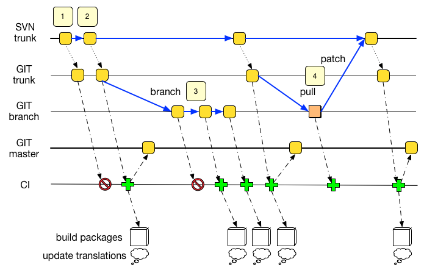

.. _testing_and_ci_strategy:

Testing and CI strategy
=======================

We evaluated a few different CI solutions (Travis, Cloudbees, drone.io)
and currently CircleCI seems to be the best option for what we want to
do.

-  opensource project can get up to 4 concurrent builds, for free
-  it is easy to setup and fully automated
-  it allows us to build, test and store the build results easily

Currently we can :

-  have automatic builds upon each commit in each branch of the
   repository
-  run automated routing tests using dbus, and capture a screenshot and
   gpx / geojson output of the result, and have that result archived in
   the CI resources and/or github
-  build binary packages ready for use. It's currently working for
   Android and Windows, for example.
-  push automatic updates to the Google Play Store

What is left to do ?

-  expand our `set of test
   cases <https://github.com/navit-gps/routing-qa>`__
-  build packages for more different platforms (iphone / wince / ubuntu
   ?)
-  push updates automatically to f-droid

Ressources available during a build

-  32x Intel(R) Xeon(R) CPU E5-2670 v2 @ 2.50GHz
-  4GB of RAM
-  ~ 550GB of disk space

Current limitations:

-  a single task cannot exceed 2 hours. This is causing issue for
   maptool. As a workaround, we have `split the world in different
   zones <https://github.com/navit-gps/maptool>`__, and had to
   sub-divide Europe in even smaller parts (each map is a branch so that
   it can be built individually). The list of maps and the latest
   generated map for this area is automatically updated and `available
   here <https://github.com/navit-gps/maptool/blob/master/maps.md>`__.
   These maps are usable for routing tests, but most of them are not
   available for real navigation because of the "flood" bug.

.. _proposed_git_ci_workflow:

Proposed GIT + CI workflow
--------------------------

This example should explain a few possible use cases:



   Git_workflow.png

Legend:

-  A blue arrow represents manual action
-  A small dashed arrow ( ... ) represents an automatic action triggered
   by a SVN hook
-  A long dashed arrow ( \_ \_ . \_ \_ . ) represents an automatic
   action manager by the CI server

Example (from the svn + git era, needs update) :

-  (1) A dev commits to SVN. The code is automatically merged into git,
   in the trunk branch, which triggers a build on the CI server. In this
   example, the tests (or build) fails, the workflow ends here. The
   git-master branch hasn't been updated, the code in this branch should
   still be functional.
-  (2) A dev commits a fix for the previous problem in SVN. The code is
   automatically merged into git, in the trunk branch, which triggers a
   build on the CI server. The tests succeed, the code is automatically
   merged into the 'master' branch, packages are built and translations
   templates are uploaded to launchpad. No action is required from the
   dev.
-  (3) A dev wants to work on an experimental feature. This could be a
   brand new functionality, a rewrite of a core component ( e.g.
   `project "high
   five" <https://github.com/navit-gps/navit/tree/highfive>`__ ) or even
   a branch related to a specific ticket in trac. He forks the git trunk
   in a branch for his feature. He can benefit from having the CI test,
   and if configured, build packages for his feature.

| `` git clone ``\ ```https://github.com/navit-gps/navit.git`` <https://github.com/navit-gps/navit.git>`__
| `` git checkout trunk # The branch we will create needs to be based upon 'trunk'``
| `` git checkout -b [name_of_your_new_branch] # We now create our own branch``

-  (4) The feature is now mature and is ready to be merged into the
   trunk. As we currently keep the SVN trunk as the main repository, we
   can't just merge the code into git trunk, which should only get
   updates from svn trunk. The correct way to merge the feature is:

   -  pull the latest code from git trunk to make sure that commits in
      svn trunk did not break the code in the branch, and merge that
      pull in the branch. This will trigger a CI test that will ensure
      the status of the branch

| `` git merge trunk``
| `` git push``

-  

   -  export that feature as a patch ( a diff between the branch, and
      git trunk).

`` git diff trunk``

-  

   -  patch svn trunk to merge the code. This will trigger another merge
      to git-trunk and a call to the CI workflow

.. _why_do_we_want_this:

Why do we want this?
''''''''''''''''''''

The whole point of this workflow is :

-  to ensure that we have a branch, somewhere, where the code is tested,
   and which we should never break ( this is master here )
-  to benefit from automated steps. Each commit in trunk triggers a
   regression test, `coverity code
   analysis <https://scan.coverity.com/projects/4193>`__ and package
   build ( instead of a daily build as we have currently )
-  to rebuild a documented, publicly available workflow. Some of the
   scripts that were used for the SVN workflow have an unclear license
   and we can't publish them
-  to leverage 3-rd party services and resources ( CircleCI provides 4
   containers for free for FLOSS projects ).

.. _ok_ive_pushed_my_commits_where_is_my_ci_output:

OK, I've pushed my commits, where is my CI output?
''''''''''''''''''''''''''''''''''''''''''''''''''

Completion of a CI run will be announced on `IRC <Contacts#IRC>`__. You
can also check at https://circleci.com/gh/navit-gps/navit to see if your
CI build has completed.

.. _but_wait:

But wait!
'''''''''

I already have my own awesome fork of Navit in github!

That's not a problem. Just add a remote pointing to navit-gps/trunk :

| `` git remote add navit-gps ``\ ```https://github.com/navit-gps/navit.git`` <https://github.com/navit-gps/navit.git>`__
| `` git remote update``

Now, checkout the remote trunk :

`` git checkout navit-gps/trunk``

You will probably end up in a "detached head" state. It's ok, just
create a local branch:

`` git checkout -b trunk``

Make sure that this branch is setup to track the remote :

`` git branch --set-upstream-to=remotes/navit-gps/trunk trunk``

Now, you have your own local copy of the trunk against which you can
branch, merge and update at will.

Don't forget to push your new branch upstream :

`` git push origin trunk``

Now, if you want to get the latest updates from svn :

| `` git checkout trunk``
| `` git pull``

And you can merge/fork on up-to-date code.

.. _it_wont_work_i_get_weird_merge_conflicts_for_files_ive_never_touched:

It won't work, I get weird merge conflicts for files I've never touched!
~~~~~~~~~~~~~~~~~~~~~~~~~~~~~~~~~~~~~~~~~~~~~~~~~~~~~~~~~~~~~~~~~~~~~~~~

The folder layout on github differs from that on SVN in one way: The
root folder on github corresponds to the *navit/* folder in SVN. Thus,
if you have used git-svn to create your local repo, you won't be able to
just add navit-gps/navit as another remote because folder layouts won't
match and merges will create a mess.

To work around this issue, do the following:

Clone *navit-gps/navit* into a new folder. We'll refer to this as the
navit-gps repo:

`` git clone ``\ ```https://github.com/navit-gps/navit.git`` <https://github.com/navit-gps/navit.git>`__\ `` FOLDER_NAME``

Check out trunk and pull:

| `` git checkout trunk``
| `` git pull``

In your git-svn repo, get the latest revision from SVN and merge it into
your feature branch, so your feature branch will be based on the latest
revision:

| `` git checkout master``
| `` git svn rebase``
| `` git checkout your-feature-branch``
| `` git merge master``

Now go back to the navit-gps repo. If you don't have a branch for your
feature yet, create one and check it out:

| `` git branch your-feature-branch``
| `` git checkout your-feature-branch``

If your feature branch exists already, do the following instead:

| `` git checkout your-feature-branch``
| `` git merge trunk``

Now you have two options. **Read them carefully and understand their
limitations and side effects,** then choose the one that works best for
your sitation:

-  Create a patch in your git-svn repo and apply it to the navit-gps
   repo. This works well for a freshly forked branch, but if the branch
   has had other commits since it was forked from trunk, the patch may
   fail to apply.
-  Copy the contents of the *navit/* folder in your git-svn repo into
   the root folder of the navit-gps repo, overwriting any existing
   files. This will work even for branches that had other commits since
   they were forked. **However, any changes that did not originate
   either from SVN trunk or your feature branch would be overwritten by
   this.** Also, this method will not catch any file deletions, and will
   create duplicates for moved files. If you decide to go this way, be
   sure to examine the changes in the git-svn repo before you stage
   them.

Now stage all changed files and commit.

Finally push your changes:

`` git push``

If you are updating an existing feature branch, you have pulled from
trunk earlier, thus pushing the changes will trigger a CI build. When
CircleCI detects that trunk has been merged into a branch, it will build
that branch. The build will include everything that got pushed together
with the merge, thus your changes will be included.

(to do: figure out how to trigger CI manually if I can't merge trunk
because it hasn't changed since the last push to the feature branch...)

.. _using_circleci_for_your_own_fork:

Using CircleCI for your own fork
--------------------------------

You may wish to use CircleCI for your own fork, so you can test commits
before you push them to the main repo. Thanks to the infrastructure
already being in place, setting up CircleCI for this is easy.

-  You need to be logged in to CircleCI. Since CircleCI supports Github
   logins, it is easiest to just open CircleCI by clicking the check
   mark or cross next to a commit in the main repo, then click Log In.
-  Click the plus sign on the middle to add a new project.
-  Choose the github account which owns the repo you want to add.
   Usually this is your personal account.
-  You will get a list of your repos. Check "Show forks" to have your
   fork of Navit show up in the list.
-  Click "Build project" to start a first build.
-  That's it! CircleCI will build Navit once (this currently takes some
   10–15 minutes). After that, every time you push to your repo, a
   CircleCI build will be triggered.
