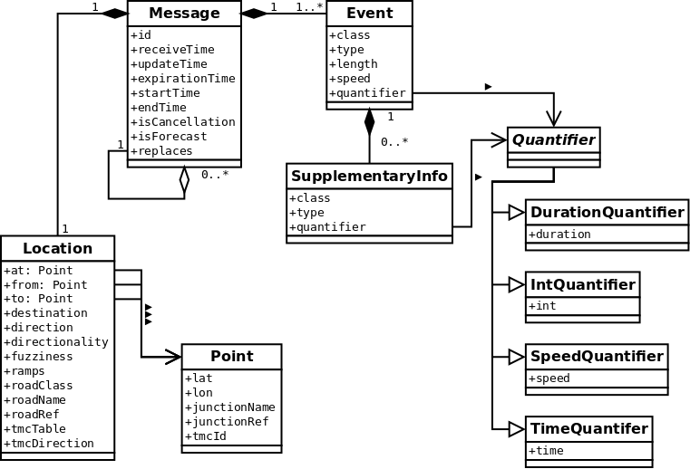
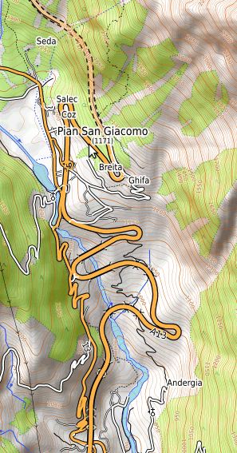

.. _traffic_data_model:

Traffic Data Model
==================

The data model Navit uses for traffic messages is based on the `TraFF
format <http://traffxml.org>`__, a universal traffic feed format.

Not every consideration that went into TraFF may apply to Navit—for
example, one use case is conversion of TMC messages into the feed format
without access to map data, which is not a scenario one would encounter
with Navit (map data is available, and reports outside the map coverage
area are safe to ignore).

Some parts of the specification may mention “data users”, “consumers” or
“applications”—all of these refer to Navit in this context.

As traffic support is still under development, some aspects may not have
been implemented yet.

   Traffic_Data_Model.png

Message
-------

A message is the atomic element of traffic information, referring to a
particular condition at a given location. Examples:

-  1 km of stationary traffic on the A8/A9 before Barriera Milano Nord
   in northwestbound direction.
-  L198 closed between Lech and Warth for at least the next day.
-  Heavy snowfall in the area of Vilnius.

Every message is identified by an alphanumeric identifier which
incorporates the identifier of the source from which the message
originated. No two messages with the same identifier can exist at the
same time.

+----------------+----------------------------------------------------+
| Field          | Description                                        |
+================+====================================================+
| id             | An identifier, which remains stable over the       |
|                | entire lifecycle of the message. The colon (:) is  |
|                | a reserved character to separate different levels  |
|                | of source identifiers from each other and from the |
|                | local message identifier.                          |
+----------------+----------------------------------------------------+
| receiveTime    | A timestamp indicating at what time the message    |
|                | was first received by the source. This attribute   |
|                | should be kept stable across all updates.          |
+----------------+----------------------------------------------------+
| updateTime     | A timestamp indicating at what time the last       |
|                | update to this message was received by the source. |
+----------------+----------------------------------------------------+
| expirationTime | A timestamp indicating when the message will       |
|                | expire if not updated. An expired message should   |
|                | be deleted or no longer be considered current.     |
|                |                                                    |
|                | If *end_time* is specified and is longer than      |
|                | *expiration_time*, *end_time* should be used to    |
|                | govern expiration and this attribute ignored.      |
|                |                                                    |
|                | The expiration time governs how consumers will     |
|                | treat a message if they do not receive any further |
|                | updates, e.g. because they lose the data           |
|                | connection. Sources should therefore choose the    |
|                | expiration time carefully: if a situation is not   |
|                | expected to resolve in a certain period of time,   |
|                | the expiration time should not be shorter.         |
|                | Conversely, if a situation is likely to have       |
|                | resolved within a certain period of time, the      |
|                | expiration time should not be longer than that.    |
+----------------+----------------------------------------------------+
| startTime      | A timestamp indicating when the condition is       |
|                | expected to begin.                                 |
+----------------+----------------------------------------------------+
| endTime        | A timestamp indicating how long the condition is   |
|                | expected to last.                                  |
+----------------+----------------------------------------------------+
| isCancellation | If true, this message is a cancellation message,   |
|                | indicating that existing messages with the same ID |
|                | should be deleted or no longer considered current. |
|                | All other attributes of a cancellation message     |
|                | should be ignored.                                 |
+----------------+----------------------------------------------------+
| isForecast     | If false, the message describes a current          |
|                | situation. If true, it describes an expected       |
|                | situation in the future.                           |
+----------------+----------------------------------------------------+
| replaces       | Identifiers of other messages which are replaced   |
|                | by this message, e.g. if multiple messages are     |
|                | being merged into one. The value of the current    |
|                | message’s *id* attribute is never included here,   |
|                | as any existing messages with the same identifier  |
|                | will be replaced anyway.                           |
+----------------+----------------------------------------------------+

Event
-----

An event refers to a condition, its cause or its effect. Examples:

-  Queuing traffic
-  Road closure
-  Accident

A message may contain multiple events. For example, if a road is closed
due to an accident, the message would report events for an accident and
a road closure.

Similar events may be grouped into event classes, for example:

-  Congestions: This class comprises various events for different types
   of congestion, such as heavy traffic, slow traffic or stationary
   traffic.
-  Hazards: This class includes events such as objects on the road,
   nearby fires, unprotected accident areas or black ice.
-  Restrictions: This includes closed lanes, complete road closures as
   well as temporary weight or size limits.

For a list of event classes and events, see `Traffic Event
List#Events <Traffic_Event_List#Events>`__.

+------------+--------------------------------------------------------+
| Field      | Description                                            |
+============+========================================================+
| class      | The event class (generic category).                    |
+------------+--------------------------------------------------------+
| type       | The event type, which uniquely identifies the event    |
|            | and can be mapped to a string to be displayed to the   |
|            | user.                                                  |
+------------+--------------------------------------------------------+
| length     | The length of the affected route in meters.            |
+------------+--------------------------------------------------------+
| speed      | The speed at which vehicles can expect to pass through |
|            | the affected stretch of road. This can either be a     |
|            | temporary speed limit or the average speed in          |
|            | practice, as implied by the event or whichever is      |
|            | less.                                                  |
+------------+--------------------------------------------------------+
| quantifier | Additional quantifier for events allowing this.        |
|            | Permissible data types and their meanings depend on    |
|            | the event type.                                        |
+------------+--------------------------------------------------------+

Supplementary Information
-------------------------

Supplementary information is extra information which can be added to an
event. Multiple supplementary information items can be added to the same
event. They are qualifiers, not events in their own right. Examples:

-  Vehicle types to which a restriction applies
-  Refinements to the position (e.g. in a tunnel, in the left lane)
-  Instructions to drivers (e.g. avoid the area, approach with care)

For a list of permitted values, see Traffic Event List -> :ref:`traffic_event_list_supplementary_information`.

+------------+--------------------------------------------------------+
| Field      | Description                                            |
+============+========================================================+
| class      | The supplementary information class (generic           |
|            | category).                                             |
+------------+--------------------------------------------------------+
| type       | The supplementary information type, which can be       |
|            | mapped to a string to be displayed to the user.        |
+------------+--------------------------------------------------------+
| quantifier | Additional quantifier for supplementary information    |
|            | types allowing this. Permissible data types and their  |
|            | meanings depend on the type.                           |
+------------+--------------------------------------------------------+

Quantifier
----------

Quantifiers can be used with events and with supplementary information.
The syntax is the same in both cases.

DurationQuantifier
~~~~~~~~~~~~~~~~~~

Specifies a duration, e.g. a delay.

IntQuantifier
~~~~~~~~~~~~~

An integer, e.g. number of distinct events, number of available parking
spaces.

SpeedQuantifier
~~~~~~~~~~~~~~~

A speed that does not refer to moving traffic (e.g. wind, queue length
increase/decrease). Note that the speed of moving traffic is expressed
through the *speed* field.

TimeQuantifier
~~~~~~~~~~~~~~

A timestamp, e.g. expected end of a condition.

Location
--------

Encapsulates the location data for the message.

Locations can occur in two different shapes:

-  Point location: These indicate that the message refers to a single
   point on the road, indicated by the *at* field. Values for *from*
   and/or *to* fields can also be specified (one of the two must be
   non-NULL if the location is unidirectional) and serve just as an
   indication of direction if *at* is specified.
-  Linear location: These indicate that the message refers to a stretch
   of road, starting at the location indicated by *from* and ending at
   the location indicated by *to* (if the location is bidirectional, the
   same goes for the opposite direction). The *at* field must be NULL.

Locations are thus represented by one or more coordinates. However,
coordinates come with several constraints:

-  Low accuracy: Some formats use a single point to represent multiple
   adjacent points in reality. For example, TMC generally represents
   motorway junctions as a single point, whereas physically they are
   really four distinct points (entry and exit in both directions).
-  Different map data: The encoding and decoding end may work with
   different maps, on which coordinates for the same feature may differ
   slightly. The same issue arises when the two sides use different
   versions of the same map: changed road layouts may be reflected in
   one map but not in the other.

TMC presents an additional challenge for ramps and connecting
carriageways at motorway junctions: these are represented by a single
coordinate pair (that of the junction). The fact that the message refers
to the ramps rather than the motorway, as well as the ramps affected,
must be inferred from event and/or supplementary information codes. The
direction is expressed through the direction of the motorway.

For this reason, extra information should be included where applicable
and available:

-  Road class
-  Road names and numbers
-  Junction names and numbers
-  Carriageways affected, if the message does not refer to the main
   carriageway

When matching a location to a map, data users should treat the above
information as hints, not as hard requirements, as different map data on
both ends may cause differences:

-  Maps may disagree on the road class, or the road class may have
   changed
-  Road names may be spelled differently (Via Rossi vs. Via Marco Rossi
   vs. Via Rossi Marco vs. Via privata Marco Rossi; Kowalskiego vs.
   ulica Kowalskiego; Jono Jonaičio gatvė vs. J. Jonaičio g.)
-  Road numbers may differ in delimiters (A4 vs. A 4 vs. A-4), case
   differences (SS342DIR vs. SS342dir), use of prefixes (DK 8 vs. 8; FFB
   11 vs. K FFB 11) or even different prefixes (A 8 vs. BAB 8); some
   sources even invent their own road numbers (TMC for local roads in
   Germany).

These possibilities need to be taken into account. Rather than opting
for a “match or no match” decision, data users should establish criteria
for ranking matches based on their quality.

|Compass directions such as “northbound” are ambiguous for some
stretches of this road|\ Linear features, as well as points located on
linear features, additionally have a directionality indicating the
direction of travel to which the report applies. Directionality is
expressed by an attribute marking the location as unidirectional or
bidirectional. For unidirectional locations, the direction can be
expressed in one of the following ways:

-  Linear features have an inherent directionality, expressed by
   ordering the points in the order in which they are passed (i.e. from
   the end of the queue to the obstruction).
-  For points located on linear features, the same can be achieved by
   two auxiliary points on the linear feature, one situated before, the
   other after the target location (as seen in the direction of travel).
   One of these points may coincide with the target location. If map
   data is available, this can be achieved by picking two points
   adjacent to the target location on the line feature. When translating
   TMC events, an offset in either direction can be used.
-  A compass direction, such as “northbound”. However, this may be
   ambiguous in situations as the one shown in the illustration: the
   point lies on a stretch of the road whose direction is contrary to
   the general direction of the road. What is southbound with respect to
   the whole road is northbound with respect to the stretch between the
   two adjacent turns, and vice versa. On ring roads, the concept of a
   compass direction has only local relevance. Global designators would
   be “clockwise” and “counterclockwise”, although this may be similarly
   difficult to establish in practice.
-  A destination on the road, such as “towards Chur” or “towards
   Bellinzona”. While this is easy to turn into a human-readable
   indication, it is difficult to translate into a direction on a map.
   This is only possible with map data to translate the destinations
   into coordinates, and unless the road in question is tagged with a
   matching destination, the destination indication suffers from similar
   ambiguities as a compass direction.

Therefore, it is advisable to rely on coordinates for directionality
wherever possible. A destination or a compass direction may be added for
easier representation in prose. In any case, compass directions should
be avoided in conflict situations where a road briefly turns against the
main direction of travel.

A location currently cannot span multiple roads, i.e. at least one of
the following must be true:

-  the road number remains unchanged throughout the location,
-  the road name remains unchanged throughout the location,
-  the stretch of road to which the location refers must not connect to
   any other road of the same or a higher category.

Some sections are shared by multiple roads and bear multiple road
numbers. They are considered as belonging to either road and may be
referenced by either number. A location may at the same time span a
shared section and no more than one of the roads it belongs to, and
reference them with the respective road number.

+----------------+----------------------------------------------------+
| Field          | Description                                        |
+================+====================================================+
| at             | If non-NULL, indicates a point location, i.e. the  |
|                | message refers to a single point on the road,      |
|                | indicated by this field.                           |
+----------------+----------------------------------------------------+
| from           | The starting point of the location, i.e. the       |
|                | coordinates at which the driver would first        |
|                | encounter the condition reported.                  |
+----------------+----------------------------------------------------+
| to             | The end point of the location, i.e. the            |
|                | coordinates at which the driver would encounter    |
|                | the end of the condition reported.                 |
+----------------+----------------------------------------------------+
| destination    | A destination, preferably the one given on road    |
|                | signs, indicating that the message applies only to |
|                | traffic going in that direction (e.g. “Milano”,    |
|                | “München”, “Vilnius”). Illegal for bidirectional   |
|                | locations.                                         |
+----------------+----------------------------------------------------+
| direction      | A compass direction indicating the direction of    |
|                | travel to which this message applies (e.g. “N”,    |
|                | “SE”). Discouraged for ring roads (including       |
|                | partial ring roads) or for sections which          |
|                | significantly deviate from the principal direction |
|                | of the main road; illegal for bidirectional        |
|                | locations.                                         |
+----------------+----------------------------------------------------+
| directionality | Indicated whether the message is unidirectional    |
|                | (valid only for the indicated direction) of        |
|                | bidirectional (valid for both).                    |
+----------------+----------------------------------------------------+
| fuzziness      | -  LOW_RES: Locations are constrained to a         |
|                |    predefined table; the actual extent of the      |
|                |    condition may be shorter than indicated.        |
|                | -  END_UNKNOWN: The end of the condition (where    |
|                |    drivers leave the affected stretch) is unknown, |
|                |    as is typical for a report by a driver who has  |
|                |    just encountered the end of a traffic jam.      |
|                | -  START_UNKNOWN: The start of the condition       |
|                |    (where drivers would first encounter it) is     |
|                |    unknown, as is typical for a report by a driver |
|                |    who has just passed an obstruction.             |
|                | -  EXTENT_UNKNOWN: It is unknown where the         |
|                |    condition begins and ends, as is typical for a  |
|                |    driver who is in the middle of a traffic jam.   |
+----------------+----------------------------------------------------+
| ramps          | -  ALL_RAMPS: Affects the entry and exit ramps     |
|                |    only.                                           |
|                | -  ENTRY_RAMP: Affects the entry ramp only.        |
|                | -  EXIT_RAMP: Affects the exit ramp only.          |
|                | -  NONE: No ramps are affected, i.e. the message   |
|                |    refers to the carriageways of the main road.    |
|                |                                                    |
|                | Any value other than NONE implies that only the    |
|                | specified ramps are affected while the main road   |
|                | is not. In that case, the road\* fields refer to   |
|                | the main road served by the ramp, not the ramp     |
|                | itself. This is mainly intended for compatibility  |
|                | with TMC, where junctions with all their ramps are |
|                | represented by a single point. Other sources       |
|                | should use coordinate pairs instead.               |
+----------------+----------------------------------------------------+
| roadClass      | The importance of the road within the road         |
|                | network. Represented as a Navit item type; values  |
|                | for motorway, trunk, primary, secondary, tertiary  |
|                | and a generic value for other types are allowed.   |
+----------------+----------------------------------------------------+
| roadName       | A road name (e.g. “Savanorių prospektas”, “Viale   |
|                | Certosa”, “Wasserburger Landstraße”). Do not use   |
|                | this attribute if the road name is not consistent  |
|                | throughout the entire location.                    |
+----------------+----------------------------------------------------+
| roadRef        | A road number (e.g. SP526). Do not use this        |
|                | attribute if the road number is not consistent     |
|                | throughout the entire location.                    |
+----------------+----------------------------------------------------+
| tmcTable       | For messages received via TMC, the country         |
|                | identifier (CID) and location table number (LTN or |
|                | TABCD) for the location table to be used for       |
|                | location lookup. The CID is the decimal number     |
|                | stored in the *COUNTRIES* and *LOCATIONDATASETS*   |
|                | tables, **not** the hexadecimal code from the PI   |
|                | (referred to as CCD in TMC).                       |
+----------------+----------------------------------------------------+
| tmcDirection   | For messages received via TMC, the direction of    |
|                | the road to which this message applies (positive   |
|                | or negative). Ignored for bidirectional messages.  |
+----------------+----------------------------------------------------+

Point
-----

A point represents a point on the road, which can either be a point
location or an endpoint of a linear location. It specifies a coordinate
pair and can optionally be supplemented with a junction name and/or
number where applicable.

+--------------+------------------------------------------------------+
| Field        | Description                                          |
+==============+======================================================+
| lat          | The latitude of this point.                          |
+--------------+------------------------------------------------------+
| lon          | The longitude of this point.                         |
+--------------+------------------------------------------------------+
| junctionName | The name of a motorway junction (e.g. “Lainate”).    |
+--------------+------------------------------------------------------+
| junctionRef  | The number of a motorway junction (e.g. 42).         |
+--------------+------------------------------------------------------+
| tmcId        | The TMC identifier of the point, for locations       |
|              | obtained via TMC. The following formats are allowed: |
|              |                                                      |
|              | -  LCID (e.g. 12345): Refers to the point identified |
|              |    by the LCID in the corresponding location table,  |
|              |    typically used with the primary location.         |
|              | -  LCID with offset (e.g. 12345+2, 12345-1): Refers  |
|              |    to a point that is the given number of “steps”    |
|              |    from the point with the indicated LCID, in the    |
|              |    direction specified. This is typically used with  |
|              |    the secondary location.                           |
+--------------+------------------------------------------------------+

