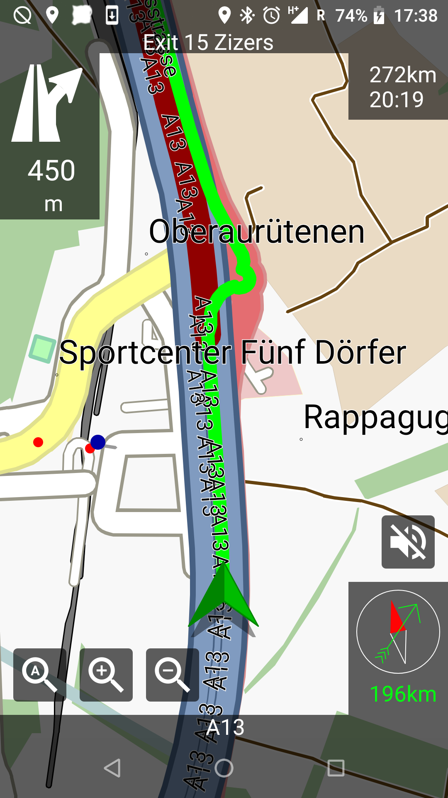
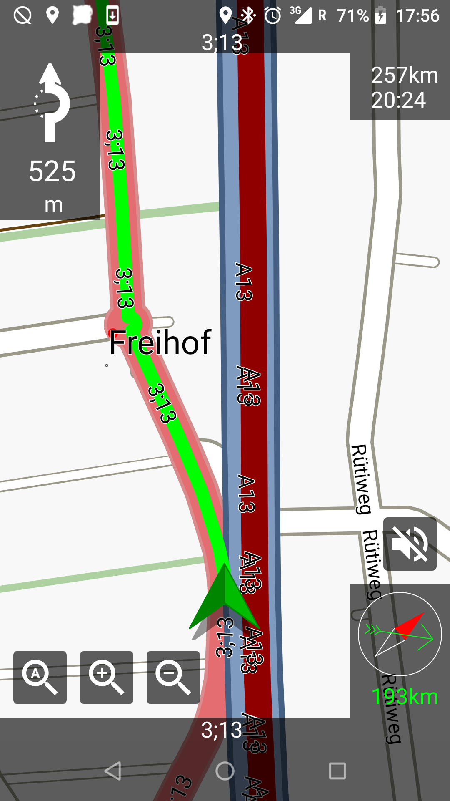
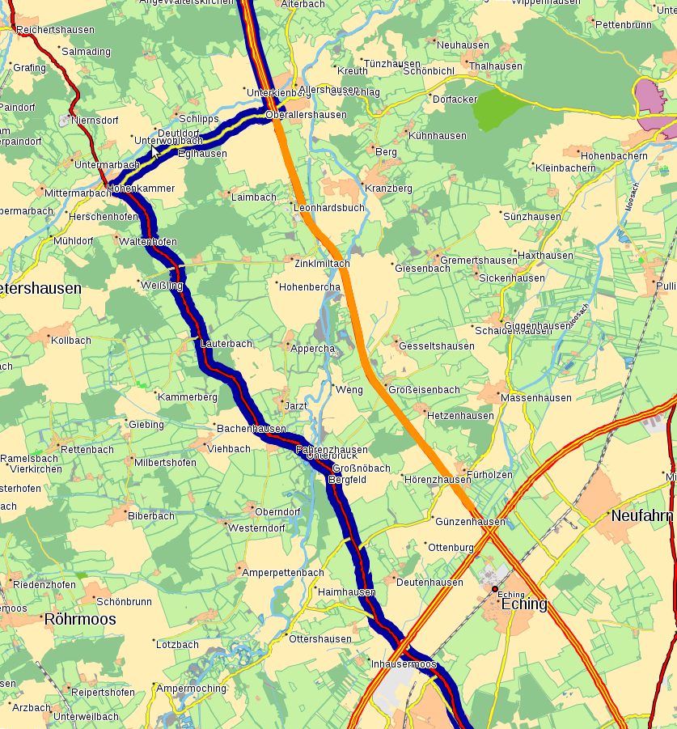

.. _traffic_in_navit:

Traffic in Navit
================

|Navit on Android routing off the motorway…|\ |…around a traffic
distortion…|\ |…seen here|\ |Route avoiding a traffic distortion (route
in blue, traffic distortion in orange)|

Traffic support in Navit is currently (as of August 2019) available on
Android only. On recent builds, all you need is another app which
supplies traffic information.

Until October 2018, Navit lacked full support for routing around traffic
problems, although the routing engine has had the core functionality for
many years. Full traffic support, i.e. receiving traffic reports and
routing around congestions, is currently an experimental feature and
still under development. Follow the latest developments on the
`traffic <https://github.com/navit-gps/navit/tree/traffic>`__ branch if
you’re interested in seeing how it works, or are interested in
contributing. The `project
board <https://github.com/navit-gps/navit/projects/8>`__ will give you
an idea of what is currently being worked on, and where we are looking
for contributions.

.. _using_traffic_information_in_navit:

Using Traffic Information in Navit
----------------------------------

Here is a brief overview of TraFF backends and platforms:

+-------------------+-----------------------+-----------------------+
| Module            | Platforms             | Status                |
+===================+=======================+=======================+
| ``traff_android`` | Android               | Included and enabled  |
|                   |                       | by default since      |
|                   |                       | 7ecccd4 (August 20,   |
|                   |                       | 2019) or v0.5.5       |
+-------------------+-----------------------+-----------------------+
| ``traff_http``    | Linux, possibly       | Under development,    |
|                   | others                | still in a branch     |
+-------------------+-----------------------+-----------------------+
|                   |                       |                       |
+-------------------+-----------------------+-----------------------+

If a traffic plugin for your platform is included and enabled by
default, you are ready to go. If it is included but not enabled, you can
enable it by editing navit.xml and adding a like similar to the
following before the element:

Replace ``traffic_foobar`` with the name of the traffic module you wish
to use, and ``attr="value"`` with any attributes your module requires.

You may still find Navit sending you through what appears to be an
obstruction on the map: While the map only shows obstructions with no
further details, Navit’s internal data model is more detailed and
estimates travel times based on the information it gets. If the impact
of the obstruction on travel times is minimal (or not enough to justify
a detour), Navit will still send you through the affected stretch of
road because it is still the cheapest option.

traff_android
~~~~~~~~~~~~~

If you are running an old build which includes the ``traff_android``
module but does not enable it by default, the line to add to navit.xml
(see above) is:

The Android plugin does not use any attributes.

Now fire up your app and pick up some messages—they should also appear
in Navit, and if they affect your route, Navit will try to find a
cheaper way around them if there is one.

Qz
^^

You need `Qz <https://f-droid.org/packages/com.vonglasow.michael.qz/>`__
version 2.0.0 or later, as well as:

-  A receiver supported by Qz:

   -  GNS FM9-BT (requires Bluetooth): this receiver comes in a
      permanently installed and a pluggable variant; the permanently
      installed one is recommended for its superior reception
   -  One of the various Si470x-based USB tuners (requires USB OTG)

-  A decent antenna for the receiver (stub or pigtail antennas are
   generally insufficient)
-  Being in an area with a free-to-air TMC service supported by Qz
   (Austria, Germany, Italy and Switzerland are known to work, Benelux,
   Denmark, Slovakia, Slovenia, Spain and Sweden might also work)

Once you have all of these, fire up Qz, connect your receiver and see if
you get any messages. If you don’t see any messages in Qz, most likely
your antenna setup is insufficient (TMC is quite sensitive to reception
quality). Check the Qz wiki for known issues. Or you might be in an area
without a TMC service supported by Qz—areas in which Qz works are
currently limited to parts of Western and Central Europe.

RoadEagle
^^^^^^^^^

Another TraFF app is
`RoadEagle <https://gitlab.com/traffxml/roadeagle>`__, currently under
development and still in experimental status. It is not on F-Droid
yet—for the moment you can either grab the latest build from the `CI
artifacts <https://gitlab.com/traffxml/roadeagle/-/pipelines>`__, or
build it from source. RoadEagle does not require any special hardware
but you do need a data connection. It currently has support for Poland,
Lithuania and Latvia; support for other countries is being added.

Fire up RoadEagle and choose your information sources in Settings. After
that, RoadEagle should load traffic messages from the sources you have
chosen. These should also appear in Navit.

traff_http
~~~~~~~~~~

This plugin is still in early development stage. In order for
``traff_http`` to work, your platform must currently support POSIX
threads (support for Windows is under development), and
`libcurl <https://curl.se/libcurl/>`__ must be available at build time
and at run time. This works if you are building Navit on Linux and
running it locally; others are currently untested.

You will need to configure the plugin manually, e.g.:

``interval`` is the interval (in milliseconds) at which you would like
Navit to poll the source. The example has 600000 msec, or 10 minutes.

``source`` is the URL for the TraFF server from which you are getting
messages.

So far you need to run your own TraFF server.
https://gitlab.com/traffxml/traff-server (by the author of the plugin)
is a TraFF server package, consisting of a Java servlet to handle
subscriptions, a HSQLDB database as a storage back-end, and a receiver
daemon which polls upstream sources for messages and converts them to
the TraFF exchange format. It is still in the early stages of
development and may thus still be a bit rough around the edges.

.. _traffic_data_in_navit:

Traffic Data in Navit
---------------------

Internally, Navit uses *traffic distortions* to model traffic issues
which may affect the choice of route. A traffic distortion can represent
the following:

-  Slow traffic: speed on the affected segment is below the posted limit
   (or whatever Navit assumes the default speed for the segment to be),
   e.g. because of dense traffic or because of temporary speed limits.
   This is represented by setting ``maxspeed`` to the expected speed.
-  Delays: there are waiting times or other time penalties on the
   affected segment. This is represented by setting ``delay`` to the
   expected delay.
-  Closures: the segment is closed to all traffic. This is represented
   by setting ``maxspeed`` to zero.

Both ``maxspeed`` and ``delay`` can be set at the same time and their
effects will add up.

Traffic distortions are just map items, denoted by the
``type_traffic_distortion`` type, and can be stored in any map.

When evaluating traffic distortions, Navit would originally (up to
October 2018) just look at the item type, ``maxspeed`` and ``delay``,
ignoring other attributes. This meant that:

-  Traffic distortions would always apply to both directions of the
   affected segment, one-way distortions being only possible for roads
   with segregated carriageways, which are mapped as two separate,
   parallel ways.
-  Navit lacked support for vehicle-specific traffic distortions (e.g.
   size restrictions, closures for certain vehicle types, different
   waiting times for trucks and passenger cars).

The traffic branch changed that by introducing access flags for traffic
distortions. They work similarly to access flags on ways, where they
specify which modes of transportation can use the way, and in which
direction. For traffic distortions, they specify the modes of
transportation and the directions to which this particular traffic
distortion applies.

.. _previous_usage:

Previous Usage
--------------

Prior to the traffic branch, traffic distortions were already used
internally in limited ways (all of which continue to work).

Traffic distortions are (ab)used to generate penalties for turning
around if these are defined in the current vehicle profile. This is done
in *route.c*, in the ``route_path_new()`` function, which can be used as
an example for inserting traffic distortions into the route graph. (See
`#Dynamic Traffic Reports <#Dynamic_Traffic_Reports>`__ for other
options to get traffic distortions to the routing engine.)

Traffic distortions can also be entered manually through the GUI, though
this is not supported by all GUIs and should probably be considered an
experimental feature. See `#GUI <#GUI>`__.

GUI
---

**The GTK GUI has menu items to enter traffic distortions, but they
don’t work in a straightforward manner.** If you find Navit happily
routing even over the segment you just marked as closed, read on.

All the menu items do is write the segment and its traffic distortion to
a map in `textfile <textfile>`__ format called *distortion.txt*, found
in Navit’s data dir. However, that file doesn’t do anything unless it is
added to the active mapset. Apparently this is a feature that never got
fully implemented to the point of being usable out of the box.

.. _traffic_distortion_in_maps:

Traffic Distortion in Maps
--------------------------

Traffic distortions are map items and can (presumably) be stored in any
map, whether in memory or read from a file. As mentioned under
`#GUI <#GUI>`__, this is what happens with traffic distortions entered
manually through the GTK GUI—they get written to a
`textfile <textfile>`__ map. Here’s an example of its contents:

::

   type=traffic_distortion maxspeed=0
   0x13a07c 0x5e9634
   0x139e87 0x5e98ae
   type=traffic_distortion maxspeed=10
   0x139f22 0x5d6a5a
   0x139ec5 0x5d6a13
   0x139e88 0x5d69e7
   0x139e83 0x5d69e4
   type=traffic_distortion delay=3600000
   0x13a0f3 0x5d6a41
   0x13a101 0x5d6a33
   0x13a110 0x5d6a29
   0x13a154 0x5d6a03

The first line for each distortion is the item data: item type (always
``traffic_distortion`` here) and its attributes. The following lines are
the coordinates for the affected segment.

In the default configuration, that file doesn’t do anything as it is
just written to, but never read. You can change that by adding the
following line to the active mapset in your *navit.xml* file:

.. code:: xml

   <map type="textfile" enabled="yes" data="distortion.txt"/>

Restart Navit, and it will route around the distortions you have just
entered. Note that no path is necessary for the map created by GTK GUI,
as the it resides in Navit’s default data path.

Changes to this file will not be picked up immediately, because Navit
lacks a notification mechanism for changes to the map.

In order to see the new distortions on the map, you will need to redraw
it (which happens automatically in a moving vehicle if the map follows
the vehicle).

In order to route around the new distortions, you will need to stop
navigation and set the destination again (which will cause a new route
graph to be built—simply recalculating the route is also not sufficient,
because that still uses the same route graph). Navit has no way to tell
routing about the changes, and the currently used `Dijkstra
algorithm <https://en.wikipedia.org/wiki/Dijkstra%27s_algorithm>`__ does
not support partial updates.

This is being changed in the traffic branch. First, when a traffic
message is received, that will always trigger a map redraw, causing
traffic distortions to show up in the map as soon as they are received.
Also, the routing algorithm was changed to
[https://en.wikipedia.org/wiki/Lifelong_Planning_A\ \* LPA*], which
supports partial updates. Thus, when a traffic distortion changes, Navit
will automatically recalculate the cheapest route.

API
---

**This refers to Navit up to October 2018. The traffic branch introduced
additional API functions.**

The only function to edit traffic distortions is found in *route.c*:

.. code:: c

   static void
   route_graph_set_traffic_distortion(struct route_graph *this, struct route_graph_segment *seg, int delay);

   **Sets or clears a traffic distortion for a segment.**

   This sets a delay (setting speed is not supported) or clears an
   existing traffic distortion. Note that, although setting a speed is
   not supported, calling this function with a delay of 0 will also
   clear an existing speed constraint.

   {\| class="wikitable"

!colspan="2" style="text-align:left;"|Parameters \|- \|\ ``this`` \|\|
The route graph \|- \|\ ``seg`` \|\| The segment to which the traffic
distortion applies \|- \|\ ``delay`` \|\| Delay in tenths of a second,
or 0 to clear an existing traffic distortion \|- \|}

Limitations:

-  This function prototype is not part of the header file, i.e. not part
   of the public API. Currently, it is only used internally.
-  There is currently no way to set a *maxspeed* or closure. However,
   calling ``route_graph_set_traffic_distortion()`` with a zero delay
   will unset any existing traffic distortion.

.. _dynamic_traffic_reports:

Dynamic Traffic Reports
-----------------------

To get dynamic traffic reports into Navit (and remove them again when
they are no longer valid), we have the following options:

+----------------------+----------------------+----------------------+
| Option               | Pros                 | Cons                 |
+======================+======================+======================+
| Maintain a textfile  | -  Distortions are   | -  Configuration     |
| map and include a    |    persistent across |    (including legacy |
| reference in the     |    relaunches (may   |    navit.xml) can    |
| default mapset       |    not be needed if  |    easily break this |
|                      |    the reports from  |    feature without   |
|                      |    which they        |    any hint at the   |
|                      |    originate are     |    reason it doesn’t |
|                      |    kept persistent)  |    work              |
|                      | -  Can be extended   | -  Some coding       |
|                      |    to future traffic |    effort (existing  |
|                      |    event types (such |    code only         |
|                      |    as hazard         |    supports          |
|                      |    warnings)         |    addition; updates |
|                      | -  Good efficiency   |    and removals      |
|                      |    as distortions    |    still need to be  |
|                      |    can be reused     |    implemented)      |
|                      |    between routes    |                      |
+----------------------+----------------------+----------------------+
| Add distortions via  | -  Little coding     | -  Not easily        |
| ``route_graph_set_tr |    effort (call an   |    extensible to     |
| affic_distortion()`` |    existing          |    traffic events    |
| or similar           |    function, or a    |    other than        |
|                      |    similar one still |    distortions       |
|                      |    to be             | -  No persistence    |
|                      |    implemented)      |    (unless traffic   |
|                      | -  Not vulnerable to |    reports leading   |
|                      |    misc              |    to distortions    |
|                      | onfiguration/failure |    are kept          |
|                      |    to update legacy  |    persistent)       |
|                      |    configurations    | -  Efficiency is     |
|                      | -  Insertions and    |    presumably not    |
|                      |    removals well     |    optimal as        |
|                      |    tested (updates   |    distortions need  |
|                      |    should be easy    |    to be             |
|                      |    too)              |    re-generated for  |
|                      |                      |    each new route    |
+----------------------+----------------------+----------------------+
| Separate (in-memory) | -  Cleanest          | -  More coding       |
| map driver, similar  |    solution,         |    effort (but       |
| to route map         |    consistent with   |    similar           |
|                      |    the rest of Navit |    constructs        |
|                      | -  Can be extended   |    already exist)    |
|                      |    to future traffic | -  No persistence    |
|                      |    event types (such |    (unless traffic   |
|                      |    as hazard         |    reports leading   |
|                      |    warnings)         |    to distortions    |
|                      | -  Not vulnerable to |    are kept          |
|                      |    misc              |    persistent)       |
|                      | onfiguration/failure |                      |
|                      |    to update legacy  |                      |
|                      |    configurations    |                      |
|                      | -  Good efficiency   |                      |
|                      |    as distortions    |                      |
|                      |    can be reused     |                      |
|                      |    between routes    |                      |
+----------------------+----------------------+----------------------+
|                      |                      |                      |
+----------------------+----------------------+----------------------+

If we assume that traffic distortions are generated out of traffic
reports (which may affect multiple segments), and that the reports are
kept persistent at least throughout their validity period, then the last
option (separate in-memory map driver) is a one-off coding effort but
provides the biggest benefit in the long run. The textfile map option
may work as a quick win in an early dev phase (e.g. to verify proper
processing of traffic messages) but is not suitable for production use
due to its limitations.

For this reason, the traffic branch implements an in-memory map driver.

.. _matching_traffic_reports_to_map_items:

Matching Traffic Reports to Map Items
-------------------------------------

The first iteration of the traffic module has close links with the
`TraFF format <http://traffxml.org>`__, developed by the author of the
traffic module. In the first use case, messages are received from an
external source, which converts them from `TMC <TMC>`__. For this reason
location referencing is similar to TMC: the start and end points are
given, along with some attributes which help identify the road. The
TraFF converter adds extra auxiliary points to locations for which TMC
supplies only one point, or for locations on ring roads.

Unfortunately, the points do not always correspond precisely with the
roads on the map. TMC is particularly nasty in that it reduces even
motorway junctions to one single point, although the entire junction can
be as much as 1,000 meters or more across. Even then, unambiguously
matching the points to a road does immediately give us the segments
connecting them.

Other sources (with TraFF converters) also exist by now; many of them
offer better accuracy for their reference points.

The traffic module deals with inaccuracies in location references by
using a variation of the routing algorithm.

Cost is primarily calculated based on the length of each segment. If the
location specifies attributes for the road (such as the road type, road
number or road name), then these are compared to the attributes of the
segment, and the segment length is multiplied with a penalty factor. If
all attributes match, the length of the segment is used unchanged; for
poor matches the assumed cost may be multiple times the segment length.

Since the start and end points may be off-road, we assume each point in
the route graph has an imaginary link to them, which is, however, more
expensive than even a poorly-matched road. Initially, each point is
initialized with the cost of getting to the end of the end point over
that imaginary link. Then points are evaluated based on the cost of
their neighbors and the segments linking them. When all is finished, the
point for which the sum of its cost and the cost of reaching it from the
start point is lowest is assumed to be the start point of the affected
stretch of road.

If the message comes from a source with low resolution (e.g. TMC, which
is limited to road junctions and a few chosen landmarks on roads), then
attributes of the points are used to refine the match.

For three-point locations, this is done twice, and the two resulting
stretches of road are then concatenated.

For single-point locations (with one or two auxiliary points), the
resulting stretch of road is then truncated to the one segment.

Limitations of this method:

-  This work only for traffic locations with two points, or three if
   they are spaced reasonably far apart. The data model is currently
   limited to three points anyway, but this limitation may become an
   issue (and need to be revised) if we want to support sources which
   rely on more detailed representations of the road geometry. That will
   require an extension of the TraFF format, discussed
   `here <https://gitlab.com/traffxml/traff/issues/10>`__.
-  Identifying the road by its attributes does not work well if the
   affected stretch of road comprises multiple roads with different
   attributes. This is not a problem with TMC, where messages never span
   multiple roads. Most other formats seem to have similar restrictions.
-  If the stretch of road affected is not the shortest connection
   between the points (corrected for attributes), this will give
   incorrect results. With the TMC messages tested so far (which come
   with attributes to identify the road), this has seldom caused any
   problems (the only one being a serpentine road in the Alps).
-  When a road is closed due to roadworks for a longer period of time,
   it is commonly tagged ``highway=construction`` in OSM, which causes
   it to disappear from the Navit map. When a closure report arrives for
   the same road, Navit may end up marking the detour as closed. See
   `#644 <https://github.com/navit-gps/navit/issues/644>`__ for details.
-  Traffic distortions cannot apply to parts of a segment—where defined,
   they are valid for the entire length of the segment. This is not a
   major issue with TMC or other sources which always supply junctions
   as end points, as every junction in the road network also terminates
   a segment. Other sources, however, allow start or end points anywhere
   on the road (such as Polish road information on RoadEagle)—here Navit
   may end up showing an affected section longer or shorter than what
   the source reports.

