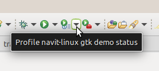
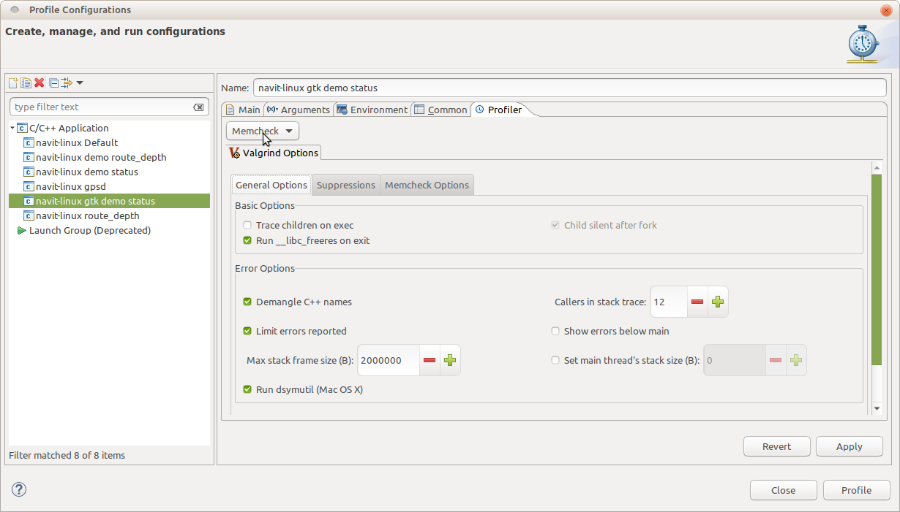

Eclipse
=======

Eclipse is a widely used and very flexible IDE to make coding more
efficient. Of course, it can be used for developing Navit:

Install
-------

We will combine the usual CMake environment, which is used to configure
the Navit build process and

-  Check navit's `dependencies <dependencies>`__ and install necessary
   native tools and libraries
-  Install newest Eclipse with your package manager or manually
-  Start Eclipse and install the following extensions (Help -> Install
   software):

   -  CDT
   -  autotools
   -  cmake4eclipse
   -  Valgrind (from Linux Tools,
      http://wiki.eclipse.org/Linux_Tools_Project/PluginInstallHelp;
      software site: http://download.eclipse.org/linuxtools/update) is
      highly recommended. This will install Valgrind extensions for
      Eclipse; you will also need to install Valgrind using your
      distribution’s package manager.
   -  If you're developing for Android, you will also need Andmore
      (https://projects.eclipse.org/projects/tools.andmore) or ADT
      Plugin
      (http://developer.android.com/sdk/eclipse-adt.html#downloading).

Android developers: ADT used to be the standard tool for Android
development on Eclipse. Since Google has moved to Android Studio, ADT is
no loner maintained. Andmore is an Eclipse project based on ADT code. It
is a near drop-in replacement for ADT (though ADT projects need to be
converted once to work with Andmore, see the FAQ at
https://github.com/eclipse/andmore/wiki/FAQ.)

.. _project_setup:

Project Setup
-------------

Setting up Eclipse requires cmake4eclipse, which is available from
Eclipse Marketplace. (Previous versions relied on CMake to generate a
project that could then be imported in Eclipse, but this is now
deprecated for reasons listed below.) Build artifacts get placed in a
separate folder in the source tree, which helps us keep the source tree
clean in a similar way as cmake does, making version control a whole lot
easier.

We assume that the source code for all your projects resides in
``~/src`` and that you use ``~/workspaces`` as the base directory for
your Eclipse workspaces. Navit source code then goes in ``~/src/navit``
and the project dir inside your workspace will be called
``navit-linux``. This is not a must – you can use different path names,
but remember to adapt the paths below.

To avoid committing any build artifacts or Eclipse housekeeping
information, ensure your ``.gitignore`` file contains the following
entries:

::

   /.cproject
   /.project
   /.settings/
   /build/

If you have in your branch history (i.e. if you forked from trunk or
merged trunk after May 23, 2018), this is already in place and you don’t
have to do this yourself any more.

-  Clone the git repo if you haven't already:

   -  If you don't have commit rights:

      -  ``cd ~/src``
      -  ``git clone``\ ```https://github.com/navit-gps/navit.git`` <https://github.com/navit-gps/navit.git>`__

   -  If you have commit rights to the Navit repo:

      -  ``cd ~/src``
      -  ``git clone git@github.com:navit-gps/navit.git``

   -  If you have your own fork of Navit, clone your own repo instead.

-  Start Eclipse with a new workspace, ``~/workspaces/navit``.
-  Then, import the project to Eclipse

   -  In your Eclipse workspace, do **File > New > C Project**
   -  Enter ``navit-linux`` as the project name. Uncheck **Use default
      location**, and instead browse to ``~/src/navit``. Select
      **Executable > Empty Project** as the project type, and accept
      **Linux GCC** as the toolchain.

-  Right-click the new project in your workspace and edit its
   properties:

   -  Under **C/C++ Build**, on the **Builder Settings** tab, ensure
      **Generate Makefiles automatically** is checked
   -  Under **C/C++ Build > Tool Chain Editor**, set **CMake Builder
      (portable)** as the current builder

-  The default working directory to run the program is the project root
   directory, but navit is located in 'navit' subdirectory and it needs
   the working directory to be the same to run properly.

   -  Go to **Run > Run configurations... > Arguments**
   -  Select as working directory **~/src/navit/build/Debug/navit**

-  If you get the error **Gtk-WARNING \**: cannot open display:** when
   running

   -  Go to **Run > Run configurations... > Environment**
   -  Add the environment variable **DISPLAY** with value **:0**

That's it! You can now build, run and debug Navit right from Eclipse.

.. _run_configurations:

Run Configurations
~~~~~~~~~~~~~~~~~~

If you want to try out different command line options (e.g. run Navit
with a different config file), you can do so by going to **Run > Run
Configurations...** and creating a new run configuration.

.. _migrating_from_a_cmake_generated_project_setup:

Migrating from a CMake-Generated Project Setup
~~~~~~~~~~~~~~~~~~~~~~~~~~~~~~~~~~~~~~~~~~~~~~

If you followed our old instructions and used CMake to generate a
project configuration to import in Eclipse, it is strongly recommended
that you upgrade:

-  CMake’s CDT makefile generator appears to be unmaintained and has
   caused some problems in the past (specifically, upgrading from Luna
   to Oxygen seems to break a couple of things, breaking code indexing
   and flagging errors where there aren’t any)
-  The previous Notes and Limitations section no longer applies:

   -  With cmake4eclipse, source files no longer appear in two different
      places in the tree, leaving you to wonder which is the correct one
      to edit
   -  Changes to the CMake setup take effect instantly (presumably—not
      yet tested in practice)
   -  Team features (git access from Eclipse) now work in the intended
      manner

If you set up your Eclipse project with a CMake-generated configuration
and want to switch to cmake4eclipse, follow the steps below. Don’t
panic—your run/debug configurations remain in place, you just need to
adapt paths in two places (and we’ll explain how).

-  Delete the ``navit-linux`` project from your workspace
-  In your navit workspace dir, rename the ``navit-linux`` subdir to
   ``navit-linux-cmake`` (any other name is fine too, or move it
   somewhere completely different)
-  Import the project as described above (reusing your existing
   workspace instead of creating new one)
-  Update your build configurations:

   -  Set ``~/src/navit/build/Debug/navit/navit`` as the C/C++
      executable
   -  Select as working directory **~/src/navit/build/Debug/navit**

-  Build Navit once
-  If you have anything from your former ``navit-linux`` dir to salvage
   (e.g. ``navit.xml``, ``center.txt``, ``destination.txt``), copy it
   from ``navit-linux-cmake`` to ``~/src/navit/build/Debug``.

.. _android_development:

Android Development
-------------------

Android development is a bit more challenging than Linux development
because we'll be dealing with two independent (but nested) source trees
– the C code and the Android-specific Java code. You can see and edit
the Java files with the above setup, but you'll get a lot of annoying
error messages, and most of Eclipse's code analysis features won't work
for the Java code.

This can be solved by importing the Java code as a separate project
(which can go in the same workspace). Unfortunately we can't just import
the whole thing as an Android project because Eclipse expects an
AndroidManifest.xml file – which we can't provide because Navit's
toolchain generates that file during build. But there's a workaround.

In order to complete all the steps, you need to build Navit once from
the command line as described in `Android development#With
cmake <Android_development#With_cmake>`__. (For convenience, you can
create the respective build directory in your workspace dir.) If you
don't, you won't be able to complete all of the steps. You can skip them
for the moment and do them once you have built Navit. Eclipse will still
be able to make sense of the code, but you will have files in your
workspace (such as AndroidManifest.xml) which have nothing to do with
Navit.

Here's how to do it:

-  Make sure you have a workspace set up for Navit as described above.
-  In your workspace, do **File > New > Android Application Project**.
-  In the dialog that opens, make the following settings:

   -  Application Name: Navit
   -  Project Name: navit-android (again, you can choose a different
      name if you wish)
   -  Package Name: org.navitproject.navit
   -  Minimum Required SDK: 7
   -  Target SDK: 19 (as of this writing)
   -  Compile With: accept the default value
   -  Theme: Holo Dark

-  Click **Next** and on the next page, make the following settings:

   -  Create custom launcher icon: **uncheck**
   -  Create activity: **uncheck**
   -  Mark this project as a library: **uncheck**
   -  Create Project in Workspace: **check**

-  Click Finish and you will get a new, still empty project.
-  Delete the ``src`` folder of your new project.
-  Do **File > New > Folder**. In the dialog that opens, click
   **Advanced** to reveal all options, then make the following settings:

   -  Parent folder: ``navit-android`` (or whatever you chose as the
      project name above)
   -  Folder name: ``src``
   -  Advanced options: Select **Link to alternate location (Linked
      folder)** and set the path to ``~/src/navit/navit/android/src``
      (we recommend browsing for the folder rather than entering the
      name directly).

-  Repeat the same two steps for the ``libs`` and ``res``, deleting the
   default folders and replacing each with a link to its counterpart in
   the source dir.
-  Right-click the ``src`` folder and select **Build path > Use as
   source folder** from the menu
-  Right-click the ``navit-android`` folder (or your project's root
   folder) and do **New > File**. In the dialog that opens, click
   **Advanced** to reveal all options, then make the following settings:

   -  Parent folder: ``navit-android`` (or whatever you chose as the
      project name above)
   -  File name: leave blank (will be filled in automatically)
   -  Advanced options: Select **Link to file in the file system** and
      set the path to
      ``~/src/navit/navit/android/AndroidManifest.xml.cmake`` (we
      recommend browsing for the folder rather than entering the name
      directly).

-  Repeat the same steps to replace the default ``AndroidManifest.xml``
   with a link to ``navit/android/AndroidManifest.xml``, which resides
   in your cmake build dir for Android. (This requires having built
   Navit once.)
-  Right-click ``AndroidManifest.xml``, choose **Properties** and check
   the **Derived** option. (This will tell Eclipse to give you a warning
   when you try to edit the file.)
-  (Optional) Right-click ``AndroidManifest.xml.cmake`` and select
   **Open With > Text Editor** to tell Eclipse to open its own editor
   for the file instead of launching an external one.
-  Restart Eclipse. (This step may not be necessary but during our tests
   Eclipse had trouble matching declarations to packages, resulting in
   features like Jump to Declaration and Call Hierarchy not working
   across source files. Restarting Eclipse fixed this.)

And you have the Android code in a separate project, with the usual
syntax features available here.

.. _notes_and_limitations:

Notes and Limitations
~~~~~~~~~~~~~~~~~~~~~

-  Open Java files from your Android project, not from the Linux one.
   (Those will work too and point to the exact same files, but syntax
   features will only work from the Android project.)
-  Team features (git integration) still won't work, so you'll have to
   stick with your external git UI.
-  Building from Eclipse probably won't work yet with this setup. You
   will still need to build your .apk from the command line as described
   in `Android development#With
   cmake <Android_development#With_cmake>`__.

.. _potential_further_improvements:

Potential Further Improvements
~~~~~~~~~~~~~~~~~~~~~~~~~~~~~~

If anyone wants to have a go: Figure out how to build an .apk from
Eclipse. Prerequisites will likely include:

-  Creating a cmake build dir for Android and running cmake from the
   command line once
-  Possibly linking further dirs from the Android build dir into the
   project (e.g. ``gen``, ``bin``)
-  Triggering a build of the native code with cmake (adding custom
   builders to the project)
-  Ensuring the APK builder picks up the native libraries we built
   (possibly accomplished by linking to the respective dirs)

Valgrind
--------

Valgrind is a powerful debugging and profiling tool. It is available as
a command-line tool, but the Eclipse plugin makes it a lot more
convenient to handle (among others, no commands to remember and the
ability to jump directly to the line of code that got flagged). By
examining a program’s actions as they are executed, it can detect errors
that are otherwise hard to track down. Its Memcheck component can
notably detect:

-  Use of uninitialized memory
-  Reading/writing memory after it has been freed
-  Reading/writing beyond the end of an allocated memory block
-  Memory leaks (such as allocating memory which never gets freed)

All of these can be spotted fairly quickly with Valgrind, possibly
saving you several hours of debugging (as the author of these lines will
happily confirm). If you’re getting any kind of spurious behavior, it’s
a good idea to run things through Valgrind and see if it’s caused by any
of the errors listed above.

.. _getting_started:

Getting Started
~~~~~~~~~~~~~~~

To start Navit and profile it with Valgrind, use the Profile command. It
is located next to its Debug and Run siblings in the toolbar:



   Eclipse_Profile_Button.png

Usage is straightforward and mostly similar to Run and Debug. However,
Memcheck will not present a result until the program has terminated
(either regularly or by being killed).

The Run and Debug configurations are shared with the Profile
configurations. Profile configurations have an additional tab, shown
below:



   Eclipse_Profile_Configuration.png

The most important setting is the profiling tool to run, right at the
top of the tab. Memcheck is selected here. You can leave the other
options as they are (unless you know what you are doing—but then you
probably won’t need those instructions).

.. _working_with_valgrind:

Working with Valgrind
~~~~~~~~~~~~~~~~~~~~~

Valgrind will only spot errors if the faulty code actually gets
executed. Therefore, before you request a merge of your new code, run a
few test cases while profiling them with Valgrind. If you are trying to
hunt down a particular error, try to reproduce it with Navit running in
Valgrind.

Be aware that behavior (including if and how certain bugs manifest
themselves) can be slightly different with Valgrind: Timing is
different, as the code will appear to run on a processor that is some 20
times slower than your actual CPU, therefore race conditions may play
out differently. Memory is arranged differently, as Memcheck “pads” each
allocated block with some buffer bytes on each end to detect
out-of-boundary accesses, thus some invalid memory operations will
behave differently.

If you are experiencing a bug that seems to disappear as soon as
Valgrind is involved:

-  Reproduce the error without Valgrind, and record the exact steps to
   reproduce it.
-  Profile Navit with Valgrind and execute the same steps again. Even if
   you do not get the erroneous behavior you noticed before, the faulty
   code probably got executed and Valgrind picked up any invisible
   errors it found.
-  Examine Valgrind’s output, and fix whatever error got flagged.
-  Run the test again while profiling with Valgrind, and verify that you
   have eliminated the error report you got before.
-  Now test without Valgrind to verify the error has actually been
   fixed.

.. _debugging_endless_loops:

Debugging Endless Loops
-----------------------

If Navit stops responding but is maxing out one CPU core, but you can’t
figure out where you ran into an endless loop, here’s how to find out:

Make sure you have started Navit using the **Debug** functionality in
Eclipse. When Navit stops responding, run the following from a shell:

.. code:: bash

   killall -CONT navit

This will halt the Navit process, give you a stack of the current call
trace and allow you to inspect variables—basically the same you can do
when Navit terminates abnormally during debug. Except here you can just
hit Continue and repeat the exercise as often as you like. Examine the
call stack (if needed, also comparing different debug sessions) and you
will get an idea of where it is hanging.

.. _old_instructions:

Old instructions
----------------

The previous instructions were based on a different infrastructure
(notably SVN) and took a slightly different approach. If you'd like to
tinker, here they are:

.. _setup_project:

Setup project
~~~~~~~~~~~~~

-  Start a new project, pick import SVN

   -  svn co svn://svn.code.sf.net/p/navit/code/trunk/navit

-  Select C/C++ project
-  Choose now GNU Autotools(if there is nothing under toolchains install
   autotools(autoconf,automake/gettext) via your os packagemanager)
-  Open a terminal, switch to your workspace navit folder and invoke
   "cmake ./"

   -  you now have makefile that matches your local setup

-  In Eclipse, pick "build all" and you should get a binary
-  Run as application and you your local build should start

.. _doing_navitandroid_development_with_eclipse_incomplete:

Doing Navit/Android development with Eclipse **INCOMPLETE**
~~~~~~~~~~~~~~~~~~~~~~~~~~~~~~~~~~~~~~~~~~~~~~~~~~~~~~~~~~~

This guide assumes you already have the source downloaded locally, and
have already built a package for Android using CMake (see `Linux
development <Linux_development>`__).

-  Download Eclipse

   -  http://www.eclipse.org/downloads/
   -  Eclipse Classic is fine

-  Install Eclipse

   -  Unzip to directory of your choice
   -  Start Eclipse by going into your *eclipse* folder, and running
      **eclipse**
   -  Setup a new workspace when prompted

-  Setup JDT plug-in

   -  *Help -> Install new software*
   -  *Work with*: from the dropdown box, select *Indigo
      -*\ http://download.eclipse.org/releases/indigo
   -  Wait!
   -  Select *Eclipse Java Development Tools*
   -  *Next*
   -  *Finish*
   -  *Restart*

-  Install ADT plugin

   -  Use Google's instructions at
      http://developer.android.com/sdk/eclipse-adt.html#downloading
   -  Then follow the instructions at
      http://developer.android.com/sdk/eclipse-adt.html#configuring

-  Import Navit

   -  *File -> New -> Project...*
   -  *Android -> Android Project*
   -  *Next*
   -  *Project Name:* -> *NavitProject*
   -  *Create project from existing source*
   -  *Location:* browse to the directory *navit/android/* **within**
      your `cmake build
      directory <Navit_SVN_installation_on_Linux#CMake>`__.
   -  *Next*
   -  *Build Target* -> check *Android 2.2*
   -  *Next*
   -  *Finish*
   -  *Project -> Properties*
   -  *Java Build Path* from left hand window
   -  *Libraries* tab
   -  *Add JARs*
   -  *NavitProject -> libs -> TTS_library_stub.jar*. *OK*
   -  *Java Compiler* from left hand window
   -  *Apply* on message window
   -  *Compiler compliance level:* -> **1.6**
   -  *OK*
   -  *Yes*

And then the project should be clean of errors besides the only one
stating that android_layout_default.xml is not well-formed. That's sad
true. That file is indeed not an xml document but a fragment of one. *Do
we have some setting to switch this check off? Should we rename that
file?*
