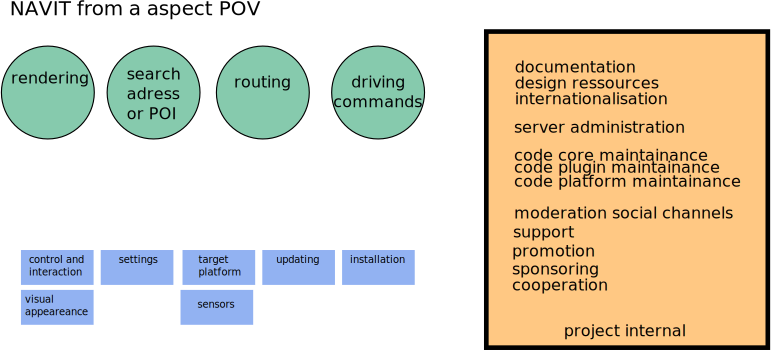
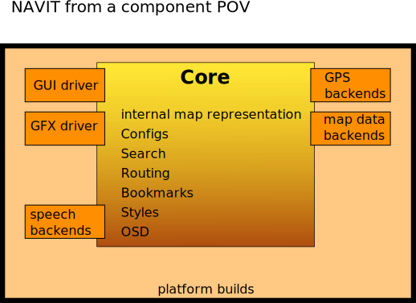

Development
===========

Process
-------

|Aspects of our project| Here the `team <team>`__ collects everything
about navit development.

Planning
~~~~~~~~

-  `Brainstorming <Brainstorming>`__
-  `Usability <Usability>`__
-  `Changelog <Changelog>`__

Coding
~~~~~~

-  `Programming guidelines <Programming_guidelines>`__
-  `Commit guidelines <Commit_guidelines>`__
-  `Eclipse <Eclipse>`__
-  `Submitting patches <Submitting_patches>`__

internals:

-  `Plugin <Plugin>`__
-  `Graphic driver development <Graphic_driver_development>`__
-  `GUI development <GUI_development>`__
-  `Map driver <Map_driver>`__
-  `Search Development <Search_Development>`__
-  `Routing <Routing>`__

external control:

-  `Embedding <Embedding>`__
-  `Dbus <Dbus>`__
-  `Bookmarks Development <Bookmarks_Development>`__
-  `Command interface <Command_interface>`__

Building
~~~~~~~~

-  `CMake <CMake>`__
-  `Dependencies <Dependencies>`__
-  `Build server <http://download.navit-project.org/navit/>`__
-  `Build logs <http://download.navit-project.org/logs/navit/>`__

Ressources
~~~~~~~~~~

-  `Translations <Translations>`__
-  `Internal GUI/Menu
   configurations <Internal_GUI/Menu_configurations>`__
-  `OSD Layouts <OSD_Layouts>`__
-  `Vehicle profile flags <Vehicle_profile_flags>`__
-  `Configuration <Configuration>`__

Testing
~~~~~~~

This is detailed in the `Testing and CI
strategy <Testing_and_CI_strategy>`__ page.

Packaging
~~~~~~~~~

We currently have an `build
server <http://download.navit-project.org/logs/navit/stats.html>`__, but
the package generation is quiet scattered. We might change this to a
continuous integration server later.

Platforms
---------

-  `Linux development <Linux_development>`__
-  `Android development <Android_development>`__

   -  `Augmented Reality <Augmented_Reality>`__

-  `Ångström development <Ångström_development>`__
-  `OpenEmbedded development <OpenEmbedded_development>`__
-  `Openmoko development <Openmoko_development>`__
-  `Scratchbox development <Scratchbox_development>`__
-  `TomTom development <TomTom_development>`__
-  `Windows development <Windows_development>`__
-  `WinCE development <WinCE_development>`__
-  `MacOS development <MacOS_development>`__

Maps
----

-  `OpenStreetMap <OpenStreetMap>`__
-  `Maps <Maps>`__
-  `Item def.h <Item_def.h>`__

Architecture
------------

|components of our project| Navigation systems offer a lot of
functionality. To be flexible and allow a whole community to work on the
code, Navit is split into several components and `plugins <plugin>`__.

.. _maps_storage:

Maps storage
~~~~~~~~~~~~

-  `Binfile <Binfile>`__
-  `CSV <CSV>`__
-  `Textfile <Textfile>`__

Visual
~~~~~~

-  Map Graphics drivers

-  `Map style <Map_style>`__

-  `Custom POIs <Custom_POIs>`__

-

   -  `OSD <OSD>`__ - for internal UI

Routing
~~~~~~~

Search
~~~~~~

-  address
-  POIs

Speech
~~~~~~

-  driving instructions
-  TTS

GPS
~~~

Internals
~~~~~~~~~

-  `Configs <Configuration/Full_list_of_options>`__
-  `Bookmarks <Bookmarks_Development>`__
-  `Command interface <Command_interface>`__

