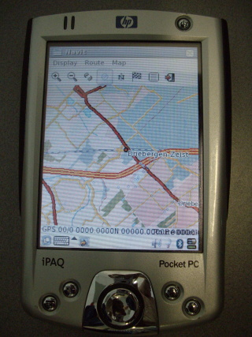
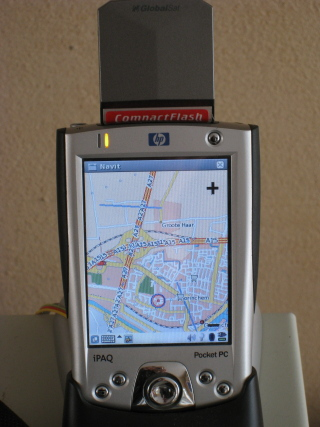

.. _ångström_development:

Ångström development
====================

.. _installing_navit_on_the_hp_h2210_ipaq:

Installing Navit on the HP H2210 ipaq
-------------------------------------

| |Navit on iPAQ H2210|
| =Intro= I tried to build Navit cvs for my HP H2210 ipaq using the
  `OpenEmbedded cross-compile
  environment <http://www.openembedded.org>`__. Later i did the `same
  for the Nokia n810 <Navit_on_OpenEmbedded_for_n810>`__.
| These notes were made during the process. It's sort of a howto.
| It is by no means perfect or complete but shows my progress at this
  time (may/june 2008) with the issues needing attention. Maybe, by the
  time you reed this, the issues I found are already fixed, or new ones
  popped up. Feedback is welcome.
| The H2210 is running the
  `Ångström <http://www.angstrom-distribution.org/introduction-0>`__
  2007.12 Linux distribution from SD card.
| My PC is running `Fedora <http://fedoraproject.org/>`__ 9 on AMD
  x86_64.

Notes
'''''

| First read the info from
  http://wiki.openembedded.net/index.php/Getting_Started
| Then set up the build environment with the info from
  http://www.angstrom-distribution.org/building-angstrom
| In build/conf/local.conf add:

| `` ENABLE_BINARY_LOCALE_GENERATION=0``
| `` PREFERRED_VERSION_dbus-native="1.2.1" ``
| `` PREFERRED_VERSION_navit="cvs"``

In the org.openembedded.stable/packages/navit directory you edit SRC_URI
and EXTRA_OECONF in navit_cvs.bb:

| `` SRC_URI = "``\ ```svn://navit.svn.sourceforge.net/svnroot/navit/trunk;module=navit;proto=https`` <svn://navit.svn.sourceforge.net/svnroot/navit/trunk;module=navit;proto=https>`__\ ``"``
| `` EXTRA_OECONF = "--disable-binding-python --disable-gui-sdl --disable-samplemap --enable-avoid-float --enable-avoid-unaligned  --disable-binding-dbus --enable-gui-gtk --disable-postgresql --disable-graphics-sdl"``

and add in navit_cvs.bb:

`` DEPENDS = "gtk+ libglade"``

Then in navit.inc, comment out the RRECOMMENDS:

| `` DESCRIPTION = "Navit is a car navigation system with routing engine."``
| `` LICENSE = "GPL"``
| `` DEPENDS = "glib-2.0 gtk+"``
| `` #RRECOMMENDS = "gpsd speechd flite"   <---``
| `` ....``

If you didn't already, get the dev tree:

`` git clone ``\ ```git://git.openembedded.org/openembedded`` <git://git.openembedded.org/openembedded>`__\ `` org.openembedded.dev``

| Copy over dbus-native-1.2.1.bb, dbus-1.2.1 directory and dbus.inc from
  the org.openembedded.dev tree to the org.openembedded.stable tree.
| Edit gmp-native.inc and add:

`` LDFLAGS += " -Wl,--allow-multiple-definition "``

Then go to the main dir of the build environment (/stuff) and type:

`` bitbake navit``

| The system will be busy for some time.
| *Drink some coffee...*
| Meanwhile go to http://www.angstrom-distribution.org/repo/ and get and
  install flite for your CPU and for Ångström 2007.12. For h2200, the
  CPU is arm5vte.
| Maybe you need more, if so, please let us know.
| When the bitbake build is ready, go to the angstrom-tmp/deploy
  directory to find your packages. Install and configure as described
  `Configuration <Configuration>`__.
| |Internal gui on iPAQ H2210| E.g. try the `Internal
  GUI <Internal_GUI>`__ for a graphical menu, fullscreen map,
  `OSD <On_Screen_Display>`__, etc.
| Relevant bugs:
  `4344 <http://bugs.openembedded.net/show_bug.cgi?id=4344>`__
| `4324 <http://bugs.openembedded.net/show_bug.cgi?id=4324>`__
| `4338 <http://bugs.openembedded.net/show_bug.cgi?id=4338>`__
| `4367 <http://bugs.openembedded.net/show_bug.cgi?id=4367>`__
| `4373 <http://bugs.openembedded.net/show_bug.cgi?id=4373>`__
| `4348 <http://bugs.openembedded.net/show_bug.cgi?id=4348>`__ Can be
  ignored as it appears
| Also see `this
  email <http://lists.linuxtogo.org/pipermail/openembedded-stablebranch/2008-May/000090.html>`__.
| Usefull reading: `bitbake
  manual <http://bitbake.berlios.de/manual/>`__.

Later
'''''

Later, september 2009, I found out that one needs automake-native
version 1.10.2, so I copied over the automake package directory from
.dev to .stable and added

| ``PREFERRED_VERSION_automake="1.10.2"``
| ``PREFERRED_VERSION_automake-native="1.10.2"``

to local.conf.

Problems
''''''''

bitbake
~~~~~~~

| bitbake 1.8.12 didn't work as well as 1.8.10.
| ====Libs==== For my build I had to change the plugins block in
  navit.xml to make the libs found:
|

| ``       ``\
| ``       ``\
| `` ``\

| Please note the '.*' at the end of the first plugin path.
  Alternatively you can attempt to install the navit-dev package which
  has the correct .so links.
| ====Alsa and flite==== I still need some help/info to get flite
  working standalone; I now get:

| `` $ flite -t test``
| `` ALSA lib pcm_plug.c:773:(snd_pcm_plug_hw_refine_schange) Unable to find an usable access for '(null)'``
| `` audio_open_alsa: failed to set number of channels to 1. Invalid argument.``

System sounds work. Flite doesn't. Stereo audio goes well with aplay,
mono gives the error.

| First of all need to rename /etc/ssoundrc to /etc/asound.conf.
| Further path to a solution:
| Add a working mono to stereo thingie to /etc/asound.conf.
| Recompile flite with not 'default' as default device but the mono to
  stereo converter.
| The asound.conf that's needed:

| `` #``
| `` # simple dmix configuration``
| `` #``
| `` pcm.dsp0 {``
| ``   type plug``
| ``   slave.pcm "dmix"``
| `` }``
| `` ctl.mixer0 {                                                                                        ``
| ``   type hw                                                                                         ``
| ``   card 0                                                                                          ``
| `` }                                                                                                   ``
| ``                                                                                                   ``
| `` pcm.!default{                                                                                       ``
| ``   type plug                                                                                           ``
| ``   slave.pcm "10to20"                                                                                  ``
| `` }                                                                                                   ``
| ``                                                                                                   ``
| `` pcm.10to20 {                                                                                        ``
| ``   type route                                                                                          ``
| ``   slave.pcm hw:0                                                                                      ``
| ``   slave.channels 2                                                                                    ``
| ``   ttable.0.0 1                                                                                        ``
| ``   ttable.0.1 1``
| `` }                                                                                                   ``

This gives:

| `` root@h2200:/etc$ aplay -D10to20 /usr/share/gpe-conf/activate.wav ``
| `` Playing WAVE '/usr/share/gpe-conf/activate.wav' : Signed 16 bit Little Endian, Rate 44100 Hz, Mono``
| `` aplay: set_params:879: Broken configuration for this PCM: no configurations available``

| `` root@h2200:/etc$ aplay -Dplug:10to20 /usr/share/gpe-conf/activate.wav ``
| `` Playing WAVE '/usr/share/gpe-conf/activate.wav' : Signed 16 bit Little Endian, Rate 44100 Hz, Mono``
| `` ALSA lib pcm_params.c:2152:(snd_pcm_hw_refine_slave) Slave PCM not usable``
| `` aplay: set_params:879: Broken configuration for this PCM: no configurations available``

But also:

| `` root@h2200:~$ flite -t test``
| `` ALSA lib pcm_params.c:2152:(snd_pcm_hw_refine_slave) Slave PCM not usable``
| `` audio_open_alsa: failed to get hardware parameters from audio device. Invalid argument``

| Any ideas on how to fix this or even investigate this?
| *Wishie has looked into this on #alsa*
| I also started asking about this on the festlang-talk mailinglist.
  From interaction with Nickolay I patched the alsa code to flite to
  force stereo. Then flite starts producing sound but still has issues:
  internally flite thinks about mono audio while the soundcard is in
  stereo after my small patch.
| I can reproduce the mono thing on the PC. If I build flite there it
  also decides to produce mono wavs,just as on the ipaq. So there might
  be something in the alsa patch for flite...
| Where does flite decide to produce mono sound?

local.conf
----------

Below is the local.conf I used, it might be usefull.

| `` # Where to store sources ``
| `` DL_DIR = "/home/user/downloads" ``
| `` # Which files do we want to parse: ``
| `` BBFILES := "/usr/src/ipaq/org.openembedded.stable/packages/*/*.bb" ``
| `` BBMASK = "" ``
| `` # ccache always overfill $HOME.... ``
| `` CCACHE="" ``
| `` # What kind of images do we want? ``
| `` IMAGE_FSTYPES = "jffs2 tar.gz " ``
| `` # Set TMPDIR instead of defaulting it to $pwd/tmp ``
| `` TMPDIR = "/usr/src/ipaq/${DISTRO}-tmp/" ``
| `` # Make use of my SMP box ``
| `` PARALLEL_MAKE="-j2" ``
| `` BB_NUMBER_THREADS = "1" ``
| `` # Set the Distro ``
| `` DISTRO = "angstrom-2007.1" ``
| `` # 'uclibc' or 'glibc' or 'eglibc' ``
| `` #ANGSTROM_MODE = "glibc" ``
| `` MACHINE = "h2200" ``
| `` ENABLE_BINARY_LOCALE_GENERATION=0``
| `` PREFERRED_VERSION_dbus-native="1.2.1"``
| `` PREFERRED_VERSION_dbus="1.2.1"``
| `` PREFERRED_VERSION_navit="cvs"``
| `` PREFERRED_VERSION_mtd-utils="1.1.0"``
| `` INHERIT += "insane"``
| `` QA_LOG=1``

.. _globalsat_bc_337_cf_gps:

Globalsat BC-337 CF GPS
-----------------------

|Navit on iPAQ H2210 w/ Globalsat BC-337| I got me a CF GPS because it
would be handy to use while on the move, together with the H2210 ipaq.
SD card for
`Ångström <http://www.angstrom-distribution.org/introduction-0>`__ and
Navit. CF for the GPS. After inserting the card, dmesg gives me:

| `` <5>[2414239.760000] pccard: PCMCIA card inserted into slot 0``
| `` <5>[2414239.760000] pcmcia: registering new device pcmcia0.0``

Nothing more. Stuff sorta works:

| `` root@h2200:/boot$ pccardctl status``
| `` Socket 0:``
| ``  5.0V 16-bit PC Card``
| ``  Subdevice 0 (function 0) [unbound]``
| `` root@h2200:/boot$ pccardctl ident``
| `` Socket 0:``
| ``  product info: "CF CARD", "GENERIC", "", ""``
| ``  manfid: 0x0279, 0x950b``
| ``  function: 2 (serial)``

So no driver bound to the card. In #oe I learnt from hrw that i might
need this
`patch <http://git2.kernel.org/?p=linux/kernel/git/torvalds/linux-2.6.git;a=commit;h=9d9b7ad717474636dc961e6c321970fd799e1cb3>`__.
The process then becomes:

`` bitbake -c clean virtual/kernel``

then apply `Koen's
patch <http://lists.linuxtogo.org/pipermail/angstrom-distro-devel/2008-August/002428.html>`__
to defconfig and

`` bitbake -cconfigure virtual/kernel``

then apply the small `kernel
patch <http://git2.kernel.org/?p=linux/kernel/git/torvalds/linux-2.6.git;a=commit;h=9d9b7ad717474636dc961e6c321970fd799e1cb3>`__,
and edit 8250.c according to this
`info <http://osdir.com/ml/handhelds.linux.kernel/2005-06/msg00064.html>`__
to avoid conlicts between serial_cs (8250) and PXA serial device names.
Then:

`` bitbake virtual/kernel``

Install the kernel, and do

``ipkg install kernel-module-8250_2.6.21-hh20-r16_h2200.ipk kernel-module-serial-cs_2.6.21-hh20-r16_h2200.ipk.``

| After installing the kernel and rebooting we now get, when we insert
  the GPS:

| `` <5>[  155.760000] pccard: PCMCIA card inserted into slot 0``
| `` <5>[  155.760000] pcmcia: registering new device pcmcia0.0``
| `` <6>[  155.900000] Serial: 8250/16550 driver $Revision: 1.90 $ 2 ports, IRQ sharing disabled``
| `` <7>[  156.090000] pcmcia_resource: pcmcia_socket0: odd IO request: base 0x3f8 align 0x100``
| `` <4>[  156.090000] pcmcia: request for exclusive IRQ could not be fulfilled.``
| `` <4>[  156.090000] pcmcia: the driver needs updating to supported shared IRQ lines.``
| `` <4>[  156.140000] ttyS0: detected caps 00000700 should be 00000100``
| `` <6>[  156.140000] 0.0: ttyS4 at I/O 0xc4960400 (irq = 30) is a 16C950/954``

We can now set up the GPS using this
`document <http://www.usglobalsat.com/downloads/NMEA_commands.pdf>`__.




