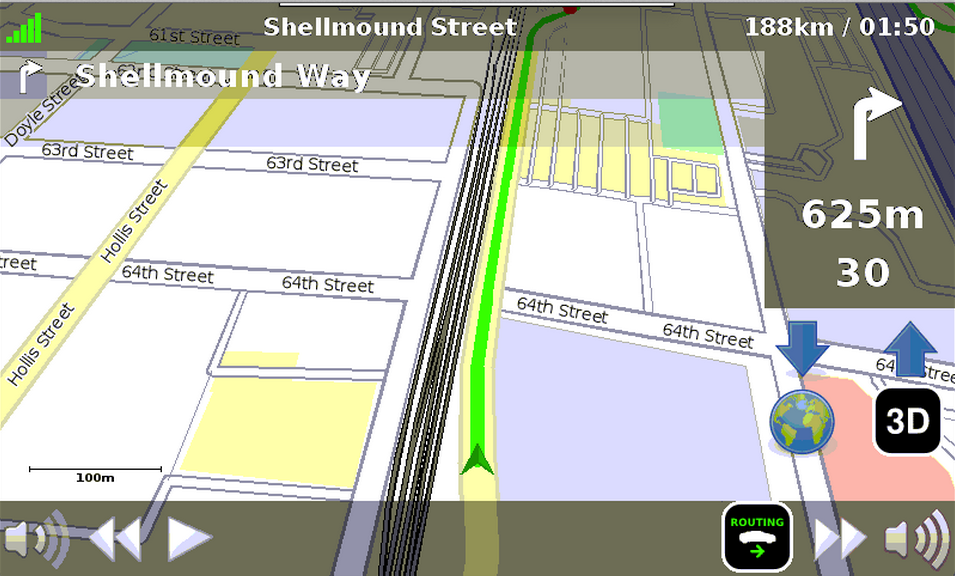

###################
Navit's User Manual
###################

This document is the official User Manual for `Navit`__,
the Open Source vector based navigation software.

Navit is a open source (GPL) car navigation system with routing engine.

It's modular design is capable of using vector maps of various formats for routing and rendering of the displayed map. It's even possible to use multiple maps at a time.

The user interfaces are designed to work well with touch screen displays. Points of Interest of various formats are displayed on the map.

The current vehicle position is either read from gpsd or directly from NMEA GPS sensors.

The routing engine not only calculates an optimal route to your destination, but also generates directions and even speaks to you.

Navit currently speaks over 70 languages!

Navit is highly customizable, from map layouts and on-screen display to the details of the routing engine.

.. toctree::
   :hidden:
   :glob:
   :numbered:
   :maxdepth: 2
   :caption: Navit's user manual

   user/getting_started
   user/platforms/index
   user/configuration/basic/index
   user/configuration/advanced/index
   user/community/index
   user/faq/index

.. Indices and tables
.. ------------------

.. * :ref:`genindex`
.. * :ref:`modindex`
.. * :ref:`search`

.. __: https://github.com/navit-gps/navit/

.. toctree::
   :hidden:
   :maxdepth: 2
   :glob:
   :caption: Navit's developer documentation

   development/changelog_wrapper
   development/programming_guidelines
   development/commit_guidelines
   development/targets
   development/concepts

.. toctree::
   :hidden:
   :maxdepth: 1
   :glob:
   :caption: Other Documents

   privacy
