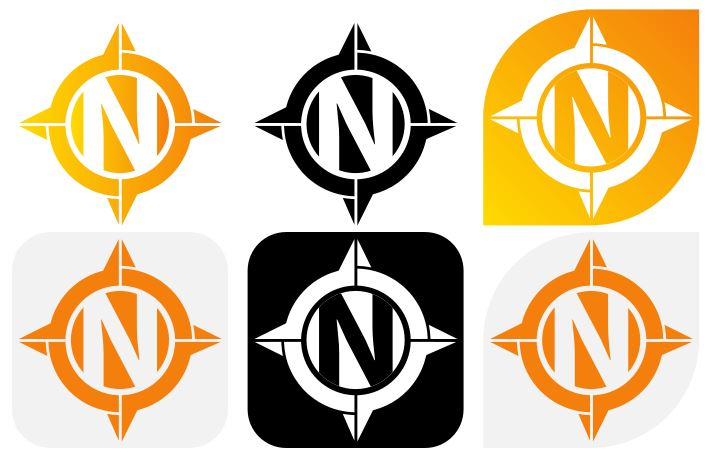

Logo
====

This site is about the logo of Navit

shapes
------

| |LogosV2.JPG|
| `SVG <https://wiki.navit-project.org/images/6/6e/Navit_logoV2_full_vect_no_font.svg>`__

font
----

.. _color_codes:

color codes
-----------

| color gradient
| RGBA
| ffda00ff |ffda00ff.JPG|
| f57f0cff |f57f0cff.JPG| black and white

.. _logo_used_at:

logo used at
------------

-  website

   -  Main website favicon (on https://www.navit-project.org/)
   -  Main website logo
      (https://www.navit-project.org/assets/images/logo.png)
   -  Navit forum (https://forum.navit-project.org/)
   -  Github website (https://github.com/navit-gps/)
   -  Sourceforge website (https://sourceforge.net/projects/navit/)
   -  Trac website (http://trac.navit-project.org/)
   -  Wikipedia page (https://en.wikipedia.org/wiki/Navit)
   -  Twitter (https://twitter.com/NavitProject)

-  wiki (https://wiki.navit-project.org)
-  app stores

   -  google play
   -  f-droid
   -  openrepos

-  app

   -  Android application icon in apk (file res/drawable-*/icon.png)
   -  Internal GUI menu about
   -  GTK GUI window icon
   -  Qt icons?

.. |ffda00ff.JPG| image:: ffda00ff.JPG
.. |f57f0cff.JPG| image:: f57f0cff.JPG
