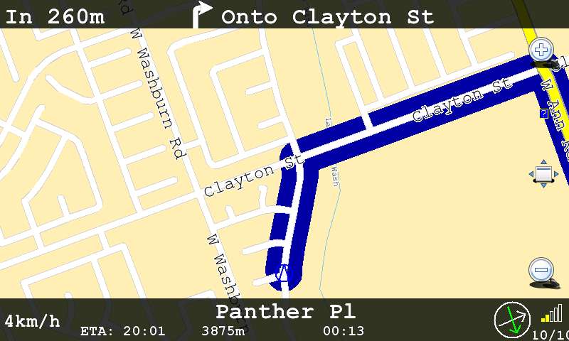
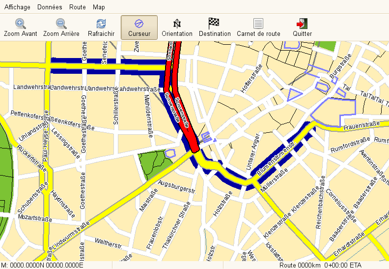

.. _configuration_old:

Configuration (old)
===================

Foreword
========

|300px \|thumb|Structure of the default navit.xml| Setting up Navit is
done by editing a configuration file. Unless specified, it is called
"navit.xml". When launching, Navit will look for it in the following
order:

-  The first argument supplied on the command line, e.g.: navit
   /home/myusername/navittestconfig.xml
-  The navit.xml file in ~/.navit/navit.xml : e.g :
   /home/myusername/.navit/navit.xml. This is probably to best place to
   customize your settings.
-  The navit.xml.local file in the current directory. Used mainly for
   development, but maybe also useful for you.
-  The navit.xml file in the current directory.

If you are working with a SVN checkout, you will find a preconfigured
sample in navit/navit.xml. If you installed Navit via any installation
software, it should have installed a global navit.xml somewhere on your
system (usually /usr/share/navit or /etc/navit). In either case, make a
copy of the file to one of the four locations mentioned above.

Now **editing** this file in a text editor is simple. It's just a plain
text XML file. Any operating system provides a text editor, like
TextEdit on Mac OS X, vi on Linux or Notepad on Windows. You could also
use an xml editor like `xml copy
editor <http://xml-copy-editor.sourceforge.net/>`__, the editor can
check the syntax of your file. And you can easily collapse and expand
entire sections (Like, hide the whole "Car" layout). Just remember to
*turn off 'save UTF8 byte mark' in Preferences* or navit may complain
very much on the first byte of the file... An xml editor also eases
wrinting the file, as it will suggest tags and values as you write.

For **looking at** your xml file, any web browser is fine. Firefox will
let you expand and collapse sections, too. But not edit it...

.. _full_list_of_options:

Full List of Options
====================

For the power users, or those who've already read through this guide a
few times, a `full list of options is
available. <Configuring/Full_list_of_options>`__

.. _graphical_user_interface:

Graphical User Interface
========================

Navit provides various graphical user interfaces via its plugin
mechanism. For instructions on how to setup each GUI please refer to the
`Graphics
Driver <Configuring_Navit#The_graphic_driver_.28graphics.29>`__ section
of this page.

Below are previews of the different guis as well as more information
that can be accessed for each GUI.

GUI:Internal
------------

   Example of Internal GUI with OSD

The internal GUI is the most recent GUI and is aimed for touchscreen
devices. This GUI is still in heavy development but should be fully
functional for most day to day uses of Navit.

-  For a detailed look at how the Internal GUI looks and operates please
   refer to the `Internal GUI <Internal_Gui>`__ guide.
-  For furthur information on how to modify the OSD elements of the
   internal GUI please refer to the `On Screen
   Display <On_Screen_Display>`__ guide.
-  For a list of Internal GUI layouts that can be applied please refer
   to the `OSD Layout Examples <OSD_Layouts>`__ guide.

To enable this GUI please refer to the `Graphics
Driver <Configuring_Navit#The_graphic_driver_.28graphics.29>`__ section
of this page.

Internal-specific configuration items:

-  menu_on_map_click - "1"-single click on map will switch to
   gui,"0"-Gui could be switched only by command (see OSD item
   gui.menu() )
-  a nice way to enable and disable menu_on_map_click interactively is
   to define an OSD command like

GUI:GTK
-------

   Example of GTK GUI

At this point the documentation for the GTK GUI is minimal. More
documentation will eventually be placed at the `Custom GTK
Tutorial <Custom_GTK_GUI_Tutorial>`__ but for now please be patient as
this section still needs input.

While being the default GUI in the past, the GTK GUI is still good for
desktop use.

-  menubar="0" will disable the menu bar. Useful on devices with small
   screens
-  toolbar="0" will disable the tool bar. Useful on devices with small
   screens
-  statusbar="0" will disable the status bar. Useful on devices with
   small screens

To enable this GUI please refer to the `Graphics
Driver <Configuring_Navit#The_graphic_driver_.28graphics.29>`__ section
of this page.

.. _settings_you_might_need_to_change:

Settings you might need to change
=================================

.. _starting_position:

Starting position
-----------------

You might want to change the starting position of navit, especially if
you are using Navit without a GPS. You can get your coordinates here:
http://itouchmap.com/latlong.html

You can change the starting position in navit.xml, here :

The latitude and longitude are written as multiplied by 100, i.e. you
won't see the decimal point. For example, instead of 48.08, enter 4808.

Mapset
------

You probably need to change the mapset settings to display your map, or
navit will use the default map of Munich. At this time Navit has the
ability to utilize many different sources of maps. There are features
and limitations for each map so please refer to the list below for more
information on these maps and how to apply them.

-  For a guide on using OpenStreetMap please go to the `Open Street Map
   Guide <OpenStreetMap>`__
-  For a guide on using European maps please go to the `European Maps
   Guide <European_maps>`__
-  For a guide on using Garmin aps please go to the `Garmin Maps
   Guide <Garmin_maps>`__
-  For information regarding US/Tiger Data aps please go to `Tiger Maps
   Guide <Tiger_maps>`__
-  For other maps not included please refer to the `Other Maps
   Guide <Other_maps>`__

Vehicle
-------

This is where you will define your gps data source. You can use one of
the following:

Network based:

-  source="gpsd://host[:port]" - gpsd://localhost, the default one, will
   try to connect to gpsd on localhost
-  source="gypsy://connectstring" - gypsy
-  source="socket:ipaddr:post" - socket connection (expects nmea stream)
-  source="socket:ipaddr:2947:r=1" - connect to gpsd in nmea mode (gpsd
   versions 2.39 or older)
-  source='socket:ipaddr:2947:?WATCH={"enable":true,"nmea":true};' -
   connect to gpsd in nmea mode (gpsd versions newer than 2.39)

Local:

-  source="file:mynmea.log" : here, navit will replay the nmea logfile
   mynmea.log
-  source="file:/home/myhome/mynmea.log" : here, navit will replay the
   nmea logfile mynmea.log stored in /home/myhome/
-  source="file:~/mynmea.log" : here, navit will replay the nmea logfile
   mynmea.log stored in /home/myhome/

**Windows**: Note that under Windows it is currently not possible in
Navit to replay an nmea file.

-  source="file:/dev/ttyS0" - /dev/ttyS0 for serial GPS connected to the
   first serial port
-  source="file:/dev/rfcomm0" - BlueTooth GPS, /dev/rfcomm0 must be
   configured in /etc/bluetooth/rfcomm.conf
-  source="pipe:/usr/bin/gpspipe -r" - any executable that produces NMEA
   output - gpsbabel, gpspipe, ...

Windows:

-  source="serial:COM[:port] baud=115200 parity=N data=8 stop=1"
-  requires build 3650 or higher

Windows Mobile:

-  source="wince:GPD1:" - using the internal GPS driver, configured from
   [Remote] GPS Settings. The port name is case sensitive.

   -  To use a BT GPS it must be configured as outgoing com port and
      paired, then selected as hardware port in GPS Settings.
   -  To start bluetooth on navit startup add bluetooth="yes". When
      exiting navit, the previous bluetooth state is recovered.

-  source="wince:COM1:" baudrate="4800" - using the GPS data from the
   COM port directly, you need to know the actual COM port your GPS unit
   is connected to. The baud rate should be 4800 in most cases (standard
   for NMEA GPS devices), so try that first.

There is useful "SirfTech" utility at
http://w5.nuinternet.com/s660100031/SirfTech.htm. It can automatically
scan existing serial ports trying different baudrates to detect GPS
source. It's designed to work with NMEA compatible GPS device so you can
try it even if you don't have Sirf chip onboard. There are two versions:
for WinCE (ARM) and for Windows 95-Vista (x86).

Demo:

-  source="demo://" : to use the demo vehicle. Set your Position and
   Destination, and vehicle will follow the calculated route. Useful if
   you have no nmea data source.

Example of code for a Garmin GPS using gpsd on linux, and write track
log. The profilename="car" is a choice between car, bike, pedestrian and
horse in the standard navit.xml file

| `` ``\ 
| `` ``
| `` ``\ 
| `` ``\ 

Example of code for using a GPS with an MTK chip on linux, and write
track log.

| `` ``\ 
| `` ``
| `` ``\ 
| `` ``\ 

Debugging
---------

Navit automatically starts gdb and displays a back-trace if Navit
crashes. This might be useful if you want to get involved with Navit.
You can change that behavior by setting this:

-  level="0" : just let navit crash
-  level="1" : let navit display a backtrace with gdb. This is the
   default setting.
-  level="2" : let navit enter an interactive gdb session

Further information can be obtained from the various modules by setting
additional debug lines:

will provide the output from all dbg(1,....) statements in the osd_core
module. If you need output from only a specific function in osd_core,
then use:

The pattern is module or module:function, depending on how restrictive
you want the output to be.

You can also set the debug level globally (for all modules):

This is the same as using command line option "-d".

.. _southern_hemisphere_users:

Southern Hemisphere users
-------------------------

The day/night auto changing layouts will be "reversed" for you. Please
change the daylayout to nightlayout and vice versa.

.. _a_deeper_look_at_the_xml_file:

A deeper look at the XML file
=============================

Structure
---------

You can have a look at the navit.dtd file in the navit directory.

At the beginning, you will find the section. This will be documented
later. Leave it alone for now.

Next, you will have your navit instance.

An instance looks like the following :

-  A gui definition :

``<navit [options]>``

-  One or more vehicles to track (nmea data source, log file, etc)

``<vehicle [options] />``

-  A mapset, with one or more maps :

| 
| 
| 
| 

-  And finally, one or more layouts.

Don't forget the at the end.

.. _the_navit_instance:

The navit instance
------------------

The default navit instance looks like this :

| 
| 
| 

This will load the gtk gui, using the gtk_drawing_area graphics driver.
Further graphics drivers include gtk_drawing_area, qt_qpainter and sdl.

The center / zoom values are explained below also gui and graphics

.. _the_graphic_driver_graphics:

The graphic driver (graphics)
-----------------------------

The graphic driver is the subsystem responsible for actually drawing
everything on the display. There are several graphic drivers to choose
from, however most platforms have a preferred graphic driver.

Commonly used graphic drivers:

-  **gtk_drawing_area**, default driver for desktop Linux. Can be used
   with the GTK GUI or the internal GUI.
-  **win32**, default for the Windows port
-  **android**, for the Android port
-  **cocoa**, for the iPhone port
-  **sdl**, usable with the internal GUI. Can render inside an X window,
   or direct to the Linux framebuffer, without very many dependencies on
   external libraries.

Experimental/less maintained drivers:

-  **qt_qpainter**, usable only with internal gui. Can render inside X
   window or on top of Qt Palmtop Environment.
-  **opengl**, rendering via OpenGL
-  **gtk_gl_ext**, rendering via OpenGL using GtkGLExt (GTK+ OpenGL
   extension)
-  **gd**, rendering using the GD Graphics Library

The gtk gui looks like the following in the navit.xml:

| 
| 

or for the `Internal GUI <Internal_GUI>`__ (with gtk graphics):

| 
| 

or for the `Internal GUI <Internal_GUI>`__ (with sdl graphics):

| 
| 

or for the `Internal GUI <Internal_GUI>`__ (with Qt graphics):

| 
| 

or for the internal GUI on Windows:

| 
| 

For the moment don't attempt other gui / graphics combinations.

.. _window_resolution:

Window resolution
~~~~~~~~~~~~~~~~~

On some graphic drivers the default resolution is 800x600 like sdl. You
may want to change that to the native resolution of your display:

.. _the_default_map_view_center_center:

The default map view center (center)
------------------------------------

This defines where the map should be centered at startup. Use WGS-84
coordinates.

The form is

``center="[D]DMM.xxx N/S [D][D]DMM.yyy E/W"``

or

``center="[-][D]D.x[x]... [-][D][D]D.x[x]"``

or

``center="[-]0xX [-]0xX" ``

D are degrees, M are minutes and xxx and yyy are the fractal parts of
the minutes. Use N or S for North / South and E or W for East / West.

For example

``center="4744.123 N 913.876 E"``

.. _the_zoom_level_zoom:

The Zoom Level (zoom)
---------------------

It's a power of 2 indicating the starting zoom level. 1 is the lower
value, closest to the ground. You can use almost whatever power of two
you want. Of course, the zoom level can be adjusted at run time :)

You can use almost any value for the gtk gui, but the sdl gui will react
better (and the drawings will look nicer) with a lower zoom value. 128
is often a good idea for sdl :

.. _auto_zoom:

Auto Zoom
---------

Navit has the ability to auto zoom the map for you based off of the
current driving speed. To enable this feature specify in your tag auto
zoom_active="1" to enable or auto zoom_active="0" to disable the
feature. Note that by default this option is not in the navit.xml file
so you will have to add it.

For example:

``<navit center=4808 N 1134 E" zoom="256" tracking="1" orientation="-1" recent_dest="10" autozoom_active="1" pitch="30"> ``

The second to last item the tag auto zoom_active was set to a value of 1
which will enable auto zoom while driving. Note that when this value is
specified attempting to use the zoom in and out buttons will not
function correctly.

.. _the_initial_view_pitch:

The initial view (pitch)
------------------------

Navit has the capability to display either a 2D map (bird's eye
perspective) or a 3D map (some amount of tilt looking to the horizon).
Navit's default configuration is to startup in the 2D perspective but it
is possible to specify that Navit start with a 3D perspective. The
amount of tilt is specified by setting the value of pitch.

The pitch value defines default camera tilting, with a value from 0 to
359. Note that usable values lie between 0 and 90 where 0 is bird's eye
perspective looking down and 90 is human perspective looking forward.
Also note that values closer to 90 will slow down map drawing, because
the line of sight gets longer and longer and more objects are seen.

To modify the perspective that Navit starts up with you must modify the
tag that is located near the top of the navit.xml file. Note that in the
default install the navit.xml file does not contain the pitch modifier
in the navit tag so you might have to add it.

For example:

``<navit center=4808 N 1134 E" zoom="256" tracking="1" cursor="1" orientation="-1" recent_dest="10" autozoom_active="1" pitch="30">``

The last item on the line aboves tells Navit to start with a pitch of 30
degrees. The default value of pitch is 20 degrees.

It is also possible to modify the value that Navit will pitch to using
the Internal GUI menu option. To do this the tag must be modified by
inserting the pitch value.

For example:

Again, the last item on the line above tells Navit what value of pitch
to use when the 3D option is activated through the Internal GUI settings
menu.

.. _full_screen:

Full Screen
-----------

Navit by defualt starts in a windowed mode. To change this setting add
fullscreen="1" to the gui tag.

For example:

The second item in the tag turns on the full screen option on startup.
To disable this you can use fullscreen="0".

.. _the_on_screen_display:

The On Screen Display
---------------------

See `On Screen Display <On_Screen_Display>`__. Some quick examples:

| ``   ``\ 
| ``   ``\ 
| ``   ``\ 
| ``   ``\ 
| ``   ``\ 

Keybindings
~~~~~~~~~~~

It is possible to bind keyboard keys to On Screen Display items. This is
especially useful for those OSD items which include the ``command=``
attribute, so that a press of the key will perform that command. The
advantage is that, for those devices which don't have a touchscreen,
commands can be run (such as zooming in and out) without having to use
the trackpad to move the mouse over the correct OSD item. For
instructions on implementation, see `On Screen
Display#Keybindings <On_Screen_Display#Keybindings>`__

.. _the_vehicles_definitions:

The Vehicles Definitions
------------------------

You can have as many vehicles as you like! It's for example useful to
track your friends, etc.

A vehicle definition looks like this:

Here some of the available options:

-  **source** (required): If you don't want to use gpsd you can use the
   second example which is for a serial gps device.
-  **follow**: Make the map follow="n" the vehicle after "n" gps updates
   (where n=0 means never, or more precise, only when the vehicle leaves
   the map)
-  **enabled**: If set to yes, Navit connects to the vehicle data source
   and shows the vehicle on the map.
-  **active**: If set to 1, makes the vehicle the default active one.
   Routing, view centering and map redraw would be applied to this one
   by default.
-  **profilename**: Sets the vehicleprofile for this vehicle.

Obsolete options:

-  **update**: This will force the map to be recentered at your main
   cursor's position.
-  **color**/**color2**: The color of the cursor is now specified within
   the cursor tag itself.
-  **animate**: If set to 1, the cursor will be animated as a moving
   dotted line, to make it easier to see.

By default, in the gtk gui, the cursor moves onto the map until it
reaches a border, then the map will be re-centered. This saves a lot of
CPU time, by avoiding to always redraw the map (very useful for small
devices like smart phones).

The 3d view of the SDL gui is meant to draw the road as YOU see it when
driving, so you need to always recenter the map to your position. So, to
get a good tracking, if you're using sdl, you should use this kind of
settings :

If you use gpspipe -r /tmp/log.nmea you can convert it to navit_txt.
Save the following awk script to nmea2navit_txt.awk:

::

   BEGIN { print "type=track" }

   {
   if ($1 == "$GPGGA" )
    {
    X=1
    HAS_POS=0
    while ( X <= NF)
     {
     if (($X == "N") || ($X == "E"))
      {
      HAS_POS=1
      printf $(X-1)" "$X" "
      }
     X=X+1
     }

    if ( HAS_POS == "1" )
     {
     print "type=trackpoint"
     }
    }
   }

You can then convert your nmea logfile with:

cat /tmp/log.nmea \| gawk -F"," -f nmea2navit_txt.awk > /tmp/log.txt

And use it in navit by adding:

to the vehicle section in your ~/.navit/navit.xml file.

.. _logging_trips:

Logging Trips
~~~~~~~~~~~~~

To record your trip for Error Reporting or for tracking, you can add a
sub-instance "log" to the vehicle. It is possible to add multiple logs.

This will give a log file named YearMonthDaySequencenumber.nmea which
will be kept in memory and flushed to disk when it is 1048576 bytes
large or the oldest data is older than 900 seconds

Similar to above, but will produce a gpx log which is suitable for using
it in JOSM instead of a NMEA log. You can configure what exactly is
stored in the GPX log using the "attr_types" attribute. It contains a
comma-separated list of values (make sure not to use any spaces after
the commas as this will break parsing and the attribute after the space
will be missing).

Values marked with a \* denote values that are GPS device dependent and
will only be stored if your GPS device actually reports it.

+-----------------------+-----------------+------------------------+
| Attribute type        | Device-specific | Meaning                |
+=======================+=================+========================+
| position_time_iso8601 |                 | Store the current time |
|                       |                 | in ISO8601 format      |
+-----------------------+-----------------+------------------------+
| position_direction    | \*              | Store the current      |
|                       |                 | direction              |
+-----------------------+-----------------+------------------------+
| position_speed        | \*              | Store the current      |
|                       |                 | speed                  |
+-----------------------+-----------------+------------------------+
| profilename           |                 | Saves the ID of the    |
|                       |                 | active `vehicle        |
|                       |                 | profil                 |
|                       |                 | e <Configuring_Navit#T |
|                       |                 | he_Vehicle_Profile>`__ |
|                       |                 | with the track points. |
+-----------------------+-----------------+------------------------+
| position_radius       | \*              | Stores the estimated   |
|                       |                 | position error radius  |
+-----------------------+-----------------+------------------------+
| position_height       | ?               | Elevation in meters    |
+-----------------------+-----------------+------------------------+
| position_sats_used    | ?               | Satellites used to     |
|                       |                 | determine position     |
+-----------------------+-----------------+------------------------+
| position_hdop         | ?               | Horizontal dilution of |
|                       |                 | precision              |
+-----------------------+-----------------+------------------------+
|                       |                 |                        |
+-----------------------+-----------------+------------------------+

With all options enabled, such as:

``    ``\ 

a gpx file which looks like the following will be created:

::

   <?xml version='1.0' encoding='UTF-8'?>
   <gpx version='1.1' creator='Navit http://navit.sourceforge.net'
        xmlns:xsi='http://www.w3.org/2001/XMLSchema-instance'
        xmlns:navit='http://www.navit-project.org/schema/navit'
        xmlns='http://www.topografix.com/GPX/1/1'
        xsi:schemaLocation='http://www.topografix.com/GPX/1/1 http://www.topografix.com/GPX/1/1/gpx.xsd'>
   <trk>
   <trkseg>
   <trkpt lat="52.207269" lon="-0.935199">
       <time>2010-10-30T13:22:39Z</time>
       <ele>76.875000</ele>
       <sat>0</sat>
       <hdop>0.000000</hdop>
       <course>295.0</course>
       <speed>31.35</speed>
       <extensions>
           <navit:profilename>car</navit:profilename>
       </extensions>
   </trkpt>
   <trkpt lat="52.207269" lon="-0.935199">
       <time>2010-10-30T13:22:39Z</time>
       <ele>76.875000</ele>
       <sat>10</sat>
       <hdop>0.000000</hdop>
       <course>295.0</course>
       <speed>31.35</speed>
       <extensions>
           <navit:profilename>car</navit:profilename>
       </extensions>
   </trkpt>

   ..snip..

   </trkseg>
   </trk>
   </gpx>

Will give you a tracklog usable as navit map, which is immediately
written to disk and overwritten on navit restart

Will give you a tracklog usable as navit binfile map, which is
immediately written to disk and gets appended on restart. Useful if you
want to display your track and your track is longer than an hour, since
the binfile format is faster and there is a douglas peucker point
reduction algorithm used for older data.

.. _the_vehicle_profile:

The Vehicle Profile
-------------------

A vehicle profile basically defines the behaviour of the routing.
Vehicleprofiles usually are linked to a vehicle section, so switching
the "vehicle" (type of mobility) from within Navit, routing also will
change its behaviour. This way, it is possible to include steps for
pedestrian routing, but to exclude it for bike, horse or car routing.
Within the vehicleprofile section, roadprofile sections are used to
describe the routing behaviour of different roads. Here's a very basic
example:

| 
| `` ``\ 
| `` ``\ 
| `` ``\ 
| `` ``\ 
| `` ``\ 
| `` ``\ 
| 

The speeds are configured in km/h.

The vehicle profile names "car", "bike" and "pedestrian" are translated
in the GUI. Others appear as-is from the XML configuration file.

.. _the_mapset:

The mapset
----------

Navit can read various map formats, and can even show multiple maps at a
time. This is done by defining a mapset. Each mapset can have one or
more maps. Using the GTK GUI, you can enable or disable specific maps at
runtime.

.. _reiseplaner_maps:

Reiseplaner Maps
~~~~~~~~~~~~~~~~

The following example is for the Reiseplaner maps :

| 
| ``  ``\ 
| ``  ``\ 
| 

Here's some more informations about the maps of Reiseplaner :

-  DE.map is mandatory. This contains the towns and major roads of
   Europe
-  DE.map/smp2.smp contains the smaller roads for France
-  DE.map/smp3.smp contains the smaller roads for Germany

.. _openstreetmap_maps:

OpenStreetMap Maps
~~~~~~~~~~~~~~~~~~

See `OpenStreetMap <OpenStreetMap>`__ for details on how to create a map
file that Navit can use from
`OpenStreetMap <http://www.openstreetmap.org>`__ data. Once you have a
suitable file, define a mapset using something like:

| 
| ``  ``\ 
| ``  ``\ 
| 

Note that there are `some
limitations <OpenStreetMap#Problems_with_OSM_and_navit_or_navigation_in_general>`__
at present when using OSM data with Navit.

--------------

< (to be filled) >

Valid map types:

-  binfile
-  garmin
-  mg
-  poi_geodownload
-  textfile

.. _the_layout:

The layout
----------

A layout defines how to render a map. You can have multiple layouts
within the ``layouts`` tag. At startup the first layout in navit.xml
will be chosen. The GUI may allow you to change the layout on the fly.

.. _custom_layouts:

Custom layouts
~~~~~~~~~~~~~~

Layouts are fully customisable, from the road colours and widths to size
and type of icons to display for specific POIs. The layout is also where
the cursor (i.e. the shape which shows where you are) is defined. A
number of user-generated layouts and cursor definitions are available
from the `Layout <Layout>`__ wiki page, which can be dropped straight
into your navit.xml.

Usage
~~~~~

A layout consist of one or more layers which are each a set of rules on
how and when to draw certain items. Those rules are called itemgra. The
layers are rendered one by one **in the order they appear in the
navit.xml file**, as are the items in each layer. If you can't see an
item make sure there is not another one hiding it. If your item is
hidden, you can move your item further down in the layout section of the
file. This will make navit draw the item on top of previously drawn
items ("in front").

Defining an itemgra:

| 
| ``  ``\ 
| ``  ``\ 
| 

Here the available options:

-  item_types: Comma separated list of items
-  order: Range for zoom levels.
-  speed_range: Range for vehicle speed, useful for cursors.
-  angle_range: Range for pitch angle.
-  sequence_range: Useful for animated cursors.

Note: An always up to date list of items can be found in navit/item.h
within the source code.

Note: A range for order is defined as: "lower_bound-upper_bound".
Possible values for a bound are between 0 and 32767 but not all of them
make sense. "-5" is synonym to "0-5" as is "17" to "17-17". "0-" is
synonym to "0-32767" and means to always draw the item or to not apply
this range as a limiting factor and is the default for not specified
options of type range. "10-" is good for items visible at a zoom level
showing an entire city; "17-" is good for items showing when zoomed onto
a block.

Note: Meaningful values for order are between 0 and 18.

You can define an item multiple times. Example :

| 
| ``  ``\ 
| 
| 
| ``  ``\ 
| 

Here we define two different widths for the same item depending on the
order. We could also have changed it's color.

The poly\ **gon** color defines the color with which the polygon will be
filled. Of course, it applies only to polygons, such as water, towns,
wood, etc.

The poly\ **line** color defines the color with which the lines will be
drawn. If the item is a line, such as a street, it's its color. If the
item is a polygon, then it is it's border color.

.. _choosing_a_default_layout_for_navit:

Choosing a default layout for navit
~~~~~~~~~~~~~~~~~~~~~~~~~~~~~~~~~~~

In case you want to make T@H the default layout for navit, used when
Navit starts, just move the T@H tag/section above the other layout
sections, e.g before "Car".

Since Navit supports the ``active`` attribute inside the layout tag -
irrespective of where the layout appears in navit.xml, if ``active="1"``
that particular layout will become the default.

.. _text_size:

Text Size
~~~~~~~~~

Navit has the ability to adjust text sizes for items on the map like
street names and town names (and just about everything else with a
label) through the navit.xml file. At the moment there is no relative
text size adjustment so each tag within the navit.xml file has to be
adjusted manually. There is some discussion to add relative text size
adjustment at some point in the future.

**NOTE:** Ensure you make a backup copy of your navit.xml file before
using the method below just in case...

One method to increase text sizes is to open navit.xml in an a text
editor and use the "replace" function finding each text_size="xx" and
replacing with a new value. For example... to increase all text sizes by
5 do a search for all:

and use the replace function inserting:

Then, move to the next text size of:

\ `` ``

and replace it with:

Do this in successive order until you reach the smallest text size which
should be:

\ `` ``

which would become

*'Remark:* Note that if you want to enlarge the text size and use the
*find and replace method* then you will want to start with the largest
text size (currently 15) and work your way progressively to smaller text
sizes. Do not start with the smaller text sizes and work your way up as
you will start replacing text sizes you already changed. If you want to
decrease the text size and use the *find and replace method* then you
will want to start with the smallest text size.

Here is an example script, which is doing the work for you.

use it this way:

#. copy the text below in a file called replace_size.py
#. copy your working navit.xml to navit.xml.bak
#. on command line do

`` python replace_size.py /path/to/your/navit.xml.bak > /path/to/your/navit.xml``

Now, in /path/to/your/navit.xml the text size is replace by a higher
value, as specified below. You can adjust the values and add some others
as you want.

::

   import re
   import sys

   replace_words = {
   'text_size="5"':'text_size="10"',
   'text_size="7"':'text_size="10"',
   'text_size="8"':'text_size="10"',
   'text_size="9"':'text_size="14"',
   'text_size="10"':'text_size="15"'
   }

   f = open(sys.argv[1])
   line=f.readline()

   while (line):
       for key in replace_words:
           if( re.search(key, line) ):
               line = line.replace(key,replace_words[key])
               break

       sys.stdout.write( line )
       line = f.readline()

   f.close()

Also note that there was a bug that did not allow for text sizes greater
than 15 to be set. This bug was addressed around Navit SVN-2311 so if
you are using an older version you will want to update.

.. _font_types:

Font Types
~~~~~~~~~~

If you would like to change the default font used for text on the map
(such as street names) you can do so by modifying the following tag in
the navit.xml file:

It is important to pick a font that your OS actually supports. For Linux
systems if you do not know what font types are supported you can type
"fc-list" into a console to get the list. Note that when you do this you
will get something like the following list (taken from a Nokia N810
tablet):

| ``NewCourier:style=Bold``
| ``NewCourier:style=Regular``
| ``NewCourier:style=Bold Italic``
| ``Nokia Sans:style=Regular``

When editing the layout tag in the navit.xml file you will want to
ignore the "style=" tag and just use the font name. So to change to the
NewCourier font the tag from above would change the layout tag as
follows:

.. _navit_map_items:

Navit Map items
~~~~~~~~~~~~~~~

For a list of the navit map items (types of POI, types of ways ...), see
`map items <Configuring_Navit/map_items>`__

.. _support_for_xincludexpath:

Support for XInclude/XPath
--------------------------

Navit has support for a small subset of XInclude/XPath. Supported is a
tag like

You can leave out either href (xi:include refers to the same file it is
in then) or xpointer (xi:include then refers the complete file), but not
both. The *href* attribute refers to a file relative to the current
directory. It is suggested to use the complete path, such as
*/home/root/.navit/navit-vehicles.xml*.

href is expanded with wordexp internally, so you can do stuff like:

Some examples on the supported syntax:

references to the XML-Tag "layer" with attribute "name" of value
"points" within an XML-Tag "layout" with attribute "name" of value "Car"
within an XML-Tag "navit" within an XML-Tag "config".

| 
| 
| 
| 
| 
| 

Use this as your $HOME/.navit/navit.xml and you will get everything
under .. except .. (first xi:include), plus as specified plus everything
from navit within config, except the vehicle definitions (second
xi:include).

Speech
------

In addition to providing visual clues of the route to be taken, Navit
can also use a variety of speech synthesis software to speak to you.

Essentially, Navit farms out the speech to software which you should
have installed on your device. For example, if you have eSpeak
installed, you would have the following line in your navit.xml:

``    ``\ 

Obviously, that's for those who want Navit to speak to them in English,
at 150 words per minute. The *%s* is filled in by Navit when sent to the
speech synthesis software (with something like "Turn left" or whatever
is appropriate at the time).

Navit since svn #4459 always attempt to make speech asynchronous and
freezes the screen update only in the case it is going to make a new
announcement before it end with previous one. Also it's guaranteed that
%s or -prefix%ssuffix is passed as a single argument to external
command. Neither adding the &amp; on the command line nor using pipes
("|") is not supported anymore. Quotes do not have any special meaning
for speech_cmdline too and are passed to external program as is. If you
still need to any of disappeared features, you should use an external
wrapper script which can contain anything supported by your shell. A
couple of useable wreapper script samples are at the
`Translations <Translations>`__ page.

You may prefer to use flite. The line would be:

``    ``\ 

Also Navit is able to compose phrases if you give it a set of
prerecorded samples. So say you have following line in navit.xml

``    ``\ 

Directory /path/to/waves should contain audio files which names end with
.wav. The names of the waves must give the complete sentence together.
So for "turn right in 300 meters" you need turn.wav, right.wav, in.wav,
300.wav, meters.wav. If file turn_right.wav is present, it will be used
even if you have turn.wav and right.wav.

Also you need a program, named in this example wavplay which should play
a sequence of wave files given on its command line.

Note that if any file that is needed to compose the complete phrase is
missing then Navit will be silent.

By default Navit is trying to announce street names. To disable this
feature you can set vocabulary_name and vocabulary_name_systematic to 0
in the speech tag which will specify that the speech synthesizer isn't
capable of speaking names. Also there is vocabulary_distances which you
can set to 0 so only the minimum set of
1,2,3,4,5,10,25,50,75,100,150,200,250,300,400,500,750 as numbers is
used. With these changes, last example will look like this:

``    ``\ 

See also `Translations <Translations>`__ and
`FAQ#Navit_speaks.21_But_it.27s_all_English... <FAQ#Navit_speaks.21_But_it.27s_all_English...>`__.

Mbrola
~~~~~~

If the default eSpeak voice sounds too much like an 80's robot to you,
you may want to try a mbrola voice. Take a look at
http://wiki.navit-project.org/index.php/Speech_output_with_espeak_and_mbrola

===Droid---

.. |300px \|thumb|Structure of the default navit.xml| image:: Navit.xml_architecture.png
