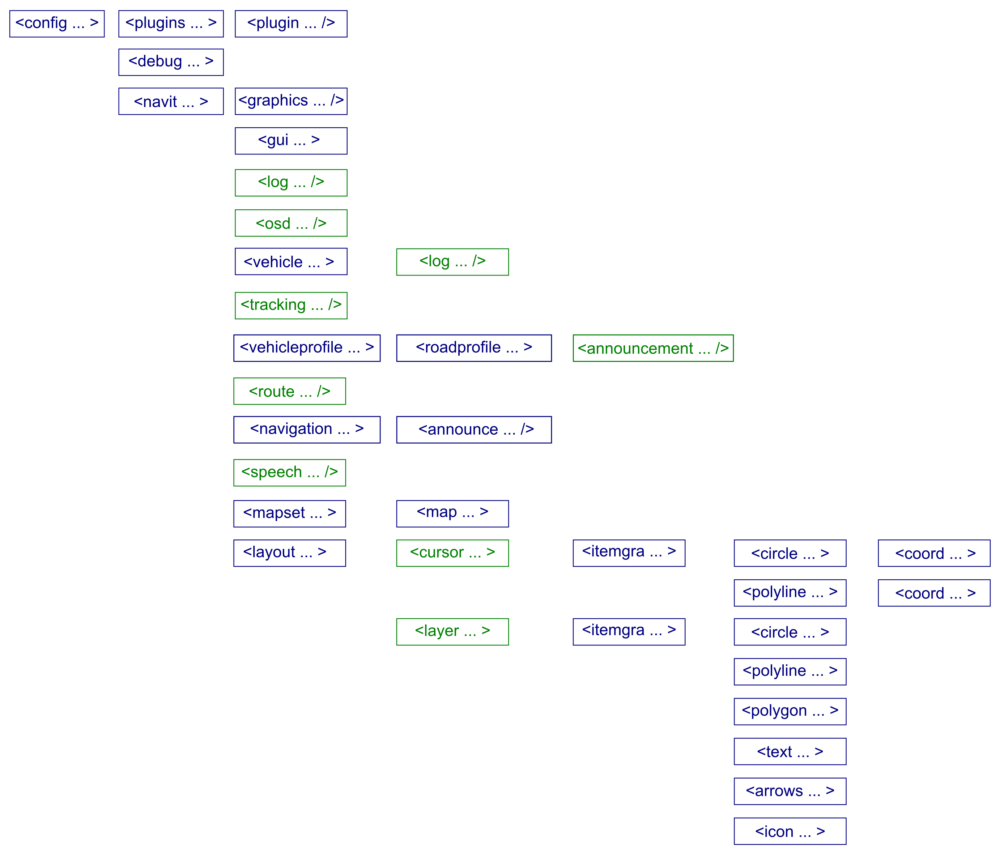

.. _configurationfull_list_of_options:

Configuration/Full list of options
==================================

.. _xml_structure:

XML structure
=============

| The image below details the complete xml tag structure for the default
  navit.xml. The colour scheme of the image is designed to give an
  impression of what is and what isn't required (both for Navit to run
  succesfully in the first place, and to have a functional navigation
  system) - those tags in blue are required, whilst those in green can
  be regarded as optional.
| |640px|

.. _full_options:

Full options
============

config
------

+-----------+-------+--------------+---------------+---------------+
| Attribute | Units | Values       | Notes         | Example       |
+===========+=======+==============+===============+===============+
| language  |       | | "en_US",   | Enables       | ``langu       |
|           |       | | "en_GB",   | manual        | age="en_US"`` |
|           |       | | "pl_PL"... | setting of    |               |
|           |       |              | the locale.   |               |
|           |       |              | For example,  |               |
|           |       |              | ``langu       |               |
|           |       |              | age="en_US"`` |               |
|           |       |              | will force    |               |
|           |       |              | Navit to      |               |
|           |       |              | consider the  |               |
|           |       |              | host device   |               |
|           |       |              | as being      |               |
|           |       |              | setup for USA |               |
|           |       |              | English, and  |               |
|           |       |              | the town      |               |
|           |       |              | search will   |               |
|           |       |              | automatically |               |
|           |       |              | revert to     |               |
|           |       |              | towns in the  |               |
|           |       |              | USA. This is  |               |
|           |       |              | useful if     |               |
|           |       |              | your device   |               |
|           |       |              | is from       |               |
|           |       |              | another       |               |
|           |       |              | country, or   |               |
|           |       |              | you are       |               |
|           |       |              | travelling in |               |
|           |       |              | another       |               |
|           |       |              | country. The  |               |
|           |       |              | locale code   |               |
|           |       |              | is made up of |               |
|           |       |              | the language  |               |
|           |       |              | (lowercase)   |               |
|           |       |              | and the       |               |
|           |       |              | country       |               |
|           |       |              | (uppercase)   |               |
|           |       |              | codes. For    |               |
|           |       |              | language      |               |
|           |       |              | codes, see    |               |
|           |       |              | `ISO          |               |
|           |       |              | 639-1 <http:  |               |
|           |       |              | //en.wikipedi |               |
|           |       |              | a.org/wiki/Li |               |
|           |       |              | st_of_ISO_639 |               |
|           |       |              | -1_codes>`__; |               |
|           |       |              | for country   |               |
|           |       |              | codes, see    |               |
|           |       |              | `ISO 3166-1   |               |
|           |       |              | Alpha2 <      |               |
|           |       |              | http://en.wik |               |
|           |       |              | ipedia.org/wi |               |
|           |       |              | ki/ISO_3166-1 |               |
|           |       |              | _alpha-2>`__. |               |
|           |       |              | Note that you |               |
|           |       |              | can combine   |               |
|           |       |              | the languages |               |
|           |       |              | and countries |               |
|           |       |              | as you wish:  |               |
|           |       |              | lan           |               |
|           |       |              | guage="de_FR" |               |
|           |       |              | will result   |               |
|           |       |              | in German     |               |
|           |       |              | interface and |               |
|           |       |              | voice         |               |
|           |       |              | announcements |               |
|           |       |              | and search    |               |
|           |       |              | defaulting to |               |
|           |       |              | France.       |               |
+-----------+-------+--------------+---------------+---------------+

debug
-----

+--------------+-------+--------------+--------------+--------------+
| Attribute    | Units | Values       | Notes        | Example      |
+==============+=======+==============+==============+==============+
| name         |       | "gu          | Set the      | ``name="gui  |
|              |       | i_internal", | debug level  | _internal"`` |
|              |       | "nav         | for a Navit  |              |
|              |       | it:do_draw", | module.      |              |
|              |       | "global"     | "name" is    |              |
|              |       |              | the module   |              |
|              |       |              | name;        |              |
|              |       |              | optionally,  |              |
|              |       |              | the name of  |              |
|              |       |              | a function   |              |
|              |       |              | in that      |              |
|              |       |              | module can   |              |
|              |       |              | be appended  |              |
|              |       |              | with a colon |              |
|              |       |              | (:). The     |              |
|              |       |              | modules      |              |
|              |       |              | correspond   |              |
|              |       |              | to the       |              |
|              |       |              | directories  |              |
|              |       |              | of Navit's   |              |
|              |       |              | source code  |              |
|              |       |              | tree (the    |              |
|              |       |              | module name  |              |
|              |       |              | is set in    |              |
|              |       |              | the          |              |
|              |       |              | Makefile.am  |              |
|              |       |              | in each      |              |
|              |       |              | directory,   |              |
|              |       |              | by a         |              |
|              |       |              | statement    |              |
|              |       |              | "-DM         |              |
|              |       |              | ODULE=XXX"). |              |
|              |       |              | A            |              |
|              |       |              | dditionally, |              |
|              |       |              | there are    |              |
|              |       |              | some special |              |
|              |       |              | module       |              |
|              |       |              | names:       |              |
|              |       |              | Setting a    |              |
|              |       |              | debug level  |              |
|              |       |              | > 0 for      |              |
|              |       |              | *"           |              |
|              |       |              | timestamps"* |              |
|              |       |              | will enable  |              |
|              |       |              | printing of  |              |
|              |       |              | timestamps   |              |
|              |       |              | in debug     |              |
|              |       |              | messages.    |              |
|              |       |              | Setting      |              |
|              |       |              | *"segv"* to  |              |
|              |       |              | 1 will print |              |
|              |       |              | backtraces   |              |
|              |       |              | on           |              |
|              |       |              | segmentation |              |
|              |       |              | faults,      |              |
|              |       |              | setting it   |              |
|              |       |              | to >1 will   |              |
|              |       |              | start gdb.   |              |
|              |       |              | Finally,     |              |
|              |       |              | *"global"*   |              |
|              |       |              | sets the     |              |
|              |       |              | global debug |              |
|              |       |              | level        |              |
|              |       |              | (applies to  |              |
|              |       |              | all modules; |              |
|              |       |              | this is the  |              |
|              |       |              | same as      |              |
|              |       |              | using the    |              |
|              |       |              | command line |              |
|              |       |              | option -d).  |              |
+--------------+-------+--------------+--------------+--------------+
| dbg_level    |       | "error",     | The debug    | ``dbg_le     |
|              |       | "warning",   | level to set | vel="info"`` |
|              |       | "info",      | for the      |              |
|              |       | "debug"      | component    |              |
|              |       |              | given by the |              |
|              |       |              | "name"       |              |
|              |       |              | attribute.   |              |
|              |       |              | The higher   |              |
|              |       |              | the debug    |              |
|              |       |              | level, the   |              |
|              |       |              | more debug   |              |
|              |       |              | output will  |              |
|              |       |              | be printed.  |              |
|              |       |              | The default  |              |
|              |       |              | debug level  |              |
|              |       |              | is "error",  |              |
|              |       |              | which will   |              |
|              |       |              | only print   |              |
|              |       |              | error        |              |
|              |       |              | messages.    |              |
+--------------+-------+--------------+--------------+--------------+
| level        |       | numeric      | Equivalent   | `            |
| *(           |       | debug level  | to           | `level="3"`` |
| deprecated)* |       | (0-3)        | "dbg_level", |              |
|              |       |              | only using a |              |
|              |       |              | number       |              |
|              |       |              | instead of   |              |
|              |       |              | the level's  |              |
|              |       |              | name.        |              |
|              |       |              | "dbg_level"  |              |
|              |       |              | should be    |              |
|              |       |              | used         |              |
|              |       |              | instead, to  |              |
|              |       |              | make the     |              |
|              |       |              | c            |              |
|              |       |              | onfiguration |              |
|              |       |              | easier to    |              |
|              |       |              | read.        |              |
+--------------+-------+--------------+--------------+--------------+

navit
-----

+-------------+-------------+-------------+-------------+-------------+
| Attribute   | Units       | Values      | Notes       | Example     |
+=============+=============+=============+=============+=============+
| center      | coords      | ``DD.dd``   | | Map will  | ``ce        |
|             |             | or          |   be        | nter="4808  |
|             |             | ``DDMM.ss`` |   centred   | N 1134 E"`` |
|             |             |             |   at these  |             |
|             |             |             |             |             |
|             |             |             | coordinates |             |
|             |             |             |   on        |             |
|             |             |             |   startup.  |             |
|             |             |             |             |             |
|             |             |             | Coordinates |             |
|             |             |             |   are       |             |
|             |             |             |   either in |             |
|             |             |             |   decimal   |             |
|             |             |             |   degrees   |             |
|             |             |             |   (with     |             |
|             |             |             |   sign in   |             |
|             |             |             |   front to  |             |
|             |             |             |   denote    |             |
|             |             |             |   N/S or    |             |
|             |             |             |   E/W) or   |             |
|             |             |             |   decimal   |             |
|             |             |             |   minutes   |             |
|             |             |             |   with      |             |
|             |             |             |   trailing  |             |
|             |             |             |   N/S or    |             |
|             |             |             |   E/W where |             |
|             |             |             |   a         |             |
|             |             |             | ppropriate. |             |
|             |             |             | |           |             |
|             |             |             |  **Default: |             |
|             |             |             |   ``53.1    |             |
|             |             |             | 3 11.70``** |             |
+-------------+-------------+-------------+-------------+-------------+
| orientation | degrees (or | 0-360 /     | | ``orienta | ``orienta   |
|             | -1)         | **-1**      | tion="0"``: | tion="-1"`` |
|             |             |             |   Map       |             |
|             |             |             |   oriented  |             |
|             |             |             |   North.    |             |
|             |             |             | |           |             |
|             |             |             | ``orientati |             |
|             |             |             | on="180"``: |             |
|             |             |             |   Map       |             |
|             |             |             |   oriented  |             |
|             |             |             |   South.    |             |
|             |             |             | |           |             |
|             |             |             |  ``orientat |             |
|             |             |             | ion="-1"``: |             |
|             |             |             |   Map       |             |
|             |             |             |   oriented  |             |
|             |             |             |   in        |             |
|             |             |             |   direction |             |
|             |             |             |   of        |             |
|             |             |             |   travel.   |             |
|             |             |             | | This is   |             |
|             |             |             |             |             |
|             |             |             |  equivalent |             |
|             |             |             |   to        |             |
|             |             |             |   selecting |             |
|             |             |             |             |             |
|             |             |             | ``Settings  |             |
|             |             |             | -> Rules -> |             |
|             |             |             |  Northing`` |             |
|             |             |             |   in the    |             |
|             |             |             |   internal  |             |
|             |             |             |   gui.      |             |
+-------------+-------------+-------------+-------------+-------------+
| tracking    |             | 0 / **1**   | | ``trac    | ``tra       |
|             |             |             | king="1"``: | cking="1"`` |
|             |             |             |   Vehicle   |             |
|             |             |             |   cursor    |             |
|             |             |             |   will lock |             |
|             |             |             |   to the    |             |
|             |             |             |   roads on  |             |
|             |             |             |   the map.  |             |
|             |             |             | | This is   |             |
|             |             |             |             |             |
|             |             |             |  equivalent |             |
|             |             |             |   to        |             |
|             |             |             |   selecting |             |
|             |             |             |   ``Se      |             |
|             |             |             | ttings -> R |             |
|             |             |             | ules -> Loc |             |
|             |             |             | k on road`` |             |
|             |             |             |   in the    |             |
|             |             |             |   internal  |             |
|             |             |             |   gui.      |             |
+-------------+-------------+-------------+-------------+-------------+
| way         |             | **0** / 1   | | `         | ``waypoints |
| points_flag |             |             | `waypoints_ | _flag="1"`` |
|             |             |             | flag="1"``: |             |
|             |             |             |   Set       |             |
|             |             |             |             |             |
|             |             |             | destination |             |
|             |             |             |   will used |             |
|             |             |             |   to add    |             |
|             |             |             |   next      |             |
|             |             |             |   waypoint. |             |
|             |             |             |   Previous  |             |
|             |             |             |             |             |
|             |             |             | destination |             |
|             |             |             |   will not  |             |
|             |             |             |   deleted.  |             |
|             |             |             | | This is   |             |
|             |             |             |             |             |
|             |             |             |  equivalent |             |
|             |             |             |   to        |             |
|             |             |             |   selecting |             |
|             |             |             |             |             |
|             |             |             | ``Settings  |             |
|             |             |             | -> Rules -> |             |
|             |             |             |  Plan with  |             |
|             |             |             | waypoints`` |             |
|             |             |             |   in the    |             |
|             |             |             |   internal  |             |
|             |             |             |   gui.      |             |
+-------------+-------------+-------------+-------------+-------------+
| zoom        |             | | 1 - ∞     | | ``        | ``          |
|             |             | | **256**   | zoom="1"``: | zoom="50"`` |
|             |             |             |   Most      |             |
|             |             |             |   zoomed    |             |
|             |             |             |   in. Upper |             |
|             |             |             |   limit is  |             |
|             |             |             |   actually  |             |
|             |             |             |   2097152.  |             |
|             |             |             | | Map will  |             |
|             |             |             |   be zoomed |             |
|             |             |             |   in at     |             |
|             |             |             |   this      |             |
|             |             |             |   level on  |             |
|             |             |             |   startup.  |             |
+-------------+-------------+-------------+-------------+-------------+
| auto        |             | **0** / 1   | | ``        | `           |
| zoom_active |             |             | autozoom_ac | `autozoom_a |
|             |             |             | tive="0"``: | ctive="1"`` |
|             |             |             |   Autozoom  |             |
|             |             |             |   disabled. |             |
|             |             |             | | ``        |             |
|             |             |             | autozoom_ac |             |
|             |             |             | tive="1"``: |             |
|             |             |             |   Autozoom  |             |
|             |             |             |   enabled.  |             |
+-------------+-------------+-------------+-------------+-------------+
| autozoom    | seconds     | | 1 - ∞     | | Number of | ``auto      |
|             |             | | **10**    |   seconds   | zoom="60"`` |
|             |             |             |   of the    |             |
|             |             |             |   way ahead |             |
|             |             |             |   to leave  |             |
|             |             |             |   visible   |             |
|             |             |             |   during    |             |
|             |             |             |   autozoom. |             |
|             |             |             | | In        |             |
|             |             |             |   effect,   |             |
|             |             |             |   this      |             |
|             |             |             |   specifies |             |
|             |             |             |   the zoom  |             |
|             |             |             |   level     |             |
|             |             |             |   when      |             |
|             |             |             |   autozoom  |             |
|             |             |             |   is        |             |
|             |             |             |   enabled.  |             |
|             |             |             | | ``aut     |             |
|             |             |             | ozoom="1"`` |             |
|             |             |             |   is        |             |
|             |             |             |   closest   |             |
|             |             |             |   zoom.     |             |
|             |             |             | | This      |             |
|             |             |             |   attribute |             |
|             |             |             |   has no    |             |
|             |             |             |   effect    |             |
|             |             |             |   without   |             |
|             |             |             |   ``        |             |
|             |             |             | autozoom_ac |             |
|             |             |             | tive="1"``. |             |
+-------------+-------------+-------------+-------------+-------------+
| imperial    |             | **0**/1     | Use         | ``imp       |
|             |             |             | imperial    | erial="1"`` |
|             |             |             | units       |             |
|             |             |             | (miles,     |             |
|             |             |             | feet and    |             |
|             |             |             | miles       |             |
|             |             |             | -per-hour). |             |
|             |             |             | Only in     |             |
|             |             |             | Navit       |             |
|             |             |             | versions    |             |
|             |             |             | since .     |             |
+-------------+-------------+-------------+-------------+-------------+
| osd_co      |             | **1** - 32  | Sets the    | ``o         |
| nfiguration |             |             | initial     | sd_configur |
|             |             |             | value of    | ation="1"`` |
|             |             |             | ```os       |             |
|             |             |             | d_configura |             |
|             |             |             | tion`` <OSD |             |
|             |             |             | #osd_config |             |
|             |             |             | uration>`__ |             |
|             |             |             | when Navit  |             |
|             |             |             | starts up.  |             |
+-------------+-------------+-------------+-------------+-------------+
| pitch       | degrees     | 0 - 359     | | ``p       | ``p         |
|             |             |             | itch="0"``: | itch="20"`` |
|             |             |             |             |             |
|             |             |             |  Bird's-eye |             |
|             |             |             |   view of   |             |
|             |             |             |   map.      |             |
|             |             |             | | ``pi      |             |
|             |             |             | tch="20"``: |             |
|             |             |             |   Map       |             |
|             |             |             |   tilted by |             |
|             |             |             |   20        |             |
|             |             |             |   degrees   |             |
|             |             |             |   to give   |             |
|             |             |             |   3D view.  |             |
|             |             |             | | ``pit     |             |
|             |             |             | ch="180"``: |             |
|             |             |             |   x-axis of |             |
|             |             |             |   the map   |             |
|             |             |             |   seems     |             |
|             |             |             |   inverted, |             |
|             |             |             |   since you |             |
|             |             |             |   are       |             |
|             |             |             |   seeing    |             |
|             |             |             |   the map   |             |
|             |             |             |   "from the |             |
|             |             |             |   bottom    |             |
|             |             |             |   up"       |             |
|             |             |             | | Values    |             |
|             |             |             |   between 0 |             |
|             |             |             |   and 85    |             |
|             |             |             |   are       |             |
|             |             |             |   r         |             |
|             |             |             | ecommended. |             |
+-------------+-------------+-------------+-------------+-------------+
| radius      | percent     | | -50 - 50  | |           | ``ra        |
|             |             | | **30**    |  Percentage | dius="33"`` |
|             |             |             |   of screen |             |
|             |             |             |   size to   |             |
|             |             |             |   offset    |             |
|             |             |             |   vehicle   |             |
|             |             |             |   cursor    |             |
|             |             |             |   from      |             |
|             |             |             |   centre    |             |
|             |             |             |   when      |             |
|             |             |             |   moving.   |             |
|             |             |             | | ``r       |             |
|             |             |             | adius="0"`` |             |
|             |             |             |   places    |             |
|             |             |             |   the       |             |
|             |             |             |   vehicle   |             |
|             |             |             |   cursor in |             |
|             |             |             |   the       |             |
|             |             |             |   center of |             |
|             |             |             |   the map.  |             |
|             |             |             | | ``ra      |             |
|             |             |             | dius="50"`` |             |
|             |             |             |   places    |             |
|             |             |             |   the       |             |
|             |             |             |   vehicle   |             |
|             |             |             |   cursor on |             |
|             |             |             |   the edge  |             |
|             |             |             |   of the    |             |
|             |             |             |   screen,   |             |
|             |             |             |   showing   |             |
|             |             |             |   only the  |             |
|             |             |             |   map in    |             |
|             |             |             |   front of  |             |
|             |             |             |   you       |             |
|             |             |             | | ``rad     |             |
|             |             |             | ius="-50"`` |             |
|             |             |             |   places    |             |
|             |             |             |   the       |             |
|             |             |             |   vehicle   |             |
|             |             |             |   cursor on |             |
|             |             |             |   the edge  |             |
|             |             |             |   of the    |             |
|             |             |             |   screen,   |             |
|             |             |             |   showing   |             |
|             |             |             |   only the  |             |
|             |             |             |   map       |             |
|             |             |             |   behind    |             |
|             |             |             |   you       |             |
|             |             |             | | Higher    |             |
|             |             |             |   values    |             |
|             |             |             |   cause the |             |
|             |             |             |   map to    |             |
|             |             |             |   "lead"    |             |
|             |             |             |   the       |             |
|             |             |             |   vehicle,  |             |
|             |             |             |   showing   |             |
|             |             |             |   more of   |             |
|             |             |             |   where     |             |
|             |             |             |   you're    |             |
|             |             |             |   going and |             |
|             |             |             |   less of   |             |
|             |             |             |   where     |             |
|             |             |             |   you've    |             |
|             |             |             |   been.     |             |
|             |             |             |   Values    |             |
|             |             |             |   less than |             |
|             |             |             |   -50 or    |             |
|             |             |             |   more than |             |
|             |             |             |   50 are    |             |
|             |             |             |   possible, |             |
|             |             |             |   but the   |             |
|             |             |             |   vehicle   |             |
|             |             |             |   cursor    |             |
|             |             |             |   will be   |             |
|             |             |             |   placed    |             |
|             |             |             |   out of    |             |
|             |             |             |   the       |             |
|             |             |             |   screen    |             |
|             |             |             |   area.     |             |
+-------------+-------------+-------------+-------------+-------------+
| recent_dest |             | | 1 - ∞     | | Number of | ``recent_   |
|             |             | | **10**    |   entries   | dest="20"`` |
|             |             |             |   kept in   |             |
|             |             |             |   desti     |             |
|             |             |             | nation.txt. |             |
|             |             |             |   This text |             |
|             |             |             |   file      |             |
|             |             |             |   stores    |             |
|             |             |             |   the most  |             |
|             |             |             |   recent    |             |
|             |             |             |   d         |             |
|             |             |             | estinations |             |
|             |             |             |   set by    |             |
|             |             |             |   the user  |             |
|             |             |             |   in Navit. |             |
|             |             |             | | Defaults  |             |
|             |             |             |   to ∞, if  |             |
|             |             |             |   tag isn't |             |
|             |             |             |   set.      |             |
+-------------+-------------+-------------+-------------+-------------+
| timeout     | gps updates | | 1 - ∞     | When the    | ``ti        |
|             |             | | **10**    | user        | meout="5"`` |
|             |             |             | scrolls the |             |
|             |             |             | map, it     |             |
|             |             |             | stays       |             |
|             |             |             | there.      |             |
|             |             |             | After       |             |
|             |             |             | ``timeout`` |             |
|             |             |             | number of   |             |
|             |             |             | GPS updates |             |
|             |             |             | the map     |             |
|             |             |             | jumps back  |             |
|             |             |             | to the      |             |
|             |             |             | current     |             |
|             |             |             | location of |             |
|             |             |             | the active  |             |
|             |             |             | vehicle.    |             |
|             |             |             | Since most  |             |
|             |             |             | GPS-modules |             |
|             |             |             | have an     |             |
|             |             |             | update rate |             |
|             |             |             | of 1Hz,     |             |
|             |             |             | "gps        |             |
|             |             |             | updates" is |             |
|             |             |             | likely to   |             |
|             |             |             | be          |             |
|             |             |             | equivalent  |             |
|             |             |             | to          |             |
|             |             |             | "seconds"   |             |
|             |             |             | (see )      |             |
+-------------+-------------+-------------+-------------+-------------+
| fo          |             | 0/**1**     | | 1 = Map   | ``follow_c  |
| llow_cursor |             |             |   will      | ursor="0"`` |
|             |             |             |   au        |             |
|             |             |             | tomatically |             |
|             |             |             |   scroll to |             |
|             |             |             |   follow    |             |
|             |             |             |   the       |             |
|             |             |             |   cursor    |             |
|             |             |             |   (active   |             |
|             |             |             |   vehicle). |             |
|             |             |             |   0 = Map   |             |
|             |             |             |   will not  |             |
|             |             |             |   follow    |             |
|             |             |             |   the       |             |
|             |             |             |   cursor.   |             |
|             |             |             | | This is   |             |
|             |             |             |             |             |
|             |             |             |  equivalent |             |
|             |             |             |   to        |             |
|             |             |             |   selecting |             |
|             |             |             |             |             |
|             |             |             | ``Settings  |             |
|             |             |             | -> Rules -> |             |
|             |             |             |  Map follow |             |
|             |             |             | s Vehicle`` |             |
|             |             |             |   in the    |             |
|             |             |             |   internal  |             |
|             |             |             |   gui.      |             |
|             |             |             | | Note:     |             |
|             |             |             |   When      |             |
|             |             |             |   setting   |             |
|             |             |             |   this to   |             |
|             |             |             |   0, you    |             |
|             |             |             |   can still |             |
|             |             |             |   jump to   |             |
|             |             |             |   the       |             |
|             |             |             |   cursor    |             |
|             |             |             |   position  |             |
|             |             |             |   by        |             |
|             |             |             |   calling   |             |
|             |             |             |   the       |             |
|             |             |             |   `Navit    |             |
|             |             |             |   command < |             |
|             |             |             | OSD#Navit_c |             |
|             |             |             | ommands>`__ |             |
|             |             |             |   ``        |             |
|             |             |             | set_center_ |             |
|             |             |             | cursor()``, |             |
|             |             |             |   for       |             |
|             |             |             |   example   |             |
|             |             |             |   via an    |             |
|             |             |             |   OSD       |             |
|             |             |             |   button    |             |
|             |             |             |   with      |             |
|             |             |             |             |             |
|             |             |             |  ``command= |             |
|             |             |             | "follow=0;s |             |
|             |             |             | et_center_c |             |
|             |             |             | ursor()"``. |             |
+-------------+-------------+-------------+-------------+-------------+

graphics
--------

.. table:: style="text-align:left;" \| Insert inbetween \ ``...``\  tags

   +--------------+--------+--------------+--------------+--------------+
   | Attribute    | Units  | Values       | Notes        | Example      |
   +==============+========+==============+==============+==============+
   | type         |        | | ``gtk_dr   | Type of      | ``t          |
   |              |        | awing_area`` | graphics to  | ype="gtk_dra |
   |              |        | | ``q        | use for      | wing_area"`` |
   |              |        | t_qpainter`` | display.     |              |
   |              |        | | ``qt5``    |              |              |
   |              |        | | ``sdl``    |              |              |
   |              |        | | ``opengl`` |              |              |
   |              |        | | ``win32``  |              |              |
   |              |        | |            |              |              |
   |              |        |  ``android`` |              |              |
   |              |        | | ``cocoa``  |              |              |
   |              |        | | ``gd``     |              |              |
   |              |        | | ``null``   |              |              |
   +--------------+--------+--------------+--------------+--------------+
   | x            | pixels | numeric      | Application  | ``x="10"``   |
   |              |        |              | window x     |              |
   |              |        |              | position on  |              |
   |              |        |              | the screen.  |              |
   +--------------+--------+--------------+--------------+--------------+
   | y            | pixels | numeric      | Application  | ``y="10"``   |
   |              |        |              | window y     |              |
   |              |        |              | position on  |              |
   |              |        |              | the screen.  |              |
   +--------------+--------+--------------+--------------+--------------+
   | w            | pixels | numeric      | Application  | ``w="600"``  |
   |              |        |              | window       |              |
   |              |        |              | width.       |              |
   +--------------+--------+--------------+--------------+--------------+
   | h            | pixels | numeric      | Application  | ``h="400"``  |
   |              |        |              | window       |              |
   |              |        |              | height.      |              |
   +--------------+--------+--------------+--------------+--------------+
   | back         |        | color        | Background   | ``color="    |
   | ground_color |        |              | color for    | #00000060"`` |
   |              |        |              | screen       |              |
   |              |        |              | portions     |              |
   |              |        |              | overlapped   |              |
   |              |        |              | by the       |              |
   |              |        |              | system UI (  |              |
   |              |        |              | and later,   |              |
   |              |        |              | currently    |              |
   |              |        |              | meaningful   |              |
   |              |        |              | on Android   |              |
   |              |        |              | only)        |              |
   +--------------+--------+--------------+--------------+--------------+
   | qt5_widget   |        | | ``qml``    | Qt5 widget   | ``qt_wi      |
   |              |        | |            | technology.  | dget="qml"`` |
   |              |        |  ``qwidget`` | Only         |              |
   |              |        |              | meaningful   |              |
   |              |        |              | if using qt5 |              |
   |              |        |              | graphics     |              |
   |              |        |              | with both    |              |
   |              |        |              | technologies |              |
   |              |        |              | enabled on   |              |
   |              |        |              | build.       |              |
   +--------------+--------+--------------+--------------+--------------+
   | qt5_platform |        | See Qt5      | Qt5 platform | ``qt5_plat   |
   |              |        | d            | plugin to    | form="xcb"`` |
   |              |        | ocumentation | use. Only    |              |
   |              |        |              | meaningful   |              |
   |              |        |              | if using qt5 |              |
   |              |        |              | graphics.    |              |
   +--------------+--------+--------------+--------------+--------------+

gui
---

.. table:: style="text-align:left;" \| Insert inbetween \ ``...``\  tags

   +-------------+-------------+-------------+-------------+-------------+
   | Attribute   | Units       | Values      | Notes       | Example     |
   +=============+=============+=============+=============+=============+
   | type        |             | | ``gtk``   | Type of     | ``type="    |
   |             |             | | `         | user        | internal"`` |
   |             |             | `internal`` | interface   |             |
   |             |             | | ``qml``   | to use      |             |
   |             |             | | ``cegui`` |             |             |
   +-------------+-------------+-------------+-------------+-------------+
   | enabled     |             | ``yes`` /   | Enable this | ``enab      |
   |             |             | ``no``      | user        | led="yes"`` |
   |             |             |             | interface.  |             |
   |             |             |             | This        |             |
   |             |             |             | attribute   |             |
   |             |             |             | enables you |             |
   |             |             |             | to define   |             |
   |             |             |             | multiple    |             |
   |             |             |             | user        |             |
   |             |             |             | interfaces  |             |
   |             |             |             | within      |             |
   |             |             |             | navit.xml   |             |
   |             |             |             | (i.e.       |             |
   |             |             |             | multiple    |             |
   |             |             |             | \ ``...``\  |             |
   |             |             |             | tags), and  |             |
   |             |             |             | quickly     |             |
   |             |             |             | switch      |             |
   |             |             |             | between     |             |
   |             |             |             | them by     |             |
   |             |             |             | changing    |             |
   |             |             |             | the         |             |
   |             |             |             | ``enabled`` |             |
   |             |             |             | status.     |             |
   +-------------+-------------+-------------+-------------+-------------+
   | font_size   | Pt          | 1 - ∞       | The base    | ``font_s    |
   |             | fractions   |             | text size   | ize="350"`` |
   |             |             |             | to use for  |             |
   |             |             |             | text and    |             |
   |             |             |             | labels in   |             |
   |             |             |             | the menus.  |             |
   |             |             |             | This only   |             |
   |             |             |             | applies     |             |
   |             |             |             | when        |             |
   |             |             |             | ``type="    |             |
   |             |             |             | internal"`` |             |
   +-------------+-------------+-------------+-------------+-------------+
   | icon_xs     | pixels      | 1 - ∞       | The size    | ``ico       |
   |             |             |             | that        | n_xs="32"`` |
   |             |             |             | extra-small |             |
   |             |             |             | style icons |             |
   |             |             |             | should be   |             |
   |             |             |             | scaled to   |             |
   |             |             |             | (e.g.       |             |
   |             |             |             | country     |             |
   |             |             |             | flag on     |             |
   |             |             |             | town        |             |
   |             |             |             | search).    |             |
   |             |             |             | This only   |             |
   |             |             |             | applies     |             |
   |             |             |             | when        |             |
   |             |             |             | ``type="    |             |
   |             |             |             | internal"`` |             |
   +-------------+-------------+-------------+-------------+-------------+
   | icon_s      | pixels      | 1 - ∞       | The size    | ``ic        |
   |             |             |             | that small  | on_s="96"`` |
   |             |             |             | style icons |             |
   |             |             |             | should be   |             |
   |             |             |             | scaled to   |             |
   |             |             |             | (e.g. icons |             |
   |             |             |             | of internal |             |
   |             |             |             | GUI         |             |
   |             |             |             | toolbar).   |             |
   |             |             |             | This only   |             |
   |             |             |             | applies     |             |
   |             |             |             | when        |             |
   |             |             |             | ``type="    |             |
   |             |             |             | internal"`` |             |
   +-------------+-------------+-------------+-------------+-------------+
   | icon_l      | pixels      | 1 - ∞       | The size    | ``ic        |
   |             |             |             | that large  | on_l="96"`` |
   |             |             |             | style icons |             |
   |             |             |             | should be   |             |
   |             |             |             | scaled to   |             |
   |             |             |             | (e.g. icons |             |
   |             |             |             | of internal |             |
   |             |             |             | GUI menu).  |             |
   |             |             |             | This only   |             |
   |             |             |             | applies     |             |
   |             |             |             | when        |             |
   |             |             |             | ``type="    |             |
   |             |             |             | internal"`` |             |
   +-------------+-------------+-------------+-------------+-------------+
   | keyboard    |             | **true** /  | Whether to  | ``keyboar   |
   |             |             | false       | display     | d="false"`` |
   |             |             |             | Navit's     |             |
   |             |             |             | internal    |             |
   |             |             |             | keyboard in |             |
   |             |             |             | search. Set |             |
   |             |             |             | to          |             |
   |             |             |             | ``false``   |             |
   |             |             |             | if you want |             |
   |             |             |             | to use your |             |
   |             |             |             | device's    |             |
   |             |             |             | physical    |             |
   |             |             |             | keyboard or |             |
   |             |             |             | the OS      |             |
   |             |             |             | on-screen   |             |
   |             |             |             | keyboard    |             |
   |             |             |             | instead of  |             |
   |             |             |             | Navit's     |             |
   |             |             |             | on-screen   |             |
   |             |             |             | keyboard.   |             |
   +-------------+-------------+-------------+-------------+-------------+
   | fullscreen  |             | 0 / 1       | ``fullsc    | ``fulls     |
   |             |             |             | reen="1"``: | creen="1"`` |
   |             |             |             | Start Navit |             |
   |             |             |             | in          |             |
   |             |             |             | fullscreen  |             |
   |             |             |             | mode        |             |
   +-------------+-------------+-------------+-------------+-------------+
   | menubar     |             | 0 / 1       | Toggle      | ``me        |
   |             |             |             | display of  | nubar="1"`` |
   |             |             |             | the menu    |             |
   |             |             |             | bar. This   |             |
   |             |             |             | only        |             |
   |             |             |             | applies     |             |
   |             |             |             | when        |             |
   |             |             |             | ``t         |             |
   |             |             |             | ype="gtk"`` |             |
   +-------------+-------------+-------------+-------------+-------------+
   | menu_o      |             | 0 / **1**   | Toggles the | ``m         |
   | n_map_click |             |             | ability to  | enu_on_map_ |
   |             |             |             | bring up    | click="0"`` |
   |             |             |             | the menu    |             |
   |             |             |             | screen when |             |
   |             |             |             | clicking on |             |
   |             |             |             | the map.    |             |
   |             |             |             | When using  |             |
   |             |             |             | ``m         |             |
   |             |             |             | enu_on_map_ |             |
   |             |             |             | click="0"`` |             |
   |             |             |             | it is       |             |
   |             |             |             | recommended |             |
   |             |             |             | to use an   |             |
   |             |             |             | `OSD        |             |
   |             |             |             | button <OSD |             |
   |             |             |             | #button>`__ |             |
   |             |             |             | with the    |             |
   |             |             |             | `command    |             |
   |             |             |             | ``gui.      |             |
   |             |             |             | menu()`` <O |             |
   |             |             |             | SD#Navit_co |             |
   |             |             |             | mmands>`__, |             |
   |             |             |             | or else you |             |
   |             |             |             | can't get   |             |
   |             |             |             | to the menu |             |
   |             |             |             | screen!     |             |
   |             |             |             | This only   |             |
   |             |             |             | applies     |             |
   |             |             |             | when        |             |
   |             |             |             | ``type="    |             |
   |             |             |             | internal"`` |             |
   +-------------+-------------+-------------+-------------+-------------+
   | o           |             | navit       | You may     | ``on        |
   | n_map_click |             | command     | specify a   | _map_click= |
   |             |             |             | command to  | 'menu("#Map |
   |             |             |             | execute     |  Point")'`` |
   |             |             |             | when        |             |
   |             |             |             | entering    |             |
   |             |             |             | internal    |             |
   |             |             |             | gui by      |             |
   |             |             |             | clicking on |             |
   |             |             |             | the map.    |             |
   |             |             |             | The example |             |
   |             |             |             | provided    |             |
   |             |             |             | allows to   |             |
   |             |             |             | enter       |             |
   |             |             |             | directly to |             |
   |             |             |             | operations  |             |
   |             |             |             | related to  |             |
   |             |             |             | the clicked |             |
   |             |             |             | map point.  |             |
   |             |             |             | This only   |             |
   |             |             |             | applies     |             |
   |             |             |             | when        |             |
   |             |             |             | ``type="    |             |
   |             |             |             | internal"`` |             |
   +-------------+-------------+-------------+-------------+-------------+
   | toolbar     |             | 0 / 1       | Toggle      | ``to        |
   |             |             |             | display of  | olbar="1"`` |
   |             |             |             | the         |             |
   |             |             |             | toolbar.    |             |
   |             |             |             | This only   |             |
   |             |             |             | applies     |             |
   |             |             |             | when        |             |
   |             |             |             | ``t         |             |
   |             |             |             | ype="gtk"`` |             |
   +-------------+-------------+-------------+-------------+-------------+
   | statusbar   |             | 0 / 1       | Toggle      | ``stat      |
   |             |             |             | display of  | usbar="1"`` |
   |             |             |             | the status  |             |
   |             |             |             | bar. This   |             |
   |             |             |             | only        |             |
   |             |             |             | applies     |             |
   |             |             |             | when        |             |
   |             |             |             | ``t         |             |
   |             |             |             | ype="gtk"`` |             |
   +-------------+-------------+-------------+-------------+-------------+
   | skin        |             |             |             |             |
   +-------------+-------------+-------------+-------------+-------------+
   | hid         |             | 0 / 1       | When        | ``hide_impo |
   | e_impossibl |             |             | searching a | ssible_next |
   | e_next_keys |             |             | country/    | _keys="1"`` |
   |             |             |             | town/street |             |
   |             |             |             | using the   |             |
   |             |             |             | on-screen   |             |
   |             |             |             | keyboard,   |             |
   |             |             |             | instead of  |             |
   |             |             |             | h           |             |
   |             |             |             | ighlighting |             |
   |             |             |             | possible    |             |
   |             |             |             | keys based  |             |
   |             |             |             | on current  |             |
   |             |             |             | search      |             |
   |             |             |             | result,     |             |
   |             |             |             | hide        |             |
   |             |             |             | impossible  |             |
   |             |             |             | keys.       |             |
   |             |             |             | P           |             |
   |             |             |             | articularly |             |
   |             |             |             | useful when |             |
   |             |             |             | using a     |             |
   |             |             |             | rotary      |             |
   |             |             |             | encoder or  |             |
   |             |             |             | cursor keys |             |
   |             |             |             | to operate  |             |
   |             |             |             | the         |             |
   |             |             |             | keyboard,   |             |
   |             |             |             | as there    |             |
   |             |             |             | are less    |             |
   |             |             |             | keys to     |             |
   |             |             |             | traverse.   |             |
   |             |             |             | This only   |             |
   |             |             |             | applies     |             |
   |             |             |             | when        |             |
   |             |             |             | ``type="i   |             |
   |             |             |             | nternal"``. |             |
   +-------------+-------------+-------------+-------------+-------------+

log
---

.. table:: style="text-align:left;" \| Insert inbetween \ ``...``\  tags
for ``type="textfile_debug"``.
Insert inbetween \ ``...``\  tags for all other types.

   +------------+---------+--------------+--------------+--------------+
   | Attribute  | Units   | Values       | Notes        | Example      |
   +============+=========+==============+==============+==============+
   | type       |         | | ``nmea``   | | Type of    | ``           |
   |            |         | | ``gpx``    |   log to     | type="gpx"`` |
   |            |         | |            |   output.    |              |
   |            |         | ``textfile`` | | ``ty       |              |
   |            |         | |            | pe="nmea"``: |              |
   |            |         |  ``binfile`` |   outputs    |              |
   |            |         |              |   data as    |              |
   |            |         |              |   NMEA       |              |
   |            |         |              |   messages   |              |
   |            |         |              |   (the data  |              |
   |            |         |              |   format     |              |
   |            |         |              |   used by    |              |
   |            |         |              |   most GPS   |              |
   |            |         |              |              |              |
   |            |         |              |  receivers). |              |
   |            |         |              | | ``t        |              |
   |            |         |              | ype="gpx"``: |              |
   |            |         |              |   outputs    |              |
   |            |         |              |   GPX XML    |              |
   |            |         |              |   files      |              |
   |            |         |              |   (e.g. for  |              |
   |            |         |              |   upload to  |              |
   |            |         |              |   Ope        |              |
   |            |         |              | nStreetMap). |              |
   |            |         |              | | ``type="   |              |
   |            |         |              | textfile"``: |              |
   |            |         |              |   creates a  |              |
   |            |         |              |   text file  |              |
   |            |         |              |   that can   |              |
   |            |         |              |   be used as |              |
   |            |         |              |   a          |              |
   |            |         |              |              |              |
   |            |         |              |  `textfile < |              |
   |            |         |              | textfile>`__ |              |
   |            |         |              | | ``type=    |              |
   |            |         |              | "binfile"``: |              |
   |            |         |              |   outputs a  |              |
   |            |         |              |   binary map |              |
   |            |         |              |   file for   |              |
   |            |         |              |   use within |              |
   |            |         |              |   Navit      |              |
   |            |         |              | | ``         |              |
   |            |         |              | type="textfi |              |
   |            |         |              | le_debug"``: |              |
   |            |         |              |   outputs a  |              |
   |            |         |              |   debug text |              |
   |            |         |              |   file.      |              |
   +------------+---------+--------------+--------------+--------------+
   | enabled    |         | ``yes`` /    | Enable       | ``ena        |
   |            |         | ``no``       | logging.     | bled="yes"`` |
   |            |         |              | This         |              |
   |            |         |              | attribute    |              |
   |            |         |              | enables you  |              |
   |            |         |              | to define    |              |
   |            |         |              | multiple log |              |
   |            |         |              | types within |              |
   |            |         |              | navit.xml    |              |
   |            |         |              | (i.e.        |              |
   |            |         |              | multiple     |              |
   |            |         |              | \ ``...``\   |              |
   |            |         |              | tags), and   |              |
   |            |         |              | quickly      |              |
   |            |         |              | switch       |              |
   |            |         |              | between them |              |
   |            |         |              | by changing  |              |
   |            |         |              | the          |              |
   |            |         |              | ``enabled``  |              |
   |            |         |              | status.      |              |
   +------------+---------+--------------+--------------+--------------+
   | data       |         | *filename*   | | The name   | `            |
   |            |         |              |   for the    | `data="%Y%m% |
   |            |         |              |   logfile.   | d-%%i.gpx"`` |
   |            |         |              |   There is   |              |
   |            |         |              |   support    |              |
   |            |         |              |   for date   |              |
   |            |         |              |   and time   |              |
   |            |         |              |   p          |              |
   |            |         |              | laceholders: |              |
   |            |         |              | | ``%Y``:    |              |
   |            |         |              |   Current    |              |
   |            |         |              |   year       |              |
   |            |         |              | | ``%m``:    |              |
   |            |         |              |   Current    |              |
   |            |         |              |   month      |              |
   |            |         |              | | ``%d``:    |              |
   |            |         |              |   Current    |              |
   |            |         |              |   day        |              |
   |            |         |              | | ``%%i``:   |              |
   |            |         |              |   Next       |              |
   |            |         |              |   sequential |              |
   |            |         |              |   logfile    |              |
   |            |         |              |   number (to |              |
   |            |         |              |   make the   |              |
   |            |         |              |   filename   |              |
   |            |         |              |   unique)    |              |
   +------------+---------+--------------+--------------+--------------+
   | overwrite  |         | **0** / 1    | | Toggle to  | ``ove        |
   |            |         |              |   choose     | rwrite="1"`` |
   |            |         |              |   whether an |              |
   |            |         |              |   existing   |              |
   |            |         |              |   tracklog   |              |
   |            |         |              |   of the     |              |
   |            |         |              |   same name  |              |
   |            |         |              |   gets:      |              |
   |            |         |              | | ``over     |              |
   |            |         |              | write="0"``: |              |
   |            |         |              |   Appended   |              |
   |            |         |              |   to, or     |              |
   |            |         |              | | ``over     |              |
   |            |         |              | write="1"``: |              |
   |            |         |              |              |              |
   |            |         |              |  overwritten |              |
   +------------+---------+--------------+--------------+--------------+
   | flush_size | bytes   | 0 - ∞        | | The file   | ``flush_size |
   |            |         |              |   is kept in | ="1048576"`` |
   |            |         |              |   memory and |              |
   |            |         |              |   will be    |              |
   |            |         |              |   committed  |              |
   |            |         |              |   to disk if |              |
   |            |         |              |   the size   |              |
   |            |         |              |   reaches    |              |
   |            |         |              |   the        |              |
   |            |         |              |   ``         |              |
   |            |         |              | flush_size`` |              |
   |            |         |              |   limit.     |              |
   |            |         |              | | ``flush    |              |
   |            |         |              | _size="0"``: |              |
   |            |         |              |   Writes the |              |
   |            |         |              |   tracklog   |              |
   |            |         |              |   to disk    |              |
   |            |         |              |              |              |
   |            |         |              | immediately. |              |
   |            |         |              | | When used  |              |
   |            |         |              |   in         |              |
   |            |         |              |              |              |
   |            |         |              |  combination |              |
   |            |         |              |   with       |              |
   |            |         |              |   ``f        |              |
   |            |         |              | lush_time``, |              |
   |            |         |              |   whichever  |              |
   |            |         |              |   limit is   |              |
   |            |         |              |   reached    |              |
   |            |         |              |   first      |              |
   |            |         |              |   triggers a |              |
   |            |         |              |   disk       |              |
   |            |         |              |   write.     |              |
   +------------+---------+--------------+--------------+--------------+
   | flush_time | seconds | 0 - ∞        | | The file   | ``flush      |
   |            |         |              |   is kept in | _time="90"`` |
   |            |         |              |   memory and |              |
   |            |         |              |   will be    |              |
   |            |         |              |   committed  |              |
   |            |         |              |   to disk    |              |
   |            |         |              |   after      |              |
   |            |         |              |   ``         |              |
   |            |         |              | flush_time`` |              |
   |            |         |              |   seconds.   |              |
   |            |         |              | | ``flush    |              |
   |            |         |              | _time="0"``: |              |
   |            |         |              |   Writes the |              |
   |            |         |              |   tracklog   |              |
   |            |         |              |   to disk    |              |
   |            |         |              |              |              |
   |            |         |              | immediately. |              |
   |            |         |              | | When used  |              |
   |            |         |              |   in         |              |
   |            |         |              |              |              |
   |            |         |              |  combination |              |
   |            |         |              |   with       |              |
   |            |         |              |   ``f        |              |
   |            |         |              | lush_size``, |              |
   |            |         |              |   whichever  |              |
   |            |         |              |   limit is   |              |
   |            |         |              |   reached    |              |
   |            |         |              |   first      |              |
   |            |         |              |   triggers a |              |
   |            |         |              |   disk       |              |
   |            |         |              |   write.     |              |
   +------------+---------+--------------+--------------+--------------+
   | attr_types |         | | `          | | Com        | | ``attr_t   |
   |            |         | `position_ti | ma-separated | ypes="positi |
   |            |         | me_iso8601`` |   list which | on_height,`` |
   |            |         | | ``position |   determines | |            |
   |            |         | _direction`` |   what       |  ``position_ |
   |            |         | | ``posi     |              | direction"`` |
   |            |         | tion_speed`` |  information |              |
   |            |         | | ``p        |   will be    |              |
   |            |         | rofilename`` |   stored in  |              |
   |            |         | | ``posit    |   the log    |              |
   |            |         | ion_radius`` |   file (in   |              |
   |            |         | | ``posit    |   addition   |              |
   |            |         | ion_height`` |   to the     |              |
   |            |         | | ``position |   position,  |              |
   |            |         | _sats_used`` |   and only   |              |
   |            |         | | ``pos      |   if         |              |
   |            |         | ition_hdop`` |   supported  |              |
   |            |         |              |   by the GPS |              |
   |            |         |              |   receiver). |              |
   |            |         |              |   This only  |              |
   |            |         |              |   applies    |              |
   |            |         |              |   when       |              |
   |            |         |              |   ``         |              |
   |            |         |              | type="gpx"`` |              |
   |            |         |              | | See        |              |
   |            |         |              |   `Configur  |              |
   |            |         |              | ation <Confi |              |
   |            |         |              | guration>`__ |              |
   |            |         |              |   for        |              |
   |            |         |              |              |              |
   |            |         |              | descriptions |              |
   |            |         |              |   of each    |              |
   |            |         |              |   type.      |              |
   +------------+---------+--------------+--------------+--------------+

osd
---

.. table:: style="text-align:left;" \| Insert inbetween \ ``...``\ 
tags.
See `OSD <OSD>`__ for comprehensive information on on-screen display
settings.

   +-------------+-------------+-------------+-------------+-------------+
   | Attribute   | Units       | Values      | Notes       | Example     |
   +=============+=============+=============+=============+=============+
   | type        |             |             | The type of | ``type      |
   |             |             |             | OSD item to | ="button"`` |
   |             |             |             | display.    |             |
   |             |             |             | See         |             |
   |             |             |             | `O          |             |
   |             |             |             | SD <OSD>`__ |             |
   |             |             |             | for a list  |             |
   |             |             |             | of          |             |
   |             |             |             | currently   |             |
   |             |             |             | supported   |             |
   |             |             |             | OSD types.  |             |
   +-------------+-------------+-------------+-------------+-------------+
   | enabled     |             | **``yes``** | Whether the | ``enab      |
   |             |             | / ``no``    | OSD item is | led="yes"`` |
   |             |             |             | enabled,    |             |
   |             |             |             | i.e. should |             |
   |             |             |             | be          |             |
   |             |             |             | displayed.  |             |
   +-------------+-------------+-------------+-------------+-------------+
   | enable      |             | *any valid  | | When the  | | ``ena     |
   | _expression |             | expression* |             | ble_express |
   |             |             |             |  expression | ion="route. |
   |             |             |             |   evaluates | route_statu |
   |             |             |             |   to        | s&amp;48"`` |
   |             |             |             |   ``true``  | | will      |
   |             |             |             |   (i.e. a   |   cause the |
   |             |             |             |   nonzero   |   OSD item  |
   |             |             |             |   value),   |   to be     |
   |             |             |             |   this OSD  |   displayed |
   |             |             |             |   item will |   only      |
   |             |             |             |   be        |   while     |
   |             |             |             |   visible,  |   routing.  |
   |             |             |             |   else it   |             |
   |             |             |             |   will be   |             |
   |             |             |             |   hidden.   |             |
   |             |             |             | |           |             |
   |             |             |             | Expressions |             |
   |             |             |             |   use the   |             |
   |             |             |             |   syntax    |             |
   |             |             |             |   described |             |
   |             |             |             |   in        |             |
   |             |             |             |   `OSD#co   |             |
   |             |             |             | mmand <OSD# |             |
   |             |             |             | command>`__ |             |
   |             |             |             |   and can   |             |
   |             |             |             |   use the   |             |
   |             |             |             |             |             |
   |             |             |             |  attributes |             |
   |             |             |             |   in        |             |
   |             |             |             |   `O        |             |
   |             |             |             | SD#Attribut |             |
   |             |             |             | es <OSD#Att |             |
   |             |             |             | ributes>`__ |             |
   |             |             |             |             |             |
   |             |             |             |  (currently |             |
   |             |             |             |   not an    |             |
   |             |             |             |             |             |
   |             |             |             |  exhaustive |             |
   |             |             |             |   list).    |             |
   |             |             |             | | Not all   |             |
   |             |             |             |   OSD       |             |
   |             |             |             |   elements  |             |
   |             |             |             |   honor     |             |
   |             |             |             |   this      |             |
   |             |             |             |   command.  |             |
   |             |             |             |   Those     |             |
   |             |             |             |   that do   |             |
   |             |             |             |   currently |             |
   |             |             |             |   (as of    |             |
   |             |             |             |   r5904)    |             |
   |             |             |             |   include   |             |
   |             |             |             |             |             |
   |             |             |             | ``button``, |             |
   |             |             |             |   `         |             |
   |             |             |             | `compass``, |             |
   |             |             |             |   ``text``, |             |
   |             |             |             |   ``n       |             |
   |             |             |             | avigation_n |             |
   |             |             |             | ext_turn``. |             |
   |             |             |             |   OSD items |             |
   |             |             |             |   that      |             |
   |             |             |             |   ignore    |             |
   |             |             |             |   this      |             |
   |             |             |             |   attribute |             |
   |             |             |             |   include   |             |
   |             |             |             |             |             |
   |             |             |             |  ``image``. |             |
   +-------------+-------------+-------------+-------------+-------------+
   | osd_co      |             | *Any        | | When      | ``o         |
   | nfiguration |             | integer*    |   ``nav     | sd_configur |
   |             |             |             | it.osd_conf | ation="2"`` |
   |             |             |             | iguration`` |             |
   |             |             |             |   ANDed     |             |
   |             |             |             |   with this |             |
   |             |             |             |   OSD       |             |
   |             |             |             |   item's    |             |
   |             |             |             |             |             |
   |             |             |             |  ``osd_conf |             |
   |             |             |             | iguration`` |             |
   |             |             |             |   is        |             |
   |             |             |             |   nonzero,  |             |
   |             |             |             |   the item  |             |
   |             |             |             |   will be   |             |
   |             |             |             |   visible,  |             |
   |             |             |             |   else it   |             |
   |             |             |             |   will be   |             |
   |             |             |             |   hidden.   |             |
   |             |             |             | | If both   |             |
   |             |             |             |             |             |
   |             |             |             |  ``osd_conf |             |
   |             |             |             | iguration`` |             |
   |             |             |             |   and       |             |
   |             |             |             |             |             |
   |             |             |             |  ``enable_e |             |
   |             |             |             | xpression`` |             |
   |             |             |             |   are set   |             |
   |             |             |             |   for the   |             |
   |             |             |             |   same OSD  |             |
   |             |             |             |   item,     |             |
   |             |             |             |   only      |             |
   |             |             |             |             |             |
   |             |             |             |  ``enable_e |             |
   |             |             |             | xpression`` |             |
   |             |             |             |   will take |             |
   |             |             |             |   effect    |             |
   |             |             |             |   and       |             |
   |             |             |             |             |             |
   |             |             |             |  ``osd_conf |             |
   |             |             |             | iguration`` |             |
   |             |             |             |   will be   |             |
   |             |             |             |   ignored.  |             |
   |             |             |             |   If you    |             |
   |             |             |             |   need      |             |
   |             |             |             |   both, you |             |
   |             |             |             |   can add a |             |
   |             |             |             |   condition |             |
   |             |             |             |   to your   |             |
   |             |             |             |             |             |
   |             |             |             | ``enable_ex |             |
   |             |             |             | pression``, |             |
   |             |             |             |   taking    |             |
   |             |             |             |   advantage |             |
   |             |             |             |   of the    |             |
   |             |             |             |   fact that |             |
   |             |             |             |   ``o       |             |
   |             |             |             | sd_configur |             |
   |             |             |             | ation="2"`` |             |
   |             |             |             |   is        |             |
   |             |             |             |             |             |
   |             |             |             |  equivalent |             |
   |             |             |             |   to        |             |
   |             |             |             |   ``en      |             |
   |             |             |             | able_expres |             |
   |             |             |             | sion="osd_c |             |
   |             |             |             | onfiguratio |             |
   |             |             |             | n&amp;2"``. |             |
   +-------------+-------------+-------------+-------------+-------------+
   | x           | Pixels or   | | -∞ – ∞    | Distance    | ``x="42"``  |
   |             | percent of  | | 0 – 100%  | between     |             |
   |             | screen      |             | screen      |             |
   |             | width       |             | margin and  |             |
   |             |             |             | left border |             |
   |             |             |             | of the OSD  |             |
   |             |             |             | item.       |             |
   |             |             |             | Positive    |             |
   |             |             |             | sizes are   |             |
   |             |             |             | relative to |             |
   |             |             |             | the left    |             |
   |             |             |             | side of the |             |
   |             |             |             | screen,     |             |
   |             |             |             | negative    |             |
   |             |             |             | values are  |             |
   |             |             |             | relative to |             |
   |             |             |             | the right   |             |
   |             |             |             | side of the |             |
   |             |             |             | screen (in  |             |
   |             |             |             | that case,  |             |
   |             |             |             | be aware to |             |
   |             |             |             | factor in   |             |
   |             |             |             | the width   |             |
   |             |             |             | of the OSD  |             |
   |             |             |             | item. If    |             |
   |             |             |             | you want to |             |
   |             |             |             | place an    |             |
   |             |             |             | item, which |             |
   |             |             |             | as an width |             |
   |             |             |             | of e.g.     |             |
   |             |             |             | 60px, on    |             |
   |             |             |             | the right   |             |
   |             |             |             | edge of the |             |
   |             |             |             | screen, the |             |
   |             |             |             | tag would   |             |
   |             |             |             | be          |             |
   |             |             |             | ``          |             |
   |             |             |             | x="-60"``). |             |
   |             |             |             | Numbers     |             |
   |             |             |             | followed by |             |
   |             |             |             | a percent   |             |
   |             |             |             | sign are    |             |
   |             |             |             | interpreted |             |
   |             |             |             | as the      |             |
   |             |             |             | respective  |             |
   |             |             |             | percentage  |             |
   |             |             |             | of          |             |
   |             |             |             | available   |             |
   |             |             |             | screen      |             |
   |             |             |             | width.      |             |
   +-------------+-------------+-------------+-------------+-------------+
   | y           | Pixels or   | | -∞ – ∞    | Distance    | ``y="42"``  |
   |             | percent of  | | 0 – 100%  | between     |             |
   |             | screen      |             | screen      |             |
   |             | height      |             | margin and  |             |
   |             |             |             | top border  |             |
   |             |             |             | of the OSD  |             |
   |             |             |             | item.       |             |
   |             |             |             | Positive    |             |
   |             |             |             | sizes are   |             |
   |             |             |             | relative to |             |
   |             |             |             | the top of  |             |
   |             |             |             | the screen, |             |
   |             |             |             | negative    |             |
   |             |             |             | values are  |             |
   |             |             |             | relative to |             |
   |             |             |             | the bottom  |             |
   |             |             |             | of the      |             |
   |             |             |             | screen (in  |             |
   |             |             |             | that case,  |             |
   |             |             |             | be aware to |             |
   |             |             |             | factor in   |             |
   |             |             |             | the height  |             |
   |             |             |             | of the OSD  |             |
   |             |             |             | item If you |             |
   |             |             |             | want to     |             |
   |             |             |             | place an    |             |
   |             |             |             | item, which |             |
   |             |             |             | as an       |             |
   |             |             |             | height of   |             |
   |             |             |             | e.g. 60px,  |             |
   |             |             |             | on the      |             |
   |             |             |             | bottom edge |             |
   |             |             |             | of the      |             |
   |             |             |             | screen, the |             |
   |             |             |             | tag would   |             |
   |             |             |             | be          |             |
   |             |             |             | ``          |             |
   |             |             |             | y="-60"``). |             |
   |             |             |             | Numbers     |             |
   |             |             |             | followed by |             |
   |             |             |             | a percent   |             |
   |             |             |             | sign are    |             |
   |             |             |             | interpreted |             |
   |             |             |             | as the      |             |
   |             |             |             | respective  |             |
   |             |             |             | percentage  |             |
   |             |             |             | of          |             |
   |             |             |             | available   |             |
   |             |             |             | screen      |             |
   |             |             |             | height.     |             |
   +-------------+-------------+-------------+-------------+-------------+
   | w           | Pixels or   | | 0 – ∞     | Width of    | ``w="42"``  |
   |             | percent of  | | 0 – 100%  | the OSD     |             |
   |             | screen      |             | item.       |             |
   |             | width       |             | Numbers     |             |
   |             |             |             | followed by |             |
   |             |             |             | a percent   |             |
   |             |             |             | sign are    |             |
   |             |             |             | interpreted |             |
   |             |             |             | as the      |             |
   |             |             |             | respective  |             |
   |             |             |             | percentage  |             |
   |             |             |             | of          |             |
   |             |             |             | available   |             |
   |             |             |             | screen      |             |
   |             |             |             | width.      |             |
   +-------------+-------------+-------------+-------------+-------------+
   | h           | Pixels or   | | 0 – ∞     | Height of   | ``h="42"``  |
   |             | percent of  | | 0 – 100%  | the OSD     |             |
   |             | screen      |             | item.       |             |
   |             | height      |             | Numbers     |             |
   |             |             |             | followed by |             |
   |             |             |             | a percent   |             |
   |             |             |             | sign are    |             |
   |             |             |             | interpreted |             |
   |             |             |             | as the      |             |
   |             |             |             | respective  |             |
   |             |             |             | percentage  |             |
   |             |             |             | of          |             |
   |             |             |             | available   |             |
   |             |             |             | screen      |             |
   |             |             |             | height.     |             |
   +-------------+-------------+-------------+-------------+-------------+

vehicle
-------

.. table:: style="text-align:left;" \| Insert inbetween \ ``...``\ 
tags.

   +-------------+-------------+-------------+-------------+-------------+
   | Attribute   | Units       | Values      | Notes       | Example     |
   +=============+=============+=============+=============+=============+
   | name        |             | *v          | Name of the | ``name="    |
   |             |             | ehiclename* | vehicle     | Car gpsd"`` |
   |             |             |             | being       |             |
   |             |             |             | defined.    |             |
   |             |             |             | This can be |             |
   |             |             |             | any name    |             |
   |             |             |             | you like,   |             |
   |             |             |             | but it's    |             |
   |             |             |             | usually     |             |
   |             |             |             | best to     |             |
   |             |             |             | provide     |             |
   |             |             |             | descriptive |             |
   |             |             |             | names,      |             |
   |             |             |             | perhaps     |             |
   |             |             |             | depending   |             |
   |             |             |             | on the gps  |             |
   |             |             |             | source, or  |             |
   |             |             |             | the type of |             |
   |             |             |             | vehicle.    |             |
   +-------------+-------------+-------------+-------------+-------------+
   | profilename |             | *p          | The name of | ``profilen  |
   |             |             | rofilename* | the vehicle | ame="car"`` |
   |             |             |             | profile     |             |
   |             |             |             | (see below) |             |
   |             |             |             | to use for  |             |
   |             |             |             | routing and |             |
   |             |             |             | an          |             |
   |             |             |             | nouncements |             |
   |             |             |             | for this    |             |
   |             |             |             | vehicle.    |             |
   +-------------+-------------+-------------+-------------+-------------+
   | source      |             |             | Source of   | ``sourc     |
   |             |             |             | GPS data.   | e="gpsd://l |
   |             |             |             | See         | ocalhost"`` |
   |             |             |             | `Configurat |             |
   |             |             |             | ion <Config |             |
   |             |             |             | uration>`__ |             |
   |             |             |             | for the     |             |
   |             |             |             | available   |             |
   |             |             |             | options.    |             |
   +-------------+-------------+-------------+-------------+-------------+
   | active      |             | 0 / 1       | Makes the   | ``a         |
   |             |             |             | vehicle the | ctive="1"`` |
   |             |             |             | active      |             |
   |             |             |             | vehicle in  |             |
   |             |             |             | Navit -     |             |
   |             |             |             | i.e. all    |             |
   |             |             |             | its options |             |
   |             |             |             | are used    |             |
   |             |             |             | for         |             |
   |             |             |             | routing,    |             |
   |             |             |             | view        |             |
   |             |             |             | centering   |             |
   |             |             |             | and map     |             |
   |             |             |             | redraws.    |             |
   |             |             |             | Note that a |             |
   |             |             |             | vehicle     |             |
   |             |             |             | must be     |             |
   |             |             |             | ``enab      |             |
   |             |             |             | led="yes"`` |             |
   |             |             |             | before it   |             |
   |             |             |             | can be made |             |
   |             |             |             | ``ac        |             |
   |             |             |             | tive="1"``. |             |
   +-------------+-------------+-------------+-------------+-------------+
   | baudrate    | baud rate   | 0 - ∞       | Baudrate of | ``baudra    |
   |             |             |             | the com     | te="4800"`` |
   |             |             |             | port of a   |             |
   |             |             |             | WinCE       |             |
   |             |             |             | device.     |             |
   |             |             |             | Required if |             |
   |             |             |             | ``          |             |
   |             |             |             | source="win |             |
   |             |             |             | ce:COMx:"`` |             |
   |             |             |             | (where      |             |
   |             |             |             | ``x`` is    |             |
   |             |             |             | the COM     |             |
   |             |             |             | port of the |             |
   |             |             |             | gps         |             |
   |             |             |             | device).    |             |
   |             |             |             | The baud    |             |
   |             |             |             | rate should |             |
   |             |             |             | be 4800 in  |             |
   |             |             |             | most cases. |             |
   +-------------+-------------+-------------+-------------+-------------+
   | enabled     |             | **``yes``** | | Enable    | ``enab      |
   |             |             | / ``no``    |   the       | led="yes"`` |
   |             |             |             |   vehicle.  |             |
   |             |             |             |   This      |             |
   |             |             |             |   attribute |             |
   |             |             |             |   enables   |             |
   |             |             |             |   you to    |             |
   |             |             |             |   define    |             |
   |             |             |             |   multiple  |             |
   |             |             |             |   vehicles  |             |
   |             |             |             |   within    |             |
   |             |             |             |   navit.xml |             |
   |             |             |             |   (i.e.     |             |
   |             |             |             |   multiple  |             |
   |             |             |             |             |             |
   |             |             |             | \ ``...``\  |             |
   |             |             |             |   tags),    |             |
   |             |             |             |   and       |             |
   |             |             |             |   quickly   |             |
   |             |             |             |   switch    |             |
   |             |             |             |   between   |             |
   |             |             |             |   them by   |             |
   |             |             |             |   changing  |             |
   |             |             |             |   the       |             |
   |             |             |             |             |             |
   |             |             |             | ``enabled`` |             |
   |             |             |             |   status or |             |
   |             |             |             |   by using  |             |
   |             |             |             |   the menu  |             |
   |             |             |             |   options   |             |
   |             |             |             |   within    |             |
   |             |             |             |   Navit.    |             |
   |             |             |             | | If there  |             |
   |             |             |             |   is no     |             |
   |             |             |             |   `         |             |
   |             |             |             | `enabled=`` |             |
   |             |             |             |   tag, the  |             |
   |             |             |             |   vehicle   |             |
   |             |             |             |   is        |             |
   |             |             |             |   au        |             |
   |             |             |             | tomatically |             |
   |             |             |             |   enabled.  |             |
   +-------------+-------------+-------------+-------------+-------------+
   | follow      | gps updates | 0 - ∞       | Specifies   | ``f         |
   |             |             |             | how many    | ollow="1"`` |
   |             |             |             | GPS updates |             |
   |             |             |             | to wait     |             |
   |             |             |             | before map  |             |
   |             |             |             | is          |             |
   |             |             |             | refreshed.  |             |
   |             |             |             | Since most  |             |
   |             |             |             | GPS-modules |             |
   |             |             |             | have an     |             |
   |             |             |             | update rate |             |
   |             |             |             | of 1Hz,     |             |
   |             |             |             | "gps        |             |
   |             |             |             | updates" is |             |
   |             |             |             | likely to   |             |
   |             |             |             | be          |             |
   |             |             |             | equivalent  |             |
   |             |             |             | to          |             |
   |             |             |             | "seconds".  |             |
   |             |             |             | A value of  |             |
   |             |             |             | zero means  |             |
   |             |             |             | vehicle     |             |
   |             |             |             | will leave  |             |
   |             |             |             | the edge of |             |
   |             |             |             | the map     |             |
   |             |             |             | before the  |             |
   |             |             |             | map is      |             |
   |             |             |             | refreshed.  |             |
   +-------------+-------------+-------------+-------------+-------------+
   | lag         |             | 0 - ∞       | Vehicle     | `           |
   |             |             |             | position    | `lag="10"`` |
   |             |             |             | ex          |             |
   |             |             |             | trapolation |             |
   |             |             |             | - it        |             |
   |             |             |             | specifies   |             |
   |             |             |             | how many    |             |
   |             |             |             | tenths of a |             |
   |             |             |             | second the  |             |
   |             |             |             | gps lags    |             |
   |             |             |             | behind and  |             |
   |             |             |             | counteracts |             |
   |             |             |             | with an     |             |
   |             |             |             | position    |             |
   |             |             |             | ext         |             |
   |             |             |             | rapolation, |             |
   |             |             |             | to set the  |             |
   |             |             |             | cursor at   |             |
   |             |             |             | the right   |             |
   |             |             |             | position.   |             |
   |             |             |             | Also, it    |             |
   |             |             |             | affects the |             |
   |             |             |             | speech      |             |
   |             |             |             | a           |             |
   |             |             |             | nnouncement |             |
   |             |             |             | distances . |             |
   |             |             |             | 10-20 are   |             |
   |             |             |             | recommended |             |
   |             |             |             | values.     |             |
   +-------------+-------------+-------------+-------------+-------------+
   | gpsd_query  |             | *gpsd       | | Command   | ``gpsd_que  |
   |             |             | query*      |   to send   | ry="w+xj"`` |
   |             |             |             |   to gpsd.  |             |
   |             |             |             |   Required  |             |
   |             |             |             |   if        |             |
   |             |             |             |   ``source  |             |
   |             |             |             | ="gpsd://lo |             |
   |             |             |             | calhost"``, |             |
   |             |             |             |   otherwise |             |
   |             |             |             |   this is   |             |
   |             |             |             |   not used. |             |
   |             |             |             | | The       |             |
   |             |             |             |   string    |             |
   |             |             |             |   used in   |             |
   |             |             |             |   the       |             |
   |             |             |             |   example   |             |
   |             |             |             |   is        |             |
   |             |             |             |             |             |
   |             |             |             |  sufficient |             |
   |             |             |             |   for use   |             |
   |             |             |             |   in Navit. |             |
   +-------------+-------------+-------------+-------------+-------------+

tracking
--------

.. table:: style="text-align:left;" \| Insert inbetween \ ``...``\ 
tags.

   +--------------+--------+--------+----------------+----------------+
   | Attribute    | Units  | Values | Notes          | Example        |
   +==============+========+========+================+================+
   | cdf_histsize | metres | 0 - ∞  | Cumulative     | ``cdf_         |
   |              |        |        | displacement   | histsize="4"`` |
   |              |        |        | filter.        |                |
   |              |        |        | **Currently    |                |
   |              |        |        | not used by    |                |
   |              |        |        | Navit**. See   |                |
   |              |        |        | `              |                |
   |              |        |        | 1 <http://juli |                |
   |              |        |        | en.cayzac.name |                |
   |              |        |        | /code/gps/>`__ |                |
   |              |        |        | for what it    |                |
   |              |        |        | would do.      |                |
   +--------------+--------+--------+----------------+----------------+
   | route_pref   |        | 0 - ∞  | Benefit bonus  | ``route        |
   |              |        |        | for the        | _pref="1000"`` |
   |              |        |        | calculated     |                |
   |              |        |        | route.         |                |
   |              |        |        | Increasing     |                |
   |              |        |        | this value     |                |
   |              |        |        | help to stay   |                |
   |              |        |        | on track while |                |
   |              |        |        | receiving a    |                |
   |              |        |        | inaccurate gps |                |
   |              |        |        | position.      |                |
   |              |        |        | Default is     |                |
   |              |        |        | 300. Use 1000  |                |
   |              |        |        | to 3000 if the |                |
   |              |        |        | device skip    |                |
   |              |        |        | from track     |                |
   +--------------+--------+--------+----------------+----------------+

vehicleprofile
--------------

.. table:: style="text-align:left;" \| Insert inbetween \ ``...``\ 
tags.

   +--------------+--------+--------------+--------------+--------------+
   | Attribute    | Units  | Values       | Notes        | Example      |
   +==============+========+==============+==============+==============+
   | name         |        | *            | The name of  | ``           |
   |              |        | profilename* | the vehicle  | name="car"`` |
   |              |        |              | profile.     |              |
   |              |        |              | This name is |              |
   |              |        |              | used by the  |              |
   |              |        |              | ``p          |              |
   |              |        |              | rofilename`` |              |
   |              |        |              | attribute    |              |
   |              |        |              | inside the   |              |
   |              |        |              | ``vehicle``  |              |
   |              |        |              | tag.         |              |
   +--------------+--------+--------------+--------------+--------------+
   | flags        |        | hex value    | The flags    | ``flags="    |
   |              |        |              | (as defined  | 0x4000000"`` |
   |              |        |              | in AF_\* in  |              |
   |              |        |              | `a           |              |
   |              |        |              | ttr.h <http: |              |
   |              |        |              | //navit.svn. |              |
   |              |        |              | sourceforge. |              |
   |              |        |              | net/viewvc/n |              |
   |              |        |              | avit/trunk/n |              |
   |              |        |              | avit/navit/a |              |
   |              |        |              | ttr.h?revisi |              |
   |              |        |              | on=3641&view |              |
   |              |        |              | =markup>`__) |              |
   |              |        |              | which needs  |              |
   |              |        |              | to be set to |              |
   |              |        |              | be able to   |              |
   |              |        |              | pass this    |              |
   |              |        |              | road. See    |              |
   |              |        |              | `Vehicle     |              |
   |              |        |              | profile      |              |
   |              |        |              | flags <V     |              |
   |              |        |              | ehicle_profi |              |
   |              |        |              | le_flags>`__ |              |
   |              |        |              | for a        |              |
   |              |        |              | c            |              |
   |              |        |              | omprehensive |              |
   |              |        |              | list of bit  |              |
   |              |        |              | values.      |              |
   +--------------+--------+--------------+--------------+--------------+
   | flags_       |        | hex value    | The bits the | ``flags_for  |
   | forward_mask |        |              | ``flags_fo   | ward_mask="0 |
   |              |        |              | rward_mask`` | x40000000"`` |
   |              |        |              | has set in   |              |
   |              |        |              | addition to  |              |
   |              |        |              | ``flags``, a |              |
   |              |        |              | way must not |              |
   |              |        |              | have set in  |              |
   |              |        |              | order to be  |              |
   |              |        |              | used in      |              |
   |              |        |              | forward      |              |
   |              |        |              | direction.   |              |
   |              |        |              | More         |              |
   |              |        |              | technically: |              |
   |              |        |              | the          |              |
   |              |        |              | ``flags`` of |              |
   |              |        |              | a way are    |              |
   |              |        |              | ANDed with   |              |
   |              |        |              | this mask,   |              |
   |              |        |              | if the route |              |
   |              |        |              | uses the way |              |
   |              |        |              | in forward   |              |
   |              |        |              | direction.   |              |
   |              |        |              | The result   |              |
   |              |        |              | must match   |              |
   |              |        |              | ``flags``    |              |
   |              |        |              | otherwise    |              |
   |              |        |              | the way must |              |
   |              |        |              | not be used. |              |
   |              |        |              | E.g.         |              |
   |              |        |              | flags_       |              |
   |              |        |              | forward_mask |              |
   |              |        |              | ="0x4000000" |              |
   |              |        |              | and          |              |
   |              |        |              | flags_       |              |
   |              |        |              | forward_mask |              |
   |              |        |              | ="0x4000002" |              |
   |              |        |              | means a road |              |
   |              |        |              | may be used  |              |
   |              |        |              | in forward   |              |
   |              |        |              | direction if |              |
   |              |        |              | it is a      |              |
   |              |        |              | ONEWAYREV    |              |
   |              |        |              | (See         |              |
   |              |        |              | `Vehiclepro  |              |
   |              |        |              | fileFlags <V |              |
   |              |        |              | ehicleprofil |              |
   |              |        |              | eFlags>`__). |              |
   +--------------+--------+--------------+--------------+--------------+
   | flags_       |        | hex value    | Identical to | ``flags_rev  |
   | reverse_mask |        |              | ``flags_fo   | erse_mask="0 |
   |              |        |              | rward_mask`` | x40000000"`` |
   |              |        |              | for ways in  |              |
   |              |        |              | the reverse  |              |
   |              |        |              | direction.   |              |
   +--------------+--------+--------------+--------------+--------------+
   | maxsp        |        | 0 - 2        | | ``         | `            |
   | eed_handling |        |              | maxspeed_han | `maxspeed_ha |
   |              |        |              | dling="0"``: | ndling="1"`` |
   |              |        |              |   Always     |              |
   |              |        |              |   handle the |              |
   |              |        |              |   maxspeed   |              |
   |              |        |              |   attribute  |              |
   |              |        |              |   of a       |              |
   |              |        |              |   street.    |              |
   |              |        |              | | ``         |              |
   |              |        |              | maxspeed_han |              |
   |              |        |              | dling="1"``: |              |
   |              |        |              |   Only       |              |
   |              |        |              |   handle the |              |
   |              |        |              |   maxspeed   |              |
   |              |        |              |   attribute  |              |
   |              |        |              |   of a       |              |
   |              |        |              |   street if  |              |
   |              |        |              |   it         |              |
   |              |        |              |   restricts  |              |
   |              |        |              |   the speed. |              |
   |              |        |              | | ``         |              |
   |              |        |              | maxspeed_han |              |
   |              |        |              | dling="2"``: |              |
   |              |        |              |   Never.     |              |
   |              |        |              |   Reason     |              |
   |              |        |              |   behind     |              |
   |              |        |              |   this is    |              |
   |              |        |              |   that a     |              |
   |              |        |              |   pedestrian |              |
   |              |        |              |   doesn't    |              |
   |              |        |              |   want to    |              |
   |              |        |              |   travel     |              |
   |              |        |              |   with 30    |              |
   |              |        |              |   km/h when  |              |
   |              |        |              |   there is a |              |
   |              |        |              |   speed      |              |
   |              |        |              |   limit.     |              |
   +--------------+--------+--------------+--------------+--------------+
   | route_depth  |        |              | Sets which   | ``ro         |
   |              |        |              | roads to     | ute_depth="4 |
   |              |        |              | consider for | :25%,8:40000 |
   |              |        |              | routing. The | ,18:10000"`` |
   |              |        |              | string       |              |
   |              |        |              | consists of  |              |
   |              |        |              | *`           |              |
   |              |        |              | `order``*\ * |              |
   |              |        |              | *``:``**\ *` |              |
   |              |        |              | `rectsize``* |              |
   |              |        |              | tuples,      |              |
   |              |        |              | separated by |              |
   |              |        |              | commas.      |              |
   |              |        |              | Order of the |              |
   |              |        |              | tuples is    |              |
   |              |        |              | in           |              |
   |              |        |              | significant, |              |
   |              |        |              | and the      |              |
   |              |        |              | number of    |              |
   |              |        |              | tuples is    |              |
   |              |        |              | not limited. |              |
   |              |        |              |              |              |
   |              |        |              | -            |              |
   |              |        |              |  *``order``* |              |
   |              |        |              |    is the    |              |
   |              |        |              |    order     |              |
   |              |        |              |    (depth)   |              |
   |              |        |              |    of roads  |              |
   |              |        |              |    to        |              |
   |              |        |              |    consider. |              |
   |              |        |              |    Only      |              |
   |              |        |              |    roads     |              |
   |              |        |              |    with the  |              |
   |              |        |              |    same or a |              |
   |              |        |              |    lower     |              |
   |              |        |              |    order     |              |
   |              |        |              |    will be   |              |
   |              |        |              |              |              |
   |              |        |              |  considered. |              |
   |              |        |              |    The       |              |
   |              |        |              |    highest   |              |
   |              |        |              |    order is  |              |
   |              |        |              |    18.       |              |
   |              |        |              | -  *`        |              |
   |              |        |              | `rectsize``* |              |
   |              |        |              |    is the    |              |
   |              |        |              |    size of   |              |
   |              |        |              |    the       |              |
   |              |        |              |    rectangle |              |
   |              |        |              |    in which  |              |
   |              |        |              |    these     |              |
   |              |        |              |    roads     |              |
   |              |        |              |    will be   |              |
   |              |        |              |              |              |
   |              |        |              |  considered. |              |
   |              |        |              |    A simple  |              |
   |              |        |              |    number    |              |
   |              |        |              |    means a   |              |
   |              |        |              |    square    |              |
   |              |        |              |    around    |              |
   |              |        |              |    each      |              |
   |              |        |              |    waypoint  |              |
   |              |        |              |              |              |
   |              |        |              |   (including |              |
   |              |        |              |              |              |
   |              |        |              |   position). |              |
   |              |        |              |    A number  |              |
   |              |        |              |    followed  |              |
   |              |        |              |    by a      |              |
   |              |        |              |    percent   |              |
   |              |        |              |    sign      |              |
   |              |        |              |    means a   |              |
   |              |        |              |    rectangle |              |
   |              |        |              |    around    |              |
   |              |        |              |    all       |              |
   |              |        |              |              |              |
   |              |        |              |   waypoints, |              |
   |              |        |              |    enlarged  |              |
   |              |        |              |    on each   |              |
   |              |        |              |    side by   |              |
   |              |        |              |    the given |              |
   |              |        |              |              |              |
   |              |        |              |   percentage |              |
   |              |        |              |    of the    |              |
   |              |        |              |    longer    |              |
   |              |        |              |    side      |              |
   |              |        |              |    (e.g. for |              |
   |              |        |              |    a 100×20  |              |
   |              |        |              |    km        |              |
   |              |        |              |              |              |
   |              |        |              |   rectangle, |              |
   |              |        |              |    10% will  |              |
   |              |        |              |    add an    |              |
   |              |        |              |    extra 10  |              |
   |              |        |              |    km on     |              |
   |              |        |              |    each      |              |
   |              |        |              |    side,     |              |
   |              |        |              |    resulting |              |
   |              |        |              |    in a      |              |
   |              |        |              |    120×40 km |              |
   |              |        |              |              |              |
   |              |        |              |  rectangle). |              |
   |              |        |              |              |              |
   |              |        |              | | The        |              |
   |              |        |              |   default    |              |
   |              |        |              |   (for car)  |              |
   |              |        |              |   is to      |              |
   |              |        |              |   consider   |              |
   |              |        |              |   all roads  |              |
   |              |        |              |   (i.e. up   |              |
   |              |        |              |   to order   |              |
   |              |        |              |   18) within |              |
   |              |        |              |   10 km      |              |
   |              |        |              |   (10,000    |              |
   |              |        |              |   m), roads  |              |
   |              |        |              |   up to      |              |
   |              |        |              |   level 8    |              |
   |              |        |              |   within 40  |              |
   |              |        |              |   km and     |              |
   |              |        |              |   roads up   |              |
   |              |        |              |   to level 4 |              |
   |              |        |              |   on the     |              |
   |              |        |              |   whole      |              |
   |              |        |              |   route, as  |              |
   |              |        |              |   well as    |              |
   |              |        |              |   25% around |              |
   |              |        |              |   it. See    |              |
   |              |        |              |   `Routing   |              |
   |              |        |              | <Routing>`__ |              |
   |              |        |              |   for more   |              |
   |              |        |              |   details.   |              |
   |              |        |              | |            |              |
   |              |        |              |  **Caveat:** |              |
   |              |        |              |   increasing |              |
   |              |        |              |   the size   |              |
   |              |        |              |   of         |              |
   |              |        |              |   rectangles |              |
   |              |        |              |   or raising |              |
   |              |        |              |   the road   |              |
   |              |        |              |   order will |              |
   |              |        |              |   increase   |              |
   |              |        |              |   the number |              |
   |              |        |              |   of roads   |              |
   |              |        |              |   that need  |              |
   |              |        |              |   to be      |              |
   |              |        |              |   examined   |              |
   |              |        |              |   to         |              |
   |              |        |              |   calculate  |              |
   |              |        |              |   a route.   |              |
   |              |        |              |   This will  |              |
   |              |        |              |   increase   |              |
   |              |        |              |   the time   |              |
   |              |        |              |   and memory |              |
   |              |        |              |   needed to  |              |
   |              |        |              |   calculate  |              |
   |              |        |              |   routes. It |              |
   |              |        |              |   may cause  |              |
   |              |        |              |   longer     |              |
   |              |        |              |   routes to  |              |
   |              |        |              |   fail due   |              |
   |              |        |              |   to low     |              |
   |              |        |              |   memory. As |              |
   |              |        |              |   a          |              |
   |              |        |              |              |              |
   |              |        |              |  workaround, |              |
   |              |        |              |   you can    |              |
   |              |        |              |   try:       |              |
   |              |        |              | | ``route_d  |              |
   |              |        |              | epth="4:25%, |              |
   |              |        |              | 6:1%,8:40000 |              |
   |              |        |              | ,18:10000"`` |              |
   |              |        |              | | This saves |              |
   |              |        |              |   memory by  |              |
   |              |        |              |   creating   |              |
   |              |        |              |   two        |              |
   |              |        |              |   rectangles |              |
   |              |        |              |   around the |              |
   |              |        |              |   route: the |              |
   |              |        |              |   "outer"    |              |
   |              |        |              |   one with   |              |
   |              |        |              |   default    |              |
   |              |        |              |   values     |              |
   |              |        |              |   (25%       |              |
   |              |        |              |   margin,    |              |
   |              |        |              |   depth 4),  |              |
   |              |        |              |   and the    |              |
   |              |        |              |   "inner"    |              |
   |              |        |              |   one with a |              |
   |              |        |              |   minimum    |              |
   |              |        |              |   margin of  |              |
   |              |        |              |   1% and a   |              |
   |              |        |              |   higher     |              |
   |              |        |              |   depth.     |              |
   |              |        |              |   Some       |              |
   |              |        |              |   e          |              |
   |              |        |              | xperimenting |              |
   |              |        |              |   may be     |              |
   |              |        |              |   needed,    |              |
   |              |        |              |   but a      |              |
   |              |        |              |   depth of 6 |              |
   |              |        |              |   for the    |              |
   |              |        |              |   inner      |              |
   |              |        |              |   rectangle  |              |
   |              |        |              |   has worked |              |
   |              |        |              |   for        |              |
   |              |        |              |   creating   |              |
   |              |        |              |   long       |              |
   |              |        |              |   (~1000 km) |              |
   |              |        |              |   routes     |              |
   |              |        |              |   over long  |              |
   |              |        |              |   sections   |              |
   |              |        |              |   of         |              |
   |              |        |              |   ``highw    |              |
   |              |        |              | ay=primary`` |              |
   |              |        |              |   with 512   |              |
   |              |        |              |   MB of RAM. |              |
   +--------------+--------+--------------+--------------+--------------+
   | route_mode   |        | 0 - 2        | | ``route    | ``rout       |
   |              |        |              | _mode="0"``: | e_mode="0"`` |
   |              |        |              |   A          |              |
   |              |        |              | utomatically |              |
   |              |        |              |   select     |              |
   |              |        |              |   between an |              |
   |              |        |              |   on-road    |              |
   |              |        |              |   route and  |              |
   |              |        |              |   an         |              |
   |              |        |              |   off-road   |              |
   |              |        |              |   route (if  |              |
   |              |        |              |   the        |              |
   |              |        |              |   off-0road  |              |
   |              |        |              |   route is   |              |
   |              |        |              |   shorter    |              |
   |              |        |              |   than the   |              |
   |              |        |              |   distance   |              |
   |              |        |              |   to the     |              |
   |              |        |              |   next       |              |
   |              |        |              |   street     |              |
   |              |        |              |   from the   |              |
   |              |        |              |   current    |              |
   |              |        |              |   position   |              |
   |              |        |              |   plus the   |              |
   |              |        |              |   distance   |              |
   |              |        |              |   to the     |              |
   |              |        |              |   next       |              |
   |              |        |              |   street     |              |
   |              |        |              |   from the   |              |
   |              |        |              |   d          |              |
   |              |        |              | estination). |              |
   |              |        |              | | ``route    |              |
   |              |        |              | _mode="1"``: |              |
   |              |        |              |   Always use |              |
   |              |        |              |   an on-road |              |
   |              |        |              |   route.     |              |
   |              |        |              | | ``route_   |              |
   |              |        |              | mode="2"``:: |              |
   |              |        |              |   Always us  |              |
   |              |        |              |   an         |              |
   |              |        |              |   off-road   |              |
   |              |        |              |   route      |              |
   +--------------+--------+--------------+--------------+--------------+
   | static_speed | km/h   | 0 - ∞        | If the speed | ``static     |
   |              |        |              | between      | _speed="5"`` |
   |              |        |              | positions    |              |
   |              |        |              | from two gps |              |
   |              |        |              | updates is   |              |
   |              |        |              | larger than  |              |
   |              |        |              | ``st         |              |
   |              |        |              | atic_speed`` |              |
   |              |        |              | Navit will   |              |
   |              |        |              | accept the   |              |
   |              |        |              | new          |              |
   |              |        |              | position.    |              |
   |              |        |              | This tag     |              |
   |              |        |              | (and the     |              |
   |              |        |              | ``stati      |              |
   |              |        |              | c_distance`` |              |
   |              |        |              | tag) can be  |              |
   |              |        |              | helpful to   |              |
   |              |        |              | avoid        |              |
   |              |        |              | unnecessary  |              |
   |              |        |              | map updates, |              |
   |              |        |              | caused by    |              |
   |              |        |              | the          |              |
   |              |        |              | inaccuracies |              |
   |              |        |              | of GPS.      |              |
   +--------------+--------+--------------+--------------+--------------+
   | sta          | metres | 0 - ∞        | If the       | ``static_dis |
   | tic_distance |        |              | distance     | tance="25"`` |
   |              |        |              | between      |              |
   |              |        |              | positions    |              |
   |              |        |              | from two gps |              |
   |              |        |              | updates is   |              |
   |              |        |              | larger than  |              |
   |              |        |              | ``stati      |              |
   |              |        |              | c_distance`` |              |
   |              |        |              | Navit will   |              |
   |              |        |              | accept the   |              |
   |              |        |              | new          |              |
   |              |        |              | position.    |              |
   |              |        |              | This tag     |              |
   |              |        |              | (and the     |              |
   |              |        |              | ``st         |              |
   |              |        |              | atic_speed`` |              |
   |              |        |              | tag) can be  |              |
   |              |        |              | helpful to   |              |
   |              |        |              | avoid        |              |
   |              |        |              | unnecessary  |              |
   |              |        |              | map updates, |              |
   |              |        |              | caused by    |              |
   |              |        |              | the          |              |
   |              |        |              | inaccuracies |              |
   |              |        |              | of GPS.      |              |
   +--------------+--------+--------------+--------------+--------------+

roadprofile
-----------

.. table:: style="text-align:left;" \| Insert inbetween \ ``...``\ 
tags.

   +-----------+-----------+-------+-----------+-----------+---------+
   | Tag       | Attribute | Units | Values    | Notes     | Example |
   +===========+===========+=======+===========+===========+=========+
   | i         |           |       | Types of  | ``it      |         |
   | tem_types |           |       | ways for  | em_types= |         |
   |           |           |       | which     | "steps"`` |         |
   |           |           |       | this      |           |         |
   |           |           |       | ro        |           |         |
   |           |           |       | adprofile |           |         |
   |           |           |       | is valid. |           |         |
   |           |           |       | **Way     |           |         |
   |           |           |       | types can |           |         |
   |           |           |       | be found  |           |         |
   |           |           |       | in**\ `ma |           |         |
   |           |           |       | p_items < |           |         |
   |           |           |       | http://wi |           |         |
   |           |           |       | ki.navit- |           |         |
   |           |           |       | project.o |           |         |
   |           |           |       | rg/index. |           |         |
   |           |           |       | php/Confi |           |         |
   |           |           |       | guring_Na |           |         |
   |           |           |       | vit/map_i |           |         |
   |           |           |       | tems>`__. |           |         |
   +-----------+-----------+-------+-----------+-----------+---------+
   | rou       | km/h      | 0 - ∞ | The       | ``ro      |         |
   | te_weight |           |       | weighting | ute_weigh |         |
   |           |           |       | which the | t="150"`` |         |
   |           |           |       | routing   |           |         |
   |           |           |       | algorithm |           |         |
   |           |           |       | should    |           |         |
   |           |           |       | give this |           |         |
   |           |           |       | road      |           |         |
   |           |           |       | type. A   |           |         |
   |           |           |       | large     |           |         |
   |           |           |       | ``route   |           |         |
   |           |           |       | _weight`` |           |         |
   |           |           |       | will      |           |         |
   |           |           |       | force the |           |         |
   |           |           |       | routing   |           |         |
   |           |           |       | algorithm |           |         |
   |           |           |       | to choose |           |         |
   |           |           |       | that road |           |         |
   |           |           |       | type over |           |         |
   |           |           |       | others    |           |         |
   |           |           |       | when      |           |         |
   |           |           |       | ca        |           |         |
   |           |           |       | lculating |           |         |
   |           |           |       | a route.  |           |         |
   |           |           |       | This      |           |         |
   |           |           |       | value is  |           |         |
   |           |           |       | also used |           |         |
   |           |           |       | to        |           |         |
   |           |           |       | calculate |           |         |
   |           |           |       | the route |           |         |
   |           |           |       | time      |           |         |
   |           |           |       | remaining |           |         |
   |           |           |       | IF        |           |         |
   |           |           |       | ``maxspe  |           |         |
   |           |           |       | ed_handli |           |         |
   |           |           |       | ng="2"``. |           |         |
   +-----------+-----------+-------+-----------+-----------+---------+
   | speed     | km/h      | 0 - ∞ | Used      | ``spe     |         |
   |           |           |       | solely    | ed="50"`` |         |
   |           |           |       | for       |           |         |
   |           |           |       | ca        |           |         |
   |           |           |       | lculating |           |         |
   |           |           |       | the       |           |         |
   |           |           |       | estimated |           |         |
   |           |           |       | time of   |           |         |
   |           |           |       | arrival.  |           |         |
   +-----------+-----------+-------+-----------+-----------+---------+
   | maxspeed  | km/h      | 0 - ∞ | When      | ``maxspe  |         |
   |           |           |       | driving,  | ed="50"`` |         |
   |           |           |       | Navit     |           |         |
   |           |           |       | will use  |           |         |
   |           |           |       | the       |           |         |
   |           |           |       | ``m       |           |         |
   |           |           |       | axspeed`` |           |         |
   |           |           |       | of the    |           |         |
   |           |           |       | road type |           |         |
   |           |           |       | to inform |           |         |
   |           |           |       | the       |           |         |
   |           |           |       | driver of |           |         |
   |           |           |       | the       |           |         |
   |           |           |       | current   |           |         |
   |           |           |       | speed     |           |         |
   |           |           |       | limit     |           |         |
   |           |           |       | using the |           |         |
   |           |           |       | `speed_wa |           |         |
   |           |           |       | rner <OSD |           |         |
   |           |           |       | #speed_wa |           |         |
   |           |           |       | rner>`__. |           |         |
   |           |           |       | ``m       |           |         |
   |           |           |       | axspeed`` |           |         |
   |           |           |       | will only |           |         |
   |           |           |       | be used   |           |         |
   |           |           |       | if there  |           |         |
   |           |           |       | is no OSM |           |         |
   |           |           |       | speed     |           |         |
   |           |           |       | data for  |           |         |
   |           |           |       | that      |           |         |
   |           |           |       | road.     |           |         |
   |           |           |       | This data |           |         |
   |           |           |       | is        |           |         |
   |           |           |       | **not**   |           |         |
   |           |           |       | used for  |           |         |
   |           |           |       | routing   |           |         |
   |           |           |       | calc      |           |         |
   |           |           |       | ulations. |           |         |
   +-----------+-----------+-------+-----------+-----------+---------+

announcement
------------

.. table:: style="text-align:left;" \| Insert inbetween \ ``...``\ 
tags. **Although included in the default navit.xml, ``announcement``
tags in ``roadprofile`` are currently not honoured. Please use the
``announce`` tag within ``navigation`` (see below).**

   +----------------+--------+---------+----------------+----------------+
   | Attribute      | Units  | Values  | Notes          | Example        |
   +================+========+=========+================+================+
   | level          |        | 0, 1, 2 | Type of oral   | ``level="0"``  |
   |                |        |         | announcement   |                |
   |                |        |         | to make. For   |                |
   |                |        |         | example,       |                |
   |                |        |         | ``level="2"``  |                |
   |                |        |         | means an       |                |
   |                |        |         | announcement   |                |
   |                |        |         | such as "turn  |                |
   |                |        |         | left soon"     |                |
   |                |        |         | will be made;  |                |
   |                |        |         | ``level="1"``  |                |
   |                |        |         | is "turn left  |                |
   |                |        |         | in x metres";  |                |
   |                |        |         | ``level="0"``  |                |
   |                |        |         | is "turn left  |                |
   |                |        |         | now".          |                |
   +----------------+--------+---------+----------------+----------------+
   | d              | metres | 0 - ∞   | Distance from  | ``distance     |
   | istance_metric |        |         | the upcoming   | _metric="25"`` |
   |                |        |         | manoeuvre to   |                |
   |                |        |         | perform the    |                |
   |                |        |         | announcement.  |                |
   +----------------+--------+---------+----------------+----------------+

navigation
----------

.. table:: style="text-align:left;" \| Insert inbetween \ ``...``\ 
tags.

   ========= ===== ====== ===== =======
   Attribute Units Values Notes Example
   ========= ===== ====== ===== =======
   \                            
   ========= ===== ====== ===== =======

announce
--------

.. table:: style="text-align:left;" \| Insert inbetween \ ``...``\ 
tags.

   +-----------+--------+--------+-------------------+-------------------+
   | Attribute | Units  | Values | Notes             | Example           |
   +===========+========+========+===================+===================+
   | type      |        |        | Types of ways for | ``type="street_0  |
   |           |        |        | which this        | ,street_1_city"`` |
   |           |        |        | announcement is   |                   |
   |           |        |        | valid             |                   |
   +-----------+--------+--------+-------------------+-------------------+
   | level0    | metres | 0 - ∞  | **The distance at | ``level0="300"``  |
   |           |        |        | which the final   |                   |
   |           |        |        | announcement is   |                   |
   |           |        |        | made (i.e. 'Turn  |                   |
   |           |        |        | left now').**     |                   |
   +-----------+--------+--------+-------------------+-------------------+
   | level1    | metres | 0 - ∞  | **The distance at | ``level1="1000"`` |
   |           |        |        | which the         |                   |
   |           |        |        | intermediate      |                   |
   |           |        |        | announcement is   |                   |
   |           |        |        | made (i.e. 'Turn  |                   |
   |           |        |        | left in 1km ').** |                   |
   +-----------+--------+--------+-------------------+-------------------+
   | level2    | metres | 0 - ∞  | **The distance at | ``level2="2000"`` |
   |           |        |        | which the first   |                   |
   |           |        |        | announcement is   |                   |
   |           |        |        | made (i.e. 'Turn  |                   |
   |           |        |        | left soon').**    |                   |
   +-----------+--------+--------+-------------------+-------------------+
   | unit      |        | **m**  | **Units to use    | ``unit="m"``      |
   |           |        |        | for the distances |                   |
   |           |        |        | in the above      |                   |
   |           |        |        | levels.**         |                   |
   +-----------+--------+--------+-------------------+-------------------+

speech
------

.. table:: style="text-align:left;" \| Insert inbetween \ ``...``\ 
tags.

   +--------------+-------+--------------+--------------+--------------+
   | Attribute    | Units | Values       | Notes        | Example      |
   +==============+=======+==============+==============+==============+
   | active       |       | ``0`` ``1``  | Whether      | ``           |
   |              |       |              | speech       | active="0"`` |
   |              |       |              | should be    |              |
   |              |       |              | enabled on   |              |
   |              |       |              | startup.     |              |
   |              |       |              | (Speech can  |              |
   |              |       |              | always be    |              |
   |              |       |              | enabled or   |              |
   |              |       |              | disabled via |              |
   |              |       |              | `            |              |
   |              |       |              | OSD <OSD>`__ |              |
   |              |       |              | or a menu    |              |
   |              |       |              | item.)       |              |
   +--------------+-------+--------------+--------------+--------------+
   | type         |       | android      | Types of     | ``type       |
   |              |       | cmdline dbus | speech       | ="cmdline"`` |
   |              |       | espeak       | output to    |              |
   |              |       | iphone       | use          |              |
   |              |       | speec        |              |              |
   |              |       | h_dispatcher |              |              |
   +--------------+-------+--------------+--------------+--------------+
   | data         |       |              | Command for  | ``data="fl   |
   |              |       |              | speech       | ite -t %s"`` |
   |              |       |              | output.      |              |
   |              |       |              | Navit        |              |
   |              |       |              | sp           |              |
   |              |       |              | eech_cmdline |              |
   |              |       |              | interfce has |              |
   |              |       |              | sufficient   |              |
   |              |       |              | changes      |              |
   |              |       |              | applied with |              |
   |              |       |              | svn #4459.   |              |
   |              |       |              | For examples |              |
   |              |       |              | and          |              |
   |              |       |              | discussion   |              |
   |              |       |              | see          |              |
   |              |       |              | `Configura   |              |
   |              |       |              | tion <Config |              |
   |              |       |              | uration>`__. |              |
   +--------------+-------+--------------+--------------+--------------+
   | cps          |       | 0 - ∞        | Speed at     | ``cps="15"`` |
   |              |       |              | which Navit  |              |
   |              |       |              | should speak |              |
   |              |       |              | in           |              |
   |              |       |              | characters   |              |
   |              |       |              | -per-second. |              |
   +--------------+-------+--------------+--------------+--------------+
   | language     |       |              | The language | ``lan        |
   |              |       |              | which        | guage="de"`` |
   |              |       |              | **built-in** |              |
   |              |       |              | espeak on    |              |
   |              |       |              | WinCE        |              |
   |              |       |              | devices      |              |
   |              |       |              | should use.  |              |
   +--------------+-------+--------------+--------------+--------------+
   | path         |       |              | The path to  | ``path="/    |
   |              |       |              | voices data  | home/user/es |
   |              |       |              | directory to | peak-data"`` |
   |              |       |              | be used by   |              |
   |              |       |              | **built-in** |              |
   |              |       |              | espeak.      |              |
   +--------------+-------+--------------+--------------+--------------+
   | voc          |       |              | 0 if street  | ``vocabular  |
   | abulary_name |       |              | names should | y_name="0"`` |
   |              |       |              | not be       |              |
   |              |       |              | announced, 1 |              |
   |              |       |              | is default   |              |
   |              |       |              | (announce).  |              |
   +--------------+-------+--------------+--------------+--------------+
   | vo           |       |              | 0 if         | ``vocabula   |
   | cabulary_nam |       |              | systematic   | ry_name_syst |
   | e_systematic |       |              | street names | ematic="0"`` |
   |              |       |              | should not   |              |
   |              |       |              | be           |              |
   |              |       |              | announced, 1 |              |
   |              |       |              | is default   |              |
   |              |       |              | (announce).  |              |
   +--------------+-------+--------------+--------------+--------------+
   | vocabula     |       |              | 0 if speech  | ``vo         |
   | ry_distances |       |              | driver can   | cabulary_dis |
   |              |       |              | pronounce    | tances="0"`` |
   |              |       |              | only         |              |
   |              |       |              | 1,2,3        |              |
   |              |       |              | ,4,5,10,25,5 |              |
   |              |       |              | 0,75,100,150 |              |
   |              |       |              | ,200,250,300 |              |
   |              |       |              | ,400,500,750 |              |
   |              |       |              | as numbers,  |              |
   |              |       |              | 1 is default |              |
   |              |       |              | (speech is   |              |
   |              |       |              | able to      |              |
   |              |       |              | pronounce    |              |
   |              |       |              | any number). |              |
   +--------------+-------+--------------+--------------+--------------+
   | sample_dir   |       |              | For          | ``sampl      |
   |              |       |              | spe          | e_dir="/path |
   |              |       |              | ech_cmdline, | /to/waves"`` |
   |              |       |              | defines path |              |
   |              |       |              | where        |              |
   |              |       |              | pre-recorded |              |
   |              |       |              | samples are  |              |
   |              |       |              | stored. If   |              |
   |              |       |              | you use      |              |
   |              |       |              | this, it's   |              |
   |              |       |              | expected     |              |
   |              |       |              | that data    |              |
   |              |       |              | attribute    |              |
   |              |       |              | points to    |              |
   |              |       |              | some program |              |
   |              |       |              | able to play |              |
   |              |       |              | sound file   |              |
   |              |       |              | passed as    |              |
   |              |       |              | its          |              |
   |              |       |              | argument.    |              |
   |              |       |              | See          |              |
   |              |       |              | `Configura   |              |
   |              |       |              | tion <Config |              |
   |              |       |              | uration>`__. |              |
   +--------------+-------+--------------+--------------+--------------+
   | s            |       |              | For          | ``sample_suf |
   | ample_suffix |       |              | spe          | fix=".wav"`` |
   |              |       |              | ech_cmdline, |              |
   |              |       |              | if           |              |
   |              |       |              | sample_dir   |              |
   |              |       |              | is defined,  |              |
   |              |       |              | defines      |              |
   |              |       |              | extension to |              |
   |              |       |              | append to    |              |
   |              |       |              | sentence     |              |
   |              |       |              | part to get  |              |
   |              |       |              | pre-recorded |              |
   |              |       |              | sample file  |              |
   |              |       |              | name.        |              |
   +--------------+-------+--------------+--------------+--------------+

mapset
------

.. table:: style="text-align:left;" \| Insert inbetween \ ``...``\ 
tags.

   +-----------+-------+------------+-----------------+-----------------+
   | Attribute | Units | Values     | Notes           | Example         |
   +===========+=======+============+=================+=================+
   | enabled   |       | ``yes/no`` | Enable this set | ``              |
   |           |       |            | of maps.        | enabled="yes"`` |
   |           |       |            | Multiple        |                 |
   |           |       |            | mapsets can be  |                 |
   |           |       |            | defined in      |                 |
   |           |       |            | navit.xml, but  |                 |
   |           |       |            | only one mapset |                 |
   |           |       |            | can be enabled  |                 |
   |           |       |            | at-a-time. Each |                 |
   |           |       |            | mapset,         |                 |
   |           |       |            | however, can    |                 |
   |           |       |            | include         |                 |
   |           |       |            | multiple maps.  |                 |
   +-----------+-------+------------+-----------------+-----------------+

map
---

.. table:: style="text-align:left;" \| Insert inbetween \ ``...``\ 
tags.

   +-----------+-------+---------------+---------------+---------------+
   | Attribute | Units | Values        | Notes         | Example       |
   +===========+=======+===============+===============+===============+
   | type      |       | | ``mg``      | Type of map.  | ``typ         |
   |           |       | | ``binfile`` | ``mg`` =      | e="binfile"`` |
   |           |       | |             | `Ma           |               |
   |           |       |  ``textfile`` | rco_Polo_Gros |               |
   |           |       | | ``csv``     | ser_Reiseplan |               |
   |           |       |               | er <Marco_Pol |               |
   |           |       |               | o_Grosser_Rei |               |
   |           |       |               | seplaner>`__; |               |
   |           |       |               | ``binfile`` = |               |
   |           |       |               | `OpenStr      |               |
   |           |       |               | eetMap <OpenS |               |
   |           |       |               | treetMap>`__; |               |
   |           |       |               | ``textfile``  |               |
   |           |       |               | = `Navit      |               |
   |           |       |               | textfile <    |               |
   |           |       |               | Navit_textfil |               |
   |           |       |               | e_format>`__; |               |
   |           |       |               | ``csv`` =     |               |
   |           |       |               | `             |               |
   |           |       |               | csv <csv>`__. |               |
   +-----------+-------+---------------+---------------+---------------+
   | enabled   |       | ``yes/no``    | E             | ``en          |
   |           |       |               | nable/disable | abled="yes"`` |
   |           |       |               | this map. A   |               |
   |           |       |               | mapset can    |               |
   |           |       |               | include       |               |
   |           |       |               | multiple      |               |
   |           |       |               | maps.         |               |
   +-----------+-------+---------------+---------------+---------------+
   | data      |       | *filename*    | Path to the   | ``data="/     |
   |           |       |               | map file.     | media/MapsNav |
   |           |       |               |               | it/osm.bin"`` |
   +-----------+-------+---------------+---------------+---------------+

maps
----

.. table:: style="text-align:left;" \| Insert inbetween \ ``...``\ 
tags.

   +-----------+-------+------------+-----------------+-----------------+
   | Attribute | Units | Values     | Notes           | Example         |
   +===========+=======+============+=================+=================+
   | enabled   |       | ``yes/no`` | Enable all maps | ``              |
   |           |       |            | of a certain    | enabled="yes"`` |
   |           |       |            | folder like     |                 |
   |           |       |            | \*.bin          |                 |
   +-----------+-------+------------+-----------------+-----------------+

layout
------

.. table:: style="text-align:left;" \| Insert inbetween \ ``...``\ 
tags.

   +-------------+-------------+-------------+-------------+-------------+
   | Attribute   | Units       | Values      | Notes       | Example     |
   +=============+=============+=============+=============+=============+
   | name        |             | *           | Name of the | ``n         |
   |             |             | layoutname* | particular  | ame="Car"`` |
   |             |             |             | layout      |             |
   +-------------+-------------+-------------+-------------+-------------+
   | daylayout   |             | *           | Defines     | ``daylay    |
   |             |             | layoutname* | which       | out="Car"`` |
   |             |             |             | layout to   |             |
   |             |             |             | use at      |             |
   |             |             |             | daytime, if |             |
   |             |             |             | this layout |             |
   |             |             |             | is the      |             |
   |             |             |             | default     |             |
   |             |             |             | layout      |             |
   |             |             |             | during the  |             |
   |             |             |             | night.      |             |
   +-------------+-------------+-------------+-------------+-------------+
   | nightlayout |             | *           | Defines     | ``ni        |
   |             |             | layoutname* | which       | ghtlayout=" |
   |             |             |             | layout to   | Car-dark"`` |
   |             |             |             | use at      |             |
   |             |             |             | night, if   |             |
   |             |             |             | this layout |             |
   |             |             |             | is the      |             |
   |             |             |             | default     |             |
   |             |             |             | layout      |             |
   |             |             |             | during the  |             |
   |             |             |             | day.        |             |
   +-------------+-------------+-------------+-------------+-------------+
   | color       | `(hex       | *color*     | Default     | ``color=    |
   |             | trip        |             | background  | "#ffefb7"`` |
   |             | let) <http: |             | color of    |             |
   |             | //en.wikipe |             | the map.    |             |
   |             | dia.org/wik |             |             |             |
   |             | i/HTML_colo |             |             |             |
   |             | r_names>`__ |             |             |             |
   +-------------+-------------+-------------+-------------+-------------+
   | font        |             | *font-face* | Default     | ``fo        |
   |             |             |             | font-face   | nt="Liberat |
   |             |             |             | to use for  | ion Sans"`` |
   |             |             |             | road and    |             |
   |             |             |             | POI names.  |             |
   +-------------+-------------+-------------+-------------+-------------+
   | active      |             | 0/1         | Set the     | ``a         |
   |             |             |             | layout as   | ctive="1"`` |
   |             |             |             | the default |             |
   |             |             |             | using       |             |
   |             |             |             | ``ac        |             |
   |             |             |             | tive="1"``. |             |
   |             |             |             | Added in .  |             |
   +-------------+-------------+-------------+-------------+-------------+
   | order_delta |             | **0**-∞     | Increases   | ``order_    |
   |             |             |             | the zoom    | delta="1"`` |
   |             |             |             | level at    |             |
   |             |             |             | which items |             |
   |             |             |             | are         |             |
   |             |             |             | rendered.   |             |
   |             |             |             | FIXME.      |             |
   +-------------+-------------+-------------+-------------+-------------+

cursor
------

.. table:: style="text-align:left;" \| Insert inbetween \ ``...``\ 
tags. Cursor position is controlled by

   ========= ====== ====== ================ ==========
   Attribute Units  Values Notes            Example
   ========= ====== ====== ================ ==========
   w         pixels        Width of cursor. ``w="26"``
   h         pixels        Height of cursor ``h="26"``
   ========= ====== ====== ================ ==========

itemgra
-------

.. table:: style="text-align:left;" \| Insert inbetween \ ``...``\ 
tags.

   +-------------+-------+--------+----------------+----------------+
   | Attribute   | Units | Values | Notes          | Example        |
   +=============+=======+========+================+================+
   | speed_range | km/h  | 0 - ∞  | | Range of     | ``spee         |
   |             |       |        |   speeds       | d_range="-2"`` |
   |             |       |        |   within which |                |
   |             |       |        |   to show the  |                |
   |             |       |        |   specific     |                |
   |             |       |        |   geometry of  |                |
   |             |       |        |   the          |                |
   |             |       |        |   subsequently |                |
   |             |       |        |   defined      |                |
   |             |       |        |   cursor.      |                |
   |             |       |        |   ``speed      |                |
   |             |       |        | _range="-2"``: |                |
   |             |       |        |   subsequent   |                |
   |             |       |        |   geometry     |                |
   |             |       |        |   will be      |                |
   |             |       |        |   displayed at |                |
   |             |       |        |   speeds <=    |                |
   |             |       |        |   2km/h.       |                |
   |             |       |        | | ``speed      |                |
   |             |       |        | _range="3-"``: |                |
   |             |       |        |   subsequent   |                |
   |             |       |        |   geometry     |                |
   |             |       |        |   will be      |                |
   |             |       |        |   displayed at |                |
   |             |       |        |   speeds >=    |                |
   |             |       |        |   3km/h.       |                |
   |             |       |        | | ``speed_r    |                |
   |             |       |        | ange="6-10"``: |                |
   |             |       |        |   subsequent   |                |
   |             |       |        |   geometry     |                |
   |             |       |        |   will be      |                |
   |             |       |        |   displayed at |                |
   |             |       |        |   speeds       |                |
   |             |       |        |   between 6    |                |
   |             |       |        |   and 10km/h   |                |
   |             |       |        |   inclusive.   |                |
   +-------------+-------+--------+----------------+----------------+


