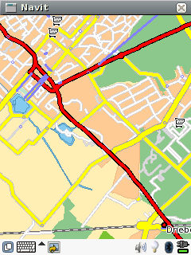
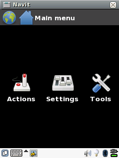
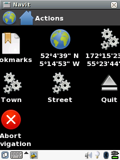

.. _gui_internal:

Gui internal
============

   gui internal

Configuration
-------------

Ok, first replace

`` type="gtk" ``

with

`` type="internal" ``

| in the <gui ... /> tag in `Configuationl <Configuationl>`__.
| Install librsvg. (or rather librsvg-2-gtk in case of the `Ångström
  development <Ångström_development>`__)
| (Re)start navit.
| You'll see a screen with the map with more room for the map when
  compared to the gtk view.
| If your OS provides you with a keyboard that you prefer to the one
  navit gives you, you should try setting

`` keyboard="false"``

inside the <gui .../> tag.

Menu
----

| Tick on the screen (I use an `ipaq <Ångström>`__), or click on the
  screen with the mouse and the screen switches to a menu.
| |gui internal menu| The menu has these items:

#. Actions
#. Settings
#. Tools

Actions
~~~~~~~

Under Actions we find: |Actions menu|

#. Bookmarks
#. Position where the map was clicked
#. Position of the vehicle
#. Town
#. Street
#. Quit
#. Abort navigation

Settings
~~~~~~~~

Under Settings we find: |Settings menu|

#. Display
#. Maps
#. Vehicle
#. Rules

| Under Display you can switch to a fullscreen map view without bars and
  change the map layout.

Tools
~~~~~

Under Tools we find:

nothing

Display
~~~~~~~

Under Display we find:

#. Layout
#. Window mode

Maps
~~~~

Under Maps we find:

#. Textfile
#. Binfile
#. Route
#. Route_graph
#. Navigation

Vehicle
~~~~~~~

Under Vehicle we find:

#. User vehicle(s)

Rules
~~~~~

Under Rules we find:

#. Stick to roads
#. Keep orientation to the north
#. Map follows vehicle
#. Attack defenseless civilians

.. _on_screen_display:

On Screen Display
-----------------

When you have the internal gui working, a next step could be to look at
the `On Screen Display <On_Screen_Display>`__, or OSD for short. Using
the OSD you can overlay the map with various items for status
information and control.

.. |Settings menu| image:: Screenshot-5.png
