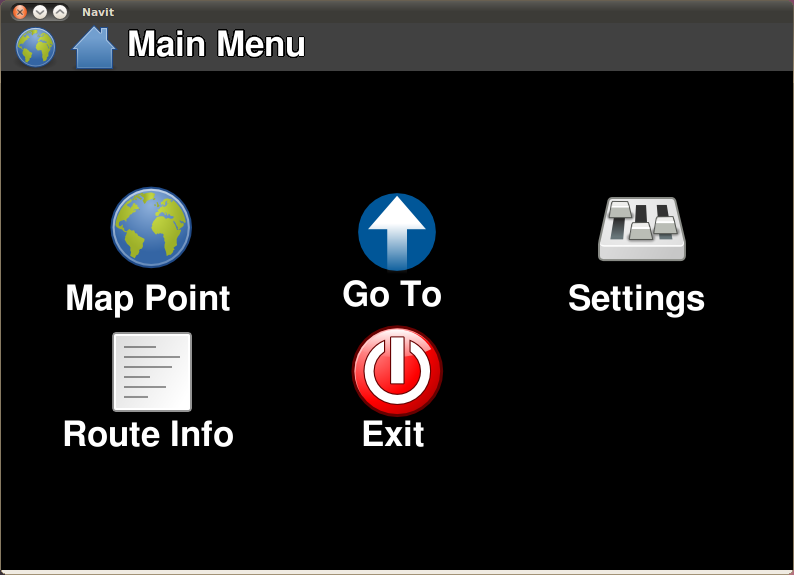
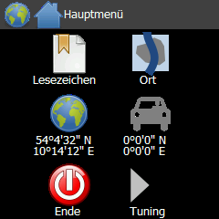
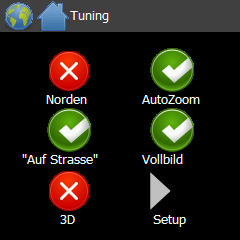
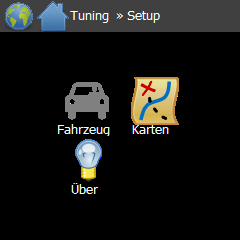

.. _internal_gui:

Internal GUI
============

The Internal GUI is designed to be used on touch screen devices, but
also work very well on other devices such as netbooks and laptops. It is
under continual development and as such features are constantly being
added and improved upon. If you think that a particular feature is
missing or poorly implemented, get in touch with us (see
:doc:`contacts </user/community/contacts>`) and consider filing a
feature request (see :doc:`Reporting bugs
</user/community/Reporting_Bugs>`).

The menu used by the Internal GUI is fully configurable using an
HTML-like syntax inside the ``<gui>`` element of ``navit.xml``; see
:ref:`Customizing the menu <internal_guimenu_configurations>` below for
details and ready-made configurations. The configuration options of the
``internal`` GUI itself (such as ``keyboard``, ``menu_on_map_click`` or
the icon sizes) are described on the :doc:`display options
</user/configuration/basic/display>` page.

Using the Internal GUI
----------------------

.. _internal_gui_initial_startup:

Initial Start-up
~~~~~~~~~~~~~~~~

|N810-OSD-Home.png| When Navit is first started using the Internal GUI
one should see (depending on the skin you have selected to use)
something similar to the image to the right. The layout of the internal
GUI is controlled by the OSD tags located in the navit.xml file. These
tags should be located within the first 100 lines of the file. For
information on how to modify the appearance of the OSD layout please
reference this link. :doc:`OSD </user/configuration/OSD>`

.. _internal_gui_basics:

Basics and breadcrumbs
~~~~~~~~~~~~~~~~~~~~~~

The Internal GUI should be mostly self-explanatory (that's the idea, at
least - if it is not, please file a bug). It basically consists of
different screens which show icons that can be clicked / touched, lists
(such as search results) and input fields. For text input, a **virtual
keyboard** is available. Of course, a regular hardware keyboard can be
used if available.

On all screens of the Internal GUI, there is a **breadcrumb trail** at
the top of the screen, which shows the current position inside the
screen hierarchy of the Internal GUI. The breadcrumbs are clickable, to
return to an earlier screen.

.. _internal_gui_view_in_browser:

View in Browser
~~~~~~~~~~~~~~~

Clicking a map item that corresponds to an OSM node, way or relation
opens a context menu containing a **View in Browser** item. Navit then
builds the matching `openstreetmap.org` browse URL and invokes the
external command ``navit-browser.sh '<url>'``.

To make this work, place a shell script named ``navit-browser.sh`` in
your ``PATH`` that opens the URL passed to it in a browser, for example:

.. code-block:: bash

   #!/bin/bash
   xdg-open "$@"

.. _internal_gui_keyboard_operation:

Operation with keyboard or rotary encoder
~~~~~~~~~~~~~~~~~~~~~~~~~~~~~~~~~~~~~~~~~

While the Internal GUI is mainly designed to be used with a mouse or
touch screen, it can also be operated using a (hardware) keyboard or
even a `rotary encoder <https://en.wikipedia.org/wiki/Rotary_encoder>`__
(which only offers "forward", "backward" and "enter").

The GUI elements can be navigated using arrow keys, and activated using
Enter, as usual. Additionally, all GUI elements can also be reached
using only PgUp/PgDown - this allows the use of a rotary encoder, if its
actions are mapped to these two keys.

When using a rotary encoder (or cursor keys), it may be useful to set
option hide_impossible_next_keys to hide irrelevant keys when searching.
See the :doc:`advanced options </user/configuration/advanced/options>`
for details.

*Support for rotary encoders was added in December 2015, and
hide_impossible_next_keys in February 2017.*

.. _internal_gui_main_menu:
.. _main_menu:

Main Menu
---------

|InternalGui-MainMenu.png| The main menu is accessed by a single click
(or tap for touch screen) anywhere on the map. From here all other
sub-menus and actions are accessible. The sub menu items are:

#. :ref:`Actions <internal_gui_actions>`
#. :ref:`Settings <internal_gui_settings>`
#. :ref:`Tools <internal_gui_tools>`
#. :ref:`Route <internal_gui_route>`
#. ``About`` - displays version and author information

|

.. _internal_gui_actions:

Actions
~~~~~~~

|InternalGUI-Actions.png| The Actions menu brings up several sub menus
that are focused primarily on routing and location finding. The sub menu
items are:

#. :ref:`Bookmarks <internal_gui_bookmarks>`
#. :ref:`Former destinations <internal_gui_former_destinations>`
#. :ref:`Map Point <internal_gui_map_point>`
#. :ref:`Current Location <internal_gui_vehicle_position>`
#. :ref:`Town <internal_gui_town>`
#. Quit - Closes Navit

|

.. _internal_gui_bookmarks:

Bookmarks
^^^^^^^^^

|InternalGUI-Bookmarks.png| Bookmarks provide a convenient way to store
often used destinations. Since Navit does not fully support entering a
complete address using OpenStreetMap maps, a user can locate some
oft-used destinations on the map and then add that point as a bookmark.
That way the next time the user would like a route for that particular
destination the user only has to select it from the Bookmarks menu and
does not have to go through the tedium of panning the map and zooming
into the destination location.

Bookmarks can be arranged hierarchical using / as a separator - anything
before the separator becomes the folder name; anything after the
separator becomes the bookmark name. For example, if you name your
bookmarks Friends/Joe and Friends/Bill, you will have a folder named
Friends and the bookmarks Bill and Joe in there.

| A fully functioning bookmark editor is currently not available, though
  some common edits can be performed from within the Bookmarks menu.
  Bookmarks are stored in a plain-text bookmarks file in your Navit
  directory (~/.navit on unix systems).

.. _internal_gui_former_destinations:

Former destinations
^^^^^^^^^^^^^^^^^^^

A list of the last destinations that were set in Navit. Every time a
destination is set (via a bookmark, via a map point or by searching for
an address and choosing it as a destination), the destination will be
added to this list.

The list of former destinations is a convenience feature, to quickly
reuse a destination. The functionality offered is similar to the
Bookmarks menu (however, the list cannot be edited, as it is meant as a
record of the destinations selected).

To prevent the list from getting too long to be useful, only a limited
number of destinations are kept (10 by default, configurable in
``navit.xml`` with the ``recent_dest`` attribute of the ``<navit>``
element, see :doc:`basic/general
</user/configuration/basic/general>`). So normally, each time a new
destination is selected, it will be added to the list, and the oldest
entry in the list will be discarded. As an exception, if a destination
is set that is already in the list, it will not be repeated in the list;
instead the entry will just be moved to the top.

.. _internal_gui_map_point:

Map Point
^^^^^^^^^

|InternalGUI-MapPoint.png| The world icon brings up the Map Point sub
menu for actions that can be performed for the point that was selected
on the map. The items contained in this sub menu are:

-  Set as Destination: Will generate a route to that location from
   either current GPS data or where vehicle position is manually set
   (see Vehicle Position).
-  Set as Position: If no GPS data is available then you can specify
   your "current" location in order to have a route generated from that
   position to your desired destination.
-  Add as Bookmark: Brings up a keyboard so a name can be entered for
   the bookmark. The point can then be easily recalled via the
   :ref:`Bookmark <internal_gui_bookmarks>` menu.
-  POIs: Brings up a list of all known POIs around the map point.

|

.. _internal_gui_pois:

POIs
''''

| |InternalGUI-POIs.png| The POIs sub menu shows all of the POIs that
  are close to the location that was clicked on the map, with the
  distance to the POI shown in kilometres. At the top of the menu there
  are various filter options that allow for specifying the types of POIs
  to be displayed. The user can click on the POI and select to be routed
  to that location. Navit will create a route from the current position
  to the location of the POI selected.

.. _internal_gui_vehicle_position:

Vehicle Position
^^^^^^^^^^^^^^^^

|InternalGUI-VehiclePosition.png| The vehicle icon brings up the Current
Location sub menu. This sub menu allows for various actions to be taken
for the GPS position of the device.

-  Set as Destination: Will generate a route to that location from
   either current GPS data or where vehicle position is manually set
   (see Vehicle Position).
-  Set as Position: If no GPS data is available then you can specify
   your "current" location in order to have a route generated from that
   position to your desired destination.
-  Add as Bookmark: Brings up a keyboard so a name can be entered for
   the bookmark. The point can then be easily recalled via the
   :ref:`Bookmark <internal_gui_bookmarks>` menu.
-  POIs: Brings up a list of all known POIs around the map point.
-  View on Map: Re-pans the map to display the current "known" position
   based upon GPS data.

|

.. _internal_gui_town:

Town
^^^^

|InternalGui-Town.png| The town icon allows for searching for different
cities within your map set. Note that Navit attempts to auto complete
the town name based upon names available in the mapset being used. On
slow devices this can result in a slight pause as each character is
typed in. Once a town is located and selected another sub menu will come
up allowing for a street to be found within that town.

The icon in the upper left corner (just below the world icon) shows the
current country which is being searched. To change the country just
click on the icon and another menu will appear allowing you to select
the country you would like to search in. Note that this menu also
attempts to auto complete as the user types in the name of a country.

Note that if you compiled Navit yourself there can be issues with the
icons not being properly generated. This will result in no icon image at
all. If you have this problem check your logs to see what is happening
during compiling.

| If you are having problems with search, please check the
  :doc:`FAQ </user/faq/index>`.

.. _internal_gui_settings:

Settings
~~~~~~~~

|InternalGUI-Settings.png| The settings menu provides several sub menus
to enable certain aspects of how Navit operates to be modified. Note
that at this time there is only a limited set of options that can be
changed through these sub menus. In order to change settings not
currently available in this sub-menu it is necessary to modify the
navit.xml file. At some point in the future a more robust settings menu
will be implemented that will allow for configuring Navit through a GUI
instead of the navit.xml file.

The sub menu items are:

#. :ref:`Display <internal_gui_display>`
#. :ref:`Maps <internal_gui_maps>`
#. :ref:`Vehicle <internal_gui_vehicle>`
#. :ref:`Rules <internal_gui_rules>`

|

.. _internal_gui_display:

Display
^^^^^^^

|InternalGUI-Display.png| The display sub menu provides items to control
various display features within Navit.

#. :ref:`Layout <internal_gui_layout>`
#. :ref:`Fullscreen/Window Mode <internal_gui_window_mode>`
#. :ref:`3D <internal_gui_3d>`

|

.. _internal_gui_layout:

Layout
''''''

| |InternalGUI-Layout.png| Layout allows for different layouts specified
  in the navit.xml file to be shown on the map. Different layouts can be
  used for different reasons including allowing one to see other friends
  position (if their GPS data is specified in the layout tag). Note that
  layout options MUST be enabled in the navit.xml file before they can
  be turned on or off in this menu.

.. _internal_gui_window_mode:

Window Mode (Toggle)
''''''''''''''''''''

Changes Navit from windowed mode to fullscreen mode and vice versa.

.. _internal_gui_3d:

3D (Toggle)
'''''''''''

This is a toggle button that enables / disables drawing the map in
either a 2D mode or a 3D mode. Currently the only way to modify the
"tilt" for the 3D mode is to modify the navit.xml file.

.. _internal_gui_maps:

Maps
^^^^

| |InternalGUI-Maps.png| Displays the maps that are specified in the
  navit.xml file and allows for activating/de-activating those maps.
  Note that a map must be enabled in navit.xml before it will appear in
  this menu.

.. _internal_gui_vehicle:

Vehicle
^^^^^^^

|InternalGUI-Vehicle.png| Brings up a menu showing what GPS device is
currently being used for the current vehicle. Tapping the GPS device
name opens a menu with available routing profiles.

|

.. _internal_gui_rules:

Rules
^^^^^

| |InternalGUI-Rules.png| The rules menu provides for options that
  change how Navit behaves when there is a satellite lock. Note that
  some of these items are currently not function and must be changed in
  the navit.xml file.

.. _internal_gui_tools:

Tools
~~~~~

The tools menu allows the user to check what Locale Navit is set to.

.. _internal_gui_route:

Route
~~~~~

|InternalGUI-Route.png| The route icon brings up the route menu that
will display the active route.

#. :ref:`Route Description <internal_gui_route_description>`
#. Height Profile, requires a dedicated binfile to providing
   heightlines.

|

.. _internal_gui_route_description:

Route Description
^^^^^^^^^^^^^^^^^

|InternalGUI-RouteDescription.png| The route description sub menu
displays all of the directions for the currently calculated route.

.. _internal_guimenu_configurations:
.. _internal_gui_menu_configurations:

Customizing the menu
--------------------

The menu used by the Internal GUI is defined by an HTML-like syntax
inside the ``<gui type="internal">`` element in ``navit.xml``. This
makes the menu highly configurable. Below are alternative configurations
contributed by users.

.. _installing_alternative_configurations:

Installing alternative configurations
~~~~~~~~~~~~~~~~~~~~~~~~~~~~~~~~~~~~~

If you want to try one of the configurations shown below, simply copy
the code for the configuration (including the leading and trailing
``]]>``) and paste it over the existing configuration within the
``<gui>`` element in ``navit.xml``.

.. _alternative_configurations:
.. _internal_gui_alternative_configurations:

Alternative configurations
~~~~~~~~~~~~~~~~~~~~~~~~~~

.. _netbook_configuration_1:

Netbook Configuration 1
^^^^^^^^^^^^^^^^^^^^^^^

This configuration is optimized for the small screens of netbooks:

-  :ref:`Map Point <internal_gui_map_point>` is in the main menu. It also
   appears in the "Go To" menu.
-  :ref:`Actions <internal_gui_actions>` has been renamed "Go To", and
   given a different icon.
-  "Exit" (old "Quit") has moved to the Main Menu.
-  :ref:`Tools <internal_gui_tools>` and the ``About`` entry have been
   removed.

::

   <![CDATA[
   <html>
           <text>Show Map</text></img>
           <!-- Main Menu -->
           <a name='Main Menu'><text>Main menu</text>

               Map Point</img>
               <a href='#Actions'>Go To</img></a>
               <a href='#Settings'><text>Settings</text></img></a>
               <a href='#Route'><text>Route Info</text></img></a>
               <text>Exit</text></img>
               <text>Stop Navigation</text></img>

           </a>

           <!-- Actions -->
           <a name='Actions'><text>Go To</text>

               <text>Bookmarks</text></img>
               </img>
               </img>
               <text>Town</text></img>

           </a>

           <!-- Settings -->
           <a name='Settings'><text>Settings</text>
               <a href='#Settings Display'><text>Display</text></img></a>
               <text>Maps</text></img>
               <text>Vehicle</text></img>
               <text>Rules</text></img>
           </a>

           <!-- Display -->
           <a name='Settings Display'><text>Display</text>
               <text>Layout</text></img>
               <text>Fullscreen</text></img>
               <text>Window Mode</text></img>
               <text>3D</text></img>
               <text>2D</text></img>
           </a>

           <!-- Route -->
           <a name='Route'><text>Route Information</text>
               <text>Description</text></img>
               <text>Height Profile</text></img>
           </a>
       </html>
   ]]>

.. _wvga_configuration_1:

WVGA Configuration 1
^^^^^^^^^^^^^^^^^^^^

Features of this menu:

-  Main menu:

   -  Actions
   -  Settings
   -  Route (if a route is active)
   -  Quit

-  Actions submenu:

   -  Bookmarks
   -  Town selection
   -  GPS position
   -  Vehicle position

-  Settings submenu:

   -  Fullscreen yes/no
   -  Map Selection
   -  3D/2D
   -  About

-  Route submenu:

   -  Vehicle Selection
   -  Route Description
   -  Route Height Profile
   -  Stop Navigation (if a route is active)

::

   <![CDATA[
   <html>
       <a name='Main Menu'><text>Main menu</text>
           <a href='#Actions'>                       <text>Actions</text></img></a>
           <a href='#Settings'>                        <text>Settings</text></img></a>
                                            <text>Quit</text></img>
                   <a cond='navit.route.route_status&amp;52' href='#Route'>
                                                             <text>Route</text></img></a>
       </a>

       <a name='Actions'><text>Actions</text>
                    <text>Bookmarks</text></img>
                         <text>Town</text></img>
                                </img>
                      </img>
       </a>

       <a name='Settings'><text>Settings</text>
                         <text>Fullscreen</text></img>
                         <text>Window Mode</text></img>
                       <text>Maps</text></img>

                    <text>3D</text> </img>
                    <text>2D</text> </img>
                              <text>About</text></img>
       </a>

       <a name='Route'><text>Route</text>
                             <text>Vehicle</text></img>

                                              <text>Description</text></img>
                                           <text>Height Profile</text></img>
                    <text>Stop Navigation</text></img>
       </a>
   </html>
   ]]>

.. _qvga_square_240x240_configuration_1_german:

QVGA Square (240x240) Configuration 1 (German)
^^^^^^^^^^^^^^^^^^^^^^^^^^^^^^^^^^^^^^^^^^^^^^

**Features**:

-  optimization for faster handling (e.g. all the "main actions" are in
   the first screen)
-  reduced numbers of screens (= menus)
-  included some additional features (e.g. autozoom, fixed-to-north,
   fixed-to-street, ...)
-  deleted some not (yet) used features (e.g. "Height Profile", ...)

Example: With the first tap on the screen you got the Main-Menu. Second
tap on bookmarks (1a), third tap on wanted target and forth tab on "set
as target" you can set up for navigation with in 4 taps at all. Thats
pretty fast.

**The three screens** (= menus):

-  1.) Main => select target to navigate or doing something with a
   position (actual GPS or Mappoint)
-  2.) Tuning => most used setups while navigating
-  3.) Setup => rarely used (system)settings

In the **Main-Menu** you can:

-  1a) Do something with your bookmarks (e.g. navigate to a bookmark)
-  1b) Do something with an address (e.g. navigate to an address)
-  1c) Do something with your "map-position" (e.g. save as a bookmark,
   navigate to, search POIs nearby, ...)
-  1d) Do something with your "GPS-position" (e.g. save as a bookmark,
   navigate to, search POIs nearby, ...)
-  1e) Exit navit
-  1f) Go to the next menu "Tuning"

In the **Tuning-Menu** you can:

-  2a) Toggle map fixed to north on/off (my default is "fixed to north
   off")
-  2b) Toggle "autozoom" on/off (my default is "autozoom on")
-  2c) Toggle GPS-position fixed to street on/off (my default is "fixed
   to street on")
-  2d) Toggle fullscreen on/off (my default is "fullscreen on")
-  2e) Toggle view 3d-view on/off (my default is "3d-view off")
-  2f) Go to the next menu "Setup"

(...all default values are defined and can be changed in the
"navit.xml")

In the **Setup-Menu** you can:

-  3a) Call the "vehicle-menu" (e.g. there you can change your actual
   vehicle-profile)
-  3b) Call the "map-menu" (e.g. there you can change your current map)
-  3c) Call the "about-site"
-  3d) Delete current navigaition-route (...only visible while
   navigating)

::

   <![CDATA[

   <html>
   <a name='Main Menu'><text>Main menu</text>
       <text>Bookmarks</text></img>
       <text>Town</text></img>
       </img>
       </img>
       <text>Quit</text></img>
       <a href='#Tuning'><text>Tuning</text></img></a>
   </a>

   <a name='Tuning'><text>Tuning</text>
       <text>Norden</text></img>
       =0' src='gui_active' onclick='navit.orientation=-1;redraw_map();back_to_map()'><text>Norden</text></img>

       <text>AutoZoom</text></img>
       <text>AutoZoom</text></img>

       <text>"Auf Strasse"</text></img>
       <text>"Auf Strasse"</text></img>

       <text>Vollbild</text></img>
       <text>Vollbild</text></img>

       <text>3D</text></img>
       <text>3D</text></img>

       <a href='#Setup'>Setup</img></a>
   </a>

   <a name='Setup'><text>Setup</text>
       <text>Vehicle</text></img>
       <text>Karten</text></img>
       <text>About</text></img>
       <text>Stop-Route</text></img>
   </a>

   </html>

   ]]>

.. _android_configuration:

Android Configuration
^^^^^^^^^^^^^^^^^^^^^

This is the configuration used on an Android phone. It is similar to
the QVGA Square (240x240) configuration. Placeholders are used for
conditional items when not in use.

::

   <![CDATA[
   <html>
     <a name='Main Menu'>
       <text>Main menu</text>
       <text>Town</text></img>

       <a href='#Actions'><text>Route</text></img></a>

       <text>Description</text></img>
       <text></text></img>

       <a href='#Settings'><text>Settings</text></img></a>

       <text>Show Map</text></img>

       <text>Quit</text></img>
     </a>

     <a name='Actions'>
       <text>Actions</text>
       <text>Town</text></img>

       <text>Bookmarks</text></img>

       <text>Map
                                                                                                                                           Position</text></img>
       <text></text></img>

       <text>Vehicle
                                                                                                                                           Position</text></img>
       <text></text></img>

       <a cond='navit.route.route_status&amp;52' href='#Route'><text>Route
                                                                                                                          Info</text></img></a>
       <text></text></img>

       <text>Stop
   Navigation</text></img>
       <text></text></img>
     </a>

     <a name='Settings'>
       <text>Settings</text>
       <text>3D</text></img>
       <text>3D</text></img>

       <text>Einnorden</text></img>
       =0' src='gui_active' onclick='navit.orientation=-1;redraw_map();back_to_map()'><text>Einnorden</text></img>

       <text>AutoZoom</text></img>
       <text>AutoZoom</text></img>

       <text>Map
                                                                                                                  Tracking</text></img>
       <text>Map
                                                                                                                Tracking</text></img>

       <a href='#Main Menu'><text>Back</text></img></a>

       <a href='#Settings Display'><text>More</text></img></a>
     </a>

     <a name='Settings Display'>
       <text>More Settings</text>
       <text>Vehicle</text></img>

       <text>Maps</text></img>

       <text>Display
                                                              Layout</text></img>

       <text>About</text></img>

       <a href='#Settings'> <text>Back</text></img></a>
     </a>

     <a name='Tools'>
       <text>Tools</text>
       <text>Show Locale</text></img>
     </a>

     <a name='Route'>
       <text>Route</text>
       <text>Description</text></img>

       <text>Height Profile</text></img>
     </a>
   </html>
   ]]>

.. _at_android_gui:

0606.at Android GUI
^^^^^^^^^^^^^^^^^^^

This is the Internal GUI configuration used in the 0606.at Android
Layout (only the font size has to be set to 466 instead of 700 for MDPI
versions).

See also: :doc:`OSD Layouts </user/configuration/OSD_Layouts>`.

::

   <gui type="internal" enabled="yes" font_size="700" ><![CDATA[
                   <html>
                   <a name='Main Menu'><text>Main menu</text>
             <text>Town</text></img>
             </img>
                       <text>Bookmarks</text></img>
                       <text>Show Map</text></img>
                       <a href='#Settings'><text>Settings</text></img></a>
             <a href='#Route'><text>Route</text></img></a>
             <text>Quit</text></img>
                   </a>
               <a name='Settings'><text>Settings</text>
                   <a href='#Settings Display'><text>Display</text></img></a>
                   <text>Maps</text></img>
                   <text>Vehicle</text></img>
                   <text>Rules</text></img>
           <text>About</text></img>
           <text>Norden</text></img>
       =0' src='gui_active' onclick='navit.orientation=-1;redraw_map();back_to_map()'><text>Norden</text></img>

       <text>AutoZoom</text></img>
       <text>AutoZoom</text></img>

       <text>"Auf Strasse"</text></img>
       <text>"Auf Strasse"</text></img>
           <a href='#Tools'><text>Tools</text></img></a>
               </a>
               <a name='Settings Display'><text>Display</text>
                   <text>Layout</text></img>
                   <text>Fullscreen</text></img>
                   <text>Window Mode</text></img>
               </a>
               <a name='Tools'><text>Tools</text>
                   <text>Show Locale</text></img>
           <text>3D</text></img>
                   <text>2D</text></img>
               </a>
               <a name='Route'><text>Route</text>
                   <text>Description</text></img>
                   <text>Height Profile</text></img>
           <text>Stop
   Navigation</text></img>
               </a>
               </html>
           ]]></gui>

.. |N810-OSD-Home.png| image:: N810-OSD-Home.png
   :width: 300px
.. |InternalGui-MainMenu.png| image:: InternalGui-MainMenu.png
   :width: 300px
.. |InternalGUI-Actions.png| image:: InternalGUI-Actions.png
   :width: 300px
.. |InternalGUI-Bookmarks.png| image:: InternalGUI-Bookmarks.png
   :width: 300px
.. |InternalGUI-MapPoint.png| image:: InternalGUI-MapPoint.png
   :width: 300px
.. |InternalGUI-POIs.png| image:: InternalGUI-POIs.png
   :width: 300px
.. |InternalGUI-VehiclePosition.png| image:: InternalGUI-VehiclePosition.png
   :width: 300px
.. |InternalGui-Town.png| image:: InternalGui-Town.png
   :width: 300px
.. |InternalGUI-Settings.png| image:: InternalGUI-Settings.png
   :width: 300px
.. |InternalGUI-Display.png| image:: InternalGUI-Display.png
   :width: 300px
.. |InternalGUI-Layout.png| image:: InternalGUI-Layout.png
   :width: 300px
.. |InternalGUI-Maps.png| image:: InternalGUI-Maps.png
   :width: 300px
.. |InternalGUI-Vehicle.png| image:: InternalGUI-Vehicle.png
   :width: 300px
.. |InternalGUI-Rules.png| image:: InternalGUI-Rules.png
   :width: 300px
.. |InternalGUI-Route.png| image:: InternalGUI-Route.png
   :width: 300px
.. |InternalGUI-RouteDescription.png| image:: InternalGUI-RouteDescription.png
   :width: 300px
