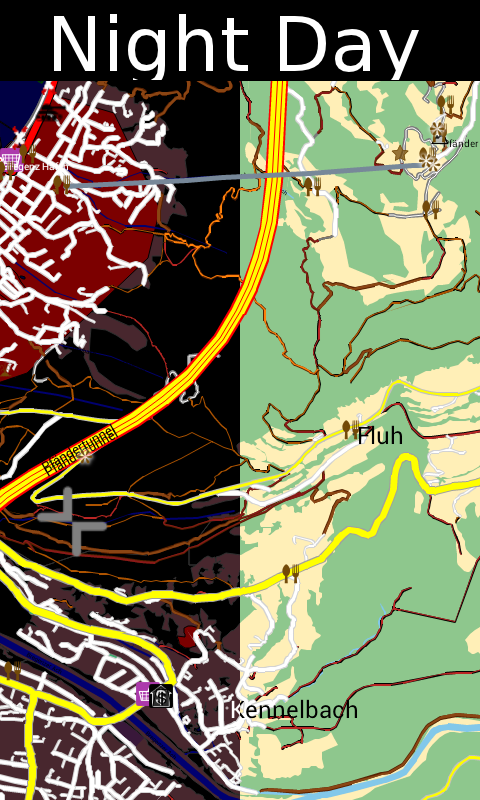

Layout
======

The way a `map <map>`__ and `cursor <cursor>`__ (the thing that shows
your current location) is rendered in Navit is controlled by the
particular Layout which has been selected. As with almost everything
else in Navit, Layouts are highly configurable. Below are user-submitted
examples of Navit Layouts.

Adding a Layout
---------------

If you want to share a layout with other Navit users, please do so using
this page. Leave this page as an introduction to your layout (use the
other layout descriptions as a template), and link to a new page in the
Layout/ namespace where you can include extra images and the relevant
xml code

Alternate Layouts
-----------------

`Mapnik <Layout/mapnik>`__
~~~~~~~~~~~~~~~~~~~~~~~~~~

`right|300px|text-top|thumb|Mapnik-style map
layout <image:Layout_osm_2.png>`__ This layout tries to closely mimick
the Mapnik rendering style used by default over at
`OpenStreetMap <http://www.openstreetmap.org>`__. It even uses the same
icon styles where available (this means you will have to download the
relevant icons - a link is provided).

`Go to layout <Layout/mapnik>`__

Features
^^^^^^^^

-  Cycle ways are more prominently displayed in purple
-  Routing is shown with a bright green line which is overlaid onto the
   road, rather than a fat blue line underneath it. Road names appear
   above the routing line.
-  Zoom settings for various POIs have been changed. For example, fuel
   station POIs are shown out to quite a far zoom level.

   -  I have tried to make sure that POIs which will be most important
      to *navigating drivers* are prominently displayed, whilst those
      which are perhaps interesting but not very useful when navigating
      are less noticeable and/or only show up when zooming in closer.
      This is so that unhelpful POIs do not clutter up the map view.

-  Bus stops are shown with a blue ring, until zoomed in quite close
   when a proper icon is used.

   -  There are a lot of bus stops everywhere, and the POI icon was
      cluttering up the map. The unobtrusive blue ring is still
      noticeable, but less annoying!

-  Mini-roundabout icons have been removed, and are now shown by black
   rings.
-  A few POI types which do not appear in maptool's osm.c (i.e. don't
   actually get converted from OSM and won't currently appear in the
   Navit data) have been removed.

|

Mapnik for small screens
~~~~~~~~~~~~~~~~~~~~~~~~

`right|300px|text-top|thumb|Mapnik-style map layout for small screens.
This image uses
the <image:0606_Screenshot_2012-02-27-22-07-03.png>`__\ `0606.at <OSD_Layouts#0606.at_Android_Layout>`__\ `OSD
layout. <image:0606_Screenshot_2012-02-27-22-07-03.png>`__ Based upon
the original Mapnik style, these map layouts are optimised for devices
with smaller screens. There are two layouts available:

-  HDPI - for high definition small screens. `Go to
   layout <Layout/mapnik-for-hdpi>`__
-  MDPI - for medium definition small screens. `Go to
   layout <Layout/mapnik-for-mdpi>`__

Features
^^^^^^^^

-  Only for navigation important POIs are shown
-  Reduced the number of visible elements at higher zoom levels
-  Increased font sizes for town and street names

See also
^^^^^^^^

This map layout was developed together with the `0606.at OSD layout for
Android <OSD_Layouts#0606.at_Android_Layout>`__. Check out the OSD
layout for a simple download package to install both this map layout and
the OSD layout, and all associated icons and POI image files.

|

`Snow <Layout/snow>`__
~~~~~~~~~~~~~~~~~~~~~~

`right|300px|text-top|thumb|Snow-style map layout <image:Snow.png>`__
Snow style theme, optimised for the iPod/iPhone.

`Go to layout <Layout/snow>`__

|

`High-Visibility <Layout/hi_vis>`__
~~~~~~~~~~~~~~~~~~~~~~~~~~~~~~~~~~~

`right|300px|text-top|thumb|Hi-Vis style layout <image:Hi_vis2.jpg>`__
Trying to read a computer screen in full sun with aging eyes and
sunglasses on while driving is difficult - this high-visibility layout
attempts to address those problems.

`Go to layout <Layout/hi_vis>`__

Features
^^^^^^^^

-  Cursor changes:

   -  Enlarged
   -  Different colour

-  Altered route colour
-  Street changes

   -  street_1_city is brown with a beige border
   -  street_2_city is brown with a black border
   -  street_3_city is a orange with a grey border

-  Changed activation zoom levels for airport POI icons

`Detailed Camping Biker <Layout/detailedcampingbike>`__
~~~~~~~~~~~~~~~~~~~~~~~~~~~~~~~~~~~~~~~~~~~~~~~~~~~~~~~

   Layout_Detailed_Camping_Biker.png

Features
^^^^^^^^

| Many pois are visible like housenumbers, Camping, Restaurants,
  Bakerys, Shops for food, Peaks (with names), Unknown (points with
  names).
| Tracks, Paths, hiking paths and so on have different colors to
  distinguish them. `Go to layout <Layout/detailedcampingbike>`__

`bike <Layout/bike>`__
~~~~~~~~~~~~~~~~~~~~~~

`right|300px|text-top|thumb|bike layout <image:bike.jpg>`__ because all
other layouts are not displaying bike paths properly on winCE devices,
i've rolled my own. it is simple and needs fixing and refining. most
POI's are hidden - this is one of things which should be changed. it is
also not independent from car layout - another problem

`Go to layout <Layout/bike>`__

Features
^^^^^^^^

-  bike paths visible green
-  less confortable but still fine roads are visible in brown
-  everything else is much like car layout
-  no dashed lines - suitable for winCE

Alternate Cursors
-----------------

The cursor is also defined in the layout, and alternate cursors are
shown below. If you would like to share your alternate cursor design,
but haven't really changed the rest of the layout, add it below!

2D Car
~~~~~~

`left|300px|text-top|thumb|2D car cursor <image:NavitScreenshot.jpg>`__

+----------------------------------------------------------+
| Layout XML                                               |
+==========================================================+
| .. code:: xml                                            |
|                                                          |
|    <cursor w="50" h="50">                                |
|        <itemgra>                                         |
|            <!-- Car outline -->                          |
|            <polyline color="#ffffff" width="12">         |
|                <coord x="-16" y="0"/>                    |
|                <coord x="15" y="0"/>                     |
|            </polyline>                                   |
|            <polyline color="#ffffff" width="5">          |
|                <coord x="-16" y="0"/>                    |
|                <coord x="-13" y="13"/>                   |
|                <coord x="13" y="13"/>                    |
|                <coord x="16" y="0"/>                     |
|            </polyline>                                   |
|            <polyline color="#ffffff" width="7">          |
|                <coord x="-10" y="-7"/>                   |
|                <coord x="-10" y="-12"/>                  |
|            </polyline>                                   |
|            <polyline color="#ffffff" width="7">          |
|                <coord x="10" y="-7"/>                    |
|                <coord x="10" y="-12"/>                   |
|            </polyline>                                   |
|            <!-- Car -->                                  |
|            <polyline color="#0000ff" width="10">         |
|                <coord x="-15" y="0"/>                    |
|                <coord x="15" y="0"/>                     |
|            </polyline>                                   |
|            <polyline color="#0000ff" width="3">          |
|                <coord x="-16" y="0"/>                    |
|                <coord x="-13" y="13"/>                   |
|                <coord x="13" y="13"/>                    |
|                <coord x="16" y="0"/>                     |
|            </polyline>                                   |
|            <polyline color="#0000ff" width="5">          |
|                <coord x="-10" y="-7"/>                   |
|                <coord x="-10" y="-12"/>                  |
|            </polyline>                                   |
|            <polyline color="#0000ff" width="5">          |
|                <coord x="10" y="-7"/>                    |
|                <coord x="10" y="-12"/>                   |
|            </polyline>                                   |
|        </itemgra>                                        |
|        <itemgra speed_range="-2">                        |
|            <!--Back lights off -->                       |
|            <circle color="#000000" radius="5" width="2"> |
|                <coord x="-12" y="0"/>                    |
|            </circle>                                     |
|            <circle color="#000000" radius="5" width="2"> |
|                <coord x="12" y="0"/>                     |
|            </circle>                                     |
|        </itemgra>                                        |
|        <itemgra speed_range="3-">                        |
|            <!--Back lights on -->                        |
|            <circle color="#ff0000" radius="5" width="2"> |
|                <coord x="-12" y="0"/>                    |
|            </circle>                                     |
|            <circle color="#ff0000" radius="5" width="2"> |
|                <coord x="12" y="0"/>                     |
|            </circle>                                     |
|            <!-- Speed lines -->                          |
|            <polyline color="#ffffff" width="3">          |
|                <coord x="-17" y="-12"/>                  |
|                <coord x="-20" y="-20"/>                  |
|            </polyline>                                   |
|            <polyline color="#000000" width="1">          |
|                <coord x="-17" y="-12"/>                  |
|                <coord x="-20" y="-20"/>                  |
|            </polyline>                                   |
|            <polyline color="#ffffff" width="3">          |
|                <coord x="-10" y="-16"/>                  |
|                <coord x="-13" y="-24"/>                  |
|            </polyline>                                   |
|            <polyline color="#000000" width="1">          |
|                <coord x="-10" y="-16"/>                  |
|                <coord x="-13" y="-24"/>                  |
|            </polyline>                                   |
|            <polyline color="#ffffff" width="3">          |
|                <coord x="17" y="-12"/>                   |
|                <coord x="20" y="-20"/>                   |
|            </polyline>                                   |
|            <polyline color="#000000" width="1">          |
|                <coord x="17" y="-12"/>                   |
|                <coord x="20" y="-20"/>                   |
|            </polyline>                                   |
|            <polyline color="#ffffff" width="3">          |
|                <coord x="10" y="-16"/>                   |
|                <coord x="13" y="-24"/>                   |
|            </polyline>                                   |
|            <polyline color="#000000" width="1">          |
|                <coord x="10" y="-16"/>                   |
|                <coord x="13" y="-24"/>                   |
|            </polyline>                                   |
|        </itemgra>                                        |
|    </cursor>                                             |
+----------------------------------------------------------+

2D Car black for 10,2"
~~~~~~~~~~~~~~~~~~~~~~

`left|300px <image:Green.png>`__

+------------------------------------------------------------------+
| Layout XML                                                       |
+==================================================================+
| .. code:: xml                                                    |
|                                                                  |
|    <cursor w="70" h="70">                                        |
|            <itemgra>                                             |
|                <!-- Car outline -->                              |
|                <polyline color="#ffffff" width="24">             |
|                    <coord x="-28" y="0"/>                        |
|                    <coord x="28" y="0"/>                         |
|                </polyline>                                       |
|                <polyline color="#ffffff" width="8">              |
|                    <coord x="-30" y="0"/>                        |
|                    <coord x="-15" y="26"/>                       |
|                    <coord x="15" y="26"/>                        |
|                    <coord x="30" y="0"/>                         |
|                </polyline>                                       |
|                <polyline color="#ffffff" width="12">             |
|                    <coord x="-25" y="-7"/>                       |
|                    <coord x="-25" y="-15"/>                      |
|                </polyline>                                       |
|                <polyline color="#ffffff" width="12">             |
|                    <coord x="25" y="-7"/>                        |
|                    <coord x="25" y="-15"/>                       |
|                </polyline>                                       |
|                                                                  |
|                                                                  |
|                <!-- Car -->                                      |
|                <polyline color="#00000f" width="22">             |
|                    <coord x="-28" y="0"/>                        |
|                    <coord x="28" y="0"/>                         |
|                </polyline>                                       |
|                <polyline color="#00000f" width="6">              |
|                                                                  |
|                                                                  |
|                    <coord x="-30" y="0"/>                        |
|                    <coord x="-15" y="26"/>                       |
|                    <coord x="15" y="26"/>                        |
|                    <coord x="30" y="0"/>                         |
|                                                                  |
|                </polyline>                                       |
|                           <!-- left tire -->                     |
|                <polyline color="#00000f" width="10">             |
|                    <coord x="-25" y="-7"/>                       |
|                    <coord x="-25" y="-15"/>                      |
|                          <!-- right tire -->                     |
|                </polyline>                                       |
|                <polyline color="#00000f" width="10">             |
|                    <coord x="25" y="-7"/>                        |
|                    <coord x="25" y="-15"/>                       |
|                </polyline>                                       |
|                                                                  |
|                                                                  |
|            </itemgra>                                            |
|            <itemgra speed_range="-2">                            |
|                                                                  |
|                <!--Back lights:brake -->                         |
|                <polyline color="#ff0000" width="8">              |
|                    <coord x="-20" y="0"/>                        |
|                    <coord x="-28" y="0"/></polyline>             |
|                             <polyline color="#ff0000" width="8"> |
|                    <coord x="20" y="0"/>                         |
|                    <coord x="28" y="0"/></polyline>              |
|                                                                  |
|                                                                  |
|                                                                  |
|                <polyline color="#ff0000" width="6">              |
|                    <coord x="-7" y="24"/>                        |
|                    <coord x="7" y="24"/>                         |
|                </polyline>                                       |
|                                                                  |
|                                                                  |
|            </itemgra>                                            |
|            <itemgra speed_range="3-">                            |
|                                                                  |
|                <!--Back lights: drive -->                        |
|                                                                  |
|    <polyline color="#ff0000" width="6">                          |
|                    <coord x="-20" y="0"/>                        |
|                    <coord x="-28" y="0"/></polyline>             |
|    <polyline color="#ff0000" width="6">                          |
|                    <coord x="20" y="0"/>                         |
|                    <coord x="28" y="0"/></polyline>              |
|                                                                  |
|                                                                  |
|                                                                  |
|                <!-- Speed lines -->                              |
|                            <polyline color="#ffffff" width="4">  |
|                    <coord x="-17" y="-12"/>                      |
|                    <coord x="-23" y="-28"/>                      |
|                </polyline>                                       |
|                <polyline color="#000000" width="3">              |
|                    <coord x="-17" y="-12"/>                      |
|                    <coord x="-23" y="-28"/>                      |
|                </polyline>                                       |
|                <polyline color="#ffffff" width="4">              |
|                    <coord x="-10" y="-16"/>                      |
|                    <coord x="-16" y="-32"/>                      |
|                </polyline>                                       |
|                <polyline color="#000000" width="3">              |
|                    <coord x="-10" y="-16"/>                      |
|                    <coord x="-16" y="-32"/>                      |
|                </polyline>                                       |
|                <polyline color="#ffffff" width="4">              |
|                    <coord x="17" y="-12"/>                       |
|                    <coord x="23" y="-28"/>                       |
|                </polyline>                                       |
|                <polyline color="#000000" width="3">              |
|                    <coord x="17" y="-12"/>                       |
|                    <coord x="23" y="-28"/>                       |
|                </polyline>                                       |
|                <polyline color="#ffffff" width="4">              |
|                    <coord x="10" y="-16"/>                       |
|                    <coord x="16" y="-32"/>                       |
|                </polyline>                                       |
|                <polyline color="#000000" width="3">              |
|                    <coord x="10" y="-16"/>                       |
|                    <coord x="16" y="-32"/>                       |
|                </polyline>                                       |
|            </itemgra>                                            |
|        </cursor>                                                 |
+------------------------------------------------------------------+

|

2D cursor tangoGPS-like
~~~~~~~~~~~~~~~~~~~~~~~

`left|200px <image:TangoGPS_cursor.png>`__

+------------------------------------------------------------+
| Layout XML                                                 |
+============================================================+
| .. code:: xml                                              |
|                                                            |
|    <cursor w="50" h="50">                                  |
|        <itemgra>                                           |
|            <circle color="#ffffff" radius="20" width="20"> |
|                <coord x="0" y="0"/>                        |
|            </circle>                                       |
|            <circle color="#0000ff" radius="30" width="5">  |
|                <coord x="0" y="0"/>                        |
|            </circle>                                       |
|        </itemgra>                                          |
|        <itemgra speed_range="-2">                          |
|            <circle color="#0000ff" radius="4" width="5">   |
|                <coord x="0" y="0"/>                        |
|            </circle>                                       |
|        </itemgra>                                          |
|        <itemgra speed_range="3-">                          |
|            <polyline color="#ffffff" width="11">           |
|                <coord x="0" y="0"/>                        |
|                <coord x="0" y="20"/>                       |
|            </polyline>                                     |
|            <polyline color="#0000ff" width="8">            |
|                <coord x="0" y="0"/>                        |
|                <coord x="0" y="20"/>                       |
|            </polyline>                                     |
|        </itemgra>                                          |
|    </cursor>                                               |
+------------------------------------------------------------+

|

3D Arrow-head
~~~~~~~~~~~~~

Note that the screenshot below left was taken on an Android - not all
graphics drivers support the drop shadow underneath the arrow, as shown
by the screenshot from Navit on Windows Vista () `300px|text-top|3D
Arrow-head cursor <image:3D-arrow-head.png>`__   `500px|text-top|3D
Arrow-head cursor on Windows <image:3D-arrow-head-windows.png>`__

+------------------------------------------------------------+
| Layout XML                                                 |
+============================================================+
| .. code:: xml                                              |
|                                                            |
|    <cursor w="30" h="32">                                  |
|        <itemgra speed_range="-2">                          |
|            <polyline color="#00BC00" radius="0" width="4"> |
|                <coord x="0" y="0"/>                        |
|            </polyline>                                     |
|            <circle color="#008500" radius="8" width="3">   |
|                <coord x="0" y="0"/>                        |
|            </circle>                                       |
|            <circle color="#00BC00" radius="14" width="3">  |
|                <coord x="0" y="0"/>                        |
|            </circle>                                       |
|            <circle color="#008500" radius="20" width="3">  |
|                <coord x="0" y="0"/>                        |
|            </circle>                                       |
|        </itemgra>                                          |
|        <itemgra speed_range="3-">                          |
|            <polygon color="#00000066">                     |
|                <coord x="-14" y="-18"/>                    |
|                <coord x="0" y="8"/>                        |
|                <coord x="14" y="-18"/>                     |
|                <coord x="0" y="-8"/>                       |
|                <coord x="-14" y="-18"/>                    |
|            </polygon>                                      |
|            <polygon color="#008500">                       |
|                <coord x="-14" y="-12"/>                    |
|                <coord x="0" y="14"/>                       |
|                <coord x="0" y="-2"/>                       |
|                <coord x="-14" y="-12"/>                    |
|            </polygon>                                      |
|            <polygon color="#00BC00">                       |
|                <coord x="14" y="-12"/>                     |
|                <coord x="0" y="14"/>                       |
|                <coord x="0" y="-2"/>                       |
|                <coord x="14" y="-12"/>                     |
|            </polygon>                                      |
|            <polyline color="#008500" width="2">            |
|                <coord x="-14" y="-12"/>                    |
|                <coord x="0" y="14"/>                       |
|                <coord x="0" y="-2"/>                       |
|                <coord x="-14" y="-12"/>                    |
|            </polyline>                                     |
|            <polyline color="#008500" width="2">            |
|                <coord x="14" y="-12"/>                     |
|                <coord x="0" y="14"/>                       |
|                <coord x="0" y="-2"/>                       |
|                <coord x="14" y="-12"/>                     |
|            </polyline>                                     |
|        </itemgra>                                          |
|    </cursor>                                               |
+------------------------------------------------------------+

|
