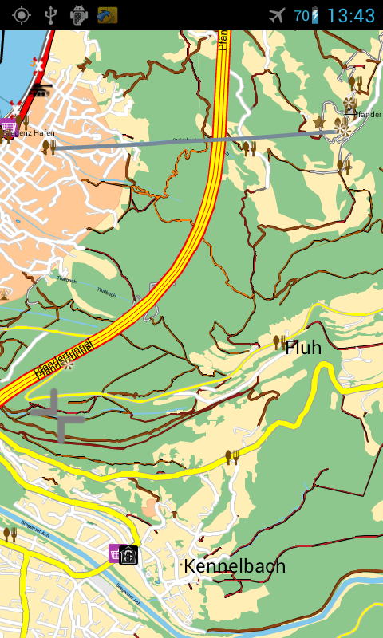
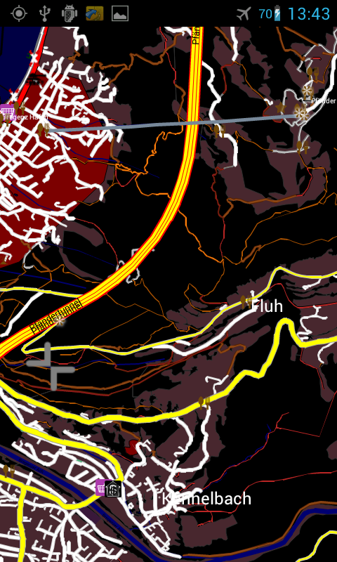
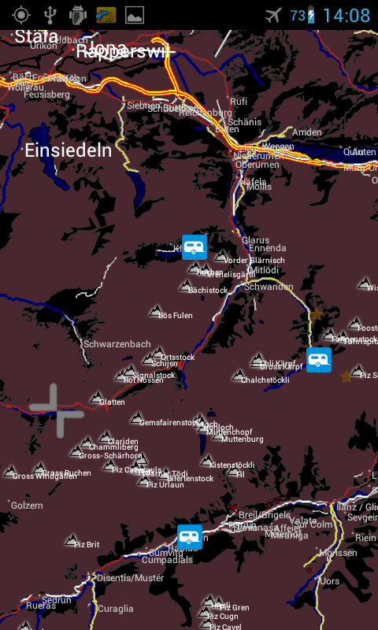

Layout/detailedcampingbike
==========================

Detailed Camping Biker
======================

A Map created for bycicle rider who want to se campingplaces shops and
so on and no fuelstations or parking places. Most of the POI icons have
been changed to those which are used within Mapnik, and they can be
found here: http://www.sjjb.co.uk/mapicons/downloads. download the .zip
file. extract the folder with the .png icons into your navitfolder and
rename this folder to "icons".

--------------

`How to install (on Android) <Android>`__ `how to add the Mapdata of
OpenStreetMap <OpenStreetMap#Quick_Start>`__

--------------

Features
--------

| This Layout contains Night and Day Layout Many pois are visible like
  housenumbers, Camping, Restaurants, Bakerys, Shops for food, Peaks
  (with names), Unknown (points with names).
| Tracks, Paths, hiking paths and so on have different colors to
  distinguish them.

Screenshots
-----------

|250px|   |image1|   |image2|

XML
---

Copy and paste the following XML into navit.xml. Last update 12.01.13

.. code:: xml

             <layout name="+ Detailed Camping Biker" nightlayout="+ Detailed Camping Biker Night" color="#ffefb7" font="Liberation Sans" active="1">
               <cursor w="26" h="26">
                   <itemgra>
                       <circle color="#0000ff" radius="24" width="4">
                           <coord x="0" y="0"/>
                       </circle>
                   </itemgra>
                   <itemgra speed_range="-2">
                       <polyline color="#0000ff" width="2">
                           <coord x="0" y="0"/>
                           <coord x="0" y="0"/>
                       </polyline>
                   </itemgra>
                   <itemgra speed_range="3-">
                       <polyline color="#0000ff" width="2">
                           <coord x="-7" y="-10"/>
                           <coord x="0" y="12"/>
                           <coord x="7" y="-10"/>
                       </polyline>
                   </itemgra>
               </cursor>

               <layer name="Landuse">
                   <itemgra item_types="image" order="0-">
                       <image/>
                   </itemgra>
                   <itemgra item_types="poly_wood" order="0-">
                       <polygon color="#8ec78d"/>
                   </itemgra>
                   <itemgra item_types="poly_town" order="0-">
                       <polygon color="#ffc895"/>
                       <polyline color="#ebb481"/>
                   </itemgra>
                   <itemgra item_types="poly_park" order="11-">
                       <polygon color="#7cc334"/>
                       <text text_size="5"/>
                   </itemgra>
                   <itemgra item_types="poly_water" order="0-">
                       <polygon color="#82c8ea"/>
                       <polyline color="#5096b8"/>
                       <text text_size="5"/>
                   </itemgra>
                   <itemgra item_types="poly_land" order="0-">
                       <polygon color="#ffefb7"/>
                       <polyline color="#ffefb7"/>
                       <text text_size="5"/>
                   </itemgra>
                   <itemgra item_types="poly_airport" order="10-">
                       <polygon color="#a0a0a0"/>
                   </itemgra>
                   <itemgra item_types="poly_sport" order="9-">
                       <polygon color="#ff8c00"/>
                   </itemgra>
                   <itemgra item_types="poly_industry,poly_place,poly_railway" order="10-">
                       <polygon color="#e6e6e6"/>
                   </itemgra>
                   <itemgra item_types="poly_commercial" order="12-">
                       <polygon color="#fff8dc"/>
                   </itemgra>
                   <itemgra item_types="poly_industry,poly_place,poly_brownfield,poly_greenfield,poly_construction,poly_railway" order="12-">
                       <polygon color="#ecd8ff"/>
                   </itemgra>
                   <itemgra item_types="poly_farm" order="12-">
                       <polygon color="#c7f1a3"/>
                       <polyline color="#79c691"/>
                       <text text_size="5"/>
                   </itemgra>
                   <itemgra item_types="poly_scree,poly_scrub,poly_fell,poly_heath" order="12-">
                       <polygon color="#c7f1a3"/>
                       <polyline color="#79c691"/>
                       <text text_size="5"/>
                   </itemgra>
                   <itemgra item_types="poly_marsh,poly_mud,poly_quarry" order="12-">
                       <polygon color="#DEB887"/>
                       <polyline color="#DEB887"/>
                       <text text_size="5"/>
                   </itemgra>
                   <itemgra item_types="poly_allotments,poly_playground,poly_village_green,poly_recreation_ground,poly_common,poly_garden" order="12-">
                       <polygon color="#c7f1a3"/>
                       <polyline color="#79c691"/>
                       <text text_size="10"/>
                   </itemgra>
                   <itemgra item_types="poly_ruins" order="12-">
                       <polygon color="#b6a6a6"/>
                   </itemgra>
                   <itemgra item_types="poly_apron" order="0-">
                       <polygon color="#d0d0d0"/>
                   </itemgra>
                   <itemgra item_types="poly_terminal" order="7-">
                       <polygon color="#e3c6a6"/>
                   </itemgra>
                   <itemgra item_types="poly_cemetery" order="12-">
                       <polygon color="#bde3cb"/>
                   </itemgra>
                   <itemgra item_types="poly_car_parking" order="12-">
                       <polygon color="#d2d2d2"/>
                   </itemgra>
                   <itemgra item_types="poly_building" order="12-">
                       <polygon color="#ff6347"/>
                   </itemgra>
               </layer>
               <layer name="Contour Lines">
                   <itemgra item_types="height_line_1" order="8">
                       <polyline color="#A9A9A9" width="1"/>
                       <text text_size="8"/>
                   </itemgra>
                   <itemgra item_types="height_line_1" order="9">
                       <polyline color="#A9A9A9" width="2"/>
                       <text text_size="8"/>
                   </itemgra>
                   <itemgra item_types="height_line_2" order="9">
                       <polyline color="#A9A9A9" width="1"/>
                       <text text_size="8"/>
                   </itemgra>
                   <itemgra item_types="height_line_1" order="10-">
                       <polyline color="#A9A9A9" width="3"/>
                       <text text_size="8"/>
                   </itemgra>
                   <itemgra item_types="height_line_2" order="10-">
                       <polyline color="#A9A9A9" width="2"/>
                       <text text_size="8"/>
                   </itemgra>
                   <itemgra item_types="height_line_3" order="10-">
                       <polyline color="#A9A9A9" width="1"/>
                   </itemgra>
               </layer>
               <!-- "Contour Lines" -->

               <layer name="Barriers">
                   <itemgra item_types="ditch" order="13-">
                       <polyline color="#B8860B" width="1"/>
                       <text text_size="8"/>
                   </itemgra>
                   <itemgra item_types="hedge" order="13-">
                       <polyline color="#90EE90" width="1"/>
                       <text text_size="8"/>
                   </itemgra>
                   <itemgra item_types="fence" order="13-">
                       <polyline color="#808080" width="1"/>
                       <text text_size="8"/>
                   </itemgra>
                   <itemgra item_types="wall" order="13-">
                       <polyline color="#808080" width="1"/>
                       <text text_size="8"/>
                   </itemgra>
                   <itemgra item_types="retaining_wall" order="13-">
                       <polyline color="#808080" width="1"/>
                       <text text_size="8"/>
                   </itemgra>
                   <itemgra item_types="city_wall" order="13-">
                       <polyline color="#CD5C5C" width="1"/>
                       <text text_size="8"/>
                   </itemgra>
               </layer>
               <!-- "Barriers" -->

               <layer name="Waterways">
                   <itemgra item_types="water_line" order="7-">
                       <polyline color="#82c8ea" width="2"/>
                       <text text_size="5"/>
                   </itemgra>
                   <itemgra item_types="water_river" order="7-9">
                       <polyline color="#82c8ea" width="4"/>
                       <text text_size="5"/>
                   </itemgra>
                   <itemgra item_types="water_river" order="10-12">
                       <polyline color="#82c8ea" width="7"/>
                       <text text_size="5"/>
                   </itemgra>
                   <itemgra item_types="water_river" order="13-">
                       <polyline color="#82c8ea" width="10"/>
                       <text text_size="5"/>
                   </itemgra>
                   <itemgra item_types="water_canal" order="7-">
                       <polyline color="#82c8ea" width="3"/>
                       <text text_size="5"/>
                   </itemgra>
                   <itemgra item_types="water_stream" order="10-">
                       <polyline color="#82c8ea" width="2"/>
                       <text text_size="5"/>
                   </itemgra>
                   <itemgra item_types="water_drain" order="10-">
                       <polyline color="#82c8ea" width="1"/>
                       <text text_size="5"/>
                   </itemgra>
               </layer>
               <layer name="Borders">
                   <itemgra item_types="border_state" order="0-5">
                       <polyline color="#778899" dash="3,2,1,3" width="3"/>
                   </itemgra>
                   <itemgra item_types="border_country" order="0-5">
                       <polyline color="#778899" dash="3,2,1,3" width="2"/>
                   </itemgra>
                   <itemgra item_types="border_state" order="6-11">
                       <polyline color="#778899" dash="6,6,1,6" width="3"/>
                   </itemgra>
                   <itemgra item_types="border_country" order="6-11">
                       <polyline color="#778899" dash="6,6,1,6" width="2"/>
                   </itemgra>
                   <itemgra item_types="border_state" order="12-20">
                       <polyline color="#778899" dash="10,10,2,10" width="3"/>
                   </itemgra>
                   <itemgra item_types="border_country" order="12-20">
                       <polyline color="#778899" dash="10,10,2,10" width="2"/>
                   </itemgra>
               </layer>
               <layer name="Current Route">
                   <itemgra item_types="street_route" order="2">
                       <polyline color="#FF00FF" width="4"/>
                   </itemgra>
                   <itemgra item_types="street_route" order="3-5">
                       <polyline color="#FF00FF" width="8"/>
                   </itemgra>
                   <itemgra item_types="street_route" order="6">
                       <polyline color="#FF00FF" width="10"/>
                   </itemgra>
                   <itemgra item_types="street_route" order="7-8">
                       <polyline color="#FF00FF" width="16"/>
                   </itemgra>
                   <itemgra item_types="street_route" order="9-10">
                       <polyline color="#FF00FF" width="20"/>
                   </itemgra>
                   <itemgra item_types="street_route" order="11">
                       <polyline color="#FF00FF" width="28"/>
                   </itemgra>
                   <itemgra item_types="street_route" order="12">
                       <polyline color="#FF00FF" width="32"/>
                   </itemgra>
                   <itemgra item_types="street_route" order="13">
                       <polyline color="#FF00FF" width="52"/>
                   </itemgra>
                   <itemgra item_types="street_route" order="14">
                       <polyline color="#FF00FF" width="64"/>
                   </itemgra>
                   <itemgra item_types="street_route" order="15">
                       <polyline color="#FF00FF" width="68"/>
                   </itemgra>
                   <itemgra item_types="street_route" order="16">
                       <polyline color="#FF00FF" width="132"/>
                   </itemgra>
                   <itemgra item_types="street_route" order="17">
                       <polyline color="#FF00FF" width="268"/>
                   </itemgra>
                   <itemgra item_types="street_route" order="18">
                       <polyline color="#FF00FF" width="530"/>
                   </itemgra>
               </layer>

               <layer name="Ways and Paths">
                   <itemgra item_types="powerline" order="13-">
                       <polyline color="#5e5e5e" width="1"/>
                       <polyline color="#b0FF6e" dash="1,80" width="1"/>
                   </itemgra>
                   <itemgra item_types="street_nopass" order="10-12">
                       <polyline color="#000000" width="1"/>
                   </itemgra>
                   <itemgra item_types="street_nopass" order="13-14">
                       <polyline color="#000000" width="1"/>
                   </itemgra>
                   <itemgra item_types="street_nopass" order="15-">
                       <polyline color="#000000" width="3"/>
                   </itemgra>
                   <itemgra item_types="track_paved" order="8-12">
                       <polyline color="#7c7c7c" width="4"/>
                       <polyline color="#fefefe" width="1"/>
                   </itemgra>
                   <itemgra item_types="track_paved" order="13-14">
                       <polyline color="#7c7c7c" width="4"/>
                       <polyline color="#fefefe" width="2"/>
                   </itemgra>
                   <itemgra item_types="track_paved" order="15-">
                       <polyline color="#7c7c7c" width="6"/>
                       <polyline color="#fefefe" width="4"/>
                   </itemgra>
                   <itemgra item_types="track_gravelled" order="9-12">
                       <polyline color="#000000" width="3"/>
                       <polyline color="#af5400" width="2"/>
                   </itemgra>
                   <itemgra item_types="track_gravelled" order="13-14">
                       <polyline color="#000000" width="5"/>
                       <polyline color="#af5400" width="2"/>
                   </itemgra>
                   <itemgra item_types="track_gravelled" order="15-">
                       <polyline color="#000000" width="7"/>
                       <polyline color="#af5400" width="4"/>
                   </itemgra>
                   <itemgra item_types="track_unpaved" order="10-12">
                       <polyline color="#000000" width="3"/>
                       <polyline color="#bc2625" width="2"/>
                   </itemgra>
                   <itemgra item_types="track_unpaved" order="13-14">
                       <polyline color="#000000" width="4"/>
                       <polyline color="#bc2625" width="2"/>
                   </itemgra>
                   <itemgra item_types="track_unpaved" order="15-">
                       <polyline color="#000000" width="5"/>
                       <polyline color="#bc2625" width="3"/>
                   </itemgra>
                   <itemgra item_types="track_ground" order="11-12">
                       <polyline color="#7a7a7a" width="3" dash="6,6" />
                   </itemgra>
                   <itemgra item_types="track_ground" order="13-14">
                       <polyline color="#7a7a7a" width="3" dash="6,6" />
                   </itemgra>
                   <itemgra item_types="track_ground" order="15-">
                       <polyline color="#7a7a7a" width="5" dash="6,6" />
                   </itemgra>
                   <itemgra item_types="track_grass" order="12">
                   <polyline color="#562000" width="2"/>
                       <polyline color="#53ff68" width="1" dash="6,6"/>
                   </itemgra>
                   <itemgra item_types="track_grass" order="13-14">
                   <polyline color="#562000" width="3"/>
                       <polyline color="#53ff68" width="1" dash="6,6"/>
                   </itemgra>
                   <itemgra item_types="track_grass" order="15-">
                           <polyline color="#562000" width="5"/>
                       <polyline color="#53ff68" width="1" dash="6,6"/>
                   </itemgra>
                   <itemgra item_types="bridleway" order="10-12">
                       <polyline color="#562000" width="3"/>
                       <polyline color="#f4a460" width="1"/>
                   </itemgra>
                   <itemgra item_types="bridleway" order="13-14">
                       <polyline color="#562000" width="3"/>
                       <polyline color="#f4a460" width="1"/>
                   </itemgra>
                   <itemgra item_types="bridleway" order="15-">
                       <polyline color="#562000" width="5"/>
                       <polyline color="#f4a460" width="3"/>
                   </itemgra>
                   <itemgra item_types="cycleway" order="10-12">
                       <polyline color="#7c7c7c" width="4"/>
                       <polyline color="#3cb371" width="3"/>
                   </itemgra>
                   <itemgra item_types="cycleway" order="13-14">
                       <polyline color="#7c7c7c" width="4"/>
                       <polyline color="#3cb371" width="3"/>
                   </itemgra>
                   <itemgra item_types="cycleway" order="15-">
                       <polyline color="#7c7c7c" width="6"/>
                       <polyline color="#3cb371" width="5"/>
                   </itemgra>
                   <itemgra item_types="footway" order="12-12">
                       <polyline color="#7c7c7c" width="3"/>
                       <polyline color="#CD853F" width="1"/>
                   </itemgra>
                   <itemgra item_types="footway" order="13-14">
                       <polyline color="#7c7c7c" width="4"/>
                       <polyline color="#CD853F" width="2"/>
                   </itemgra>
                   <itemgra item_types="footway" order="15-">
                       <polyline color="#7c7c7c" width="6"/>
                       <polyline color="#CD853F" width="4"/>
                   </itemgra>
                   <itemgra item_types="steps" order="12-12">
                       <polyline color="#7c7c7c" width="3"/>
                       <polyline color="#F4A460" width="1" dash="6,4"/>
                   </itemgra>
                   <itemgra item_types="steps" order="13-14">
                       <polyline color="#7c7c7c" width="4"/>
                       <polyline color="#F4A460" width="2" dash="6,4"/>
                   </itemgra>
                   <itemgra item_types="steps" order="15-">
                       <polyline color="#7c7c7c" width="6"/>
                       <polyline color="#F4A460" width="4" dash="6,4"/>
                   </itemgra>
                   <itemgra item_types="path" order="11-12">
                     <polyline color="#562000" width="4" />
                       <polyline color="#8b4513" width="3" dash="2,4"/>
                   </itemgra>
                   <itemgra item_types="path" order="13-14">
                   <polyline color="#562000" width="5"/>
                       <polyline color="#8b4513" width="4" dash="2,4"/>
                   </itemgra>
                   <itemgra item_types="path" order="15-">
                   <polyline color="#562000" width="7"/>
                       <polyline color="#8b4513" width="6" dash="2,4"/>
                   </itemgra>
                   <itemgra item_types="hiking" order="11-12">
                     <polyline color="#562000" width="3" />
                       <polyline color="#8b1919" width="2" dash="4,4"/>
                   </itemgra>
                   <itemgra item_types="hiking" order="13-14">
                   <polyline color="#562000" width="4"/>
                       <polyline color="#8b1919" width="3" dash="4,4"/>
                   </itemgra>
                   <itemgra item_types="hiking" order="15-">
                   <polyline color="#562000" width="6"/>
                       <polyline color="#8b1919" width="5" dash="4,4"/>
                   </itemgra>
                   <itemgra item_types="hiking_mountain" order="11-12">
                     <polyline color="#562000" width="3" />
                       <polyline color="#ff800a" width="2" dash="6,4"/>
                   </itemgra>
                   <itemgra item_types="hiking_mountain" order="13-14">
                   <polyline color="#562000" width="4"/>
                       <polyline color="#ff800a" width="3" dash="6,4"/>
                   </itemgra>
                   <itemgra item_types="hiking_mountain" order="15-">
                   <polyline color="#562000" width="6"/>
                       <polyline color="#ff800a" width="4" dash="6,4"/>
                   </itemgra>
                   <itemgra item_types="hiking_mountain_demanding" order="11-14">
                   <polyline color="#562000" width="4"/>
                       <polyline color="#8b4513" width="3" dash="8,4"/>
                   </itemgra>
                   <itemgra item_types="hiking_mountain_demanding" order="15-">
                   <polyline color="#562000" width="6"/>
                       <polyline color="#8b4513" width="5" dash="8,4"/>
                   </itemgra>
                   <itemgra item_types="hiking_alpine" order="11-12">
                     <polyline color="#562000" width="2" />
                       <polyline color="#8b4513" width="1" dash="10,4"/>
                   </itemgra>
                   <itemgra item_types="hiking_alpine" order="13-14">
                     <polyline color="#562000" width="3"/>
                       <polyline color="#8b4513" width="2" dash="10,4"/>
                   </itemgra>
                   <itemgra item_types="hiking_alpine" order="15-">
                     <polyline color="#562000" width="5"/>
                       <polyline color="#8b4513" width="4" dash="10,4"/>
                   </itemgra>
                   <itemgra item_types="hiking_alpine_demanding" order="11-12">
                     <polyline color="#562000" width="2" />
                       <polyline color="#8b4513" width="1" dash="12,4"/>
                   </itemgra>
                   <itemgra item_types="hiking_alpine_demanding" order="13-14">
                   <polyline color="#562000" width="3"/>
                       <polyline color="#8b4513" width="2" dash="12,4"/>
                   </itemgra>
                   <itemgra item_types="hiking_alpine_demanding" order="15-">
                   <polyline color="#562000" width="5"/>
                       <polyline color="#8b4513" width="4" dash="12,4"/>
                   </itemgra>
                   <itemgra item_types="hiking_alpine_difficult" order="11-12">
                     <polyline color="#562000" width="2" />
                       <polyline color="#8b4513" width="1" dash="14,4"/>
                   </itemgra>
                   <itemgra item_types="hiking_alpine_difficult" order="13-14">
                   <polyline color="#562000" width="3"/>
                       <polyline color="#8b4513" width="2" dash="14,4"/>
                   </itemgra>
                   <itemgra item_types="hiking_alpine_difficult" order="15-">
                   <polyline color="#562000" width="5"/>
                       <polyline color="#8b4513" width="4" dash="14,4"/>
                   </itemgra>
               </layer>

               <layer name="Streets">
                   <itemgra item_types="poly_pedestrian,poly_plaza" order="0-">
                       <polygon color="#d2d2d2"/>
                   </itemgra>
                   <itemgra item_types="street_pedestrian,living_street" order="10">
                       <polyline color="#d2d2d2" width="3"/>
                       <polyline color="#dddddd" width="1"/>
                   </itemgra>
                   <itemgra item_types="street_pedestrian,living_street" order="11">
                       <polyline color="#d2d2d2" width="5"/>
                       <polyline color="#dddddd" width="3"/>
                   </itemgra>
                   <itemgra item_types="street_pedestrian,living_street" order="12">
                       <polyline color="#d2d2d2" width="8"/>
                       <polyline color="#dddddd" width="6"/>
                   </itemgra>
                   <itemgra item_types="street_pedestrian,living_street" order="13">
                       <polyline color="#d2d2d2" width="9"/>
                       <polyline color="#dddddd" width="7"/>
                   </itemgra>
                   <itemgra item_types="street_pedestrian,living_street" order="14">
                       <polyline color="#d2d2d2" width="13"/>
                       <polyline color="#dddddd" width="9"/>
                   </itemgra>
                   <itemgra item_types="street_pedestrian,living_street" order="15">
                       <polyline color="#d2d2d2" width="18"/>
                       <polyline color="#dddddd" width="14"/>
                   </itemgra>
                   <itemgra item_types="street_pedestrian,living_street" order="16">
                       <polyline color="#d2d2d2" width="21"/>
                       <polyline color="#dddddd" width="17"/>
                   </itemgra>
                   <itemgra item_types="street_pedestrian,living_street" order="17">
                       <polyline color="#d2d2d2" width="25"/>
                       <polyline color="#dddddd" width="21"/>
                   </itemgra>
                   <itemgra item_types="street_pedestrian,living_street" order="18">
                       <polyline color="#d2d2d2" width="40"/>
                       <polyline color="#dddddd" width="34"/>
                   </itemgra>
                   <itemgra item_types="street_service" order="9">
                       <polyline color="#d2d2d2" width="2"/>
                       <polyline color="#fefefe" width="1"/>
                   </itemgra>
                   <itemgra item_types="street_service" order="10">
                       <polyline color="#d2d2d2" width="3"/>
                       <polyline color="#fefefe" width="2"/>
                   </itemgra>
                   <itemgra item_types="street_service" order="11">
                       <polyline color="#d2d2d2" width="4"/>
                       <polyline color="#fefefe" width="2"/>
                   </itemgra>
                   <itemgra item_types="street_service" order="12">
                       <polyline color="#d2d2d2" width="5"/>
                       <polyline color="#fefefe" width="3"/>
                   </itemgra>
                   <itemgra item_types="street_service" order="13">
                       <polyline color="#d2d2d2" width="6"/>
                       <polyline color="#fefefe" width="4"/>
                   </itemgra>
                   <itemgra item_types="street_service" order="14">
                       <polyline color="#d2d2d2" width="7"/>
                       <polyline color="#fefefe" width="5"/>
                   </itemgra>
                   <itemgra item_types="street_service" order="15">
                       <polyline color="#d2d2d2" width="8"/>
                       <polyline color="#fefefe" width="6"/>
                   </itemgra>
                   <itemgra item_types="street_service" order="16">
                       <polyline color="#d2d2d2" width="9"/>
                       <polyline color="#fefefe" width="7"/>
                   </itemgra>
                   <itemgra item_types="street_service" order="17">
                       <polyline color="#d2d2d2" width="10"/>
                       <polyline color="#fefefe" width="8"/>
                   </itemgra>
                   <itemgra item_types="street_service" order="18">
                       <polyline color="#d2d2d2" width="11"/>
                       <polyline color="#fefefe" width="9"/>
                   </itemgra>
                   <itemgra item_types="street_parking_lane" order="12">
                       <polyline color="#d2d2d2" width="4"/>
                       <polyline color="#fefefe" width="2"/>
                   </itemgra>
                   <itemgra item_types="street_parking_lane" order="13">
                       <polyline color="#d2d2d2" width="4"/>
                       <polyline color="#fefefe" width="2"/>
                   </itemgra>
                   <itemgra item_types="street_parking_lane" order="14">
                       <polyline color="#d2d2d2" width="5"/>
                       <polyline color="#fefefe" width="3"/>
                   </itemgra>
                   <itemgra item_types="street_parking_lane" order="15">
                       <polyline color="#d2d2d2" width="6"/>
                       <polyline color="#fefefe" width="4"/>
                   </itemgra>
                   <itemgra item_types="street_parking_lane" order="16">
                       <polyline color="#d2d2d2" width="7"/>
                       <polyline color="#fefefe" width="5"/>
                   </itemgra>
                   <itemgra item_types="street_parking_lane" order="17">
                       <polyline color="#d2d2d2" width="8"/>
                       <polyline color="#fefefe" width="6"/>
                   </itemgra>
                   <itemgra item_types="street_parking_lane" order="18">
                       <polyline color="#d2d2d2" width="9"/>
                       <polyline color="#fefefe" width="7"/>
                   </itemgra>
                   <itemgra item_types="street_0,street_1_city,street_1_land" order="8-10">
                       <polyline color="#d2d2d2" width="4"/>
                       <polyline color="#ffffff" width="2"/>
                   </itemgra>
                   <itemgra item_types="street_0,street_1_city,street_1_land" order="11">
                       <polyline color="#d2d2d2" width="6"/>
                       <polyline color="#ffffff" width="4"/>
                   </itemgra>
                   <itemgra item_types="street_0,street_1_city,street_1_land" order="12">
                       <polyline color="#d2d2d2" width="10"/>
                       <polyline color="#ffffff" width="8"/>
                   </itemgra>
                   <itemgra item_types="street_0,street_1_city,street_1_land" order="13">
                       <polyline color="#d2d2d2" width="12"/>
                       <polyline color="#ffffff" width="9"/>
                   </itemgra>
                   <itemgra item_types="street_0,street_1_city,street_1_land" order="14">
                       <polyline color="#d2d2d2" width="15"/>
                       <polyline color="#ffffff" width="13"/>
                   </itemgra>
                   <itemgra item_types="street_0,street_1_city,street_1_land" order="15">
                       <polyline color="#d2d2d2" width="17"/>
                       <polyline color="#ffffff" width="14"/>
                   </itemgra>
                   <itemgra item_types="street_0,street_1_city,street_1_land" order="16">
                       <polyline color="#d2d2d2" width="33"/>
                       <polyline color="#ffffff" width="26"/>
                   </itemgra>
                   <itemgra item_types="street_0,street_1_city,street_1_land" order="17">
                       <polyline color="#d2d2d2" width="69"/>
                       <polyline color="#ffffff" width="61"/>
                   </itemgra>
                   <itemgra item_types="street_0,street_1_city,street_1_land" order="18">
                       <polyline color="#d2d2d2" width="132"/>
                       <polyline color="#ffffff" width="126"/>
                   </itemgra>
                   <itemgra item_types="street_2_city,street_2_land,ramp" order="7-8">
                       <polyline color="#c0c0c0" width="2"/>
                   </itemgra>
                   <itemgra item_types="street_2_city,street_2_land,ramp" order="9">
                       <polyline color="#c0c0c0" width="3"/>
                       <polyline color="#ffff00" width="1"/>
                   </itemgra>
                   <itemgra item_types="street_2_city,street_2_land,ramp" order="10">
                       <polyline color="#c0c0c0" width="4"/>
                       <polyline color="#ffff00" width="2"/>
                   </itemgra>
                   <itemgra item_types="street_2_city,street_2_land,ramp" order="11">
                       <polyline color="#c0c0c0" width="5"/>
                       <polyline color="#ffff00" width="3"/>
                   </itemgra>
                   <itemgra item_types="street_2_city,street_2_land,ramp" order="12">
                       <polyline color="#c0c0c0" width="7"/>
                       <polyline color="#ffff00" width="5"/>
                   </itemgra>
                   <itemgra item_types="street_2_city,street_2_land,ramp" order="13">
                       <polyline color="#c0c0c0" width="11"/>
                       <polyline color="#ffff00" width="8"/>
                   </itemgra>
                   <itemgra item_types="street_2_city,street_2_land,ramp" order="14">
                       <polyline color="#c0c0c0" width="14"/>
                       <polyline color="#ffff00" width="11"/>
                   </itemgra>
                   <itemgra item_types="street_2_city,street_2_land,ramp" order="15">
                       <polyline color="#c0c0c0" width="19"/>
                       <polyline color="#ffff00" width="15"/>
                   </itemgra>
                   <itemgra item_types="street_2_city,street_2_land,ramp" order="16">
                       <polyline color="#c0c0c0" width="30"/>
                       <polyline color="#ffff00" width="26"/>
                   </itemgra>
                   <itemgra item_types="street_2_city,street_2_land,ramp" order="17">
                       <polyline color="#c0c0c0" width="63"/>
                       <polyline color="#ffff00" width="57"/>
                   </itemgra>
                   <itemgra item_types="street_2_city,street_2_land,ramp" order="18">
                       <polyline color="#c0c0c0" width="100"/>
                       <polyline color="#ffff00" width="90"/>
                   </itemgra>
                   <itemgra item_types="street_3_city,street_3_land,roundabout" order="7-8">
                       <polyline color="#a0a0a0" width="3"/>
                       <polyline color="#ffff00" width="1"/>
                   </itemgra>
                   <itemgra item_types="street_3_city,street_3_land,roundabout" order="9">
                       <polyline color="#a0a0a0" width="5"/>
                       <polyline color="#ffff00" width="3"/>
                   </itemgra>
                   <itemgra item_types="street_3_city,street_3_land,roundabout" order="10">
                       <polyline color="#a0a0a0" width="8"/>
                       <polyline color="#ffff00" width="6"/>
                   </itemgra>
                   <itemgra item_types="street_3_city,street_3_land,roundabout" order="11">
                       <polyline color="#a0a0a0" width="9"/>
                       <polyline color="#ffff00" width="7"/>
                   </itemgra>
                   <itemgra item_types="street_3_city,street_3_land,roundabout" order="12">
                       <polyline color="#a0a0a0" width="13"/>
                       <polyline color="#ffff00" width="9"/>
                   </itemgra>
                   <itemgra item_types="street_3_city,street_3_land,roundabout" order="13">
                       <polyline color="#a0a0a0" width="18"/>
                       <polyline color="#ffff00" width="14"/>
                   </itemgra>
                   <itemgra item_types="street_3_city,street_3_land,roundabout" order="14">
                       <polyline color="#a0a0a0" width="21"/>
                       <polyline color="#ffff00" width="17"/>
                   </itemgra>
                   <itemgra item_types="street_3_city,street_3_land,roundabout" order="15">
                       <polyline color="#a0a0a0" width="25"/>
                       <polyline color="#ffff00" width="21"/>
                   </itemgra>
                   <itemgra item_types="street_3_city,street_3_land,roundabout" order="16">
                       <polyline color="#a0a0a0" width="40"/>
                       <polyline color="#ffff00" width="34"/>
                   </itemgra>
                   <itemgra item_types="street_3_city,street_3_land,roundabout" order="17">
                       <polyline color="#a0a0a0" width="79"/>
                       <polyline color="#ffff00" width="73"/>
                   </itemgra>
                   <itemgra item_types="street_3_city,street_3_land,roundabout" order="18">
                       <polyline color="#a0a0a0" width="156"/>
                       <polyline color="#ffff00" width="150"/>
                   </itemgra>
                   <itemgra item_types="street_4_city,street_4_land,street_n_lanes" order="2-6">
                       <polyline color="#404040" width="1"/>
                   </itemgra>
                   <itemgra item_types="street_4_city,street_4_land,street_n_lanes" order="7-8">
                       <polyline color="#404040" width="3"/>
                       <polyline color="#ff0000" width="1"/>
                   </itemgra>
                   <itemgra item_types="street_4_city,street_4_land,street_n_lanes" order="9">
                       <polyline color="#000000" width="5"/>
                       <polyline color="#ff0000" width="3"/>
                   </itemgra>
                   <itemgra item_types="street_4_city,street_4_land,street_n_lanes" order="10">
                       <polyline color="#000000" width="6"/>
                       <polyline color="#ff0000" width="4"/>
                   </itemgra>
                   <itemgra item_types="street_4_city,street_4_land,street_n_lanes" order="11">
                       <polyline color="#000000" width="9"/>
                       <polyline color="#ff0000" width="7"/>
                   </itemgra>
                   <itemgra item_types="street_4_city,street_4_land,street_n_lanes" order="12">
                       <polyline color="#000000" width="13"/>
                       <polyline color="#ff0000" width="9"/>
                   </itemgra>
                   <itemgra item_types="street_4_city,street_4_land,street_n_lanes" order="13">
                       <polyline color="#000000" width="18"/>
                       <polyline color="#ff0000" width="14"/>
                   </itemgra>
                   <itemgra item_types="street_4_city,street_4_land,street_n_lanes" order="14">
                       <polyline color="#000000" width="21"/>
                       <polyline color="#ff0000" width="17"/>
                   </itemgra>
                   <itemgra item_types="street_4_city,street_4_land,street_n_lanes" order="15">
                       <polyline color="#000000" width="24"/>
                       <polyline color="#ff0000" width="20"/>
                   </itemgra>
                   <itemgra item_types="street_4_city,street_4_land,street_n_lanes" order="16">
                       <polyline color="#000000" width="39"/>
                       <polyline color="#ff0000" width="33"/>
                   </itemgra>
                   <itemgra item_types="street_4_city,street_4_land,street_n_lanes" order="17">
                       <polyline color="#000000" width="78"/>
                       <polyline color="#ff0000" width="72"/>
                   </itemgra>
                   <itemgra item_types="street_4_city,street_4_land,street_n_lanes" order="18">
                       <polyline color="#000000" width="156"/>
                       <polyline color="#ff0000" width="150"/>
                   </itemgra>
                   <itemgra item_types="highway_city,highway_land" order="2">
                       <polyline color="#ff0000" width="1"/>
                   </itemgra>
                   <itemgra item_types="highway_city,highway_land" order="3-5">
                       <polyline color="#ff0000" width="3"/>
                       <polyline color="#ffff00" width="1"/>
                   </itemgra>
                   <itemgra item_types="highway_city,highway_land" order="6">
                       <polyline color="#ff0000" width="4"/>
                       <polyline color="#ffff00" width="2"/>
                   </itemgra>
                   <itemgra item_types="highway_city,highway_land" order="7-8">
                       <polyline color="#ff0000" width="7"/>
                       <polyline color="#ffff00" width="5"/>
                       <polyline color="#ff0000" width="1"/>
                   </itemgra>
                   <itemgra item_types="highway_city,highway_land" order="9-10">
                       <polyline color="#ff0000" width="9"/>
                       <polyline color="#ffff00" width="5"/>
                       <polyline color="#ff0000" width="1"/>
                   </itemgra>
                   <itemgra item_types="highway_city,highway_land" order="11">
                       <polyline color="#ff0000" width="13"/>
                       <polyline color="#ffff00" width="9"/>
                       <polyline color="#ff0000" width="1"/>
                   </itemgra>
                   <itemgra item_types="highway_city,highway_land" order="12">
                       <polyline color="#ff0000" width="15"/>
                       <polyline color="#ffff00" width="10"/>
                       <polyline color="#ff0000" width="1"/>
                   </itemgra>
                   <itemgra item_types="highway_city,highway_land" order="13">
                       <polyline color="#ff0000" width="25"/>
                       <polyline color="#ffff00" width="17"/>
                       <polyline color="#ff0000" width="1"/>
                   </itemgra>
                   <itemgra item_types="highway_city,highway_land" order="14">
                       <polyline color="#ff0000" width="31"/>
                       <polyline color="#ffff00" width="24"/>
                       <polyline color="#ff0000" width="1"/>
                   </itemgra>
                   <itemgra item_types="highway_city,highway_land" order="15">
                       <polyline color="#ff0000" width="33"/>
                       <polyline color="#ffff00" width="27"/>
                       <polyline color="#ff0000" width="1"/>
                   </itemgra>
                   <itemgra item_types="highway_city,highway_land" order="16">
                       <polyline color="#ff0000" width="65"/>
                       <polyline color="#ffff00" width="59"/>
                       <polyline color="#ff0000" width="1"/>
                   </itemgra>
                   <itemgra item_types="highway_city,highway_land" order="17">
                       <polyline color="#ff0000" width="133"/>
                       <polyline color="#ffff00" width="127"/>
                       <polyline color="#ff0000" width="1"/>
                   </itemgra>
                   <itemgra item_types="highway_city,highway_land" order="18">
                       <polyline color="#ff0000" width="264"/>
                       <polyline color="#ffff00" width="258"/>
                       <polyline color="#ff0000" width="1"/>
                   </itemgra>
               </layer>
               <layer name="Aerialways">
                   <itemgra item_types="aeroway_taxiway" order="10">
                       <polyline color="#989994" width="4"/>
                       <polyline color="#d3dbbc" width="2"/>
                   </itemgra>
                   <itemgra item_types="aeroway_taxiway" order="11">
                       <polyline color="#989994" width="6"/>
                       <polyline color="#d3dbbc" width="4"/>
                   </itemgra>
                   <itemgra item_types="aeroway_taxiway" order="12">
                       <polyline color="#989994" width="10"/>
                       <polyline color="#d3dbbc" width="8"/>
                   </itemgra>
                   <itemgra item_types="aeroway_taxiway" order="13">
                       <polyline color="#989994" width="12"/>
                       <polyline color="#d3dbbc" width="9"/>
                   </itemgra>
                   <itemgra item_types="aeroway_taxiway" order="14">
                       <polyline color="#989994" width="15"/>
                       <polyline color="#d3dbbc" width="13"/>
                   </itemgra>
                   <itemgra item_types="aeroway_taxiway" order="15">
                       <polyline color="#989994" width="17"/>
                       <polyline color="#d3dbbc" width="14"/>
                   </itemgra>
                   <itemgra item_types="aeroway_taxiway" order="16">
                       <polyline color="#989994" width="33"/>
                       <polyline color="#d3dbbc" width="26"/>
                   </itemgra>
                   <itemgra item_types="aeroway_taxiway" order="17">
                       <polyline color="#989994" width="69"/>
                       <polyline color="#d3dbbc" width="61"/>
                   </itemgra>
                   <itemgra item_types="aeroway_taxiway" order="18">
                       <polyline color="#989994" width="132"/>
                       <polyline color="#d3dbbc" width="126"/>
                   </itemgra>
                   <itemgra item_types="aeroway_runway" order="2-6">
                       <polyline color="#404040" width="1"/>
                   </itemgra>
                   <itemgra item_types="aeroway_runway" order="7-8">
                       <polyline color="#404040" width="3"/>
                       <polyline color="#d3dbbc" width="1"/>
                   </itemgra>
                   <itemgra item_types="aeroway_runway" order="9">
                       <polyline color="#6b6f5f" width="5"/>
                       <polyline color="#d3dbbc" width="3"/>
                   </itemgra>
                   <itemgra item_types="aeroway_runway" order="10">
                       <polyline color="#6b6f5f" width="6"/>
                       <polyline color="#d3dbbc" width="4"/>
                   </itemgra>
                   <itemgra item_types="aeroway_runway" order="11">
                       <polyline color="#6b6f5f" width="9"/>
                       <polyline color="#d3dbbc" width="7"/>
                   </itemgra>
                   <itemgra item_types="aeroway_runway" order="12">
                       <polyline color="#6b6f5f" width="13"/>
                       <polyline color="#d3dbbc" width="9"/>
                   </itemgra>
                   <itemgra item_types="aeroway_runway" order="13">
                       <polyline color="#6b6f5f" width="18"/>
                       <polyline color="#d3dbbc" width="14"/>
                   </itemgra>
                   <itemgra item_types="aeroway_runway" order="14">
                       <polyline color="#6b6f5f" width="21"/>
                       <polyline color="#d3dbbc" width="17"/>
                   </itemgra>
                   <itemgra item_types="aeroway_runway" order="15">
                       <polyline color="#6b6f5f" width="24"/>
                       <polyline color="#d3dbbc" width="20"/>
                   </itemgra>
                   <itemgra item_types="aeroway_runway" order="16">
                       <polyline color="#6b6f5f" width="39"/>
                       <polyline color="#d3dbbc" width="33"/>
                   </itemgra>
                   <itemgra item_types="aeroway_runway" order="17">
                       <polyline color="#6b6f5f" width="78"/>
                       <polyline color="#d3dbbc" width="72"/>
                   </itemgra>
                   <itemgra item_types="aeroway_runway" order="18">
                       <polyline color="#6b6f5f" width="156"/>
                       <polyline color="#d3dbbc" width="150"/>
                   </itemgra>
               </layer>
               <layer name="Railways">
                   <itemgra item_types="rail" order="6-9">
                       <polyline color="#696969" width="5"/>
                       <polyline color="#FFFFFF" dash="2,5" width="2"/>
                   </itemgra>
                   <itemgra item_types="rail_narrow_gauge" order="6-9">
                       <polyline color="#696969" width="5"/>
                       <polyline color="#FFFFFF" dash="2,5" width="2"/>
                   </itemgra>
                   <itemgra item_types="rail" order="10-13">
                       <polyline color="#696969" width="7"/>
                       <polyline color="#FFFFFF" dash="3,8" width="3"/>
                   </itemgra>
                   <itemgra item_types="rail_narrow_gauge" order="10-13">
                       <polyline color="#696969" width="7"/>
                       <polyline color="#FFFFFF" dash="3,8" width="3"/>
                   </itemgra>
                   <itemgra item_types="rail" order="14-18">
                       <polyline color="#696969" width="9"/>
                       <polyline color="#FFFFFF" dash="4,12" width="5"/>
                   </itemgra>
                   <itemgra item_types="rail_narrow_gauge" order="14-18">
                       <polyline color="#696969" width="9"/>
                       <polyline color="#FFFFFF" dash="4,12" width="5"/>
                   </itemgra>
                   <itemgra item_types="rail_light" order="10-13">
                       <polyline color="#696969" width="5"/>
                       <polyline color="#FFFFFF" dash="2,5" width="2"/>
                   </itemgra>
                   <itemgra item_types="rail_light" order="14-18">
                       <polyline color="#696969" width="7"/>
                       <polyline color="#FFFFFF" dash="4,8" width="4"/>
                   </itemgra>
                   <itemgra item_types="rail_subway" order="8-">
                       <polyline color="#696969" width="4"/>
                       <polyline color="#FFFFFF" dash="5,5" width="2"/>
                   </itemgra>
                   <itemgra item_types="rail_mono" order="10-">
                       <polyline color="#696969" width="3"/>
                   </itemgra>
                   <itemgra item_types="rail_tram,bus_guideway" order="10-">
                       <polyline color="#696969" width="4"/>
                   </itemgra>
                   <itemgra item_types="rail_preserved" order="10-">
                       <polyline color="#696969" width="1" dash="8"/>
                   </itemgra>
                   <itemgra item_types="rail_disused" order="12-">
                       <polyline color="#d3d3d3" width="1" dash="10"/>
                   </itemgra>
                   <itemgra item_types="rail_abandoned" order="12-">
                       <polyline color="#f5f5f5" width="1" dash="10"/>
                   </itemgra>
                   <itemgra item_types="lift_cable_car" order="10-">
                       <polyline color="#778899" width="1"/>
                       <polyline color="#778899" dash="1,40" width="5"/>
                   </itemgra>
                   <itemgra item_types="lift_chair" order="10-">
                       <polyline color="#778899" width="1"/>
                       <polyline color="#778899" dash="1,40" width="5"/>
                   </itemgra>
                   <itemgra item_types="lift_drag" order="10-">
                       <polyline color="#778899" width="1"/>
                       <polyline color="#778899" dash="1,40" width="5"/>
                   </itemgra>
                   <itemgra item_types="ferry" order="5-">
                       <polyline color="#000000" width="3" dash="5"/>
                   </itemgra>
                   <itemgra item_types="track" order="3-">
                       <polyline color="#3f3f3f" width="1"/>
                   </itemgra>
                   <itemgra item_types="rail,rail_subway,rail_tram,bus_guideway,ferry" order="10-">
                       <text text_size="10"/>
                       </itemgra>
               </layer>

               <layer name="Internal">
                   <itemgra item_types="track" order="7-">
                       <polyline color="#3f3f3f" width="1"/>
                   </itemgra>
                   <itemgra item_types="track_tracked" order="7-">
                       <polyline color="#3f3fff" width="3"/>
                   </itemgra>
                   <itemgra item_types="rg_segment" order="12-">
                       <polyline color="#FF089C" width="1"/>
                       <arrows color="#FF089C" width="1"/>
                   </itemgra>
                   <itemgra item_types="rg_point" order="12-">
                       <circle color="#FF089C" radius="10" text_size="7"/>
                   </itemgra>
                   <itemgra item_types="nav_left_1" order="0-">
                       <icon src="nav_left_1_bk.svg" w="32" h="32"/>
                   </itemgra>
                   <itemgra item_types="nav_left_2" order="0-">
                       <icon src="nav_left_2_bk.svg" w="32" h="32"/>
                   </itemgra>
                   <itemgra item_types="nav_left_3" order="0-">
                       <icon src="nav_left_3_bk.svg" w="32" h="32"/>
                   </itemgra>
                   <itemgra item_types="nav_right_1" order="0-">
                       <icon src="nav_right_1_bk.svg" w="32" h="32"/>
                   </itemgra>
                   <itemgra item_types="nav_right_2" order="0-">
                       <icon src="nav_right_2_bk.svg" w="32" h="32"/>
                   </itemgra>
                   <itemgra item_types="nav_right_3" order="0-">
                       <icon src="nav_right_3_bk.svg" w="32" h="32"/>
                   </itemgra>
                   <itemgra item_types="nav_straight" order="0-">
                       <icon src="nav_straight_bk.svg" w="32" h="32"/>
                   </itemgra>
                   <itemgra item_types="nav_turnaround" order="0-">
                       <icon src="nav_turnaround_left_bk.svg" w="32" h="32"/>
                   </itemgra>
                   <itemgra item_types="nav_roundabout_l1" order="0-">
                       <icon src="nav_roundabout_l1_bk.svg" w="32" h="32"/>
                   </itemgra>
                   <itemgra item_types="nav_roundabout_r1" order="0-">
                       <icon src="nav_roundabout_r1_bk.svg" w="32" h="32"/>
                   </itemgra>
                   <itemgra item_types="nav_roundabout_l2" order="0-">
                       <icon src="nav_roundabout_l2_bk.svg" w="32" h="32"/>
                   </itemgra>
                   <itemgra item_types="nav_roundabout_r2" order="0-">
                       <icon src="nav_roundabout_r2_bk.svg" w="32" h="32"/>
                   </itemgra>
                   <itemgra item_types="nav_roundabout_l3" order="0-">
                       <icon src="nav_roundabout_l3_bk.svg" w="32" h="32"/>
                   </itemgra>
                   <itemgra item_types="nav_roundabout_r3" order="0-">
                       <icon src="nav_roundabout_r3_bk.svg" w="32" h="32"/>
                   </itemgra>
                   <itemgra item_types="nav_roundabout_l4" order="0-">
                       <icon src="nav_roundabout_l4_bk.svg" w="32" h="32"/>
                   </itemgra>
                   <itemgra item_types="nav_roundabout_r4" order="0-">
                       <icon src="nav_roundabout_r4_bk.svg" w="32" h="32"/>
                   </itemgra>
                   <itemgra item_types="nav_roundabout_l5" order="0-">
                       <icon src="nav_roundabout_l5_bk.svg" w="32" h="32"/>
                   </itemgra>
                   <itemgra item_types="nav_roundabout_r5" order="0-">
                       <icon src="nav_roundabout_r5_bk.svg" w="32" h="32"/>
                   </itemgra>
                   <itemgra item_types="nav_roundabout_l6" order="0-">
                       <icon src="nav_roundabout_l6_bk.svg" w="32" h="32"/>
                   </itemgra>
                   <itemgra item_types="nav_roundabout_r6" order="0-">
                       <icon src="nav_roundabout_r6_bk.svg" w="32" h="32"/>
                   </itemgra>
                   <itemgra item_types="nav_roundabout_l7" order="0-">
                       <icon src="nav_roundabout_l7_bk.svg" w="32" h="32"/>
                   </itemgra>
                   <itemgra item_types="nav_roundabout_r7" order="0-">
                       <icon src="nav_roundabout_r7_bk.svg" w="32" h="32"/>
                   </itemgra>
                   <itemgra item_types="nav_roundabout_l8" order="0-">
                       <icon src="nav_roundabout_l8_bk.svg" w="32" h="32"/>
                   </itemgra>
                   <itemgra item_types="nav_roundabout_r8" order="0-">
                       <icon src="nav_roundabout_r8_bk.svg" w="32" h="32"/>
                   </itemgra>
                   <itemgra item_types="route_end" order="0-">
                       <icon src="nav_destination_bk.svg" w="32" h="32"/>
                   </itemgra>
                   <itemgra item_types="nav_none" order="0-">
                       <icon src="unknown.xpm"/>
                   </itemgra>
                   <itemgra item_types="announcement" order="7-">
                       <icon src="gui_sound_32_32.png"/>
                       <circle color="#FF089C" radius="10" text_size="7"/>
                   </itemgra>
               </layer>
               <layer name="Street Labels">
                   <itemgra item_types="highway_exit_label" order="10-">
                       <circle color="#000000" radius="3" text_size="12"/>
                   </itemgra>
                   <itemgra item_types="highway_city,highway_land,street_4_city,street_4_land,street_n_lanes,living_street" order="10-18">
                       <text text_size="10"/>
                   </itemgra>
                   <itemgra item_types="street_2_city,street_2_land,street_3_city,street_3_land,ramp" order="11-18">
                       <text text_size="9"/>
                   </itemgra>
                   <itemgra item_types="street_nopass,street_0,street_1_city,street_1_land" order="14-18">
                       <text text_size="9"/>
                   </itemgra>
                   <itemgra item_types="track,track_paved,track_gravelled,track_unpaved,track_ground,track_grass" order="12-18">
                       <text text_size="9"/>
                   </itemgra>
                   <itemgra item_types="bridleway,cycleway,footway,steps,path" order="12-18">
                       <text text_size="9"/>
                   </itemgra>
                   <itemgra item_types="hiking,hiking_mountain,hiking_mountain_demanding,hiking_alpine,hiking_alpine_demanding,hiking_alpine_difficult" order="12-18">
                       <text text_size="9"/>
                   </itemgra>
               </layer>
               <layer name="Unknown Elements">
                   <!-- This entry shows all unknown linear elements as blue lines -->
                   <!--
                   <itemgra item_types="street_unkn" order="0-">
                       <polyline color="#8080ff" width="3"/>
                   </itemgra>
                   -->
               </layer>
               <layer name="Place Labels">
                   <itemgra item_types="town_label,district_label,town_label_0e0,town_label_1e0,town_label_2e0,town_label_5e0,town_label_1e1,town_label_2e1,town_label_5e1,town_label_1e2,town_label_2e2,town_label_5e2,district_label_0e0,district_label_1e0,district_label_2e0,district_label_5e0,district_label_1e1,district_label_2e1,district_label_5e1,district_label_1e2,district_label_2e2,district_label_5e2" order="12-">
                       <circle color="#000000" radius="3" text_size="18"/>
                   </itemgra>
                   <itemgra item_types="district_label_1e3,district_label_2e3,district_label_5e3" order="9-">
                       <circle color="#000000" radius="3" text_size="18"/>
                   </itemgra>
                   <itemgra item_types="town_label_1e3,town_label_2e3,town_label_5e3,place_label" order="7-7">
                       <circle color="#929292" radius="3" text_size="9"/>
                   </itemgra>
                   <itemgra item_types="town_label_1e3,town_label_2e3,town_label_5e3,place_label" order="8-9">
                       <circle color="#525252" radius="3" text_size="16"/>
                   </itemgra>
                   <itemgra item_types="town_label_1e3,town_label_2e3,town_label_5e3,place_label" order="10-">
                       <circle color="#000000" radius="3" text_size="18"/>
           </itemgra>
                   <itemgra item_types="district_label_1e4,district_label_2e4,district_label_5e4" order="6-">
                       <circle color="#000000" radius="3" text_size="19"/>
                   </itemgra>
                   <itemgra item_types="town_label_1e4,town_label_2e4,town_label_5e4" order="6-">
                       <circle color="#000000" radius="3" text_size="18"/>
                   </itemgra>
                   <itemgra item_types="district_label_1e5,district_label_2e5,district_label_5e5" order="5-">
                       <circle color="#000000" radius="3" text_size="12"/>
                   </itemgra>
                   <itemgra item_types="town_label_1e5,town_label_2e5,town_label_5e5" order="4-">
                       <circle color="#000000" radius="3" text_size="18"/>
                   </itemgra>
                   <itemgra item_types="district_label_1e6,district_label_2e6,district_label_5e6" order="3-">
                       <circle color="#000000" radius="3" text_size="16"/>
                   </itemgra>
                   <itemgra item_types="town_label_1e6,town_label_2e6,town_label_5e6" order="3-">
                       <circle color="#000000" radius="3" text_size="20"/>
                   </itemgra>
                   <itemgra item_types="town_label_1e7,district_label_1e7" order="1-">
                       <circle color="#000000" radius="3" text_size="16"/>
                   </itemgra>
               </layer>
                         <layer name="POI Symbols">
           <!-- HIGHEST LEVEL POIs -->
           <!-- Solid background -->
                   <itemgra item_types="poi_airport" order="5-">
                       <icon src="/sdcard/navit/icons/transport_aerodrome2.n.20.png"/>
                   </itemgra>
                   <itemgra item_types="poi_airport_terminal" order="5-">
                       <icon src="/sdcard/navit/icons/transport_airport_terminal.p.20.png"/>
                   </itemgra>
                   <itemgra item_types="poi_aerodrome" order="5-">
                       <icon src="/sdcard/navit/icons/transport_aerodrome2.n.20.png"/>
                   </itemgra>
                   <itemgra item_types="poi_fuel" order="16-">
                       <icon src="/sdcard/navit/icons/transport_fuel.n.20.png"/>
                   </itemgra>
           <!-- Clear background -->
                   <itemgra item_types="poi_attraction" order="6-">
                       <icon src="/sdcard/navit/icons/tourist_attraction.p.20.png"/>
                   </itemgra>
           <!-- HIGH LEVEL POIs -->
                   <!-- Solid background -->
                   <itemgra item_types="poi_hospital" order="16-">
                       <icon src="/sdcard/navit/icons/health_hospital_emergency.n.24.png"/>
                   </itemgra>
                   <itemgra item_types="poi_er" order="10-">
                       <icon src="/sdcard/navit/icons/health_hospital_emergency2.n.24.png"/>
                   </itemgra>
                   <itemgra item_types="poi_car_parking" order="16-">
                       <icon src="/sdcard/navit/icons/transport_parking.n.16.png"/>
                   </itemgra>
                   <itemgra item_types="poi_museum_history" order="15-">
                       <icon src="/sdcard/navit/icons/tourist_museum.n.20.png"/>
                   </itemgra>
           <itemgra item_types="poi_fastfood" order="13-">
                       <icon src="/sdcard/navit/icons/food_fastfood2.p.24.png"/>
                   </itemgra>
           <itemgra item_types="poi_cinema" order="15-" zoom="0">
                       <icon src="/sdcard/navit/icons/tourist_cinema2.p.16.png"/>
                   </itemgra>
                   <itemgra item_types="poi_college" order="14-" zoom="0">
                       <icon src="/sdcard/navit/icons/education_colledge.p.16.png"/>
                   </itemgra>
                   <itemgra item_types="poi_diving" order="13-">
                       <icon src="/sdcard/navit/icons/sport_diving.p.20.png"/>
                   </itemgra>
           <!-- Transparent background -->
                   <itemgra item_types="poi_pub" order="15-">
                       <icon src="/sdcard/navit/icons/food_pub.p.16.png"/>
                   </itemgra>
                   <itemgra item_types="poi_border_station" order="10-">
                       <icon src="/sdcard/navit/icons/poi_boundary_administrative.n.20.png"/>
                   </itemgra>
           <itemgra item_types="poi_bus_station" order="14-">
                       <icon src="/sdcard/navit/icons/transport_bus_station.n.16.png"/>
                   </itemgra>
           <itemgra item_types="poi_church" order="15-">
                       <icon src="/sdcard/navit/icons/place_of_worship_christian.glow.16.png"/>
                   </itemgra>
           <itemgra item_types="poi_fire_station" order="15-">
                       <icon src="/sdcard/navit/icons/amenity_firestation3.n16.png"/>
                   </itemgra>
           <!-- Original Navit icon -->
           <itemgra item_types="highway_exit" order="10-">
                       <icon src="exit.png"/>
                   </itemgra>
                   <itemgra item_types="poi_bay" order="12-">
                       <icon src="bay.xpm"/>
                   </itemgra>
                   <itemgra item_types="poi_boat_ramp" order="12-">
                       <icon src="boat_ramp.png"/>
                   </itemgra>
           <!-- Line -->
                   <itemgra item_types="poi_bus_stop" order="15-">
                       <circle color="#0000ff" radius="3"/>
                   </itemgra>
           <itemgra item_types="poi_crossing" order="14-">
                       <icon src="crossing.xpm"/>
                   </itemgra>
                   <itemgra item_types="poi_danger_area" order="12-">
                       <icon src="danger_area.xpm"/>
                   </itemgra>
                   <itemgra item_types="poi_dangerous" order="12-">
                       <icon src="dangerous.xpm"/>
                   </itemgra>
           <itemgra item_types="poi_emergency" order="12-">
                       <icon src="emergency.xpm"/>
                   </itemgra>
           <!-- MEDIUM LEVEL POIs -->
           <!-- Solid background -->
                   <itemgra item_types="poi_restroom" order="12-">
                       <icon src="/sdcard/navit/icons/amenity_toilets.n.20.png"/>
                   </itemgra>
                   <itemgra item_types="poi_shop_grocery" order="10-">
                       <icon src="/sdcard/navit/icons/shopping_convenience.n.24.png"/>
                   </itemgra>
                   <itemgra item_types="poi_shop_baker" order="9-">
                       <icon src="/sdcard/navit/icons/shopping_bakery.n.20.png"/>
                   </itemgra>
                   <itemgra item_types="poi_hotel" order="14-">
                       <icon src="/sdcard/navit/icons/accommodation_hotel.n.20.png"/>
                   </itemgra>
                   <itemgra item_types="poi_motel" order="14-">
                       <icon src="/sdcard/navit/icons/accommodation_motel.n.20.png"/>
                   </itemgra>
                   <itemgra item_types="poi_camp_rv" order="2-">
                       <icon src="/sdcard/navit/icons/accommodation_caravan_park.n.32.png"/>
                   </itemgra>
                   <itemgra item_types="poi_camping" order="2-">
                       <icon src="/sdcard/navit/icons/accommodation_camping.n.32.png"/>
                   </itemgra>
                   <itemgra item_types="mini_roundabout" order="14-">
                       <circle color="#ffffff" radius="3"/>
                   </itemgra>
                   <itemgra item_types="turning_circle" order="13-">
                       <circle color="#ffffff" radius="3"/>
                   </itemgra>
                   <itemgra item_types="poi_shopping" order="10-">
                       <icon src="/sdcard/navit/icons/shopping_supermarket.n.24.png"/>
                   </itemgra>
           <itemgra item_types="poi_cafe" order="12-">
                       <icon src="/sdcard/navit/icons/food_cafe.p.20.png"/>
                   </itemgra>
                   <itemgra item_types="poi_bar" order="14-">
                       <icon src="/sdcard/navit/icons/food_bar.p.24.png"/>
                   </itemgra>
                   <itemgra item_types="poi_car_dealer_parts" order="16-">
                       <icon src="/sdcard/navit/icons/shopping_car.p.16.png"/>
                   </itemgra>
                   <itemgra item_types="poi_police" order="13-">
                       <icon src="/sdcard/navit/icons/amenity_police2.n.16.png"/>
                   </itemgra>
                   <itemgra item_types="poi_bank" order="11-">
                       <icon src="/sdcard/navit/icons/money_bank2.n.24.png"/>
                   </itemgra>
                   <itemgra item_types="poi_atm" order="11-">
                       <icon src="/sdcard/navit/icons/money_atm2.p.24.png"/>
                   </itemgra>
                   <itemgra item_types="poi_bureau_de_change" order="13-">
                       <icon src="/sdcard/navit/icons/money_currency_exchange.p.16.png"/>
                   </itemgra>
                   <itemgra item_types="poi_bowling" order="13-">
                       <icon src="bowling.xpm"/>
                   </itemgra>
                   <itemgra item_types="poi_bus_stop" order="15-">
                       <icon src="/sdcard/navit/icons/transport_bus_stop2.p.16.png"/>
                   </itemgra>
                   <itemgra item_types="poi_car_rent" order="14-">
                       <icon src="/sdcard/navit/icons/transport_rental_car.p.16.png"/>
                   </itemgra>
                   <itemgra item_types="poi_casino" order="17-">
                       <icon src="/sdcard/navit/icons/tourist_casino.p.16.png"/>
                   </itemgra>
                   <itemgra item_types="poi_cemetery" order="17-">
                       <icon src="/sdcard/navit/icons/place_of_worship_christian3.glow.16.png"/>
                   </itemgra>
                   <itemgra item_types="poi_drinking_water" order="11-">
                       <icon src="/sdcard/navit/icons/food_drinkingtap.p.16.png"/>
                   </itemgra>

                   <itemgra item_types="poi_fish" order="12-">
                       <icon src="fish.xpm"/>
                   </itemgra>
                   <itemgra item_types="poi_forbiden_area" order="12-">
                       <icon src="forbiden_area.xpm"/>
                   </itemgra>
                   <itemgra item_types="poi_golf" order="12-">
                       <icon src="/sdcard/navit/icons/sport_golf.p.16.png"/>
                   </itemgra>
                   <itemgra item_types="poi_heliport" order="14-">
                       <icon src="/sdcard/navit/icons/transport_helicopter.p.16.png"/>
                   </itemgra>
                   <itemgra item_types="poi_information" order="10-">
                       <icon src="/sdcard/navit/icons/amenity_information.n.24.png"/>
                   </itemgra>
                   <itemgra item_types="poi_courthouse" order="12-">
                       <icon src="/sdcard/navit/icons/amenity_court.p.20.png"/>
                   </itemgra>
                   <itemgra item_types="poi_level_crossing" order="11-">
                       <icon src="level_crossing.xpm"/>
                   </itemgra>
                   <itemgra item_types="poi_library" order="13-">
                       <icon src="/sdcard/navit/icons/amenity_library.glow.20.png"/>
                   </itemgra>
                   <itemgra item_types="poi_marine" order="12-">
                       <icon src="/sdcard/navit/icons/transport_marina.p.20.png"/>
                   </itemgra>
                   <itemgra item_types="poi_military" order="11-">
                       <icon src="military.xpm"/>
                   </itemgra>
                   <itemgra item_types="poi_mine" order="12-">
                       <icon src="/sdcard/navit/icons/poi_mine.p.20.png"/>
                   </itemgra>
                   <itemgra item_types="poi_oil_field" order="12-">
                       <icon src="oil_field.xpm"/>
                   </itemgra>
                   <itemgra item_types="poi_peak" order="7-">
                       <icon src="/sdcard/navit/icons/poi_peak2.glow.20.png"/>
                       <circle color="#000000" radius="0" width="0" text_size="8"/>
                   </itemgra>
                   <itemgra item_types="poi_pharmacy" order="13-">
                       <icon src="/sdcard/navit/icons/health_pharmacy.n.20.png"/>
                   </itemgra>
                   <itemgra item_types="poi_post" order="13-">
                       <icon src="/sdcard/navit/icons/amenity_post_box.p.16.png"/>
                   </itemgra>
           <itemgra item_types="poi_post_office" order="13-">
                       <icon src="/sdcard/navit/icons/amenity_post_office.glow.16.png"/>
                   </itemgra>
           <itemgra item_types="poi_recycling" order="15-">
                       <icon src="/sdcard/navit/icons/amenity_recycling.p.16.png"/>
                   </itemgra>
                   <itemgra item_types="poi_public_office" order="12-">
                       <icon src="public_office.xpm"/>
                   </itemgra>
                   <itemgra item_types="poi_rail_halt" order="11-">
                       <circle color="#ff0000" radius="4" width="3"/>
                       <circle color="#000000" radius="6" width="2" text_size="8"/>
                   </itemgra>
                   <itemgra item_types="poi_rail_station" order="11-">
                       <circle color="#ff0000" radius="4" width="3"/>
                       <circle color="#000000" radius="7" width="2" text_size="8"/>
                   </itemgra>
                   <itemgra item_types="poi_rail_tram_stop" order="10-11">
                       <circle color="#ff0000" radius="2" width="2"/>
                   </itemgra>
                   <itemgra item_types="poi_rail_tram_stop" order="12-">
                       <circle color="#ff0000" radius="4" width="3"/>
                       <circle color="#606060" radius="6" width="2" text_size="8"/>
                   </itemgra>
                   <itemgra item_types="poi_repair_service" order="15-">
                       <icon src="/sdcard/navit/icons/shopping_car_repair.p.16.png"/>
                   </itemgra>
                   <itemgra item_types="poi_resort" order="15-">
                       <icon src="/sdcard/navit/icons/tourist_theme_park.n.16.png"/>
                   </itemgra>
                   <itemgra item_types="poi_restaurant" order="11-">
                       <icon src="/sdcard/navit/icons/food_restaurant.p.24.png"/>
                   </itemgra>
                   <itemgra item_types="poi_sailing" order="15-">
                       <icon src="/sdcard/navit/icons/sport_sailing.p.16.png"/>
                   </itemgra>
                   <itemgra item_types="poi_school" order="15-">
                       <icon src="/sdcard/navit/icons/education_school_secondary.p.16.png"/>
                   </itemgra>
                   <itemgra item_types="poi_university" order="12-">
                       <icon src="/sdcard/navit/icons/education_university.p.20.png"/>
                   </itemgra>
           <!-- BARRIERS -->
                   <itemgra item_types="barrier_bollard" order="15-">
                       <icon src="/sdcard/navit/icons/barrier_bollard.p.16.png"/>
                   </itemgra>
                   <itemgra item_types="barrier_cycle" order="11-">
                       <icon src="/sdcard/navit/icons/barrier_cycle_barrier.p.16.png"/>
                   </itemgra>
                   <itemgra item_types="barrier_lift_gate" order="14-">
                       <icon src="/sdcard/navit/icons/barrier_lift_gate.p.16.png"/>
                   </itemgra>
                   <itemgra item_types="barrier_cattle_grid" order="14-">
                       <icon src="/sdcard/navit/icons/barrier_cattle_grid.p.16.png"/>
                   </itemgra>
                   <itemgra item_types="barrier_gate" order="14-">
                       <icon src="/sdcard/navit/icons/barrier_gate.p.16.png"/>
                   </itemgra>
                   <itemgra item_types="barrier_kissing_gate" order="14-">
                       <icon src="/sdcard/navit/icons/barrier_kissing_gate.p.16.png"/>
                   </itemgra>
                   <itemgra item_types="barrier_stile" order="14-">
                       <icon src="/sdcard/navit/icons/barrier_stile.p.20.png"/>
                   </itemgra>
                   <itemgra item_types="barrier_toll_booth" order="14-">
                       <icon src="/sdcard/navit/icons/barrier_toll_booth.p.16.png"/>
                   </itemgra>

                   <itemgra item_types="poi_shop_apparel" order="13-">
                       <icon src="/sdcard/navit/icons/shopping_clothes.p.20.png"/>
                   </itemgra>
                   <itemgra item_types="poi_shop_computer" order="15-">
                       <icon src="/sdcard/navit/icons/shopping_computer.p.16.png"/>
                   </itemgra>
                   <itemgra item_types="poi_shop_handg" order="14-">
                       <icon src="/sdcard/navit/icons/shopping_diy.p.20.png"/>
                   </itemgra>
           <itemgra item_types="poi_shop_garden_centre" order="15-">
                       <icon src="/sdcard/navit/icons/shopping_garden_centre.p.16.png"/>
                   </itemgra>
                   <itemgra item_types="poi_skiing" order="11-">
                       <icon src="/sdcard/navit/icons/sport_skiing_downhill.p.20.png"/>
                   </itemgra>
                   <itemgra item_types="poi_sport" order="14-">
                       <icon src="/sdcard/navit/icons/sport_leisure_centre.n.20.png"/>
                   </itemgra>
                   <itemgra item_types="poi_stadium" order="11-">
                       <icon src="stadium.xpm"/>
                   </itemgra>
                   <itemgra item_types="poi_swimming" order="15-">
                       <icon src="/sdcard/navit/icons/sport_swimming_indoor.p.20.png"/>
                   </itemgra>
                   <itemgra item_types="poi_telephone" order="15-">
                       <icon src="/sdcard/navit/icons/amenity_telephone.p.20.png"/>
                   </itemgra>
                   <itemgra item_types="poi_theater" order="15-">
                       <icon src="/sdcard/navit/icons/tourist_theatre.glow.16.png"/>
                   </itemgra>
                   <itemgra item_types="poi_tower" order="15-">
                       <icon src="/sdcard/navit/icons/poi_tower_communications.p.20.png"/>
                   </itemgra>
                   <itemgra item_types="power_tower" order="14-">
                       <icon src="/sdcard/navit/icons/poi_tower_power.p.20.png"/>
                   </itemgra>
                   <itemgra item_types="power_pole" order="14-">
               <polyline color="#918A8A" width="2">
                               <coord x="0" y="0"/>
                               <coord x="0" y="2"/>
                               <coord x="2" y="2"/>
                               <coord x="2" y="0"/>
                               <coord x="0" y="0"/>
                           </polyline>
                   </itemgra>
                   <itemgra item_types="poi_theatre" order="14-">
                       <icon src="/sdcard/navit/icons/tourist_theatre.p.24.png"/>
                   </itemgra>
                   <itemgra item_types="poi_zoo" order="15-">
                       <icon src="/sdcard/navit/icons/tourist_zoo.n.16.png"/>
                   </itemgra>
                   <itemgra item_types="poi_picnic" order="11-">
                       <icon src="/sdcard/navit/icons/tourist_picnic.p.24.png"/>
                   </itemgra><itemgra item_types="traffic_signals" order="13-" zoom="0">
                       <icon src="traffic_signals.png"/>
                   </itemgra>
                   <itemgra item_types="poi_taxi" order="14-">
                       <icon src="/sdcard/navit/icons/transport_taxi_rank.p.20.png"/>
                   </itemgra>
                   <itemgra item_types="poly_flats,poly_scrub,poly_marine,plantation,tundra" order="14-">
                       <polygon color="#a0a0a0"/>
                       <text text_size="5"/>
                   </itemgra>
                   <itemgra item_types="rg_segment" order="12-">
                       <polyline color="#FF089C" width="1"/>
                       <arrows color="#FF089C" width="1"/>
                   </itemgra>
                   <itemgra item_types="rg_point" order="12-">
                       <circle color="#FF089C" radius="10" text_size="7"/>
                   </itemgra>
                   <!--<itemgra item_types="nav_left_1" order="0-">
                       <icon src="nav_left_1_bk.svg" w="32" h="32"/>
                   </itemgra>
                   <itemgra item_types="nav_left_2" order="0-">
                       <icon src="nav_left_2_bk.svg" w="32" h="32"/>
                   </itemgra>
                   <itemgra item_types="nav_left_3" order="0-">
                       <icon src="nav_left_3_bk.svg" w="32" h="32"/>
                   </itemgra>
                   <itemgra item_types="nav_right_1" order="0-">
                       <icon src="nav_right_1_bk.svg" w="32" h="32"/>
                   </itemgra>
                   <itemgra item_types="nav_right_2" order="0-">
                       <icon src="nav_right_2_bk.svg" w="32" h="32"/>
                   </itemgra>
                   <itemgra item_types="nav_right_3" order="0-">
                       <icon src="nav_right_3_bk.svg" w="32" h="32"/>
                   </itemgra>
                   <itemgra item_types="nav_straight" order="0-">
                       <icon src="nav_straight_bk.svg" w="32" h="32"/>
                   </itemgra>
                   <itemgra item_types="nav_turnaround_left" order="0-">
                       <icon src="nav_turnaround_left_bk.svg" w="32" h="32"/>
                   </itemgra>
                   <itemgra item_types="nav_turnaround_right" order="0-">
                       <icon src="nav_turnaround_right_bk.svg" w="32" h="32"/>
                   </itemgra>
                   <itemgra item_types="nav_roundabout_l1" order="0-">
                       <icon src="nav_roundabout_l1_bk.svg" w="32" h="32"/>
                   </itemgra>
                   <itemgra item_types="nav_roundabout_r1" order="0-">
                       <icon src="nav_roundabout_r1_bk.svg" w="32" h="32"/>
                   </itemgra>
                   <itemgra item_types="nav_roundabout_l2" order="0-">
                       <icon src="nav_roundabout_l2_bk.svg" w="32" h="32"/>
                   </itemgra>
                   <itemgra item_types="nav_roundabout_r2" order="0-">
                       <icon src="nav_roundabout_r2_bk.svg" w="32" h="32"/>
                   </itemgra>
                   <itemgra item_types="nav_roundabout_l3" order="0-">
                       <icon src="nav_roundabout_l3_bk.svg" w="32" h="32"/>
                   </itemgra>
                   <itemgra item_types="nav_roundabout_r3" order="0-">
                       <icon src="nav_roundabout_r3_bk.svg" w="32" h="32"/>
                   </itemgra>
                   <itemgra item_types="nav_roundabout_l4" order="0-">
                       <icon src="nav_roundabout_l4_bk.svg" w="32" h="32"/>
                   </itemgra>
                   <itemgra item_types="nav_roundabout_r4" order="0-">
                       <icon src="nav_roundabout_r4_bk.svg" w="32" h="32"/>
                   </itemgra>
                   <itemgra item_types="nav_roundabout_l5" order="0-">
                       <icon src="nav_roundabout_l5_bk.svg" w="32" h="32"/>
                   </itemgra>
                   <itemgra item_types="nav_roundabout_r5" order="0-">
                       <icon src="nav_roundabout_r5_bk.svg" w="32" h="32"/>
                   </itemgra>
                   <itemgra item_types="nav_roundabout_l6" order="0-">
                       <icon src="nav_roundabout_l6_bk.svg" w="32" h="32"/>
                   </itemgra>
                   <itemgra item_types="nav_roundabout_r6" order="0-">
                       <icon src="nav_roundabout_r6_bk.svg" w="32" h="32"/>
                   </itemgra>
                   <itemgra item_types="nav_roundabout_l7" order="0-">
                       <icon src="nav_roundabout_l7_bk.svg" w="32" h="32"/>
                   </itemgra>
                   <itemgra item_types="nav_roundabout_r7" order="0-">
                       <icon src="nav_roundabout_r7_bk.svg" w="32" h="32"/>
                   </itemgra>
                   <itemgra item_types="nav_roundabout_l8" order="0-">
                       <icon src="nav_roundabout_l8_bk.svg" w="32" h="32"/>
                   </itemgra>
                   <itemgra item_types="nav_roundabout_r8" order="0-">
                       <icon src="nav_roundabout_r8_bk.svg" w="32" h="32"/>
                   </itemgra>-->
                   <!-- I'm not sure if the following stuff should appear in any layout. Maybe portions should only apply to the bicyle layout. -->
                   <itemgra item_types="poi_bench" order="14-">
                       <icon src="/sdcard/navit/icons/amenity_bench.p.16.png"/>
                   </itemgra>
                   <itemgra item_types="poi_waste_basket" order="14-">
                       <icon src="/sdcard/navit/icons/amenity_waste_bin.p.16.png"/>
                   </itemgra>
                   <itemgra item_types="poi_biergarten" order="15-">
                       <icon src="biergarten.xpm"/>
                   </itemgra>
                   <itemgra item_types="poi_castle" order="15-">
                       <icon src="/sdcard/navit/icons/tourist_castle2.p.16.png"/>
                   </itemgra>
                   <itemgra item_types="poi_ruins" order="15-">
                       <icon src="/sdcard/navit/icons/tourist_ruin.p.16.png"/>
                   </itemgra>
                   <itemgra item_types="poi_memorial" order="15-">
                       <icon src="/sdcard/navit/icons/tourist_memorial.glow.16.png"/>
                   </itemgra>
                   <itemgra item_types="poi_monument" order="15-">
                       <icon src="/sdcard/navit/icons/tourist_monument.glow.16.png"/>
                   </itemgra>
                   <itemgra item_types="poi_shelter" order="11-">
                       <icon src="/sdcard/navit/icons/accommodation_shelter.p.16.png"/>
                   </itemgra>
                   <itemgra item_types="poi_fountain" order="11-">
                       <icon src="/sdcard/navit/icons/tourist_fountain.p.16.png"/>
                   </itemgra>
                   <itemgra item_types="poi_viewpoint" order="10-">
                       <icon src="/sdcard/navit/icons/tourist_view_point.glow.16.png"/>
                   </itemgra>
                   <itemgra item_types="tec_common" order="11-">
                       <icon src="tec_common.png" w="24" h="24"/>
                   </itemgra>
                   <itemgra item_types="tec_mobile" order="11-">
                       <icon src="/sdcard/navit/icons/traffic_camera_mobile.png" w="24" h="24"/>
                   </itemgra>
                   <itemgra item_types="tec_red_light" order="11-">
                       <icon src="/sdcard/navit/icons/traffic_camera_red_light.png" w="24" h="24"/>
                   </itemgra>
                   <itemgra item_types="route_end" order="0-">
                           <icon src="nav_destination_bk.svg" w="32" h="32"/>
                   </itemgra>
                   <itemgra item_types="point_unkn" order="10-11">
                       <circle color="#4451f9" radius="6" />
                   </itemgra>
                   <itemgra item_types="point_unkn" order="12-">
                       <circle color="#4451f9" radius="8" text_size="10"/>
                   </itemgra>
                   <itemgra item_types="house_number" order="15-">
                           <circle color="#000000" radius="3" text_size="7"/>
                       </itemgra>
               </layer>

           </layout>

       <layout name="+ Detailed Camping Biker Night" daylayout="+ Detailed Camping Biker" color="#48272e" font="Liberation Sans" >
               <cursor w="26" h="26">
                   <itemgra>
                       <circle color="#ffffff" radius="24" width="4">
                           <coord x="0" y="0"/>
                       </circle>
                   </itemgra>
                   <itemgra speed_range="-2">
                       <polyline color="#0000ff" width="2">
                           <coord x="0" y="0"/>
                           <coord x="0" y="0"/>
                       </polyline>
                   </itemgra>
                   <itemgra speed_range="3-">
                       <polyline color="#0000ff" width="2">
                           <coord x="-7" y="-10"/>
                           <coord x="0" y="12"/>
                           <coord x="7" y="-10"/>
                       </polyline>
                   </itemgra>
               </cursor>

               <layer name="Landuse">
                   <itemgra item_types="image" order="0-">
                       <image/>
                   </itemgra>
                   <itemgra item_types="poly_wood" order="0-">
                       <polygon color="#000000"/>
                       <polyline color="#303030"/>
                   </itemgra>
                   <itemgra item_types="poly_town" order="0-">
                       <polygon color="#7c0000"/>
                       <polyline color="#000000"/>
                   </itemgra>
                   <itemgra item_types="poly_park" order="11-">
                       <polygon color="#003800"/>
                       <text text_size="5"/>
                   </itemgra>
                   <itemgra item_types="poly_water" order="0-">
                       <polygon color="#000044"/>
                       <polyline color="#000000"/>
                       <text text_size="5"/>
                   </itemgra>
                   <itemgra item_types="poly_land" order="0-">
                       <polygon color="#003d00"/>
                       <polyline color="#ffefb7"/>
                       <text text_size="5"/>
                   </itemgra>
                   <itemgra item_types="poly_airport" order="10-">
                       <polygon color="#343434"/>
                   </itemgra>
                   <itemgra item_types="poly_sport" order="9-">
                       <polygon color="#003d00"/>
                   </itemgra>
                   <itemgra item_types="poly_industry,poly_place,poly_railway" order="10-">
                       <polygon color="#39183a"/>
                   </itemgra>
                   <itemgra item_types="poly_commercial" order="12-">
                       <polygon color="#39183a"/>
                   </itemgra>
                   <itemgra item_types="poly_industry,poly_place,poly_brownfield,poly_greenfield,poly_construction,poly_railway" order="12-">
                       <polygon color="#39183a"/>
                   </itemgra>
                   <itemgra item_types="poly_farm" order="12-">
                       <polygon color="#003500"/>
                       <polyline color="#000000"/>
                       <text text_size="5"/>
                   </itemgra>
                   <itemgra item_types="poly_scree,poly_scrub,poly_fell,poly_heath" order="12-">
                       <polygon color="#2d3500"/>
                       <polyline color="#79c691"/>
                       <text text_size="5"/>
                   </itemgra>
                   <itemgra item_types="poly_marsh,poly_mud,poly_quarry" order="12-">
                       <polygon color="#2d3500"/>
                       <polyline color="#000000"/>
                       <text text_size="5"/>
                   </itemgra>
                   <itemgra item_types="poly_allotments,poly_playground,poly_village_green,poly_recreation_ground,poly_common,poly_garden" order="12-">
                       <polygon color="#003500"/>
                       <polyline color="#000000"/>
                       <text text_size="10"/>
                   </itemgra>
                   <itemgra item_types="poly_ruins" order="12-">
                       <polygon color="#0f1a12"/>
                   </itemgra>
                   <itemgra item_types="poly_apron" order="0-">
                       <polygon color="#0f1a12"/>
                   </itemgra>
                   <itemgra item_types="poly_terminal" order="7-">
                       <polygon color="#0f1a12"/>
                   </itemgra>
                   <itemgra item_types="poly_cemetery" order="12-">
                       <polygon color="#0f1a12"/>
                   </itemgra>
                   <itemgra item_types="poly_car_parking" order="12-">
                       <polygon color="#6a6a6a"/>
                   </itemgra>
                   <itemgra item_types="poly_building" order="12-">
                       <polygon color="#6a0000"/>
                   </itemgra>
               </layer>
               <layer name="Contour Lines">
                   <itemgra item_types="height_line_1" order="8">
                       <polyline color="#A9A9A9" width="1"/>
                       <text text_size="8"/>
                   </itemgra>
                   <itemgra item_types="height_line_1" order="9">
                       <polyline color="#A9A9A9" width="2"/>
                       <text text_size="8"/>
                   </itemgra>
                   <itemgra item_types="height_line_2" order="9">
                       <polyline color="#A9A9A9" width="1"/>
                       <text text_size="8"/>
                   </itemgra>
                   <itemgra item_types="height_line_1" order="10-">
                       <polyline color="#A9A9A9" width="3"/>
                       <text text_size="8"/>
                   </itemgra>
                   <itemgra item_types="height_line_2" order="10-">
                       <polyline color="#A9A9A9" width="2"/>
                       <text text_size="8"/>
                   </itemgra>
                   <itemgra item_types="height_line_3" order="10-">
                       <polyline color="#A9A9A9" width="1"/>
                   </itemgra>
               </layer>
               <!-- "Contour Lines" -->

               <layer name="Barriers">
                   <itemgra item_types="ditch" order="13-">
                       <polyline color="#B8860B" width="1"/>
                       <text text_size="8"/>
                   </itemgra>
                   <itemgra item_types="hedge" order="13-">
                       <polyline color="#90EE90" width="1"/>
                       <text text_size="8"/>
                   </itemgra>
                   <itemgra item_types="fence" order="13-">
                       <polyline color="#808080" width="1"/>
                       <text text_size="8"/>
                   </itemgra>
                   <itemgra item_types="wall" order="13-">
                       <polyline color="#808080" width="1"/>
                       <text text_size="8"/>
                   </itemgra>
                   <itemgra item_types="retaining_wall" order="13-">
                       <polyline color="#808080" width="1"/>
                       <text text_size="8"/>
                   </itemgra>
                   <itemgra item_types="city_wall" order="13-">
                       <polyline color="#CD5C5C" width="1"/>
                       <text text_size="8"/>
                   </itemgra>
               </layer>
               <!-- "Barriers" -->

               <layer name="Waterways">
                   <itemgra item_types="water_line" order="7-">
                       <polyline color="#000071" width="2"/>
                       <text text_size="5"/>
                   </itemgra>
                   <itemgra item_types="water_river" order="7-9">
                       <polyline color="#000071" width="4"/>
                       <text text_size="5"/>
                   </itemgra>
                   <itemgra item_types="water_river" order="10-12">
                       <polyline color="#000071" width="7"/>
                       <text text_size="5"/>
                   </itemgra>
                   <itemgra item_types="water_river" order="13-">
                       <polyline color="#000071" width="10"/>
                       <text text_size="5"/>
                   </itemgra>
                   <itemgra item_types="water_canal" order="7-">
                       <polyline color="#000071" width="3"/>
                       <text text_size="5"/>
                   </itemgra>
                   <itemgra item_types="water_stream" order="10-">
                       <polyline color="#000071" width="2"/>
                       <text text_size="5"/>
                   </itemgra>
                   <itemgra item_types="water_drain" order="10-">
                       <polyline color="#000071" width="1"/>
                       <text text_size="5"/>
                   </itemgra>
               </layer>
               <layer name="Borders">
                   <itemgra item_types="border_state" order="0-5">
                       <polyline color="#778899" dash="3,2,1,3" width="3"/>
                   </itemgra>
                   <itemgra item_types="border_country" order="0-5">
                       <polyline color="#778899" dash="3,2,1,3" width="2"/>
                   </itemgra>
                   <itemgra item_types="border_state" order="6-11">
                       <polyline color="#778899" dash="6,6,1,6" width="3"/>
                   </itemgra>
                   <itemgra item_types="border_country" order="6-11">
                       <polyline color="#778899" dash="6,6,1,6" width="2"/>
                   </itemgra>
                   <itemgra item_types="border_state" order="12-20">
                       <polyline color="#778899" dash="10,10,2,10" width="3"/>
                   </itemgra>
                   <itemgra item_types="border_country" order="12-20">
                       <polyline color="#778899" dash="10,10,2,10" width="2"/>
                   </itemgra>
               </layer>
               <layer name="Current Route">
                   <itemgra item_types="street_route" order="2">
                       <polyline color="#4a004a" width="3"/>
                       <polyline color="#d200d2" width="4"/>
                   </itemgra>
                   <itemgra item_types="street_route" order="3-5">
                       <polyline color="#4a004a" width="6"/>
                       <polyline color="#d200d2" width="8"/>
                   </itemgra>
                   <itemgra item_types="street_route" order="6">
                       <polyline color="#4a004a" width="8"/>
                       <polyline color="#d200d2" width="10"/>
                   </itemgra>
                   <itemgra item_types="street_route" order="7-8">
                       <polyline color="#4a004a" width="13"/>
                       <polyline color="#d200d2" width="16"/>
                   </itemgra>
                   <itemgra item_types="street_route" order="9-10">
                       <polyline color="#4a004a" width="17"/>
                       <polyline color="#d200d2" width="20"/>
                   </itemgra>
                   <itemgra item_types="street_route" order="11">
                       <polyline color="#4a004a" width="25"/>
                       <polyline color="#d200d2" width="28"/>
                   </itemgra>
                   <itemgra item_types="street_route" order="12">
                       <polyline color="#4a004a" width="29"/>
                       <polyline color="#d200d2" width="32"/>
                   </itemgra>
                   <itemgra item_types="street_route" order="13">
                       <polyline color="#4a004a" width="49"/>
                       <polyline color="#d200d2" width="52"/>
                   </itemgra>
                   <itemgra item_types="street_route" order="14">
                       <polyline color="#4a004a" width="61"/>
                       <polyline color="#d200d2" width="64"/>
                   </itemgra>
                   <itemgra item_types="street_route" order="15">
                       <polyline color="#4a004a" width="68"/>
                       <polyline color="#d200d2" width="65"/>
                   </itemgra>
                   <itemgra item_types="street_route" order="16">
                       <polyline color="#4a004a" width="129"/>
                       <polyline color="#d200d2" width="132"/>
                   </itemgra>
                   <itemgra item_types="street_route" order="17">
                       <polyline color="#4a004a" width="265"/>
                       <polyline color="#d200d2" width="268"/>
                   </itemgra>
                   <itemgra item_types="street_route" order="18">
                       <polyline color="#4a004a" width="527"/>
                       <polyline color="#d200d2" width="530"/>
                   </itemgra>
               </layer>

               <layer name="Ways and Paths">
                   <itemgra item_types="powerline" order="13-">
                       <polyline color="#000000" width="1"/>
                   </itemgra>
                   <itemgra item_types="street_nopass" order="10-12">
                       <polyline color="#000000" width="1"/>
                   </itemgra>
                   <itemgra item_types="street_nopass" order="13-14">
                       <polyline color="#000000" width="1"/>
                   </itemgra>
                   <itemgra item_types="street_nopass" order="15-">
                       <polyline color="#000000" width="3"/>
                   </itemgra>
                   <itemgra item_types="track_paved" order="8-12">
                       <polyline color="#7c7c7c" width="4"/>
                       <polyline color="#fefefe" width="1"/>
                   </itemgra>
                   <itemgra item_types="track_paved" order="13-14">
                       <polyline color="#7c7c7c" width="4"/>
                       <polyline color="#fefefe" width="2"/>
                   </itemgra>
                   <itemgra item_types="track_paved" order="15-">
                       <polyline color="#7c7c7c" width="6"/>
                       <polyline color="#fefefe" width="4"/>
                   </itemgra>
                   <itemgra item_types="track_gravelled" order="9-12">
                       <polyline color="#000000" width="3"/>
                       <polyline color="#af5400" width="2"/>
                   </itemgra>
                   <itemgra item_types="track_gravelled" order="13-14">
                       <polyline color="#000000" width="5"/>
                       <polyline color="#af5400" width="2"/>
                   </itemgra>
                   <itemgra item_types="track_gravelled" order="15-">
                       <polyline color="#000000" width="7"/>
                       <polyline color="#af5400" width="4"/>
                   </itemgra>
                   <itemgra item_types="track_unpaved" order="10-12">
                       <polyline color="#000000" width="3"/>
                       <polyline color="#bc2625" width="2"/>
                   </itemgra>
                   <itemgra item_types="track_unpaved" order="13-14">
                       <polyline color="#000000" width="4"/>
                       <polyline color="#bc2625" width="2"/>
                   </itemgra>
                   <itemgra item_types="track_unpaved" order="15-">
                       <polyline color="#000000" width="5"/>
                       <polyline color="#bc2625" width="3"/>
                   </itemgra>
                   <itemgra item_types="track_ground" order="11-12">
                       <polyline color="#7a7a7a" width="3" dash="6,6" />
                   </itemgra>
                   <itemgra item_types="track_ground" order="13-14">
                       <polyline color="#7a7a7a" width="3" dash="6,6" />
                   </itemgra>
                   <itemgra item_types="track_ground" order="15-">
                       <polyline color="#7a7a7a" width="5" dash="6,6" />
                   </itemgra>
                   <itemgra item_types="track_grass" order="12">
                   <polyline color="#562000" width="2"/>
                       <polyline color="#53ff68" width="1" dash="6,6"/>
                   </itemgra>
                   <itemgra item_types="track_grass" order="13-14">
                   <polyline color="#562000" width="3"/>
                       <polyline color="#53ff68" width="1" dash="6,6"/>
                   </itemgra>
                   <itemgra item_types="track_grass" order="15-">
                           <polyline color="#562000" width="5"/>
                       <polyline color="#53ff68" width="1" dash="6,6"/>
                   </itemgra>
                   <itemgra item_types="bridleway" order="10-12">
                       <polyline color="#562000" width="3"/>
                       <polyline color="#f4a460" width="1"/>
                   </itemgra>
                   <itemgra item_types="bridleway" order="13-14">
                       <polyline color="#562000" width="3"/>
                       <polyline color="#f4a460" width="1"/>
                   </itemgra>
                   <itemgra item_types="bridleway" order="15-">
                       <polyline color="#562000" width="5"/>
                       <polyline color="#f4a460" width="3"/>
                   </itemgra>
                   <itemgra item_types="cycleway" order="10-12">
                       <polyline color="#7c7c7c" width="4"/>
                       <polyline color="#3cb371" width="3"/>
                   </itemgra>
                   <itemgra item_types="cycleway" order="13-14">
                       <polyline color="#7c7c7c" width="4"/>
                       <polyline color="#3cb371" width="3"/>
                   </itemgra>
                   <itemgra item_types="cycleway" order="15-">
                       <polyline color="#7c7c7c" width="6"/>
                       <polyline color="#3cb371" width="5"/>
                   </itemgra>
                   <itemgra item_types="footway" order="12-12">
                       <polyline color="#7c7c7c" width="3"/>
                       <polyline color="#CD853F" width="1"/>
                   </itemgra>
                   <itemgra item_types="footway" order="13-14">
                       <polyline color="#7c7c7c" width="4"/>
                       <polyline color="#CD853F" width="2"/>
                   </itemgra>
                   <itemgra item_types="footway" order="15-">
                       <polyline color="#7c7c7c" width="6"/>
                       <polyline color="#CD853F" width="4"/>
                   </itemgra>
                   <itemgra item_types="steps" order="12-12">
                       <polyline color="#7c7c7c" width="3"/>
                       <polyline color="#F4A460" width="1" dash="6,4"/>
                   </itemgra>
                   <itemgra item_types="steps" order="13-14">
                       <polyline color="#7c7c7c" width="4"/>
                       <polyline color="#F4A460" width="2" dash="6,4"/>
                   </itemgra>
                   <itemgra item_types="steps" order="15-">
                       <polyline color="#7c7c7c" width="6"/>
                       <polyline color="#F4A460" width="4" dash="6,4"/>
                   </itemgra>
                   <itemgra item_types="path" order="11-12">
                     <polyline color="#562000" width="4" />
                       <polyline color="#8b4513" width="3" dash="2,4"/>
                   </itemgra>
                   <itemgra item_types="path" order="13-14">
                   <polyline color="#562000" width="5"/>
                       <polyline color="#8b4513" width="4" dash="2,4"/>
                   </itemgra>
                   <itemgra item_types="path" order="15-">
                   <polyline color="#562000" width="7"/>
                       <polyline color="#8b4513" width="6" dash="2,4"/>
                   </itemgra>
                   <itemgra item_types="hiking" order="11-12">
                     <polyline color="#562000" width="3" />
                       <polyline color="#8b1919" width="2" dash="4,4"/>
                   </itemgra>
                   <itemgra item_types="hiking" order="13-14">
                   <polyline color="#562000" width="4"/>
                       <polyline color="#8b1919" width="3" dash="4,4"/>
                   </itemgra>
                   <itemgra item_types="hiking" order="15-">
                   <polyline color="#562000" width="6"/>
                       <polyline color="#8b1919" width="5" dash="4,4"/>
                   </itemgra>
                   <itemgra item_types="hiking_mountain" order="11-12">
                     <polyline color="#562000" width="3" />
                       <polyline color="#ff800a" width="2" dash="6,4"/>
                   </itemgra>
                   <itemgra item_types="hiking_mountain" order="13-14">
                   <polyline color="#562000" width="4"/>
                       <polyline color="#ff800a" width="3" dash="6,4"/>
                   </itemgra>
                   <itemgra item_types="hiking_mountain" order="15-">
                   <polyline color="#562000" width="6"/>
                       <polyline color="#ff800a" width="4" dash="6,4"/>
                   </itemgra>
                   <itemgra item_types="hiking_mountain_demanding" order="11-14">
                   <polyline color="#562000" width="4"/>
                       <polyline color="#8b4513" width="3" dash="8,4"/>
                   </itemgra>
                   <itemgra item_types="hiking_mountain_demanding" order="15-">
                   <polyline color="#562000" width="6"/>
                       <polyline color="#8b4513" width="5" dash="8,4"/>
                   </itemgra>
                   <itemgra item_types="hiking_alpine" order="11-12">
                     <polyline color="#562000" width="2" />
                       <polyline color="#8b4513" width="1" dash="10,4"/>
                   </itemgra>
                   <itemgra item_types="hiking_alpine" order="13-14">
                     <polyline color="#562000" width="3"/>
                       <polyline color="#8b4513" width="2" dash="10,4"/>
                   </itemgra>
                   <itemgra item_types="hiking_alpine" order="15-">
                     <polyline color="#562000" width="5"/>
                       <polyline color="#8b4513" width="4" dash="10,4"/>
                   </itemgra>
                   <itemgra item_types="hiking_alpine_demanding" order="11-12">
                     <polyline color="#562000" width="2" />
                       <polyline color="#8b4513" width="1" dash="12,4"/>
                   </itemgra>
                   <itemgra item_types="hiking_alpine_demanding" order="13-14">
                   <polyline color="#562000" width="3"/>
                       <polyline color="#8b4513" width="2" dash="12,4"/>
                   </itemgra>
                   <itemgra item_types="hiking_alpine_demanding" order="15-">
                   <polyline color="#562000" width="5"/>
                       <polyline color="#8b4513" width="4" dash="12,4"/>
                   </itemgra>
                   <itemgra item_types="hiking_alpine_difficult" order="11-12">
                     <polyline color="#562000" width="2" />
                       <polyline color="#8b4513" width="1" dash="14,4"/>
                   </itemgra>
                   <itemgra item_types="hiking_alpine_difficult" order="13-14">
                   <polyline color="#562000" width="3"/>
                       <polyline color="#8b4513" width="2" dash="14,4"/>
                   </itemgra>
                   <itemgra item_types="hiking_alpine_difficult" order="15-">
                   <polyline color="#562000" width="5"/>
                       <polyline color="#8b4513" width="4" dash="14,4"/>
                   </itemgra>
               </layer>

               <layer name="Streets">
                   <itemgra item_types="poly_pedestrian,poly_plaza" order="0-">
                       <polygon color="#d2d2d2"/>
                   </itemgra>
                   <itemgra item_types="street_pedestrian,living_street" order="10">
                       <polyline color="#d2d2d2" width="3"/>
                       <polyline color="#dddddd" width="1"/>
                   </itemgra>
                   <itemgra item_types="street_pedestrian,living_street" order="11">
                       <polyline color="#d2d2d2" width="5"/>
                       <polyline color="#dddddd" width="3"/>
                   </itemgra>
                   <itemgra item_types="street_pedestrian,living_street" order="12">
                       <polyline color="#d2d2d2" width="8"/>
                       <polyline color="#dddddd" width="6"/>
                   </itemgra>
                   <itemgra item_types="street_pedestrian,living_street" order="13">
                       <polyline color="#d2d2d2" width="9"/>
                       <polyline color="#dddddd" width="7"/>
                   </itemgra>
                   <itemgra item_types="street_pedestrian,living_street" order="14">
                       <polyline color="#d2d2d2" width="13"/>
                       <polyline color="#dddddd" width="9"/>
                   </itemgra>
                   <itemgra item_types="street_pedestrian,living_street" order="15">
                       <polyline color="#d2d2d2" width="18"/>
                       <polyline color="#dddddd" width="14"/>
                   </itemgra>
                   <itemgra item_types="street_pedestrian,living_street" order="16">
                       <polyline color="#d2d2d2" width="21"/>
                       <polyline color="#dddddd" width="17"/>
                   </itemgra>
                   <itemgra item_types="street_pedestrian,living_street" order="17">
                       <polyline color="#d2d2d2" width="25"/>
                       <polyline color="#dddddd" width="21"/>
                   </itemgra>
                   <itemgra item_types="street_pedestrian,living_street" order="18">
                       <polyline color="#d2d2d2" width="40"/>
                       <polyline color="#dddddd" width="34"/>
                   </itemgra>
                   <itemgra item_types="street_service" order="9">
                       <polyline color="#d2d2d2" width="2"/>
                       <polyline color="#fefefe" width="1"/>
                   </itemgra>
                   <itemgra item_types="street_service" order="10">
                       <polyline color="#d2d2d2" width="3"/>
                       <polyline color="#fefefe" width="2"/>
                   </itemgra>
                   <itemgra item_types="street_service" order="11">
                       <polyline color="#d2d2d2" width="4"/>
                       <polyline color="#fefefe" width="2"/>
                   </itemgra>
                   <itemgra item_types="street_service" order="12">
                       <polyline color="#d2d2d2" width="5"/>
                       <polyline color="#fefefe" width="3"/>
                   </itemgra>
                   <itemgra item_types="street_service" order="13">
                       <polyline color="#d2d2d2" width="6"/>
                       <polyline color="#fefefe" width="4"/>
                   </itemgra>
                   <itemgra item_types="street_service" order="14">
                       <polyline color="#d2d2d2" width="7"/>
                       <polyline color="#fefefe" width="5"/>
                   </itemgra>
                   <itemgra item_types="street_service" order="15">
                       <polyline color="#d2d2d2" width="8"/>
                       <polyline color="#fefefe" width="6"/>
                   </itemgra>
                   <itemgra item_types="street_service" order="16">
                       <polyline color="#d2d2d2" width="9"/>
                       <polyline color="#fefefe" width="7"/>
                   </itemgra>
                   <itemgra item_types="street_service" order="17">
                       <polyline color="#d2d2d2" width="10"/>
                       <polyline color="#fefefe" width="8"/>
                   </itemgra>
                   <itemgra item_types="street_service" order="18">
                       <polyline color="#d2d2d2" width="11"/>
                       <polyline color="#fefefe" width="9"/>
                   </itemgra>
                   <itemgra item_types="street_parking_lane" order="12">
                       <polyline color="#d2d2d2" width="4"/>
                       <polyline color="#fefefe" width="2"/>
                   </itemgra>
                   <itemgra item_types="street_parking_lane" order="13">
                       <polyline color="#d2d2d2" width="4"/>
                       <polyline color="#fefefe" width="2"/>
                   </itemgra>
                   <itemgra item_types="street_parking_lane" order="14">
                       <polyline color="#d2d2d2" width="5"/>
                       <polyline color="#fefefe" width="3"/>
                   </itemgra>
                   <itemgra item_types="street_parking_lane" order="15">
                       <polyline color="#d2d2d2" width="6"/>
                       <polyline color="#fefefe" width="4"/>
                   </itemgra>
                   <itemgra item_types="street_parking_lane" order="16">
                       <polyline color="#d2d2d2" width="7"/>
                       <polyline color="#fefefe" width="5"/>
                   </itemgra>
                   <itemgra item_types="street_parking_lane" order="17">
                       <polyline color="#d2d2d2" width="8"/>
                       <polyline color="#fefefe" width="6"/>
                   </itemgra>
                   <itemgra item_types="street_parking_lane" order="18">
                       <polyline color="#d2d2d2" width="9"/>
                       <polyline color="#fefefe" width="7"/>
                   </itemgra>
                   <itemgra item_types="street_0,street_1_city,street_1_land" order="8-10">
                       <polyline color="#d2d2d2" width="4"/>
                       <polyline color="#ffffff" width="2"/>
                   </itemgra>
                   <itemgra item_types="street_0,street_1_city,street_1_land" order="11">
                       <polyline color="#d2d2d2" width="6"/>
                       <polyline color="#ffffff" width="4"/>
                   </itemgra>
                   <itemgra item_types="street_0,street_1_city,street_1_land" order="12">
                       <polyline color="#d2d2d2" width="10"/>
                       <polyline color="#ffffff" width="8"/>
                   </itemgra>
                   <itemgra item_types="street_0,street_1_city,street_1_land" order="13">
                       <polyline color="#d2d2d2" width="12"/>
                       <polyline color="#ffffff" width="9"/>
                   </itemgra>
                   <itemgra item_types="street_0,street_1_city,street_1_land" order="14">
                       <polyline color="#d2d2d2" width="15"/>
                       <polyline color="#ffffff" width="13"/>
                   </itemgra>
                   <itemgra item_types="street_0,street_1_city,street_1_land" order="15">
                       <polyline color="#d2d2d2" width="17"/>
                       <polyline color="#ffffff" width="14"/>
                   </itemgra>
                   <itemgra item_types="street_0,street_1_city,street_1_land" order="16">
                       <polyline color="#d2d2d2" width="33"/>
                       <polyline color="#ffffff" width="26"/>
                   </itemgra>
                   <itemgra item_types="street_0,street_1_city,street_1_land" order="17">
                       <polyline color="#d2d2d2" width="69"/>
                       <polyline color="#ffffff" width="61"/>
                   </itemgra>
                   <itemgra item_types="street_0,street_1_city,street_1_land" order="18">
                       <polyline color="#d2d2d2" width="132"/>
                       <polyline color="#ffffff" width="126"/>
                   </itemgra>
                   <itemgra item_types="street_2_city,street_2_land,ramp" order="7-8">
                       <polyline color="#c0c0c0" width="2"/>
                   </itemgra>
                   <itemgra item_types="street_2_city,street_2_land,ramp" order="9">
                       <polyline color="#c0c0c0" width="3"/>
                       <polyline color="#ffff00" width="1"/>
                   </itemgra>
                   <itemgra item_types="street_2_city,street_2_land,ramp" order="10">
                       <polyline color="#c0c0c0" width="4"/>
                       <polyline color="#ffff00" width="2"/>
                   </itemgra>
                   <itemgra item_types="street_2_city,street_2_land,ramp" order="11">
                       <polyline color="#c0c0c0" width="5"/>
                       <polyline color="#ffff00" width="3"/>
                   </itemgra>
                   <itemgra item_types="street_2_city,street_2_land,ramp" order="12">
                       <polyline color="#c0c0c0" width="7"/>
                       <polyline color="#ffff00" width="5"/>
                   </itemgra>
                   <itemgra item_types="street_2_city,street_2_land,ramp" order="13">
                       <polyline color="#c0c0c0" width="11"/>
                       <polyline color="#ffff00" width="8"/>
                   </itemgra>
                   <itemgra item_types="street_2_city,street_2_land,ramp" order="14">
                       <polyline color="#c0c0c0" width="14"/>
                       <polyline color="#ffff00" width="11"/>
                   </itemgra>
                   <itemgra item_types="street_2_city,street_2_land,ramp" order="15">
                       <polyline color="#c0c0c0" width="19"/>
                       <polyline color="#ffff00" width="15"/>
                   </itemgra>
                   <itemgra item_types="street_2_city,street_2_land,ramp" order="16">
                       <polyline color="#c0c0c0" width="30"/>
                       <polyline color="#ffff00" width="26"/>
                   </itemgra>
                   <itemgra item_types="street_2_city,street_2_land,ramp" order="17">
                       <polyline color="#c0c0c0" width="63"/>
                       <polyline color="#ffff00" width="57"/>
                   </itemgra>
                   <itemgra item_types="street_2_city,street_2_land,ramp" order="18">
                       <polyline color="#c0c0c0" width="100"/>
                       <polyline color="#ffff00" width="90"/>
                   </itemgra>
                   <itemgra item_types="street_3_city,street_3_land,roundabout" order="7-8">
                       <polyline color="#a0a0a0" width="3"/>
                       <polyline color="#ffff00" width="1"/>
                   </itemgra>
                   <itemgra item_types="street_3_city,street_3_land,roundabout" order="9">
                       <polyline color="#a0a0a0" width="5"/>
                       <polyline color="#ffff00" width="3"/>
                   </itemgra>
                   <itemgra item_types="street_3_city,street_3_land,roundabout" order="10">
                       <polyline color="#a0a0a0" width="8"/>
                       <polyline color="#ffff00" width="6"/>
                   </itemgra>
                   <itemgra item_types="street_3_city,street_3_land,roundabout" order="11">
                       <polyline color="#a0a0a0" width="9"/>
                       <polyline color="#ffff00" width="7"/>
                   </itemgra>
                   <itemgra item_types="street_3_city,street_3_land,roundabout" order="12">
                       <polyline color="#a0a0a0" width="13"/>
                       <polyline color="#ffff00" width="9"/>
                   </itemgra>
                   <itemgra item_types="street_3_city,street_3_land,roundabout" order="13">
                       <polyline color="#a0a0a0" width="18"/>
                       <polyline color="#ffff00" width="14"/>
                   </itemgra>
                   <itemgra item_types="street_3_city,street_3_land,roundabout" order="14">
                       <polyline color="#a0a0a0" width="21"/>
                       <polyline color="#ffff00" width="17"/>
                   </itemgra>
                   <itemgra item_types="street_3_city,street_3_land,roundabout" order="15">
                       <polyline color="#a0a0a0" width="25"/>
                       <polyline color="#ffff00" width="21"/>
                   </itemgra>
                   <itemgra item_types="street_3_city,street_3_land,roundabout" order="16">
                       <polyline color="#a0a0a0" width="40"/>
                       <polyline color="#ffff00" width="34"/>
                   </itemgra>
                   <itemgra item_types="street_3_city,street_3_land,roundabout" order="17">
                       <polyline color="#a0a0a0" width="79"/>
                       <polyline color="#ffff00" width="73"/>
                   </itemgra>
                   <itemgra item_types="street_3_city,street_3_land,roundabout" order="18">
                       <polyline color="#a0a0a0" width="156"/>
                       <polyline color="#ffff00" width="150"/>
                   </itemgra>
                   <itemgra item_types="street_4_city,street_4_land,street_n_lanes" order="2-6">
                       <polyline color="#404040" width="1"/>
                   </itemgra>
                   <itemgra item_types="street_4_city,street_4_land,street_n_lanes" order="7-8">
                       <polyline color="#404040" width="3"/>
                       <polyline color="#ff0000" width="1"/>
                   </itemgra>
                   <itemgra item_types="street_4_city,street_4_land,street_n_lanes" order="9">
                       <polyline color="#000000" width="5"/>
                       <polyline color="#ff0000" width="3"/>
                   </itemgra>
                   <itemgra item_types="street_4_city,street_4_land,street_n_lanes" order="10">
                       <polyline color="#000000" width="6"/>
                       <polyline color="#ff0000" width="4"/>
                   </itemgra>
                   <itemgra item_types="street_4_city,street_4_land,street_n_lanes" order="11">
                       <polyline color="#000000" width="9"/>
                       <polyline color="#ff0000" width="7"/>
                   </itemgra>
                   <itemgra item_types="street_4_city,street_4_land,street_n_lanes" order="12">
                       <polyline color="#000000" width="13"/>
                       <polyline color="#ff0000" width="9"/>
                   </itemgra>
                   <itemgra item_types="street_4_city,street_4_land,street_n_lanes" order="13">
                       <polyline color="#000000" width="18"/>
                       <polyline color="#ff0000" width="14"/>
                   </itemgra>
                   <itemgra item_types="street_4_city,street_4_land,street_n_lanes" order="14">
                       <polyline color="#000000" width="21"/>
                       <polyline color="#ff0000" width="17"/>
                   </itemgra>
                   <itemgra item_types="street_4_city,street_4_land,street_n_lanes" order="15">
                       <polyline color="#000000" width="24"/>
                       <polyline color="#ff0000" width="20"/>
                   </itemgra>
                   <itemgra item_types="street_4_city,street_4_land,street_n_lanes" order="16">
                       <polyline color="#000000" width="39"/>
                       <polyline color="#ff0000" width="33"/>
                   </itemgra>
                   <itemgra item_types="street_4_city,street_4_land,street_n_lanes" order="17">
                       <polyline color="#000000" width="78"/>
                       <polyline color="#ff0000" width="72"/>
                   </itemgra>
                   <itemgra item_types="street_4_city,street_4_land,street_n_lanes" order="18">
                       <polyline color="#000000" width="156"/>
                       <polyline color="#ff0000" width="150"/>
                   </itemgra>
                   <itemgra item_types="highway_city,highway_land" order="2">
                       <polyline color="#ff0000" width="1"/>
                   </itemgra>
                   <itemgra item_types="highway_city,highway_land" order="3-5">
                       <polyline color="#ff0000" width="3"/>
                       <polyline color="#ffff00" width="1"/>
                   </itemgra>
                   <itemgra item_types="highway_city,highway_land" order="6">
                       <polyline color="#ff0000" width="4"/>
                       <polyline color="#ffff00" width="2"/>
                   </itemgra>
                   <itemgra item_types="highway_city,highway_land" order="7-8">
                       <polyline color="#ff0000" width="7"/>
                       <polyline color="#ffff00" width="5"/>
                       <polyline color="#ff0000" width="1"/>
                   </itemgra>
                   <itemgra item_types="highway_city,highway_land" order="9-10">
                       <polyline color="#ff0000" width="9"/>
                       <polyline color="#ffff00" width="5"/>
                       <polyline color="#ff0000" width="1"/>
                   </itemgra>
                   <itemgra item_types="highway_city,highway_land" order="11">
                       <polyline color="#ff0000" width="13"/>
                       <polyline color="#ffff00" width="9"/>
                       <polyline color="#ff0000" width="1"/>
                   </itemgra>
                   <itemgra item_types="highway_city,highway_land" order="12">
                       <polyline color="#ff0000" width="15"/>
                       <polyline color="#ffff00" width="10"/>
                       <polyline color="#ff0000" width="1"/>
                   </itemgra>
                   <itemgra item_types="highway_city,highway_land" order="13">
                       <polyline color="#ff0000" width="25"/>
                       <polyline color="#ffff00" width="17"/>
                       <polyline color="#ff0000" width="1"/>
                   </itemgra>
                   <itemgra item_types="highway_city,highway_land" order="14">
                       <polyline color="#ff0000" width="31"/>
                       <polyline color="#ffff00" width="24"/>
                       <polyline color="#ff0000" width="1"/>
                   </itemgra>
                   <itemgra item_types="highway_city,highway_land" order="15">
                       <polyline color="#ff0000" width="33"/>
                       <polyline color="#ffff00" width="27"/>
                       <polyline color="#ff0000" width="1"/>
                   </itemgra>
                   <itemgra item_types="highway_city,highway_land" order="16">
                       <polyline color="#ff0000" width="65"/>
                       <polyline color="#ffff00" width="59"/>
                       <polyline color="#ff0000" width="1"/>
                   </itemgra>
                   <itemgra item_types="highway_city,highway_land" order="17">
                       <polyline color="#ff0000" width="133"/>
                       <polyline color="#ffff00" width="127"/>
                       <polyline color="#ff0000" width="1"/>
                   </itemgra>
                   <itemgra item_types="highway_city,highway_land" order="18">
                       <polyline color="#ff0000" width="264"/>
                       <polyline color="#ffff00" width="258"/>
                       <polyline color="#ff0000" width="1"/>
                   </itemgra>
               </layer>
               <layer name="Aerialways">
                   <itemgra item_types="aeroway_taxiway" order="10">
                       <polyline color="#989994" width="4"/>
                       <polyline color="#d3dbbc" width="2"/>
                   </itemgra>
                   <itemgra item_types="aeroway_taxiway" order="11">
                       <polyline color="#989994" width="6"/>
                       <polyline color="#d3dbbc" width="4"/>
                   </itemgra>
                   <itemgra item_types="aeroway_taxiway" order="12">
                       <polyline color="#989994" width="10"/>
                       <polyline color="#d3dbbc" width="8"/>
                   </itemgra>
                   <itemgra item_types="aeroway_taxiway" order="13">
                       <polyline color="#989994" width="12"/>
                       <polyline color="#d3dbbc" width="9"/>
                   </itemgra>
                   <itemgra item_types="aeroway_taxiway" order="14">
                       <polyline color="#989994" width="15"/>
                       <polyline color="#d3dbbc" width="13"/>
                   </itemgra>
                   <itemgra item_types="aeroway_taxiway" order="15">
                       <polyline color="#989994" width="17"/>
                       <polyline color="#d3dbbc" width="14"/>
                   </itemgra>
                   <itemgra item_types="aeroway_taxiway" order="16">
                       <polyline color="#989994" width="33"/>
                       <polyline color="#d3dbbc" width="26"/>
                   </itemgra>
                   <itemgra item_types="aeroway_taxiway" order="17">
                       <polyline color="#989994" width="69"/>
                       <polyline color="#d3dbbc" width="61"/>
                   </itemgra>
                   <itemgra item_types="aeroway_taxiway" order="18">
                       <polyline color="#989994" width="132"/>
                       <polyline color="#d3dbbc" width="126"/>
                   </itemgra>
                   <itemgra item_types="aeroway_runway" order="2-6">
                       <polyline color="#404040" width="1"/>
                   </itemgra>
                   <itemgra item_types="aeroway_runway" order="7-8">
                       <polyline color="#404040" width="3"/>
                       <polyline color="#d3dbbc" width="1"/>
                   </itemgra>
                   <itemgra item_types="aeroway_runway" order="9">
                       <polyline color="#6b6f5f" width="5"/>
                       <polyline color="#d3dbbc" width="3"/>
                   </itemgra>
                   <itemgra item_types="aeroway_runway" order="10">
                       <polyline color="#6b6f5f" width="6"/>
                       <polyline color="#d3dbbc" width="4"/>
                   </itemgra>
                   <itemgra item_types="aeroway_runway" order="11">
                       <polyline color="#6b6f5f" width="9"/>
                       <polyline color="#d3dbbc" width="7"/>
                   </itemgra>
                   <itemgra item_types="aeroway_runway" order="12">
                       <polyline color="#6b6f5f" width="13"/>
                       <polyline color="#d3dbbc" width="9"/>
                   </itemgra>
                   <itemgra item_types="aeroway_runway" order="13">
                       <polyline color="#6b6f5f" width="18"/>
                       <polyline color="#d3dbbc" width="14"/>
                   </itemgra>
                   <itemgra item_types="aeroway_runway" order="14">
                       <polyline color="#6b6f5f" width="21"/>
                       <polyline color="#d3dbbc" width="17"/>
                   </itemgra>
                   <itemgra item_types="aeroway_runway" order="15">
                       <polyline color="#6b6f5f" width="24"/>
                       <polyline color="#d3dbbc" width="20"/>
                   </itemgra>
                   <itemgra item_types="aeroway_runway" order="16">
                       <polyline color="#6b6f5f" width="39"/>
                       <polyline color="#d3dbbc" width="33"/>
                   </itemgra>
                   <itemgra item_types="aeroway_runway" order="17">
                       <polyline color="#6b6f5f" width="78"/>
                       <polyline color="#d3dbbc" width="72"/>
                   </itemgra>
                   <itemgra item_types="aeroway_runway" order="18">
                       <polyline color="#6b6f5f" width="156"/>
                       <polyline color="#d3dbbc" width="150"/>
                   </itemgra>
               </layer>
               <layer name="Railways">
                   <itemgra item_types="rail" order="6-9">
                       <polyline color="#696969" width="5"/>
                       <polyline color="#FFFFFF" dash="2,5" width="2"/>
                   </itemgra>
                   <itemgra item_types="rail_narrow_gauge" order="6-9">
                       <polyline color="#696969" width="5"/>
                       <polyline color="#FFFFFF" dash="2,5" width="2"/>
                   </itemgra>
                   <itemgra item_types="rail" order="10-13">
                       <polyline color="#696969" width="7"/>
                       <polyline color="#FFFFFF" dash="3,8" width="3"/>
                   </itemgra>
                   <itemgra item_types="rail_narrow_gauge" order="10-13">
                       <polyline color="#696969" width="7"/>
                       <polyline color="#FFFFFF" dash="3,8" width="3"/>
                   </itemgra>
                   <itemgra item_types="rail" order="14-18">
                       <polyline color="#696969" width="9"/>
                       <polyline color="#FFFFFF" dash="4,12" width="5"/>
                   </itemgra>
                   <itemgra item_types="rail_narrow_gauge" order="14-18">
                       <polyline color="#696969" width="9"/>
                       <polyline color="#FFFFFF" dash="4,12" width="5"/>
                   </itemgra>
                   <itemgra item_types="rail_light" order="10-13">
                       <polyline color="#696969" width="5"/>
                       <polyline color="#FFFFFF" dash="2,5" width="2"/>
                   </itemgra>
                   <itemgra item_types="rail_light" order="14-18">
                       <polyline color="#696969" width="7"/>
                       <polyline color="#FFFFFF" dash="4,8" width="4"/>
                   </itemgra>
                   <itemgra item_types="rail_subway" order="8-">
                       <polyline color="#696969" width="4"/>
                       <polyline color="#FFFFFF" dash="5,5" width="2"/>
                   </itemgra>
                   <itemgra item_types="rail_mono" order="10-">
                       <polyline color="#696969" width="3"/>
                   </itemgra>
                   <itemgra item_types="rail_tram,bus_guideway" order="10-">
                       <polyline color="#696969" width="4"/>
                   </itemgra>
                   <itemgra item_types="rail_preserved" order="10-">
                       <polyline color="#696969" width="1" dash="8"/>
                   </itemgra>
                   <itemgra item_types="rail_disused" order="12-">
                       <polyline color="#d3d3d3" width="1" dash="10"/>
                   </itemgra>
                   <itemgra item_types="rail_abandoned" order="12-">
                       <polyline color="#f5f5f5" width="1" dash="10"/>
                   </itemgra>
                   <itemgra item_types="lift_cable_car" order="10-">
                       <polyline color="#778899" width="1"/>
                       <polyline color="#778899" dash="1,40" width="5"/>
                   </itemgra>
                   <itemgra item_types="lift_chair" order="10-">
                       <polyline color="#778899" width="1"/>
                       <polyline color="#778899" dash="1,40" width="5"/>
                   </itemgra>
                   <itemgra item_types="lift_drag" order="10-">
                       <polyline color="#778899" width="1"/>
                       <polyline color="#778899" dash="1,40" width="5"/>
                   </itemgra>
                   <itemgra item_types="ferry" order="5-">
                       <polyline color="#000000" width="3" dash="5"/>
                   </itemgra>
                   <itemgra item_types="track" order="3-">
                       <polyline color="#3f3f3f" width="1"/>
                   </itemgra>
                   <itemgra item_types="rail,rail_subway,rail_tram,bus_guideway,ferry" order="10-">
                       <text text_size="10"/>
                       </itemgra>
               </layer>

               <layer name="Internal">
                   <itemgra item_types="track" order="7-">
                       <polyline color="#3f3f3f" width="1"/>
                   </itemgra>
                   <itemgra item_types="track_tracked" order="7-">
                       <polyline color="#3f3fff" width="3"/>
                   </itemgra>
                   <itemgra item_types="rg_segment" order="12-">
                       <polyline color="#FF089C" width="1"/>
                       <arrows color="#FF089C" width="1"/>
                   </itemgra>
                   <itemgra item_types="rg_point" order="12-">
                       <circle color="#FF089C" radius="10" text_size="7"/>
                   </itemgra>
                   <itemgra item_types="nav_left_1" order="0-">
                       <icon src="nav_left_1_bk.svg" w="32" h="32"/>
                   </itemgra>
                   <itemgra item_types="nav_left_2" order="0-">
                       <icon src="nav_left_2_bk.svg" w="32" h="32"/>
                   </itemgra>
                   <itemgra item_types="nav_left_3" order="0-">
                       <icon src="nav_left_3_bk.svg" w="32" h="32"/>
                   </itemgra>
                   <itemgra item_types="nav_right_1" order="0-">
                       <icon src="nav_right_1_bk.svg" w="32" h="32"/>
                   </itemgra>
                   <itemgra item_types="nav_right_2" order="0-">
                       <icon src="nav_right_2_bk.svg" w="32" h="32"/>
                   </itemgra>
                   <itemgra item_types="nav_right_3" order="0-">
                       <icon src="nav_right_3_bk.svg" w="32" h="32"/>
                   </itemgra>
                   <itemgra item_types="nav_straight" order="0-">
                       <icon src="nav_straight_bk.svg" w="32" h="32"/>
                   </itemgra>
                   <itemgra item_types="nav_turnaround" order="0-">
                       <icon src="nav_turnaround_left_bk.svg" w="32" h="32"/>
                   </itemgra>
                   <itemgra item_types="nav_roundabout_l1" order="0-">
                       <icon src="nav_roundabout_l1_bk.svg" w="32" h="32"/>
                   </itemgra>
                   <itemgra item_types="nav_roundabout_r1" order="0-">
                       <icon src="nav_roundabout_r1_bk.svg" w="32" h="32"/>
                   </itemgra>
                   <itemgra item_types="nav_roundabout_l2" order="0-">
                       <icon src="nav_roundabout_l2_bk.svg" w="32" h="32"/>
                   </itemgra>
                   <itemgra item_types="nav_roundabout_r2" order="0-">
                       <icon src="nav_roundabout_r2_bk.svg" w="32" h="32"/>
                   </itemgra>
                   <itemgra item_types="nav_roundabout_l3" order="0-">
                       <icon src="nav_roundabout_l3_bk.svg" w="32" h="32"/>
                   </itemgra>
                   <itemgra item_types="nav_roundabout_r3" order="0-">
                       <icon src="nav_roundabout_r3_bk.svg" w="32" h="32"/>
                   </itemgra>
                   <itemgra item_types="nav_roundabout_l4" order="0-">
                       <icon src="nav_roundabout_l4_bk.svg" w="32" h="32"/>
                   </itemgra>
                   <itemgra item_types="nav_roundabout_r4" order="0-">
                       <icon src="nav_roundabout_r4_bk.svg" w="32" h="32"/>
                   </itemgra>
                   <itemgra item_types="nav_roundabout_l5" order="0-">
                       <icon src="nav_roundabout_l5_bk.svg" w="32" h="32"/>
                   </itemgra>
                   <itemgra item_types="nav_roundabout_r5" order="0-">
                       <icon src="nav_roundabout_r5_bk.svg" w="32" h="32"/>
                   </itemgra>
                   <itemgra item_types="nav_roundabout_l6" order="0-">
                       <icon src="nav_roundabout_l6_bk.svg" w="32" h="32"/>
                   </itemgra>
                   <itemgra item_types="nav_roundabout_r6" order="0-">
                       <icon src="nav_roundabout_r6_bk.svg" w="32" h="32"/>
                   </itemgra>
                   <itemgra item_types="nav_roundabout_l7" order="0-">
                       <icon src="nav_roundabout_l7_bk.svg" w="32" h="32"/>
                   </itemgra>
                   <itemgra item_types="nav_roundabout_r7" order="0-">
                       <icon src="nav_roundabout_r7_bk.svg" w="32" h="32"/>
                   </itemgra>
                   <itemgra item_types="nav_roundabout_l8" order="0-">
                       <icon src="nav_roundabout_l8_bk.svg" w="32" h="32"/>
                   </itemgra>
                   <itemgra item_types="nav_roundabout_r8" order="0-">
                       <icon src="nav_roundabout_r8_bk.svg" w="32" h="32"/>
                   </itemgra>
                   <itemgra item_types="route_end" order="0-">
                       <icon src="nav_destination_bk.svg" w="32" h="32"/>
                   </itemgra>
                   <itemgra item_types="nav_none" order="0-">
                       <icon src="unknown.xpm"/>
                   </itemgra>
                   <itemgra item_types="announcement" order="7-">
                       <icon src="gui_sound_32_32.png"/>
                       <circle color="#FF089C" radius="10" text_size="7"/>
                   </itemgra>
               </layer>
               <layer name="Street Labels">
                   <itemgra item_types="highway_exit_label" order="10-">
                       <circle color="#ffffff" radius="3" text_size="12"/>
                   </itemgra>
                   <itemgra item_types="highway_city,highway_land,street_4_city,street_4_land,street_n_lanes,living_street" order="10-18">
                       <text text_size="10"/>
                   </itemgra>
                   <itemgra item_types="street_2_city,street_2_land,street_3_city,street_3_land,ramp" order="11-18">
                       <text text_size="9"/>
                   </itemgra>
                   <itemgra item_types="street_nopass,street_0,street_1_city,street_1_land" order="14-18">
                       <text text_size="9"/>
                   </itemgra>
                   <itemgra item_types="track,track_paved,track_gravelled,track_unpaved,track_ground,track_grass" order="12-18">
                       <text text_size="9"/>
                   </itemgra>
                   <itemgra item_types="bridleway,cycleway,footway,steps,path" order="12-18">
                       <text text_size="9"/>
                   </itemgra>
                   <itemgra item_types="hiking,hiking_mountain,hiking_mountain_demanding,hiking_alpine,hiking_alpine_demanding,hiking_alpine_difficult" order="12-18">
                       <text text_size="9"/>
                   </itemgra>
               </layer>
               <layer name="Unknown Elements">
                   <!-- This entry shows all unknown linear elements as blue lines -->
                   <!--
                   <itemgra item_types="street_unkn" order="0-">
                       <polyline color="#8080ff" width="3"/>
                   </itemgra>
                   -->
               </layer>
               <layer name="Place Labels">
                   <itemgra item_types="town_label,district_label,town_label_0e0,town_label_1e0,town_label_2e0,town_label_5e0,town_label_1e1,town_label_2e1,town_label_5e1,town_label_1e2,town_label_2e2,town_label_5e2,district_label_0e0,district_label_1e0,district_label_2e0,district_label_5e0,district_label_1e1,district_label_2e1,district_label_5e1,district_label_1e2,district_label_2e2,district_label_5e2" order="12-">
                       <circle color="#ffffff" radius="3" text_size="18"/>
                   </itemgra>
                   <itemgra item_types="district_label_1e3,district_label_2e3,district_label_5e3" order="9-">
                       <circle color="#ffffff" radius="3" text_size="18"/>
                   </itemgra>
                   <itemgra item_types="town_label_1e3,town_label_2e3,town_label_5e3,place_label" order="7-7">
                       <circle color="#c9c9c9" radius="3" text_size="9"/>
                   </itemgra>
                   <itemgra item_types="town_label_1e3,town_label_2e3,town_label_5e3,place_label" order="8-9">
                       <circle color="#c9c9c9" radius="3" text_size="16"/>
                   </itemgra>
                   <itemgra item_types="town_label_1e3,town_label_2e3,town_label_5e3,place_label" order="10-">
                       <circle color="#ffffff" radius="3" text_size="18"/>
           </itemgra>
                   <itemgra item_types="district_label_1e4,district_label_2e4,district_label_5e4" order="6-">
                       <circle color="#ffffff" radius="3" text_size="19"/>
                   </itemgra>
                   <itemgra item_types="town_label_1e4,town_label_2e4,town_label_5e4" order="6-">
                       <circle color="#ffffff" radius="3" text_size="18"/>
                   </itemgra>
                   <itemgra item_types="district_label_1e5,district_label_2e5,district_label_5e5" order="5-">
                       <circle color="#ffffff" radius="3" text_size="12"/>
                   </itemgra>
                   <itemgra item_types="town_label_1e5,town_label_2e5,town_label_5e5" order="4-">
                       <circle color="#ffffff" radius="3" text_size="18"/>
                   </itemgra>
                   <itemgra item_types="district_label_1e6,district_label_2e6,district_label_5e6" order="3-">
                       <circle color="#ffffff" radius="3" text_size="16"/>
                   </itemgra>
                   <itemgra item_types="town_label_1e6,town_label_2e6,town_label_5e6" order="3-">
                       <circle color="#ffffff" radius="3" text_size="20"/>
                   </itemgra>
                   <itemgra item_types="town_label_1e7,district_label_1e7" order="1-">
                       <circle color="#ffffff" radius="3" text_size="16"/>
                   </itemgra>
               </layer>
                         <layer name="POI Symbols">
           <!-- HIGHEST LEVEL POIs -->
           <!-- Solid background -->
                   <itemgra item_types="poi_airport" order="5-">
                       <icon src="/sdcard/navit/icons/transport_aerodrome2.n.20.png"/>
                   </itemgra>
                   <itemgra item_types="poi_airport_terminal" order="5-">
                       <icon src="/sdcard/navit/icons/transport_airport_terminal.p.20.png"/>
                   </itemgra>
                   <itemgra item_types="poi_aerodrome" order="5-">
                       <icon src="/sdcard/navit/icons/transport_aerodrome2.n.20.png"/>
                   </itemgra>
                   <itemgra item_types="poi_fuel" order="16-">
                       <icon src="/sdcard/navit/icons/transport_fuel.n.20.png"/>
                   </itemgra>
           <!-- Clear background -->
                   <itemgra item_types="poi_attraction" order="6-">
                       <icon src="/sdcard/navit/icons/tourist_attraction.p.20.png"/>
                   </itemgra>
           <!-- HIGH LEVEL POIs -->
                   <!-- Solid background -->
                   <itemgra item_types="poi_hospital" order="16-">
                       <icon src="/sdcard/navit/icons/health_hospital_emergency.n.24.png"/>
                   </itemgra>
                   <itemgra item_types="poi_er" order="10-">
                       <icon src="/sdcard/navit/icons/health_hospital_emergency2.n.24.png"/>
                   </itemgra>
                   <itemgra item_types="poi_car_parking" order="16-">
                       <icon src="/sdcard/navit/icons/transport_parking.n.16.png"/>
                   </itemgra>
                   <itemgra item_types="poi_museum_history" order="15-">
                       <icon src="/sdcard/navit/icons/tourist_museum.n.20.png"/>
                   </itemgra>
           <itemgra item_types="poi_fastfood" order="13-">
                       <icon src="/sdcard/navit/icons/food_fastfood2.p.24.png"/>
                   </itemgra>
           <itemgra item_types="poi_cinema" order="15-" zoom="0">
                       <icon src="/sdcard/navit/icons/tourist_cinema2.p.16.png"/>
                   </itemgra>
                   <itemgra item_types="poi_college" order="14-" zoom="0">
                       <icon src="/sdcard/navit/icons/education_colledge.p.16.png"/>
                   </itemgra>
                   <itemgra item_types="poi_diving" order="13-">
                       <icon src="/sdcard/navit/icons/sport_diving.p.20.png"/>
                   </itemgra>
           <!-- Transparent background -->
                   <itemgra item_types="poi_pub" order="15-">
                       <icon src="/sdcard/navit/icons/food_pub.p.16.png"/>
                   </itemgra>
                   <itemgra item_types="poi_border_station" order="10-">
                       <icon src="/sdcard/navit/icons/poi_boundary_administrative.n.20.png"/>
                   </itemgra>
           <itemgra item_types="poi_bus_station" order="14-">
                       <icon src="/sdcard/navit/icons/transport_bus_station.n.16.png"/>
                   </itemgra>
           <itemgra item_types="poi_church" order="15-">
                       <icon src="/sdcard/navit/icons/place_of_worship_christian.glow.16.png"/>
                   </itemgra>
           <itemgra item_types="poi_fire_station" order="15-">
                       <icon src="/sdcard/navit/icons/amenity_firestation3.n16.png"/>
                   </itemgra>
           <!-- Original Navit icon -->
           <itemgra item_types="highway_exit" order="10-">
                       <icon src="exit.png"/>
                   </itemgra>
                   <itemgra item_types="poi_bay" order="12-">
                       <icon src="bay.xpm"/>
                   </itemgra>
                   <itemgra item_types="poi_boat_ramp" order="12-">
                       <icon src="boat_ramp.png"/>
                   </itemgra>
           <!-- Line -->
                   <itemgra item_types="poi_bus_stop" order="15-">
                       <circle color="#0000ff" radius="3"/>
                   </itemgra>
           <itemgra item_types="poi_crossing" order="14-">
                       <icon src="crossing.xpm"/>
                   </itemgra>
                   <itemgra item_types="poi_danger_area" order="12-">
                       <icon src="danger_area.xpm"/>
                   </itemgra>
                   <itemgra item_types="poi_dangerous" order="12-">
                       <icon src="dangerous.xpm"/>
                   </itemgra>
           <itemgra item_types="poi_emergency" order="12-">
                       <icon src="emergency.xpm"/>
                   </itemgra>
           <!-- MEDIUM LEVEL POIs -->
           <!-- Solid background -->
                   <itemgra item_types="poi_restroom" order="12-">
                       <icon src="/sdcard/navit/icons/amenity_toilets.n.20.png"/>
                   </itemgra>
                   <itemgra item_types="poi_shop_grocery" order="10-">
                       <icon src="/sdcard/navit/icons/shopping_convenience.n.24.png"/>
                   </itemgra>
                   <itemgra item_types="poi_shop_baker" order="9-">
                       <icon src="/sdcard/navit/icons/shopping_bakery.n.20.png"/>
                   </itemgra>
                   <itemgra item_types="poi_hotel" order="14-">
                       <icon src="/sdcard/navit/icons/accommodation_hotel.n.20.png"/>
                   </itemgra>
                   <itemgra item_types="poi_motel" order="14-">
                       <icon src="/sdcard/navit/icons/accommodation_motel.n.20.png"/>
                   </itemgra>
                   <itemgra item_types="poi_camp_rv" order="2-">
                       <icon src="/sdcard/navit/icons/accommodation_caravan_park.n.32.png"/>
                   </itemgra>
                   <itemgra item_types="poi_camping" order="2-">
                       <icon src="/sdcard/navit/icons/accommodation_camping.n.32.png"/>
                   </itemgra>
                   <itemgra item_types="mini_roundabout" order="14-">
                       <circle color="#ffffff" radius="3"/>
                   </itemgra>
                   <itemgra item_types="turning_circle" order="13-">
                       <circle color="#ffffff" radius="3"/>
                   </itemgra>
                   <itemgra item_types="poi_shopping" order="10-">
                       <icon src="/sdcard/navit/icons/shopping_supermarket.n.24.png"/>
                   </itemgra>
           <itemgra item_types="poi_cafe" order="12-">
                       <icon src="/sdcard/navit/icons/food_cafe.p.20.png"/>
                   </itemgra>
                   <itemgra item_types="poi_bar" order="14-">
                       <icon src="/sdcard/navit/icons/food_bar.p.24.png"/>
                   </itemgra>
                   <itemgra item_types="poi_car_dealer_parts" order="16-">
                       <icon src="/sdcard/navit/icons/shopping_car.p.16.png"/>
                   </itemgra>
                   <itemgra item_types="poi_police" order="13-">
                       <icon src="/sdcard/navit/icons/amenity_police2.n.16.png"/>
                   </itemgra>
                   <itemgra item_types="poi_bank" order="11-">
                       <icon src="/sdcard/navit/icons/money_bank2.n.24.png"/>
                   </itemgra>
                   <itemgra item_types="poi_atm" order="11-">
                       <icon src="/sdcard/navit/icons/money_atm2.p.24.png"/>
                   </itemgra>
                   <itemgra item_types="poi_bureau_de_change" order="13-">
                       <icon src="/sdcard/navit/icons/money_currency_exchange.p.16.png"/>
                   </itemgra>
                   <itemgra item_types="poi_bowling" order="13-">
                       <icon src="bowling.xpm"/>
                   </itemgra>
                   <itemgra item_types="poi_bus_stop" order="15-">
                       <icon src="/sdcard/navit/icons/transport_bus_stop2.p.16.png"/>
                   </itemgra>
                   <itemgra item_types="poi_car_rent" order="14-">
                       <icon src="/sdcard/navit/icons/transport_rental_car.p.16.png"/>
                   </itemgra>
                   <itemgra item_types="poi_casino" order="17-">
                       <icon src="/sdcard/navit/icons/tourist_casino.p.16.png"/>
                   </itemgra>
                   <itemgra item_types="poi_cemetery" order="17-">
                       <icon src="/sdcard/navit/icons/place_of_worship_christian3.glow.16.png"/>
                   </itemgra>
                   <itemgra item_types="poi_drinking_water" order="11-">
                       <icon src="/sdcard/navit/icons/food_drinkingtap.p.16.png"/>
                   </itemgra>

                   <itemgra item_types="poi_fish" order="12-">
                       <icon src="fish.xpm"/>
                   </itemgra>
                   <itemgra item_types="poi_forbiden_area" order="12-">
                       <icon src="forbiden_area.xpm"/>
                   </itemgra>
                   <itemgra item_types="poi_golf" order="12-">
                       <icon src="/sdcard/navit/icons/sport_golf.p.16.png"/>
                   </itemgra>
                   <itemgra item_types="poi_heliport" order="14-">
                       <icon src="/sdcard/navit/icons/transport_helicopter.p.16.png"/>
                   </itemgra>
                   <itemgra item_types="poi_information" order="10-">
                       <icon src="/sdcard/navit/icons/amenity_information.n.24.png"/>
                   </itemgra>
                   <itemgra item_types="poi_courthouse" order="12-">
                       <icon src="/sdcard/navit/icons/amenity_court.p.20.png"/>
                   </itemgra>
                   <itemgra item_types="poi_level_crossing" order="11-">
                       <icon src="level_crossing.xpm"/>
                   </itemgra>
                   <itemgra item_types="poi_library" order="13-">
                       <icon src="/sdcard/navit/icons/amenity_library.glow.20.png"/>
                   </itemgra>
                   <itemgra item_types="poi_marine" order="12-">
                       <icon src="/sdcard/navit/icons/transport_marina.p.20.png"/>
                   </itemgra>
                   <itemgra item_types="poi_military" order="11-">
                       <icon src="military.xpm"/>
                   </itemgra>
                   <itemgra item_types="poi_mine" order="12-">
                       <icon src="/sdcard/navit/icons/poi_mine.p.20.png"/>
                   </itemgra>
                   <itemgra item_types="poi_oil_field" order="12-">
                       <icon src="oil_field.xpm"/>
                   </itemgra>
                   <itemgra item_types="poi_peak" order="7-">
                       <icon src="/sdcard/navit/icons/poi_peak2.glow.20.png"/>
                       <circle color="#ffffff" radius="0" width="0" text_size="8"/>
                   </itemgra>
                   <itemgra item_types="poi_pharmacy" order="13-">
                       <icon src="/sdcard/navit/icons/health_pharmacy.n.20.png"/>
                   </itemgra>
                   <itemgra item_types="poi_post" order="13-">
                       <icon src="/sdcard/navit/icons/amenity_post_box.p.16.png"/>
                   </itemgra>
           <itemgra item_types="poi_post_office" order="13-">
                       <icon src="/sdcard/navit/icons/amenity_post_office.glow.16.png"/>
                   </itemgra>
           <itemgra item_types="poi_recycling" order="15-">
                       <icon src="/sdcard/navit/icons/amenity_recycling.p.16.png"/>
                   </itemgra>
                   <itemgra item_types="poi_public_office" order="12-">
                       <icon src="public_office.xpm"/>
                   </itemgra>
                    <itemgra item_types="poi_rail_halt" order="11-">
                       <circle color="#ff0000" radius="4" width="3"/>
                       <circle color="#000000" radius="6" width="2" text_size="8"/>
                   </itemgra>
                   <itemgra item_types="poi_rail_station" order="11-">
                       <circle color="#ff0000" radius="4" width="3"/>
                       <circle color="#000000" radius="7" width="2" text_size="8"/>
                   </itemgra>
                   <itemgra item_types="poi_rail_tram_stop" order="10-11">
                       <circle color="#ff0000" radius="2" width="2"/>
                   </itemgra>
                   <itemgra item_types="poi_rail_tram_stop" order="12-">
                       <circle color="#ff0000" radius="4" width="3"/>
                       <circle color="#606060" radius="6" width="2" text_size="8"/>
                   </itemgra>
                   <itemgra item_types="poi_repair_service" order="15-">
                       <icon src="/sdcard/navit/icons/shopping_car_repair.p.16.png"/>
                   </itemgra>
                   <itemgra item_types="poi_resort" order="15-">
                       <icon src="/sdcard/navit/icons/tourist_theme_park.n.16.png"/>
                   </itemgra>
                   <itemgra item_types="poi_restaurant" order="11-">
                       <icon src="/sdcard/navit/icons/food_restaurant.p.24.png"/>
                   </itemgra>
                   <itemgra item_types="poi_sailing" order="15-">
                       <icon src="/sdcard/navit/icons/sport_sailing.p.16.png"/>
                   </itemgra>
                   <itemgra item_types="poi_school" order="15-">
                       <icon src="/sdcard/navit/icons/education_school_secondary.p.16.png"/>
                   </itemgra>
                   <itemgra item_types="poi_university" order="12-">
                       <icon src="/sdcard/navit/icons/education_university.p.20.png"/>
                   </itemgra>
           <!-- BARRIERS -->
                   <itemgra item_types="barrier_bollard" order="15-">
                       <icon src="/sdcard/navit/icons/barrier_bollard.p.16.png"/>
                   </itemgra>
                   <itemgra item_types="barrier_cycle" order="11-">
                       <icon src="/sdcard/navit/icons/barrier_cycle_barrier.p.16.png"/>
                   </itemgra>
                   <itemgra item_types="barrier_lift_gate" order="14-">
                       <icon src="/sdcard/navit/icons/barrier_lift_gate.p.16.png"/>
                   </itemgra>
                   <itemgra item_types="barrier_cattle_grid" order="14-">
                       <icon src="/sdcard/navit/icons/barrier_cattle_grid.p.16.png"/>
                   </itemgra>
                   <itemgra item_types="barrier_gate" order="14-">
                       <icon src="/sdcard/navit/icons/barrier_gate.p.16.png"/>
                   </itemgra>
                   <itemgra item_types="barrier_kissing_gate" order="14-">
                       <icon src="/sdcard/navit/icons/barrier_kissing_gate.p.16.png"/>
                   </itemgra>
                   <itemgra item_types="barrier_stile" order="14-">
                       <icon src="/sdcard/navit/icons/barrier_stile.p.20.png"/>
                   </itemgra>
                   <itemgra item_types="barrier_toll_booth" order="14-">
                       <icon src="/sdcard/navit/icons/barrier_toll_booth.p.16.png"/>
                   </itemgra>

                   <itemgra item_types="poi_shop_apparel" order="13-">
                       <icon src="/sdcard/navit/icons/shopping_clothes.p.20.png"/>
                   </itemgra>
                   <itemgra item_types="poi_shop_computer" order="15-">
                       <icon src="/sdcard/navit/icons/shopping_computer.p.16.png"/>
                   </itemgra>
                   <itemgra item_types="poi_shop_handg" order="14-">
                       <icon src="/sdcard/navit/icons/shopping_diy.p.20.png"/>
                   </itemgra>
           <itemgra item_types="poi_shop_garden_centre" order="15-">
                       <icon src="/sdcard/navit/icons/shopping_garden_centre.p.16.png"/>
                   </itemgra>
                   <itemgra item_types="poi_skiing" order="11-">
                       <icon src="/sdcard/navit/icons/sport_skiing_downhill.p.20.png"/>
                   </itemgra>
                   <itemgra item_types="poi_sport" order="14-">
                       <icon src="/sdcard/navit/icons/sport_leisure_centre.n.20.png"/>
                   </itemgra>
                   <itemgra item_types="poi_stadium" order="11-">
                       <icon src="stadium.xpm"/>
                   </itemgra>
                   <itemgra item_types="poi_swimming" order="15-">
                       <icon src="/sdcard/navit/icons/sport_swimming_indoor.p.20.png"/>
                   </itemgra>
                   <itemgra item_types="poi_telephone" order="15-">
                       <icon src="/sdcard/navit/icons/amenity_telephone.p.20.png"/>
                   </itemgra>
                   <itemgra item_types="poi_theater" order="15-">
                       <icon src="/sdcard/navit/icons/tourist_theatre.glow.16.png"/>
                   </itemgra>
                   <itemgra item_types="poi_tower" order="15-">
                       <icon src="/sdcard/navit/icons/poi_tower_communications.p.20.png"/>
                   </itemgra>
                   <itemgra item_types="power_tower" order="14-">
                       <icon src="/sdcard/navit/icons/poi_tower_power.p.20.png"/>
                   </itemgra>
                   <itemgra item_types="power_pole" order="14-">
               <polyline color="#918A8A" width="2">
                               <coord x="0" y="0"/>
                               <coord x="0" y="2"/>
                               <coord x="2" y="2"/>
                               <coord x="2" y="0"/>
                               <coord x="0" y="0"/>
                           </polyline>
                   </itemgra>
                   <itemgra item_types="poi_theatre" order="14-">
                       <icon src="/sdcard/navit/icons/tourist_theatre.p.24.png"/>
                   </itemgra>
                   <itemgra item_types="poi_zoo" order="15-">
                       <icon src="/sdcard/navit/icons/tourist_zoo.n.16.png"/>
                   </itemgra>
                   <itemgra item_types="poi_picnic" order="11-">
                       <icon src="/sdcard/navit/icons/tourist_picnic.p.24.png"/>
                   </itemgra><itemgra item_types="traffic_signals" order="13-" zoom="0">
                       <icon src="traffic_signals.png"/>
                   </itemgra>
                   <itemgra item_types="poi_taxi" order="14-">
                       <icon src="/sdcard/navit/icons/transport_taxi_rank.p.20.png"/>
                   </itemgra>
                   <itemgra item_types="poly_flats,poly_scrub,poly_marine,plantation,tundra" order="14-">
                       <polygon color="#a0a0a0"/>
                       <text text_size="5"/>
                   </itemgra>
                   <itemgra item_types="rg_segment" order="12-">
                       <polyline color="#FF089C" width="1"/>
                       <arrows color="#FF089C" width="1"/>
                   </itemgra>
                   <itemgra item_types="rg_point" order="12-">
                       <circle color="#FF089C" radius="10" text_size="7"/>
                   </itemgra>
                   <!--<itemgra item_types="nav_left_1" order="0-">
                       <icon src="nav_left_1_bk.svg" w="32" h="32"/>
                   </itemgra>
                   <itemgra item_types="nav_left_2" order="0-">
                       <icon src="nav_left_2_bk.svg" w="32" h="32"/>
                   </itemgra>
                   <itemgra item_types="nav_left_3" order="0-">
                       <icon src="nav_left_3_bk.svg" w="32" h="32"/>
                   </itemgra>
                   <itemgra item_types="nav_right_1" order="0-">
                       <icon src="nav_right_1_bk.svg" w="32" h="32"/>
                   </itemgra>
                   <itemgra item_types="nav_right_2" order="0-">
                       <icon src="nav_right_2_bk.svg" w="32" h="32"/>
                   </itemgra>
                   <itemgra item_types="nav_right_3" order="0-">
                       <icon src="nav_right_3_bk.svg" w="32" h="32"/>
                   </itemgra>
                   <itemgra item_types="nav_straight" order="0-">
                       <icon src="nav_straight_bk.svg" w="32" h="32"/>
                   </itemgra>
                   <itemgra item_types="nav_turnaround_left" order="0-">
                       <icon src="nav_turnaround_left_bk.svg" w="32" h="32"/>
                   </itemgra>
                   <itemgra item_types="nav_turnaround_right" order="0-">
                       <icon src="nav_turnaround_right_bk.svg" w="32" h="32"/>
                   </itemgra>
                   <itemgra item_types="nav_roundabout_l1" order="0-">
                       <icon src="nav_roundabout_l1_bk.svg" w="32" h="32"/>
                   </itemgra>
                   <itemgra item_types="nav_roundabout_r1" order="0-">
                       <icon src="nav_roundabout_r1_bk.svg" w="32" h="32"/>
                   </itemgra>
                   <itemgra item_types="nav_roundabout_l2" order="0-">
                       <icon src="nav_roundabout_l2_bk.svg" w="32" h="32"/>
                   </itemgra>
                   <itemgra item_types="nav_roundabout_r2" order="0-">
                       <icon src="nav_roundabout_r2_bk.svg" w="32" h="32"/>
                   </itemgra>
                   <itemgra item_types="nav_roundabout_l3" order="0-">
                       <icon src="nav_roundabout_l3_bk.svg" w="32" h="32"/>
                   </itemgra>
                   <itemgra item_types="nav_roundabout_r3" order="0-">
                       <icon src="nav_roundabout_r3_bk.svg" w="32" h="32"/>
                   </itemgra>
                   <itemgra item_types="nav_roundabout_l4" order="0-">
                       <icon src="nav_roundabout_l4_bk.svg" w="32" h="32"/>
                   </itemgra>
                   <itemgra item_types="nav_roundabout_r4" order="0-">
                       <icon src="nav_roundabout_r4_bk.svg" w="32" h="32"/>
                   </itemgra>
                   <itemgra item_types="nav_roundabout_l5" order="0-">
                       <icon src="nav_roundabout_l5_bk.svg" w="32" h="32"/>
                   </itemgra>
                   <itemgra item_types="nav_roundabout_r5" order="0-">
                       <icon src="nav_roundabout_r5_bk.svg" w="32" h="32"/>
                   </itemgra>
                   <itemgra item_types="nav_roundabout_l6" order="0-">
                       <icon src="nav_roundabout_l6_bk.svg" w="32" h="32"/>
                   </itemgra>
                   <itemgra item_types="nav_roundabout_r6" order="0-">
                       <icon src="nav_roundabout_r6_bk.svg" w="32" h="32"/>
                   </itemgra>
                   <itemgra item_types="nav_roundabout_l7" order="0-">
                       <icon src="nav_roundabout_l7_bk.svg" w="32" h="32"/>
                   </itemgra>
                   <itemgra item_types="nav_roundabout_r7" order="0-">
                       <icon src="nav_roundabout_r7_bk.svg" w="32" h="32"/>
                   </itemgra>
                   <itemgra item_types="nav_roundabout_l8" order="0-">
                       <icon src="nav_roundabout_l8_bk.svg" w="32" h="32"/>
                   </itemgra>
                   <itemgra item_types="nav_roundabout_r8" order="0-">
                       <icon src="nav_roundabout_r8_bk.svg" w="32" h="32"/>
                   </itemgra>-->
                   <!-- I'm not sure if the following stuff should appear in any layout. Maybe portions should only apply to the bicyle layout. -->
                   <itemgra item_types="poi_bench" order="14-">
                       <icon src="/sdcard/navit/icons/amenity_bench.p.16.png"/>
                   </itemgra>
                   <itemgra item_types="poi_waste_basket" order="14-">
                       <icon src="/sdcard/navit/icons/amenity_waste_bin.p.16.png"/>
                   </itemgra>
                   <itemgra item_types="poi_biergarten" order="15-">
                       <icon src="biergarten.xpm"/>
                   </itemgra>
                   <itemgra item_types="poi_castle" order="15-">
                       <icon src="/sdcard/navit/icons/tourist_castle2.p.16.png"/>
                   </itemgra>
                   <itemgra item_types="poi_ruins" order="15-">
                       <icon src="/sdcard/navit/icons/tourist_ruin.p.16.png"/>
                   </itemgra>
                   <itemgra item_types="poi_memorial" order="15-">
                       <icon src="/sdcard/navit/icons/tourist_memorial.glow.16.png"/>
                   </itemgra>
                   <itemgra item_types="poi_monument" order="15-">
                       <icon src="/sdcard/navit/icons/tourist_monument.glow.16.png"/>
                   </itemgra>
                   <itemgra item_types="poi_shelter" order="11-">
                       <icon src="/sdcard/navit/icons/accommodation_shelter.p.16.png"/>
                   </itemgra>
                   <itemgra item_types="poi_fountain" order="11-">
                       <icon src="/sdcard/navit/icons/tourist_fountain.p.16.png"/>
                   </itemgra>
                   <itemgra item_types="poi_viewpoint" order="10-">
                       <icon src="/sdcard/navit/icons/tourist_view_point.glow.16.png"/>
                   </itemgra>
                   <itemgra item_types="tec_common" order="11-">
                       <icon src="tec_common.png" w="24" h="24"/>
                   </itemgra>
                   <itemgra item_types="tec_mobile" order="11-">
                       <icon src="/sdcard/navit/icons/traffic_camera_mobile.png" w="24" h="24"/>
                   </itemgra>
                   <itemgra item_types="tec_red_light" order="11-">
                       <icon src="/sdcard/navit/icons/traffic_camera_red_light.png" w="24" h="24"/>
                   </itemgra>
                   <itemgra item_types="route_end" order="0-">
                           <icon src="nav_destination_bk.svg" w="32" h="32"/>
                   </itemgra>
                   <itemgra item_types="point_unkn" order="10-11">
                       <circle color="#4451f9" radius="6" />
                   </itemgra>
                   <itemgra item_types="point_unkn" order="12-">
                       <circle color="#ffffff" radius="8" text_size="10"/>
                   </itemgra>
                   <itemgra item_types="house_number" order="15-">
                           <circle color="#ff0000" radius="3" text_size="7"/>
                       </itemgra>
               </layer>

           </layout>

