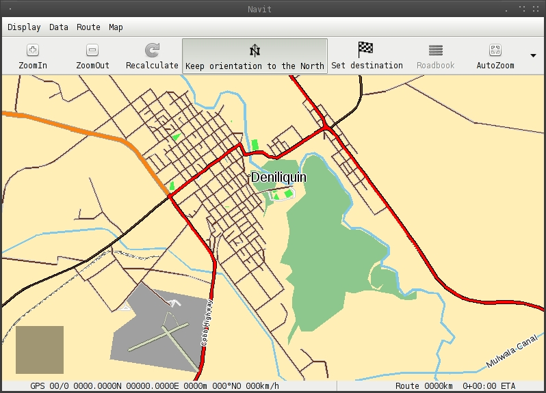
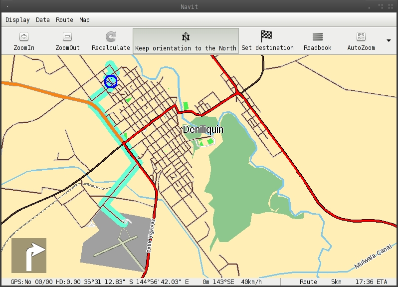

.. _layouthi_vis:

Layout/hi vis
=============

Trying to read a computer screen in full sun with aging eyes and
sunglasses on while driving is difficult, so I customised a navit.xml
for higher visibility.

   Hi_vis.jpg

These are the important parts.

**enlarged cursor**

.. code:: xml

           <layout name="Car" color="#ffefb7" font="Liberation Sans">

               <cursor w="26" h="26">
                   <itemgra>
                       <circle color="#0000ff" radius="24" width="4">
                           <coord x="0" y="0"/>
                       </circle>
                   </itemgra>
                   <itemgra speed_range="-2">
                       <polyline color="#0000ff" width="2">
                           <coord x="0" y="0"/>
                           <coord x="0" y="0"/>
                       </polyline>
                   </itemgra>
                   <itemgra speed_range="3-">
                       <polyline color="#0000ff" width="2">
                           <coord x="-7" y="-10"/>
                           <coord x="0" y="12"/>
                           <coord x="7" y="-10"/>
                       </polyline>
                   </itemgra>
               </cursor>

**different route colour and cursor colour**

.. code:: xml

               <layer name="streets">
                   <itemgra item_types="street_route" order="2">
                       <polyline color="#67ffd6" width="4"/>
                   </itemgra>
                   <itemgra item_types="street_route" order="3-5">
                       <polyline color="#67ffd6" width="8"/>
                   </itemgra>
                   <itemgra item_types="street_route" order="6">
                       <polyline color="#67ffd6" width="10"/>
                   </itemgra>
                   <itemgra item_types="street_route" order="7-8">
                       <polyline color="#67ffd6" width="16"/>
                   </itemgra>
                   <itemgra item_types="street_route" order="9-10">
                       <polyline color="#67ffd6" width="20"/>
                   </itemgra>
                   <itemgra item_types="street_route" order="11">
                       <polyline color="#67ffd6" width="28"/>
                   </itemgra>
                   <itemgra item_types="street_route" order="12">
                       <polyline color="#67ffd6" width="32"/>
                   </itemgra>
                   <itemgra item_types="street_route" order="13">
                       <polyline color="#67ffd6" width="52"/>
                   </itemgra>
                   <itemgra item_types="street_route" order="14">
                       <polyline color="#67ffd6" width="64"/>
                   </itemgra>
                   <itemgra item_types="street_route" order="15">
                       <polyline color="#67ffd6" width="68"/>
                   </itemgra>
                   <itemgra item_types="street_route" order="16">
                       <polyline color="#67ffd6" width="132"/>
                   </itemgra>
                   <itemgra item_types="street_route" order="17">
                       <polyline color="#67ffd6" width="268"/>
                   </itemgra>
                   <itemgra item_types="street_route" order="18">
                       <polyline color="#67ffd6" width="530"/>
                   </itemgra>

**street_1_city is brown with a beige border**

.. code:: xml

                   <itemgra item_types="street_0,street_1_city,street_1_land" order="10">
                       <polyline color="#d2d2d2" width="4"/>
                       <polyline color="#66341d" width="2"/>
                   </itemgra>
                   <itemgra item_types="street_0,street_1_city,street_1_land" order="11">
                       <polyline color="#d2d2d2" width="6"/>
                       <polyline color="#66341d" width="4"/>
                   </itemgra>
                   <itemgra item_types="street_0,street_1_city,street_1_land" order="12">
                       <polyline color="#d2d2d2" width="10"/>
                       <polyline color="#66341d" width="8"/>
                   </itemgra>
                   <itemgra item_types="street_0,street_1_city,street_1_land" order="13">
                       <polyline color="#d2d2d2" width="11"/>
                       <polyline color="#66341d" width="9"/>
                   </itemgra>
                   <itemgra item_types="street_0,street_1_city,street_1_land" order="14">
                       <polyline color="#d2d2d2" width="17"/>
                       <polyline color="#66341d" width="13"/>
                   </itemgra>
                   <itemgra item_types="street_0,street_1_city,street_1_land" order="15">
                       <polyline color="#d2d2d2" width="18"/>
                       <polyline color="#66341d" width="14"/>
                   </itemgra>
                   <itemgra item_types="street_0,street_1_city,street_1_land" order="16">
                       <polyline color="#d2d2d2" width="30"/>
                       <polyline color="#66341d" width="26"/>
                   </itemgra>
                   <itemgra item_types="street_0,street_1_city,street_1_land" order="17">
                       <polyline color="#d2d2d2" width="67"/>
                       <polyline color="#66341d" width="61"/>
                   </itemgra>
                   <itemgra item_types="street_0,street_1_city,street_1_land" order="18">
                       <polyline color="#d2d2d2" width="132"/>
                       <polyline color="#66341d" width="126"/>
                   </itemgra>

**street_2_city is brown with a black border**

.. code:: xml

                   <itemgra item_types="street_2_city,street_2_land,ramp" order="7-8">
                       <polyline color="#66431d" width="2"/>
                   </itemgra>
                   <itemgra item_types="street_2_city,street_2_land,ramp" order="9">
                       <polyline color="#000000" width="3"/>
                       <polyline color="#66431d" width="1"/>
                   </itemgra>
                   <itemgra item_types="street_2_city,street_2_land,ramp" order="10">
                       <polyline color="#000000" width="4"/>
                       <polyline color="#66431d" width="2"/>
                   </itemgra>
                   <itemgra item_types="street_2_city,street_2_land,ramp" order="11">
                       <polyline color="#000000" width="5"/>
                       <polyline color="#66431d" width="3"/>
                   </itemgra>
                   <itemgra item_types="street_2_city,street_2_land,ramp" order="12">
                       <polyline color="#000000" width="7"/>
                       <polyline color="#66431d" width="5"/>
                   </itemgra>
                   <itemgra item_types="street_2_city,street_2_land,ramp" order="13">
                       <polyline color="#000000" width="11"/>
                       <polyline color="#66431d" width="8"/>
                   </itemgra>
                   <itemgra item_types="street_2_city,street_2_land,ramp" order="14">
                       <polyline color="#000000" width="14"/>
                       <polyline color="#66431d" width="11"/>
                   </itemgra>
                   <itemgra item_types="street_2_city,street_2_land,ramp" order="15">
                       <polyline color="#000000" width="19"/>
                       <polyline color="#66431d" width="15"/>
                   </itemgra>
                   <itemgra item_types="street_2_city,street_2_land,ramp" order="16">
                       <polyline color="#000000" width="30"/>
                       <polyline color="#66431d" width="26"/>
                   </itemgra>
                   <itemgra item_types="street_2_city,street_2_land,ramp" order="17">
                       <polyline color="#000000" width="63"/>
                       <polyline color="#66431d" width="57"/>
                   </itemgra>
                   <itemgra item_types="street_2_city,street_2_land,ramp" order="18">
                       <polyline color="#000000" width="100"/>
                       <polyline color="#66431d" width="90"/>
                   </itemgra>

**street_3_city is a orange with a grey border**

.. code:: xml

                   <itemgra item_types="street_3_city,street_3_land,roundabout" order="7-8">
                       <polyline color="#a0a0a0" width="3"/>
                       <polyline color="#f98412" width="1"/>
                   </itemgra>
                   <itemgra item_types="street_3_city,street_3_land,roundabout" order="9">
                       <polyline color="#a0a0a0" width="5"/>
                       <polyline color="#f98412" width="3"/>
                   </itemgra>
                   <itemgra item_types="street_3_city,street_3_land,roundabout" order="10">
                       <polyline color="#a0a0a0" width="8"/>
                       <polyline color="#f98412" width="6"/>
                   </itemgra>
                   <itemgra item_types="street_3_city,street_3_land,roundabout" order="11">
                       <polyline color="#a0a0a0" width="9"/>
                       <polyline color="#f98412" width="7"/>
                   </itemgra>
                   <itemgra item_types="street_3_city,street_3_land,roundabout" order="12">
                       <polyline color="#a0a0a0" width="13"/>
                       <polyline color="#f98412" width="9"/>
                   </itemgra>
                   <itemgra item_types="street_3_city,street_3_land,roundabout" order="13">
                       <polyline color="#a0a0a0" width="18"/>
                       <polyline color="#f98412" width="14"/>
                   </itemgra>
                   <itemgra item_types="street_3_city,street_3_land,roundabout" order="14">
                       <polyline color="#a0a0a0" width="21"/>
                       <polyline color="#f98412" width="17"/>
                   </itemgra>
                   <itemgra item_types="street_3_city,street_3_land,roundabout" order="15">
                       <polyline color="#a0a0a0" width="25"/>
                       <polyline color="#f98412" width="21"/>
                   </itemgra>
                   <itemgra item_types="street_3_city,street_3_land,roundabout" order="16">
                       <polyline color="#a0a0a0" width="40"/>
                       <polyline color="#f98412" width="34"/>
                   </itemgra>
                   <itemgra item_types="street_3_city,street_3_land,roundabout" order="17">
                       <polyline color="#a0a0a0" width="79"/>
                       <polyline color="#f98412" width="73"/>
                   </itemgra>
                   <itemgra item_types="street_3_city,street_3_land,roundabout" order="18">
                       <polyline color="#a0a0a0" width="156"/>
                       <polyline color="#f98412" width="150"/>
                   </itemgra>

street_4_city is still red, and so on.

Too many airport symbols after an import into OSM, so their POI was
disabled for lower zoom levels

.. code:: xml

               <layer name="POI Symbols">
                  
                   <itemgra item_types="poi_airport" order="8-">
                       <icon src="airport.png"/>
                   </itemgra>

Example of routing with 'Demo' car. |Hi_vis2.jpg|

