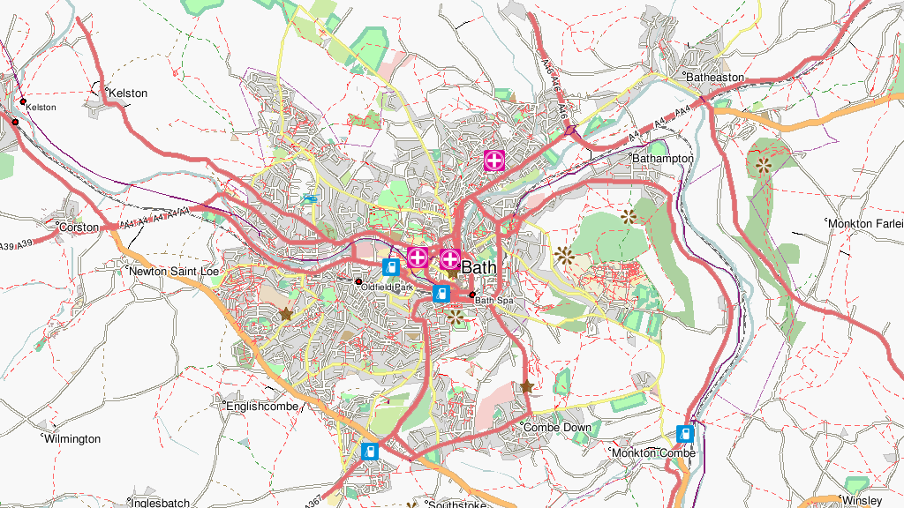
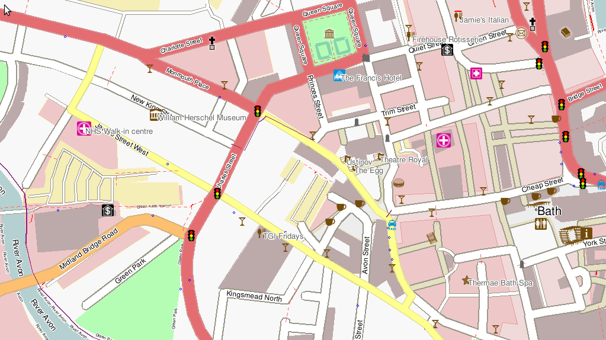
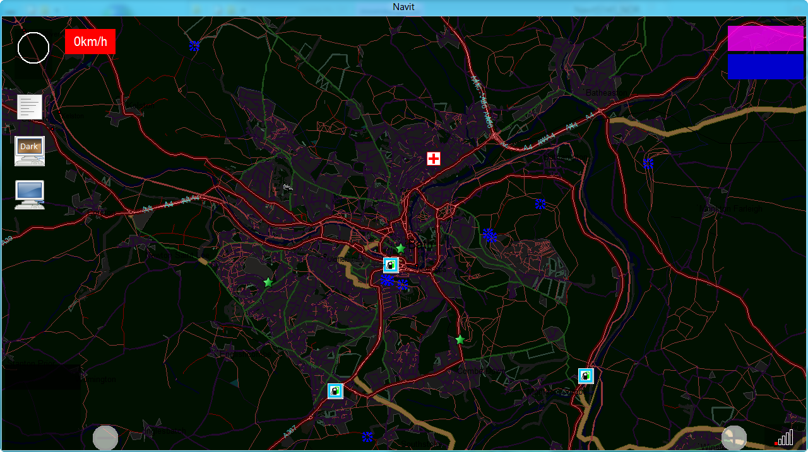
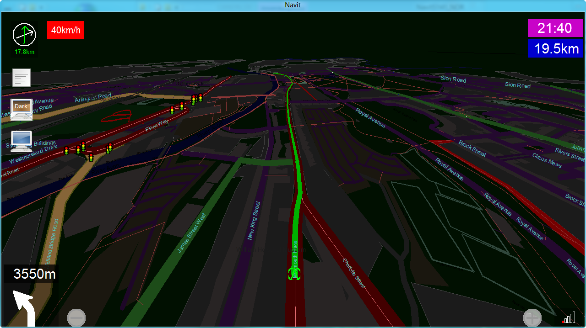

Layout/mapnik
=============

.. _mapnikopenstreetmap_style_layout:

Mapnik/OpenStreetMap Style Layout
=================================

Creates a map layout which looks similar to the Mapnik rendering in
OpenStreetMaps.org. Most of the POI icons have been changed to those
which are used within Mapnik, and they can be found here:
http://www.sjjb.co.uk/mapicons/downloads. Some POIs in Navit do not seem
to have an equivalent in Mapnik, so the original Navit icons are used
('stadium' is an example).

Features
--------

-  Cycle ways are more prominently displayed in purple
-  Routing is shown with a bright green line which is overlaid onto the
   road, rather than a fat blue line underneath it. Road names appear
   above the routing line.
-  Zoom settings for various POIs have been changed. For example, fuel
   station POIs are shown out to quite a far zoom level.

   -  I have tried to make sure that POIs which will be most important
      to *navigating drivers* are prominently displayed, whilst those
      which are perhaps interesting but not very useful when navigating
      are less noticeable and/or only show up when zooming in closer.
      This is so that unhelpful POIs do not clutter up the map view.

-  Bus stops are shown with a blue ring, until zoomed in quite close
   when a proper icon is used.

   -  There are a lot of bus stops everywhere, and the POI icon was
      cluttering up the map. The unobtrusive blue ring is still
      noticeable, but less annoying!

-  Mini-roundabout icons have been removed, and are now shown by black
   rings.
-  A few POI types which do not appear in maptool's osm.c (i.e. don't
   actually get converted from OSM and won't currently appear in the
   Navit data) have been removed.
-  Mapnik-Dark - more "eye-friendly" in dark surrounding

Screenshots
-----------

|400px|   |image1|

|image2|   |image3|

XML
---

Copy and paste the following XML into navit.xml. Last update 11:07, 3
March 2011 (UTC)

.. code:: xml

   <layout name="OSM" nightlayout="OSM-dark" color="#F8F8F8" font="Liberation Sans">

       <cursor w="26" h="26">
           <itemgra>
                       <circle color="#0000ff" radius="24" width="2">
                           <coord x="0" y="0"/>
                       </circle>
                   </itemgra>
                   <itemgra speed_range="-2">
                       <polyline color="#0000ff" width="2">
                           <coord x="0" y="0"/>
                           <coord x="0" y="0"/>
                       </polyline>
                   </itemgra>
                   <itemgra speed_range="3-">
                       <polyline color="#0000ff" width="2">
                           <coord x="-7" y="-10"/>
                           <coord x="0" y="12"/>
                           <coord x="7" y="-10"/>
                       </polyline>
               </itemgra>
       </cursor>
           
               <layer name="polygons">
                   <itemgra item_types="image" order="0-">
                       <image/>
                   </itemgra>
                   <itemgra item_types="poly_farm" order="0-">
                       <polygon color="#EADBC4"/>
                       <polyline color="#CFC1AB"/>
                       <text text_size="5"/>
                   </itemgra>
                   <itemgra item_types="poly_town" order="0-">
                       <polygon color="#DCDCDC"/>
                       <polyline color="#C0BEBE"/>
                   </itemgra>
                   <itemgra item_types="poly_university" order="8-">
                       <polygon color="#F0F0D8"/>
                       <polyline color="#BFA990"/>
                   </itemgra>
                   <itemgra item_types="poly_nature_reserve" order="0-">
                       <polygon color="#ABDE96"/>
                       <text text_size="5"/>
                   </itemgra>
           <itemgra item_types="poly_reservoir" order="0-">
                       <polygon color="#B5D0D0"/>
                       <text text_size="5"/>
                   </itemgra>
                   <itemgra item_types="poly_basin" order="0-">
                       <polygon color="#B5D0D0"/>
                       <text text_size="5"/>
                   </itemgra>
                   <itemgra item_types="poly_marina" order="0-">
                       <polygon color="#B5D0D0"/>
                       <text text_size="5"/>
                   </itemgra>
                   <itemgra item_types="poly_land" order="0-">
                       <polygon color="#F0D9D9"/>
                       <polyline color="#F2EEE8"/>
                       <text text_size="5"/>
                   </itemgra>
           <itemgra item_types="poly_commercial" order="0-">
                       <polygon color="#EEC8C8"/>
                       <polyline color="#FFFFC1"/>
                       <text text_size="5"/>
                   </itemgra>
           <itemgra item_types="poly_retail" order="0-">
                       <polygon color="#F0D9D9"/>
                       <polyline color="#EC989A"/>
                       <text text_size="5"/>
                   </itemgra>
           <itemgra item_types="poly_recreation_ground" order="0-">
                       <polygon color="#CEEBA8"/>
                       <text text_size="5"/>
                   </itemgra>
                   <itemgra item_types="poly_construction" order="0-">
                       <polygon color="#9D9C6B"/>
                       <text text_size="5"/>
                   </itemgra>
           <itemgra item_types="poly_quarry" order="0-">
                       <polygon color="#C5C4C3"/>
                       <text text_size="5"/>
                   </itemgra>
           <itemgra item_types="poly_allotments" order="0-">
                       <polygon color="#C8B084"/>
                       <text text_size="5"/>
                   </itemgra>
           <itemgra item_types="poly_common" order="0-">
                       <polygon color="#CEEBA7"/>
                       <text text_size="5"/>
                   </itemgra>
                   <itemgra item_types="poly_park" order="0-">
                       <polygon color="#B5FCB5"/>
                       <text text_size="5"/>
                   </itemgra>
           <itemgra item_types="poly_village_green" order="0-">
                       <polygon color="#CEEBA8"/>
                       <text text_size="5"/>
                   </itemgra>
           <itemgra item_types="poly_heath" order="0-">
                       <polygon color="#FEFEC0"/>
                       <text text_size="5"/>
                   </itemgra>
           <itemgra item_types="poly_golf_course" order="0-">
                       <polygon color="#B4E2B4"/>
                       <text text_size="5"/>
                   </itemgra>
                   <itemgra item_types="poly_wood" order="0-">
                       <polygon color="#ADD1A0"/>
                       <text text_size="5"/>
                   </itemgra>
                   <itemgra item_types="poly_playground" order="0-">
                       <polygon color="#B5FCB5"/>
               <polyline color="#8AD2AE" width="5"/>
                   </itemgra>
                   <itemgra item_types="poly_pedestrian" order="10">
                       <polyline color="#9A9889" width="3"/>
                       <polyline color="#E5E0C2" width="1"/>
                       <polygon color="#EDEDED"/>
                   </itemgra>
                   <itemgra item_types="poly_pedestrian" order="11">
                       <polyline color="#9A9889" width="5"/>
                       <polyline color="#E5E0C2" width="3"/>
                       <polygon color="#EDEDED"/>
                   </itemgra>
                   <itemgra item_types="poly_pedestrian" order="12">
                       <polyline color="#9A9889" width="8"/>
                       <polyline color="#E5E0C2" width="6"/>
                       <polygon color="#EDEDED"/>
                   </itemgra>
                   <itemgra item_types="poly_pedestrian" order="13">
                       <polyline color="#9A9889" width="9"/>
                       <polyline color="#E5E0C2" width="7"/>
                       <polygon color="#EDEDED"/>
                   </itemgra>
                   <itemgra item_types="poly_pedestrian" order="14">
                       <polyline color="#9A9889" width="13"/>
                       <polyline color="#E5E0C2" width="9"/>
                       <polygon color="#EDEDED"/>
                   </itemgra>
                   <itemgra item_types="poly_pedestrian" order="15">
                       <polyline color="#9A9889" width="18"/>
                       <polyline color="#E5E0C2" width="14"/>
                       <polygon color="#EDEDED"/>
                   </itemgra>
                   <itemgra item_types="poly_pedestrian" order="16">
                       <polyline color="#9A9889" width="21"/>
                       <polyline color="#E5E0C2" width="17"/>
                       <polygon color="#EDEDED"/>
                   </itemgra>
                   <itemgra item_types="poly_pedestrian" order="17">
                       <polyline color="#9A9889" width="25"/>
                       <polyline color="#E5E0C2" width="21"/>
                       <polygon color="#EDEDED"/>
                   </itemgra>
                   <itemgra item_types="poly_pedestrian" order="18">
                       <polyline color="#9A9889" width="40"/>
                       <polyline color="#E5E0C2" width="34"/>
                       <polygon color="#EDEDED"/>
                   </itemgra>
                   <itemgra item_types="poly_airport" order="0-">
                       <polygon color="#a0a0a0"/>
                   </itemgra>
           <itemgra item_types="poly_military" order="0-">
               <polygon color="#F6D1CE"/>
                       <text text_size="5"/>
                   </itemgra>
           <itemgra item_types="poly_danger_area" order="0-">
                       <polygon color="#FCD8DB" />
                       <polyline color="#BD6B71" width="1"/>
               <text text_size="5"/>
                   </itemgra>
           <itemgra item_types="poly_railway" order="0-">
               <polygon color="#DED0D5"/>
                   </itemgra>
           <itemgra item_types="poly_barracks" order="0-">
               <polygon color="#FE8E8E"/>
                       <text text_size="5"/>
                   </itemgra>
                   <itemgra item_types="poly_sport,poly_sports_pitch" order="0-">
                       <polygon color="#B5FCB5"/>
               <polyline color="#8AD2AE" width="5"/>
                   </itemgra>
                   <itemgra item_types="poly_industry,poly_place" order="0-">
                       <polygon color="#DED0D5"/>
                   </itemgra>
                   <itemgra item_types="poly_service" order="8-18">
                       <polygon color="#fefefe"/>
                       <polyline color="#9A9889" width="1"/>
                   </itemgra>
                   <itemgra item_types="poly_street_1" order="8-13">
                       <polygon color="#ffffff"/>
                       <polyline color="#9A9889" width="1"/>
                   </itemgra>
                   <itemgra item_types="poly_street_1" order="14-16">
                       <polygon color="#ffffff"/>
                       <polyline color="#9A9889" width="2"/>
                   </itemgra>
                   <itemgra item_types="poly_street_1" order="17-18">
                       <polygon color="#ffffff"/>
                       <polyline color="#9A9889" width="3"/>
                   </itemgra>
                   <itemgra item_types="poly_street_2" order="7-12">
                       <polygon color="#ffff00"/>
                       <polyline color="#c0c0c0" width="1"/>
                   </itemgra>
                   <itemgra item_types="poly_street_2" order="13-16">
                       <polygon color="#ffff00"/>
                       <polyline color="#c0c0c0" width="2"/>
                   </itemgra>
                   <itemgra item_types="poly_street_2" order="17-18">
                       <polygon color="#ffff00"/>
                       <polyline color="#c0c0c0" width="3"/>
                   </itemgra>
                   <itemgra item_types="poly_street_3" order="7-11">
                       <polygon color="#FDBF70"/>
                       <polyline color="#FDBF70" width="1"/>
                   </itemgra>
                   <itemgra item_types="poly_street_3" order="12-15">
                       <polygon color="#FDBF70"/>
                       <polyline color="#FDBF70" width="2"/>
                   </itemgra>
                   <itemgra item_types="poly_street_3" order="16-18">
                       <polygon color="#FDBF70"/>
                       <polyline color="#FDBF70" width="3"/>
                   </itemgra>
                   <itemgra item_types="poly_apron" order="0-">
                       <polygon color="#F0E0FE"/>
                   </itemgra>
                   <itemgra item_types="poly_terminal" order="7-">
                       <polygon color="#CB99FE"/>
                   </itemgra>
                   <itemgra item_types="poly_cemetery" order="0-">
                       <polygon color="#ADD0A0"/>
                   </itemgra>
                   <itemgra item_types="poly_car_parking" order="1-">
                       <polygon color="#F6EEB7"/>
                       <polyline color="#F6EEB7"/>
                   </itemgra>
                   <itemgra item_types="poly_building" order="0-">
                       <polygon color="#BCA9A9"/>
               <polyline color="#BCA9A9" width="2"/> 
                   </itemgra>
                   <itemgra item_types="rail" order="6-">
                       <polyline color="#696969" width="3"/>
                       <polyline color="#ffffff" width="1" dash="5,5"/>
                   </itemgra>
                   <itemgra item_types="ferry" order="5-">
                       <polyline color="#000000" width="1" dash="10"/>
                   </itemgra>
                   <itemgra item_types="border_country" order="0-">
                       <polyline color="#B269AD" width="1" dash="10,2"/>
                   </itemgra>
                   <itemgra item_types="border_state" order="0-">
                       <polyline color="#808080" width="1"/>
                   </itemgra>
                   <itemgra item_types="height_line_1" order="0-">
                       <polyline color="#000000" width="4"/>
                   </itemgra>
                   <itemgra item_types="height_line_2" order="0-">
                       <polyline color="#000000" width="2"/>
                   </itemgra>
                   <itemgra item_types="height_line_3" order="0-">
                       <polyline color="#000000" width="1"/>
                   </itemgra>
                   <itemgra item_types="poly_water" order="0-">
                       <polygon color="#B5D0D0"/>
                       <text text_size="5"/>
                   </itemgra>
                   <itemgra item_types="water_line" order="0-">
                       <polyline color="#5096b8" width="1"/>
                       <text text_size="5"/>
                   </itemgra>
                   <itemgra item_types="water_river" order="4-5">
                       <polyline color="#B5D0D0" width="1"/>
                   </itemgra>
                   <itemgra item_types="water_river" order="6">
                       <polyline color="#B5D0D0" width="2"/>
                   </itemgra>
                   <itemgra item_types="water_river" order="7">
                       <polyline color="#B5D0D0" width="3"/>
                       <text text_size="5"/>
                   </itemgra>
                   <itemgra item_types="water_river" order="8-9">
                       <polyline color="#B5D0D0" width="4"/>
                       <text text_size="7"/>
                   </itemgra>
                   <itemgra item_types="water_river" order="10-">
                       <polyline color="#B5D0D0" width="4"/>
                       <text text_size="10"/>
                   </itemgra>
                   <itemgra item_types="water_canal" order="6">
                       <polyline color="#B5D0D0" width="1"/>
                   </itemgra>
                   <itemgra item_types="water_canal" order="7">
                       <polyline color="#B5D0D0" width="2"/>
                       <text text_size="5"/>
                   </itemgra>
                   <itemgra item_types="water_canal" order="8-9">
                       <polyline color="#B5D0D0" width="3"/>
                       <text text_size="7"/>
                   </itemgra>
                   <itemgra item_types="water_canal" order="10-">
                       <polyline color="#B5D0D0" width="3"/>
                       <text text_size="10"/>
                   </itemgra>
                   <itemgra item_types="water_stream" order="8-9">
                       <polyline color="#B5D0D0" width="1"/>
                   </itemgra>
                   <itemgra item_types="water_stream" order="10-">
                       <polyline color="#B5D0D0" width="2"/>
                       <text text_size="7"/>
                   </itemgra>
                   <itemgra item_types="water_drain" order="10-">
                       <polyline color="#B5D0D0" width="1"/>
                       <text text_size="5"/>
                   </itemgra>
               </layer>
               <layer name="streets">
           <itemgra item_types="selected_line" order="2">
                       <polyline color="#ba00b8" width="4"/>
                   </itemgra>
                   <itemgra item_types="selected_line" order="3-5">
                       <polyline color="#ba00b8" width="8"/>
                   </itemgra>
                   <itemgra item_types="selected_line" order="6">
                       <polyline color="#ba00b8" width="10"/>
                   </itemgra>
                   <itemgra item_types="selected_line" order="7-8">
                       <polyline color="#ba00b8" width="16"/>
                   </itemgra>
                   <itemgra item_types="selected_line" order="9-10">
                       <polyline color="#ba00b8" width="20"/>
                   </itemgra>
                   <itemgra item_types="selected_line" order="11">
                       <polyline color="#ba00b8" width="28"/>
                   </itemgra>
                   <itemgra item_types="selected_line" order="12">
                       <polyline color="#ba00b8" width="32"/>
                   </itemgra>
                   <itemgra item_types="selected_line" order="13">
                       <polyline color="#ba00b8" width="52"/>
                   </itemgra>
                   <itemgra item_types="selected_line" order="14">
                       <polyline color="#ba00b8" width="64"/>
                   </itemgra>
                   <itemgra item_types="selected_line" order="15">
                       <polyline color="#ba00b8" width="68"/>
                   </itemgra>
                   <itemgra item_types="selected_line" order="16">
                       <polyline color="#ba00b8" width="132"/>
                   </itemgra>
                   <itemgra item_types="selected_line" order="17">
                       <polyline color="#ba00b8" width="268"/>
                   </itemgra>
                   <itemgra item_types="selected_line" order="18">
                       <polyline color="#ba00b8" width="530"/>
                   </itemgra>
                   <itemgra item_types="street_nopass" order="10-">
                       <polyline color="#000000" width="1"/>
                   </itemgra>
                   <itemgra item_types="track_paved" order="10-">
                       <polyline color="#000000" width="1"/>
                   </itemgra>
                   <itemgra item_types="track_gravelled" order="10-12">
                       <polyline color="#A68F61" width="1" dash="3,6"/>
                   </itemgra>
                   <itemgra item_types="track_gravelled" order="13-14">
                       <polyline color="#ffffff" width="4" dash="4,8"/>
                       <polyline color="#A68F61" width="2" dash="4,8"/>
                   </itemgra>
                   <itemgra item_types="track_gravelled" order="15-16">
                       <polyline color="#ffffff" width="5" dash="5,10"/>
                       <polyline color="#A68F61" width="3" dash="5,10"/>
                   </itemgra>
                   <itemgra item_types="track_gravelled" order="17-">
                       <polyline color="#ffffff" width="7" dash="7,15"/>
                       <polyline color="#A68F61" width="5" dash="7,15"/>
                   </itemgra>
                   <itemgra item_types="track_unpaved" order="10-">
                       <polyline color="#000000" width="1"/>
                   </itemgra>
                   <itemgra item_types="bridleway" order="10-">
                       <polyline color="#52A750" width="1" dash="5,5"/>
                   </itemgra>
                   <itemgra item_types="piste_downhill_novice" order="10-12">
                       <polyline color="#00A000" width="1"/>
                   </itemgra>
                   <itemgra item_types="piste_downhill_novice" order="13-14">
                       <polyline color="#00A000" width="2"/>
                   </itemgra>
                   <itemgra item_types="piste_downhill_novice" order="15-16">
                       <polyline color="#00A000" width="3"/>
                   </itemgra>
                   <itemgra item_types="piste_downhill_novice" order="17-">
                       <polyline color="#00A000" width="5"/>
                   </itemgra>
                   <itemgra item_types="piste_downhill_easy" order="10-12">
                       <polyline color="#0000ff" width="1"/>
                   </itemgra>
                   <itemgra item_types="piste_downhill_easy" order="13-14">
                       <polyline color="#0000ff" width="2"/>
                   </itemgra>
                   <itemgra item_types="piste_downhill_easy" order="15-16">
                       <polyline color="#0000ff" width="3"/>
                   </itemgra>
                   <itemgra item_types="piste_downhill_easy" order="17-">
                       <polyline color="#0000ff" width="5"/>
                   </itemgra>
                   <itemgra item_types="piste_downhill_intermediate" order="10-12">
                       <polyline color="#ff0000" width="1"/>
                   </itemgra>
                   <itemgra item_types="piste_downhill_intermediate" order="13-14">
                       <polyline color="#ff0000" width="2"/>
                   </itemgra>
                   <itemgra item_types="piste_downhill_intermediate" order="15-16">
                       <polyline color="#ff0000" width="3"/>
                   </itemgra>
                   <itemgra item_types="piste_downhill_intermediate" order="17-">
                       <polyline color="#ff0000" width="5"/>
                   </itemgra>
                   <itemgra item_types="piste_downhill_advanced" order="10-12">
                       <polyline color="#000000" width="1"/>
                   </itemgra>
                   <itemgra item_types="piste_downhill_advanced" order="13-14">
                       <polyline color="#000000" width="2"/>
                   </itemgra>
                   <itemgra item_types="piste_downhill_advanced" order="15-16">
                       <polyline color="#000000" width="3"/>
                   </itemgra>
                   <itemgra item_types="piste_downhill_advanced" order="17-">
                       <polyline color="#000000" width="5"/>
                   </itemgra>
                   <itemgra item_types="piste_downhill_expert" order="10-12">
                       <polyline color="#ffaa00" width="1"/>
                   </itemgra>
                   <itemgra item_types="piste_downhill_expert" order="13-14">
                       <polyline color="#ffaa00" width="2"/>
                   </itemgra>
                   <itemgra item_types="piste_downhill_expert" order="15-16">
                       <polyline color="#ffaa00" width="3"/>
                   </itemgra>
                   <itemgra item_types="piste_downhill_expert" order="17-">
                       <polyline color="#ffaa00" width="5"/>
                   </itemgra>
                   <itemgra item_types="piste_downhill_freeride" order="10-12">
                       <polyline color="#ffff00" width="1"/>
                   </itemgra>
                   <itemgra item_types="piste_downhill_freeride" order="13-14">
                       <polyline color="#ffff00" width="2"/>
                   </itemgra>
                   <itemgra item_types="piste_downhill_freeride" order="15-16">
                       <polyline color="#ffff00" width="3"/>
                   </itemgra>
                   <itemgra item_types="piste_downhill_freeride" order="17-">
                       <polyline color="#ffff00" width="5"/>
                   </itemgra>
                   <itemgra item_types="lift_cable_car" order="6-">
                       <polyline color="#696969" width="1" dash="5"/>
                   </itemgra>
                   <itemgra item_types="lift_chair" order="6-">
                       <polyline color="#696969" width="1" dash="5"/>
                   </itemgra>
                   <itemgra item_types="lift_drag" order="6-">
                       <polyline color="#696969" width="1" dash="5"/>
                   </itemgra>
                   <itemgra item_types="piste_nordic" order="10-12">
                       <polyline color="#0000ff" width="1" dash="3,6" offset="4"/>
                   </itemgra>
                   <itemgra item_types="piste_nordic" order="13-14">
                       <polyline color="#ffffff" width="4" dash="4,8" offset="6"/>
                       <polyline color="#0000ff" width="2" dash="4,8" offset="6"/>
                   </itemgra>
                   <itemgra item_types="piste_nordic" order="15-16">
                       <polyline color="#ffffff" width="5" dash="5,10" offset="7"/>
                       <polyline color="#0000ff" width="3" dash="5,10" offset="7"/>
                   </itemgra>
                   <itemgra item_types="piste_nordic" order="17-">
                       <polyline color="#ffffff" width="7" dash="7,15" offset="10"/>
                       <polyline color="#0000ff" width="5" dash="7,15" offset="10"/>
                   </itemgra>
                   <itemgra item_types="footway_and_piste_nordic" order="10-12">
                       <polyline color="#ff0000" width="1" dash="3,15"/>
                       <polyline color="#0000ff" width="1" dash="3,15" offset="9"/>
                   </itemgra>
                   <itemgra item_types="footway_and_piste_nordic" order="13-14">
                       <polyline color="#ffffff" width="4" dash="4,8"/>
                       <polyline color="#ff0000" width="2" dash="4,20"/>
                       <polyline color="#0000ff" width="2" dash="4,20" offset="12"/>
                   </itemgra>
                   <itemgra item_types="footway_and_piste_nordic" order="15-16">
                       <polyline color="#ffffff" width="5" dash="5,10"/>
                       <polyline color="#ff0000" width="3" dash="5,25"/>
                       <polyline color="#0000ff" width="3" dash="5,25" offset="15"/>
                   </itemgra>
                   <itemgra item_types="footway_and_piste_nordic" order="17-">
                       <polyline color="#ffffff" width="7" dash="7,15"/>
                       <polyline color="#ff0000" width="5" dash="7,37"/>
                       <polyline color="#0000ff" width="5" dash="7,37" offset="22"/>
                   </itemgra>

                   <!--<itemgra item_types="footway" order="10-12">
               <polyline color="#ffffff" width="3" dash="3,3"/>
                       <polyline color="#E8A591" width="2" dash="1,1"/>
                   </itemgra>
                   <itemgra item_types="footway" order="13-14">
                       <polyline color="#ffffff" width="4" dash="3,3"/>
                       <polyline color="#E8A591" width="3" dash="1,1"/>
                   </itemgra>
                   <itemgra item_types="footway" order="15-16">
                       <polyline color="#ffffff" width="5" dash="3,3"/>
                       <polyline color="#E8A591" width="4" dash="1,1"/>
                   </itemgra>
                   <itemgra item_types="footway" order="17-">
                       <polyline color="#ffffff" width="7" dash="3,3"/>
                       <polyline color="#E8A591" width="6" dash="1,1"/>
                   </itemgra>-->
                   <itemgra item_types="steps" order="10-">
                       <polyline color="#FF0000" width="2"/>
                   </itemgra>
                   <itemgra item_types="street_pedestrian" order="10">
                       <polyline color="#9A9889" width="3"/>
                       <polyline color="#E5E0C2" width="1"/>
                   </itemgra>
                   <itemgra item_types="street_pedestrian" order="11">
                       <polyline color="#9A9889" width="5"/>
                       <polyline color="#E5E0C2" width="3"/>
                   </itemgra>
                   <itemgra item_types="street_pedestrian" order="12">
                       <polyline color="#9A9889" width="8"/>
                       <polyline color="#E5E0C2" width="6"/>
                   </itemgra>
                   <itemgra item_types="street_pedestrian" order="13">
                       <polyline color="#9A9889" width="9"/>
                       <polyline color="#E5E0C2" width="7"/>
                   </itemgra>
                   <itemgra item_types="street_pedestrian" order="14">
                       <polyline color="#9A9889" width="13"/>
                       <polyline color="#E5E0C2" width="9"/>
                   </itemgra>
                   <itemgra item_types="street_pedestrian" order="15">
                       <polyline color="#9A9889" width="18"/>
                       <polyline color="#E5E0C2" width="14"/>
                   </itemgra>
                   <itemgra item_types="street_pedestrian" order="16">
                       <polyline color="#9A9889" width="21"/>
                       <polyline color="#E5E0C2" width="17"/>
                   </itemgra>
                   <itemgra item_types="street_pedestrian" order="17">
                       <polyline color="#9A9889" width="25"/>
                       <polyline color="#E5E0C2" width="21"/>
                   </itemgra>
                   <itemgra item_types="street_pedestrian" order="18">
                       <polyline color="#9A9889" width="40"/>
                       <polyline color="#E5E0C2" width="34"/>
                   </itemgra>
                   <itemgra item_types="street_service" order="10">
                       <polyline color="#9A9889" width="4"/>
                       <polyline color="#fefefe" width="2"/>
                   </itemgra>
                   <itemgra item_types="street_service" order="11">
                       <polyline color="#9A9889" width="4"/>
                       <polyline color="#fefefe" width="2"/>
                   </itemgra>
                   <itemgra item_types="street_service" order="12">
                       <polyline color="#9A9889" width="5"/>
                       <polyline color="#fefefe" width="3"/>
                   </itemgra>
                   <itemgra item_types="street_service" order="13">
                       <polyline color="#9A9889" width="6"/>
                       <polyline color="#fefefe" width="4"/>
                   </itemgra>
                   <itemgra item_types="street_service" order="14">
                       <polyline color="#9A9889" width="7"/>
                       <polyline color="#fefefe" width="5"/>
                   </itemgra>
                   <itemgra item_types="street_service" order="15">
                       <polyline color="#9A9889" width="8"/>
                       <polyline color="#fefefe" width="6"/>
                   </itemgra>
                   <itemgra item_types="street_service" order="16">
                       <polyline color="#9A9889" width="9"/>
                       <polyline color="#fefefe" width="7"/>
                   </itemgra>
                   <itemgra item_types="street_service" order="17">
                       <polyline color="#9A9889" width="10"/>
                       <polyline color="#fefefe" width="8"/>
                   </itemgra>
                   <itemgra item_types="street_service" order="18">
                       <polyline color="#9A9889" width="11"/>
                       <polyline color="#fefefe" width="9"/>
                   </itemgra>
                   <itemgra item_types="street_parking_lane" order="12">
                       <polyline color="#9A9889" width="4"/>
                       <polyline color="#fefefe" width="2"/>
                   </itemgra>
                   <itemgra item_types="street_parking_lane" order="13">
                       <polyline color="#9A9889" width="4"/>
                       <polyline color="#fefefe" width="2"/>
                   </itemgra>
                   <itemgra item_types="street_parking_lane" order="14">
                       <polyline color="#9A9889" width="5"/>
                       <polyline color="#fefefe" width="3"/>
                   </itemgra>
                   <itemgra item_types="street_parking_lane" order="15">
                       <polyline color="#9A9889" width="6"/>
                       <polyline color="#fefefe" width="4"/>
                   </itemgra>
                   <itemgra item_types="street_parking_lane" order="16">
                       <polyline color="#9A9889" width="7"/>
                       <polyline color="#fefefe" width="5"/>
                   </itemgra>
                   <itemgra item_types="street_parking_lane" order="17">
                       <polyline color="#9A9889" width="8"/>
                       <polyline color="#fefefe" width="6"/>
                   </itemgra>
                   <itemgra item_types="street_parking_lane" order="18">
                       <polyline color="#9A9889" width="9"/>
                       <polyline color="#fefefe" width="7"/>
                   </itemgra>
                   <itemgra item_types="street_0,street_1_city,street_1_land" order="10">
                       <polyline color="#9A9889" width="4"/>
                       <polyline color="#ffffff" width="2"/>
                   </itemgra>
                   <itemgra item_types="street_0,street_1_city,street_1_land" order="11">
                       <polyline color="#9A9889" width="6"/>
                       <polyline color="#ffffff" width="4"/>
                   </itemgra>
                   <itemgra item_types="street_0,street_1_city,street_1_land" order="12">
                       <polyline color="#9A9889" width="10"/>
                       <polyline color="#ffffff" width="8"/>
                   </itemgra>
                   <itemgra item_types="street_0,street_1_city,street_1_land" order="13">
                       <polyline color="#9A9889" width="11"/>
                       <polyline color="#ffffff" width="9"/>
                   </itemgra>
                   <itemgra item_types="street_0,street_1_city,street_1_land" order="14">
                       <polyline color="#9A9889" width="17"/>
                       <polyline color="#ffffff" width="13"/>
                   </itemgra>
                   <itemgra item_types="street_0,street_1_city,street_1_land" order="15">
                       <polyline color="#9A9889" width="18"/>
                       <polyline color="#ffffff" width="14"/>
                   </itemgra>
                   <itemgra item_types="street_0,street_1_city,street_1_land" order="16">
                       <polyline color="#9A9889" width="30"/>
                       <polyline color="#ffffff" width="26"/>
                   </itemgra>
                   <itemgra item_types="street_0,street_1_city,street_1_land" order="17">
                       <polyline color="#9A9889" width="67"/>
                       <polyline color="#ffffff" width="61"/>
                   </itemgra>
                   <itemgra item_types="street_0,street_1_city,street_1_land" order="18">
                       <polyline color="#9A9889" width="132"/>
                       <polyline color="#ffffff" width="126"/>
                   </itemgra>
                   <itemgra item_types="street_2_city,street_2_land" order="7-8">
                       <polyline color="#E0E08D" width="2"/>
                   </itemgra>
                   <itemgra item_types="street_2_city,street_2_land" order="9">
                       <polyline color="#E0E08D" width="3"/>
                       <polyline color="#FFFF90" width="1"/>
                   </itemgra>
                   <itemgra item_types="street_2_city,street_2_land" order="10">
                       <polyline color="#E0E08D" width="4"/>
                       <polyline color="#FFFF90" width="2"/>
                   </itemgra>
                   <itemgra item_types="street_2_city,street_2_land" order="11">
                       <polyline color="#E0E08D" width="5"/>
                       <polyline color="#FFFF90" width="3"/>
                   </itemgra>
                   <itemgra item_types="street_2_city,street_2_land" order="12">
                       <polyline color="#E0E08D" width="7"/>
                       <polyline color="#FFFF90" width="5"/>
                   </itemgra>
                   <itemgra item_types="street_2_city,street_2_land" order="13">
                       <polyline color="#E0E08D" width="11"/>
                       <polyline color="#FFFF90" width="8"/>
                   </itemgra>
                   <itemgra item_types="street_2_city,street_2_land" order="14">
                       <polyline color="#E0E08D" width="14"/>
                       <polyline color="#FFFF90" width="11"/>
                   </itemgra>
                   <itemgra item_types="street_2_city,street_2_land" order="15">
                       <polyline color="#E0E08D" width="19"/>
                       <polyline color="#FFFF90" width="15"/>
                   </itemgra>
                   <itemgra item_types="street_2_city,street_2_land" order="16">
                       <polyline color="#E0E08D" width="30"/>
                       <polyline color="#FFFF90" width="26"/>
                   </itemgra>
                   <itemgra item_types="street_2_city,street_2_land" order="17">
                       <polyline color="#E0E08D" width="63"/>
                       <polyline color="#FFFF90" width="57"/>
                   </itemgra>
                   <itemgra item_types="street_2_city,street_2_land" order="18">
                       <polyline color="#E0E08D" width="100"/>
                       <polyline color="#FFFF90" width="90"/>
                   </itemgra>
                   <itemgra item_types="ramp" order="7-8">
                       <polyline color="#E0E08D" width="2"/>
                   </itemgra>
                   <itemgra item_types="ramp" order="9">
                       <polyline color="#E0E08D" width="3"/>
                       <polyline color="#FFFF90" width="1"/>
                   </itemgra>
                   <itemgra item_types="ramp" order="10">
                       <polyline color="#E0E08D" width="4"/>
                       <polyline color="#FFFF90" width="2"/>
                   </itemgra>
                   <itemgra item_types="ramp" order="11">
                       <polyline color="#E0E08D" width="5"/>
                       <polyline color="#FFFF90" width="3"/>
                   </itemgra>
                   <itemgra item_types="ramp" order="12">
                       <polyline color="#E0E08D" width="7"/>
                       <polyline color="#FFFF90" width="5"/>
                   </itemgra>
                   <itemgra item_types="ramp" order="13">
                       <polyline color="#E0E08D" width="11"/>
                       <polyline color="#FFFF90" width="8"/>
                   </itemgra>
                   <itemgra item_types="ramp" order="14">
                       <polyline color="#E0E08D" width="14"/>
                       <polyline color="#FFFF90" width="11"/>
                   </itemgra>
                   <itemgra item_types="ramp" order="15">
                       <polyline color="#E0E08D" width="19"/>
                       <polyline color="#FFFF90" width="15"/>
                   </itemgra>
                   <itemgra item_types="ramp" order="16">
                       <polyline color="#E0E08D" width="30"/>
                       <polyline color="#FFFF90" width="26"/>
                   </itemgra>
                   <itemgra item_types="ramp" order="17">
                       <polyline color="#E0E08D" width="63"/>
                       <polyline color="#FFFF90" width="57"/>
                   </itemgra>
                   <itemgra item_types="ramp" order="18">
                       <polyline color="#E0E08D" width="100"/>
                       <polyline color="#FFFF90" width="90"/>
                   </itemgra>
                   <itemgra item_types="street_3_city,street_3_land,roundabout" order="7-8">
                       <polyline color="#D8B384" width="3"/>
                       <polyline color="#FDBF70" width="1"/>
                   </itemgra>
                   <itemgra item_types="street_3_city,street_3_land,roundabout" order="9">
                       <polyline color="#D8B384" width="5"/>
                       <polyline color="#FDBF70" width="3"/>
                   </itemgra>
                   <itemgra item_types="street_3_city,street_3_land,roundabout" order="10">
                       <polyline color="#D8B384" width="8"/>
                       <polyline color="#FDBF70" width="6"/>
                   </itemgra>
                   <itemgra item_types="street_3_city,street_3_land,roundabout" order="11">
                       <polyline color="#D8B384" width="9"/>
                       <polyline color="#FDBF70" width="7"/>
                   </itemgra>
                   <itemgra item_types="street_3_city,street_3_land,roundabout" order="12">
                       <polyline color="#D8B384" width="13"/>
                       <polyline color="#FDBF70" width="9"/>
                   </itemgra>
                   <itemgra item_types="street_3_city,street_3_land,roundabout" order="13">
                       <polyline color="#D8B384" width="18"/>
                       <polyline color="#FDBF70" width="14"/>
                   </itemgra>
                   <itemgra item_types="street_3_city,street_3_land,roundabout" order="14">
                       <polyline color="#D8B384" width="21"/>
                       <polyline color="#FDBF70" width="17"/>
                   </itemgra>
                   <itemgra item_types="street_3_city,street_3_land,roundabout" order="15">
                       <polyline color="#D8B384" width="25"/>
                       <polyline color="#FDBF70" width="21"/>
                   </itemgra>
                   <itemgra item_types="street_3_city,street_3_land,roundabout" order="16">
                       <polyline color="#D8B384" width="40"/>
                       <polyline color="#FDBF70" width="34"/>
                   </itemgra>
                   <itemgra item_types="street_3_city,street_3_land,roundabout" order="17">
                       <polyline color="#D8B384" width="79"/>
                       <polyline color="#FDBF70" width="73"/>
                   </itemgra>
                   <itemgra item_types="street_3_city,street_3_land,roundabout" order="18">
                       <polyline color="#D8B384" width="156"/>
                       <polyline color="#FDBF70" width="150"/>
                   </itemgra>
                    <itemgra item_types="street_4_city,street_4_land" order="7-8">
                       <polyline color="#D78C8D" width="3"/>
                       <polyline color="#E46D71" width="1"/>
                   </itemgra>
                   <itemgra item_types="street_4_city,street_4_land" order="9">
                       <polyline color="#D78C8D" width="5"/>
                       <polyline color="#E46D71" width="3"/>
                   </itemgra>
                   <itemgra item_types="street_4_city,street_4_land" order="10">
                       <polyline color="#D78C8D" width="6"/>
                       <polyline color="#E46D71" width="4"/>
                   </itemgra>
                   <itemgra item_types="street_4_city,street_4_land" order="11">
                       <polyline color="#D78C8D" width="9"/>
                       <polyline color="#E46D71" width="7"/>
                   </itemgra>
                   <itemgra item_types="street_4_city,street_4_land" order="12">
                       <polyline color="#D78C8D" width="13"/>
                       <polyline color="#E46D71" width="9"/>
                   </itemgra>
                   <itemgra item_types="street_4_city,street_4_land" order="13">
                       <polyline color="#D78C8D" width="18"/>
                       <polyline color="#E46D71" width="14"/>
                   </itemgra>
                   <itemgra item_types="street_4_city,street_4_land" order="14">
                       <polyline color="#D78C8D" width="21"/>
                       <polyline color="#E46D71" width="17"/>
                   </itemgra>
                   <itemgra item_types="street_4_city,street_4_land" order="15">
                       <polyline color="#D78C8D" width="24"/>
                       <polyline color="#E46D71" width="20"/>
                   </itemgra>
                   <itemgra item_types="street_4_city,street_4_land" order="16">
                       <polyline color="#D78C8D" width="39"/>
                       <polyline color="#E46D71" width="33"/>
                   </itemgra>
                   <itemgra item_types="street_4_city,street_4_land" order="17">
                       <polyline color="#D78C8D" width="78"/>
                       <polyline color="#E46D71" width="72"/>
                   </itemgra>
                   <itemgra item_types="street_4_city,street_4_land" order="18">
                       <polyline color="#D78C8D" width="156"/>
                       <polyline color="#E46D71" width="150"/>
                   </itemgra>
                   <itemgra item_types="highway_land,highway_city" order="2">
                       <polyline color="#466083" width="1"/>
                   </itemgra>
                   <itemgra item_types="highway_land,highway_city" order="3-5">
                       <polyline color="#466083" width="3"/>
                       <polyline color="#809BC0" width="1"/>
                   </itemgra>
                   <itemgra item_types="highway_land,highway_city" order="6">
                       <polyline color="#466083" width="4"/>
                       <polyline color="#809BC0" width="2"/>
                   </itemgra>
                   <itemgra item_types="highway_land,highway_city" order="7-8">
                       <polyline color="#466083" width="7"/>
                       <polyline color="#809BC0" width="5"/>
                       <polyline color="#466083" width="1"/>
                   </itemgra>
                   <itemgra item_types="highway_land,highway_city" order="9-10">
                       <polyline color="#466083" width="9"/>
                       <polyline color="#809BC0" width="5"/>
                       <polyline color="#466083" width="1"/>
                   </itemgra>
                   <itemgra item_types="highway_land,highway_city" order="11">
                       <polyline color="#466083" width="13"/>
                       <polyline color="#809BC0" width="9"/>
                       <polyline color="#466083" width="1"/>
                   </itemgra>
                   <itemgra item_types="highway_land,highway_city" order="12">
                       <polyline color="#466083" width="15"/>
                       <polyline color="#809BC0" width="10"/>
                       <polyline color="#466083" width="1"/>
                   </itemgra>
                   <itemgra item_types="highway_land,highway_city" order="13">
                       <polyline color="#466083" width="25"/>
                       <polyline color="#809BC0" width="17"/>
                       <polyline color="#466083" width="1"/>
                   </itemgra>
                   <itemgra item_types="highway_land,highway_city" order="14">
                       <polyline color="#466083" width="31"/>
                       <polyline color="#809BC0" width="24"/>
                       <polyline color="#466083" width="1"/>
                   </itemgra>
                   <itemgra item_types="highway_land,highway_city" order="15">
                       <polyline color="#466083" width="33"/>
                       <polyline color="#809BC0" width="27"/>
                       <polyline color="#466083" width="1"/>
                   </itemgra>
                   <itemgra item_types="highway_land,highway_city" order="16">
                       <polyline color="#466083" width="65"/>
                       <polyline color="#809BC0" width="59"/>
                       <polyline color="#466083" width="1"/>
                   </itemgra>
                   <itemgra item_types="highway_land,highway_city" order="17">
                       <polyline color="#466083" width="133"/>
                       <polyline color="#809BC0" width="127"/>
                       <polyline color="#466083" width="1"/>
                   </itemgra>
                   <itemgra item_types="highway_land,highway_city" order="18">
                       <polyline color="#466083" width="264"/>
                       <polyline color="#809BC0" width="258"/>
                       <polyline color="#466083" width="1"/>
                   </itemgra>
                   <itemgra item_types="street_n_lanes" order="6">
                       <polyline color="#658F65" width="2"/>
                   </itemgra>
                   <itemgra item_types="street_n_lanes" order="7-8">
                       <polyline color="#315231" width="6"/>
                       <polyline color="#658F65" width="4"/>
                   </itemgra>
                   <itemgra item_types="street_n_lanes" order="9-10">
                       <polyline color="#315231" width="8"/>
                       <polyline color="#658F65" width="4"/>
                   </itemgra>
                   <itemgra item_types="street_n_lanes" order="11">
                       <polyline color="#315231" width="11"/>
                       <polyline color="#658F65" width="7"/>
                   </itemgra>
                   <itemgra item_types="street_n_lanes" order="12">
                       <polyline color="#315231" width="13"/>
                       <polyline color="#658F65" width="8"/>
                   </itemgra>
                   <itemgra item_types="street_n_lanes" order="13">
                       <polyline color="#315231" width="20"/>
                       <polyline color="#658F65" width="11"/>
                   </itemgra>
                   <itemgra item_types="street_n_lanes" order="14">
                       <polyline color="#315231" width="25"/>
                       <polyline color="#658F65" width="17"/>
                   </itemgra>
                   <itemgra item_types="street_n_lanes" order="15">
                       <polyline color="#315231" width="28"/>
                       <polyline color="#658F65" width="23"/>
                       <polyline color="#315231" width="1"/>
                   </itemgra>
                   <itemgra item_types="street_n_lanes" order="16">
                       <polyline color="#315231" width="45"/>
                       <polyline color="#658F65" width="30"/>
                       <polyline color="#315231" width="1"/>
                   </itemgra>
                   <itemgra item_types="street_n_lanes" order="17">
                       <polyline color="#315231" width="133"/>
                       <polyline color="#658F65" width="127"/>
                       <polyline color="#315231" width="1"/>
                   </itemgra>
                   <itemgra item_types="street_n_lanes" order="18">
                       <polyline color="#315231" width="264"/>
                       <polyline color="#658F65" width="258"/>
                       <polyline color="#315231" width="1"/>
                   </itemgra>
           <itemgra item_types="height_line_1" order="1-18">
                       <polyline color="#00FFFF" width="2"/>
                   </itemgra>

           <!-- ROUTING -->

                   <itemgra item_types="street_route" order="2">
                       <polyline color="#00FF00" width="0.5"/>
                   </itemgra>
                   <itemgra item_types="street_route" order="3-5">
                       <polyline color="#00FF00" width="1"/>
                   </itemgra>
                   <itemgra item_types="street_route" order="6">
                       <polyline color="#00FF00" width="2"/>
                   </itemgra>
                   <itemgra item_types="street_route" order="7-8">
                       <polyline color="#00FF00" width="3"/>
                   </itemgra>
                   <itemgra item_types="street_route" order="9-10">
                       <polyline color="#00FF00" width="4"/>
                   </itemgra>
                   <itemgra item_types="street_route" order="11">
                       <polyline color="#00FF00" width="5"/>
                   </itemgra>
                   <itemgra item_types="street_route" order="12">
                       <polyline color="#00FF00" width="6"/>
                   </itemgra>
                   <itemgra item_types="street_route" order="13">
                       <polyline color="#00FF00" width="7"/>
                   </itemgra>
                   <itemgra item_types="street_route" order="14">
                       <polyline color="#00FF00" width="8"/>
                   </itemgra>
                   <itemgra item_types="street_route" order="15">
                       <polyline color="#00FF00" width="9"/>
                   </itemgra>
                   <itemgra item_types="street_route" order="16">
                       <polyline color="#00FF00" width="15"/>
                   </itemgra>
                   <itemgra item_types="street_route" order="17">
                       <polyline color="#00FF00" width="20"/>
                   </itemgra>
                   <itemgra item_types="street_route" order="18">
                       <polyline color="#00FF00" width="36"/>
                   </itemgra>
           <!-- ROUTING -->

                   <!-- This entry shows all unknown linear elements as blue lines -->
                   <!--
                   <itemgra item_types="street_unkn" order="0-">
                       <polyline color="#8080ff" width="3"/>
                   </itemgra>
                   -->
                   <itemgra item_types="tracking_0" order="0-">
                       <polyline color="#000000" width="3"/>
                   </itemgra>
                   <itemgra item_types="tracking_10" order="0-">
                       <polyline color="#191919" width="3"/>
                   </itemgra>
                   <itemgra item_types="tracking_20" order="0-">
                       <polyline color="#333333" width="3"/>
                   </itemgra>
                   <itemgra item_types="tracking_30" order="0-">
                       <polyline color="#4c4c4c" width="3"/>
                   </itemgra>
                   <itemgra item_types="tracking_40" order="0-">
                       <polyline color="#666666" width="3"/>
                   </itemgra>
                   <itemgra item_types="tracking_50" order="0-">
                       <polyline color="#7f7f7f" width="3"/>
                   </itemgra>
                   <itemgra item_types="tracking_60" order="0-">
                       <polyline color="#999999" width="3"/>
                   </itemgra>
                   <itemgra item_types="tracking_70" order="0-">
                       <polyline color="#b2b2b2" width="3"/>
                   </itemgra>
                   <itemgra item_types="tracking_80" order="0-">
                       <polyline color="#cccccc" width="3"/>
                   </itemgra>
                   <itemgra item_types="tracking_90" order="0-">
                       <polyline color="#e5e5e5" width="3"/>
                   </itemgra>
                   <itemgra item_types="tracking_100" order="0-">
                       <polyline color="#ffffff" width="3"/>
                   </itemgra>
                   <itemgra item_types="highway_exit_label" order="10-">
                       <circle color="#000000" radius="3" text_size="7"/>
                   </itemgra>
                   <itemgra item_types="highway_city,highway_land,street_4_city,street_4_land,street_n_lanes" order="10-18">
                       <text text_size="8"/>
                   </itemgra>
                   <itemgra item_types="street_2_city,street_2_land,street_3_city,street_3_land,ramp" order="11-18">
                       <text text_size="9"/>
                   </itemgra>
                   <itemgra item_types="street_nopass,street_0,street_1_city,street_1_land" order="12-18">
                       <text text_size="9"/>
                   </itemgra>
                   <itemgra item_types="traffic_distortion" order="2">
                       <polyline color="#ff9000" width="2"/>
                   </itemgra>
                   <itemgra item_types="traffic_distortion" order="3-5">
                       <polyline color="#ff9000" width="4"/>
                   </itemgra>
                   <itemgra item_types="traffic_distortion" order="6">
                       <polyline color="#ff9000" width="5"/>
                   </itemgra>
                   <itemgra item_types="traffic_distortion" order="7-8">
                       <polyline color="#ff9000" width="8"/>
                   </itemgra>
                   <itemgra item_types="traffic_distortion" order="9-10">
                       <polyline color="#ff9000" width="10"/>
                   </itemgra>
                   <itemgra item_types="traffic_distortion" order="11">
                       <polyline color="#ff9000" width="14"/>
                   </itemgra>
                   <itemgra item_types="traffic_distortion" order="12">
                       <polyline color="#ff9000" width="16"/>
                   </itemgra>
                   <itemgra item_types="traffic_distortion" order="13">
                       <polyline color="#ff9000" width="26"/>
                   </itemgra>
                   <itemgra item_types="traffic_distortion" order="14">
                       <polyline color="#ff9000" width="32"/>
                   </itemgra>
                   <itemgra item_types="traffic_distortion" order="15">
                       <polyline color="#ff9000" width="34"/>
                   </itemgra>
                   <itemgra item_types="traffic_distortion" order="16">
                       <polyline color="#ff9000" width="66"/>
                   </itemgra>
                   <itemgra item_types="traffic_distortion" order="17">
                       <polyline color="#ff9000" width="134"/>
                   </itemgra>
                   <itemgra item_types="traffic_distortion" order="18">
                       <polyline color="#ff9000" width="265"/>
                   </itemgra>
               </layer>
               <layer name="polylines">
                   <itemgra item_types="aeroway_taxiway" order="10">
                       <polyline color="#9494AC" width="4"/>
                       <polyline color="#BBBBCC" width="2"/>
                   </itemgra>
                   <itemgra item_types="aeroway_taxiway" order="11">
                       <polyline color="#9494AC" width="6"/>
                       <polyline color="#BBBBCC" width="4"/>
                   </itemgra>
                   <itemgra item_types="aeroway_taxiway" order="12">
                       <polyline color="#9494AC" width="10"/>
                       <polyline color="#BBBBCC" width="8"/>
                   </itemgra>
                   <itemgra item_types="aeroway_taxiway" order="13">
                       <polyline color="#9494AC" width="12"/>
                       <polyline color="#BBBBCC" width="9"/>
                   </itemgra>
                   <itemgra item_types="aeroway_taxiway" order="14">
                       <polyline color="#9494AC" width="15"/>
                       <polyline color="#BBBBCC" width="13"/>
                   </itemgra>
                   <itemgra item_types="aeroway_taxiway" order="15">
                       <polyline color="#9494AC" width="17"/>
                       <polyline color="#BBBBCC" width="14"/>
                   </itemgra>
                   <itemgra item_types="aeroway_taxiway" order="16">
                       <polyline color="#9494AC" width="33"/>
                       <polyline color="#BBBBCC" width="26"/>
                   </itemgra>
                   <itemgra item_types="aeroway_taxiway" order="17">
                       <polyline color="#9494AC" width="69"/>
                       <polyline color="#BBBBCC" width="61"/>
                   </itemgra>
                   <itemgra item_types="aeroway_taxiway" order="18">
                       <polyline color="#9494AC" width="132"/>
                       <polyline color="#BBBBCC" width="126"/>
                   </itemgra>
                   <itemgra item_types="aeroway_runway" order="2-6">
                       <polyline color="#BBBBCC" width="1"/>
                   </itemgra>
                   <itemgra item_types="aeroway_runway" order="7-8">
                       <polyline color="#565676" width="3"/>
                       <polyline color="#BBBBCC" width="1"/>
                   </itemgra>
                   <itemgra item_types="aeroway_runway" order="9">
                       <polyline color="#565676" width="5"/>
                       <polyline color="#BBBBCC" width="3"/>
                   </itemgra>
                   <itemgra item_types="aeroway_runway" order="10">
                       <polyline color="#565676" width="6"/>
                       <polyline color="#BBBBCC" width="4"/>
                   </itemgra>
                   <itemgra item_types="aeroway_runway" order="11">
                       <polyline color="#565676" width="9"/>
                       <polyline color="#BBBBCC" width="7"/>
                   </itemgra>
                   <itemgra item_types="aeroway_runway" order="12">
                       <polyline color="#565676" width="13"/>
                       <polyline color="#BBBBCC" width="9"/>
                   </itemgra>
                   <itemgra item_types="aeroway_runway" order="13">
                       <polyline color="#565676" width="18"/>
                       <polyline color="#BBBBCC" width="14"/>
                   </itemgra>
                   <itemgra item_types="aeroway_runway" order="14">
                       <polyline color="#565676" width="21"/>
                       <polyline color="#BBBBCC" width="17"/>
                   </itemgra>
                   <itemgra item_types="aeroway_runway" order="15">
                       <polyline color="#565676" width="24"/>
                       <polyline color="#BBBBCC" width="20"/>
                   </itemgra>
                   <itemgra item_types="aeroway_runway" order="16">
                       <polyline color="#565676" width="39"/>
                       <polyline color="#BBBBCC" width="33"/>
                   </itemgra>
                   <itemgra item_types="aeroway_runway" order="17">
                       <polyline color="#565676" width="78"/>
                       <polyline color="#BBBBCC" width="72"/>
                   </itemgra>
                   <itemgra item_types="aeroway_runway" order="18">
                       <polyline color="#565676" width="156"/>
                       <polyline color="#BBBBCC" width="150"/>
                   </itemgra>
                   <itemgra item_types="rail_tram" order="10-">
                       <polyline color="#606060" width="2"/>
                   </itemgra>
           <itemgra item_types="footway" order="13-">
                       <!--<polyline color="#C4BB88" width="5" dash="7,15"/>
                       <polyline color="#E5E0C2" width="2"/>-->
               <polyline color="#FF6767" width="1" dash="5,5"/>
                   </itemgra>
           <itemgra item_types="footway" order="10-">
                       <!--<polyline color="#C4BB88" width="3" dash="7,15"/>
                       <polyline color="#E5E0C2" width="1"/>-->
               <polyline color="#FF6767" width="1" dash="5,5"/>
                   </itemgra>

           <itemgra item_types="cycleway" order="13-">
                       <!--<polyline color="#C4BB88" width="5" dash="7,15"/>
                       <polyline color="#D2FAD1" width="2"/>-->
               <polyline color="#871F78" width="2" dash="2,2" />
                   </itemgra>
           <itemgra item_types="cycleway" order="10-">
                       <!--<polyline color="#C4BB88" width="5" dash="7,15"/>
                       <polyline color="#D2FAD1" width="2"/>-->
               <polyline color="#871F78" width="2" dash="2,2" />
                   </itemgra>
                   <itemgra item_types="track" order="7-">
                       <polyline color="#3f3f3f" width="1"/>
                   </itemgra>
                   <itemgra item_types="track_tracked" order="7-">
                       <polyline color="#3f3fff" width="3"/>
                   </itemgra>
                   <itemgra item_types="powerline" order="7-">
                       <polyline color="#918A8A" width="1" dash="15,15"/>
                   </itemgra>
               </layer>
               
               <layer name="POI Symbols">
           <!-- HIGHEST LEVEL POIs -->
           <!-- Solid background -->
                   <itemgra item_types="poi_airport" order="5-">
                       <icon src="/home/netbook/.navit/poi/png/transport_airport2.n.20.png"/>
                   </itemgra>
                   <itemgra item_types="poi_airport_terminal" order="5-">
                       <icon src="/home/netbook/.navit/poi/png/transport_airport_terminal.p.20.png"/>
                   </itemgra>
                   <itemgra item_types="poi_aerodrome" order="5-">
                       <icon src="/home/netbook/.navit/poi/png/transport_aerodrome2.n.20.png"/>
                   </itemgra>      
                   <itemgra item_types="poi_fuel" order="3-">
                       <icon src="/home/netbook/.navit/poi/png/transport_fuel.n.20.png"/>
                   </itemgra>
           <!-- Clear background -->
                   <itemgra item_types="poi_attraction" order="6-">
                       <icon src="/home/netbook/.navit/poi/png/tourist_attraction.p.20.png"/>
                   </itemgra>
           <!-- HIGH LEVEL POIs -->
                   <!-- Solid background -->
                   <itemgra item_types="poi_hospital" order="10-">
                       <icon src="/home/netbook/.navit/poi/png/health_hospital_emergency.n.24.png"/>
                   </itemgra>
                   <itemgra item_types="poi_er" order="10-">
                       <icon src="/home/netbook/.navit/poi/png/health_hospital_emergency2.n.24.png"/>
                   </itemgra>
                   <itemgra item_types="poi_car_parking" order="11-">
                       <icon src="/home/netbook/.navit/poi/png/transport_parking.n.20.png"/>
                   </itemgra>
                   <itemgra item_types="poi_museum_history" order="12-">
                       <icon src="/home/netbook/.navit/poi/png/tourist_museum.n.20.png"/>
                   </itemgra>
           <itemgra item_types="poi_fastfood" order="12-">
                       <icon src="/home/netbook/.navit/poi/png/food_fastfood2.p.20.png"/>
                   </itemgra>
           <itemgra item_types="poi_cinema" order="12-" zoom="0">
                       <icon src="/home/netbook/.navit/poi/png/tourist_cinema2.p.24.png"/>
                   </itemgra>
                   <itemgra item_types="poi_college" order="12-" zoom="0">
                       <icon src="/home/netbook/.navit/poi/png/education_colledge.p.20.png"/>
                   </itemgra>
                   <itemgra item_types="poi_diving" order="12-">
                       <icon src="/home/netbook/.navit/poi/png/sport_diving.p.20.png"/>
                   </itemgra>
           <!-- Transparent background -->
                   <itemgra item_types="poi_pub" order="12-">
                       <icon src="/home/netbook/.navit/poi/png/food_pub.p.20.png"/>
                   </itemgra>
                   <itemgra item_types="poi_border_station" order="12-">
                       <icon src="/home/netbook/.navit/poi/png/poi_boundary_administrative.n.20.png"/>
                   </itemgra>
           <itemgra item_types="poi_bus_station" order="11-">
                       <icon src="/home/netbook/.navit/poi/png/transport_bus_station.n.20.png"/>
                   </itemgra>
           <itemgra item_types="poi_church" order="12-">
                       <icon src="/home/netbook/.navit/poi/png/place_of_worship_christian.glow.24.png"/>
                   </itemgra>
           <itemgra item_types="poi_fire_station" order="12-">
                       <icon src="/home/netbook/.navit/poi/png/amenity_firestation3.n.24.png"/>
                   </itemgra>
           <!-- Original Navit icon -->
           <itemgra item_types="highway_exit" order="10-">
                       <icon src="exit.png"/>
                   </itemgra>
                   <itemgra item_types="poi_bay" order="12-">
                       <icon src="bay.xpm"/>
                   </itemgra>
                   <itemgra item_types="poi_boat_ramp" order="12-">
                       <icon src="boat_ramp.png"/>
                   </itemgra>
           <!-- Line -->
                   <itemgra item_types="poi_bus_stop" order="12-">
                       <circle color="#0000ff" radius="3"/>
                   </itemgra>
           <itemgra item_types="poi_crossing" order="12-">
                       <icon src="crossing.xpm"/>
                   </itemgra>
                   <itemgra item_types="poi_danger_area" order="12-">
                       <icon src="danger_area.xpm"/>
                   </itemgra>
                   <itemgra item_types="poi_dangerous" order="12-">
                       <icon src="dangerous.xpm"/>
                   </itemgra>
           <itemgra item_types="poi_emergency" order="12-">
                       <icon src="emergency.xpm"/>
                   </itemgra>
           <!-- MEDIUM LEVEL POIs -->
           <!-- Solid background -->
                   <itemgra item_types="poi_restroom" order="13-">
                       <icon src="/home/netbook/.navit/poi/png/amenity_toilets.n.20.png"/>
                   </itemgra>
                   <itemgra item_types="poi_shop_grocery" order="13-">
                       <icon src="/home/netbook/.navit/poi/png/shopping_convenience.n.20.png"/>
                   </itemgra>
                   <itemgra item_types="poi_hotel" order="13-">
                       <icon src="/home/netbook/.navit/poi/png/accommodation_hotel.n.20.png"/>
                   </itemgra>
                   <itemgra item_types="poi_motel" order="13-">
                       <icon src="/home/netbook/.navit/poi/png/accommodation_motel.n.20.png"/>
                   </itemgra>
                   <itemgra item_types="poi_camp_rv" order="13-">
                       <icon src="/home/netbook/.navit/poi/png/accommodation_caravan_park.n.20.png"/>
                   </itemgra>
                   <itemgra item_types="poi_camping" order="13-">
                       <icon src="/home/netbook/.navit/poi/png/accommodation_camping.n.20.png"/>
                   </itemgra>
                   <itemgra item_types="mini_roundabout" order="13-">
                       <circle color="#ffffff" radius="3"/>
                   </itemgra>
                   <itemgra item_types="turning_circle" order="13-">
                       <circle color="#ffffff" radius="3"/>
                   </itemgra>
                   <itemgra item_types="poi_shopping" order="13-">
                       <icon src="/home/netbook/.navit/poi/png/shopping_supermarket.n.20.png"/>
                   </itemgra>
           <itemgra item_types="poi_cafe" order="13-">
                       <icon src="/home/netbook/.navit/poi/png/food_cafe.p.20.png"/>
                   </itemgra>
                   <itemgra item_types="poi_bar" order="13-">
                       <icon src="/home/netbook/.navit/poi/png/food_bar.p.20.png"/>
                   </itemgra>
                   <itemgra item_types="poi_car_dealer_parts" order="14-">
                       <icon src="/home/netbook/.navit/poi/png/shopping_car.p.20.png"/>
                   </itemgra>
                   <itemgra item_types="poi_police" order="13-">
                       <icon src="/home/netbook/.navit/poi/png/amenity_police2.n.20.png"/>
                   </itemgra>
                   <itemgra item_types="poi_bank" order="13-">
                       <icon src="/home/netbook/.navit/poi/png/money_bank2.n.20.png"/>
                   </itemgra>
                   <itemgra item_types="poi_atm" order="13-">
                       <icon src="/home/netbook/.navit/poi/png/money_atm2.p.20.png"/>
                   </itemgra>
                   <itemgra item_types="poi_bureau_de_change" order="13-">
                       <icon src="/home/netbook/.navit/poi/png/money_currency_exchange.p.20.png"/>
                   </itemgra>
                   <itemgra item_types="poi_bowling" order="13-">
                       <icon src="bowling.xpm"/>
                   </itemgra>
                   <itemgra item_types="poi_bus_stop" order="15-">
                       <icon src="/home/netbook/.navit/poi/png/transport_bus_stop2.p.20.png"/>
                   </itemgra>
                   <itemgra item_types="poi_car_rent" order="13-">
                       <icon src="/home/netbook/.navit/poi/png/transport_rental_car.p.24.png"/>
                   </itemgra>
                   <itemgra item_types="poi_casino" order="13-">
                       <icon src="/home/netbook/.navit/poi/png/tourist_casino.p.20.png"/>
                   </itemgra>
                   <itemgra item_types="poi_cemetery" order="13-">
                       <icon src="/home/netbook/.navit/poi/png/place_of_worship_christian3.glow.20.png"/>
                   </itemgra>
                   <itemgra item_types="poi_drinking_water" order="13-">
                       <icon src="/home/netbook/.navit/poi/png/food_drinkingtap.p.20.png"/>
                   </itemgra>
                  
                   <itemgra item_types="poi_fish" order="9-">
                       <icon src="fish.xpm"/>
                   </itemgra>
                   <itemgra item_types="poi_forbiden_area" order="12-">
                       <icon src="forbiden_area.xpm"/>
                   </itemgra>
                   <itemgra item_types="poi_golf" order="12-">
                       <icon src="/home/netbook/.navit/poi/png/sport_golf.p.20.png"/>
                   </itemgra>
                   <itemgra item_types="poi_heliport" order="8-">
                       <icon src="/home/netbook/.navit/poi/png/transport_helicopter.p.20.png"/>
                   </itemgra>
                   <itemgra item_types="poi_information" order="12-">
                       <icon src="/home/netbook/.navit/poi/png/amenity_information.n.20.png"/>
                   </itemgra>
                   <itemgra item_types="poi_courthouse" order="12-">
                       <icon src="/home/netbook/.navit/poi/png/amenity_court.p.20.png"/>
                   </itemgra>
                   <itemgra item_types="poi_level_crossing" order="11-">
                       <icon src="level_crossing.xpm"/>
                   </itemgra>
                   <itemgra item_types="poi_library" order="12-">
                       <icon src="/home/netbook/.navit/poi/png/amenity_library.glow.20.png"/>
                   </itemgra>
                   <itemgra item_types="poi_marine" order="12-">
                       <icon src="/home/netbook/.navit/poi/png/transport_marina.p.20.png"/>
                   </itemgra>
                   <itemgra item_types="poi_military" order="11-">
                       <icon src="military.xpm"/>
                   </itemgra>
                   <itemgra item_types="poi_mine" order="12-">
                       <icon src="/home/netbook/.navit/poi/png/poi_mine.p.20.png"/>
                   </itemgra>
                   <itemgra item_types="poi_oil_field" order="12-">
                       <icon src="oil_field.xpm"/>
                   </itemgra>
                   <!--<itemgra item_types="poi_peak" order="7-">
                       <icon src="/home/netbook/.navit/poi/png/poi_peak2.glow.20.png"/>
                   </itemgra>-->
                   <itemgra item_types="poi_pharmacy" order="13-">
                       <icon src="/home/netbook/.navit/poi/png/health_pharmacy.n.20.png"/>
                   </itemgra>
                   <itemgra item_types="poi_post" order="13-">
                       <icon src="/home/netbook/.navit/poi/png/amenity_post_box.p.20.png"/>
                   </itemgra>
           <itemgra item_types="poi_post_office" order="13-">
                       <icon src="/home/netbook/.navit/poi/png/amenity_post_office.glow.20.png"/>
                   </itemgra>
           <itemgra item_types="poi_recycling" order="13-">
                       <icon src="/home/netbook/.navit/poi/png/amenity_recycling.p.20.png"/>
                   </itemgra>
                   <itemgra item_types="poi_public_office" order="12-">
                       <icon src="public_office.xpm"/>
                   </itemgra>
                   <itemgra item_types="poi_rail_halt" order="11-">
                       <circle color="#ff0000" radius="3" width="3"/>
                       <circle color="#000000" radius="5" width="2" text_size="8"/>
                   </itemgra>
                   <itemgra item_types="poi_rail_station" order="9-">
                       <circle color="#ff0000" radius="3" width="3"/>
                       <circle color="#000000" radius="6" width="2" text_size="8"/>
                   </itemgra>
                   <itemgra item_types="poi_rail_tram_stop" order="10-11">
                       <circle color="#ff0000" radius="2" width="2"/>
                   </itemgra>
                   <itemgra item_types="poi_rail_tram_stop" order="12-">
                       <circle color="#ff0000" radius="3" width="3"/>
                       <circle color="#606060" radius="5" width="2" text_size="8"/>
                   </itemgra>
                   <itemgra item_types="poi_repair_service" order="12-">
                       <icon src="/home/netbook/.navit/poi/png/shopping_car_repair.p.20.png"/>
                   </itemgra>
                   <itemgra item_types="poi_resort" order="12-">
                       <icon src="/home/netbook/.navit/poi/png/tourist_theme_park.n.20.png"/>
                   </itemgra>
                   <itemgra item_types="poi_restaurant" order="13-">
                       <icon src="/home/netbook/.navit/poi/png/food_restaurant.p.20.png"/>
                   </itemgra>
                   <itemgra item_types="poi_sailing" order="12-">
                       <icon src="/home/netbook/.navit/poi/png/sport_sailing.p.20.png"/>
                   </itemgra>
                   <itemgra item_types="poi_school" order="12-">
                       <icon src="/home/netbook/.navit/poi/png/education_school_secondary.p.20.png"/>
                   </itemgra>
                   <itemgra item_types="poi_university" order="12-">
                       <icon src="/home/netbook/.navit/poi/png/education_university.p.20.png"/>
                   </itemgra>
           <!-- BARRIERS -->
                   <itemgra item_types="barrier_bollard" order="14-">
                       <icon src="/home/netbook/.navit/poi/png/barrier_bollard.p.20.png"/>
                   </itemgra>
                   <itemgra item_types="barrier_cycle" order="14-">
                       <icon src="/home/netbook/.navit/poi/png/barrier_cycle_barrier.p.20.png"/>
                   </itemgra>
                   <itemgra item_types="barrier_lift_gate" order="14-">
                       <icon src="/home/netbook/.navit/poi/png/barrier_lift_gate.p.20.png"/>
                   </itemgra>
                   <itemgra item_types="barrier_cattle_grid" order="14-">
                       <icon src="/home/netbook/.navit/poi/png/barrier_cattle_grid.p.20.png"/>
                   </itemgra>
                   <itemgra item_types="barrier_gate" order="14-">
                       <icon src="/home/netbook/.navit/poi/png/barrier_gate.p.20.png"/>
                   </itemgra>
                   <itemgra item_types="barrier_kissing_gate" order="14-">
                       <icon src="/home/netbook/.navit/poi/png/barrier_kissing_gate.p.20.png"/>
                   </itemgra>
                   <itemgra item_types="barrier_stile" order="14-">
                       <icon src="/home/netbook/.navit/poi/png/barrier_stile.p.20.png"/>
                   </itemgra>
                   <itemgra item_types="barrier_toll_booth" order="14-">
                       <icon src="/home/netbook/.navit/poi/png/barrier_toll_booth.p.20.png"/>
                   </itemgra>

                   <itemgra item_types="poi_shop_apparel" order="14-">
                       <icon src="/home/netbook/.navit/poi/png/shopping_clothes.p.20.png"/>
                   </itemgra>
                   <itemgra item_types="poi_shop_computer" order="14-">
                       <icon src="/home/netbook/.navit/poi/png/shopping_computer.p.20.png"/>
                   </itemgra>
                   <itemgra item_types="poi_shop_handg" order="14-">
                       <icon src="/home/netbook/.navit/poi/png/shopping_diy.p.20.png"/>
                   </itemgra>
           <itemgra item_types="poi_shop_garden_centre" order="14-">
                       <icon src="/home/netbook/.navit/poi/png/shopping_garden_centre.p.20.png"/>
                   </itemgra>
                   <itemgra item_types="poi_skiing" order="11-">
                       <icon src="/home/netbook/.navit/poi/png/sport_skiing_downhill.p.20.png"/>
                   </itemgra>
                   <itemgra item_types="poi_sport" order="12-">
                       <icon src="/home/netbook/.navit/poi/png/sport_leisure_centre.n.20.png"/>
                   </itemgra>
                   <itemgra item_types="poi_stadium" order="11-">
                       <icon src="stadium.xpm"/>
                   </itemgra>
                   <itemgra item_types="poi_swimming" order="12-">
                       <icon src="/home/netbook/.navit/poi/png/sport_swimming_indoor.p.20.png"/>
                   </itemgra>
                   <itemgra item_types="poi_telephone" order="13-">
                       <icon src="/home/netbook/.navit/poi/png/amenity_telephone.p.20.png"/>
                   </itemgra>
                   <itemgra item_types="poi_theater" order="12-">
                       <icon src="/home/netbook/.navit/poi/png/tourist_theatre.glow.20.png"/>
                   </itemgra>
                   <itemgra item_types="poi_tower" order="13-">
                       <icon src="/home/netbook/.navit/poi/png/poi_tower_communications.p.20.png"/>
                   </itemgra>
                   <itemgra item_types="power_tower" order="11-">
                       <icon src="/home/netbook/.navit/poi/png/poi_tower_power.p.20.png"/>
                   </itemgra>
                   <itemgra item_types="power_pole" order="11-">
               <polyline color="#918A8A" width="2">
                               <coord x="0" y="0"/>
                               <coord x="0" y="2"/>
                               <coord x="2" y="2"/>
                               <coord x="2" y="0"/>
                               <coord x="0" y="0"/>
                           </polyline>
                   </itemgra>
                   <itemgra item_types="poi_theatre" order="8-">
                       <icon src="/home/netbook/.navit/poi/png/tourist_theatre.p.24.png"/>
                   </itemgra>
                   <itemgra item_types="poi_zoo" order="9-">
                       <icon src="/home/netbook/.navit/poi/png/tourist_zoo.n.20.png"/>
                   </itemgra>
                   <itemgra item_types="poi_picnic" order="12-">
                       <icon src="/home/netbook/.navit/poi/png/tourist_picnic.p.20.png"/>
                   </itemgra><itemgra item_types="traffic_signals" order="13-" zoom="0">
                       <icon src="traffic_signals.png"/>
                   </itemgra>
                   <itemgra item_types="poi_taxi" order="13-">
                       <icon src="/home/netbook/.navit/poi/png/transport_taxi_rank.p.20.png"/>
                   </itemgra>
                   <itemgra item_types="poly_flats,poly_scrub,poly_marine,plantation,tundra" order="9-">
                       <polygon color="#a0a0a0"/>
                       <text text_size="5"/>
                   </itemgra>
                   <itemgra item_types="rg_segment" order="12-">
                       <polyline color="#FF089C" width="1"/>
                       <arrows color="#FF089C" width="1"/>
                   </itemgra>
                   <itemgra item_types="rg_point" order="12-">
                       <circle color="#FF089C" radius="10" text_size="7"/>
                   </itemgra>
                   <!--<itemgra item_types="nav_left_1" order="0-">
                       <icon src="nav_left_1_bk.svg" w="32" h="32"/>
                   </itemgra>
                   <itemgra item_types="nav_left_2" order="0-">
                       <icon src="nav_left_2_bk.svg" w="32" h="32"/>
                   </itemgra>
                   <itemgra item_types="nav_left_3" order="0-">
                       <icon src="nav_left_3_bk.svg" w="32" h="32"/>
                   </itemgra>
                   <itemgra item_types="nav_right_1" order="0-">
                       <icon src="nav_right_1_bk.svg" w="32" h="32"/>
                   </itemgra>
                   <itemgra item_types="nav_right_2" order="0-">
                       <icon src="nav_right_2_bk.svg" w="32" h="32"/>
                   </itemgra>
                   <itemgra item_types="nav_right_3" order="0-">
                       <icon src="nav_right_3_bk.svg" w="32" h="32"/>
                   </itemgra>
                   <itemgra item_types="nav_straight" order="0-">
                       <icon src="nav_straight_bk.svg" w="32" h="32"/>
                   </itemgra>
                   <itemgra item_types="nav_turnaround_left" order="0-">
                       <icon src="nav_turnaround_left_bk.svg" w="32" h="32"/>
                   </itemgra>
                   <itemgra item_types="nav_turnaround_right" order="0-">
                       <icon src="nav_turnaround_right_bk.svg" w="32" h="32"/>
                   </itemgra>
                   <itemgra item_types="nav_roundabout_l1" order="0-">
                       <icon src="nav_roundabout_l1_bk.svg" w="32" h="32"/>
                   </itemgra>
                   <itemgra item_types="nav_roundabout_r1" order="0-">
                       <icon src="nav_roundabout_r1_bk.svg" w="32" h="32"/>
                   </itemgra>
                   <itemgra item_types="nav_roundabout_l2" order="0-">
                       <icon src="nav_roundabout_l2_bk.svg" w="32" h="32"/>
                   </itemgra>
                   <itemgra item_types="nav_roundabout_r2" order="0-">
                       <icon src="nav_roundabout_r2_bk.svg" w="32" h="32"/>
                   </itemgra>
                   <itemgra item_types="nav_roundabout_l3" order="0-">
                       <icon src="nav_roundabout_l3_bk.svg" w="32" h="32"/>
                   </itemgra>
                   <itemgra item_types="nav_roundabout_r3" order="0-">
                       <icon src="nav_roundabout_r3_bk.svg" w="32" h="32"/>
                   </itemgra>
                   <itemgra item_types="nav_roundabout_l4" order="0-">
                       <icon src="nav_roundabout_l4_bk.svg" w="32" h="32"/>
                   </itemgra>
                   <itemgra item_types="nav_roundabout_r4" order="0-">
                       <icon src="nav_roundabout_r4_bk.svg" w="32" h="32"/>
                   </itemgra>
                   <itemgra item_types="nav_roundabout_l5" order="0-">
                       <icon src="nav_roundabout_l5_bk.svg" w="32" h="32"/>
                   </itemgra>
                   <itemgra item_types="nav_roundabout_r5" order="0-">
                       <icon src="nav_roundabout_r5_bk.svg" w="32" h="32"/>
                   </itemgra>
                   <itemgra item_types="nav_roundabout_l6" order="0-">
                       <icon src="nav_roundabout_l6_bk.svg" w="32" h="32"/>
                   </itemgra>
                   <itemgra item_types="nav_roundabout_r6" order="0-">
                       <icon src="nav_roundabout_r6_bk.svg" w="32" h="32"/>
                   </itemgra>
                   <itemgra item_types="nav_roundabout_l7" order="0-">
                       <icon src="nav_roundabout_l7_bk.svg" w="32" h="32"/>
                   </itemgra>
                   <itemgra item_types="nav_roundabout_r7" order="0-">
                       <icon src="nav_roundabout_r7_bk.svg" w="32" h="32"/>
                   </itemgra>
                   <itemgra item_types="nav_roundabout_l8" order="0-">
                       <icon src="nav_roundabout_l8_bk.svg" w="32" h="32"/>
                   </itemgra>
                   <itemgra item_types="nav_roundabout_r8" order="0-">
                       <icon src="nav_roundabout_r8_bk.svg" w="32" h="32"/>
                   </itemgra>-->
                   <!-- I'm not sure if the following stuff should appear in any layout. Maybe portions should only apply to the bicyle layout. -->
                   <itemgra item_types="poi_bench" order="13-">
                       <icon src="/home/netbook/.navit/poi/png/amenity_bench.p.20.png"/>
                   </itemgra>
                   <itemgra item_types="poi_waste_basket" order="13-">
                       <icon src="/home/netbook/.navit/poi/png/amenity_waste_bin.p.20.png"/>
                   </itemgra>
                   <itemgra item_types="poi_biergarten" order="12-">
                       <icon src="biergarten.xpm"/>
                   </itemgra>
                   <itemgra item_types="poi_castle" order="11-">
                       <icon src="/home/netbook/.navit/poi/png/tourist_castle2.p.20.png"/>
                   </itemgra>
                   <itemgra item_types="poi_ruins" order="11-">
                       <icon src="/home/netbook/.navit/poi/png/tourist_ruin.p.20.png"/>
                   </itemgra>
                   <itemgra item_types="poi_memorial" order="12-">
                       <icon src="/home/netbook/.navit/poi/png/tourist_memorial.glow.20.png"/>
                   </itemgra>
                   <itemgra item_types="poi_monument" order="12-">
                       <icon src="/home/netbook/.navit/poi/png/tourist_monument.glow.20.png"/>
                   </itemgra>
                   <itemgra item_types="poi_shelter" order="11-">
                       <icon src="/home/netbook/.navit/poi/png/accommodation_shelter.p.20.png"/>
                   </itemgra>
                   <itemgra item_types="poi_fountain" order="13-">
                       <icon src="/home/netbook/.navit/poi/png/tourist_fountain.p.20.png"/>
                   </itemgra>
                   <itemgra item_types="poi_viewpoint" order="10-">
                       <icon src="/home/netbook/.navit/poi/png/tourist_view_point.glow.20.png"/>
                   </itemgra>
                   <itemgra item_types="tec_common" order="11-">
                       <icon src="/home/netbook/.navit/poi/png/traffic_camera.png" w="24" h="24"/>
                   </itemgra>
                   <itemgra item_types="tec_mobile" order="11-">
                       <icon src="/home/netbook/.navit/poi/png/traffic_camera_mobile.png" w="24" h="24"/>
                   </itemgra>
                   <itemgra item_types="tec_red_light" order="11-">
                       <icon src="/home/netbook/.navit/poi/png/traffic_camera_red_light.png" w="24" h="24"/>
                   </itemgra>
                   <itemgra item_types="route_end" order="0-">
               <icon src="nav_destination_bk.svg" w="32" h="32"/>
           </itemgra>
               </layer>
           <layer name="GC Labels">
           <itemgra item_types="poi_gc_tradi,poi_gc_multi,poi_gc_letterbox,poi_gc_earthcache,poi_gc_virtual,poi_gc_event,poi_gc_puzzle,poi_gc_question,poi_gc_mystery,poi_gc_question,poi_gc_stages,poi_gc_reference,poi_gc_webcam" order="13-">
               <circle color="#606060" radius="0" width="0" text_size="7"/>
           </itemgra>
           </layer>
           <layer name="Important POI Labels">
                   <itemgra item_types="poi_attraction,poi_camp_rv" order="15-">
                       <circle color="#606060" radius="0" width="0" text_size="10"/>
                   </itemgra>
               </layer>
           <layer name="More Important POI Labels">
                   <itemgra item_types="poi_hotel,poi_shop_grocery,poi_motel,poi_shopping" order="13-">
                       <circle color="#606060" radius="0" width="0" text_size="10"/>
                   </itemgra>
               </layer>
               <layer name="High Level POI Labels">
                   <itemgra item_types="poi_restaurant,poi_airport,poi_attraction,highway_exit,poi_museum_history,poi_hospital,poi_rail_halt,poi_rail_station,poi_rail_tram_stop,poi_resort,poi_school,poi_theater,poi_zoo,poi_castle" order="14-">
                       <circle color="#606060" radius="0" width="0" text_size="10"/>
                   </itemgra>
               </layer>

               <layer name="Low Level POI Labels">
                   <itemgra item_types="poi_cafe,poi_bar,poi_fastfood,poi_police,poi_bank,poi_church,poi_pharmacy,poi_repair_service,poi_sport,poi_stadium,poi_swimming,poi_ruins,poi_memorial,poi_monument,poi_shelter,poi_viewpoint" order="15-">
                       <circle color="#606060" radius="0" width="0" text_size="10"/>
                   </itemgra>
               </layer>
           <!-- TOWN LABELS -->
           <layer name="labels">
           <itemgra item_types="house_number" order="15-">
               <circle color="#000000" radius="3" text_size="7"/>
           </itemgra>
                   <itemgra item_types="town_label,district_label,town_label_0e0,town_label_1e0,town_label_2e0,town_label_5e0,town_label_1e1,town_label_2e1,town_label_5e1,town_label_1e2,town_label_2e2,town_label_5e2,district_label_0e0,district_label_1e0,district_label_2e0,district_label_5e0,district_label_1e1,district_label_2e1,district_label_5e1,district_label_1e2,district_label_2e2,district_label_5e2" order="11-">
                       <circle color="#000000" radius="3" text_size="10"/>
                   </itemgra>
                   <itemgra item_types="district_label_1e3,district_label_2e3,district_label_5e3" order="11-">
                       <circle color="#000000" radius="3" text_size="10"/>
                   </itemgra>
                   <itemgra item_types="town_label_1e3,town_label_2e3,town_label_5e3" order="10-">
                       <circle color="#000000" radius="3" text_size="10"/>
                   </itemgra>
                   <itemgra item_types="district_label_1e4,district_label_2e4,district_label_5e4" order="6-">
                       <circle color="#000000" radius="3" text_size="10"/>
                   </itemgra>
                   <itemgra item_types="town_label_1e4,town_label_2e4,town_label_5e4" order="6-">
                       <circle color="#000000" radius="3" text_size="10"/>
                   </itemgra>
                   <itemgra item_types="district_label_1e5,district_label_2e5,district_label_5e5" order="3-">
                       <circle color="#000000" radius="3" text_size="15"/>
                   </itemgra>
                   <itemgra item_types="town_label_1e5,town_label_2e5,town_label_5e5" order="3-">
                       <circle color="#000000" radius="3" text_size="15"/>
                   </itemgra>
                   <itemgra item_types="district_label_1e6,district_label_2e6,district_label_5e6" order="1-">
                       <circle color="#000000" radius="3" text_size="20"/>
                   </itemgra>
                   <itemgra item_types="town_label_1e6,town_label_2e6,town_label_5e6" order="1-">
                       <circle color="#000000" radius="3" text_size="20"/>
                   </itemgra>
                   <itemgra item_types="town_label_1e7,district_label_1e7" order="1-">
                       <circle color="#000000" radius="3" text_size="20"/>
                   </itemgra>
               </layer>
           </layout>

XML-DARK
--------

Copy and paste the following XML into navit.xml. Attention! This xml
uses the original Navit icons

Last update 19:30, 3 July 2011 (UTC)

.. code:: xml

           
       <layout name="OSM-dark" daylayout="OSM" color="#011001">

       <cursor w="26" h="26">
           <itemgra>
                       <circle color="#00ff00" radius="30" width="3">
                           <coord x="0" y="0"/>
                       </circle>
                   </itemgra>
                   <itemgra speed_range="-2">
                       <polyline color="#00ff00" width="3">
                           <coord x="0" y="0"/>
                           <coord x="0" y="0"/>
                       </polyline>
                   </itemgra>
                   <itemgra speed_range="3-">
                       <polyline color="#00ff00" width="3">
                           <coord x="-7" y="-10"/>
                           <coord x="0" y="12"/>
                           <coord x="7" y="-10"/>
                       </polyline>
               </itemgra>
       </cursor>
           
               <layer name="polygons">
                   <itemgra item_types="image" order="0-">
                       <image/>
                   </itemgra>
                   <itemgra item_types="poly_farm" order="0-">
                       <polygon color="#242321"/>
                       <polyline color="#403B34"/>
                       <text text_size="5"/>
                   </itemgra>
                   <itemgra item_types="poly_town" order="0-">
                       <polygon color="#1B1B1B"/>
                       <polyline color="#434343"/>
                   </itemgra>
                   <itemgra item_types="poly_university" order="8-">
                       <polygon color="#1B1B1B"/>
                       <polyline color="#434343"/>
                   </itemgra>
                   <itemgra item_types="poly_nature_reserve" order="0-">
                       <polygon color="#011001"/>
                       <text text_size="5"/>
                   </itemgra>
           <itemgra item_types="poly_reservoir" order="0-">
                       <polygon color="#063232"/>
                       <text text_size="5"/>
                   </itemgra>
                   <itemgra item_types="poly_basin" order="0-">
                       <polygon color="#063232"/>
                       <text text_size="5"/>
                   </itemgra>
                   <itemgra item_types="poly_marina" order="0-">
                       <polygon color="#063232"/>
                       <text text_size="5"/>
                   </itemgra>
                   <itemgra item_types="poly_land" order="0-">
                       <polygon color="#1B1B1B"/>
                       <polyline color="#434343"/>
                       <text text_size="5"/>
                   </itemgra>
           <itemgra item_types="poly_commercial" order="0-">
                       <polygon color="#1B1B1B"/>
                       <polyline color="#434343"/>
                       <text text_size="5"/>
                   </itemgra>
           <itemgra item_types="poly_retail" order="0-">
                       <polygon color="#1B1B1B"/>
                       <polyline color="#434343"/>
                       <text text_size="5"/>
                   </itemgra>
           <itemgra item_types="poly_recreation_ground" order="0-">
                       <polygon color="#011001"/>
                       <text text_size="5"/>
                   </itemgra>
                   <itemgra item_types="poly_construction" order="0-">
                       <polygon color="#1B1B1B"/>
                       <text text_size="5"/>
                   </itemgra>
           <itemgra item_types="poly_quarry" order="0-">
                       <polygon color="#1B1B1B"/>
                       <text text_size="5"/>
                   </itemgra>
           <itemgra item_types="poly_allotments" order="0-">
                       <polygon color="#1B1B1B"/>
                       <text text_size="5"/>
                   </itemgra>
           <itemgra item_types="poly_common" order="0-">
                       <polygon color="#011001"/>
                       <text text_size="5"/>
                   </itemgra>
                   <itemgra item_types="poly_park" order="0-">
                       <polygon color="#011001"/>
                       <text text_size="5"/>
                   </itemgra>
           <itemgra item_types="poly_village_green" order="0-">
                       <polygon color="#011001"/>
                       <text text_size="5"/>
                   </itemgra>
           <itemgra item_types="poly_heath" order="0-">
                       <polygon color="#414109"/>
                       <text text_size="5"/>
                   </itemgra>
           <itemgra item_types="poly_golf_course" order="0-">
                       <polygon color="#011001"/>
                       <text text_size="5"/>
                   </itemgra>
                   <itemgra item_types="poly_wood" order="0-">
                       <polygon color="#011001"/>
                       <text text_size="5"/>
                   </itemgra>
                   <itemgra item_types="poly_playground" order="0-">
                       <polygon color="#011001"/>
                       <polyline color="#466756" width="2"/>
                   </itemgra>
                   <itemgra item_types="poly_pedestrian" order="10">
                       <polygon color="#760000"/>
                   </itemgra>
                   <itemgra item_types="poly_pedestrian" order="11">
                       <polygon color="#760000"/>
                   </itemgra>
                   <itemgra item_types="poly_pedestrian" order="12">
                       <polygon color="#760000"/>
                   </itemgra>
                   <itemgra item_types="poly_pedestrian" order="13">
                       <polygon color="#760000"/>
                   </itemgra>
                   <itemgra item_types="poly_pedestrian" order="14">
                       <polygon color="#760000"/>
                   </itemgra>
                   <itemgra item_types="poly_pedestrian" order="15">
                       <polygon color="#760000"/>
                   </itemgra>
                   <itemgra item_types="poly_pedestrian" order="16">
                       <polygon color="#760000"/>
                   </itemgra>
                   <itemgra item_types="poly_pedestrian" order="17">
                       <polygon color="#760000"/>
                   </itemgra>
                   <itemgra item_types="poly_pedestrian" order="18">
                       <polygon color="#760000"/>
                   </itemgra>
                   <itemgra item_types="poly_airport" order="0-">
                       <polygon color="#171717"/>
                   </itemgra>
           <itemgra item_types="poly_military" order="0-">
               <polygon color="#011001"/>
                       <text text_size="5"/>
                   </itemgra>
           <itemgra item_types="poly_danger_area" order="0-">
                       <polygon color="#1A1A1A" />
               <text text_size="5"/>
                   </itemgra>
           <itemgra item_types="poly_railway" order="0-">
               <polygon color="#282828"/>
                   </itemgra>
           <itemgra item_types="poly_barracks" order="0-">
               <polygon color="#1B1B1B"/>
                       <text text_size="5"/>
                   </itemgra>
                   <itemgra item_types="poly_sport,poly_sports_pitch" order="0-">
                       <polygon color="#011001"/>
                       <polyline color="#31483D" width="2"/>
                   </itemgra>
                   <itemgra item_types="poly_industry,poly_place" order="0-">
                       <polygon color="#1B1B1B"/>
                   </itemgra>
                   <itemgra item_types="poly_service" order="8-18">
                       <polygon color="#1A1A1A"/>
                       <polyline color="#282828" width="1"/>
                   </itemgra>
                  <itemgra item_types="poly_street_1" order="8-13">
                       <polygon color="#24092f"/>
                   </itemgra>
                   <itemgra item_types="poly_street_1" order="14-16">
                       <polygon color="#24092f"/>
                   </itemgra>
                   <itemgra item_types="poly_street_1" order="17-18">
                       <polygon color="#24092f"/>
                   </itemgra>
                   <itemgra item_types="poly_street_2" order="7-12">
                       <polygon color="#c5c300"/>
                       <polyline color="#c0c0c0" width="1"/>
                   </itemgra>
                   <itemgra item_types="poly_street_2" order="13-16">
                       <polygon color="#c5c300"/>
                       <polyline color="#c0c0c0" width="2"/>
                   </itemgra>
                   <itemgra item_types="poly_street_2" order="17-18">
                       <polygon color="#c5c300"/>
                       <polyline color="#c0c0c0" width="3"/>
                   </itemgra>
                   <itemgra item_types="poly_street_3" order="7-11">
                       <polygon color="#c5c300"/>
                       <polyline color="#a0a0a0" width="1"/>
                   </itemgra>
                   <itemgra item_types="poly_street_3" order="12-15">
                       <polygon color="#c5c300"/>
                       <polyline color="#a0a0a0" width="2"/>
                   </itemgra>
                   <itemgra item_types="poly_street_3" order="16-18">
                       <polygon color="#c5c300"/>
                       <polyline color="#a0a0a0" width="3"/>
                   </itemgra>
                           <itemgra item_types="poly_apron" order="0-">
                       <polygon color="#041a06"/>
                   </itemgra>
                   <itemgra item_types="poly_terminal" order="7-">
                       <polygon color="#282424"/>
                   </itemgra>
                           <itemgra item_types="poly_cemetery" order="8-">
                       <polygon color="#041a06"/>
                   </itemgra>
                           <itemgra item_types="poly_car_parking" order="8-">
                       <polygon color="#1a170f"/>
                   </itemgra>
                   <itemgra item_types="poly_building" order="8-">
                       <polygon color="#282424"/>
                   </itemgra>
                   <itemgra item_types="rail" order="6-8">
                       <polyline color="#282828" width="2"/>
                       <polyline color="#171717" dash="1,5" width="2"/>
                   </itemgra>
                   <itemgra item_types="rail" order="9-">
                       <polyline color="#282828" width="3"/>
                       <polyline color="#171717" dash="1,5" width="2"/>
                   </itemgra>
                   <itemgra item_types="ferry" order="5-">
                       <polyline color="#113111" width="1" dash="10"/>
                   </itemgra>
                   <itemgra item_types="border_country" order="0-">
                       <polyline color="#0d0b41" width="1" dash="10,5,2,5"/>
                   </itemgra>
                   <itemgra item_types="border_state" order="0-">
                       <polyline color="#808080" width="1"/>
                   </itemgra>
                   <itemgra item_types="height_line_1" order="0-">
                       <polyline color="#000000" width="1"/>
                   </itemgra>
                   <itemgra item_types="height_line_2" order="0-">
                       <polyline color="#000000" width="2"/>
                           </itemgra>
                   <itemgra item_types="height_line_3" order="0-">
                       <polyline color="#000000" width="1"/>
                   </itemgra>
                   <itemgra item_types="poly_water" order="0-">
                       <polygon color="#010321"/>
                       <text text_size="5"/>
                   </itemgra>
                   <itemgra item_types="water_line" order="0-">
                       <polyline color="#010321" width="1"/>
                       <text text_size="5"/>
                   </itemgra>
                   <itemgra item_types="water_river" order="4-5">
                       <polyline color="#010321" width="1"/>
                   </itemgra>
                   <itemgra item_types="water_river" order="6">
                       <polyline color="#010321" width="2"/>
                   </itemgra>
                   <itemgra item_types="water_river" order="7">
                       <polyline color="#010321" width="3"/>
                       <text text_size="5"/>
                   </itemgra>
                   <itemgra item_types="water_river" order="8-9">
                       <polyline color="#010321" width="4"/>
                       <text text_size="7"/>
                   </itemgra>
                   <itemgra item_types="water_river" order="10-">
                       <polyline color="#010321" width="4"/>
                       <text text_size="10"/>
                   </itemgra>
                   <itemgra item_types="water_canal" order="6">
                       <polyline color="#010321" width="1"/>
                   </itemgra>
                   <itemgra item_types="water_canal" order="7">
                       <polyline color="#010321" width="2"/>
                       <text text_size="5"/>
                   </itemgra>
                   <itemgra item_types="water_canal" order="8-9">
                       <polyline color="#010321" width="3"/>
                       <text text_size="7"/>
                   </itemgra>
                   <itemgra item_types="water_canal" order="10-">
                       <polyline color="#010321" width="3"/>
                       <text text_size="10"/>
                   </itemgra>
                   <itemgra item_types="water_stream" order="8-9">
                       <polyline color="#010321" width="1"/>
                   </itemgra>
                   <itemgra item_types="water_stream" order="10-">
                       <polyline color="#010321" width="2"/>
                       <text text_size="7"/>
                   </itemgra>
                   <itemgra item_types="water_drain" order="10-">
                       <polyline color="#010321" width="1"/>
                       <text text_size="5"/>
                   </itemgra>
               </layer>
               <layer name="streets">
           <itemgra item_types="selected_line" order="2">
                       <polyline color="#570056" width="4"/>
                   </itemgra>
                   <itemgra item_types="selected_line" order="3-5">
                       <polyline color="#570056" width="8"/>
                   </itemgra>
                   <itemgra item_types="selected_line" order="6">
                       <polyline color="#570056" width="10"/>
                   </itemgra>
                   <itemgra item_types="selected_line" order="7-8">
                       <polyline color="#570056" width="16"/>
                   </itemgra>
                   <itemgra item_types="selected_line" order="9-10">
                       <polyline color="#570056" width="20"/>
                   </itemgra>
                   <itemgra item_types="selected_line" order="11">
                       <polyline color="#570056" width="28"/>
                   </itemgra>
                   <itemgra item_types="selected_line" order="12">
                       <polyline color="#570056" width="32"/>
                   </itemgra>
                   <itemgra item_types="selected_line" order="13">
                       <polyline color="#570056" width="52"/>
                   </itemgra>
                   <itemgra item_types="selected_line" order="14">
                       <polyline color="#570056" width="64"/>
                   </itemgra>
                   <itemgra item_types="selected_line" order="15">
                       <polyline color="#570056" width="68"/>
                   </itemgra>
                   <itemgra item_types="selected_line" order="16">
                       <polyline color="#570056" width="132"/>
                   </itemgra>
                   <itemgra item_types="selected_line" order="17">
                       <polyline color="#570056" width="268"/>
                   </itemgra>
                   <itemgra item_types="selected_line" order="18">
                       <polyline color="#570056" width="530"/>
                   </itemgra>
                   <itemgra item_types="street_nopass" order="10-">
                       <polyline color="#000000" width="1"/>
                   </itemgra>
                   <itemgra item_types="track_paved" order="10-">
                       <polyline color="#000000" width="1"/>
                   </itemgra>
                  <itemgra item_types="track_gravelled" order="10-12">
                       <polyline color="#800000" width="1" dash="3,6"/>
                   </itemgra>
                   <itemgra item_types="track_gravelled" order="13-14">
                       <polyline color="#171717" width="4" dash="4,8"/>
                       <polyline color="#800000" width="2" dash="4,8"/>
                   </itemgra>
                   <itemgra item_types="track_gravelled" order="15-16">
                       <polyline color="#171717" width="5" dash="5,10"/>
                       <polyline color="#800000" width="3" dash="5,10"/>
                   </itemgra>
                   <itemgra item_types="track_gravelled" order="17-">
                       <polyline color="#171717" width="7" dash="7,15"/>
                       <polyline color="#800000" width="5" dash="7,15"/>
                   </itemgra>
                   <itemgra item_types="track_unpaved" order="10-">
                       <polyline color="#000000" width="1"/>
                   </itemgra>
                   <itemgra item_types="bridleway" order="10-">
                       <polyline color="#1e0728" width="1" dash="5,5"/>
                   </itemgra>
                   <itemgra item_types="cycleway" order="10-">
                       <polyline color="#1e0728" width="1"/>
                   </itemgra>
                   <itemgra item_types="piste_downhill_novice" order="10-12">
                       <polyline color="#00A000" width="1"/>
                   </itemgra>
                   <itemgra item_types="piste_downhill_novice" order="13-14">
                       <polyline color="#00A000" width="2"/>
                   </itemgra>
                   <itemgra item_types="piste_downhill_novice" order="15-16">
                       <polyline color="#00A000" width="3"/>
                   </itemgra>
                   <itemgra item_types="piste_downhill_novice" order="17-">
                       <polyline color="#00A000" width="5"/>
                   </itemgra>
                   <itemgra item_types="piste_downhill_easy" order="10-12">
                       <polyline color="#0000ff" width="1"/>
                   </itemgra>
                   <itemgra item_types="piste_downhill_easy" order="13-14">
                       <polyline color="#0000ff" width="2"/>
                   </itemgra>
                   <itemgra item_types="piste_downhill_easy" order="15-16">
                       <polyline color="#0000ff" width="3"/>
                   </itemgra>
                   <itemgra item_types="piste_downhill_easy" order="17-">
                       <polyline color="#0000ff" width="5"/>
                   </itemgra>
                   <itemgra item_types="piste_downhill_intermediate" order="10-12">
                       <polyline color="#900000" width="1"/>
                   </itemgra>
                   <itemgra item_types="piste_downhill_intermediate" order="13-14">
                       <polyline color="#900000" width="2"/>
                   </itemgra>
                   <itemgra item_types="piste_downhill_intermediate" order="15-16">
                       <polyline color="#900000" width="3"/>
                   </itemgra>
                   <itemgra item_types="piste_downhill_intermediate" order="17-">
                       <polyline color="#900000" width="5"/>
                   </itemgra>
                   <itemgra item_types="piste_downhill_advanced" order="10-12">
                       <polyline color="#000000" width="1"/>
                   </itemgra>
                   <itemgra item_types="piste_downhill_advanced" order="13-14">
                       <polyline color="#000000" width="2"/>
                   </itemgra>
                   <itemgra item_types="piste_downhill_advanced" order="15-16">
                       <polyline color="#000000" width="3"/>
                   </itemgra>
                   <itemgra item_types="piste_downhill_advanced" order="17-">
                       <polyline color="#000000" width="5"/>
                   </itemgra>
                   <itemgra item_types="piste_downhill_expert" order="10-12">
                       <polyline color="#ffaa00" width="1"/>
                   </itemgra>
                   <itemgra item_types="piste_downhill_expert" order="13-14">
                       <polyline color="#ffaa00" width="2"/>
                   </itemgra>
                   <itemgra item_types="piste_downhill_expert" order="15-16">
                       <polyline color="#ffaa00" width="3"/>
                   </itemgra>
                   <itemgra item_types="piste_downhill_expert" order="17-">
                       <polyline color="#ffaa00" width="5"/>
                   </itemgra>
                   <itemgra item_types="piste_downhill_freeride" order="10-12">
                       <polyline color="#c5c300" width="1"/>
                   </itemgra>
                   <itemgra item_types="piste_downhill_freeride" order="13-14">
                       <polyline color="#c5c300" width="2"/>
                   </itemgra>
                   <itemgra item_types="piste_downhill_freeride" order="15-16">
                       <polyline color="#c5c300" width="3"/>
                   </itemgra>
                   <itemgra item_types="piste_downhill_freeride" order="17-">
                       <polyline color="#c5c300" width="5"/>
                   </itemgra>
                  <itemgra item_types="lift_cable_car" order="6-">
                       <polyline color="#171717" width="1" dash="5"/>
                   </itemgra>
                   <itemgra item_types="lift_chair" order="6-">
                       <polyline color="#171717" width="1" dash="5"/>
                   </itemgra>
                   <itemgra item_types="lift_drag" order="6-">
                       <polyline color="#171717" width="1" dash="5"/>
                   </itemgra>
                   <itemgra item_types="piste_nordic" order="10-12">
                       <polyline color="#0000ff" width="1" dash="3,6"/>
                   </itemgra>
                   <itemgra item_types="piste_nordic" order="13-14">
                       <polyline color="#0000ff" width="2" dash="4,8"/>
                   </itemgra>
                   <itemgra item_types="piste_nordic" order="15-16">
                       <polyline color="#0000ff" width="3" dash="5,10"/>
                   </itemgra>
                   <itemgra item_types="piste_nordic" order="17-">
                       <polyline color="#0000ff" width="5" dash="7,15"/>
                   </itemgra>
                   <itemgra item_types="footway_and_piste_nordic" order="10-12">
                       <polyline color="#4E0000" width="1" dash="3,15"/>
                       <polyline color="#000052" width="1" dash="3,15" offset="9"/>
                   </itemgra>
                   <itemgra item_types="footway_and_piste_nordic" order="13-14">
                       <polyline color="#4E0000" width="4" dash="4,8"/>
                       <polyline color="#4E0000" width="2" dash="4,20"/>
                       <polyline color="#000052" width="2" dash="4,20" offset="12"/>
                   </itemgra>
                   <itemgra item_types="footway_and_piste_nordic" order="15-16">
                       <polyline color="#4E0000" width="5" dash="5,10"/>
                       <polyline color="#4E0000" width="3" dash="5,25"/>
                       <polyline color="#000052" width="3" dash="5,25" offset="15"/>
                   </itemgra>
                   <itemgra item_types="footway_and_piste_nordic" order="17-">
                       <polyline color="#4E0000" width="7" dash="7,15"/>
                       <polyline color="#4E0000" width="5" dash="7,37"/>
                       <polyline color="#000052" width="5" dash="7,37" offset="22"/>
                   </itemgra>

                   <!--<itemgra item_types="footway" order="10-12">
               <polyline color="#ffffff" width="3" dash="3,3"/>
                       <polyline color="#E8A591" width="2" dash="1,1"/>
                   </itemgra>
                   <itemgra item_types="footway" order="13-14">
                       <polyline color="#ffffff" width="4" dash="3,3"/>
                       <polyline color="#E8A591" width="3" dash="1,1"/>
                   </itemgra>
                   <itemgra item_types="footway" order="15-16">
                       <polyline color="#ffffff" width="5" dash="3,3"/>
                       <polyline color="#E8A591" width="4" dash="1,1"/>
                   </itemgra>
                   <itemgra item_types="footway" order="17-">
                       <polyline color="#ffffff" width="7" dash="3,3"/>
                       <polyline color="#E8A591" width="6" dash="1,1"/>
                   </itemgra>-->
                   <itemgra item_types="steps" order="10-">
                       <polyline color="#1e0728" width="2"/>
                   </itemgra>
                   <itemgra item_types="street_pedestrian" order="10">
                       <polyline color="#1e0728" width="3"/>
                       <polyline color="#202020" width="1"/>
                   </itemgra>
                   <itemgra item_types="street_pedestrian" order="11">
                       <polyline color="#1e0728" width="5"/>
                       <polyline color="#202020" width="1"/>
                   </itemgra>
                   <itemgra item_types="street_pedestrian" order="12">
                       <polyline color="#1e0728" width="8"/>
                       <polyline color="#202020" width="1"/>
                   </itemgra>
                   <itemgra item_types="street_pedestrian" order="13">
                       <polyline color="#1e0728" width="9"/>
                       <polyline color="#202020" width="1"/>
                   </itemgra>
                   <itemgra item_types="street_pedestrian" order="14">
                       <polyline color="#1e0728" width="13"/>
                       <polyline color="#202020" width="2"/>
                   </itemgra>
                   <itemgra item_types="street_pedestrian" order="15">
                       <polyline color="#1e0728" width="18"/>
                       <polyline color="#202020" width="2"/>
                   </itemgra>
                   <itemgra item_types="street_pedestrian" order="16">
                       <polyline color="#1e0728" width="21"/>
                       <polyline color="#202020" width="2"/>
                   </itemgra>
                   <itemgra item_types="street_pedestrian" order="17">
                       <polyline color="#1e0728" width="25"/>
                       <polyline color="#202020" width="2"/>
                   </itemgra>
                   <itemgra item_types="street_pedestrian" order="18">
                       <polyline color="#1e0728" width="40"/>
                       <polyline color="#202020" width="2"/>
                   </itemgra>
                   <itemgra item_types="street_service" order="10">
                       <polyline color="#1B1B1B" width="4"/>
                   </itemgra>
                   <itemgra item_types="street_service" order="11">
                       <polyline color="#1B1B1B" width="4"/>
                   </itemgra>
                   <itemgra item_types="street_service" order="12">
                       <polyline color="#1B1B1B" width="5"/>
                   </itemgra>
                   <itemgra item_types="street_service" order="13">
                       <polyline color="#1B1B1B" width="6"/>
                   </itemgra>
                   <itemgra item_types="street_service" order="14">
                       <polyline color="#1B1B1B" width="7"/>
                   </itemgra>
                   <itemgra item_types="street_service" order="15">
                       <polyline color="#1B1B1B" width="8"/>
                   </itemgra>
                   <itemgra item_types="street_service" order="16">
                       <polyline color="#1B1B1B" width="9"/>
                   </itemgra>
                   <itemgra item_types="street_service" order="17">
                       <polyline color="#1B1B1B" width="10"/>
                   </itemgra>
                   <itemgra item_types="street_service" order="18">
                       <polyline color="#1B1B1B" width="11"/>
                   </itemgra>
                   <itemgra item_types="street_parking_lane" order="12">
                       <polyline color="#1e0728" width="4"/>
                   </itemgra>
                   <itemgra item_types="street_parking_lane" order="13">
                       <polyline color="#1e0728" width="4"/>
                   </itemgra>
                   <itemgra item_types="street_parking_lane" order="14">
                       <polyline color="#1e0728" width="5"/>
                   </itemgra>
                   <itemgra item_types="street_parking_lane" order="15">
                       <polyline color="#1e0728" width="6"/>
                   </itemgra>
                   <itemgra item_types="street_parking_lane" order="16">
                       <polyline color="#1e0728" width="7"/>
                   </itemgra>
                   <itemgra item_types="street_parking_lane" order="17">
                       <polyline color="#1e0728" width="8"/>
                   </itemgra>
                   <itemgra item_types="street_parking_lane" order="18">
                       <polyline color="#1e0728" width="9"/>
                   </itemgra>
                  <itemgra item_types="street_0,street_1_city,street_1_land" order="10">
                       <polyline color="#24092f" width="2"/>
                   </itemgra>
                   <itemgra item_types="street_0,street_1_city,street_1_land" order="11">
                       <polyline color="#24092f" width="3"/>
                   </itemgra>
                   <itemgra item_types="street_0,street_1_city,street_1_land" order="12">
                       <polyline color="#24092f" width="5"/>
                   </itemgra>
                   <itemgra item_types="street_0,street_1_city,street_1_land" order="13">
                       <polyline color="#24092f" width="9"/>
                   </itemgra>
                   <itemgra item_types="street_0,street_1_city,street_1_land" order="14">
                       <polyline color="#24092f" width="13"/>
                   </itemgra>
                   <itemgra item_types="street_0,street_1_city,street_1_land" order="15">
                       <polyline color="#24092f" width="14"/>
                   </itemgra>
                   <itemgra item_types="street_0,street_1_city,street_1_land" order="16">
                       <polyline color="#24092f" width="26"/>
                   </itemgra>
                   <itemgra item_types="street_0,street_1_city,street_1_land" order="17">
                       <polyline color="#24092f" width="61"/>
                   </itemgra>
                   <itemgra item_types="street_0,street_1_city,street_1_land" order="18">
                       <polyline color="#24092f" width="126"/>
                   </itemgra>
                           <itemgra item_types="street_2_city,street_2_land" order="7-8">
                       <polyline color="#1d4c19" width="1"/>
                   </itemgra>
                   <itemgra item_types="street_2_city,street_2_land" order="9">
                       <polyline color="#1d4c19" width="1"/>
                   </itemgra>
                   <itemgra item_types="street_2_city,street_2_land" order="10">
                       <polyline color="#1d4c19" width="2"/>
                   </itemgra>
                   <itemgra item_types="street_2_city,street_2_land" order="11">
                       <polyline color="#1d4c19" width="4"/>
                   </itemgra>
                   <itemgra item_types="street_2_city,street_2_land" order="12">
                       <polyline color="#1d4c19" width="7"/>
                   </itemgra>
                   <itemgra item_types="street_2_city,street_2_land" order="13">
                       <polyline color="#1d4c19" width="11"/>
                   </itemgra>
                   <itemgra item_types="street_2_city,street_2_land" order="14">
                       <polyline color="#1d4c19" width="14"/>
                   </itemgra>
                   <itemgra item_types="street_2_city,street_2_land" order="15">
                       <polyline color="#1d4c19" width="17"/>
                   </itemgra>
                   <itemgra item_types="street_2_city,street_2_land" order="16">
                       <polyline color="#1d4c19" width="30"/>
                   </itemgra>
                   <itemgra item_types="street_2_city,street_2_land" order="17">
                       <polyline color="#1d4c19" width="67"/>
                   </itemgra>
                   <itemgra item_types="street_2_city,street_2_land" order="18">
                       <polyline color="#1d4c19" width="138"/>
                   </itemgra>
                   <itemgra item_types="ramp" order="7-8">
                       <polyline color="#4d4e11" width="2"/>
                   </itemgra>
                   <itemgra item_types="ramp" order="9">
                       <polyline color="#4d4e11" width="3"/>
                       <polyline color="#BABA66" width="1"/>
                   </itemgra>
                   <itemgra item_types="ramp" order="10">
                       <polyline color="#4d4e11" width="4"/>
                       <polyline color="#BABA66" width="1"/>
                   </itemgra>
                   <itemgra item_types="ramp" order="11">
                       <polyline color="#4d4e11" width="5"/>
                       <polyline color="#BABA66" width="1"/>
                   </itemgra>
                   <itemgra item_types="ramp" order="12">
                       <polyline color="#4d4e11" width="7"/>
                       <polyline color="#BABA66" width="1"/>
                   </itemgra>
                   <itemgra item_types="ramp" order="13">
                       <polyline color="#4d4e11" width="11"/>
                       <polyline color="#BABA66" width="1"/>
                   </itemgra>
                   <itemgra item_types="ramp" order="14">
                       <polyline color="#4d4e11" width="14"/>
                       <polyline color="#BABA66" width="1"/>
                   </itemgra>
                   <itemgra item_types="ramp" order="15">
                       <polyline color="#4d4e11" width="19"/>
                       <polyline color="#BABA66" width="1"/>
                   </itemgra>
                   <itemgra item_types="ramp" order="16">
                       <polyline color="#4d4e11" width="30"/>
                       <polyline color="#BABA66" width="1"/>
                   </itemgra>
                   <itemgra item_types="ramp" order="17">
                       <polyline color="#4d4e11" width="63"/>
                       <polyline color="#BABA66" width="1"/>
                   </itemgra>
                   <itemgra item_types="ramp" order="18">
                       <polyline color="#4d4e11" width="100"/>
                       <polyline color="#BABA66" width="90"/>
                   </itemgra>
                   <itemgra item_types="street_3_city,street_3_land,roundabout" order="7-8">
                       <polyline color="#4d4e11" width="3"/>
                       <polyline color="#866538" width="1"/>
                   </itemgra>
                   <itemgra item_types="street_3_city,street_3_land,roundabout" order="9">
                       <polyline color="#4d4e11" width="5"/>
                       <polyline color="#866538" width="3"/>
                   </itemgra>
                   <itemgra item_types="street_3_city,street_3_land,roundabout" order="10">
                       <polyline color="#4d4e11" width="8"/>
                       <polyline color="#866538" width="6"/>
                   </itemgra>
                   <itemgra item_types="street_3_city,street_3_land,roundabout" order="11">
                       <polyline color="#4d4e11" width="9"/>
                       <polyline color="#866538" width="7"/>
                   </itemgra>
                   <itemgra item_types="street_3_city,street_3_land,roundabout" order="12">
                       <polyline color="#4d4e11" width="13"/>
                       <polyline color="#866538" width="9"/>
                   </itemgra>
                   <itemgra item_types="street_3_city,street_3_land,roundabout" order="13">
                       <polyline color="#4d4e11" width="18"/>
                       <polyline color="#866538" width="14"/>
                   </itemgra>
                   <itemgra item_types="street_3_city,street_3_land,roundabout" order="14">
                       <polyline color="#4d4e11" width="21"/>
                       <polyline color="#866538" width="17"/>
                   </itemgra>
                   <itemgra item_types="street_3_city,street_3_land,roundabout" order="15">
                       <polyline color="#4d4e11" width="25"/>
                       <polyline color="#866538" width="21"/>
                   </itemgra>
                   <itemgra item_types="street_3_city,street_3_land,roundabout" order="16">
                       <polyline color="#4d4e11" width="40"/>
                       <polyline color="#866538" width="34"/>
                   </itemgra>
                   <itemgra item_types="street_3_city,street_3_land,roundabout" order="17">
                       <polyline color="#4d4e11" width="79"/>
                       <polyline color="#866538" width="73"/>
                   </itemgra>
                   <itemgra item_types="street_3_city,street_3_land,roundabout" order="18">
                       <polyline color="#4d4e11" width="156"/>
                       <polyline color="#866538" width="150"/>
                   </itemgra>
                    <itemgra item_types="street_4_city,street_4_land" order="7-8">
                       <polyline color="#430000" width="3"/>
                       <polyline color="#E46D71" width="1"/>
                   </itemgra>
                   <itemgra item_types="street_4_city,street_4_land" order="9">
                       <polyline color="#430000" width="5"/>
                       <polyline color="#E46D71" width="1"/>
                   </itemgra>
                   <itemgra item_types="street_4_city,street_4_land" order="10">
                       <polyline color="#430000" width="6"/>
                       <polyline color="#E46D71" width="1"/>
                   </itemgra>
                   <itemgra item_types="street_4_city,street_4_land" order="11">
                       <polyline color="#430000" width="9"/>
                       <polyline color="#E46D71" width="1"/>
                   </itemgra>
                   <itemgra item_types="street_4_city,street_4_land" order="12">
                       <polyline color="#430000" width="13"/>
                       <polyline color="#E46D71" width="1"/>
                   </itemgra>
                   <itemgra item_types="street_4_city,street_4_land" order="13">
                       <polyline color="#430000" width="18"/>
                       <polyline color="#E46D71" width="1"/>
                   </itemgra>
                   <itemgra item_types="street_4_city,street_4_land" order="14">
                       <polyline color="#430000" width="21"/>
                       <polyline color="#E46D71" width="1"/>
                   </itemgra>
                   <itemgra item_types="street_4_city,street_4_land" order="15">
                       <polyline color="#430000" width="24"/>
                       <polyline color="#E46D71" width="1"/>
                   </itemgra>
                   <itemgra item_types="street_4_city,street_4_land" order="16">
                       <polyline color="#430000" width="39"/>
                       <polyline color="#E46D71" width="1"/>
                   </itemgra>
                   <itemgra item_types="street_4_city,street_4_land" order="17">
                       <polyline color="#430000" width="78"/>
                       <polyline color="#E46D71" width="1"/>
                   </itemgra>
                   <itemgra item_types="street_4_city,street_4_land" order="18">
                       <polyline color="#430000" width="156"/>
                       <polyline color="#E46D71" width="1"/>
                   </itemgra>
                   <itemgra item_types="highway_land,highway_city" order="2">
                       <polyline color="#760000" width="1"/>
                   </itemgra>
                   <itemgra item_types="highway_land,highway_city" order="3-5">
                       <polyline color="#466083" width="3"/>
                       <polyline color="#809BC0" width="1"/>
                   </itemgra>
                   <itemgra item_types="highway_land,highway_city" order="6">
                       <polyline color="#466083" width="4"/>
                       <polyline color="#809BC0" width="2"/>
                   </itemgra>
                   <itemgra item_types="highway_land,highway_city" order="7-8">
                       <polyline color="#466083" width="7"/>
                       <polyline color="#809BC0" width="5"/>
                       <polyline color="#466083" width="1"/>
                   </itemgra>
                   <itemgra item_types="highway_land,highway_city" order="9-10">
                       <polyline color="#466083" width="9"/>
                       <polyline color="#809BC0" width="5"/>
                       <polyline color="#466083" width="1"/>
                   </itemgra>
                   <itemgra item_types="highway_land,highway_city" order="11">
                       <polyline color="#466083" width="13"/>
                       <polyline color="#809BC0" width="9"/>
                       <polyline color="#466083" width="1"/>
                   </itemgra>
                   <itemgra item_types="highway_land,highway_city" order="12">
                       <polyline color="#466083" width="15"/>
                       <polyline color="#809BC0" width="10"/>
                       <polyline color="#466083" width="1"/>
                   </itemgra>
                   <itemgra item_types="highway_land,highway_city" order="13">
                       <polyline color="#466083" width="25"/>
                       <polyline color="#809BC0" width="17"/>
                       <polyline color="#466083" width="1"/>
                   </itemgra>
                   <itemgra item_types="highway_land,highway_city" order="14">
                       <polyline color="#466083" width="31"/>
                       <polyline color="#809BC0" width="24"/>
                       <polyline color="#466083" width="1"/>
                   </itemgra>
                   <itemgra item_types="highway_land,highway_city" order="15">
                       <polyline color="#466083" width="33"/>
                       <polyline color="#809BC0" width="27"/>
                       <polyline color="#466083" width="1"/>
                   </itemgra>
                   <itemgra item_types="highway_land,highway_city" order="16">
                       <polyline color="#466083" width="65"/>
                       <polyline color="#809BC0" width="59"/>
                       <polyline color="#466083" width="1"/>
                   </itemgra>
                   <itemgra item_types="highway_land,highway_city" order="17">
                       <polyline color="#466083" width="133"/>
                       <polyline color="#809BC0" width="127"/>
                       <polyline color="#466083" width="1"/>
                   </itemgra>
                   <itemgra item_types="highway_land,highway_city" order="18">
                       <polyline color="#466083" width="264"/>
                       <polyline color="#809BC0" width="258"/>
                       <polyline color="#466083" width="1"/>
                   </itemgra>
                   <itemgra item_types="street_n_lanes" order="6">
                       <polyline color="#430000" width="2"/>
                   </itemgra>
                   <itemgra item_types="street_n_lanes" order="7-8">
                       <polyline color="#315231" width="6"/>
                       <polyline color="#430000" width="2"/>
                   </itemgra>
                   <itemgra item_types="street_n_lanes" order="9-10">
                       <polyline color="#315231" width="8"/>
                       <polyline color="#430000" width="3"/>
                   </itemgra>
                   <itemgra item_types="street_n_lanes" order="11">
                       <polyline color="#315231" width="11"/>
                       <polyline color="#430000" width="4"/>
                   </itemgra>
                   <itemgra item_types="street_n_lanes" order="12">
                       <polyline color="#315231" width="13"/>
                       <polyline color="#430000" width="5"/>
                   </itemgra>
                   <itemgra item_types="street_n_lanes" order="13">
                       <polyline color="#315231" width="20"/>
                       <polyline color="#430000" width="6"/>
                   </itemgra>
                   <itemgra item_types="street_n_lanes" order="14">
                       <polyline color="#315231" width="25"/>
                       <polyline color="#430000" width="7"/>
                   </itemgra>
                   <itemgra item_types="street_n_lanes" order="15">
                       <polyline color="#315231" width="28"/>
                       <polyline color="#430000" width="23"/>
                       <polyline color="#315231" width="1"/>
                   </itemgra>
                   <itemgra item_types="street_n_lanes" order="16">
                       <polyline color="#315231" width="45"/>
                       <polyline color="#430000" width="30"/>
                       <polyline color="#315231" width="1"/>
                   </itemgra>
                   <itemgra item_types="street_n_lanes" order="17">
                       <polyline color="#315231" width="133"/>
                       <polyline color="#430000" width="127"/>
                       <polyline color="#315231" width="1"/>
                   </itemgra>
                   <itemgra item_types="street_n_lanes" order="18">
                       <polyline color="#315231" width="264"/>
                       <polyline color="#658F65" width="258"/>
                       <polyline color="#315231" width="1"/>
                   </itemgra>
           <itemgra item_types="height_line_1" order="1-18">
                       <polyline color="#00FFFF" width="2"/>
                   </itemgra>

           <!-- ROUTING -->

                   <itemgra item_types="street_route" order="2">
                       <polyline color="#00B100" width="0.5"/>
                   </itemgra>
                   <itemgra item_types="street_route" order="3-5">
                       <polyline color="#00B100" width="1"/>
                   </itemgra>
                   <itemgra item_types="street_route" order="6">
                       <polyline color="#00B100" width="2"/>
                   </itemgra>
                   <itemgra item_types="street_route" order="7-8">
                       <polyline color="#00B100" width="3"/>
                   </itemgra>
                   <itemgra item_types="street_route" order="9-10">
                       <polyline color="#00B100" width="4"/>
                   </itemgra>
                   <itemgra item_types="street_route" order="11">
                       <polyline color="#00B100" width="5"/>
                   </itemgra>
                   <itemgra item_types="street_route" order="12">
                       <polyline color="#00B100" width="6"/>
                   </itemgra>
                   <itemgra item_types="street_route" order="13">
                       <polyline color="#00B100" width="7"/>
                   </itemgra>
                   <itemgra item_types="street_route" order="14">
                       <polyline color="#00B100" width="8"/>
                   </itemgra>
                   <itemgra item_types="street_route" order="15">
                       <polyline color="#00B100" width="9"/>
                   </itemgra>
                   <itemgra item_types="street_route" order="16">
                       <polyline color="#00B100" width="15"/>
                   </itemgra>
                   <itemgra item_types="street_route" order="17">
                       <polyline color="#00B100" width="20"/>
                   </itemgra>
                   <itemgra item_types="street_route" order="18">
                       <polyline color="#00B100" width="36"/>
                   </itemgra>
           <!-- ROUTING -->

                   <!-- This entry shows all unknown linear elements as blue lines -->
                   <!--
                   <itemgra item_types="street_unkn" order="0-">
                       <polyline color="#8080ff" width="3"/>
                   </itemgra>
                   -->
                   <itemgra item_types="tracking_0" order="0-">
                       <polyline color="#000000" width="3"/>
                   </itemgra>
                   <itemgra item_types="tracking_10" order="0-">
                       <polyline color="#191919" width="3"/>
                   </itemgra>
                   <itemgra item_types="tracking_20" order="0-">
                       <polyline color="#333333" width="3"/>
                   </itemgra>
                   <itemgra item_types="tracking_30" order="0-">
                       <polyline color="#4c4c4c" width="3"/>
                   </itemgra>
                   <itemgra item_types="tracking_40" order="0-">
                       <polyline color="#666666" width="3"/>
                   </itemgra>
                   <itemgra item_types="tracking_50" order="0-">
                       <polyline color="#7f7f7f" width="3"/>
                   </itemgra>
                   <itemgra item_types="tracking_60" order="0-">
                       <polyline color="#999999" width="3"/>
                   </itemgra>
                   <itemgra item_types="tracking_70" order="0-">
                       <polyline color="#b2b2b2" width="3"/>
                   </itemgra>
                   <itemgra item_types="tracking_80" order="0-">
                       <polyline color="#cccccc" width="3"/>
                   </itemgra>
                   <itemgra item_types="tracking_90" order="0-">
                       <polyline color="#e5e5e5" width="3"/>
                   </itemgra>
                   <itemgra item_types="tracking_100" order="0-">
                       <polyline color="#ffffff" width="3"/>
                   </itemgra>
                   <itemgra item_types="highway_exit_label" order="10-">
                       <circle color="#000000" radius="3" text_size="7"/>
                   </itemgra>
                   <itemgra item_types="highway_city,highway_land,street_4_city,street_4_land,street_n_lanes,living_street" order="10-18">
                       <text text_size="8" color="#55c4bd"/>
                   </itemgra>
                   <itemgra item_types="street_2_city,street_2_land,street_3_city,street_3_land,ramp" order="11-18">
                       <text text_size="9" color="#55c4bd"/>
                   </itemgra>
                   <itemgra item_types="street_nopass,street_0,street_1_city,street_1_land,footway" order="12-18">
                       <text text_size="9" color="#55c4bd"/>
                   </itemgra>
                   <itemgra item_types="traffic_distortion" order="2">
                       <polyline color="#ff9000" width="2"/>
                   </itemgra>
                   <itemgra item_types="traffic_distortion" order="3-5">
                       <polyline color="#ff9000" width="4"/>
                   </itemgra>
                   <itemgra item_types="traffic_distortion" order="6">
                       <polyline color="#ff9000" width="5"/>
                   </itemgra>
                   <itemgra item_types="traffic_distortion" order="7-8">
                       <polyline color="#ff9000" width="8"/>
                   </itemgra>
                   <itemgra item_types="traffic_distortion" order="9-10">
                       <polyline color="#ff9000" width="10"/>
                   </itemgra>
                   <itemgra item_types="traffic_distortion" order="11">
                       <polyline color="#ff9000" width="14"/>
                   </itemgra>
                   <itemgra item_types="traffic_distortion" order="12">
                       <polyline color="#ff9000" width="16"/>
                   </itemgra>
                   <itemgra item_types="traffic_distortion" order="13">
                       <polyline color="#ff9000" width="26"/>
                   </itemgra>
                   <itemgra item_types="traffic_distortion" order="14">
                       <polyline color="#ff9000" width="32"/>
                   </itemgra>
                   <itemgra item_types="traffic_distortion" order="15">
                       <polyline color="#ff9000" width="34"/>
                   </itemgra>
                   <itemgra item_types="traffic_distortion" order="16">
                       <polyline color="#ff9000" width="66"/>
                   </itemgra>
                   <itemgra item_types="traffic_distortion" order="17">
                       <polyline color="#ff9000" width="134"/>
                   </itemgra>
                   <itemgra item_types="traffic_distortion" order="18">
                       <polyline color="#ff9000" width="265"/>
                   </itemgra>
               </layer>
               <layer name="polylines">
                   <itemgra item_types="aeroway_taxiway" order="10">
                       <polyline color="#000000" width="4"/>
                       <polyline color="#151515" width="2"/>
                   </itemgra>
                   <itemgra item_types="aeroway_taxiway" order="11">
                       <polyline color="#000000" width="6"/>
                       <polyline color="#151515" width="4"/>
                   </itemgra>
                   <itemgra item_types="aeroway_taxiway" order="12">
                       <polyline color="#000000" width="10"/>
                       <polyline color="#151515" width="8"/>
                   </itemgra>
                   <itemgra item_types="aeroway_taxiway" order="13">
                       <polyline color="#000000" width="12"/>
                       <polyline color="#151515" width="9"/>
                   </itemgra>
                   <itemgra item_types="aeroway_taxiway" order="14">
                       <polyline color="#000000" width="15"/>
                       <polyline color="#151515" width="13"/>
                   </itemgra>
                   <itemgra item_types="aeroway_taxiway" order="15">
                       <polyline color="#000000" width="17"/>
                       <polyline color="#151515" width="14"/>
                   </itemgra>
                   <itemgra item_types="aeroway_taxiway" order="16">
                       <polyline color="#000000" width="33"/>
                       <polyline color="#151515" width="26"/>
                   </itemgra>
                   <itemgra item_types="aeroway_taxiway" order="17">
                       <polyline color="#000000" width="69"/>
                       <polyline color="#151515" width="61"/>
                   </itemgra>
                   <itemgra item_types="aeroway_taxiway" order="18">
                       <polyline color="#000000" width="132"/>
                       <polyline color="#151515" width="126"/>
                   </itemgra>
                   <itemgra item_types="aeroway_runway" order="2-6">
                       <polyline color="#151515" width="1"/>
                   </itemgra>
                   <itemgra item_types="aeroway_runway" order="7-8">
                       <polyline color="#171717" width="3"/>
                       <polyline color="#151515" width="1"/>
                   </itemgra>
                   <itemgra item_types="aeroway_runway" order="9">
                       <polyline color="#171717" width="5"/>
                       <polyline color="#151515" width="3"/>
                   </itemgra>
                   <itemgra item_types="aeroway_runway" order="10">
                       <polyline color="#171717" width="6"/>
                       <polyline color="#151515" width="4"/>
                   </itemgra>
                   <itemgra item_types="aeroway_runway" order="11">
                       <polyline color="#171717" width="9"/>
                       <polyline color="#151515" width="7"/>
                   </itemgra>
                   <itemgra item_types="aeroway_runway" order="12">
                       <polyline color="#171717" width="13"/>
                       <polyline color="#151515" width="9"/>
                   </itemgra>
                   <itemgra item_types="aeroway_runway" order="13">
                       <polyline color="#171717" width="18"/>
                       <polyline color="#151515" width="14"/>
                   </itemgra>
                   <itemgra item_types="aeroway_runway" order="14">
                       <polyline color="#171717" width="21"/>
                       <polyline color="#151515" width="17"/>
                   </itemgra>
                   <itemgra item_types="aeroway_runway" order="15">
                       <polyline color="#171717" width="24"/>
                       <polyline color="#151515" width="20"/>
                   </itemgra>
                   <itemgra item_types="aeroway_runway" order="16">
                       <polyline color="#171717" width="39"/>
                       <polyline color="#151515" width="33"/>
                   </itemgra>
                   <itemgra item_types="aeroway_runway" order="17">
                       <polyline color="#171717" width="78"/>
                       <polyline color="#151515" width="72"/>
                   </itemgra>
                   <itemgra item_types="aeroway_runway" order="18">
                       <polyline color="#171717" width="156"/>
                       <polyline color="#151515" width="150"/>
                   </itemgra>
                   <itemgra item_types="rail_tram" order="10-">
                       <polyline color="#606060" width="2"/>
                   </itemgra>
           <itemgra item_types="footway" order="13-">
                       <!--<polyline color="#C4BB88" width="5" dash="7,15"/>
                       <polyline color="#E5E0C2" width="2"/>-->
               <polyline color="#8E3737" width="1" dash="5,5"/>
                   </itemgra>
           <itemgra item_types="footway" order="10-">
                       <!--<polyline color="#C4BB88" width="3" dash="7,15"/>
                       <polyline color="#E5E0C2" width="1"/>-->
               <polyline color="#8E3737" width="1" dash="5,5"/>
                   </itemgra>

           <itemgra item_types="cycleway" order="13-">
                       <!--<polyline color="#C4BB88" width="5" dash="7,15"/>
                       <polyline color="#D2FAD1" width="2"/>-->
               <polyline color="#8E3737" width="2" dash="2,2" />
                   </itemgra>
           <itemgra item_types="cycleway" order="10-">
                       <!--<polyline color="#C4BB88" width="5" dash="7,15"/>
                       <polyline color="#D2FAD1" width="2"/>-->
               <polyline color="#8E3737" width="2" dash="2,2" />
                   </itemgra>
                   <itemgra item_types="track" order="7-">
                       <polyline color="#3f3f3f" width="1"/>
                   </itemgra>
                   <itemgra item_types="track_tracked" order="7-">
                       <polyline color="#3f3fff" width="3"/>
                   </itemgra>
                   <itemgra item_types="powerline" order="7-">
                       <polyline color="#000000" width="1" dash="15,15"/>
                   </itemgra>
               </layer>
               
               <layer name="POI Symbols">
           <!-- HIGHEST LEVEL POIs -->
           <!-- Solid background -->       
                   <itemgra item_types="poi_fuel" order="3-">
                       <icon src="fuel1.png"/>
                   </itemgra>
                   <itemgra item_types="poi_ngf" order="3-">
                       <icon src="CNG.png"/>
                   </itemgra>
                   <itemgra item_types="poi_camp_rv" order="7-">
                       <icon src="accommodation_camping.n.000000.24.png"/>
                   </itemgra>
                   <itemgra item_types="poi_camping" order="7-">
                       <icon src="accommodation_camping.n.000000.24.png"/>
                   </itemgra>
           <!-- Clear background -->
                   <itemgra item_types="poi_attraction" order="6-">
                       <icon src="attraction.png"/>
                   </itemgra>
           <!-- HIGH LEVEL POIs -->
                   <!-- Solid background -->
                   <itemgra item_types="poi_hospital" order="10-">
                       <icon src="hospital.png"/>
                   </itemgra>
                   <itemgra item_types="poi_er" order="10-">
                       <icon src="health_hospital.png"/>
                   </itemgra>
                   <itemgra item_types="poi_car_parking" order="11-">
                       <icon src="transport_parking.n.20.png"/>
                   </itemgra>
                   <itemgra item_types="poi_museum_history" order="12-">
                       <icon src="tourist_museum.n.20.png"/>
                   </itemgra>
                   <itemgra item_types="poi_airport" order="5-">
                       <icon src="transport_airport2.n.20.png"/>
                   </itemgra>
                   <itemgra item_types="poi_airport_terminal" order="5-">
                       <icon src="transport_airport_terminal.p.20.png"/>
                   </itemgra>
                   <itemgra item_types="poi_aerodrome" order="5-">
                       <icon src="transport_aerodrome2.n.20.png"/>
                   </itemgra>
           <itemgra item_types="poi_fastfood" order="12-">
                       <icon src="food_fastfood2.p.20.png"/>
                   </itemgra>
           <itemgra item_types="poi_cinema" order="12-" zoom="0">
                       <icon src="tourist_cinema2.p.24.png"/>
                   </itemgra>
                   <itemgra item_types="poi_college" order="12-" zoom="0">
                       <icon src="education_colledge.p.20.png"/>
                   </itemgra>
                   <itemgra item_types="poi_diving" order="12-">
                       <icon src="sport_diving.p.20.png"/>
                   </itemgra>
           <!-- Transparent background -->
                   <itemgra item_types="poi_pub" order="12-">
                       <icon src="food_pub.p.20.png"/>
                   </itemgra>
                   <itemgra item_types="poi_border_station" order="12-">
                       <icon src="poi_boundary_administrative.n.20.png"/>
                   </itemgra>
           <itemgra item_types="poi_bus_station" order="11-">
                       <icon src="transport_bus_station.n.20.png"/>
                   </itemgra>
           <itemgra item_types="poi_church" order="12-">
                       <icon src="place_of_worship_christian.glow.24.png"/>
                   </itemgra>
           <itemgra item_types="poi_fire_station" order="12-">
                       <icon src="amenity_firestation3.n.24.png"/>
                   </itemgra>
           <!-- Original Navit icon -->
           <itemgra item_types="highway_exit" order="10-">
                       <icon src="exit.png"/>
                   </itemgra>
                   <itemgra item_types="poi_bay" order="12-">
                       <icon src="bay.xpm"/>
                   </itemgra>
                   <itemgra item_types="poi_boat_ramp" order="12-">
                       <icon src="boat_ramp.png"/>
                   </itemgra>
           <!-- Line -->
                   <itemgra item_types="poi_bus_stop" order="12-">
                       <circle color="#030375" radius="3"/>
                   </itemgra>
           <itemgra item_types="poi_crossing" order="12-">
                       <icon src="crossing.xpm"/>
                   </itemgra>
                   <itemgra item_types="poi_danger_area" order="12-">
                       <icon src="danger_area.xpm"/>
                   </itemgra>
                   <itemgra item_types="poi_dangerous" order="12-">
                       <icon src="dangerous.xpm"/>
                   </itemgra>
           <itemgra item_types="poi_emergency" order="12-">
                       <icon src="emergency.xpm"/>
                   </itemgra>
           <!-- MEDIUM LEVEL POIs -->
           <!-- Solid background -->
                   <itemgra item_types="poi_restroom" order="13-">
                       <icon src="amenity_toilets.n.20.png"/>
                   </itemgra>
                   <itemgra item_types="poi_shop_grocery" order="13-">
                       <icon src="shopping_convenience.n.20.png"/>
                   </itemgra>
                   <itemgra item_types="poi_hotel" order="13-">
                       <icon src="accommodation_hotel.n.20.png"/>
                   </itemgra>
                   <itemgra item_types="poi_motel" order="13-">
                       <icon src="accommodation_motel.n.20.png"/>
                   </itemgra>
                   <itemgra item_types="mini_roundabout" order="13-">
                       <circle color="#ffffff" radius="3"/>
                   </itemgra>
                   <itemgra item_types="turning_circle" order="13-">
                       <circle color="#ffffff" radius="3"/>
                   </itemgra>
                   <itemgra item_types="poi_shopping" order="13-">
                       <icon src="shopping_supermarket.n.20.png"/>
                   </itemgra>
           <itemgra item_types="poi_cafe" order="13-">
                       <icon src="food_cafe.p.20.png"/>
                   </itemgra>
                   <itemgra item_types="poi_bar" order="13-">
                       <icon src="food_bar.p.20.png"/>
                   </itemgra>
                   <itemgra item_types="poi_car_dealer_parts" order="14-">
                       <icon src="shopping_car.p.20.png"/>
                   </itemgra>
                   <itemgra item_types="poi_police" order="13-">
                       <icon src="amenity_police2.n.20.png"/>
                   </itemgra>
                   <itemgra item_types="poi_bank" order="13-">
                       <icon src="money_bank2.n.20.png"/>
                   </itemgra>
                   <itemgra item_types="poi_atm" order="13-">
                       <icon src="money_atm2.p.20.png"/>
                   </itemgra>
                   <itemgra item_types="poi_bureau_de_change" order="13-">
                       <icon src="money_currency_exchange.p.20.png"/>
                   </itemgra>
                   <itemgra item_types="poi_bowling" order="13-">
                       <icon src="bowling.xpm"/>
                   </itemgra>
                   <itemgra item_types="poi_bus_stop" order="15-">
                       <icon src="transport_bus_stop2.p.20.png"/>
                   </itemgra>
                   <itemgra item_types="poi_car_rent" order="13-">
                       <icon src="transport_rental_car.p.24.png"/>
                   </itemgra>
                   <itemgra item_types="poi_casino" order="13-">
                       <icon src="tourist_casino.p.20.png"/>
                   </itemgra>
                   <itemgra item_types="poi_cemetery" order="13-">
                       <icon src="place_of_worship_christian3.glow.20.png"/>
                   </itemgra>
                   <itemgra item_types="poi_drinking_water" order="13-">
                       <icon src="food_drinkingtap.p.20.png"/>
                   </itemgra>
                  
                   <itemgra item_types="poi_fish" order="9-">
                       <icon src="fish.xpm"/>
                   </itemgra>
                   <itemgra item_types="poi_forbiden_area" order="12-">
                       <icon src="forbiden_area.xpm"/>
                   </itemgra>
                   <itemgra item_types="poi_golf" order="12-">
                       <icon src="sport_golf.p.20.png"/>
                   </itemgra>
                   <itemgra item_types="poi_heliport" order="8-">
                       <icon src="heliport.png"/>
                   </itemgra>
                   <itemgra item_types="poi_information" order="12-">
                       <icon src="amenity_information.n.20.png"/>
                   </itemgra>
                   <itemgra item_types="poi_courthouse" order="12-">
                       <icon src="amenity_court.p.20.png"/>
                   </itemgra>
                   <itemgra item_types="poi_level_crossing" order="11-">
                       <icon src="level_crossing.xpm"/>
                   </itemgra>
                   <itemgra item_types="poi_library" order="12-">
                       <icon src="amenity_library.glow.20.png"/>
                   </itemgra>
                   <itemgra item_types="poi_marine" order="12-">
                       <icon src="transport_marina.p.20.png"/>
                   </itemgra>
                   <itemgra item_types="poi_military" order="11-">
                       <icon src="military.xpm"/>
                   </itemgra>
                   <itemgra item_types="poi_mine" order="12-">
                       <icon src="poi_mine.p.20.png"/>
                   </itemgra>
                   <itemgra item_types="poi_oil_field" order="12-">
                       <icon src="oil_field.xpm"/>
                   </itemgra>
                   <!--<itemgra item_types="poi_peak" order="7-">
                       <icon src="poi_peak2.glow.20.png"/>
                   </itemgra>-->
                   <itemgra item_types="poi_pharmacy" order="13-">
                       <icon src="health_pharmacy.n.20.png"/>
                   </itemgra>
                   <itemgra item_types="poi_post" order="13-">
                       <icon src="amenity_post_box.p.20.png"/>
                   </itemgra>
                   <itemgra item_types="poi_post_office" order="13-">
                       <icon src="amenity_post_office.glow.20.png"/>
                   </itemgra>
                   <itemgra item_types="poi_recycling" order="13-">
                       <icon src="amenity_recycling.p.20.png"/>
                   </itemgra>
                   <itemgra item_types="poi_public_office" order="12-">
                       <icon src="public_office.xpm"/>
                   </itemgra>
                   <itemgra item_types="poi_rail_halt" order="11-">
                       <circle color="#ff0000" radius="3" width="3"/>
                       <circle color="#000000" radius="5" width="2" text_size="8"/>
                   </itemgra>
                   <itemgra item_types="poi_rail_station" order="9-">
                       <circle color="#ff0000" radius="3" width="3"/>
                       <circle color="#000000" radius="6" width="2" text_size="8"/>
                   </itemgra>
                   <itemgra item_types="poi_rail_tram_stop" order="10-11">
                       <circle color="#ff0000" radius="2" width="2"/>
                   </itemgra>
                   <itemgra item_types="poi_rail_tram_stop" order="12-">
                       <circle color="#ff0000" radius="3" width="3"/>
                       <circle color="#606060" radius="5" width="2" text_size="8"/>
                   </itemgra>
                   <itemgra item_types="poi_repair_service" order="12-">
                       <icon src="shopping_car_repair.p.20.png"/>
                   </itemgra>
                   <itemgra item_types="poi_resort" order="12-">
                       <icon src="tourist_theme_park.n.20.png"/>
                   </itemgra>
                   <itemgra item_types="poi_restaurant" order="13-">
                       <icon src="food_restaurant.p.20.png"/>
                   </itemgra>
                   <itemgra item_types="poi_sailing" order="12-">
                       <icon src="sport_sailing.p.20.png"/>
                   </itemgra>
                   <itemgra item_types="poi_school" order="12-">
                       <icon src="education_school_secondary.p.20.png"/>
                   </itemgra>
                   <itemgra item_types="poi_university" order="12-">
                       <icon src="education_university.p.20.png"/>
                   </itemgra>
           <!-- BARRIERS -->
                   <itemgra item_types="barrier_bollard" order="14-">
                       <icon src="barrier_bollard.p.20.png"/>
                   </itemgra>
                   <itemgra item_types="barrier_cycle" order="14-">
                       <icon src="barrier_cycle_barrier.p.20.png"/>
                   </itemgra>
                   <itemgra item_types="barrier_lift_gate" order="14-">
                       <icon src="barrier_lift_gate.p.20.png"/>
                   </itemgra>
                   <itemgra item_types="barrier_cattle_grid" order="14-">
                       <icon src="barrier_cattle_grid.p.20.png"/>
                   </itemgra>
                   <itemgra item_types="barrier_gate" order="14-">
                       <icon src="barrier_gate.p.20.png"/>
                   </itemgra>
                   <itemgra item_types="barrier_kissing_gate" order="14-">
                       <icon src="barrier_kissing_gate.p.20.png"/>
                   </itemgra>
                   <itemgra item_types="barrier_stile" order="14-">
                       <icon src="barrier_stile.p.20.png"/>
                   </itemgra>
                   <itemgra item_types="barrier_toll_booth" order="14-">
                       <icon src="barrier_toll_booth.p.20.png"/>
                   </itemgra>

                   <itemgra item_types="poi_shop_apparel" order="14-">
                       <icon src="shopping_clothes.p.20.png"/>
                   </itemgra>
                   <itemgra item_types="poi_shop_computer" order="14-">
                       <icon src="shopping_computer.p.20.png"/>
                   </itemgra>
                   <itemgra item_types="poi_shop_handg" order="14-">
                       <icon src="shopping_diy.p.20.png"/>
                   </itemgra>
                   <itemgra item_types="poi_shop_garden_centre" order="14-">
                       <icon src="shopping_garden_centre.p.20.png"/>
                   </itemgra>
                   <itemgra item_types="poi_skiing" order="11-">
                       <icon src="sport_skiing_downhill.p.20.png"/>
                   </itemgra>
                   <itemgra item_types="poi_sport" order="12-">
                       <icon src="sport_leisure_centre.n.20.png"/>
                   </itemgra>
                   <itemgra item_types="poi_stadium" order="11-">
                       <icon src="stadium.xpm"/>
                   </itemgra>
                   <itemgra item_types="poi_swimming" order="12-">
                       <icon src="sport_swimming_indoor.p.20.png"/>
                   </itemgra>
                   <itemgra item_types="poi_telephone" order="13-">
                       <icon src="amenity_telephone.p.20.png"/>
                   </itemgra>
                   <itemgra item_types="poi_theater" order="12-">
                       <icon src="tourist_theatre.glow.20.png"/>
                   </itemgra>
                   <itemgra item_types="poi_tower" order="13-">
                       <icon src="poi_tower_communications.p.20.png"/>
                   </itemgra>
                   <itemgra item_types="power_tower" order="11-">
                       <icon src="poi_tower_power.p.20.png"/>
                   </itemgra>
                   <itemgra item_types="power_pole" order="11-">
                   <polyline color="#1B1B1B" width="2">
                               <coord x="0" y="0"/>
                               <coord x="0" y="2"/>
                               <coord x="2" y="2"/>
                               <coord x="2" y="0"/>
                               <coord x="0" y="0"/>
                           </polyline>
                   </itemgra>
                   <itemgra item_types="poi_theatre" order="8-">
                       <icon src="tourist_theatre.p.24.png"/>
                   </itemgra>
                   <itemgra item_types="poi_zoo" order="9-">
                       <icon src="tourist_zoo.n.20.png"/>
                   </itemgra>
                   <itemgra item_types="poi_picnic" order="12-">
                       <icon src="tourist_picnic.p.20.png"/>
                   </itemgra><itemgra item_types="traffic_signals" order="13-" zoom="0">
                       <icon src="traffic_signals.png"/>
                   </itemgra>
                   <itemgra item_types="poi_taxi" order="13-">
                       <icon src="transport_taxi_rank.p.20.png"/>
                   </itemgra>
                   <itemgra item_types="poly_flats,poly_scrub,poly_marine,plantation,tundra" order="9-">
                       <polygon color="#171717"/>
                       <text text_size="5"/>
                   </itemgra>
                   <itemgra item_types="rg_segment" order="12-">
                       <polyline color="#B70670" width="1"/>
                       <arrows color="#B70670" width="1"/>
                   </itemgra>
                   <itemgra item_types="rg_point" order="12-">
                       <circle color="#B70670" radius="10" text_size="7"/>
                   </itemgra>
                   <itemgra item_types="nav_left_1" order="0-">
                       <icon src="nav_left_1_bk.svg" w="32" h="32"/>
                   </itemgra>
                   <itemgra item_types="nav_left_2" order="0-">
                       <icon src="nav_left_2_bk.svg" w="32" h="32"/>
                   </itemgra>
                   <itemgra item_types="nav_left_3" order="0-">
                       <icon src="nav_left_3_bk.svg" w="32" h="32"/>
                   </itemgra>
                   <itemgra item_types="nav_right_1" order="0-">
                       <icon src="nav_right_1_bk.svg" w="32" h="32"/>
                   </itemgra>
                   <itemgra item_types="nav_right_2" order="0-">
                       <icon src="nav_right_2_bk.svg" w="32" h="32"/>
                   </itemgra>
                   <itemgra item_types="nav_right_3" order="0-">
                       <icon src="nav_right_3_bk.svg" w="32" h="32"/>
                   </itemgra>
                   <itemgra item_types="nav_straight" order="0-">
                       <icon src="nav_straight_bk.svg" w="32" h="32"/>
                   </itemgra>
                   <itemgra item_types="nav_turnaround_left" order="0-">
                       <icon src="nav_turnaround_left_bk.svg" w="32" h="32"/>
                   </itemgra>
                   <itemgra item_types="nav_turnaround_right" order="0-">
                       <icon src="nav_turnaround_right_bk.svg" w="32" h="32"/>
                   </itemgra>
                   <itemgra item_types="nav_roundabout_l1" order="0-">
                       <icon src="nav_roundabout_l1_bk.svg" w="32" h="32"/>
                   </itemgra>
                   <itemgra item_types="nav_roundabout_r1" order="0-">
                       <icon src="nav_roundabout_r1_bk.svg" w="32" h="32"/>
                   </itemgra>
                   <itemgra item_types="nav_roundabout_l2" order="0-">
                       <icon src="nav_roundabout_l2_bk.svg" w="32" h="32"/>
                   </itemgra>
                   <itemgra item_types="nav_roundabout_r2" order="0-">
                       <icon src="nav_roundabout_r2_bk.svg" w="32" h="32"/>
                   </itemgra>
                   <itemgra item_types="nav_roundabout_l3" order="0-">
                       <icon src="nav_roundabout_l3_bk.svg" w="32" h="32"/>
                   </itemgra>
                   <itemgra item_types="nav_roundabout_r3" order="0-">
                       <icon src="nav_roundabout_r3_bk.svg" w="32" h="32"/>
                   </itemgra>
                   <itemgra item_types="nav_roundabout_l4" order="0-">
                       <icon src="nav_roundabout_l4_bk.svg" w="32" h="32"/>
                   </itemgra>
                   <itemgra item_types="nav_roundabout_r4" order="0-">
                       <icon src="nav_roundabout_r4_bk.svg" w="32" h="32"/>
                   </itemgra>
                   <itemgra item_types="nav_roundabout_l5" order="0-">
                       <icon src="nav_roundabout_l5_bk.svg" w="32" h="32"/>
                   </itemgra>
                   <itemgra item_types="nav_roundabout_r5" order="0-">
                       <icon src="nav_roundabout_r5_bk.svg" w="32" h="32"/>
                   </itemgra>
                   <itemgra item_types="nav_roundabout_l6" order="0-">
                       <icon src="nav_roundabout_l6_bk.svg" w="32" h="32"/>
                   </itemgra>
                   <itemgra item_types="nav_roundabout_r6" order="0-">
                       <icon src="nav_roundabout_r6_bk.svg" w="32" h="32"/>
                   </itemgra>
                   <itemgra item_types="nav_roundabout_l7" order="0-">
                       <icon src="nav_roundabout_l7_bk.svg" w="32" h="32"/>
                   </itemgra>
                   <itemgra item_types="nav_roundabout_r7" order="0-">
                       <icon src="nav_roundabout_r7_bk.svg" w="32" h="32"/>
                   </itemgra>
                   <itemgra item_types="nav_roundabout_l8" order="0-">
                       <icon src="nav_roundabout_l8_bk.svg" w="32" h="32"/>
                   </itemgra>
                   <itemgra item_types="nav_roundabout_r8" order="0-">
                       <icon src="nav_roundabout_r8_bk.svg" w="32" h="32"/>
                   </itemgra>
                   <!-- I'm not sure if the following stuff should appear in any layout. Maybe portions should only apply to the bicyle layout. -->
                   <itemgra item_types="poi_bench" order="13-">
                       <icon src="amenity_bench.p.20.png"/>
                   </itemgra>
                   <itemgra item_types="poi_waste_basket" order="13-">
                       <icon src="amenity_waste_bin.p.20.png"/>
                   </itemgra>
                   <itemgra item_types="poi_biergarten" order="12-">
                       <icon src="biergarten.xpm"/>
                   </itemgra>
                   <itemgra item_types="poi_castle" order="11-">
                       <icon src="tourist_castle2.p.20.png"/>
                   </itemgra>
                   <itemgra item_types="poi_ruins" order="11-">
                       <icon src="tourist_ruin.p.20.png"/>
                   </itemgra>
                   <itemgra item_types="poi_memorial" order="12-">
                       <icon src="tourist_memorial.glow.20.png"/>
                   </itemgra>
                   <itemgra item_types="poi_monument" order="12-">
                       <icon src="tourist_monument.glow.20.png"/>
                   </itemgra>
                   <itemgra item_types="poi_shelter" order="11-">
                       <icon src="accommodation_shelter.p.20.png"/>
                   </itemgra>
                   <itemgra item_types="poi_fountain" order="13-">
                       <icon src="tourist_fountain.p.20.png"/>
                   </itemgra>
                   <itemgra item_types="poi_viewpoint" order="10-">
                       <icon src="viewpoint.png"/>
                   </itemgra>
                   <itemgra item_types="tec_common" order="11-">
                       <icon src="traffic_camera.png" w="24" h="24"/>
                   </itemgra>
                   <itemgra item_types="tec_mobile" order="11-">
                       <icon src="traffic_camera_mobile.png" w="24" h="24"/>
                   </itemgra>
                   <itemgra item_types="tec_red_light" order="11-">
                       <icon src="traffic_camera_red_light.png" w="24" h="24"/>
                   </itemgra>
                   <itemgra item_types="route_end" order="0-">
               <icon src="nav_destination_bk.svg" w="32" h="32"/>
           </itemgra>
               </layer>
           <layer name="GC Labels">
           <itemgra item_types="poi_gc_tradi,poi_gc_multi,poi_gc_letterbox,poi_gc_earthcache,poi_gc_virtual,poi_gc_event,poi_gc_puzzle,poi_gc_question,poi_gc_mystery,poi_gc_question,poi_gc_stages,poi_gc_reference,poi_gc_webcam" order="13-">
               <circle color="#1C1C1C" radius="0" width="0" text_size="7"/>
           </itemgra>
           </layer>
           <layer name="Important POI Labels">
                   <itemgra item_types="poi_attraction,poi_camp_rv" order="15-">
                       <circle color="#1C1C1C" radius="0" width="0" text_size="10"/>
                   </itemgra>
               </layer>
           <layer name="More Important POI Labels">
                   <itemgra item_types="poi_hotel,poi_shop_grocery,poi_motel,poi_shopping" order="13-">
                       <circle color="#1C1C1C" radius="0" width="0" text_size="10"/>
                   </itemgra>
               </layer>
               <layer name="High Level POI Labels">
                   <itemgra item_types="poi_restaurant,poi_airport,poi_attraction,highway_exit,poi_museum_history,poi_hospital,poi_rail_halt,poi_rail_station,poi_rail_tram_stop,poi_resort,poi_school,poi_theater,poi_zoo,poi_castle" order="14-">
                       <circle color="#1C1C1C" radius="0" width="0" text_size="10"/>
                   </itemgra>
               </layer>

               <layer name="Low Level POI Labels">
                   <itemgra item_types="poi_cafe,poi_bar,poi_fastfood,poi_police,poi_bank,poi_church,poi_pharmacy,poi_repair_service,poi_sport,poi_stadium,poi_swimming,poi_ruins,poi_memorial,poi_monument,poi_shelter,poi_viewpoint" order="15-">
                       <circle color="#1C1C1C" radius="0" width="0" text_size="10"/>
                   </itemgra>
               </layer>
           <!-- TOWN LABELS -->
           <layer name="labels">
           <itemgra item_types="house_number" order="15-">
               <circle color="#000000" radius="3" text_size="7"/>
           </itemgra>
                   <itemgra item_types="town_label,district_label,town_label_0e0,town_label_1e0,town_label_2e0,town_label_5e0,town_label_1e1,town_label_2e1,town_label_5e1,town_label_1e2,town_label_2e2,town_label_5e2,district_label_0e0,district_label_1e0,district_label_2e0,district_label_5e0,district_label_1e1,district_label_2e1,district_label_5e1,district_label_1e2,district_label_2e2,district_label_5e2" order="11-">
                       <circle color="#000000" radius="3" text_size="10"/>
                   </itemgra>
                   <itemgra item_types="district_label_1e3,district_label_2e3,district_label_5e3" order="11-">
                       <circle color="#000000" radius="3" text_size="10"/>
                   </itemgra>
                   <itemgra item_types="town_label_1e3,town_label_2e3,town_label_5e3" order="10-">
                       <circle color="#000000" radius="3" text_size="10"/>
                   </itemgra>
                   <itemgra item_types="district_label_1e4,district_label_2e4,district_label_5e4" order="6-">
                       <circle color="#000000" radius="3" text_size="10"/>
                   </itemgra>
                   <itemgra item_types="town_label_1e4,town_label_2e4,town_label_5e4" order="6-">
                       <circle color="#000000" radius="3" text_size="10"/>
                   </itemgra>
                   <itemgra item_types="district_label_1e5,district_label_2e5,district_label_5e5" order="3-">
                       <circle color="#000000" radius="3" text_size="15"/>
                   </itemgra>
                   <itemgra item_types="town_label_1e5,town_label_2e5,town_label_5e5" order="3-">
                       <circle color="#000000" radius="3" text_size="15"/>
                   </itemgra>
                   <itemgra item_types="district_label_1e6,district_label_2e6,district_label_5e6" order="1-">
                       <circle color="#000000" radius="3" text_size="20"/>
                   </itemgra>
                   <itemgra item_types="town_label_1e6,town_label_2e6,town_label_5e6" order="1-">
                       <circle color="#000000" radius="3" text_size="20"/>
                   </itemgra>
                   <itemgra item_types="town_label_1e7,district_label_1e7" order="1-">
                       <circle color="#000000" radius="3" text_size="20"/>
                   </itemgra>
               </layer>
           </layout>

