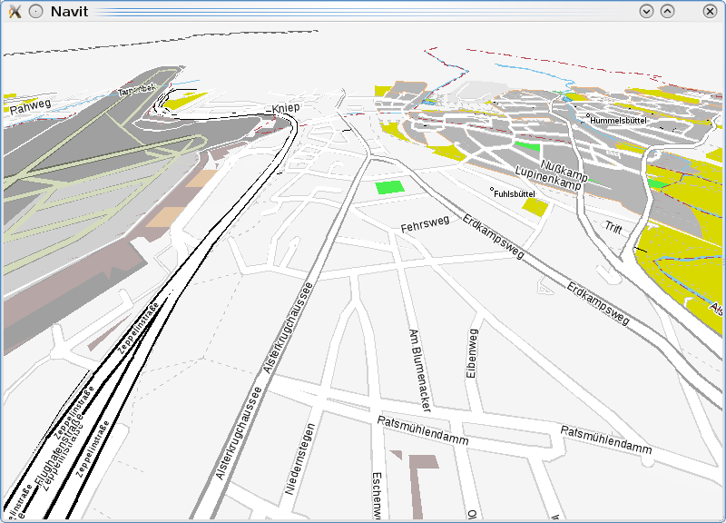
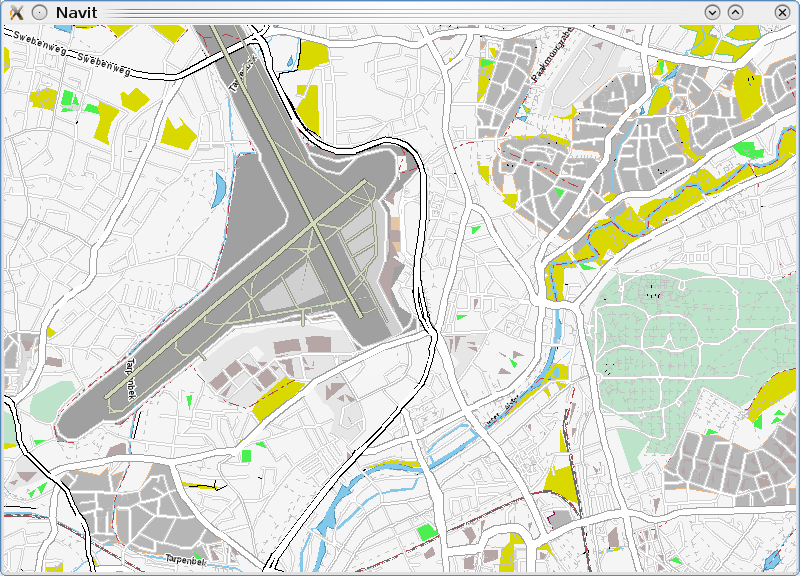

Layout/snow
===========

.. _snow_style_layout:

Snow-Style Layout
=================

Optimised for the iPod/iPhone and walking. By `Theborg <User:Theborg>`__
14:39, 13 January 2010 (UTC)

Screenshots
-----------

|400px|   |image1|

XML
---

`Download the xml file from
here <http://www.grautier.com/temp/navit/navit-snow.xml>`__, or copy and
paste the following XML into navit.xml.

.. code:: xml

    <layout name="NAVIT-Snow" color="#f5f5f5" font="Liberation Sans">
               <layer name="polygons">
                   <itemgra item_types="image" order="0-">
                       <image/>
                   </itemgra>
                   <itemgra item_types="poly_wood" order="0-">
                       <polygon color="#D9D900"/>
                       <text text_size="5"/>
                   </itemgra>
                   <itemgra item_types="poly_farm" order="0-">
                       <polygon color="#D9D900"/>
                       <polyline color="#79c691"/>
                       <text text_size="5"/>
                   </itemgra>
                   <itemgra item_types="poly_town" order="0-">
                       <polygon color="#b6b6b6"/>
                       <polyline color="#ebb481"/>
                   </itemgra>
                   <itemgra item_types="poly_university" order="8-">
                       <polygon color="#b6b6b6"/>
                       <polyline color="#881155"/>
                   </itemgra>
                   <itemgra item_types="poly_water" order="0-">
                       <polygon color="#82c8ea"/>
                       <polyline color="#5096b8"/>
                       <text text_size="5"/>
                   </itemgra>
                   <itemgra item_types="poly_land" order="0-">
                       <polygon color="#D9D900"/>
                       <polyline color="#ffefb7"/>
                       <text text_size="5"/>
                   </itemgra>
                   <itemgra item_types="poly_park" order="0-">
                       <polygon color="#D9D900"/>
                       <text text_size="5"/>
                   </itemgra>
                   <itemgra item_types="poly_pedestrian" order="10">
                       <polyline color="#d2d2d2" width="3"/>
                       <polyline color="#dddddd" width="1"/>
                       <polygon color="#dddddd"/>
                   </itemgra>
                   <itemgra item_types="poly_pedestrian" order="11">
                       <polyline color="#d2d2d2" width="5"/>
                       <polyline color="#dddddd" width="3"/>
                       <polygon color="#dddddd"/>
                   </itemgra>
                   <itemgra item_types="poly_pedestrian" order="12">
                       <polyline color="#d2d2d2" width="8"/>
                       <polyline color="#dddddd" width="6"/>
                       <polygon color="#dddddd"/>
                   </itemgra>
                   <itemgra item_types="poly_pedestrian" order="13">
                       <polyline color="#d2d2d2" width="9"/>
                       <polyline color="#dddddd" width="7"/>
                       <polygon color="#dddddd"/>
                   </itemgra>
                   <itemgra item_types="poly_pedestrian" order="14">
                       <polyline color="#d2d2d2" width="13"/>
                       <polyline color="#dddddd" width="9"/>
                       <polygon color="#dddddd"/>
                   </itemgra>
                   <itemgra item_types="poly_pedestrian" order="15">
                       <polyline color="#d2d2d2" width="18"/>
                       <polyline color="#dddddd" width="14"/>
                       <polygon color="#dddddd"/>
                   </itemgra>
                   <itemgra item_types="poly_pedestrian" order="16">
                       <polyline color="#d2d2d2" width="21"/>
                       <polyline color="#dddddd" width="17"/>
                       <polygon color="#dddddd"/>
                   </itemgra>
                   <itemgra item_types="poly_pedestrian" order="17">
                       <polyline color="#d2d2d2" width="25"/>
                       <polyline color="#dddddd" width="21"/>
                       <polygon color="#dddddd"/>
                   </itemgra>
                   <itemgra item_types="poly_pedestrian" order="18">
                       <polyline color="#d2d2d2" width="40"/>
                       <polyline color="#dddddd" width="34"/>
                       <polygon color="#dddddd"/>
                   </itemgra>
                   <itemgra item_types="poly_airport" order="0-">
                       <polygon color="#a0a0a0"/>
                   </itemgra>
                   <itemgra item_types="poly_sport,poly_sports_pitch" order="0-">
                       <polygon color="#4af04f"/>
                   </itemgra>
                   <itemgra item_types="poly_industry,poly_place" order="0-">
                       <polygon color="#e6e6e6"/>
                   </itemgra>
                   <itemgra item_types="poly_service" order="8-18">
                       <polygon color="#fefefe"/>
                       <polyline color="#d2d2d2" width="1"/>
                   </itemgra>
                   <itemgra item_types="poly_street_1" order="8-13">
                       <polygon color="#ffffff"/>
                       <polyline color="#d2d2d2" width="1"/>
                   </itemgra>
                   <itemgra item_types="poly_street_1" order="14-16">
                       <polygon color="#ffffff"/>
                       <polyline color="#d2d2d2" width="2"/>
                   </itemgra>
                   <itemgra item_types="poly_street_1" order="17-18">
                       <polygon color="#ffffff"/>
                       <polyline color="#d2d2d2" width="3"/>
                   </itemgra>
                   <itemgra item_types="poly_street_2" order="7-12">
                       <polygon color="#ffffff"/>
                       <polyline color="#c0c0c0" width="1"/>
                   </itemgra>
                   <itemgra item_types="poly_street_2" order="13-16">
                       <polygon color="#ffffff"/>
                       <polyline color="#c0c0c0" width="2"/>
                   </itemgra>
                   <itemgra item_types="poly_street_2" order="17-18">
                       <polygon color="#ffffff"/>
                       <polyline color="#c0c0c0" width="3"/>
                   </itemgra>
                   <itemgra item_types="poly_street_3" order="7-11">
                       <polygon color="#ffffff"/>
                       <polyline color="#a0a0a0" width="1"/>
                   </itemgra>
                   <itemgra item_types="poly_street_3" order="12-15">
                       <polygon color="#ffffff"/>
                       <polyline color="#a0a0a0" width="2"/>
                   </itemgra>
                   <itemgra item_types="poly_street_3" order="16-18">
                       <polygon color="#ffffff"/>
                       <polyline color="#a0a0a0" width="3"/>
                   </itemgra>
                   <itemgra item_types="water_line" order="0-">
                       <polyline color="#5096b8" width="1"/>
                       <text text_size="5"/>
                   </itemgra>
                   <itemgra item_types="water_river" order="4-5">
                       <polyline color="#82c8ea" width="1"/>
                   </itemgra>
                   <itemgra item_types="water_river" order="6">
                       <polyline color="#82c8ea" width="2"/>
                   </itemgra>
                   <itemgra item_types="water_river" order="7">
                       <polyline color="#82c8ea" width="3"/>
                       <text text_size="5"/>
                   </itemgra>
                   <itemgra item_types="water_river" order="8-9">
                       <polyline color="#82c8ea" width="4"/>
                       <text text_size="7"/>
                   </itemgra>
                   <itemgra item_types="water_river" order="10-">
                       <polyline color="#82c8ea" width="4"/>
                       <text text_size="10"/>
                   </itemgra>
                   <itemgra item_types="water_canal" order="6">
                       <polyline color="#82c8ea" width="1"/>
                   </itemgra>
                   <itemgra item_types="water_canal" order="7">
                       <polyline color="#82c8ea" width="2"/>
                       <text text_size="5"/>
                   </itemgra>
                   <itemgra item_types="water_canal" order="8-9">
                       <polyline color="#82c8ea" width="3"/>
                       <text text_size="7"/>
                   </itemgra>
                   <itemgra item_types="water_canal" order="10-">
                       <polyline color="#82c8ea" width="3"/>
                       <text text_size="10"/>
                   </itemgra>
                   <itemgra item_types="water_stream" order="8-9">
                       <polyline color="#82c8ea" width="1"/>
                   </itemgra>
                   <itemgra item_types="water_stream" order="10-">
                       <polyline color="#82c8ea" width="2"/>
                       <text text_size="7"/>
                   </itemgra>
                   <itemgra item_types="water_drain" order="10-">
                       <polyline color="#82c8ea" width="1"/>
                       <text text_size="5"/>
                   </itemgra>
                   <itemgra item_types="poly_apron" order="0-">
                       <polygon color="#d0d0d0"/>
                   </itemgra>
                   <itemgra item_types="poly_terminal" order="7-">
                       <polygon color="#e3c6a6"/>
                   </itemgra>
                   <itemgra item_types="poly_cemetery" order="1-">
                       <polygon color="#bde3cb"/>
                   </itemgra>
                   <itemgra item_types="poly_car_parking" order="1-">
                       <polygon color="#f6f6f6"/>
                   </itemgra>
                   <itemgra item_types="poly_building" order="0-">
                       <polygon color="#b6a6a6"/>
                   </itemgra>
                   <itemgra item_types="rail" order="6-">
                       <polyline color="#696969" width="3"/>
                       <polyline color="#ffffff" width="1" dash="5,5"/>
                   </itemgra>
                   <itemgra item_types="ferry" order="5-">
                       <polyline color="#000000" width="1" dash="10"/>
                   </itemgra>
                   <itemgra item_types="border_country" order="0-">
                       <polyline color="#b8434e" width="1" dash="10,5,2,5"/>
                   </itemgra>
                   <itemgra item_types="border_state" order="0-">
                       <polyline color="#808080" width="1"/>
                   </itemgra>
                   <itemgra item_types="height_line_1" order="0-">
                       <polyline color="#000000" width="4"/>
                   </itemgra>
                   <itemgra item_types="height_line_2" order="0-">
                       <polyline color="#000000" width="2"/>
                   </itemgra>
                   <itemgra item_types="height_line_3" order="0-">
                       <polyline color="#000000" width="1"/>
                   </itemgra>
               </layer>
               <layer name="streets">
                   <itemgra item_types="street_route" order="2">
                       <polyline color="#0000a0" width="4"/>
                   </itemgra>
                   <itemgra item_types="street_route" order="3-5">
                       <polyline color="#0000a0" width="8"/>
                   </itemgra>
                   <itemgra item_types="street_route" order="6">
                       <polyline color="#0000a0" width="10"/>
                   </itemgra>
                   <itemgra item_types="street_route" order="7-8">
                       <polyline color="#0000a0" width="16"/>
                   </itemgra>
                   <itemgra item_types="street_route" order="9-10">
                       <polyline color="#0000a0" width="20"/>
                   </itemgra>
                   <itemgra item_types="street_route" order="11">
                       <polyline color="#0000a0" width="28"/>
                   </itemgra>
                   <itemgra item_types="street_route" order="12">
                       <polyline color="#0000a0" width="32"/>
                   </itemgra>
                   <itemgra item_types="street_route" order="13">
                       <polyline color="#0000a0" width="52"/>
                   </itemgra>
                   <itemgra item_types="street_route" order="14">
                       <polyline color="#0000a0" width="64"/>
                   </itemgra>
                   <itemgra item_types="street_route" order="15">
                       <polyline color="#0000a0" width="68"/>
                   </itemgra>
                   <itemgra item_types="street_route" order="16">
                       <polyline color="#0000a0" width="132"/>
                   </itemgra>
                   <itemgra item_types="street_route" order="17">
                       <polyline color="#0000a0" width="268"/>
                   </itemgra>
                   <itemgra item_types="street_route" order="18">
                       <polyline color="#0000a0" width="530"/>
                   </itemgra>
           <itemgra item_types="selected_line" order="2">
                       <polyline color="#ba00b8" width="4"/>
                   </itemgra>
                   <itemgra item_types="selected_line" order="3-5">
                       <polyline color="#ba00b8" width="8"/>
                   </itemgra>
                   <itemgra item_types="selected_line" order="6">
                       <polyline color="#ba00b8" width="10"/>
                   </itemgra>
                   <itemgra item_types="selected_line" order="7-8">
                       <polyline color="#ba00b8" width="16"/>
                   </itemgra>
                   <itemgra item_types="selected_line" order="9-10">
                       <polyline color="#ba00b8" width="20"/>
                   </itemgra>
                   <itemgra item_types="selected_line" order="11">
                       <polyline color="#ba00b8" width="28"/>
                   </itemgra>
                   <itemgra item_types="selected_line" order="12">
                       <polyline color="#ba00b8" width="32"/>
                   </itemgra>
                   <itemgra item_types="selected_line" order="13">
                       <polyline color="#ba00b8" width="52"/>
                   </itemgra>
                   <itemgra item_types="selected_line" order="14">
                       <polyline color="#ba00b8" width="64"/>
                   </itemgra>
                   <itemgra item_types="selected_line" order="15">
                       <polyline color="#ba00b8" width="68"/>
                   </itemgra>
                   <itemgra item_types="selected_line" order="16">
                       <polyline color="#ba00b8" width="132"/>
                   </itemgra>
                   <itemgra item_types="selected_line" order="17">
                       <polyline color="#ba00b8" width="268"/>
                   </itemgra>
                   <itemgra item_types="selected_line" order="18">
                       <polyline color="#ba00b8" width="530"/>
                   </itemgra>
                   <itemgra item_types="street_nopass" order="10-">
                       <polyline color="#000000" width="1"/>
                   </itemgra>
                   <itemgra item_types="track_paved" order="10-">
                       <polyline color="#000000" width="1"/>
                   </itemgra>
                   <itemgra item_types="track_gravelled" order="10-12">
                       <polyline color="#c3c3c3" width="1" dash="3,6"/>
                   </itemgra>
                   <itemgra item_types="track_gravelled" order="13-14">
                       <polyline color="#ffffff" width="4" dash="4,8"/>
                       <polyline color="#c3c3c3" width="2" dash="4,8"/>
                   </itemgra>
                   <itemgra item_types="track_gravelled" order="15-16">
                       <polyline color="#ffffff" width="5" dash="5,10"/>
                       <polyline color="#c3c3c3" width="3" dash="5,10"/>
                   </itemgra>
                   <itemgra item_types="track_gravelled" order="17-">
                       <polyline color="#ffffff" width="7" dash="7,15"/>
                       <polyline color="#c3c3c3" width="5" dash="7,15"/>
                   </itemgra>
                   <itemgra item_types="track_unpaved" order="10-">
                       <polyline color="#000000" width="1"/>
                   </itemgra>
                   <itemgra item_types="bridleway" order="10-">
                       <polyline color="#000000" width="1"/>
                   </itemgra>
                   <itemgra item_types="cycleway" order="10-">
                       <polyline color="#000000" width="1"/>
                   </itemgra>
                   <itemgra item_types="piste_downhill_novice" order="10-12">
                       <polyline color="#00A000" width="1"/>
                   </itemgra>
                   <itemgra item_types="piste_downhill_novice" order="13-14">
                       <polyline color="#00A000" width="2"/>
                   </itemgra>
                   <itemgra item_types="piste_downhill_novice" order="15-16">
                       <polyline color="#00A000" width="3"/>
                   </itemgra>
                   <itemgra item_types="piste_downhill_novice" order="17-">
                       <polyline color="#00A000" width="5"/>
                   </itemgra>
                   <itemgra item_types="piste_downhill_easy" order="10-12">
                       <polyline color="#c3c3c3" width="1"/>
                   </itemgra>
                   <itemgra item_types="piste_downhill_easy" order="13-14">
                       <polyline color="#c3c3c3" width="2"/>
                   </itemgra>
                   <itemgra item_types="piste_downhill_easy" order="15-16">
                       <polyline color="#c3c3c3" width="3"/>
                   </itemgra>
                   <itemgra item_types="piste_downhill_easy" order="17-">
                       <polyline color="#c3c3c3" width="5"/>
                   </itemgra>
                   <itemgra item_types="piste_downhill_intermediate" order="10-12">
                       <polyline color="#c3c3c3" width="1"/>
                   </itemgra>
                   <itemgra item_types="piste_downhill_intermediate" order="13-14">
                       <polyline color="#c3c3c3" width="2"/>
                   </itemgra>
                   <itemgra item_types="piste_downhill_intermediate" order="15-16">
                       <polyline color="#c3c3c3" width="3"/>
                   </itemgra>
                   <itemgra item_types="piste_downhill_intermediate" order="17-">
                       <polyline color="#C3c3c3" width="5"/>
                   </itemgra>
                   <itemgra item_types="piste_downhill_advanced" order="10-12">
                       <polyline color="#c3c3c3" width="1"/>
                   </itemgra>
                   <itemgra item_types="piste_downhill_advanced" order="13-14">
                       <polyline color="#c3c3c3" width="2"/>
                   </itemgra>
                   <itemgra item_types="piste_downhill_advanced" order="15-16">
                       <polyline color="#c3c3c3" width="3"/>
                   </itemgra>
                   <itemgra item_types="piste_downhill_advanced" order="17-">
                       <polyline color="#c3c3c3" width="5"/>
                   </itemgra>
                   <itemgra item_types="piste_downhill_expert" order="10-12">
                       <polyline color="#c3c3c3" width="1"/>
                   </itemgra>
                   <itemgra item_types="piste_downhill_expert" order="13-14">
                       <polyline color="#c3c3c3" width="2"/>
                   </itemgra>
                   <itemgra item_types="piste_downhill_expert" order="15-16">
                       <polyline color="#c3c3c3" width="3"/>
                   </itemgra>
                   <itemgra item_types="piste_downhill_expert" order="17-">
                       <polyline color="#c3c3c3" width="5"/>
                   </itemgra>
                   <itemgra item_types="piste_downhill_freeride" order="10-12">
                       <polyline color="#c3c3c3" width="1"/>
                   </itemgra>
                   <itemgra item_types="piste_downhill_freeride" order="13-14">
                       <polyline color="#c3c3c3" width="2"/>
                   </itemgra>
                   <itemgra item_types="piste_downhill_freeride" order="15-16">
                       <polyline color="#c3c3c3" width="3"/>
                   </itemgra>
                   <itemgra item_types="piste_downhill_freeride" order="17-">
                       <polyline color="#c3c3c3" width="5"/>
                   </itemgra>
                   <itemgra item_types="lift_cable_car" order="6-">
                       <polyline color="#696969" width="1" dash="5"/>
                   </itemgra>
                   <itemgra item_types="lift_chair" order="6-">
                       <polyline color="#696969" width="1" dash="5"/>
                   </itemgra>
                   <itemgra item_types="lift_drag" order="6-">
                       <polyline color="#696969" width="1" dash="5"/>
                   </itemgra>
                   <itemgra item_types="piste_nordic" order="10-12">
                       <polyline color="#0000ff" width="1" dash="3,6" offset="4"/>
                   </itemgra>
                   <itemgra item_types="piste_nordic" order="13-14">
                       <polyline color="#ffffff" width="4" dash="4,8" offset="6"/>
                       <polyline color="#0000ff" width="2" dash="4,8" offset="6"/>
                   </itemgra>
                   <itemgra item_types="piste_nordic" order="15-16">
                       <polyline color="#ffffff" width="5" dash="5,10" offset="7"/>
                       <polyline color="#0000ff" width="3" dash="5,10" offset="7"/>
                   </itemgra>
                   <itemgra item_types="piste_nordic" order="17-">
                       <polyline color="#ffffff" width="7" dash="7,15" offset="10"/>
                       <polyline color="#0000ff" width="5" dash="7,15" offset="10"/>
                   </itemgra>
                   <itemgra item_types="footway_and_piste_nordic" order="10-12">
                       <polyline color="#c3c3c3" width="1" dash="3,15"/>
                       <polyline color="#0000ff" width="1" dash="3,15" offset="9"/>
                   </itemgra>
                   <itemgra item_types="footway_and_piste_nordic" order="13-14">
                       <polyline color="#ffffff" width="4" dash="4,8"/>
                       <polyline color="#c3c3c3" width="2" dash="4,20"/>
                       <polyline color="#0000ff" width="2" dash="4,20" offset="12"/>
                   </itemgra>
                   <itemgra item_types="footway_and_piste_nordic" order="15-16">
                       <polyline color="#ffffff" width="5" dash="5,10"/>
                       <polyline color="#c3c3c3" width="3" dash="5,25"/>
                       <polyline color="#0000ff" width="3" dash="5,25" offset="15"/>
                   </itemgra>
                   <itemgra item_types="footway_and_piste_nordic" order="17-">
                       <polyline color="#ffffff" width="7" dash="7,15"/>
                       <polyline color="#c3c3c3" width="5" dash="7,37"/>
                       <polyline color="#0000ff" width="5" dash="7,37" offset="22"/>
                   </itemgra>
                   <itemgra item_types="footway" order="10-12">
                       <polyline color="#c3c3c3" width="1" dash="3,6"/>
                   </itemgra>
                   <itemgra item_types="footway" order="13-14">
                       <polyline color="#ffffff" width="4" dash="4,8"/>
                       <polyline color="#c3c3c3" width="2" dash="4,8"/>
                   </itemgra>
                   <itemgra item_types="footway" order="15-16">
                       <polyline color="#ffffff" width="5" dash="5,10"/>
                       <polyline color="#c3c3c3" width="3" dash="5,10"/>
                   </itemgra>
                   <itemgra item_types="footway" order="17-">
                       <polyline color="#ffffff" width="7" dash="7,15"/>
                       <polyline color="#c3c3c3" width="5" dash="7,15"/>
                   </itemgra>
                   <itemgra item_types="steps" order="10-">
                       <polyline color="#000000" width="1"/>
                   </itemgra>
                   <itemgra item_types="street_pedestrian" order="10">
                       <polyline color="#d2d2d2" width="3"/>
                       <polyline color="#dddddd" width="1"/>
                   </itemgra>
                   <itemgra item_types="street_pedestrian" order="11">
                       <polyline color="#d2d2d2" width="5"/>
                       <polyline color="#dddddd" width="3"/>
                   </itemgra>
                   <itemgra item_types="street_pedestrian" order="12">
                       <polyline color="#d2d2d2" width="8"/>
                       <polyline color="#dddddd" width="6"/>
                   </itemgra>
                   <itemgra item_types="street_pedestrian" order="13">
                       <polyline color="#d2d2d2" width="9"/>
                       <polyline color="#dddddd" width="7"/>
                   </itemgra>
                   <itemgra item_types="street_pedestrian" order="14">
                       <polyline color="#d2d2d2" width="13"/>
                       <polyline color="#dddddd" width="9"/>
                   </itemgra>
                   <itemgra item_types="street_pedestrian" order="15">
                       <polyline color="#d2d2d2" width="18"/>
                       <polyline color="#dddddd" width="14"/>
                   </itemgra>
                   <itemgra item_types="street_pedestrian" order="16">
                       <polyline color="#d2d2d2" width="21"/>
                       <polyline color="#dddddd" width="17"/>
                   </itemgra>
                   <itemgra item_types="street_pedestrian" order="17">
                       <polyline color="#d2d2d2" width="25"/>
                       <polyline color="#dddddd" width="21"/>
                   </itemgra>
                   <itemgra item_types="street_pedestrian" order="18">
                       <polyline color="#d2d2d2" width="40"/>
                       <polyline color="#dddddd" width="34"/>
                   </itemgra>
                   <itemgra item_types="street_service" order="10">
                       <polyline color="#d2d2d2" width="4"/>
                       <polyline color="#fefefe" width="2"/>
                   </itemgra>
                   <itemgra item_types="street_service" order="11">
                       <polyline color="#d2d2d2" width="4"/>
                       <polyline color="#fefefe" width="2"/>
                   </itemgra>
                   <itemgra item_types="street_service" order="12">
                       <polyline color="#d2d2d2" width="5"/>
                       <polyline color="#fefefe" width="3"/>
                   </itemgra>
                   <itemgra item_types="street_service" order="13">
                       <polyline color="#d2d2d2" width="6"/>
                       <polyline color="#fefefe" width="4"/>
                   </itemgra>
                   <itemgra item_types="street_service" order="14">
                       <polyline color="#d2d2d2" width="7"/>
                       <polyline color="#fefefe" width="5"/>
                   </itemgra>
                   <itemgra item_types="street_service" order="15">
                       <polyline color="#d2d2d2" width="8"/>
                       <polyline color="#fefefe" width="6"/>
                   </itemgra>
                   <itemgra item_types="street_service" order="16">
                       <polyline color="#d2d2d2" width="9"/>
                       <polyline color="#fefefe" width="7"/>
                   </itemgra>
                   <itemgra item_types="street_service" order="17">
                       <polyline color="#d2d2d2" width="10"/>
                       <polyline color="#fefefe" width="8"/>
                   </itemgra>
                   <itemgra item_types="street_service" order="18">
                       <polyline color="#d2d2d2" width="11"/>
                       <polyline color="#fefefe" width="9"/>
                   </itemgra>
                   <itemgra item_types="street_parking_lane" order="12">
                       <polyline color="#d2d2d2" width="4"/>
                       <polyline color="#fefefe" width="2"/>
                   </itemgra>
                   <itemgra item_types="street_parking_lane" order="13">
                       <polyline color="#d2d2d2" width="4"/>
                       <polyline color="#fefefe" width="2"/>
                   </itemgra>
                   <itemgra item_types="street_parking_lane" order="14">
                       <polyline color="#d2d2d2" width="5"/>
                       <polyline color="#fefefe" width="3"/>
                   </itemgra>
                   <itemgra item_types="street_parking_lane" order="15">
                       <polyline color="#d2d2d2" width="6"/>
                       <polyline color="#fefefe" width="4"/>
                   </itemgra>
                   <itemgra item_types="street_parking_lane" order="16">
                       <polyline color="#d2d2d2" width="7"/>
                       <polyline color="#fefefe" width="5"/>
                   </itemgra>
                   <itemgra item_types="street_parking_lane" order="17">
                       <polyline color="#d2d2d2" width="8"/>
                       <polyline color="#fefefe" width="6"/>
                   </itemgra>
                   <itemgra item_types="street_parking_lane" order="18">
                       <polyline color="#d2d2d2" width="9"/>
                       <polyline color="#fefefe" width="7"/>
                   </itemgra>
                   <itemgra item_types="street_0,street_1_city,street_1_land" order="10">
                       <polyline color="#d2d2d2" width="4"/>
                       <polyline color="#ffffff" width="2"/>
                   </itemgra>
                   <itemgra item_types="street_0,street_1_city,street_1_land" order="11">
                       <polyline color="#d2d2d2" width="6"/>
                       <polyline color="#ffffff" width="4"/>
                   </itemgra>
                   <itemgra item_types="street_0,street_1_city,street_1_land" order="12">
                       <polyline color="#d2d2d2" width="10"/>
                       <polyline color="#ffffff" width="8"/>
                   </itemgra>
                   <itemgra item_types="street_0,street_1_city,street_1_land" order="13">
                       <polyline color="#d2d2d2" width="11"/>
                       <polyline color="#ffffff" width="9"/>
                   </itemgra>
                   <itemgra item_types="street_0,street_1_city,street_1_land" order="14">
                       <polyline color="#d2d2d2" width="17"/>
                       <polyline color="#ffffff" width="13"/>
                   </itemgra>
                   <itemgra item_types="street_0,street_1_city,street_1_land" order="15">
                       <polyline color="#d2d2d2" width="18"/>
                       <polyline color="#ffffff" width="14"/>
                   </itemgra>
                   <itemgra item_types="street_0,street_1_city,street_1_land" order="16">
                       <polyline color="#d2d2d2" width="30"/>
                       <polyline color="#ffffff" width="26"/>
                   </itemgra>
                   <itemgra item_types="street_0,street_1_city,street_1_land" order="17">
                       <polyline color="#d2d2d2" width="67"/>
                       <polyline color="#ffffff" width="61"/>
                   </itemgra>
                   <itemgra item_types="street_0,street_1_city,street_1_land" order="18">
                       <polyline color="#d2d2d2" width="132"/>
                       <polyline color="#ffffff" width="126"/>
                   </itemgra>
                   <itemgra item_types="street_2_city,street_2_land,ramp" order="7-8">
                       <polyline color="#c0c0c0" width="2"/>
                   </itemgra>
                   <itemgra item_types="street_2_city,street_2_land,ramp" order="9">
                       <polyline color="#c0c0c0" width="3"/>
                       <polyline color="#ffffff" width="1"/>
                   </itemgra>
                   <itemgra item_types="street_2_city,street_2_land,ramp" order="10">
                       <polyline color="#c0c0c0" width="4"/>
                       <polyline color="#ffffff" width="2"/>
                   </itemgra>
                   <itemgra item_types="street_2_city,street_2_land,ramp" order="11">
                       <polyline color="#c0c0c0" width="5"/>
                       <polyline color="#ffffff" width="3"/>
                   </itemgra>
                   <itemgra item_types="street_2_city,street_2_land,ramp" order="12">
                       <polyline color="#c0c0c0" width="7"/>
                       <polyline color="#ffffff" width="5"/>
                   </itemgra>
                   <itemgra item_types="street_2_city,street_2_land,ramp" order="13">
                       <polyline color="#c0c0c0" width="11"/>
                       <polyline color="#ffffff" width="8"/>
                   </itemgra>
                   <itemgra item_types="street_2_city,street_2_land,ramp" order="14">
                       <polyline color="#c0c0c0" width="14"/>
                       <polyline color="#ffffff" width="11"/>
                   </itemgra>
                   <itemgra item_types="street_2_city,street_2_land,ramp" order="15">
                       <polyline color="#c0c0c0" width="19"/>
                       <polyline color="#ffffff" width="15"/>
                   </itemgra>
                   <itemgra item_types="street_2_city,street_2_land,ramp" order="16">
                       <polyline color="#c0c0c0" width="30"/>
                       <polyline color="#ffffff" width="26"/>
                   </itemgra>
                   <itemgra item_types="street_2_city,street_2_land,ramp" order="17">
                       <polyline color="#c0c0c0" width="63"/>
                       <polyline color="#ffffff" width="57"/>
                   </itemgra>
                   <itemgra item_types="street_2_city,street_2_land,ramp" order="18">
                       <polyline color="#c0c0c0" width="100"/>
                       <polyline color="#ffffff" width="90"/>
                   </itemgra>
                   <itemgra item_types="street_3_city,street_3_land,roundabout" order="7-8">
                       <polyline color="#a0a0a0" width="3"/>
                       <polyline color="#ffffff" width="1"/>
                   </itemgra>
                   <itemgra item_types="street_3_city,street_3_land,roundabout" order="9">
                       <polyline color="#a0a0a0" width="5"/>
                       <polyline color="#ffffff" width="3"/>
                   </itemgra>
                   <itemgra item_types="street_3_city,street_3_land,roundabout" order="10">
                       <polyline color="#a0a0a0" width="8"/>
                       <polyline color="#ffffff" width="6"/>
                   </itemgra>
                   <itemgra item_types="street_3_city,street_3_land,roundabout" order="11">
                       <polyline color="#a0a0a0" width="9"/>
                       <polyline color="#ffffff" width="7"/>
                   </itemgra>
                   <itemgra item_types="street_3_city,street_3_land,roundabout" order="12">
                       <polyline color="#a0a0a0" width="13"/>
                       <polyline color="#ffffff" width="9"/>
                   </itemgra>
                   <itemgra item_types="street_3_city,street_3_land,roundabout" order="13">
                       <polyline color="#a0a0a0" width="18"/>
                       <polyline color="#ffffff" width="14"/>
                   </itemgra>
                   <itemgra item_types="street_3_city,street_3_land,roundabout" order="14">
                       <polyline color="#a0a0a0" width="21"/>
                       <polyline color="#ffffff" width="17"/>
                   </itemgra>
                   <itemgra item_types="street_3_city,street_3_land,roundabout" order="15">
                       <polyline color="#a0a0a0" width="25"/>
                       <polyline color="#ffffff" width="21"/>
                   </itemgra>
                   <itemgra item_types="street_3_city,street_3_land,roundabout" order="16">
                       <polyline color="#a0a0a0" width="40"/>
                       <polyline color="#ffffff" width="34"/>
                   </itemgra>
                   <itemgra item_types="street_3_city,street_3_land,roundabout" order="17">
                       <polyline color="#a0a0a0" width="79"/>
                       <polyline color="#ffffff" width="73"/>
                   </itemgra>
                   <itemgra item_types="street_3_city,street_3_land,roundabout" order="18">
                       <polyline color="#a0a0a0" width="156"/>
                       <polyline color="#ffffff" width="150"/>
                   </itemgra>
                   <itemgra item_types="street_4_city,street_4_land,street_n_lanes" order="2-6">
                       <polyline color="#404040" width="1"/>
                   </itemgra>
                   <itemgra item_types="street_4_city,street_4_land,street_n_lanes" order="7-8">
                       <polyline color="#404040" width="3"/>
                       <polyline color="#FFFFFF" width="1"/>
                   </itemgra>
                   <itemgra item_types="street_4_city,street_4_land,street_n_lanes" order="9">
                       <polyline color="#000000" width="5"/>
                       <polyline color="#FFFFFF" width="3"/>
                   </itemgra>
                   <itemgra item_types="street_4_city,street_4_land,street_n_lanes" order="10">
                       <polyline color="#000000" width="6"/>
                       <polyline color="#FFFFFF" width="4"/>
                   </itemgra>
                   <itemgra item_types="street_4_city,street_4_land,street_n_lanes" order="11">
                       <polyline color="#000000" width="9"/>
                       <polyline color="#FFFFFF" width="7"/>
                   </itemgra>
                   <itemgra item_types="street_4_city,street_4_land,street_n_lanes" order="12">
                       <polyline color="#000000" width="13"/>
                       <polyline color="#FFFFFF" width="9"/>
                   </itemgra>
                   <itemgra item_types="street_4_city,street_4_land,street_n_lanes" order="13">
                       <polyline color="#000000" width="18"/>
                       <polyline color="#FFFFFF" width="14"/>
                   </itemgra>
                   <itemgra item_types="street_4_city,street_4_land,street_n_lanes" order="14">
                       <polyline color="#000000" width="21"/>
                       <polyline color="#FFFFFF" width="17"/>
                   </itemgra>
                   <itemgra item_types="street_4_city,street_4_land,street_n_lanes" order="15">
                       <polyline color="#000000" width="24"/>
                       <polyline color="#FFFFFF" width="20"/>
                   </itemgra>
                   <itemgra item_types="street_4_city,street_4_land,street_n_lanes" order="16">
                       <polyline color="#000000" width="39"/>
                       <polyline color="#FFFFFF" width="33"/>
                   </itemgra>
                   <itemgra item_types="street_4_city,street_4_land,street_n_lanes" order="17">
                       <polyline color="#000000" width="78"/>
                       <polyline color="#FFFFFF" width="72"/>
                   </itemgra>
                   <itemgra item_types="street_4_city,street_4_land,street_n_lanes" order="18">
                       <polyline color="#000000" width="156"/>
                       <polyline color="#FFFFFF" width="150"/>
                   </itemgra>
                   <itemgra item_types="highway_city,highway_land" order="2">
                       <polyline color="#FFFFFF" width="1"/>
                   </itemgra>
                   <itemgra item_types="highway_city,highway_land" order="3-5">
                       <polyline color="#FFFFFF" width="3"/>
                       <polyline color="#ffffff" width="1"/>
                   </itemgra>
                   <itemgra item_types="highway_city,highway_land" order="6">
                       <polyline color="#FFFFFF" width="4"/>
                       <polyline color="#ffffff" width="2"/>
                   </itemgra>
                   <itemgra item_types="highway_city,highway_land" order="7-8">
                       <polyline color="#FFFFFF" width="7"/>
                       <polyline color="#ffffff" width="5"/>
                       <polyline color="#FFFFFF" width="1"/>
                   </itemgra>
                   <itemgra item_types="highway_city,highway_land" order="9-10">
                       <polyline color="#FFFFFF" width="9"/>
                       <polyline color="#ffffff" width="5"/>
                       <polyline color="#FFFFFF" width="1"/>
                   </itemgra>
                   <itemgra item_types="highway_city,highway_land" order="11">
                       <polyline color="#FFFFFF" width="13"/>
                       <polyline color="#ffffff" width="9"/>
                       <polyline color="#FFFFFF" width="1"/>
                   </itemgra>
                   <itemgra item_types="highway_city,highway_land" order="12">
                       <polyline color="#FFFFFF" width="15"/>
                       <polyline color="#ffffff" width="10"/>
                       <polyline color="#FFFFFF" width="1"/>
                   </itemgra>
                   <itemgra item_types="highway_city,highway_land" order="13">
                       <polyline color="#FFFFFF" width="25"/>
                       <polyline color="#ffffff" width="17"/>
                       <polyline color="#FFFFFF" width="1"/>
                   </itemgra>
                   <itemgra item_types="highway_city,highway_land" order="14">
                       <polyline color="#FFFFFF" width="31"/>
                       <polyline color="#ffffff" width="24"/>
                       <polyline color="#FFFFFF" width="1"/>
                   </itemgra>
                   <itemgra item_types="highway_city,highway_land" order="15">
                       <polyline color="#FFFFFF" width="33"/>
                       <polyline color="#ffffff" width="27"/>
                       <polyline color="#FFFFFF" width="1"/>
                   </itemgra>
                   <itemgra item_types="highway_city,highway_land" order="16">
                       <polyline color="#FFFFFF" width="65"/>
                       <polyline color="#ffffff" width="59"/>
                       <polyline color="#FFFFFF" width="1"/>
                   </itemgra>
                   <itemgra item_types="highway_city,highway_land" order="17">
                       <polyline color="#FFFFFF" width="133"/>
                       <polyline color="#ffffff" width="127"/>
                       <polyline color="#FFFFFF" width="1"/>
                   </itemgra>
                   <itemgra item_types="highway_city,highway_land" order="18">
                       <polyline color="#FFFFFF" width="264"/>
                       <polyline color="#ffffff" width="258"/>
                       <polyline color="#FFFFFF" width="1"/>
                   </itemgra>
                   <!-- This entry shows all unknown linear elements as blue lines -->
                   <!--
                   <itemgra item_types="street_unkn" order="0-">
                       <polyline color="#8080ff" width="3"/>
                   </itemgra>
                   -->
                   <itemgra item_types="tracking_0" order="0-">
                       <polyline color="#000000" width="3"/>
                   </itemgra>
                   <itemgra item_types="tracking_10" order="0-">
                       <polyline color="#191919" width="3"/>
                   </itemgra>
                   <itemgra item_types="tracking_20" order="0-">
                       <polyline color="#333333" width="3"/>
                   </itemgra>
                   <itemgra item_types="tracking_30" order="0-">
                       <polyline color="#4c4c4c" width="3"/>
                   </itemgra>
                   <itemgra item_types="tracking_40" order="0-">
                       <polyline color="#666666" width="3"/>
                   </itemgra>
                   <itemgra item_types="tracking_50" order="0-">
                       <polyline color="#7f7f7f" width="3"/>
                   </itemgra>
                   <itemgra item_types="tracking_60" order="0-">
                       <polyline color="#999999" width="3"/>
                   </itemgra>
                   <itemgra item_types="tracking_70" order="0-">
                       <polyline color="#b2b2b2" width="3"/>
                   </itemgra>
                   <itemgra item_types="tracking_80" order="0-">
                       <polyline color="#cccccc" width="3"/>
                   </itemgra>
                   <itemgra item_types="tracking_90" order="0-">
                       <polyline color="#e5e5e5" width="3"/>
                   </itemgra>
                   <itemgra item_types="tracking_100" order="0-">
                       <polyline color="#ffffff" width="3"/>
                   </itemgra>
                   <itemgra item_types="highway_exit_label" order="10-">
                       <circle color="#000000" radius="3" text_size="7"/>
                   </itemgra>
                   <itemgra item_types="highway_city,highway_land,street_4_city,street_4_land,street_n_lanes" order="10-18">
                       <text text_size="8"/>
                   </itemgra>
                   <itemgra item_types="street_2_city,street_2_land,street_3_city,street_3_land,ramp" order="11-18">
                       <text text_size="9"/>
                   </itemgra>
                   <itemgra item_types="street_nopass,street_0,street_1_city,street_1_land" order="12-18">
                       <text text_size="9"/>
                   </itemgra>
                   <itemgra item_types="traffic_distortion" order="2">
                       <polyline color="#ff9000" width="2"/>
                   </itemgra>
                   <itemgra item_types="traffic_distortion" order="3-5">
                       <polyline color="#ff9000" width="4"/>
                   </itemgra>
                   <itemgra item_types="traffic_distortion" order="6">
                       <polyline color="#ff9000" width="5"/>
                   </itemgra>
                   <itemgra item_types="traffic_distortion" order="7-8">
                       <polyline color="#ff9000" width="8"/>
                   </itemgra>
                   <itemgra item_types="traffic_distortion" order="9-10">
                       <polyline color="#ff9000" width="10"/>
                   </itemgra>
                   <itemgra item_types="traffic_distortion" order="11">
                       <polyline color="#ff9000" width="14"/>
                   </itemgra>
                   <itemgra item_types="traffic_distortion" order="12">
                       <polyline color="#ff9000" width="16"/>
                   </itemgra>
                   <itemgra item_types="traffic_distortion" order="13">
                       <polyline color="#ff9000" width="26"/>
                   </itemgra>
                   <itemgra item_types="traffic_distortion" order="14">
                       <polyline color="#ff9000" width="32"/>
                   </itemgra>
                   <itemgra item_types="traffic_distortion" order="15">
                       <polyline color="#ff9000" width="34"/>
                   </itemgra>
                   <itemgra item_types="traffic_distortion" order="16">
                       <polyline color="#ff9000" width="66"/>
                   </itemgra>
                   <itemgra item_types="traffic_distortion" order="17">
                       <polyline color="#ff9000" width="134"/>
                   </itemgra>
                   <itemgra item_types="traffic_distortion" order="18">
                       <polyline color="#ff9000" width="265"/>
                   </itemgra>
               </layer>
               <layer name="polylines">
                   <itemgra item_types="aeroway_taxiway" order="10">
                       <polyline color="#989994" width="4"/>
                       <polyline color="#d3dbbc" width="2"/>
                   </itemgra>
                   <itemgra item_types="aeroway_taxiway" order="11">
                       <polyline color="#989994" width="6"/>
                       <polyline color="#d3dbbc" width="4"/>
                   </itemgra>
                   <itemgra item_types="aeroway_taxiway" order="12">
                       <polyline color="#989994" width="10"/>
                       <polyline color="#d3dbbc" width="8"/>
                   </itemgra>
                   <itemgra item_types="aeroway_taxiway" order="13">
                       <polyline color="#989994" width="12"/>
                       <polyline color="#d3dbbc" width="9"/>
                   </itemgra>
                   <itemgra item_types="aeroway_taxiway" order="14">
                       <polyline color="#989994" width="15"/>
                       <polyline color="#d3dbbc" width="13"/>
                   </itemgra>
                   <itemgra item_types="aeroway_taxiway" order="15">
                       <polyline color="#989994" width="17"/>
                       <polyline color="#d3dbbc" width="14"/>
                   </itemgra>
                   <itemgra item_types="aeroway_taxiway" order="16">
                       <polyline color="#989994" width="33"/>
                       <polyline color="#d3dbbc" width="26"/>
                   </itemgra>
                   <itemgra item_types="aeroway_taxiway" order="17">
                       <polyline color="#989994" width="69"/>
                       <polyline color="#d3dbbc" width="61"/>
                   </itemgra>
                   <itemgra item_types="aeroway_taxiway" order="18">
                       <polyline color="#989994" width="132"/>
                       <polyline color="#d3dbbc" width="126"/>
                   </itemgra>
                   <itemgra item_types="aeroway_runway" order="2-6">
                       <polyline color="#404040" width="1"/>
                   </itemgra>
                   <itemgra item_types="aeroway_runway" order="7-8">
                       <polyline color="#404040" width="3"/>
                       <polyline color="#d3dbbc" width="1"/>
                   </itemgra>
                   <itemgra item_types="aeroway_runway" order="9">
                       <polyline color="#6b6f5f" width="5"/>
                       <polyline color="#d3dbbc" width="3"/>
                   </itemgra>
                   <itemgra item_types="aeroway_runway" order="10">
                       <polyline color="#6b6f5f" width="6"/>
                       <polyline color="#d3dbbc" width="4"/>
                   </itemgra>
                   <itemgra item_types="aeroway_runway" order="11">
                       <polyline color="#6b6f5f" width="9"/>
                       <polyline color="#d3dbbc" width="7"/>
                   </itemgra>
                   <itemgra item_types="aeroway_runway" order="12">
                       <polyline color="#6b6f5f" width="13"/>
                       <polyline color="#d3dbbc" width="9"/>
                   </itemgra>
                   <itemgra item_types="aeroway_runway" order="13">
                       <polyline color="#6b6f5f" width="18"/>
                       <polyline color="#d3dbbc" width="14"/>
                   </itemgra>
                   <itemgra item_types="aeroway_runway" order="14">
                       <polyline color="#6b6f5f" width="21"/>
                       <polyline color="#d3dbbc" width="17"/>
                   </itemgra>
                   <itemgra item_types="aeroway_runway" order="15">
                       <polyline color="#6b6f5f" width="24"/>
                       <polyline color="#d3dbbc" width="20"/>
                   </itemgra>
                   <itemgra item_types="aeroway_runway" order="16">
                       <polyline color="#6b6f5f" width="39"/>
                       <polyline color="#d3dbbc" width="33"/>
                   </itemgra>
                   <itemgra item_types="aeroway_runway" order="17">
                       <polyline color="#6b6f5f" width="78"/>
                       <polyline color="#d3dbbc" width="72"/>
                   </itemgra>
                   <itemgra item_types="aeroway_runway" order="18">
                       <polyline color="#6b6f5f" width="156"/>
                       <polyline color="#d3dbbc" width="150"/>
                   </itemgra>
                   <itemgra item_types="rail_tram" order="10-">
                       <polyline color="#606060" width="2"/>
                   </itemgra>
               </layer>
               <layer name="labels">
           <itemgra item_types="house_number" order="15-">
               <circle color="#000000" radius="3" text_size="7"/>
           </itemgra>
                   <itemgra item_types="town_label,district_label,town_label_0e0,town_label_1e0,town_label_2e0,town_label_5e0,town_label_1e1,town_label_2e1,town_label_5e1,town_label_1e2,town_label_2e2,town_label_5e2,district_label_0e0,district_label_1e0,district_label_2e0,district_label_5e0,district_label_1e1,district_label_2e1,district_label_5e1,district_label_1e2,district_label_2e2,district_label_5e2" order="12-">
                       <circle color="#000000" radius="3" text_size="7"/>
                   </itemgra>
                   <itemgra item_types="district_label_1e3,district_label_2e3,district_label_5e3" order="11-">
                       <circle color="#000000" radius="3" text_size="7"/>
                   </itemgra>
                   <itemgra item_types="town_label_1e3,town_label_2e3,town_label_5e3" order="10-">
                       <circle color="#000000" radius="3" text_size="7"/>
                   </itemgra>
                   <itemgra item_types="district_label_1e4,district_label_2e4,district_label_5e4" order="9-">
                       <circle color="#000000" radius="3" text_size="7"/>
                   </itemgra>
                   <itemgra item_types="town_label_1e4,town_label_2e4,town_label_5e4" order="8-">
                       <circle color="#000000" radius="3" text_size="7"/>
                   </itemgra>
                   <itemgra item_types="district_label_1e5,district_label_2e5,district_label_5e5" order="6-">
                       <circle color="#000000" radius="3" text_size="10"/>
                   </itemgra>
                   <itemgra item_types="town_label_1e5,town_label_2e5,town_label_5e5" order="4-">
                       <circle color="#000000" radius="3" text_size="10"/>
                   </itemgra>
                   <itemgra item_types="district_label_1e6,district_label_2e6,district_label_5e6" order="3-">
                       <circle color="#000000" radius="3" text_size="15"/>
                   </itemgra>
                   <itemgra item_types="town_label_1e6,town_label_2e6,town_label_5e6" order="2-">
                       <circle color="#000000" radius="3" text_size="15"/>
                   </itemgra>
                   <itemgra item_types="town_label_1e7,district_label_1e7" order="1-">
                       <circle color="#000000" radius="3" text_size="15"/>
                   </itemgra>
               </layer>
           </layout>

