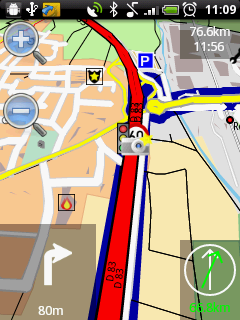

Menu
====

The Menu of Navit has the following main views and settings for
navigation and trips. This survey about the menu is not reflecting
`Navit's main
menu <http://wiki.navit-project.org/index.php/Internal_GUI#Main_Menu>`__
resp. the structure of the `Internal GUI <Internal_GUI>`__. This wiki
article highlights the main `Use
Cases <http://en.wikipedia.org/wiki/Use_case>`__ and possible future
**application scenarios** of an OpenSource navigation system for Offline
usage especially with a Crowd Sourcing approach and Open Maps.

Navigation View
---------------

Seeing the Map and Current Location of GPS-Receiver. If a destination is
set, the route is displayed in the map.

   NavIt_4997_on_HTC_Wildfire.png

Reality View
------------

`Augmented Reality <Augmented_Reality>`__ can be used to have display
routing support in a smartphone camera image. The Reality View Project
is designed as a Navit extension (see `Screenshot of Reality
View <http://commons.wikimedia.org/wiki/File:Navit_Reality_View.jpg>`__).

Trips
-----

A trip consists of a start point and a destination point. For a trip the
estimated time can be calculated. Trips are useful for trip planing
prior to the navigation. Without having the notion of trips explicitly
in Navit the calculation of the duration and the distance for a trip is
currently implemented from the current GPS location to destination. This
is shown in the Navigation view if the GUI element is defined in the
config file of Navit.

Contacts/Bookmarks
~~~~~~~~~~~~~~~~~~

The bookmarks are used for start or destination point of routing.

Trip Bookmarks
~~~~~~~~~~~~~~

Trips cannot be saved like bookmarks currently in Navit. A trip consist
of Start and Destination Point. Together with the vehicle setting a trip
has a property of average duration and distance. The average duration
could be modified by real traffic data of the user stored locally on the
mobile device for a more accurate tailored estimation for Weekdays,
Month and Start time of the trip.

Return Trip
~~~~~~~~~~~

A return trip button swaps Start Point and Destination Point of a trip.
This is not implemented in current version of Navit, but it can be
realized with bookmarks.

Trip Bookmarks
~~~~~~~~~~~~~~

Trip bookmarks consisting of Departure and Destination geo location
cannot be saved. As departure location the current GPS location is used
but not stored.

Settings of Navit
-----------------

Maps
~~~~

Different pre-defined maps can be loaded on the Mobile Device like on a
SD-card on a smart phone for Offline usage. A list of loaded maps is
currently not visible. Update button of maps e.g. from OpenStreetMap is
not implemented (could increase the traffic on the map server)

2D/3D-Views
~~~~~~~~~~~

Views are the setting of the navigation view of Navit.

Vehicle Properties
~~~~~~~~~~~~~~~~~~

The properties of the vehicle determines the calculation of the duration
of the trip. Furthermore the vehicle setting/pedestrian for reality view
determines, if certain roads are accessible for the person navigating
with the mobile device.

Settings of Internal GUI
~~~~~~~~~~~~~~~~~~~~~~~~

The settings of `Internal GUI <Internal_GUI>`__ of defined by an
XML-File.

Use Cases and Menu Levels
-------------------------

-  the current menu structure of Navit in different levels is not
   reflecting the main application scenarios.
-  the current `Internal GUI <Internal_GUI>`__ provides all necessary
   options for navigation.

The following main scenarios:

-  **Scenario 1:** I want to navigation from my current location to a
   destination (select a trip or a destination, go to navigation or
   reality view)
-  **Scenario 2:** I am at a certain location. Where are restaurants,
   parking, fuel, ... close to my current location or at destination?
   (select location and resources available at the selected location).
-  Scenario 3: I want to calculate the duration of a Trip from *A* to
   *B* while the user is currently at *C*.

The `Crowd Sourcing <http://en.wikipedia.org/wiki/Crowdsourcing>`__
scenarios:

-  Update `OpenStreetMap <http://wiki.openstreetmap.org>`__ data (eg. if
   a certain track is not available as street in OpenStreetMap, useful
   especially for developing countries)
-  `Humantarian OpenStreetMap Team
   (HOT) <http://hot.openstreetmap.org/>`__ Application for humanitarian
   purpose, access to resource and risk mapping, disaster management.
-  Update a traffic jam report into a community memory of traffic events
   that might have an impact on the routing of the users.
-  report speed on your track for updating average speed on a certain
   street. This could be used for a more accurate estimation for the
   trip duration dependent on time and date of the trip.
-  Navit could be used as Risk Mapping Mobile Device for reporting risks
   invisible for users

   -  (e.g. in cooperation with `WHO <http://www.who.org>`__ for
      invisible epidemiological risks, ecotoxicological risks
      `PDF-Presentation of the application of
      Navit <http://www.oosa.unvienna.org/pdf/pres/stsc2012/tech-10E.pdf>`__
      on COPUOS `UNOOSA <http://www.unoosa.org>`__ 02/2012.
   -  road risk mapping programmes e.g. `Road Risk
      Mapping <http://www.eurorap.org/knowledge-base/protocols-homepage/risk-mapping/>`__
