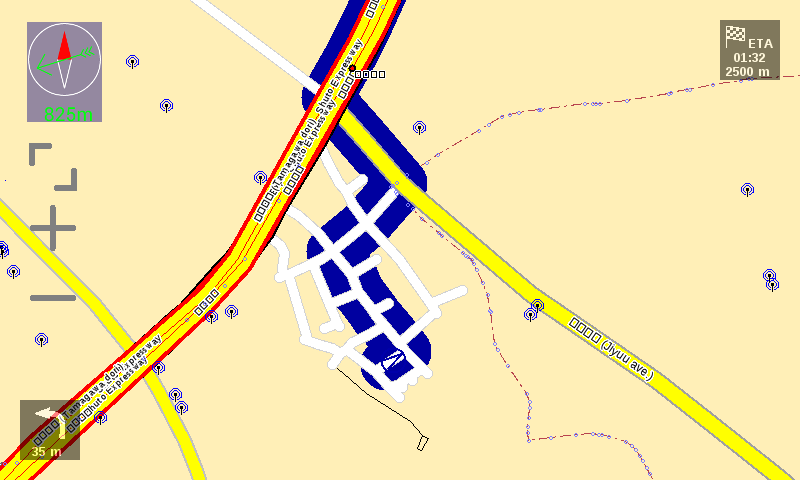
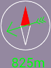
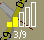
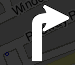
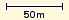
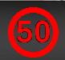

OSD
===

The On Screen Display (OSD) provides status information and controls
blended directly onto the map. These can be implemented using the ``<osd
... />`` tag inside navit.xml `Configuration <Configuration>`__.

You might try `NavitConfigurator <NavitConfigurator>`__ as a WYSIWYG
testing environment for customizing your screen setup.

Examples
========

To see example layouts for a variety of platforms and screen sizes, see
`OSD_Layouts <OSD_Layouts>`__.

Enable/Disable
==============

An osd item can be enabled/disabled using the following:

.. code:: xml

   <osd enabled="yes" />
   <osd enabled="no"  />

Position
========

The position of an element is specified in x and y **pixels** or
**percent** of screen height/width from the top-left hand corner of the
screen. Negative values will position the element with respect to the
bottom-right hand corner of the screen (pixels only - this does not work
with percent).

For example:

.. code:: xml

   <osd enabled="yes" x="0"   y="0"   />
   <osd enabled="yes" x="10"  y="10"  />
   <osd enabled="yes" x="-10" y="-10" />
   <osd enabled="yes" x="10"  y="-10" />
   <osd enabled="yes" x="10%" y="30%" />

-  The first OSD item is placed in the top left hand corner of the
   screen.
-  The second OSD item is placed 10 pixels right from the left-hand-side
   of the screen and 10 pixels down from the top of the screen (i.e. top
   left of the screen).
-  The third OSD item is placed 10 pixels left from the right-hand-side
   of the screen and 10 pixels up from the bottom of the screen (i.e.
   bottom right of the screen).
-  The fourth OSD item is placed 10 pixels right from the left-hand-side
   of the screen and 10 pixels up from the bottom of the screen (i.e.
   bottom left of the screen).
-  The fifth OSD item is placed 10% of the screen width right from the
   left-hand-side of the screen and 30% of the screen height down from
   the top of the screen.

Size
====

The sizes of each item can be explicitly set in **pixels** or
**percent** (of screen width/height) using the 'w[idth]' and 'h[eight]'
attributes.

Example 1:

.. code:: xml

   <osd enabled="yes" x="0" y="0" w="100" h="50" />

This will create an item of width 100 and height 50 pixels from the
top-left corner of the item. The top-left corner of the item is also the
point which is used when positioning the item using the 'x' and 'y'
attributes.

Example 2:

.. code:: xml

   <osd enabled="yes" x="0" y="0" w="50%" h="10%" />

This will create an item of width 50% of the screen width and height 10%
of the screen height from the top-left corner of the item.

Example `Configuration <Configuration>`__ contents, based on osd items
mentioned so far:

.. code:: xml

   <osd type="text" osd_configuration="1" w="100" h="50"  x="-100" y="0" label="${vehicle.position_speed[named]}" font_size="350"  command="osd_configuration=2"/>
   <osd type="text" osd_configuration="2" w="400" h="100" x="-400" y="0" label="${vehicle.position_speed[named]}" font_size="1200" command="osd_configuration=1"/>

The first osd is the small one, if you click on it, the second one
(large) will get visible. If you click on the large one, you will get
the small one back.

Note that not all OSD elements support w/h; some always determine their
size from their content.

Some of the OSD elements that display icons also support ``icon_w`` and
``icon_h`` attributes. When given along with ``w`` and ``h``, the image
will have the dimensions of ``icon_w`` by ``icon_h``, padded to a total
size of ``w`` by ``h``.

OSD elements which support these attributes include
``navigation_next_turn`` and ``navigation_status``.

Alignment
=========

Certain osd items may be aligned. For example, text may be aligned
centrally within an item. Alignment is specified using:

.. code:: xml

   <osd enabled="yes" x="0" y="0" w="100" h="50" align="ALIGN_NUMBER"/>

Where the alignment number can be any of the following:

-  "1": Align to the top
-  "2": Align to the bottom
-  "0" or "3": Align to the center (vertical)
-  "4": Align to the left
-  "8": Align to the right
-  "0" or "12": Align to the center (horizontal)

To get a combination of alignment you have to sum vertical and
horizontal alignment, so align="5" would give top left alignment.

+-----+-----+------+
|4+1=5|0+1=1|8+1=9 |
+-----+-----+------+
|4+0=4|0+0=0|8+0=8 |
+-----+-----+------+
|4+2=6|0+2=2|8+2=10|
+-----+-----+------+

Color
=====

.. _background_color:

Background Color
----------------

The osd item's background color can be changed using the
'background_color' attribute. For example:

.. code:: xml

   <osd enabled="yes" x="0" y="0" w="100" h="50" align="0" background_color="#000000c8" />

The color is specified in standard 6-figure hexadecimal, with the last
two figures specifying amount of transparency/opacity (00 = fully
transparent, FF = fully opaque). The above color is a translucent black.

As can be seen, the previous attributes can be combined to create a
filled box of particular dimensions and in a particular position.
However, a box is useless without content, which is where the 'type'
attribute comes in. Default seems to be transparent black (#00000060)

.. _text_color:

Text Color
----------

The color of osd text items color can be changed using the 'text_color'
attribute. For example:

.. code:: xml

   <osd enabled="yes" type="text" x="90"  y="0" w="110" h="45" align="4" font_size="400"  text_color="#ff0000"  label="${vehicle.position_speed}" />

The color is specified in standard 6-figure hexadecimal, red in the
example above. (to be tested: transparency/opacity for text?) Default
seems to be white (#ffffff). For some reason, #000000 does not work, so
#111111 is the next best guess for near-black.

Icons
=====

When OSD types use icons, they are usually specified in one of the
following two attributes:

-  ``src``: Filename for a static image.
-  ``icon_src``: Filename for a dynamic image. The string contains a
   ``%s`` placeholder, which will be replaced with an appropriate string
   (depending on the OSD type) at run time.

If these are specified without a path, Navit will look in its default
image dir (platform-dependent) for a matching image. If you specify a
path, Navit will look in that path.

You can specify either type of icon with a partial filename, omitting
the extension and size qualifiers, e.g. ``foobar`` instead of
``foobar_48_48.png``. In this case, Navit will try to find an image in a
suitable format and with suitable dimensions. On platforms which support
it, the SVG image will be used and scaled to the desired size. Otherwise
the bitmap file with the closest matching dimensions will be used and
scaled or padded/cropped (depending on the graphics driver). This should
work for all OSDs which use one of the above attributes—if not, please
report a bug.

Types
=====

An osd type is implemented using:

.. code:: xml

   <osd enabled="yes" x="10" y="10" type="OSD_TYPE" />

Current OSD types (from ):

-  `auxmap <#auxmap>`__
-  `button <#button>`__
-  `compass <#compass>`__
-  `cmd_interface <#cmd_interface>`__
-  `gps_status <#gps_status>`__
-  `image <#image>`__
-  `navigation_next_turn <#navigation_next_turn>`__
-  `navigation_status <#navigation_status>`__
-  `odometer <#odometer>`__
-  `route_guard <#route_guard>`__
-  `scale <#scale>`__
-  `speed_cam <#speed_cam>`__
-  `speed_warner <#speed_warner>`__
-  `stopwatch <#stopwatch>`__
-  `text <#text>`__
-  `toggle_announcer <#toggle_announcer>`__
-  volume

For example:

.. code:: xml

   <osd enabled="yes" x="10" y="10" type="compass" />
   <osd enabled="yes" x="10" y="10" type="gps_status" />
   <osd enabled="yes" x="10" y="10" type="text" />
   <osd enabled="yes" x="10" y="10" type="scale" />

You can determine the supported xml options for each OSD type by reading
, searching for "attr_xxx" inside the osd_xxx_new() functions. Most
types have at least an "x" and "y" option that determine the location of
their OSD.

auxmap
------

The auxmap creates an additional map on the screen.

Example `Configuration <Configuration>`__ contents:

.. code:: xml

   <osd enabled="yes" type="auxmap" x="48"  y="48" w="400" h="600"/>

button
------

|osd-button.png| The button type creates a placeholder in which a
specified image is clickable; this is usually accompanied by a
`command <#command>`__.

Example `Configuration <Configuration>`__ contents:

.. code:: xml

   <osd enabled="yes" type="button" x="48"  y="48"  command="gui.fullscreen=!gui.fullscreen" src="toggle_fullscreen.xpm" />
   <osd enabled="yes" type="button" x="-96" y="48"  command="gui.menu()"                     src="menu.xpm" />
   <osd enabled="yes" type="button" x="-96" y="-96" command="zoom_in()"                      src="zoom_in.xpm" />
   <osd enabled="yes" type="button" x="48"  y="-96" command="zoom_out()"                     src="zoom_out.svg" w="100" h="100" />

If we want to create transparent button (for example as overlay over
other item) we need to write:

.. code:: xml

   <osd enabled="yes" type="button" x="48"  y="-96" w="39" h="120" command="some_cmd()"      src="" />

Parameters w/h for width/height are optional (but when used, both must
be given). When omitted, the image will be displayed in original size.
The parameters are supported for all image types, but are most useful
for SVGs, as they can be scaled without loss of quality. For raster
images like PNG, it makes more sense to scale the image file.

*w/h are supported since January 2016 (commit 12d8bca).*

The button type is particularly useful when using the `Internal
GUI <Internal_GUI>`__, as it can provide zoom in/out buttons. `Internal
GUI <Internal_GUI>`__ does not draw any controls onto the map view, so
without a scroll wheel the zoom in/out functionality will be missing.

By default the button type has no background color. If it is wanted to
have a background color add the background_color and use_overlay=1
attributes:

.. code:: xml

   <osd enabled="yes" type="button" x="48"  y="48" use_overlay="1" background_color="#ddddddca" command="gui.fullscreen=!gui.fullscreen" src="toggle_fullscreen.xpm" />

compass
-------

|osd-compass.png| This creates a compass indicating north whenever a GPS
signal is available (by default as a plain, red handle). In routing
mode, the compass shows a second arrow (green by default), indicating
the direction to the destination, and the direct distance to the
destination. Example:

.. code:: xml

   <osd enabled="yes" type="compass" font_size="150" x="-68" y="-58" w="36" h="45"/>

By default the north is pointed by a red handle, to use another color,
add the north_color attribute. Also, the default color for the direction
to the destination can be set to something else than green by adding the
destination_dir_color attribute. Here is an example of color
customization:

.. code:: xml

   <osd enabled="yes" type="compass" font_size="150" x="-68" y="-58" w="36" h="45" destination_dir_color="#ff00ff" north_color="#00a0a0"/>

cmd_interface
-------------

This is not really a visual element (although it does draw a rectangle
on the screen) but can be used to run a command periodically. Example:

.. code:: xml

   <osd name="my_osd_cmdif" update_period="1" enabled="yes" type="cmd_interface" w="200" h="20" x="350" y="175" command='osd_set_attr("my_osd_text","label",
       route.route_status==1     ? "Dst set" :
       (route.route_status==0     ? "No dst set" :
       (route.route_status==3     ? "Not found" :
       (route.route_status==5     ? "building path" :
       (route.route_status==13    ? "building path" :
       (route.route_status==17    ? "path done new" :
       (route.route_status==33    ? "path done incremental" : "unhandled"
       )))))))
       '  />

This example assumes you have also defined something like

.. code:: xml

   <osd name="my_osd_text" enabled="yes" type="text" label="initializing" x="-200" y="0" />

Every second (**update_period**), the command specified in **command**
will be run. In this case, the route status is evaluated and the
**text** attribute of the text element is updated accordingly.

gps_status
----------

|osd-gps_status.png| This shows a bar indicating the GPS signal
strength. Example:

.. code:: xml

   <osd enabled="yes" type="gps_status" x="-32" y="-58"/>

image
-----

This draws a static image on the screen, useful for creating fancy
layouts or for displaying status icons (which can be updated using a
`cmd_interface <#cmd_interface>`__ control). It behaves like a
`button <#button>`__ but without the ability to run a command on click.

Example `Configuration <Configuration>`__ contents:

.. code:: xml

   <osd enabled="yes" type="image" x="48"  y="48" src="image.png" />

navigation_next_turn
--------------------

|osd-navigation_next_turn.png| This osd item displays an image of the
next turn which the vehicle will have to undertake. Nothing is displayed
if routing is not on (i.e when just using navit for GPS instead of
sat-nav).

An example use is:

.. code:: xml

   <osd enabled="yes" type="navigation_next_turn" x="0" y="-75" />

To have an image of the turn after the next one, add a level attribute
with value 1 as in the sample below, or a higher integer to advance even
further in the route :

.. code:: xml

   <osd x="0" y="120"  w="80" h="80" type="navigation_next_turn" level="1" />

`WinCE <WinCE>`__ users require a slightly more verbose line:

.. code:: xml

   <osd enabled="yes" type="navigation_next_turn" x="0" y="-75" icon_src="%s_wh_32_32.png" />

`Android <Android>`__ users may need to explicitly specify the size of
the images for this osd item.

.. code:: xml

   <osd enabled="yes" type="navigation_next_turn" x="0" y="-75" icon_src="%s_wh_64_64.png" />

Openmoko Freerunner users also need the verbose style icon sizes are 8_8
16_16 32_32 48_48 or 96_96. To change between white and black arrows use
wh\_ or bk\_ .

.. code:: xml

   <osd enabled="yes" type="navigation_next_turn" x="0" y="-75" icon_src="%s_wh_96_96.png" />

To avoid displaying an empty background when not routing, use the
following ``enable_expression``:

``   enable_expression="navigation.nav_status&gt;=3"``

navigation_status
-----------------

|Osd-navigation_status-calculating.png|
|Osd-navigation_status-position_wait.png| This OSD item displays the
current status of the routing engine, e.g. the route is being calculated
or Navit is still waiting for a GPS fix.

Example usage:

.. code:: xml

   <osd type="navigation_status" x="0" y="-76" w="76" h="76" icon_src="%s_wh_64_64.png" enable_expression="navigation.nav_status==-1 || navigation.nav_status==1 || navigation.nav_status==2"/>

To change between black or white icons, replace ``_wh_`` in the icon
source with ``_bk_``. Icon dimensions can be adjusted by changing
``64_64`` with one of ``8_8 16_16 32_32 48_48`` or ``96_96``.

The ``enable_expression`` will automatically hide the status OSD when no
route is active, or when route calculation has finished. If you use the
recommended ``enable_expression`` for ``navigation_next_turn`` (see
above), you can set them both to the same screen position, and Navit
will show you either the next maneuver, or the status of the routing
engine. (This is the default configuration since the introduction of
``navigation_status``.)

odometer
--------

Odometer OSD can be used to measure distance and average speed of
certain paths during travelling. Starting, pausing and restarting of
measurement is supported. Single click toggles enabled state, double
click resets distance and average speed calculations and puts odometer
into stopped state. The type attribute of this osd should be set to
"odometer" in the osd tag of navit.xml . The label attribute can be used
to control the displayed quantities.The value of this attribute is used
as a format string. In this format string:

-  ``${avg_spd}`` is replaced by the value of average speed (in km/h or
   mph)
-  ``${max_spd}`` is replaced by the value of max speed since reset (in
   km/h or mph)
-  ``${distance}`` is replaced by the measured distance value and the
   corresponding unit.
-  ``${time}`` is the elapsed time with corresponding units.
-  ``${acceleration}`` is the instant acceleration of the vehicle (i.e.
   at that exact time) and corresponding unit. This feature is only
   available in `SVN versions of
   Navit <http://download.navit-project.org/navit/>`__ greater or equal
   to .

The ``idle_color`` attribute defines the `text color <#Text_Color>`__ in
idle state. The ``idle_color`` attribute defaults to orange and can be
helpful in combination with the standard attributes
```text_color`` <#Text_Color>`__ and
```background_color`` <#Background_Color>`__. You can see an example xml
tag for navit.xml to configure odometer OSD below:

.. code:: xml

   <osd enabled="yes" type="odometer" w="350" h="40"  x="30" y="300"   font_size="450" label="Dst:${distance} ; Spd:${avg_spd}" name="persistent_odometer_1"
        disable_reset="1" />

| ``   idle_color="#E32636" text color of inactive odometer``
| ``   text_color="#8DB600" text color of active odometer``
| ``   background_color="#7f7f7f00" background box color (with transparancy)``

From svn version 4736 the label string can handle newline characters
also ( you can write it as *&#10;* in navit.xml).

Odometers can be made persistent (ie. save actual state on exit and load
state on start) by adding a ``name`` attribute with a unique value to
the osd tag (see example above). It is also possible to disable
resetting an odometer by setting the ``disable_reset`` attribute (see
example). This can be used to prevent accidental reset of persistent
odometers on certain touchscreen devices where it is easy to send double
click by misadventure.

A persistent odometer will start automatically only if it was active
when quiting Navit with *Quit* button in menu. When inactive and Navit
is closed, the odometer will start in an inactive state. You can enable
``autostart`` feature by adding to item details:

``   autostart="1"``

It is also possible to turn off double-click reset function by adding
property to item:

``   disable_reset="1"``

When ``disable_reset`` is enabled you can reset odometer by creating
button with command:

``   command="odometer_reset(&quot;``\ *``odometer_name``*\ ``&quot;)"``

route_guard
-----------

*route_guard* OSD can be used to warn the user by announcement when
she/he goes off the route by a specified distance (it also suppresses
announcements outside another given limit) so the user should not check
the device all the time if she/he is still on the correct path. This can
save time finding the correct way when walking on unmarked pathes. The
usage is the following. One should create a texfile or binfile map from
the route points(see the example textfile map below). For track logs it
is recommended to do polygon simplification before to reduce the number
of route points. (for example the *gpsbabel* tool can do this) The
*name* attribute of the map item that contains the route waypoints
should be set so the OSD can distinguish the used item from other items.
Any item type can be used that supports multiple coordinates (type
*track* is recommended since is is not used for routing for any
vehicles). The *map* entry in the active mapset of *navit.xml* should
also have its unique *name* set:

.. code:: xml

   <map name="route_guard_test"  type="textfile" enabled="yes" active="1"  data="/home/dandor/tmp/navit_path_guard_test/route_guard_example_map.txt"/>

An OSD entry should be set up with the appropriate item and map names
and with a type="route_guard" attribute:

.. code:: xml

   <osd enabled="yes" type="route_guard" item_name="route_guard_test" map_name="route_guard_test" x="-200" y="650" min_dist="10"  max_dist="200" update_period="10" />

At distances greater than *min_dist* meters from the route polyline a
warning will be announced. At distances greater than max_dist meters
from the route polyline no warning will be announced to avoid annoyance
of the user when she/he intentionally leaves the route. The
*update_period* parameter is used to set the periodicity of the distance
checks.

An example textfile mapthat can be used with route_guard is shown below:

| ``   type=track name="route_guard_test"``
| ``   19.30345 47.64073 ``
| ``   19.30338 47.64024 ``
| ``   19.30332 47.63994 ``
| ``   19.30275 47.63943 ``
| ``   19.30297 47.63883 ``
| ``   19.30281 47.63828 ``
| ``   19.30264 47.63769 ``
| ``   19.30270 47.63682 ``
| ``   19.30176 47.63592 ``
| ``   19.30141 47.63540 ``
| ``   19.30163 47.63493 ``
| ``   19.30139 47.63455 ``
| ``   19.30141 47.63425 ``
| ``   19.30154 47.63371 ``
| ``   19.30172 47.63321 ``
| ``   19.30241 47.63254 ``
| ``   19.30257 47.63170 ``
| ``   19.30312 47.63075``

scale
-----

|osd-scale.png| The 'scale' type overlays a simple ruler and scale on
the current map. This updates as you zoom in or out. For example:

.. code:: xml

   <osd enabled="yes" x="0" y="-84" w="240" h="26" font_size="150" type="scale"/>

speed_cam
---------

The ``speed_cam`` OSD item is capable of providing both audible and
visual information related to speed cameras in the near vicinity. The
OSD item is capable of detecting cameras in `OSM-derived
binfiles <OpenStreetMap>`__, IGO8-derived binfiles (see method below),
or (perhaps the easiest) directly from IGO8 files themselves.

.. _igo8_format:

IGO8 Format
~~~~~~~~~~~

An `IGO8 <IGO8>`__ file is a type of `csv <csv>`__. The format defines
the latitude and longitude of a speed camera, the type of camera,
speed-limit and direction in which the camera is facing.
Country-specific IGO8 files can be downloaded from
http://speedcamerapoi.com/download.php. An example extract is shown
below:

::

   X,Y,TYPE,SPEED,DIRTYPE,DIRECTION
   13.74132,51.04641,2,50,0,0
   8.34681,49.62934,2,50,0,0
   12.11390,49.02778,3,0,0,0
   8.83805,53.08262,3,0,0,0
   9.14767,47.68987,3,0,0,0
   6.94611,51.12167,1,30,0,0
   7.82556,51.46417,1,70,0,0
   14.17350,51.12366,5,50,0,0
   13.89502,52.25109,5,100,0,0

Use
~~~

To use the ``speed_cam`` OSD type, the following OSD item must be added
to navit.xml.

.. code:: xml

   <osd enabled="yes" type="speed_cam" w="550" h="40" x="30" y="350" font_size="450" text_color="#00FF00" label="${distance} | ${camera_type} | ${camera_dir} | ${direction} | ${speed_limit}" />

Most parts are self explanatory:

-  ``announce_on`` by default is 1 (i.e. this osd item will announce
   upcoming cameras with a "Look out! Camera!" warning) if this
   attribute is not set.
-  ``label`` can display the following variables. The values in
   *${STRING}* are replaced with the appropriate number or word when
   running Navit:

   -  *${distance}* - straight-line distance to the camera
   -  *${camera_type}* - type of camera
   -  *${camera_dir}* - direction in which the camera operates: all,
      single direction or both directions
   -  *${direction}* - direction which the camera is facing, in degrees
      (0-360, i.e. north, east, south, west etc)
   -  *${speed_limit}* - the active speed limit which the camera may be
      enforcing

The label string may contain line breaks. These must be written as
*&#10;* in navit.xml.

Note:

-  When using an OSM-derived binfile this OSD can only determine the
   distance to the camera. This is due to limitations of the OSM data.
-  When there is no camera nearby, the OSD will automatically disappear.

.. _camera_types:

Camera Types
~~~~~~~~~~~~

When used together with IGO8 files, or IGO8-derived binfiles, the OSD
can recognise the following camera types:

-  **None**
-  **Fix**

   -  *Type*: `Fixed speed enforcement
      camera <http://en.wikipedia.org/wiki/Speed_limit_enforcement>`__
   -  *Enforces*: Speed
   -  *Description*: Probably the most common type of traffic
      enforcement camera. Usually located on the side of the road, and
      uses radar to detect vehicle speed. Can take photos from either
      the front or the rear. Front facing cameras tend to use IR flash
      guns, instead of traditional bulb flashes, to ensure that the
      driver does not get blinded.
   -  *Suggested English name*: Fixed.

-  **Traffic lamp**

   -  *Type*: Traffic light enforcement camera
   -  *Enforces*: Speed and/or red light (unsure)
   -  *Description*: These cameras seem to be located inside (?) traffic
      lights. It is unknown whether these are for speed, red light or
      both.
   -  *Suggested English name*: Traffic light.

-  **Red detect**

   -  *Type*: `Red light enforcement
      camera <http://en.wikipedia.org/wiki/Red_light_camera>`__
   -  *Enforces*: Red light
   -  *Description*: Located close to traffic light controlled
      junctions, these cameras will detect if a car has run a red light.
      Usually, these cameras will face down the flow of traffic, thus
      take a picture from the rear.
   -  *Suggested English name*: Red light.

-  **Section**

   -  *Type*: `Average speed check
      camera <http://en.wikipedia.org/wiki/Average_Speed_Check>`__
   -  *Enforces*: Speed
   -  *Description*: In the UK at least, these cameras are used a lot on
      motorway roadwork sections. CCTV ANPR cameras are located at
      strategic locations along the works, and take average speed
      readings of vehicles by reading their number plates. Nightime use
      is facilitated through the use of IR lamps.
   -  *Suggested English name*: Avg speed

-  **Mobile**

   -  *Type*: Mobile speed enforcement camera
   -  *Enforces*: Speed
   -  *Description*: There are many types of mobile cameras: common ones
      are hand-held cameras, either held by an officer from the police
      car window, or mounted on a tripod. Other types include those
      mounted on the police car dashboard or rear parcel shelf, or those
      which point through windows of special speed camera vans (common
      in the UK)
   -  *Suggested English name*: Mobile

-  **Rail**

   -  *Type*: Railway level crossing enforcement camera
   -  *Enforces*: barriers/access
   -  *Description*: Used at railway level crossings, to enforce any
      barriers or warning lights. It's usually an offence to enter the
      level crossing once you've been warned not to (however far away
      the train is), hence the cameras.
   -  *Suggested English name*: Level crossing

-  **Traffipax(non persistent)**

   -  *Type*: Mobile speed enforcement camera
   -  *Enforces*: Speed (?)
   -  *Description*: *Note: this is conjecture at the moment.* This
      seems to be a specific type of mobile speed camera.
   -  *Suggested English name*: Mobile

Note: It is possible to enable warnings selectively for each camera type
by the usage of the *flags* attribute. By default announcements are
enabled for each camera types. *flags* should be the sum of the required
camera types' values from the table below. (Eg. to enable warnings for
fixed, and section cams the value should be 9 (1 + 8) )

================ ==
CAM_FIXED        1
CAM_TRAFFIC_LAMP 2
CAM_RED          4
CAM_SECTION      8
CAM_MOBILE       16
CAM_RAIL         32
CAM_TRAFFIPAX    64
================ ==

speed_warner
------------

|speedwarner.png| Speed warner osd module notifies the user about
exceeding speed limits either visually or by announcement. The validity
of speed limit data and the exceeding of limit determines the color of
the displayed limit. When the limit is exceeded with some tolerance an
announcement is emitted. Percentage (*speed_exceed_limit_percent*
attribute of the osd tag) and fixed (*speed_exceed_limit_offset*
attribute of the osd tag) tolerance value can be set. When both limits
are exceeded an announcement is done. One can use the *maxspeed*
attribute in *roadprofile* tag to set country specific max speed for
that road type. To determine the used speed limit, the speed limit in
OSM data is taken into account in the first place if exists, if not
*maxspeed* attribute is checked in *roadprofile*. Announcement can be
disabled or enabled using the *announce_on* attribute. Text only mode
can be enabled by adding *label="text_only"* in the osd tag. For correct
operation of speed warner *tracking* (*Lock on road*) needs to be
enabled. An example xml entry to enable speed warner can be seen below:

.. code:: xml

   <osd enabled="yes" type="speed_warner" w="50" h="50"  x="30" y="-300"   font_size="350" speed_exceed_limit_offset="15" speed_exceed_limit_percent="10" announce_on="1" label="text_only" />

Status dependent background images can be set for speed warner by
setting the label attribute of the osd tag like this:

``   label="images:red_img.xpm:green_img.xpm:grey_img.xpm:"``

After *"images:"* the image filenames are listed for red green and grey
states in this order. The filenames are separated by colon (:) character
(see example above).

stopwatch
---------

This OSD displays a stopwatch which can be useful for measuring time
needed to take certain paths. Pausing, restarting and resetting counter
is supported. Single click toggles counting, double click resets the
counter. The osd accepts the standard osd attributes. The idle_color
attribute defines the `text color <#Text_Color>`__ in idle state. The
idle_color attribute defaults to orange and can be helpful in
combination with the standard attributes `text_color <#Text_Color>`__
and `background_color <#Background_Color>`__. The following example
shows how to enable stopwatch osd:

.. code:: xml

   <osd enabled="yes" type="stopwatch" x="100" y="200" font_size="400" w="100" h="30" disable_reset="1" />

It is also possible to disable resetting a stopwatch by setting the
disable_reset attribute (see example). This can be used to prevent
accidental reset on certain touchscreen devices where it is easy to send
double click by misadventure.

text
----

|osd-text.png| The text type is useful for displaying static text,
current GPS data, routing information or status information on the map
view (viewable in the status bar in GTK mode). This is implemented in
the following manner:

.. code:: xml

   <osd enabled="yes" type="text" label="${GPS_OR_ROUTE_DATA}" x="-200" y="0" />

The label attribute can hold any combination of static text and
placeholders, which will be replaced with data and updated in real time
when displaying. The resulting text is cropped to the box dimensions
given and there is no automatic line wrapping. Nevertheless labels may
span multiple lines – explicitely insert a ``\n`` where you want a
linebreak. The multi-line text obeys alignment settings.

When using the text type, it is useful to set the width and height of
each item, in addition to aligning the text using the 'align' attribute.

Placeholders are specified as **${section.attribute}**. Attributes
which can be used in labels include:

+----------------------------------+--------------------------------------------+
| Attribute                        | Value                                      |
+==================================+============================================+
| navigation                       | Section containing routing                 |
|                                  | information, available only when           |
|                                  | routing                                    |
+----------------------------------+--------------------------------------------+
| navigation.item                  | Information related to the                 |
|                                  | entire route                               |
+----------------------------------+--------------------------------------------+
| navigatio                        | Remaining distance to                      |
| n.item.destination_length[named] | destination. Use                           |
|                                  | navigatio                                  |
|                                  | n.item.destination_length[value]           |
|                                  | to get the bare value (without             |
|                                  | units) or                                  |
|                                  | navigati                                   |
|                                  | on.item.destination_length[unit]           |
|                                  | to get just the unit. Useful for           |
|                                  | displaying the value and the               |
|                                  | unit in two rows, or in                    |
|                                  | different font sizes.                      |
+----------------------------------+--------------------------------------------+
| navigatio                        | Estimated time of arrival                  |
| n.item.destination_time[arrival] |                                            |
+----------------------------------+--------------------------------------------+
| navigation.                      | Estimated remaining time                   |
| item.destination_time[remaining] |                                            |
+----------------------------------+--------------------------------------------+
| navigation.item.street_name      | Name of the road which the                 |
|                                  | vehicle is currently on (e.g.              |
|                                  | Via Gallarate)                             |
+----------------------------------+--------------------------------------------+
| naviga                           | Number/reference of the road               |
| tion.item.street_name_systematic | which the vehicle is currently             |
|                                  | on, if available (e.g. SS33)               |
+----------------------------------+--------------------------------------------+
| navigation.item[1]               | Information related to the next            |
|                                  | navigation item (from the next             |
|                                  | maneuver to the one following              |
|                                  | it)                                        |
+----------------------------------+--------------------------------------------+
| navigation.item[1].length[named] | Distance to next maneuver. Use             |
|                                  | navigation.item[1].length[value]           |
|                                  | and                                        |
|                                  | navigation.item[1].length[unit]            |
|                                  | in the same manner as for                  |
|                                  | nav                                        |
|                                  | igation.item.destination_length.           |
+----------------------------------+--------------------------------------------+
| navigation.item[1].street_name   | Name of the road following the             |
|                                  | next maneuver (cf.                         |
|                                  | navigation.item.street_name)               |
+----------------------------------+--------------------------------------------+
| navigatio                        | Name of the road following the             |
| n.item[1].street_name_systematic | next maneuver (cf.                         |
|                                  | navigat                                    |
|                                  | ion.item.street_name_systematic)           |
+----------------------------------+--------------------------------------------+
| navigati                         | Sentence explaining the next               |
| on.item[1].navigation_long_exact | maneuver (e.g. 'Turn left in 2.2           |
|                                  | miles into Main Street')                   |
+----------------------------------+--------------------------------------------+
| navit                            |                                            |
+----------------------------------+--------------------------------------------+
| navit.messages                   |                                            |
+----------------------------------+--------------------------------------------+
| tracking                         | Section containing information             |
|                                  | on current track, available                |
|                                  | whenever valid GPS information             |
|                                  | and corresponding map data is              |
|                                  | available. The difference to               |
|                                  | navigation is that tracking data           |
|                                  | is also available when not                 |
|                                  | routing. Ensure that                       |
|                                  | tracking="1" is set in the tag             |
|                                  | to use these attributes.                   |
+----------------------------------+--------------------------------------------+
| tracking.item                    | Information related to the road            |
|                                  | the vehicle is currently                   |
|                                  | traveling along                            |
+----------------------------------+--------------------------------------------+
| tracking.item.route_speed        | Speed limit on the road which              |
|                                  | the vehicle is currently on                |
+----------------------------------+--------------------------------------------+
| tracking.item.street_name        | Name of the road which the                 |
|                                  | vehicle is currently on (cf.               |
|                                  | navigation.item.street_name)               |
+----------------------------------+--------------------------------------------+
| trac                             | Number/reference of the road               |
| king.item.street_name_systematic | which the vehicle is currently             |
|                                  | on (cf.                                    |
|                                  | navigat                                    |
|                                  | ion.item.street_name_systematic)           |
+----------------------------------+--------------------------------------------+
| vehicle                          | Section containing GPS                     |
|                                  | information, available whenever            |
|                                  | valid GPS information is                   |
|                                  | available                                  |
+----------------------------------+--------------------------------------------+
| vehicle.position_coord_geo       | Current position. Use                      |
|                                  | vehi                                       |
|                                  | cle.position_coord_geo[*format*]           |
|                                  | to control the output format of            |
|                                  | the coordinates (works reliably            |
|                                  | from onwards). Valid *format*              |
|                                  | values are:                                |
|                                  |                                            |
|                                  | -  pos_deg: Latitute and                   |
|                                  |    longitude in decimal degrees            |
|                                  | -  pos_degmin: Latitude and                |
|                                  |    longitude in degrees, minutes           |
|                                  |    and fractions of minutes                |
|                                  |    (similar to NMEA style)                 |
|                                  | -  pos_degminsec: Latitude and             |
|                                  |    longitude in degrees, minutes           |
|                                  |    and seconds                             |
|                                  | -  lat_deg, lat_degmin,                    |
|                                  |    lat_degminsec: Only the                 |
|                                  |    latitude in one of the                  |
|                                  |    formats described above                 |
|                                  | -  lng_deg, lng_degmin,                    |
|                                  |    lng_degminsec: Only the                 |
|                                  |    longitude in one of the                 |
|                                  |    formats described above                 |
|                                  |                                            |
|                                  | If omitted, pos_degminsec will             |
|                                  | be assumed.                                |
+----------------------------------+--------------------------------------------+
| vehicle.position_direction       | Current orientation (direction             |
|                                  | of travel) in degrees                      |
+----------------------------------+--------------------------------------------+
| vehicle.position_height          | Current altitude in m                      |
+----------------------------------+--------------------------------------------+
| vehicle.position_qual            | Number of satellites which your            |
|                                  | GPS receiver can see. However,             |
|                                  | your receiver may not be using             |
|                                  | all of them for positioning due            |
|                                  | to low signal etc...                       |
+----------------------------------+--------------------------------------------+
| vehicle.position_sats_used       | Number of satellites used                  |
+----------------------------------+--------------------------------------------+
| vehicle.position_speed           | Current speed in km/h                      |
+----------------------------------+--------------------------------------------+
| vehicle.position_time_iso8601    | Current GPS time (roughly the              |
|                                  | same as UTC, with a few seconds            |
|                                  | of difference)                             |
+----------------------------------+--------------------------------------------+
| vehicle                          | Current GPS time with formatting           |
| .position_time_iso8601[*string*] | string: { iso8601 \| [ local; \|           |
|                                  | *offset* ; ] *format* }                    |
|                                  |                                            |
|                                  | -  local; retrieves the timezone           |
|                                  |    setting of the system                   |
|                                  | -  *offset* is a literal offset            |
|                                  |    such as +02:00 (sign, hours,            |
|                                  |    colon, minutes)                         |
|                                  | -  *format* is a time format               |
|                                  |    string which follows the                |
|                                  |    syntax for the C strftime               |
|                                  |    function                                |
|                                  |                                            |
|                                  | Examples:                                  |
|                                  |                                            |
|                                  | -  vehicl                                  |
|                                  |    e.position_tim                          |
|                                  |    e_iso8601[iso8601]                      |
|                                  |    --> Current GPS time (default           |
|                                  |    as without qualifier)                   |
|                                  | -  vehicle.                                |
|                                  |    position_time_iso8601                   |
|                                  |    [local;%Y-%m-%d%X]                      |
|                                  |    --> Current GPS date and                |
|                                  |    time at local timezone of the           |
|                                  |    system (tested on WinCE), %X            |
|                                  |    gives time using the system's           |
|                                  |    time format                             |
|                                  | -  vehicl                                  |
|                                  |    e.position_time_iso8601[iso8601]        |
|                                  |    --> Current GPS time (default           |
|                                  |    as without qualifier)                   |
|                                  | -  vehicle.position_time_iso8601[+01:00;%X]|
|                                  |    --> time of the UTC+01:00               |
|                                  |    time zone                               |
+----------------------------------+--------------------------------------------+

Examples:

.. code:: xml

   <!-- ALWAYS AVAILABLE (if GPS connected) -->
   <!-- Current Speed (integer in km/h) -->
   <osd enabled="yes" type="text" label="${vehicle.position_speed}" x="-200" y="0" />

   <!-- Current Coordinate Position -->
   <osd enabled="yes" type="text" label="${vehicle.position_coord_geo}" x="-200" y="0" />

   <!-- Current Altitude (in metres)-->
   <osd enabled="yes" type="text" label="${vehicle.position_height}m" x="-60" y="-80" />

   <!-- Current Direction of Travel (integer from 0-360) -->
   <osd enabled="yes" type="text" label="${vehicle.position_direction}" x="-60" y="-80" />

   <!-- Number of Satellites Used / Number of Satellites Available -->
   <osd enabled="yes" type="text" label="${vehicle.position_sats_used}/${vehicle.position_qual}" x="-50" y="40" />

   <!-- ONLY AVAILABLE WHEN ROUTING (i.e in Sat-Nav mode) -->
   <!-- Currently on ROADNAME -->
   <osd enabled="yes" type="text" label="Currently on ${navigation.item.street_name_systematic}" x="0" y="0" />

   <!-- Distance to next turn (in metres) -->
   <osd enabled="yes" type="text" label="${navigation.item[1].length[named]}" x="0" y="-105" />

   <!-- Next turn is onto ROADNAME -->
   <osd enabled="yes" type="text" label="Turn onto ${navigation.item[1].street_name_systematic}" x="0" y="-105" />

   <!-- Estimated time of arrival (HH:mm) -->
   <osd enabled="yes" type="text" label="ETA ${navigation.item.destination_time[arrival]}" x="-150" y="-30" />

   <!-- Entire route distance remaining (in km) -->
   <osd enabled="yes" type="text" label="DR ${navigation.item.destination_length[named]}" x="-85" y="-60" />

   <!-- Time remaining until destination is reached (HH:mm) -->
   <osd enabled="yes" type="text" label="TR ${navigation.item.destination_time[remaining]}" x="-85" y="-90" />

toggle_announcer
----------------

|toggle_announcer.png| Displays a button to enable/disable speech
output.

.. code:: xml

   <osd enabled="yes" type="toggle_announcer" x="-65" y="95" w="60" h="60"/>

You can specify custom bitmaps for the icon: Create two bitmap files
named **gui_sound.png** and **gui_sound_off.png**. Then modify your OSD
entry like this:

.. code:: xml

   <osd enabled="yes" type="toggle_announcer" x="-65" y="95" w="60" h="60" icon_src="/path/to/%s.png"/>

(replacing ``/path/to`` with the path to the two files). Other filenames
will also work, as long as both filenames follow a common format,
distinguished only by *gui_sound* vs. *gui_sound_off* somewhere in the
filename. The part "%s" will be replaced with one of these two strings
when loading the images.

Font
====

Face
----

The font can be specified using the ``font`` attribute, as below:

.. code:: xml

   <osd enabled="yes" type="text" label="${vehicle.position_coord_geo}" x="0" y="0" w="360" font="Arial" />

.. _size_1:

Size
----

The size of font used in an osd item can be set using the 'font_size'
attribute, for example:

.. code:: xml

   <osd enabled="yes" type="text" label="${vehicle.position_coord_geo}" x="0" y="0" w="360" font_size="300" />

This creates an osd item displaying the current position coordinates
with a font size of 300. Default font size is currently 200.

For text color, see the section Color on this wiki page.

osd_configuration
=================

An osd item can have configuration flags using the following:

.. code:: xml

   <osd osd_configuration="1" />

The OSD item will only be visible if the value of ``osd_configuration``
from the ``navit`` tag bitwise ANDed with the value of
``osd_configuration`` of the OSD is not zero. So you can have up to 32
dynamically changeable osd layouts. Don't overuse this feature, since a
non-visible osd will still consume memory and cpu cycles.

Note that ``osd_configuration`` cannot be used together with
``enable_expression``: when both are specified for the same OSD item,
only the ``enable_expression`` will take effect. See
`#enable_expression <#enable_expression>`__ for a workaround.

enable_expression
=================

An OSD item can be shown conditionally (visible only if the condition is
true) with the following syntax:

.. code:: xml

   <osd enable_expression="navigation.nav_status&amp;gt;=3"/>

In this example the OSD will be shown only when Navit is in routing
mode.

Expressions use the syntax described in `#command <#command>`__ and can
use the attributes in `#Attributes <#Attributes>`__ (currently not an
exhaustive list).

Not all OSD elements honor this command. Those that do currently (as of
r5904) include ``button``, ``compass``, ``text``,
``navigation_next_turn``. OSD items that ignore this attribute include
``image``.

Where ``enable_expression`` is set and supported, it overrides any
``osd_configuration`` attribute that may be set for the same OSD item.
However, you can add a condition to your ``enable_expression`` to get
the same functionality. The equivalent of ``osd_configuration="1"`` is
``enable_expression="osd_configuration&amp;1"``.

This even allows you to do things which are not possible with a simple
``osd_configuration``:

-  Testing for an exact set of flags: ``osd_configuration="1"`` will
   enable the OSD whenever ``osd_configuration`` has the least
   significant bit set (in other words, when it evaluates to an odd
   number such as 1, 3, 5...). With
   ``enable_expression="osd_configuration==1"`` you can have an OSD show
   only when ``osd_configuration`` is 1 and remain hidden for any other
   number.

-  Combining multiple expressions: For example,
   ``enable_expression="navigation.nav_status&gt;=3 || osd_configuration&amp;1"``
   will cause an OSD item to show when the least significant bit of
   ``osd_configuration`` is set or when Navit is in routing mode, in
   which case the OSD configuration doesn't matter. On the other hand,
   ``enable_expression="navigation.nav_status&gt;=3 &amp;&amp; osd_configuration&amp;1"``
   requires both conditions to be true in order for the OSD item to
   show.

command
=======

An osd item can contain a command as in those examples:

.. code:: xml

   <osd command="osd_configuration=2" />
   <osd command="zoom_in()" />

The command will be called when the item is clicked.

Commands can contain expressions or one of the commands listed under
`Commands <#Commands>`__.

Expressions may use the following operators:

-  **~ !** Bit-wise and logical NOT
-  **\* / %** Multiplication, division, modulo
-  **+ -** Addition, subtraction
-  **== != <= >= < >** Comparison (equal, not equal, less than or equal,
   greater than or equal, less than, greater than)
-  **& \| ^** Bit-wise AND, OR, XOR
-  **&& \|\|** Logical AND, OR
-  **? :** Conditional (a?b:c will return b if a is true, else it will
   return c)
-  **=** Assignment
-  **,** Comma operator

The **+** is overloaded to work as string concatenation, when both
arguments are strings/text.

A command attribute may contain a sequence of expressions or commands,
separated by comma "**,**" or semicolon "**;**".

.. _examples_1:

Examples
--------

#1
~~

The following will change osd config to 32 and display the route
description (text-version)

.. code:: xml

   <osd type="text" label="sth" command="osd_configuration=32,gui.route_description()/>

Available attributes for use in expressions are listed under
`Attributes <#Attributes>`__.

.. _section_1:

#2
~~

.. code:: xml

   <osd name="autozoom_button" enabled="yes" type="button" src="$HOME/.navit/buttons/autozoom.xpm" x="-68" y="235" use_overlay="1" accesskey="a" command='autozoom_active=autozoom_active==0?1:0;
      osd[@name=="autozoom_button"].src = autozoom_active==0?"$HOME/.navit/buttons/autozoom.xpm":"$HOME/.navit/buttons/autozoom2.xpm";
      ' />

-  src="$HOME/.navit/buttons/autozoom.xpm" is the xpm at program start.
-  Command means: if autozoom_active equals 0, then set it to 1,
   otherwise set it to 0.
-  osd.src means: if autozoom_active equals 0, then use autozoom.xpm,
   otherwise use autozoom.2xpm.

Keybindings
===========

It is possible to bind keyboard keys to On Screen Display items. This is
especially useful for those OSD items which include the ``command=``
attribute, so that a press of the key will perform that command.

For example, to use the space bar to zoom out, the OSD item should be:

.. code:: xml

   <osd enabled="yes" type="button" x="0" y="-96" use_overlay="1" command="zoom_out()" accesskey="&amp;#20;" src="zoom_out.xpm"/>

As you can see, the original zoom out OSD button has been altered
slightly using the ``use_overlay`` and ``accesskey`` attributes. The
``accesskey`` attribute takes the ascii code of the key, in html format.

To find out the code of a particular keyboard key, use the following
site (codes from &#32; to &#126; should work fine):
http://www.w3schools.com/tags/ref_ascii.asp.

Using the above site, we find that the code for the tab key is ``&#09;``
(note that this is outside the range of codes shown above - experiment a
little!). Therefore, the final ``accesskey`` code is ``&#09;``. We can
now use tab for zooming in:

.. code:: xml

   <osd enabled="yes" type="button" x="-96" y="-96" use_overlay="1" command="zoom_in()" accesskey="&amp;#09;" src="zoom_in.xpm"/>

The following codes are internally defined within Navit, and cannot be
used (defined in
`keys.h <http://navit.svn.sourceforge.net/viewvc/navit/trunk/navit/navit/keys.h?view=markup>`__):

``    &#1; &#2; &#6; &#8; &#13; &#14; &#15; &#16; &#17; &#19; &#27; &#127;``

.. _transparent_icons_and_overlays:

Transparent Icons and Overlays
------------------------------

Configurable keybindings will usually be used with OSD buttons, which
will probably have an icon configured. Overlays do not work that well
with png icons, especially those with transparent sections in it - it is
worth converting any png icons which you might be using in the OSD
button to xpm icons. In Linux, you can use imagemagick to convert
between the two:

``    $ convert my_custom_icon.png my_custom_icon.xpm``

Don't forget to change the ``src`` attribute so that it points to the
xpm instead of the png! *Note: This may or may not work on Windows
builds*

Example
=======

An example implementation is shown below.



   Navit-internal-osd-fon.png

-  Top left is type="compass"
-  Middle left are three OSD elements of type="button"
-  Bottom left is type="navigation_next_turn"
-  Top right is type="text" with
   label="${navigation.item.destination_time[arrival]}" and
   label="${navigation.item.destination_length[named]}"

More osd layouts can be found at `OSD_Layouts <OSD_Layouts>`__.

.. _toggle_daynight_layout:

Toggle day/night layout
-----------------------

Displays a button to change the current active layout from day to night
and vice versa (from svn 5875).

.. code:: xml

   <osd enabled="yes" type="button" x="500" y="500" command='layout_name=layout.nightlayout?layout.nightlayout:layout.daylayout' src="zoom_in.png"/>

.. _show_route_status:

Show route status
-----------------

This example displays the status of the routing engine. It assumes the
following bitmaps to be present in ``$HOME/.navit/buttons``:

-  **def.png**: No destination set, not routing
-  **set.png**: Destination has been set (this will usually be shown
   when GPS is not available)
-  **no_destination.png**: No route to the destination found (this
   happens when no road connection between position and destination
   could be found in the map data)
-  **calculate.png**: Route is being calculated
-  **up.png**: Routing (new)
-  **route.png**: Routing (incremental)

.. code:: xml

   <osd name="status" enabled="yes" use_overlay="1" w="102" h="102" type="button" command="" src="$HOME/.navit/buttons/def.png" x="2" y="-213" />

.. code:: xml

   <osd name="status1" h="1" w="1"  update_period="1"  enabled="yes" type="cmd_interface" x="11"  y="416" command='osd[@name=="status"].src = route.route_status==1     ? "$HOME/.navit/buttons/set.png" :
   (route.route_status==0     ? "$HOME/.navit/buttons/def.png" :
   (route.route_status==3     ? "$HOME/.navit/buttons/no_destination.png" :

   (route.route_status==5     ? "$HOME/.navit/buttons/calculate.png" :

   (route.route_status==13    ? "$HOME/.navit/buttons/calculate.png" :

   (route.route_status==17    ? "$HOME/.navit/buttons/up.png" :

   (route.route_status==33    ? "$HOME/.navit/buttons/route.png" : "unhandled"

   ))))))'  />
   </pre>
   </code>


   ==Show name of current street==

   <source lang="xml">
   <osd enabled="yes" type="text" label="${tracking.item.street_name_systematic} ${tracking.item.street_name}" font_size="200" x="0" y="-22" w="100%" h="22"/>

.. _show_name_of_street_after_next_maneuver:

Show name of street after next maneuver
---------------------------------------

.. code:: xml

   <osd enabled="yes" type="text" label="${navigation.item[1].street_name_systematic} ${navigation.item[1].street_name}" font_size="200" x="0" y="0" w="100%" h="22"/>

Icon source setting for OSD
===========================

The Nokia N8x0 platform (and possibly others) is not very supportive of
.svg image files. Navit on the other hand relies heavily on svg. The
result is often missing images from your display. In the examples above
you may need to replace the .svg with .png. The solution for Next Turn
is to use the following config addition:

.. code:: xml

   <osd enabled="yes" type="navigation_next_turn" x="325" y="-135" w="150" h="100" align="15"
       background_color="#a60c0f00" icon_src="$NAVIT_SHAREDIR/xpm/%s_wh_48_48.png" />

Note the icon_src parameter specifies the template for the image file
names. This should work for all OSD items.

If you don't have the .png files already, you can create them this way:

| ``$ cd $NAVIT_SHAREDIR/xpm``
| :literal:`$ for f in *wh.svg; do convert -background none -resize 48x48 $f `basename $f .svg`_48_48.png; done`

Please note that the OSD layer is still under development, and content
on this page may be out-of-date.

Commands
========

.. _navit_commands:

Navit commands
--------------

The following commands (from ) can be used in the **command**
attribute of OSD items by specifying the function name as shown below.
If you want to call them from elsewhere (e.g. from internal GUI menu
items), prefix them with **navit.** (e.g. **navit.zoom_in()**):

+---------------------------------+----------------------------------------------------------------------------+
| Command                         | Meaning                                                                    |
+=================================+============================================================================+
| **announcer_toggle()**          | Enables/disables speech output                                             |
+---------------------------------+----------------------------------------------------------------------------+
| **fmt_coordinates()**           | Formats coordinates as string                                              |
|                                 | (but as of r5904 seems to return                                           |
|                                 | only "Fix me").                                                            |
+---------------------------------+----------------------------------------------------------------------------+
| **say(**                        | Use to produce speech output;                                              |
| text                            | sends ``text`` to the                                                      |
| **)**                           | text-to-speech engine. (The text                                           |
|                                 | argument of **say** must be                                                |
|                                 | enclosed in **"** (quotes),                                                |
|                                 | the containing command attribute                                           |
|                                 | in **'** (ticks). String                                                   |
|                                 | concatenation with **+** (plus)                                            |
|                                 | works. Several **say** can                                                 |
|                                 | be executed in a command                                                   |
|                                 | sequence, enabling dynamic                                                 |
|                                 | composition of spoken text.                                                |
|                                 | There is a non-obvious                                                     |
|                                 | limitations: Judging from                                                  |
|                                 | experiments and code review the                                            |
|                                 | argument to **say** can                                                    |
|                                 | **not** interpolate of navit,                                              |
|                                 | vehicle, and position                                                      |
|                                 | attributes.                                                                |
|                                 | --`Nezmi <User:Nezmi>`__                                                   |
|                                 | (`talk <User_talk:Nezmi>`__)                                               |
|                                 | 18:43, 15 July 2014 (CEST))                                                |
+---------------------------------+----------------------------------------------------------------------------+
| **set_center()**                | center the map view to the given                                           |
|                                 | coordinates, see coord_parse()                                             |
|                                 | in coord.c for the formatting of                                           |
|                                 | the coordinates                                                            |
+---------------------------------+----------------------------------------------------------------------------+
| **set_center_cursor()**         | Recalculates the map view so                                               |
|                                 | that the vehicle cursor is                                                 |
|                                 | visible                                                                    |
+---------------------------------+----------------------------------------------------------------------------+
| **set_destination()**           | FIXME: description to be                                                   |
|                                 | completed                                                                  |
+---------------------------------+----------------------------------------------------------------------------+
| **set_position()**              | FIXME: description to be                                                   |
|                                 | completed                                                                  |
+---------------------------------+----------------------------------------------------------------------------+
| **switch_layout_day_night()**   | call with "manual", "auto",                                                |
|                                 | "manual_toggle", "manual_day" or                                           |
|                                 | "manual_night"                                                             |
|                                 |                                                                            |
|                                 | .. code:: xml                                                              |
|                                 |                                                                            |
|                                 |    command="switch_layout_day_night('manual_day')"                         |
|                                 |                                                                            |
+---------------------------------+----------------------------------------------------------------------------+
| **zoom_in()**                   | Zoom into the map (dividing the                                            |
|                                 | current zoom level by 2).                                                  |
+---------------------------------+----------------------------------------------------------------------------+
| **zoom_out()**                  | Zoom out of the map (multiplying                                           |
|                                 | the current zoom level by 2).                                              |
+---------------------------------+----------------------------------------------------------------------------+
| **zoom_to_route()**             | Zoom the entire route into view                                            |
+---------------------------------+----------------------------------------------------------------------------+
| **toggle_layer()**              | Toggles active state of a named                                            |
|                                 | layer within current layout.                                               |
|                                 |                                                                            |
|                                 | .. code:: xml                                                              |
|                                 |                                                                            |
|                                 |    <osd                                                                    |
|                                 |    enabled="yes" type="button" x="0"                                       |
|                                 |    y="-175" command="toggle_layer(&amp;quot;streets&amp;quot;)"            |
|                                 |    src="gui_display_48_48.png"  />                                         |
|                                 |                                                                            |
|                                 | If you want the layer to be                                                |
|                                 | hidden by default, set the                                                 |
|                                 | active="0" tag in the layer                                                |
|                                 | opening tag of the targetted                                               |
|                                 | layer.                                                                     |
|                                 |                                                                            |
|                                 | .. code:: xml                                                              |
|                                 |                                                                            |
|                                 |    <layer name="streets" active="0">                                       |
|                                 |                                                                            |
+---------------------------------+----------------------------------------------------------------------------+
| **set_int_var(**                | Creates or updates an integer                                              |
| variable_name, int_value        | variable that can be accessed                                              |
| **)**                           | from the command subsystem. This                                           |
|                                 | command requires a name string                                             |
|                                 | (between ``&quot;``) and value                                             |
|                                 | (integer types) be given as                                                |
|                                 | arguments. If the named variable                                           |
|                                 | does not exist it is created,                                              |
|                                 | otherwise the value is updated.                                            |
|                                 |                                                                            |
|                                 | For example, this command can be                                           |
|                                 | used to store the value of                                                 |
|                                 | ``osd_configuration`` before                                               |
|                                 | changing it, as shown in the                                               |
|                                 | example below:                                                             |
|                                 |                                                                            |
|                                 | .. code:: xml                                                              |
|                                 |                                                                            |
|                                 |    <osd enabled="yes"                                                      |
|                                 |    type="button" x="0"  y="-175"                                           |
|                                 |    command="set_int_var('last_osd_cfg',                                    |
|                                 |    osd_configuration);                                                     |
|                                 |    osd_configuration = 16"                                                 |
|                                 |    src="gui_display_48_48.png"  />                                         |
|                                 |                                                                            |
|                                 | This command sets the variable                                             |
|                                 | ``last_osd_cfg`` to the value of                                           |
|                                 | ``osd_configuration``, before                                              |
|                                 | changing ``osd_configuration``                                             |
|                                 | to *16*.                                                                   |
+---------------------------------+----------------------------------------------------------------------------+
| **get_int_var(**                | Returns the value of a                                                     |
| variable_name                   | previously set command subsystem                                           |
| **)**                           | variable (set with                                                         |
|                                 | ``set_int_var``) or 0 if it does                                           |
|                                 | not exists. Accepts a variable                                             |
|                                 | name (surrounded by ``&quot;``)                                            |
|                                 | as a textual argument.                                                     |
|                                 |                                                                            |
|                                 | .. code:: xml                                                              |
|                                 |                                                                            |
|                                 |    <source lang="xml">                                                     |
|                                 |    <osd enabled="yes" type="button"                                        |
|                                 |    x="0"  y="-175" command="osd_configuration=get_int_var('last_osd_cfg');"|
|                                 |    src="gui_display_48_48.png"  />                                         |
+---------------------------------+----------------------------------------------------------------------------+
| **push_int(**int_value**)**     | Pushes an integer variable onto                                            |
|                                 | a stack (LIFO container). This                                             |
|                                 | can be used to set some                                                    |
|                                 | parameter several times, after                                             |
|                                 | which (for example) the                                                    |
|                                 | parameter values can be                                                    |
|                                 | reversed. For example, popping                                             |
|                                 | up windows on the top of each                                              |
|                                 | other can be implemented this                                              |
|                                 | way using OSD's.                                                           |
|                                 |                                                                            |
|                                 | .. code:: xml                                                              |
|                                 |                                                                            |
|                                 |    <osd enabled="yes"                                                      |
|                                 |    type="button" x="0" y="-175"                                            |
|                                 |    command="push_int(osd_configuration);osd_configuration = 16"            |
|                                 |    src="gui_display_48_48.png"  />                                         |
+---------------------------------+----------------------------------------------------------------------------+
| **pop_int()**                   | Retrieves a value from the top                                             |
|                                 | of the previously created stack.                                           |
|                                 | The following example retrieves                                            |
|                                 | the top value and assigns it to                                            |
|                                 | osd_configuration.                                                         |
|                                 |                                                                            |
|                                 | .. code:: xml                                                              |
|                                 |                                                                            |
|                                 |    <osd enabled="yes" type="button"                                        |
|                                 |    x="0" y="-175"                                                          |
|                                 |    command="osd_configuration=pop_int()"                                   |
|                                 |    src="gui_display_48_48.png" />                                          |
+---------------------------------+----------------------------------------------------------------------------+
| **int_stack_size()**            | returns the size of the intstack                                           |
+---------------------------------+----------------------------------------------------------------------------+
| **map_add_curr_pos(**           | Creates an item on the named map                                           |
| map_name, item_type             | and returns an item attribute.                                             |
| **)**                           | ``Currently only csv maps su                                               |
|                                 | pport adding items by command.``                                           |
|                                 | The returned item attribute can                                            |
|                                 | be used to add attributes to the                                           |
|                                 | item with subsequent                                                       |
|                                 | *map_item_set_attr* commands.                                              |
|                                 | Therefore it is a good idea to                                             |
|                                 | save its value using the                                                   |
|                                 | *set_attr_var* command (see the                                            |
|                                 | example below) and use it later                                            |
|                                 | using the *set_attr_var*                                                   |
|                                 | command. The example is fitted                                             |
|                                 | to the csv extract below:                                                  |
|                                 |                                                                            |
|                                 | .. code::                                                                  |
|                                 |                                                                            |
|                                 |    19.168051,47.565806,test2,Germany                                       |
|                                 |    19.168375,47.565526,test,Hungary                                        |
|                                 |                                                                            |
|                                 | The following map definition                                               |
|                                 | will handle this csv data as                                               |
|                                 | speed camera (tec_common) typed                                            |
|                                 | items (see navit csv driver)                                               |
|                                 |                                                                            |
|                                 | .. code:: xml                                                              |
|                                 |                                                                            |
|                                 |    <map type="csv"                                                         |
|                                 |    enabled="yes"                                                           |
|                                 |    data="/home/dandor/test.csv"                                            |
|                                 |    item_type="tec_common"                                                  |
|                                 |    attr_types="position_longitude,position_latitude,label,country_name"    |
|                                 |    name="csv_test_map" />                                                  |
|                                 |                                                                            |
|                                 | the following osd definition                                               |
|                                 | will allow you to add new items                                            |
|                                 | to the map and set its                                                     |
|                                 | attributes runtime and save the                                            |
|                                 | changes on exit. The commands                                              |
|                                 | below do the following:                                                    |
|                                 |                                                                            |
|                                 | -  create an empty item (one                                               |
|                                 |    without attributes) of type                                             |
|                                 |    specified as command                                                    |
|                                 |    parameter on the actual                                                 |
|                                 |    vehicle coordinate                                                      |
|                                 | -  store the returned item                                                 |
|                                 |    attribute with name                                                     |
|                                 |    "item_attr"                                                             |
|                                 | -  load the stored attribute of                                            |
|                                 |    the newly created item and                                              |
|                                 |    use it to set item attribute                                            |
|                                 |    "label" to value "test" and                                             |
|                                 |    item attribute "country_name"                                           |
|                                 |    to value "Hungary"                                                      |
|                                 |                                                                            |
|                                 | One can use the supported                                                  |
|                                 | attributes of navit objects as                                             |
|                                 | function parameters. For example                                           |
|                                 | to store the gps timedate one                                              |
|                                 | can use                                                                    |
|                                 | vehicle.position_time_iso8601                                              |
|                                 | (for details see:`command                                                  |
|                                 | interface <command_interface>`__)                                          |
|                                 | as the value parameter of                                                  |
|                                 | *map_item_set_attr* .                                                      |
|                                 |                                                                            |
|                                 | In case of csv maps the changes                                            |
|                                 | will be written to the map file                                            |
|                                 | on exit. Note that you will need                                           |
|                                 | the name attribute set to a                                                |
|                                 | unique value for your map, since                                           |
|                                 | item creation and item attribute                                           |
|                                 | manipulation commands refer to                                             |
|                                 | the map by name.                                                           |
|                                 |                                                                            |
|                                 | .. code:: xml                                                              |
|                                 |                                                                            |
|                                 |    <osd enabled="yes"                                                      |
|                                 |    type="button" command='                                                 |
|                                 |    set_attr_var("item_attr",                                               |
|                                 |    map_add_curr_pos("csv_test_map","tec_common") ) ;                       |
|                                 |    map_item_set_attr("csv_test_map",                                       |
|                                 |    get_attr_var("item_attr") , "label"  , "test" ),                        |
|                                 |    map_item_set_attr("csv_test_map",                                       |
|                                 |    get_attr_var("item_attr"),                                              |
|                                 |    "country_name"  , "Hungary" )'                                          |
|                                 |    x="150" y="100" w="50" h="50"                                           |
|                                 |    src="zoom_in.xpm"  />                                                   |
+---------------------------------+----------------------------------------------------------------------------+
| **map_item_set_attr(**          | sets an attribute of a given                                               |
| map_name, item_attribute,       | item. See the example above.                                               |
| attr_name, attr_value           |                                                                            |
| **)**                           |                                                                            |
+---------------------------------+----------------------------------------------------------------------------+
| **set_attr_var(**               | Stores an attribute (for example                                           |
| variable_name, any attribute    | an attribute that stores an                                                |
| returned by another command     | item) with a name to be used                                               |
| **)**                           | later by the command system.                                               |
|                                 | (see example at                                                            |
|                                 | *map_add_curr_pos* command)                                                |
+---------------------------------+----------------------------------------------------------------------------+
| **get_attr_var(**               | Retrieves an attribute (for                                                |
| variable_name                   | example an attribute that stores                                           |
| **)**                           | an item) by name to be used by                                             |
|                                 | the caller command. (see example                                           |
|                                 | at *map_add_curr_pos* command)                                             |
+---------------------------------+----------------------------------------------------------------------------+
| **spawn(**                      | Spawns an external command.                                                |
| command, arguments...           |                                                                            |
| **)**                           | .. code:: xml                                                              |
|                                 |                                                                            |
|                                 |    <osd enabled="yes"                                                      |
|                                 |    type="button"                                                           |
|                                 |    x="-96" y="-96"                                                         |
|                                 |    command='spawn("ls","/bin")'                                            |
|                                 |    src="zoom_in.png"/>                                                     |
|                                 |                                                                            |
+---------------------------------+----------------------------------------------------------------------------+
| **route_remove_next_waypoint()**| Removes the next waypoint of the                                           |
|                                 | current route with waypoints.                                              |
+---------------------------------+----------------------------------------------------------------------------+
| **route_remove_last_waypoint()**| Removes the last waypoint of the                                           |
|                                 | current route with waypoints.                                              |
+---------------------------------+----------------------------------------------------------------------------+

.. _gui_commands:

GUI commands
------------

GUI commands can be used within from GUI menu items by specifying the
function name as shown below. If you want to call them from elsewhere
(e.g. from OSD items), prefix them with **gui**. (e.g.
**gui.menu()**) The following are available (from ):

+----------------------------+-----------------------------------+
| Command                    | Meaning                           |
+============================+===================================+
| **abort_navigation()**     | Cancels navigation: The route is  |
|                            | cleared and Navit switches to     |
|                            | tracking mode.                    |
+----------------------------+-----------------------------------+
| **about()**                | Displays the About screen.        |
+----------------------------+-----------------------------------+
| **back()**                 | FIXME: description to be          |
|                            | completed.                        |
+----------------------------+-----------------------------------+
| **back_to_map()**          | Leaves the menu and returns to    |
|                            | map view.                         |
+----------------------------+-----------------------------------+
| **bookmarks()**            | Shows bookmarks.                  |
+----------------------------+-----------------------------------+
| **get_data()**             | FIXME: description to be          |
|                            | completed                         |
+----------------------------+-----------------------------------+
| **locale()**               | Shows locale information.         |
+----------------------------+-----------------------------------+
| **log**                    | FIXME: description to be          |
|                            | completed                         |
+----------------------------+-----------------------------------+
| **menu()**                 | Brings up the menu (used as       |
|                            | **gui.menu()** in OSD items       |
|                            | in order to have a dedicated      |
|                            | menu button).                     |
+----------------------------+-----------------------------------+
| **position(**              | Presents possible operations on   |
| position, text, flags **)**| a position (set as current        |
|                            | location, set as destination      |
|                            | etc.). ``position`` is a          |
|                            | coordinate-type attribute (e.g.   |
|                            | **position_coord_geo**).          |
+----------------------------+-----------------------------------+
| **quit()**                 | Closes Navit.                     |
+----------------------------+-----------------------------------+
| **refresh()**              | Redraws the currently active      |
|                            | menu. Typically used by menu      |
|                            | items which change parameters     |
|                            | used in ``cond``\ s in order to   |
|                            | reflect those changes.            |
+----------------------------+-----------------------------------+
| **route_description()**    | Shows a turn-by-turn description  |
|                            | of the active route when in       |
|                            | navigation mode.                  |
+----------------------------+-----------------------------------+
| **route_height_profile()** | Shows a height profile of the     |
|                            | active route when in navigation   |
|                            | mode.                             |
+----------------------------+-----------------------------------+
| **set(**                   | Save an option to be recovered    |
| pattern, args              | next time navit is opened.        |
| **)**                      | Pattern is used to search the     |
|                            | old value to delete it, and also  |
|                            | it's used to write the new        |
|                            | value. The '*' character inside   |
|                            | pattern will match with any       |
|                            | string when searching for the     |
|                            | old value, and it will also be    |
|                            | substituted by the values from    |
|                            | 'args' when writing the new       |
|                            | value. For example:               |
|                            |                                   |
|                            | - set("navit.pitch=*", 60) will   |
|                            |   remove the previous saved value |
|                            |   of navit.pitch and will save the|
|                            |   new one as navit.pitch=60.      |
|                            |                                   |
|                            | - set("navit.layout.layer[@name=  |
|                            |   =\"*\"].active=*","POI symbols" |
|                            |   , 1)                            |
|                            |   will set the new value as       |
|                            |   navit.layout.layer[@name=="POI s|
|                            |   ymbols"].active=1               |
+----------------------------+-----------------------------------+
| **img(** class,            | Generate and print the code of a  |
| src, text,                 | button with the selected image,   |
| onclick_pre,               | text and actions                  |
| onclick_set_pattern,       |                                   |
| [onclick_set_replaces...,] | - class: the class to style the   |
| onclick_post **)**         |   image (for example, "centry"    |
|                            |   class is used for lists of      |
|                            |   options, once per line, with a  |
|                            |   small image at the beginning of |
|                            |   the line)                       |
|                            |                                   |
|                            | - src: the image source           |
|                            |                                   |
|                            | - text: the text                  |
|                            |                                   |
|                            | - onclick_pre: commands to be     |
|                            |   executed first (this must be a  |
|                            |   string just like a normal       |
|                            |   onclick command into an tag)    |
|                            |                                   |
|                            | - onclick_set_pattern: after      |
|                            |   onclick_pre action, a 'set'     |
|                            |   command is executed ('set' is   |
|                            |   explained above), and this      |
|                            |   string will be passed to this   |
|                            |   'set' command as first argument |
|                            |                                   |
|                            | - onclick_set_replaces: the rest  |
|                            |   of the arguments for 'set'      |
|                            |   action (the replacement         |
|                            |   strings). There must be as much |
|                            |   arguments as replacements to be |
|                            |   done in onclick_set_pattern.    |
|                            |                                   |
|                            | - onclick_post: after the 'set'   |
|                            |   command is executed, one or more|
|                            |   additional commands are executed|
|                            |                                   |
|                            | EXAMPLE:                          |
|                            |                                   |
|                            | .. raw:: html                     |
|                            |                                   |
|                            |    <script>                       |
|                            |                                   |
|                            | img("centry",                     |
|                            | navit.waypoint_flag ?             |
|                            | "gui_active" : "gui_inactive",    |
|                            | "Activate waypoints", "",         |
|                            | "navit.waypoints_flag=%{d}*",     |
|                            | !navit.waypoints_flag,            |
|                            | "refresh();");                    |
|                            |                                   |
|                            | .. raw:: html                     |
|                            |                                   |
|                            |    </script>                      |
|                            |                                   |
|                            | In this example, gui_active and   |
|                            | gui_inactive images are used to   |
|                            | indicate if the option is         |
|                            | enabled or not. No onclick_pre    |
|                            | command is executed, set is used  |
|                            | to save user choice and finally   |
|                            | refresh command is executed.      |
+----------------------------+-----------------------------------+
| **setting_layout()**       | Presents a selection of           |
|                            | available screen layouts.         |
+----------------------------+-----------------------------------+
| **setting_maps()**         | Presents a dialog to switch       |
|                            | between available mapsets.        |
+----------------------------+-----------------------------------+
| **setting_rules()**        | Presents a dialog for setting     |
|                            | various internal options.         |
+----------------------------+-----------------------------------+
| **setting_vehicle()**      | Presents a dialog for selecting   |
|                            | the active vehicle.               |
+----------------------------+-----------------------------------+
| **town()**                 | Presents a dialog for selecting   |
|                            | an address, starting with a       |
|                            | town.                             |
+----------------------------+-----------------------------------+
| **write(**                 | Writes an attribute. Used by the  |
| attribute                  | GUI menu in conjunction with '''  |
| **)**                      |                                   |
|                            |                                   |
|                            | .. raw:: html                     |
|                            |                                   |
|                            |    <script>                       |
|                            |                                   |
|                            | ''' to display the content of an  |
|                            | attribute in a menu item.         |
+----------------------------+-----------------------------------+

Attributes
==========

Expressions in the **command** attribute of an OSD item or in the
**cond** and **onclick** attributes of OSD menu items can use
the attributes listed below.

.. _gui_attributes:

GUI Attributes
--------------

These have to be prefixed with **gui.** when used in an OSD item. In
menu items they can be used directly.

+---------------+------------------------------------------------+
| Attribute     | Meaning                                        |
+===============+================================================+
| **flags**     | GUI flags. FIXME: complete description         |
|               |                                                |
|               | -  **2** (if set, the menu should offer Show   |
|               |    Map)                                        |
+---------------+------------------------------------------------+
| **fullscreen**| Nonzero if full-screen mode is active, zero    |
|               | otherwise. Use **fullscreen=!fullscreen**      |
|               | to toggle between window and fullscreen mode.  |
+---------------+------------------------------------------------+

.. _navit_attributes:

Navit attributes
----------------

These can be used as shown below in OSD items. If you want to use them
elsewhere (e.g. in internal GUI menu items), prefix them with
**navit.** (e.g. **navit.route.route_status**):

+--------------------------+------------------------------------------+
| Attribute                | Description                              |
+==========================+==========================================+
| **layout_name**          | Change the map `layout <layout>`__       |
|                          | and/or cursor configuration. The         |
|                          | following command changes the layout     |
|                          | to Car-dark.                             |
|                          |                                          |
|                          | .. code:: xml                            |
|                          |                                          |
|                          |    <osd enabled="yes"                    |
|                          |    type="button"                         |
|                          |    src="gui_display_48_48.png"           |
|                          |    command="layout_name='Car-dark'       |
|                          |    />                                    |
+--------------------------+------------------------------------------+
| **route.route_status**   | Flags for the route status. See also     |
|                          | route.h (enum route_status):             |
|                          |                                          |
|                          | +-------------------------+-------+      |
|                          | | Const                   | Value |      |
|                          | +=========================+=======+      |
|                          | | rout                    | 0     |      |
|                          | | e_status_no_destination |       |      |
|                          | +-------------------------+-------+      |
|                          | | route                   | 1     |      |
|                          | | _status_destination_set |       |      |
|                          | +-------------------------+-------+      |
|                          | | route_status_not_found  | 1/2   |      |
|                          | +-------------------------+-------+      |
|                          | | rou                     | 1/4   |      |
|                          | | te_status_building_path |       |      |
|                          | +-------------------------+-------+      |
|                          | | rout                    | 1/4/8 |      |
|                          | | e_status_building_graph |       |      |
|                          | +-------------------------+-------+      |
|                          | | rou                     | 1/16  |      |
|                          | | te_status_path_done_new |       |      |
|                          | +-------------------------+-------+      |
|                          | | route_statu             | 1/32  |      |
|                          | | s_path_done_incremental |       |      |
|                          | +-------------------------+-------+      |
|                          | |                         |       |      |
|                          | +-------------------------+-------+      |
+--------------------------+------------------------------------------+
| **osd_configuration**    | Set the osd_configuration flags for      |
|                          | navit. With the command                  |
|                          | osd_configuration=2 all osds where the   |
|                          | condition (osd_configuration & 2) != 0   |
|                          | is true will get visible, all others     |
|                          | non-visible.                             |
+--------------------------+------------------------------------------+
| **orientation**          | Use this attribute to switch between a   |
|                          | north-oriented map, or a map which is    |
|                          | oriented in the direction of vehicle     |
|                          | travel (same as "Northing" in the        |
|                          | menu). This example toggles between a    |
|                          | northing and vehicle oriented map.       |
|                          |                                          |
|                          | ``comma                                  |
|                          | nd="orientation=orientation==0?-1:0"``   |
+--------------------------+------------------------------------------+
| **pitch**                | Use this attribute to vary the pitch     |
|                          | of view (i.e. switch between 2D and 3D   |
|                          | view). The following example toggles     |
|                          | between 2D view and 3D view angled at    |
|                          | 20 degrees.                              |
|                          |                                          |
|                          | ``command="pitch=pitch==0?20:0"``        |
+--------------------------+------------------------------------------+
| **speech.active**        | The following example toggles speech     |
|                          | enabled/disabled.                        |
|                          |                                          |
|                          | ``co                                     |
|                          | mmand="speech.active=!speech.active"``   |
+--------------------------+------------------------------------------+
| **zoom**                 | Use this attribute to vary the zoom      |
|                          | level. The following example sets the    |
|                          | zoom to level 15.                        |
|                          |                                          |
|                          | ``command="zoom=15"``                    |
|                          |                                          |
|                          | The following example toggles between    |
|                          | zoom level 100 and zoom level 15.        |
|                          |                                          |
|                          | ``command="zoom=zoom==15?100:15"``       |
+--------------------------+------------------------------------------+
| **follow**               | Use this attribute to change the         |
|                          | number of gps updates to wait before     |
|                          | map is refreshed. A value of zero        |
|                          | means vehicle will leave the edge of     |
|                          | the map before the map is refreshed.     |
|                          |                                          |
|                          | ``command="follow=follow>1?1:10000"``    |
+--------------------------+------------------------------------------+
| **timeout**              | When the user scrolls the map, it        |
|                          | stays there. After ``timeout`` number    |
|                          | of GPS updates the map jumps back to     |
|                          | the current location of the active       |
|                          | vehicle.                                 |
|                          |                                          |
|                          | ``command="timeout=8"``                  |
+--------------------------+------------------------------------------+
| **follow_cursor**        | Use to set map followmode, follow=1      |
|                          | means autocentering. Example will        |
|                          | switch between autofollow on and off     |
|                          |                                          |
|                          | ::                                       |
|                          |                                          |
|                          |    <source lang="xml">                   |
|                          |    <o                                    |
|                          |    sd type="button" src="/sdcard/navit/to|
|                          |    gglefollow.png" command="follow_cursor|
|                          |    =follow_cursor==0?1:0" x="-64" y="0"/>|
|                          |    </source>                             |
+--------------------------+------------------------------------------+











