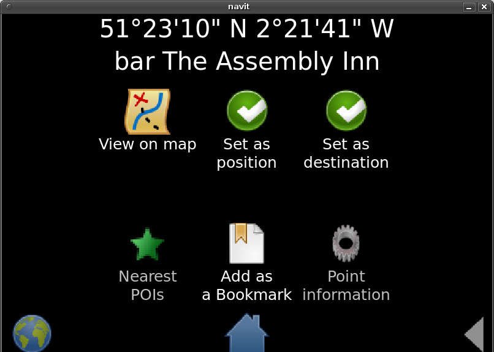

.. _qml_gui:

QML GUI
=======

|Qml_point_20100404.png| The QML GIU is designed to be a modern and
flexible replacement of internal gui. It is based on `Qt's modelling
language UI framework <http://en.wikipedia.org/wiki/QML>`__, therefore
it could be run on any Qt platform, including mobile platforms with
touchscreens etc

.. raw:: mediawiki

   {{warning
   |The QML GUI is currently unmaintained and buggy. So feel free to test it, but be prepared to fix it...
   }}

.. _building_it:

Building it
-----------

.. _install_from_source_or_from_distribution_packages:

Install from source or from distribution packages?
~~~~~~~~~~~~~~~~~~~~~~~~~~~~~~~~~~~~~~~~~~~~~~~~~~

The following instructions are for installing the Qt libraries from
source. On Linux, it is usually easier to install Qt from the package
manager instead. See `Dependencies <Dependencies>`__ for the packages to
install.

.. _download_qt_libraries:

Download Qt libraries
~~~~~~~~~~~~~~~~~~~~~

So you have decided to install from source? Fine.

First of all - you will need the Qt 4 libraries and headers installed.
Navit needs Qt 4.7 or 4.8. This can be downloaded from:

-  http://download.qt.io/archive/qt/
-  download the .tar.gz file

.. _configure_and_build_qt:

Configure and build Qt
~~~~~~~~~~~~~~~~~~~~~~

The following example instructions are for configuring and building Qt
on Ubuntu 10.04. The procedure for your particular device may vary.
Note: The "4.8.0" has to be adjusted depending on the version you
install.

-  Unzip the archive into a folder of your choice. The following example
   has unzipped to ~/src.
-  cd to that folder in a terminal

::

   cd ~/src/qt-everywhere-opensource-src-4.8.0/

-  Configure Qt

::

   ./configure

-  During configure:

   -  Asks what type to use: Commercial or Open Source. Select Open
      Source ('o')
   -  Asks to accept licence: Chose 'yes'

-  Make Qt (this may take a long time: ~5hrs on a netbook)

::

    make 

-  Install Qt

::

    sudo make install 

.. _add_qt_to_your_environment:

Add Qt to your environment
~~~~~~~~~~~~~~~~~~~~~~~~~~

Issue the following commands at a terminal to ensure that Navit can find
Qt:

::

   PATH=/usr/local/Trolltech/Qt-4.8.0/bin:$PATH
   export PATH
   export PKG_CONFIG_PATH=/usr/local/Trolltech/Qt-4.8.0/lib/pkgconfig

.. _build_navit:

Build Navit
~~~~~~~~~~~

Once you have prepared your Qt environment, it's time to build Navit. If
Qt is installed correctly, the CMake build should pick it up and enable
Qt support automatically.

At the script output you should have the following lines:

::

   Enabled   qt_qpainter ( Qt libraries found )
   [...]
   Enabled   qml ( Qt Declarative found )

Both qt_qpainter and qml are required to successfully run the qml GUI.
If those lines are present, do your usual make && make
install/dpkg-buildpackage/your-platform-specific thing.

.. _configuring_navit.xml:

Configuring Navit.xml
---------------------

Right now QML gui is compatible only with qt_qpainter graphics type. I
hope there will be more graphics types in the future, but right now you
have to switch to qt_qpainter:

::

       <graphics type="qt_qpainter"/>

And enable qml gui:

::

       <gui type="qml" enabled="yes"/>

All other gui modules MUST be disabled by setting

::

       enabled="no"

in their configuration stanzas.

.. _configuring_qml_gui:

Configuring QML GUI
-------------------

QML gui doesn't require any special configuration, but it can be tuned.
It supports the following parameters, which go inside the tag (default
values in **bold**). You can have as many of the parameters as you want
in the tag:

fullscreen
~~~~~~~~~~

-  **"0" - Start Navit in windowed mode (default)**
-  "1" - Start Navit in fullscreen mode

Example:

::

    <gui type="qml" enabled="yes" fullscreen="1">

menu_on_map_click
~~~~~~~~~~~~~~~~~

-  "0" - Menu GUI is switched by a command *(not yet implemented)*
-  **"1" - Single click on map will bring up the menu GUI (default)**

Example:

::

    <gui type="qml" enabled="yes" menu_on_map_click="1">
   (A bit useless since this is the default anyway...)

signal_on_map_click
~~~~~~~~~~~~~~~~~~~

-  **"0" - When single clicking on the map, processing to be controlled
   by menu_on_map_click (default)**
-  "1" - When single clicking on the map, send a DBus signal

radius
~~~~~~

This takes a number, which is the distance in kilometres which POI
search will restrict to

-  **"10" - Default POI search radius, in kilometres (default)**

Example:

::

    <gui type="qml" enabled="yes" radius="5">
   (Restrict POI search to a 5km radius)

pitch
~~~~~

This takes a number, which is the angle of the 3D view in degrees with
which Navit should start when in 3D mode.

-  **"20" - Default 3D pitch, in degrees (default)**

lazy
~~~~

-  "0" - When menu GUI is called (such as when single-clicking on the
   map), always show the main menu page
-  **"1" - When menu GUI is called (such as when single-clicking on the
   map), show the menu page which was last used (i.e. remember menu page
   states between calls) (default)**

Example:

::

    <gui type="qml" enabled="yes" lazy="0">

width/height
~~~~~~~~~~~~

This takes a number, which is the desired width/height of the GUI
window, in pixels

-  **width=800 - Default width of GUI window, in pixels (default)**
-  **height=600 - Default height of GUI window, in pixels (default)**

source
~~~~~~

This takes a directory path, pointing to the qml skins.

-  **"NAVIT_SHAREDIR/gui/qml/skins" - Default qml skins directory
   (default)**

Example:

::

    <gui type="qml" enabled="yes" source="/home/netbook/src/navit/navit/gui/qml/skins">
   (Use the full path, not "~/")

skin
~~~~

This takes a string of text, with the name of the skin to use for the
menu GUI. These are defined within the skins folder (see above).

-  **"navit" - Default menu GUI skin (default)**

icon_src
~~~~~~~~

This takes a directory path, pointing to the icons for the menu GUI

-  **"NAVIT_SHAREDIR/xpm/" - Default menu GUI icons directory
   (default)**

.. _using_it:

Using it
--------

I can't give any advices on using this gui, cause it is very flexible by
it's nature, so there could be a lot of variations and customizations on
it, but there are exists some hardcoded things. With click on map (or
touchscreen tap) gui is usually switched on. This behavior could be
controlled by two attributes:

``   * menu_on_map_click - controls whether menu should be called on map click or not``

and

``   * signal_on_map_click - controls whether signal should be sent on map click or usual click processing should be used``

Depending on "lazy" attribute, menu will be reset to point page before
switching to or not, but current point is always updated after click.

.. _redesigning_it:

Redesigning it
--------------

The gui qml skin is just a directory containing qml application of any
kind of complexity (yes, you CAN add twitter client into gui, no problem
at all). Navit requires that qml app must contain two files:

| ``   * main.qml``
| ``   * command.js``

**main.qml** is used as a menu entry page.\ **command.js** is used to
handle a OSD command. Every other aspect of gui structure and desigg is
controlled by you, but gui qml module provides some helper functions.

.. _gui_object:

gui object
----------

Gui qml module injects a 'gui' object into global qml namespace. This
object contains following properties:

| ``   * width - current width of gui's window``
| ``   * height - current height of gui's window``
| ``   * localeName *langName *ctryName - Name of POSIX locale and WIN32 language and country names (READ ONLY)``
| ``   * iconPath - Directory for icons (READ ONLY)``
| ``   * commandFunction - name of a command to execute, see commands section for details (READ ONLY)``

gui object also have some slots:

| ``   * backToMap``
| ``   * pushPage(QString)``
| ``   * popPage()``
| ``   * lengthPage()``

Those slots are related to 'page switch helper'. backToMap switches
between map and gui widget, obviously. The \*Page() slots are more
interesting - pushPage(QString) puts some string value into the stack
and popPage() returns top string from the stach. lengthPage() return
stack's size. This stack could be used for keeping page switching
history, so you 'push' a page when you switch to it and 'pop' a page to
know, where to get back.

.. _proxy_objects:

Proxy objects
-------------

The gui object above is a kind of a **proxy object** Navit is written in
pure C and QML is based on Qt, so there are no direct way of exposing
Navit's data to qml engine, so we have to use proxies between them.
Generic proxy object is based on NGQProxy class

::

   class NGQProxy : public QObject {
       Q_OBJECT;

   public:
       NGQProxy(struct gui_priv* this_,QObject *parent) : QObject(parent);
   public slots:
       //Attribute read/write
       QString getAttr(const QString &attr_name);
       void setAttr(const QString &attr_name, const QString &attr_string);
   };

NGQProxy provides generic setAttr/getAttr functions, that are mediating
between QML and Navit's attributes system. I have to metion specially
here - setAttr will convert "true" and "false" in attr_string variable
to "1" and "0". It's not a bug :-)

NGQProxy inherited by the following classes:

NGQProxySearch
~~~~~~~~~~~~~~

Object of this class is injected into qml namespace as a **search** and
provides access to the Navit's search API.

::

   class NGQProxySearch : public NGQProxy {

       Q_PROPERTY(QString countryName READ countryName WRITE setCountryName NOTIFY countryNameSignal);
       Q_PROPERTY(QString countryISO2 READ countryISO2 WRITE setCountryISO2 NOTIFY countryISO2Signal);
       Q_PROPERTY(QString townName READ townName WRITE setTownName NOTIFY townNameSignal);
       Q_PROPERTY(QString streetName READ streetName WRITE setStreetName NOTIFY streetNameSignal);

       Q_PROPERTY(QString searchContext READ searchContext WRITE setSearchContext);

   public slots:
       void setPointToResult();
       QString searchXml();
   };

To search something, we need to set a

| ``   * 'searchContext' property to one of the search targets: ``\ **``country``**\ ``,``\ **``town``**\ ``,``\ **``street``**\ ``,``\ **``number``**
| ``   * put your query into corresponding *Name property``
| ``   * call searchXML``

the **searchXML** return search result in the following format

::

       <search>
           <item>
               <id></id>
               <name></name>
               <icon></icon>
           </item>
           ....more items here...
       </search>

So it can be easily used with XmlListModel. Search expected to be used
in hierarchical way, that means that you should first select a country,
then city, then street and, finally, house number. You may stop at any
level you want, actually :) Search will work, if you start with some
sub-level, without searching for upper levels, but will react much more
slowly.

NGQProxyGui
~~~~~~~~~~~

Object of this class is injected into qml namespace as a **gui** and
described above.

NGQProxyBookmarks
~~~~~~~~~~~~~~~~~

Object of this class is injected into qml namespace as a **bookmarks**.
This object provides access to the bookmark manager. It have following
slots:

| ``   * getAttrList``
| ``   * AddBookmark(name)``
| ``   * Cut(name)``
| ``   * Copy(name)``
| ``   * Paste(name)``
| ``   * Delete(name)``
| ``   * setPoint(name)``

and single property:

``   * currentPath``

It doesn't provides valid setAttr/getAttr functions! They will always
fail. For AddBookmark/Cut/Copy/Page/Delete/setPoint you MUST specify
full bookmark name, with path, but for Paste just a PATH, without name
part, should be specified. AddBookmark uses coordinates from a current
'point' object (see below) and setPoint sets the current 'point' object
to point in the bookmark. currentPath property used for traversing the
bookmarks tree and positioning in it. getAttrList provides QML namespace
with 'listModel' object of type NGQStandardItemModel (see below) for
bookmarks list view.

NGQProxyNavit
~~~~~~~~~~~~~

Object of this class is injected into qml namespace as a **navit**. This
object provides access to the global navit object. Slots are:

| ``   * quit - quits the Navit immediately``
| ``   * setObjectByName(name,value) - sets the current values of various objects by their name (only 'layout' and 'vehicle' supported right now)``
| ``   * setDestination/setPosition - sets the destination/position to the current point``
| ``   * getAttrList - Proveds QML nameSpaces with 'listModel' object (see below) containing lists of different types of attributes ('layout' and 'vehicle' only at the moment)``

.. _the_current_point_concept:

The current point concept
-------------------------

There are special object 'point' of type NGQPoint that represents a
'current point'. Current point is a point on map (with coordinates and
may be with name and other attributes) which is used by other proxy
objects. So you don't pass the coordinates or something to
navit.setDestination or bookmarks.AddBookmark. You set current point
object to their values and call a function, that processes it. The
current point object is set in following cases:

| ``  * Click on map``
| ``  * navit.getPosition/navit.getDestination call``
| ``  * bookmarks.setPoint call``
| ``  * point.setNewPoint call``

Point could have a type:

::

       enum NGQPointTypes {MapPoint,Bookmark,Position,Destination,PointOfInterest};

which could be used for conditional rendering etc

Point object provides three properties:

| ``   * coordString - Formatted textual representation of point's coordinates.``
| ``   * pointName - Name of a point, either specified during point creation/setting or calculated from map data.``
| ``   * pointType - Name of point's type.``

.. _the_listmodel:

The listModel
-------------

In a few words - listModel is a way to represent list data to qml. It is
a variation of QStandardItemModel, but with several new roles defined:

::

       enum listRoles {ItemId=Qt::UserRole+1,ItemName=Qt::UserRole+2,ItemIcon=Qt::UserRole+3,ItemPath=Qt::UserRole+4};

the listModel is filled by getAttrList call andstored in global QML
namespace. That also means, that you only can use a single list on a
page :-)

Commands
--------

Navit supports scriptable commands, usually found in OSD, but not
limited to and those commands are another one way of user interaction
with gui. Commands are usually defined in a form of a:

::

       object.command(attribute=value,attribute=value,...,attribute=value)

so gui (our object) gets a call from navit to execute a command with
some parameters. In qml gui we delegate execution function to
command.qml which should read the current command from a
gui.commandFunction and execute it somehow. It is designed to be very
flexible, so command to this gui should be in form of:

::

       gui.command(attribute=value)

The internal callback handler reads the function name and stores it in
the gui.commandFunction property, so adding a new command does not
requires a c++ coding.

