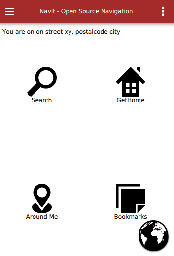

.. _qml2_gui_wip:

QML2 GUI WIP
============

This site is for discussing and decide things on the QML2 UI

Prerequisites
=============

Use only QT 5.7 at the moment

.. _first_look:

First look
==========

   Gui_qml_drawer_popup.gif

Pages
=====

Homepage
--------

| Then you tap the screen, this page comes up.
| Should show:
| Header: "Back to map"
| Content: 4 common actions
| Footer: Shows current position with street name

Search
------

Bookmarks
---------

.. _poi_around_me:

POI around me
-------------

Settings
--------

.. _routing_profile:

Routing Profile
~~~~~~~~~~~~~~~

Map
~~~

Layout
~~~~~~

Personalize
~~~~~~~~~~~

.. _set_home:

Set Home
^^^^^^^^

.. _bookmarks_1:

Bookmarks
^^^^^^^^^

OSD
^^^

.. _search_1:

Search
------

Drawer
======

| the thing on the left side...need input, which should be shown
| POI around Me
| Vehicle

| Settings

Popup
=====

About
-----

Team
----

Colors
======

| ...again google... :\| ...but it shows best. what do you think of it?
| https://material.io/color/#!/?view.left=0&view.right=0&primary.color=FB8C00&secondary.color=42A5F5&secondary.text.color=000000&primary.text.color=000000
| Toolbar:
| Drawer:
| Backgorund for the pages:
| Icons:
