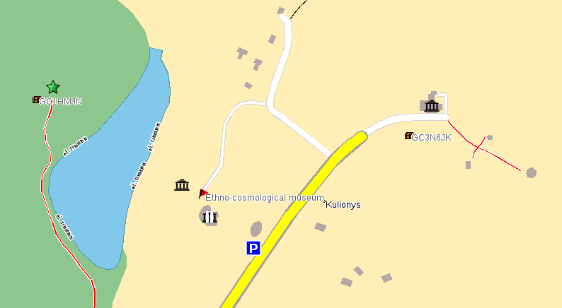

.. _custom_pois:

Custom POIs
===========

   Navit map with custom POI icons (click to enlarge).

Maybe you are interested in making some custom POIs. I was looking for
this feature and couldn't find it for days - this is why I am now
writing this page. This could be useful in the case you need to show
points on a map for your business (clients places, shops, ... ) or for
your free time. On the other hand bookmarks are not shown with an icon
on the map.

.. _define_your_poi:

Define your POI
===============

Navit supports text files to be used. This is like bookmarks, but they
will be used on the map.

First of all, go to your local .navit folder. Create a new file called
my_pois.txt. There you can define your POIs like this:

``mg:8.497582 47.395690 type=poi_custom1 label="andys football field"``

The format is as follows:

``mg:longitude latitude type=poi_customX label="label text"``

This will create a new POI with the type *poi_custom1*. You can use any
type defined in item_def.h
`1 <http://navit.svn.sourceforge.net/viewvc/navit/trunk/navit/navit/item_def.h?view=markup&revision=>`__
- preferably one of the poi_customX types, because it will make it
easier to assign your custom icons, as shown in the next step.

.. _using_a_custom_icon:

Using a custom icon
===================

To display the new type defined in your my_pois.txt file you also need
to define an icon for the new type. This can be done by adding the icon
file names to your my_pois.txt file like this:

``mg:8.497582 47.395690 type=poi_custom1 label="andys football field" icon_src="my_icon1.png"``

You also need to make an icon named my_icon1.png. If you only specify
the file name as in the example above, you need to put it under
/usr/share/navit/xpm/. Alternatively you can also put it somewhere else
and specify an absolute path, like this:

``mg:8.497582 47.395690 type=poi_custom1 label="andys football field" icon_src="/mnt/sdcard/my_icon1.png"``

Another good location would be the .navit folder in your home directory:

``mg:8.497582 47.395690 type=poi_custom1 label="andys football field" icon_src="$HOME/.navit/my_icon1.png"``

This will show your custom icon on the map. If you wish to change at
which zoom levels the icon and its label are shown, you need to edit the
navit.xml in your local .navit folder. There you will find something
like this:

.. code:: xml

   <itemgra item_types="poi_custom0,...,poi_customf" order="10-">
       <icon src="%s" />
   </itemgra>

The order="10-" tells navit to show the icon at zoom level 10 and above.
To show the icon, for example, already from zoom level 4, change it to
order="4-". The line picks the file name for the custom icon, just leave
it unchanged.

In a similar way you can also change at which zoom level the text label
will be shown. You need to change this part of the navit.xml:

.. code:: xml

   <itemgra item_types="poi_custom0,...,poi_customf" order="14-">
       <circle color="#606060" radius="0" width="0" text_size="10"/>
   </itemgra>

Change the order="14-" to a lower number if you wish to see the label at
lower zoom levels.

.. _using_the_poi_file_with_the_map:

Using the POI file with the map
===============================

I am using OSM maps so I added the following line in navit.xml:

.. code:: xml

                   <!-- Mapset template for OpenStreetMap -->
                   <mapset enabled="yes">
                           <map type="binfile" enabled="yes" data="/home/username/.navit/osm_bbox_eu.bin"/>
                           <map type="textfile" enabled="yes" data="/home/username/.navit/my_pois.txt"/>
                   </mapset>

Take care to put your correct username in the above path.

.. _load_pois_via_csv:

Load POIs via CSV
=================

This can be useful to load POIs from a camping guide like Bordatlas or
ADAC Camping Caravaning Führer. Most of them provide the camping sites
mentioned in their books via CSV. To use this feature you need to
compile navit with the parameter *--enable-map-csv*. Have a look at
`CSV <CSV>`__.

But same as above, you can add a custom type to it if you use something
like item_type="poi_custom1" (on the line where you add the CSV to your
mapset).

.. _hard_way:

Hard way
========

Read this section only if you don't hesitate to edit some C code,
`recompile Navit from source <CMake>`__, `rebuild binfile map from osm
data <OpenStreetMap#Convert_OSM_data_to_Navit_binfile>`__, and finally
want your OSM based POI type to be available for others by default.

1. You'll need to use some POI type already defined in item_def.h or add
a new type. To make your changes compatible with mainstream navit,
always add new POI type right before ITEM2(0x7ffffff0,poi_custom0) line.

2. You have to add mapping from OSM attribute set to Navit item type.
That's done in attrmap array of maptool/osm.c. If you want to put POIs
only for point OSM objects, begin your line with letter n (for node). If
you want lines and areas to be converted to POIs too, use a question
mark instead of that letter. Then you should specify OSM attribute-value
pairs which define your POI. Keep in mind, Navit will analyse whole
attrdef array and use only matching entries which have longest
attribute-value chain. As the last element, you should specify Navit POI
type name chosen in the first step.

3. Modify navit.xml or navit_shipped.xml to include your POI type in the
applicable layouts. This is described in the `#Using a custom
icon <#Using_a_custom_icon>`__ section above.

4. Design your own icon in svg format for the new POI type and put it
into the xpm folder of the source tree.

5. Recompile navit and maptool, build new map from raw osm data and test
if it works as expected.

6. If you believe your new POI type should be included in mainstream,
create a ticket on the http://trac.navit-project.org and attach your
patch made with 'svn diff' command together with suggested POI icon.

Sources
=======

http://trac.navit-project.org/ticket/735

http://wiki.navit-project.org/index.php/Other_maps
