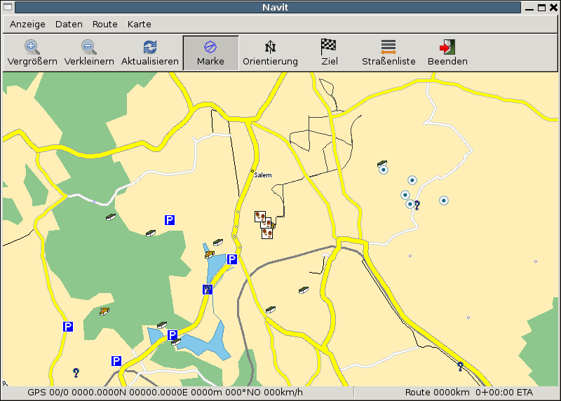

.. _other_maps:

Other maps
==========

.. raw:: mediawiki

   {{merge|Custom POIs}}

.. _poi_as_navit_text_maps:

POI as Navit Text maps
======================

You can display Points of Interest as a Navit map. Therefore was built a
utility called gpx2navit_txt which converts gpx files to navit text
map-Files. It is possible to convert waypoints and tracks.

Insert the text map Files into the navit.xml like this:

| ``        ``\ 
| ``               ``\ 
| ``               ``\ 

and you will get the poi-data on the map.

That will look like this: |POI|

Troubleshooting
===============

If nothing is displayed

| ``* check the area of the map``
| ``* check if the items of the textfile are defined in your 'navit.xml'``
| ``* this is also true for tracks - here it might be that the track is hidden by other objects, check the 'navit.xml'``
| ``* check if the xpm-Files are defined and accessible``

For example imagine:

| ``* in the text-map you converted with 'gpx2navit_txt' is a type='poi_gc_multi' for a Multicache``
| ``* Then the navit symbol will be 'poi_gc_multi' and has to be defined in 'navit.xml' (see for 'example poi_airport')``
| ``* the xpm file (normally under '/usr/local/share/navit/xpm') 'gc_multi.xpm' must be present``
| ``* for track-display the type is 'track' and 'track' must be defined in 'navit.xml'``

If tracks or routes from gpx are not converted

``* error message 'no move recorded' --> use '-f' flag of gpx2navit_txt``

.. _convert_csv_pois_to_navit_format:

Convert CSV POIs to Navit format
================================

Many commercial Navigators use the CVS format for Point of Interest
files.

You can convert them to the navit txt format using a script like these:

.. _bash_version:

Bash version
------------

::

   #!/bin/bash
   # Marco Trevisan (Treviño) -- Copyright 2009
   # Released under the GPLv2 terms.

   csvfile="$1"
   poitxtfile="$PWD/$(basename "$csvfile" .csv).txt"
   poi_type=""

   if [ ! -f "$csvfile" ] || !(echo "$(head "$csvfile" -n1)" | grep -q "[^,]\+,[^,]\+,[^,]\+"); then
       echo "You must provide a valid csv file"
       exit 1
   fi

   rm -f "$poitxtfile"
   echo "Parsing file $csvfile..."
   filelen=$(wc -l "$csvfile"|cut -f1 -d' ')
   linen=1

   while read line; do
       lon=$(echo "$line" | cut -f1 -d',')
       lat=$(echo "$line" | cut -f2 -d',')
       name=$(echo "$line" | cut -f3 -d',')
       
       poi_label="$name"
       poi_desc="$name"
       
       if [ -z "$poi_type" ]; then
           poi_type="poi_attraction"
       fi
       
       echo "type=$poi_type label=\"$poi_label\" description=\"$poi_desc\" gc_type=\"\"" >> $poitxtfile
       echo "$lon $lat" >> $poitxtfile
               
       status="\t$csvfile ($linen/$filelen)"
       if [ $linen -gt 1 ]; then
           for ((k=0; $k < $(expr length "$status"); k++)); do
               echo -n -e "\b"
           done
       fi
       
       if [ $linen != $filelen ]; then
           echo -e -n "$status"
       fi

       linen=$(($linen+1))
   done < "$csvfile"

   echo "POI file saved in $poitxtfile"

.. _python_version:

Python Version
--------------

Much more quick.

::

   #!/usr/bin/python
   # Convert CSV-POI files to Navit
   # Marco Trevisan (3v1n0) -- Copyright 2009
   # Released under the GPLv2 terms.

   import os, sys, re

   poi_type = ""

   csvmatch = re.compile("([^,]+),([^,]+),([^,]+)\n")

   for currentfile in sys.argv[1:]:
       if os.path.exists(currentfile):
           csvfile = open(currentfile, 'r')
           print "Parsing "+currentfile+"..."
           filelen = len(csvfile.readlines())
           linen = 1
           csvfile.seek(0)
           outlist = []

           for line in csvfile:
               cvsparts = re.match(csvmatch, line)
               if cvsparts:
                   lon = cvsparts.group(1)
                   lat = cvsparts.group(2)
                   name = cvsparts.group(3)
                   
                   poi_label = name
                   poi_desc = ""
                   
                   if not poi_type:
                       poi_type = "poi_attraction"
                   
                   outlist.append('type=%s label="%s" description="%s" gc_type=""\n' %
                                                    (poi_type, poi_label, poi_desc))
                   outlist.append("%s %s\n" % (lon, lat))
               
               status = "\t%s (%d/%d)" % (os.path.basename(currentfile), linen, filelen)
               print status,"\r",
               sys.stdout.flush()
               
               linen += 1
           csvfile.close()

           if outlist:
               outfile = os.path.splitext(currentfile)[0]+".txt"
               print "\nWriting output at %s..." % outfile
               gpxfile = open(outfile, 'w')
               gpxfile.writelines(outlist)
               gpxfile.close

.. _gpsbabel_style_file:

GPSBabel style file
-------------------

`GPSBabel <http://gpsbabel.org>`__ is a GPS waypoint, route, and track
data converter.

This style file can be used to build a bookmark file for use with Navit.
Note that this style can **not** be used to **read** a navit file,
because Navit () writes coordinates using hexadecimal and GPSBabel style
files do not seem to support reading hexadecimal. Also, spaces in
waypoint labels are dropped.

::

   # gpsbabel XCSV style file

   DESCRIPTION             Navit bookmarks
   EXTENSION               txt
   DATATYPE                WAYPOINT

   # FILE LAYOUT DEFINITIIONS:
   #
   FIELD_DELIMITER         SPACE
   RECORD_DELIMITER        NEWLINE
   FORMAT_TYPE             INTERNAL
   SHORTLEN                30
   SHORTWHITE              1

   #
   # INDIVIDUAL DATA FIELDS:
   #
   IFIELD  LON_DECIMAL, "", "mg:%f"
   IFIELD  LAT_DECIMAL, "", "%f"
   IFIELD  CONSTANT, "type=bookmark", "%s"
   IFIELD  SHORTNAME, "?", "label="%s""

