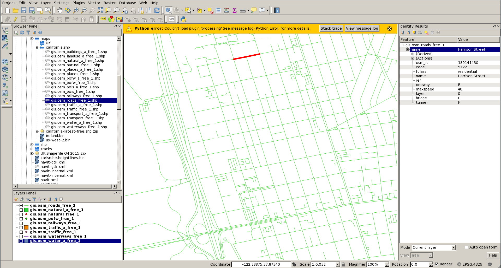
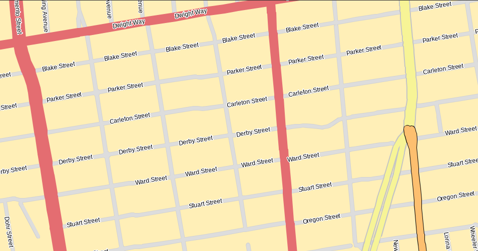

Shapefiles
==========

.. _using_shapefile_maps_directly_in_navit:

Using Shapefile maps directly in Navit
======================================

Is it possible to use shapefile maps directly in Navit. You will need to
create a .dbfmap file to tell Navit how to read your shapefile.

Shapefile usually come as a group of files, each file focusing on one
specific set of feature.

For example, an OpenStreetMap Shapefile export will contain the
following files:

| ``$ ls *.shp``
| ``gis.osm_buildings_a_free_1.shp  gis.osm_pofw_a_free_1.shp    gis.osm_traffic_a_free_1.shp``
| ``gis.osm_landuse_a_free_1.shp    gis.osm_pofw_free_1.shp      gis.osm_traffic_free_1.shp``
| ``gis.osm_natural_a_free_1.shp    gis.osm_pois_a_free_1.shp    gis.osm_transport_a_free_1.shp``
| ``gis.osm_natural_free_1.shp      gis.osm_pois_free_1.shp      gis.osm_transport_free_1.shp``
| ``gis.osm_places_a_free_1.shp     gis.osm_railways_free_1.shp  gis.osm_water_a_free_1.shp``
| ``gis.osm_places_free_1.shp       gis.osm_roads_free_1.shp     gis.osm_waterways_free_1.shp``

For this example we will focus on loading the streets from the
"gis.osm_roads_free_1.shp" file.

Add a mapset to your navit.xml file. Mapsets are defined around line 420
of the default navit.xml

**Note : you need to disable any other mapset that could be already
enabled**

|
| `` ``\
|

**Note : do not include the ".shp" extension** otherwise Navit will
complain with

``error:map_shapefile:VSI_SHP_Error:error:Unable to open maps/shapefile/gis.osm_roads_free_1.shp.shp or maps/shapefile//gis.osm_roads_free_1.shp.SHP.``

Now we need to create the relevant .dbfmap. If you use features from
different files (e.g streets from gis.osm_roads_free_1, water polys from
gis.osm_water_a_free_1 ) then you will need to create one .dbfmap file
for each shp file.

Here is a minimalistic gis.osm_roads_free_1.dbfmap :

| ``code=5111  type=highway_land label=${name}``
| ``code=5112  type=street_1_city label=${name}``
| ``code=5113  type=street_2_city label=${name}``
| ``code=5114  type=street_3_city label=${name}``
| ``code=5115  type=street_4_city label=${name}``
| ``code=5122  type=living_street label=${name}``

**Note : the first field (code, in this example) and the type field must
be separated by a tabulation, not spaces.**

.. _how_can_i_find_the_field_name_and_value_to_use:

How can I find the field name and value to use?
===============================================

The content of your .dbfmap will vary depending of your map source. One
way to analyze shapefile tags is to use QGis

In this example, we are loading again the shapefile from OpenStreetMap.
When displaying the streets, we can select one specific segment and look
at its tag. In this example, we can see the street name is under the
"name" tag (used in label=${name}) and the code=5122 which would
correspond to a "living_street" in Navit. Highlighting several segments
of the same street might help identify which tag ("code" here) and which
value (5122 here) to use.

   Qgis.png

The resulting map would look like this :

   Shapefile.png

This is a minimalistic example, as only some (not all) of the roads are
mapped using our example .dbfmap
