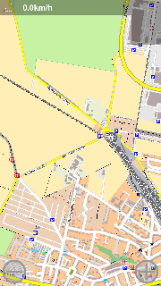
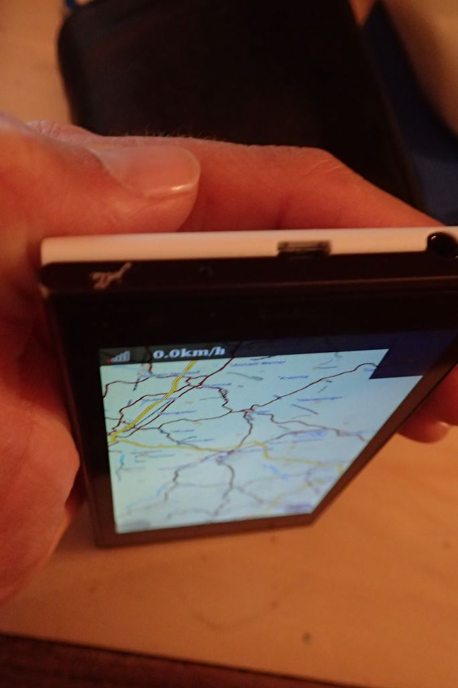
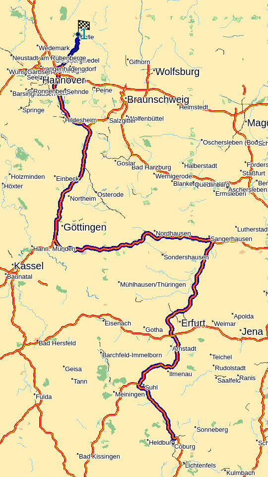
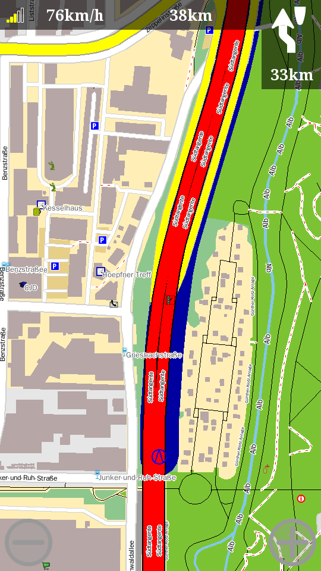
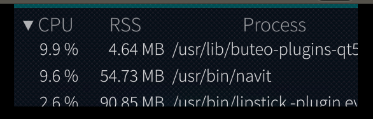

.. _sailfish_os:

Sailfish OS
===========

| **Status:** The app is tested and running on Sailfish OS on Jolla 1.
| This port is still in development stage and needs further testing.

The most up to date Sailfish OS package is provided in an external
repository. But you can also compile latest version easily with the
Sailfish SDK.

.. _installing_ready_compiled_navit_from_openrepos:

Installing ready compiled Navit from openrepos
----------------------------------------------

| https://openrepos.net/content/metalstrolch/navit
| You will find it also in the Warehouse application

.. _compiling_latest_version_from_github:

Compiling latest version from github
------------------------------------

The procedure is tested on Ubuntu 16.04 LTS

.. _sailfishossdk_beta_1611_qt5:

SailfishOSSDK-Beta-1611-Qt5
~~~~~~~~~~~~~~~~~~~~~~~~~~~

I assume, that Sailfish SDK is installed. Virtual machines 'Sailfish
SDK' and 'MerSDK' are running.

.. _step_1___compiling_in_sailfish_sdk:

Step 1 - Compiling in Sailfish SDK
^^^^^^^^^^^^^^^^^^^^^^^^^^^^^^^^^^

| Clone the sources from Github to your home directory
| cd ~

| ``git clone ``\ ```https://github.com/navit-gps/navit.git`` <https://github.com/navit-gps/navit.git>`__\ ``''``

Connect to mer sdk

| ``ssh mersdk@localhost -p 2222 -i ~/SailfishOS/vmshare/ssh/private_keys/engine/mersdk``

| Now, we are logged in the Sailfish SDK.
| Install dependencies
| arm7hl is for installing at your Jolla

| ``sb2 -t SailfishOS-armv7hl -m sdk-install -R zypper in cmake glib2-devel gettext-devel qt5-qtmultimedia-gsttools qt5-qtmultimedia-plugin-mediaservice-gstaudiodecoder qt5-qtmultimedia-plugin-mediaservice-gstcamerabin qt5-qtmultimedia-plugin-mediaservice-gstmediaplayer qt5-qtmultimedia-plugin-resourcepolicy-resourceqt qt5-qtmultimedia-plugin-audio-alsa qt5-qtmultimedia-plugin-playlistformats-m3u qt5-qtmultimedia-plugin-audio-pulseaudio qt5-qtmultimedia-plugin-mediaservice-gstmediacapture''``

i486 is for running in SDK

| ``sb2 -t SailfishOS-i486 -m sdk-install -R zypper in cmake glib2-devel gettext-devel qt5-qtmultimedia-gsttools qt5-qtmultimedia-plugin-mediaservice-gstaudiodecoder qt5-qtmultimedia-plugin-mediaservice-gstcamerabin qt5-qtmultimedia-plugin-mediaservice-gstmediaplayer qt5-qtmultimedia-plugin-resourcepolicy-resourceqt qt5-qtmultimedia-plugin-audio-alsa qt5-qtmultimedia-plugin-playlistformats-m3u qt5-qtmultimedia-plugin-audio-pulseaudio qt5-qtmultimedia-plugin-mediaservice-gstmediacapture''``

| create directory 'rpmbuild' /home/src1/
| mkdir /home/src1/rpmbuild

| go to the directory '/home/src1/navit/contrib/sailfish/' and start the
  building process with
| ./build_on_sailfish_sdk.sh

.. _step_2___copy_the_rpm:

Step 2 - Copy the rpm
~~~~~~~~~~~~~~~~~~~~~

Back to Ubuntu, copy the rpm to SailfishOS Emulator

``scp -P 2223 -i ~/SailfishOS/vmshare/ssh/private_keys/SailfishOS_Emulator/root /home/'username'/rpmbuild/RPMS/i586/harbour-navit-'builtversion'.i586.rpm root@localhost:``

.. _step_3___log_into_sailfishos_emulator:

Step 3 - Log into SailfishOS Emulator
~~~~~~~~~~~~~~~~~~~~~~~~~~~~~~~~~~~~~

``ssh -p 2223 -i ~/SailfishOS/vmshare/ssh/private_keys/SailfishOS_Emulator/root root@localhost''``

.. _step_4___install_navit_in_sailfishos_emulator:

Step 4 - Install Navit in SailfishOS Emulator
~~~~~~~~~~~~~~~~~~~~~~~~~~~~~~~~~~~~~~~~~~~~~

``rpm -i harbour-navit-'builtversion'.i586.rpm``

.. _running_on_jolla_2.0.1.11:

Running on Jolla 2.0.1.11
-------------------------

.. _step_1___copy_the_rpm:

Step 1 - Copy the rpm
~~~~~~~~~~~~~~~~~~~~~

``scp rpmbuild/RPMS/i586/harbour-navit-'builtversion'.armv7hl.rpm nemo@'IP of your device':``

.. _step_2___install_required_libs:

Step 2 - Install required LIBS
~~~~~~~~~~~~~~~~~~~~~~~~~~~~~~

pkcon install gettext

.. _step_3___install_as_root:

Step 3 - Install as root
~~~~~~~~~~~~~~~~~~~~~~~~

devel-su rpm -i navit-'builtversion'-metalstrolch.armv7hl.rpm

.. _screenshots_and_pictures:

Screenshots and pictures
------------------------

Jolla
~~~~~

| Some screenshots with a SailfishOS-like OSD:
| `1 <https://github.com/zintor/navit-jolla-layout/blob/master/screenshots/calculating.png>`__
  `2 <https://github.com/zintor/navit-jolla-layout/blob/master/screenshots/no_destination.png>`__
  `3 <https://github.com/zintor/navit-jolla-layout/blob/master/screenshots/no_driving.png>`__
  `4 <https://github.com/zintor/navit-jolla-layout/blob/master/screenshots/output640.gif>`__

| Some screenshots with pre-shipped OSD:
| |Navit-sailfish-output320.gif| |Jolla_map_withoutGPS_20161014.jpg|
  |Jolla_map2_withoutGPS_20161014.jpg| |Jolla_Routing_20161005.png|
  |Jolla_Navit_Ressourcen.png|

.. _jolla_harbour_validator:

Jolla Harbour Validator
-----------------------

These is the result of the Jolla Harbour Validator tool:

.. _package_name:

Package name
~~~~~~~~~~~~

``PASSED``

.. _rpm_file_name:

RPM file name
~~~~~~~~~~~~~

``PASSED``

.. _qml_files:

QML files
~~~~~~~~~

``PASSED``

.. _desktop_file:

Desktop file
~~~~~~~~~~~~

| ``WARNING [/usr/share/applications/harbour-navit.desktop] X-Nemo-Application-Type should be silica-qt5 (not a Silica app?)``
| ``PASSED``

Paths
~~~~~

| ``INFO [/usr/share/icons/hicolor/[0-9x]{5,9}/apps/harbour-navit.png] All needed icons found!``
| ``ERROR [/usr/share/man/man1/maptool.1.gz] Installation not allowed in this location``
| ``ERROR [/usr/share/man/man1/harbour-navit.1.gz] Installation not allowed in this location``
| ``FAILED``

Libraries
~~~~~~~~~

| ``WARNING [/usr/bin/harbour-navit] file is not stripped!``
| ``PASSED``

Icon
~~~~

``PASSED``

Symbols
~~~~~~~

``PASSED``

Permissions
~~~~~~~~~~~

``PASSED``

Scripts
~~~~~~~

``PASSED``

Provides
~~~~~~~~

``PASSED``

Obsoletes
~~~~~~~~~

``PASSED``

Requires
~~~~~~~~

``PASSED``

Sandboxing
~~~~~~~~~~

``PASSED``

RPATH
~~~~~

| ``INFO [/usr/bin/harbour-navit] rpath in binary is empty!``
| ``OK [rpath in binary seems to be ok: 'empty']``
| ``PASSED``

Architecture
~~~~~~~~~~~~

``PASSED``

.. _vendor_check:

Vendor check
~~~~~~~~~~~~

| ``OK [No vendor set!]``
| `` PASSED``






