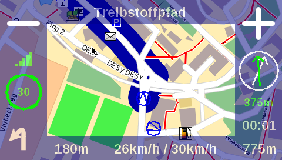

TomTom
======

   Screenshot from a TomTom GO 910 running Navit.

Navit has been successfully ported to TomTom devices. However, the
TomTom port is still experimental and some features do not work properly
yet. This page lists the things that have been done so far and contains
some detailed instructions on cross-compiling Navit and some required
libraries for TomTom Linux. It also contains some setup instructions for
using pre-compiled binaries available at
http://www.navit-project.org/~xenos1984/navitom.tar.gz.

.. _tomtom_hardware:

TomTom hardware
'''''''''''''''

Lots of information on the hardware of various TomTom models has been
collected at `www.opentom.org (trough
archive.org) <https://web.archive.org/web/*/www.opentom.org/Main_Page>`__.
These devices feature an ARM920T or ARM926EJ-S CPU.

.. _gps_and_gps_week_rollover:

GPS and GPS week rollover
~~~~~~~~~~~~~~~~~~~~~~~~~

Devices with SiRFstarIII receiver like Tomtom go 730 work without any
additional driver. They output NMEA messages which can be read directly
by navit. Since GPS week rollover the firmware fail to get a fix after
suspend. Clearing the old ephemeris data bring the firmware to work
again. Use this script to clear the receiver before you start navit.

::

   #! /bin/bash
    
   if [ $# != 1 ]
   then
           echo usage: `basename $0` path_to_nmea_device
           exit
   fi
    
   stty raw 4800 <$1 || exit
   if grep -m 1 GPRMC $1 |grep -q ,,,,,
   then                                
           echo '\r' >$1
           echo '$PSRF101,0,0,0,0,0,0,12,2*16\r' >$1
   fi

On the other hand Devices with Global Hammerhead v1 like Tomtom one XL
have a closed source driver named "gltt" which translates the gps
messages into real NMEA messages.

Also this firmware has such a bug. To get a fix set the date with "date
-s 201907040957" and then call gltt with the option -fix_start cold

Memory
~~~~~~

Nearly all Tomtom Devices feature 32MB of Memory so it is the most
limited resource we have on the device.

.. _rest_of_hardware:

Rest of hardware
~~~~~~~~~~~~~~~~

As shown in the `Hardware Variants table from
opentom.org <https://web.archive.org/web/20130330142227/http://www.opentom.org:80/Hardware_Variants>`__
there are more features that a Tomtom contain which are not relevant for
now.

.. _tomtom_software_options:

Tomtom Software options
'''''''''''''''''''''''

To use navit on a TomTom device you have the following options. As
always in live there are advantages and disadvantages which you can find
below. The table should help you to decide which option is most suitable
for you.

+---------------+----------------+----------------+----------------+
|               | Original       | Plugin         | NavitTom       |
|               |                |                | (custom        |
|               |                |                | embedded       |
|               |                |                | System)        |
+===============+================+================+================+
| Advantages    | -  Works as    | -  Should be   | -  Can use all |
|               |    intended    |    easy to     |    device      |
|               |    (it's the   |    install and |    resources   |
|               |    original,   |    use         | -  we can add  |
|               |    so it's our |                |    things then |
|               |    truth)      |                |    we need     |
|               |                |                |    them        |
+---------------+----------------+----------------+----------------+
| Disadvantages | -  Really      | -  Can not use | -  Not ready   |
|               |    really old  |    all device  |    for prime   |
|               | -  No map      |    resources   |    time        |
|               |    updates     | -  weird       | -  We need to  |
|               |                |    screen      |    take care   |
|               |                |    issues when |    of updates  |
|               |                |    two         | -  can't use   |
|               |                |    softwares   |    up to date  |
|               |                |    are trying  |    Linux       |
|               |                |    to write to |    kernels due |
|               |                |    the frame   |    to display  |
|               |                |    buffer      |    support     |
|               |                |    (navit and  |    (for now)   |
|               |                |    tomtom      |                |
|               |                |    navigation  |                |
|               |                |    at the same |                |
|               |                |    time)       |                |
+---------------+----------------+----------------+----------------+
| Install       | WIP            | WIP            | WIP            |
+---------------+----------------+----------------+----------------+

OLD/WIP
-------

.. _tomtom_gps_settings:

TomTom GPS settings
'''''''''''''''''''

Devices with SiRFstarIII receiver like Tomtom go 730 work with this
setting:

Devices with Global Hammerhead v1 like Tomtom one XL work with this
setting:

In a standalone setup without Tomtom environment Global Hammerhead v1
need a closed source driver named "gltt". It can be extracted from a
original ttsystem file. gltt write to the named pipe /var/run/gpspipe

gltt is called like this sample: gltt -baud 115200 -periodic 1000
-fix_start cold -rftype HH_4L

You can get some informations about used device names in /proc/barcelona
or the built in flash drive.

.. _ram_memory_issues:

RAM memory issues
'''''''''''''''''

Most Tomtom devices like TomTom one XL have only 32MB RAM. Navigation in
cities is almost unusable. Devices with 64MB like Tomtom 730 work with
reduced routing depth like route_depth="4:15%,6:1%,8:10000,18:2000"

It is possible to build a full custom setup with the toolchain from
https://github.com/george-hopkins/opentom With it its possible to
activate swap to SD card. The toolchain is outdated and need several
manual changes to compile.

.. _using_pre_compiled_binaries:

Using pre-compiled binaries
'''''''''''''''''''''''''''

There are some pre-compiled binaries available at
http://www.navit-project.org/~xenos1984/navitom.tar.gz (this link always
points to the most recently compiled version). See
http://www.navit-project.org/~xenos1984/release/ for other / older
versions. I have tested them successfully on a TomTom GO 910. For other
TomTom models, it may be necessary to edit the navit.xml config file and
adjust the screen size, the GPS data source...

In order to use the binaries above, unpack the file in the top directory
of a TomTom device. Get some Navit map and place it in the
navit/share/maps folder on your TomTom. Edit the config file
navit/share/navit.xml as described below. Unplug your TomTom from the
computer and let it reboot. If you touch the screen and enter the TomTom
main menu, you should see a Navit icon (on the last page). Press this
icon and a grey screen will appear. Be patient - it may take a few
seconds. But finally you should see a map. Have fun!

A more recent version (R7045) can be found here
https://1390-30791823-gh.circle-artifacts.com/2/tmp/circle-artifacts.xgv65b2/navitom.zip
It does not provide a config for 320x240 screens but it has translations
and multilingual speech.

See also
''''''''

-  `TomTom development <TomTom_development>`__
