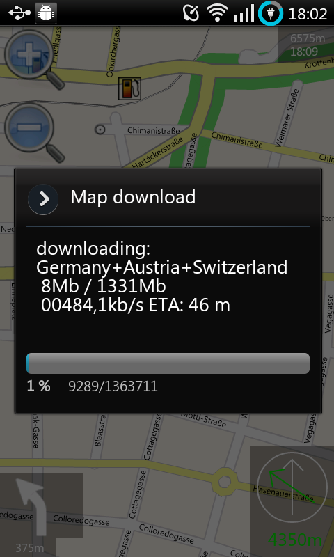
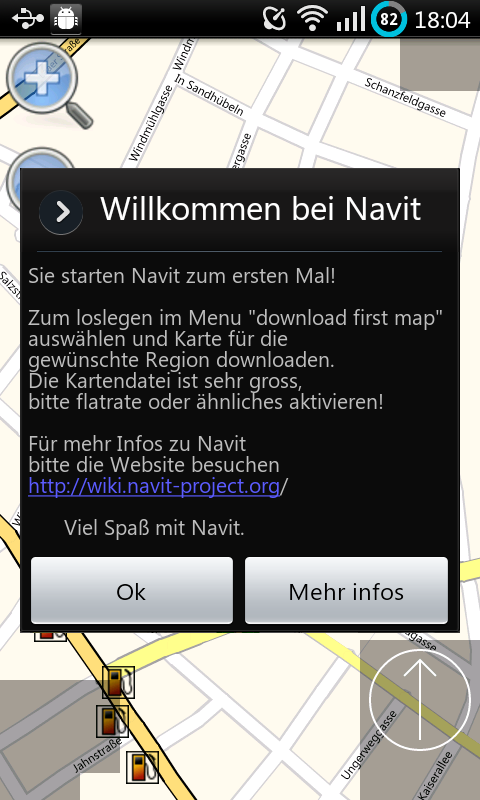

Android
=======

.. raw:: mediawiki

   {{note| [http://bit.ly/15fUtbw Developers wanted!] to maintain this port, the build and implementing new features}}

|First run of Navit| Navit is available on Android! Using the `Internal
GUI <Internal_GUI>`__, Navit enables complete offline routing anywhere
in the world using map data from `OpenStreetMap <OpenStreetMap>`__. Note
that this is not an Android app in the traditional sense - it is a
direct port of Navit (with a couple of extra features for Android), so
isn't as integrated with Android as you may expect from other apps -
bear this in mind when using it for the first time!

Installation
------------

There are several ways of installing Navit to your Android devices:

-  From `Google's Play
   store <https://play.google.com/store/apps/details?id=org.navitproject.navit>`__,
   you can also subscribe to the beta program
   `here <https://play.google.com/apps/testing/org.navitproject.navit>`__
-  Install from the `F-Droid <https://f-droid.org/>`__ Repository :
   `Navit on
   F-Droid <https://f-droid.org/repository/browse/?fdid=org.navitproject.navit>`__''
-  Manually install from apk's built nightly from the latest source code
   : `Nightly
   Builds <http://download.navit-project.org/navit/android/svn/>`__''
-  Building Navit yourself from source : `Build from
   Source <http://wiki.navit-project.org/index.php/Android_development>`__''

Manually installing from an apk means that you have the very latest
features built into Navit, but requires you to install and update it
yourself

The following table links through to the nightly apk's. Choose the one
which best matches your device. The nightly builds are compatible with
devices running Froyo (2.2.X) or later.

.. _important_note:

Important Note
~~~~~~~~~~~~~~

If your phone has internal and external storage, make sure to add
/storage/sdcard# to your path directories. Otherwise navit won't be able
to find them.

+----------------------------------+----------------------------------+
|                                  | Compatible devices               |
+==================================+==================================+
| `ARM                             | ARMv5TE processors, covers most  |
| v5 <http://download.navit-pr     | Android devices including: HTC   |
| oject.org/navit/android/svn/>`__ | Desire Z, Motorola               |
|                                  | Defy/Droid/Milestone, Samsung    |
|                                  | I7500 Galaxy, Samsung Galaxy S2, |
|                                  | Samsung Galaxy Spica i5700,      |
|                                  | Samsung Galaxy S, SE Xperia X10, |
|                                  | Xperia X8, LG Optimus Speed      |
|                                  | (P990)                           |
+----------------------------------+----------------------------------+
| `ARM                             | ARMv4 processors. Devices which  |
| v4                               | require this version include Neo |
| <http://download.navit-project.o | Freerunner (running Android).    |
| rg/navit/android_armv4t/svn/>`__ |                                  |
+----------------------------------+----------------------------------+

.. _compatible_android_devices:

Compatible Android devices
~~~~~~~~~~~~~~~~~~~~~~~~~~

The following tables list Android devices on which Navit has been
tested. Please consider editing the table for your own device.

+----------------+----------------+----------------+----------------+
| Device         | OS             | Status         | Tested on SVN  |
|                |                |                | revision       |
+================+================+================+================+
| Allview P4     |                | running fine   | ICS (market)   |
+----------------+----------------+----------------+----------------+
| Archos 5 IT    |                | running fine   | 4383, 4395,    |
|                |                |                | 4411           |
+----------------+----------------+----------------+----------------+
| Asus Memo pad  | Android 4.2.2  | running fine   | 5851           |
| ME173X         |                |                |                |
+----------------+----------------+----------------+----------------+
| Acer ICONIA    |                | running fine;  | (market)       |
| TAB A500       |                | after suspend  |                |
|                |                | GPS must be    |                |
|                |                | disabled and   |                |
|                |                | enabled again  |                |
+----------------+----------------+----------------+----------------+
| Geeksphone One | RCMod 4.0.0    | Exits on       | 4319           |
|                | (Gingerbread)  | startup        |                |
|                |                | (following     |                |
|                |                | crash of       |                |
|                |                | PicoTTS)       |                |
|                |                | unless speech  |                |
|                |                | output is      |                |
|                |                | disabled, runs |                |
|                |                | fine otherwise |                |
+----------------+----------------+----------------+----------------+
| Geeksphone     | RCMod 7.0.2    | running fine   | (market)       |
| Zero           | (Gingerbread)  |                |                |
+----------------+----------------+----------------+----------------+
| Google/LG      | Android 4.2.2  | running fine,  | 4785 (market), |
| Nexus 4        | and Android    | but not        | 5357-5365      |
|                | 4.3            | possible to    |                |
|                |                | change         |                |
|                |                | k              |                |
|                |                | eyboard-layout |                |
|                |                | to the         |                |
|                |                | stock-android  |                |
|                |                | sof            |                |
|                |                | tware-keyboard |                |
+----------------+----------------+----------------+----------------+
| Google/LG      | Android 4.4    | running fine,  | 4785 (market), |
| Nexus 5        |                | but not        | 5649, 5711     |
|                |                | possible to    |                |
|                |                | change         |                |
|                |                | k              |                |
|                |                | eyboard-layout |                |
|                |                | to the         |                |
|                |                | stock-android  |                |
|                |                | soft           |                |
|                |                | ware-keyboard; |                |
|                |                | fonts to small |                |
+----------------+----------------+----------------+----------------+
| Google/Samsung | Android 4.2.2  | running fine,  | 4785 (market), |
| Galaxy Nexus   | and Android    | but not        | 4909-5365      |
| I9250          | 4.3            | possible to    |                |
|                |                | change         |                |
|                |                | k              |                |
|                |                | eyboard-layout |                |
|                |                | to the         |                |
|                |                | stock-android  |                |
|                |                | sof            |                |
|                |                | tware-keyboard |                |
+----------------+----------------+----------------+----------------+
| Google/Samsung |                | running fine   | (market)       |
| Nexus S        |                | after brief    |                |
|                |                | test           |                |
+----------------+----------------+----------------+----------------+
| Google/Samsung | RCMod 7.2.0    | running fine   | 5187           |
| Nexus S        |                |                |                |
+----------------+----------------+----------------+----------------+
| Huawei Ideos   | Android 2.2    | Sometimes does | 6382           |
| (U8150-B)      |                | not exit       |                |
|                |                | properly       |                |
|                |                | (restarts      |                |
|                |                | instead);      |                |
|                |                | intermittent   |                |
|                |                | issue where    |                |
|                |                | touchpal       |                |
|                |                | keyboard text  |                |
|                |                | is invisible   |                |
|                |                | while typing,  |                |
|                |                | it only shows  |                |
|                |                | after keyboard |                |
|                |                | is dismissed;  |                |
|                |                | otherwise runs |                |
|                |                | fine           |                |
+----------------+----------------+----------------+----------------+
| Huawei Ideos   |                | speech         | 4696           |
| X3 (U8510)     |                | synthesis      |                |
|                |                | often          |                |
|                |                | incomplete     |                |
+----------------+----------------+----------------+----------------+
| Huawei M860    |                | running fine   | 4281           |
+----------------+----------------+----------------+----------------+
| HTC Desire     | CyanogenMod    | DISCONTINUED - | 5877           |
|                | 7.2.0          | last version   |                |
|                |                | testet         |                |
+----------------+----------------+----------------+----------------+
| HTC Desire     | CyanogenMod    | | osd          | 5395-5877      |
|                | 7.2.0          |   gps-status   |                |
|                |                |   doesn't work |                |
|                |                |   - otherwise  |                |
|                |                |   running      |                |
|                |                |   fine, unless |                |
|                |                |   stated below |                |
|                |                | | integration  |                |
|                |                |   of           |                |
|                |                |   "            |                |
|                |                | clever-tanken" |                |
|                |                |   (Germany     |                |
|                |                |   only) testet |                |
|                |                |   and working  |                |
|                |                |   since        |                |
|                |                |   version 5642 |                |
+----------------+----------------+----------------+----------------+
| HTC Desire     | Android 2.2.2  | DISCONTINUED - | 5395           |
|                |                | last version   |                |
|                |                | testet         |                |
+----------------+----------------+----------------+----------------+
| HTC Desire     | Android 2.2.2  | osd gps-status | 4200-5395      |
|                |                | doesn't work - |                |
|                |                | otherwise      |                |
|                |                | running fine,  |                |
|                |                | unless stated  |                |
|                |                | below          |                |
+----------------+----------------+----------------+----------------+
| HTC Desire     | Android 2.2.2  | android        | 5389-5392      |
|                |                | installer      |                |
|                |                | refuses to     |                |
|                |                | install the    |                |
|                |                | apk            |                |
+----------------+----------------+----------------+----------------+
| HTC Desire     | Android 2.2.2  | typing of      | 5296-5329      |
|                |                | adresses       |                |
|                |                | terminates     |                |
|                |                | after 1st      |                |
|                |                | letter         |                |
+----------------+----------------+----------------+----------------+
| HTC Desire     | Android 2.2.2  | display        | 5279           |
|                |                | problems while |                |
|                |                | browsing       |                |
|                |                | bookmarks      |                |
+----------------+----------------+----------------+----------------+
| HTC Desire     | Android 2.2.2  | application    | 5219-5276      |
|                |                | freezes as     |                |
|                |                | soon as route  |                |
|                |                | is calculated  |                |
+----------------+----------------+----------------+----------------+
| HTC Desire     | Android 2.2.2  | crashes during | 5208           |
|                |                | application    |                |
|                |                | start          |                |
+----------------+----------------+----------------+----------------+
| HTC Desire     | Android 2.2.2  | display        | 5175-5179      |
|                |                | remains black  |                |
+----------------+----------------+----------------+----------------+
| HTC Desire     | Android 2.2.2  | application    | 5149-5174      |
|                |                | crashes as     |                |
|                |                | soon as gps    |                |
|                |                | link is        |                |
|                |                | established    |                |
+----------------+----------------+----------------+----------------+
| HTC Desire     | Android 2.2.2  | modifications  | 5078           |
|                |                | for osd        |                |
|                |                | naviga         |                |
|                |                | tion_next_turn |                |
|                |                | in config file |                |
|                |                | necessary      |                |
+----------------+----------------+----------------+----------------+
| HTC Desire     | Android 2.2.2  | starts, icon   | 4879-4992      |
|                |                | appears in the |                |
|                |                | upper left     |                |
|                |                | corner,        |                |
|                |                | application    |                |
|                |                | stops          |                |
+----------------+----------------+----------------+----------------+
| HTC Desire HD  |                | running fine   | (market)       |
| (Ace)          |                |                |                |
+----------------+----------------+----------------+----------------+
| HTC Desire S   |                | running fine   | 4281 (market)  |
+----------------+----------------+----------------+----------------+
| HTC Desire Z   |                | running fine   | 4281 (market), |
|                |                |                | 4785 (market), |
|                |                |                | 4808           |
+----------------+----------------+----------------+----------------+
| HTC Explorer   | Android 2.3.5  | running fine - | 5126           |
| A310e          |                | but GPS status |                |
|                |                | & texte:       |                |
|                |                | label=         |                |
|                |                | "${vehicle.pos |                |
|                |                | ition_sats_use |                |
|                |                | d}/${vehicle.p |                |
|                |                | osition_qual}" |                |
|                |                | do not work -  |                |
|                |                | Route\Height   |                |
|                |                | Profile does   |                |
|                |                | not work too   |                |
|                |                | (black screen) |                |
+----------------+----------------+----------------+----------------+
| HTC Hero       | Android 2.2,   | running fine   | 4118           |
|                | cronos         | (saving        |                |
|                |                | bookmaks made  |                |
|                |                | it unusable)   |                |
+----------------+----------------+----------------+----------------+
| HTC Incredible |                | running fine   | 4281 (market)  |
| S              |                |                |                |
+----------------+----------------+----------------+----------------+
| HTC Magic      | Android 2.3.4  | running fine   | 5224           |
+----------------+----------------+----------------+----------------+
| HTC Sensation  | Android 4.0.3  | running fine   | 4785 (market)  |
+----------------+----------------+----------------+----------------+
| HTC Wildfire   | Android 2.2    | running fine   | 4997           |
|                |                | (theme changes |                |
|                |                | are not saved) |                |
+----------------+----------------+----------------+----------------+
| Intenso Tab    | CyanogenMod    | running fine,  | 5738           |
| 814            | 10.2           | GPS with USB   |                |
|                |                | stick and      |                |
|                |                | usb2gps        |                |
+----------------+----------------+----------------+----------------+
| Lenovo IdeaTab | Android 4.4.2  | Latest version | 6382           |
| A10-70 (A7600) |                | tested         |                |
+----------------+----------------+----------------+----------------+
| Lenovo IdeaTab | Android 4.4.2  | working        | 6255-6382      |
| A10-70 (A7600) |                | perfectly      |                |
+----------------+----------------+----------------+----------------+
| Lenovo IdeaTab | Android 4.4.2  | TTS mixes      | 6093-6095      |
| A10-70 (A7600) |                | English and    |                |
|                |                | System         |                |
|                |                | language. Uses |                |
|                |                | Englisch       |                |
|                |                | grammar        |                |
+----------------+----------------+----------------+----------------+
| Lenovo IdeaTab | Android 4.4.2  | working        | 6084-6089      |
| A10-70 (A7600) |                | perfectly      |                |
+----------------+----------------+----------------+----------------+
| Lenovo IdeaTab | Android 4.4.2  | TTS mixes      | 6054-6080      |
| A10-70 (A7600) |                | English and    |                |
|                |                | System         |                |
|                |                | language.      |                |
|                |                | "Turn links in |                |
|                |                | 200 Metern"    |                |
+----------------+----------------+----------------+----------------+
| Lenovo IdeaTab | Android 4.4.2  | working        | 5976-6050      |
| A10-70 (A7600) |                | perfectly      |                |
+----------------+----------------+----------------+----------------+
| LG G3 (D855)   | Android 5.1    | running fine   | 6135           |
|                | (SlimLP)       |                |                |
+----------------+----------------+----------------+----------------+
| LG Optimus     |                | running fine   | 4118, 4281     |
| GT540          |                |                | (Google        |
|                |                |                | market)        |
+----------------+----------------+----------------+----------------+
| LG Optimus     |                | running fine   | current market |
| P500 One       |                |                | build, 4383,   |
|                |                |                | 4446           |
+----------------+----------------+----------------+----------------+
| Motorola Defy  |                | running fine   | 4281 (market), |
|                |                |                | 4352, 4383     |
+----------------+----------------+----------------+----------------+
| Motorola       |                | running fine   | (market)       |
| Milestone 2    |                |                |                |
+----------------+----------------+----------------+----------------+
| Motorola Xoom  | Android 3.2    | running fine   | (market) →     |
|                |                |                | 0.5.0          |
+----------------+----------------+----------------+----------------+
| Motorola Moto  | Android 4.4.2  | running fine   | F-DROID        |
| G 8GB          |                |                | May2014        |
+----------------+----------------+----------------+----------------+
| Neo Freerunner | AoF Cupcake    | cannot         | 4376           |
|                | 0.2.0          | install,       |                |
|                |                | `              |                |
|                |                | `adb install`` |                |
|                |                | returns        |                |
|                |                | [INSTALL_FAIL  |                |
|                |                | ED_OLDER_SDK]. |                |
|                |                | Is Cupcake no  |                |
|                |                | longer         |                |
|                |                | supported?     |                |
+----------------+----------------+----------------+----------------+
| Neo Freerunner | AoF-SD Froyo   | runs fine; GPS | 4548           |
|                |                | must be        |                |
|                |                | started        |                |
|                |                | manually       |                |
+----------------+----------------+----------------+----------------+
| Neo Freerunner | AoF-SD Froyo   | starts, icon   | 4833           |
|                |                | in left upper  |                |
|                |                | corner,        |                |
|                |                | application    |                |
|                |                | stops          |                |
+----------------+----------------+----------------+----------------+
| OnePlus One    | CyanogenMod    | Latest version | 6382           |
|                | 12.1           | tested         |                |
+----------------+----------------+----------------+----------------+
| OnePlus One    | CyanogenMod    | working        | 6382           |
|                | 12.1           | perfectly      |                |
+----------------+----------------+----------------+----------------+
| OnePlus One    | CyanogenMod 11 | DISCONTINUED - | 6382           |
|                |                | Latest version |                |
|                |                | tested         |                |
+----------------+----------------+----------------+----------------+
| OnePlus One    | CyanogenMod 11 | working        | 6255-6382      |
|                |                | perfectly      |                |
+----------------+----------------+----------------+----------------+
| OnePlus One    | CyanogenMod 11 | TTS mixes      | 6093-6095      |
|                |                | English and    |                |
|                |                | System         |                |
|                |                | language. Uses |                |
|                |                | Englisch       |                |
|                |                | grammar        |                |
+----------------+----------------+----------------+----------------+
| OnePlus One    | CyanogenMod 11 | working        | 6084-6089      |
|                |                | perfectly      |                |
+----------------+----------------+----------------+----------------+
| OnePlus One    | CyanogenMod 11 | TTS mixes      | 6054-6080      |
|                |                | English and    |                |
|                |                | System         |                |
|                |                | language.      |                |
|                |                | "Turn links in |                |
|                |                | 200 Metern"    |                |
+----------------+----------------+----------------+----------------+
| OnePlus One    | CyanogenMod 11 | | local        | 6050           |
|                |                |                |                |
|                |                |  configuration |                |
|                |                |   file path    |                |
|                |                |   $SD          |                |
|                |                | CARD/navit.xml |                |
|                |                |   is no longer |                |
|                |                |   supported    |                |
|                |                | | new          |                |
|                |                |   location:    |                |
|                |                |   $SDCARD/n    |                |
|                |                | avit/navit.xml |                |
|                |                |   as           |                |
|                |                |   documented   |                |
+----------------+----------------+----------------+----------------+
| OnePlus One    | CyanogenMod 11 | working        | 5975-6045      |
|                |                | perfectly      |                |
+----------------+----------------+----------------+----------------+
| OnePlus One    | CyanogenMod 11 | osd gps-status | 5890-5952      |
|                |                | doesn't work - |                |
|                |                | otherwise      |                |
|                |                | running fine   |                |
+----------------+----------------+----------------+----------------+
| OnePlus One    | CyanogenMod 11 | upgrade from   | 5889           |
|                |                | version 5878   |                |
|                |                | failed -       |                |
|                |                | reinstall      |                |
|                |                | necessary      |                |
+----------------+----------------+----------------+----------------+
| OnePlus One    | CyanogenMod 11 | osd gps-status | 5830-5878      |
|                |                | doesn't work - |                |
|                |                | otherwise      |                |
|                |                | running fine   |                |
+----------------+----------------+----------------+----------------+
| Samsung        | Android 2.1    | running fine   | 0.5.0-3828     |
| GT-I5500       | update1        |                |                |
+----------------+----------------+----------------+----------------+
| Samsung Galaxy | Android 2.2.1  | running fine   | svn 4663       |
| Gio GT-S5660   | Froyo          |                |                |
+----------------+----------------+----------------+----------------+
| Samsung Galaxy | Android 2.2.3  | running fine   | svn 4785       |
| Gio GT-S5660   |                |                |                |
+----------------+----------------+----------------+----------------+
| Samsung Galaxy | Android 2.3.6  | running fine   | svn 4997       |
| Gio GT-S5660   |                |                |                |
+----------------+----------------+----------------+----------------+
| Samsung Galaxy | Android 2.3.4  | black screen   | svn 5214       |
| Ace GT-S5830L  |                | then crash     |                |
+----------------+----------------+----------------+----------------+
| Samsung Galaxy |                | running fine   | svn 4183,      |
| S I9000        |                |                | 4229, 4510 -   |
|                |                |                | market         |
|                |                |                | 0.5.0-4281     |
+----------------+----------------+----------------+----------------+
| Samsung Galaxy |                | running fine   | 4940           |
| S2 I9100       |                |                |                |
+----------------+----------------+----------------+----------------+
| Samsung Galaxy | Android 4.1.2  | working        | 6035           |
| S3 mini I8190  |                | perfectly      |                |
+----------------+----------------+----------------+----------------+
| Samsung Galaxy | Android 4.1.2  | osd gps-status | 5400, 5419,    |
| S3 mini I8190  |                | doesn't work - | 5422, 5559,    |
|                |                | otherwise      | 5640, 5742,    |
|                |                | running fine,  | 5771, 5772,    |
|                |                | unless stated  | 5878           |
|                |                | otherwise      |                |
+----------------+----------------+----------------+----------------+
| Samsung Galaxy | AOSP 4.2.2     | running fine   | 5000+,         |
| SIII GT-I9300  |                |                |                |
+----------------+----------------+----------------+----------------+
| Samsung Galaxy | Android 4.2.2  | running fine,  | 5543,          |
| S4             |                | tweaks needed  |                |
|                |                | to             |                |
|                |                | configuration  |                |
|                |                | to get the     |                |
|                |                | screen         |                |
|                |                | elements large |                |
|                |                | enough         |                |
+----------------+----------------+----------------+----------------+
| Samsung Galaxy | Samdroid mod   | running fine   | 4083           |
| Spica I5700    |                |                |                |
+----------------+----------------+----------------+----------------+
| Samsung Galaxy |                | running fine   | 4183           |
| Tab P1000      |                |                |                |
+----------------+----------------+----------------+----------------+
| Samsung Galaxy | Android 8.0    | running fine   | 6382           |
| Tab S3 9.7"    |                |                |                |
+----------------+----------------+----------------+----------------+
| Skytex Skypad  | Android 4.0.3  | device lacks   | 6382           |
| Alpha 2        |                | GPS hardware,  |                |
| (SX-SP715A)    |                | otherwise runs |                |
|                |                | fine           |                |
+----------------+----------------+----------------+----------------+
| Xiaomi One     | MIUI 2.3.5k    | running fine;  | 0.5.0 4929     |
| Plus           |                | GPS to start   |                |
|                |                | manually       |                |
+----------------+----------------+----------------+----------------+
| Xperia X8      |                | running fine   | 0.5.0.4281     |
+----------------+----------------+----------------+----------------+
| Xperia X10     |                | running fine   | ??             |
+----------------+----------------+----------------+----------------+
| ZTE Blade      | Orange San     | running fine   | 4155           |
|                | Francisco      |                |                |
+----------------+----------------+----------------+----------------+

.. _useful_information:

Useful information
------------------

   In-app map downloading

Maps
~~~~

There are two ways to get a map into Navit.

#. Press your device's Menu button, and choose *Download first map*.
   Maps will be greater than 50MB, so it's best to turn on your wifi.
#. Download a map from `the Navit Map
   Extractor <http://maps.navit-project.org/>`__, connect your device to
   your pc, choose *Select to copy files to/from your computer* on the
   device and save the downloaded map as *navitmap.bin* into the *navit*
   folder on your device.

.. _advanced_configuration:

Advanced configuration
~~~~~~~~~~~~~~~~~~~~~~

When Navit starts, a copy of
``/data/data/org.navitproject.navit/share/navit.xml`` matching your
display resolution is extracted from the apk. If you have root
permissions on your device, you can use this file as a starting point
for a customized configuration. Otherwise unzip the apk file and use the
xml file from the subdirectory ``res/raw/`` which matches the display
resolution (ldpi, mdpi or hdpi). You can save your configuration as
``/sdcard/navit/navit.xml`` which is then used instead of the one from
the data directory.

-  If you'd like to configure the initial view of the map (it should
   automatically center on your position if the on-board GPS has a fix)
   change the **<navit center=...** attribute to your home coordinates.

-  See `Configuration <Configuration>`__ for additional settings.

Layouts
~~~~~~~

.. _at_android_layout:

0606.at Android Layout
^^^^^^^^^^^^^^^^^^^^^^

General
'''''''

Description in
`german <http://0606.at/index.php?option=com_content&view=article&id=115:samsung-galaxy-nexus-navit-layoutosd&catid=53:android&Itemid=57>`__
(HDPI and MDPI)

Features
''''''''

-  **automatic navigation and tracking mode:**

   -  tracking mode provides coordinates, altitude, current street
   -  navigation mode shows current street, next street, distance left,
      time left, next street, distance to the next maneuver, route
      indicators, altitude

-  **routing status:** five icons show the current routing status.
-  **switch landscape/portrait mode:** at the moment navit does not
   support automatic switching between portrait and landscape mode.
   Therefore there are included a landscape and a portrait optimized
   layout. Both of them work at every screen orientation. They are
   switchable manually by clicking the Button (see Description below)
-  Optimized Menue (see `Internal_GUI/Menu_configurations#0606.at
   Android
   GUI <Internal_GUI/Menu_configurations#0606.at_Android_GUI>`__)
-  The layouts shown in the screenshots below use the `Mapnik layout
   optimised for small screens, available on this
   wiki <Layout#Mapnik_for_small_screens>`__.

Screenshots
'''''''''''

|0606_osd_screenshot_portrait.png| |0606_osd_screenshot_landscape.png|

Description
'''''''''''

+----------------------------------+----------------------------------+
| \|Symbol                         | Description                      |
+==================================+==================================+
| .. figure:: Symbol_zoomin.png    | zoom in                          |
|    :alt: Symbol_zoomin.png       |                                  |
|                                  |                                  |
|    Symbol_zoomin.png             |                                  |
+----------------------------------+----------------------------------+
| .. figure                        | GPS Accuracy (not the number of  |
| :: 0606_Gui_strength_2_48_48.png | used satellites!)                |
|    :al                           |                                  |
| t: 0606_Gui_strength_2_48_48.png |                                  |
|                                  |                                  |
|    0606_Gui_strength_2_48_48.png |                                  |
+----------------------------------+----------------------------------+
| .. figur                         | **route status:** no destination |
| e:: 0606_Osd_routing_no-dest.png | set/unknown destination          |
|    :a                            |                                  |
| lt: 0606_Osd_routing_no-dest.png |                                  |
|                                  |                                  |
|    0606_Osd_routing_no-dest.png  |                                  |
+----------------------------------+----------------------------------+
| .. figur                         | **route info:** destination ok   |
| e:: 0606_Osd_routing_dest-ok.png |                                  |
|    :a                            |                                  |
| lt: 0606_Osd_routing_dest-ok.png |                                  |
|                                  |                                  |
|    0606_Osd_routing_dest-ok.png  |                                  |
+----------------------------------+----------------------------------+
| .. fi                            | **route info:** calculate route  |
| gure:: 0606_Osd_routing_calc.png |                                  |
|                                  |                                  |
|  :alt: 0606_Osd_routing_calc.png |                                  |
|                                  |                                  |
|    0606_Osd_routing_calc.png     |                                  |
+----------------------------------+----------------------------------+
| .. figure                        | **route info:** no route found   |
| :: 0606_Osd_routing_no-route.png |                                  |
|    :al                           |                                  |
| t: 0606_Osd_routing_no-route.png |                                  |
|                                  |                                  |
|    0606_Osd_routing_no-route.png |                                  |
+----------------------------------+----------------------------------+
| ..                               | **route info:** routing active   |
| figure:: Osd_routing_routing.png |                                  |
|    :alt: Osd_routing_routing.png |                                  |
|                                  |                                  |
|    Osd_routing_routing.png       |                                  |
+----------------------------------+----------------------------------+
| ..                               | switch format landscape <->      |
|  figure:: 0606_Symbol_format.png | portrait                         |
|    :alt: 0606_Symbol_format.png  |                                  |
|                                  |                                  |
|    0606_Symbol_format.png        |                                  |
+----------------------------------+----------------------------------+
| .                                | open menu                        |
| . figure:: 0606_Symbol_menue.png |                                  |
|    :alt: 0606_Symbol_menue.png   |                                  |
|                                  |                                  |
|    0606_Symbol_menue.png         |                                  |
+----------------------------------+----------------------------------+
| .                                | show whole route                 |
| . figure:: 0606_Symbol_route.png |                                  |
|    :alt: 0606_Symbol_route.png   |                                  |
|                                  |                                  |
|    0606_Symbol_route.png         |                                  |
+----------------------------------+----------------------------------+
| ..                               | zoom out                         |
| figure:: 0606_Symbol_zoomout.png |                                  |
|    :alt: 0606_Symbol_zoomout.png |                                  |
|                                  |                                  |
|    0606_Symbol_zoomout.png       |                                  |
+----------------------------------+----------------------------------+
|                                  |                                  |
+----------------------------------+----------------------------------+

Download
''''''''

Package (including OSD, Layout, POI Symbols, navit.xml) for

-  MDPI (e.g. Galaxy II, screens with more than 800x480Px)
   `download <http://develop.0606.at/navit/20120227_navit_ops_800.zip>`__
-  HDPI (e.g. Galaxy Nexus, screens with more than 1280x720Px)
   `download <http://develop.0606.at/navit/20120224_navit_ops.zip>`__

.. _installation_1:

Installation
''''''''''''

-  get a recent version from Navit for Android
-  get the Package (see Download), which fits to your screen resolution,
   copy it as zip file on you phone and extract it there with a
   filemanager in the folder /sdcard/navit
-  Download a map from http://maps.navit-project.org/, rename it to
   navitmap.bin and put it into /sdcard/navit
-  Enjoy!

.. _bugs_todo:

Bugs, ToDo
''''''''''

-  integrate odometer, compass and stopwatch
-  sometimes GPS Status and Routing information are displayed in the
   menu
-  adjust "show whole route" section
-  adjust vehicle cursor

XML
'''

+----------------------------------------------------------------------+
| Layout XML (MDPI)                                                    |
+======================================================================+
| ::                                                                   |
|                                                                      |
|          <!-- Generel -->                                            |
|    <osd name="my_osd_cmdif_3" h="1" w="1"  update_per                |
| iod="2"  enabled="yes" type="cmd_interface" x="-1"  y="-1" command=' |
|    osd[@name=="gps_accuracyp"].src =                                 |
|    vehicle.position_rad                                              |
| ius==0     ? "/sdcard/navit/symbols_800/gui_strength_0_48_48.png" :  |
|    (vehicle.position_radius>0 && vehicle.position_radiu              |
| s<=10     ? "/sdcard/navit/symbols_800/gui_strength_5_48_48.png" :   |
|    (vehicle.position_radius>10 && vehicle.position_radi              |
| us<=20     ? "/sdcard/navit/symbols_800/gui_strength_4_48_48.png" :  |
|    (vehicle.position_radius>20 && vehicle.position_radi              |
| us<=30     ? "/sdcard/navit/symbols_800/gui_strength_3_48_48.png" :  |
|    (vehicle.position_radius>30 && vehicle.position_rad               |
| ius<=40    ? "/sdcard/navit/symbols_800/gui_strength_2_48_48.png" :  |
|    (vehicle.position_radius>40                                       |
| ? "/sdcard/navit/symbols_800/gui_strength_1_48_48.png" : "unhandled" |
|    ))))))                                                            |
|    '  />                                                             |
|    <osd name="my_osd_cmdif_4" h="1" w="1"  update_per                |
| iod="2"  enabled="yes" type="cmd_interface" x="-1"  y="-1" command=' |
|    osd[@name=="gps_accuracyl"].src =                                 |
|    vehicle.position_rad                                              |
| ius==0     ? "/sdcard/navit/symbols_800/gui_strength_0_48_48.png" :  |
|    (vehicle.position_radius>0 && vehicle.position_radiu              |
| s<=10     ? "/sdcard/navit/symbols_800/gui_strength_5_48_48.png" :   |
|    (vehicle.position_radius>10 && vehicle.position_radi              |
| us<=20     ? "/sdcard/navit/symbols_800/gui_strength_4_48_48.png" :  |
|    (vehicle.position_radius>20 && vehicle.position_radi              |
| us<=30     ? "/sdcard/navit/symbols_800/gui_strength_3_48_48.png" :  |
|    (vehicle.position_radius>30 && vehicle.position_rad               |
| ius<=40    ? "/sdcard/navit/symbols_800/gui_strength_2_48_48.png" :  |
|    (vehicle.position_radius>40                                       |
| ? "/sdcard/navit/symbols_800/gui_strength_1_48_48.png" : "unhandled" |
|    ))))))                                                            |
|    '  />                                                             |
|                                                                      |
|    <osd name="my_osd_cmdif_1" h="1" w="1"  update_per                |
| iod="2"  enabled="yes" type="cmd_interface" x="-1"  y="-1" command=' |
|    osd[@name=="icon_route_statusp"].src =                            |
|    route.route_st                                                    |
| atus==1     ? "/sdcard/navit/symbols_800/osd_routing_dest-ok.png" :  |
|    (route.route_sta                                                  |
| tus==0     ? "/sdcard/navit/symbols_800/osd_routing_no-dest.png" :   |
|    (route.route_sta                                                  |
| tus==3     ? "/sdcard/navit/symbols_800/osd_routing_no-route.png" :  |
|    (route.route                                                      |
| _status==5     ? "/sdcard/navit/symbols_800/osd_routing_calc.png" :  |
|    (route.route                                                      |
| _status==13    ? "/sdcard/navit/symbols_800/osd_routing_calc.png" :  |
|    (route.route_st                                                   |
| atus==17    ? "/sdcard/navit/symbols_800/osd_routing_routing.png" :  |
|    (route.route_status==33                                           |
|  ? "/sdcard/navit/symbols_800/osd_routing_routing.png" : "unhandled" |
|    )))))))                                                           |
|    '  />                                                             |
|    <osd name="my_osd_cmdif_5" h="1" w="1"  update_per                |
| iod="2"  enabled="yes" type="cmd_interface" x="-1"  y="-1" command=' |
|    osd[@name=="icon_route_statusl"].src =                            |
|    route.route_st                                                    |
| atus==1     ? "/sdcard/navit/symbols_800/osd_routing_dest-ok.png" :  |
|    (route.route_sta                                                  |
| tus==0     ? "/sdcard/navit/symbols_800/osd_routing_no-dest.png" :   |
|    (route.route_sta                                                  |
| tus==3     ? "/sdcard/navit/symbols_800/osd_routing_no-route.png" :  |
|    (route.route                                                      |
| _status==5     ? "/sdcard/navit/symbols_800/osd_routing_calc.png" :  |
|    (route.route                                                      |
| _status==13    ? "/sdcard/navit/symbols_800/osd_routing_calc.png" :  |
|    (route.route_st                                                   |
| atus==17    ? "/sdcard/navit/symbols_800/osd_routing_routing.png" :  |
|    (route.route_status==33                                           |
|  ? "/sdcard/navit/symbols_800/osd_routing_routing.png" : "unhandled" |
|    )))))))                                                           |
|    '  />                                                             |
|                                                                      |
|                                                                      |
|    <!-- landscape_800-->                                             |
|    <!-- Top Line -->>                                                |
|    <osd enabled="yes"                                                |
|  type="button" x="0" y="0" align="5" w="1196" h="46"  command="" src |
| ="/sdcard/navit/landscape_800/ls_line3.png" osd_configuration="6" /> |
|    <osd enabled="yes" type="text"                                    |
|  label="${navigation.item.street_name} ${navigation.item.street_name |
| _systematic}"  x="110" y="0" w="600" h="57" align="5" background_col |
| or="#00000000" font_size="500" font="Garuda" osd_configuration="6"/> |
|    <osd enabled="yes" type="                                         |
| text" label="${tracking.item.street_name} ${tracking.item.street_nam |
| e_systematic}"  x="69" y="0" w="600" h="57" align="5" background_col |
| or="#00000000" font_size="500" font="Garuda" osd_configuration="6"/> |
|                                                                      |
|    <!-- Menue -->                                                    |
|    <osd enabled="yes" type                                           |
| ="button" x="0" y="0" align="5" w="67" h="1200"  command="" src="/sd |
| card/navit/landscape_800/ls_menue_left.png" osd_configuration="6" /> |
|    <osd enabled="yes                                                 |
| " type="button" x="0" y="0" w="67" h="67" command="zoom_in()" src="/ |
| sdcard/navit/symbols_800/symbol_zoomin.png" osd_configuration="6" /> |
|    <osd enabled="yes" type="button"                                  |
| x="0"  y="-109" w="67" h="67" align="6" command="zoom_out()" src="/s |
| dcard/navit/symbols_800/symbol_zoomout.png" osd_configuration="6" /> |
|    <osd enabled="yes" type="button" x="                              |
| 0"  y="-169" w="67" h="60" align="6" command="zoom_to_route()" src=" |
| /sdcard/navit/symbols_800/symbol_route.png" osd_configuration="6" /> |
|    <osd enabled="yes" type="butto                                    |
| n" x="0"  y="-229" w="67" h="60" align="6" command="gui.menu()" src= |
| "/sdcard/navit/symbols_800/symbol_menue.png" osd_configuration="6"/> |
|    <osd enabled="yes" type="button" x="0"  y="-289" w="67" h="60" al |
| ign="6" command="osd_configuration=osd_configuration>=8?4:16" src="/ |
| sdcard/navit/symbols_800/symbol_format.png" osd_configuration="6" /> |
|    <osd name="gps_accuracyl" enabled="yes" type="butt                |
| on" command="" src="/sdcard/navit/symbols_800/gui_strength_0_48_48.p |
| ng" x="13" y="107"  w="40" h="37" align="5" osd_configuration="6" /> |
|    <osd name="icon_route_statusl" enabled="yes" type="               |
| button" command="" src="/sdcard/navit/symbols_800/osd_routing_no-des |
| t.png" w="61" h="34" align="5" x="3" y="67" osd_configuration="6" /> |
|                                                                      |
|    <!-- Bottom Line -->                                              |
|    <!-- NAV Mode -->                                                 |
|    <osd enabled="yes" type="text" label=                             |
| "eta" x="0" y="-23" w="30" h="23" align="6"   font_size="267" text_c |
| olor="#8d8d8d" background_color="#00000000" osd_configuration="20"/> |
|    <osd enabled="yes" type="text" label="${navigation.item.des       |
| tination_time[arrival]}" x="30" y="-40" w="127" h="47" align="6"   f |
| ont_size="500" background_color="#00000000" osd_configuration="20"/> |
|    <!-- Tracking Mode -->                                            |
|    <osd enabled="yes" type="text" label=                             |
| "pos" x="0" y="-23" w="30" h="23" align="6"   font_size="267" text_c |
| olor="#8d8d8d" background_color="#00000000" osd_configuration="10"/> |
|    <osd enabled="yes" type="text" label="${vehicle.posit             |
| ion_coord_geo[pos_deg]}" x="33" y="-47" w="400" h="47" align="6"   f |
| ont_size="367" background_color="#00000000" osd_configuration="10"/> |
|                                                                      |
|    <osd enabled="yes" type="text" label="                            |
| tl" x="170" y="-23" w="17" h="23" align="6"   font_size="267" text_c |
| olor="#8d8d8d" background_color="#00000000" osd_configuration="20"/> |
|    <osd enabled="yes" type="text" label="${navigation.item.desti     |
| nation_time[remaining]}" x="187" y="-40" w="93" h="47" align="6"   f |
| ont_size="500" background_color="#00000000" osd_configuration="20"/> |
|    <osd enabled="yes" type="text" label="                            |
| dl" x="290" y="-23" w="23" h="23" align="6"   font_size="267" text_c |
| olor="#8d8d8d" background_color="#00000000" osd_configuration="20"/> |
|    <osd enabled="yes" type="text" label="${navigation.item.dest      |
| ination_length[named]}" x="310" y="-40" w="127" h="47" align="6"   f |
| ont_size="500" background_color="#00000000" osd_configuration="20"/> |
|    <osd enabled="yes" type="text" label="                            |
| alt" x="436" y="-23" w="30" h="23" align="6"   font_size="267" text_ |
| color="#8d8d8d" background_color="#00000000" osd_configuration="6"/> |
|    <osd enabled="yes" type="text" label="${                          |
| vehicle.position_height}" x="467" y="-40" w="93" h="47" align="6"    |
| font_size="500" background_color="#00000000" osd_configuration="6"/> |
|    <os                                                               |
| d enabled="yes" type="speed_warner" x="580" y="-42" w="67" h="47" al |
| ign="6" text_color="#ffffff" font_size="500" speed_exceed_limit_offs |
| et="15" speed_exceed_limit_percent="10" announce_on="1" background_c |
| olor="#00000000" label="text_only" align="6" osd_configuration="6"/> |
|    <osd enabled="yes" type="text" label="${vehicle.position_speed    |
| }" x="647" y="-40" w="151" h="47" align="6"   text_color="#ff0000"   |
| font_size="500" background_color="#00000000" osd_configuration="6"/> |
|                                                                      |
|    <osd enabled="yes" type="navigation_next_turn" x=                 |
| "73" y="-247" w="171" h="171" icon_src="/sdcard/navit/symbols_800/%s |
| _wh_96_96.png"  background_color="#00000000" osd_configuration="4"/> |
|                                                                      |
|    <osd enabled="yes" type                                           |
| ="button" x="0" y="-86" align="6" w="1196" h="46"  command="" src="/ |
| sdcard/navit/landscape_800/ls_line2.png" osd_configuration="4" />    |
|                                                                      |
|    <                                                                 |
| osd enabled="yes" type="text" label="${navigation.item[1].length[nam |
| ed]}" x="67" y="-80" font_size="633" w="153" h="46" align="6" text_c |
| olor="#ff0000" background_color="#00000000" osd_configuration="4" /> |
|    <osd enabled="yes" type="t                                        |
| ext" label="${navigation.item[1].street_name} ${navigation.item[1].s |
| treet_name_systematic}" x="233" y="-80" font_size="633" w="700" h="4 |
| 6" align="6" background_color="#00000000" osd_configuration="4"/>    |
|                                                                      |
|    <osd enabled="yes" t                                              |
| ype="button" x="0" y="-40" align="6" w="1196" h="40"  command="" src |
| ="/sdcard/navit/landscape_800/ls_line1.png" osd_configuration="6" /> |
|                                                                      |
|    <!-- Display routing status-->                                    |
|    <!--En                                                            |
| able/Disable routing information depending upon the route status --> |
|                                                                      |
| <osd name="my_osd_cmdif_2" h="1" w="1"  update_period="2"  enabled=" |
| yes" type="cmd_interface" x="-1"  y="-1" command='osd_configuration= |
|    route.route_status==1 && osd_configuration>=8    ? 8 :            |
|    (route.route_status==0 && osd_configuration>=8     ? 8 :          |
|    (route.route_status==3 && osd_configuration>=8    ? 8 :           |
|    (route.route_status==5 && osd_configuration>=8    ? 8 :           |
|    (route.route_status==13 && osd_configuration>=8    ? 8 :          |
|    (route.route_status==17 && osd_configuration>=8    ? 16 :         |
|    (route.route_status==33 && osd_configuration>=8    ? 16 :         |
|    (route.route_status==1 && osd_configuration<8    ? 2 :            |
|    (route.route_status==0 && osd_configuration<8     ? 2 :           |
|    (route.route_status==3 && osd_configuration<8     ? 2 :           |
|    (route.route_status==5 && osd_configuration<8     ? 2 :           |
|    (route.route_status==13 && osd_configuration<8    ? 2 :           |
|    (route.route_status==17 && osd_configuration<8    ? 4 :           |
|    (route.route_status==33 && osd_configuration<8    ? 4 : 1         |
|    )))))))))))))))                                                   |
|    ' />                                                              |
|    <!-- portrait_800 -->                                             |
|    <!--                                                              |
|    <osd enabled="yes" type="button" x="100" y="3" align="5" w="3"    |
|  h="70"  command="" src="/sdcard/navit/androsd/osd_up-spacer.png" /> |
|    <osd enabled="yes" type="button" x="-103" y="3" align="9" w="3"   |
|  h="70"  command="" src="/sdcard/navit/androsd/osd_up-spacer.png" /> |
|    -->                                                               |
|                                                                      |
|    <!-- Top Line -->                                                 |
|    <osd enabled="yes                                                 |
| " type="button" x="0" y="0" align="5" w="1280" h="71"  command="" sr |
| c="/sdcard/navit/portrait_800/p_line5.png" osd_configuration="24" /> |
|    <osd enabled="yes"                                                |
|  type="button" x="0" y="71" align="5" w="1280" h="40"  command="" sr |
| c="/sdcard/navit/portrait_800/p_line4.png" osd_configuration="24" /> |
|    <osd enabled="yes" type="text"                                    |
| label=" ${navigation.item.street_name} ${navigation.item.street_name |
| _systematic}"  x="2" y="65" w="600" h="57" align="5" background_colo |
| r="#00000000" font_size="500" font="Garuda" osd_configuration="16"/> |
|    <osd enabled="yes" type="                                         |
| text" label="${tracking.item.street_name} ${tracking.item.street_nam |
| e_systematic}"  x="2" y="65" w="600" h="57" align="5" background_col |
| or="#00000000" font_size="500" font="Garuda" osd_configuration="8"/> |
|                                                                      |
|    <!-- Menue -->                                                    |
|    <osd enabled="yes" type="button                                   |
| " x="0"  y="2" w="67" h="67" align="5" command="zoom_out()" src="/sd |
| card/navit/symbols_800/symbol_zoomout.png" osd_configuration="24" /> |
|    <osd name="icon_route_statusp" enabled="yes" type="bu             |
| tton" command="" src="/sdcard/navit/symbols_800/osd_routing_no-dest. |
| png" w="61" h="34" align="5" x="72" y="16" osd_configuration="24" /> |
|    <osd name="gps_accuracyp" enabled="yes" type="button              |
| " command="" src="/sdcard/navit/symbols_800/gui_strength_0_48_48.png |
| " x="134" y="17"  w="40" h="37" align="5" osd_configuration="24" />  |
|                                                                      |
|   <osd enabled="yes" type="button" x="-289"  y="7" w="67" h="60" ali |
| gn="9" command="osd_configuration=osd_configuration>=8?4:16" src="/s |
| dcard/navit/symbols_800/symbol_format.png" osd_configuration="24" /> |
|    <osd enabled="yes" type="button                                   |
| " x="-215"  y="7" w="67" h="60" align="9" command="gui.menu()" src=" |
| /sdcard/navit/symbols_800/symbol_menue.png" osd_configuration="24"/> |
|    <osd enabled="yes" type="button" x="-                             |
| 141"  y="7" w="67" h="60" align="9" command="zoom_to_route()" src="/ |
| sdcard/navit/symbols_800/symbol_route.png" osd_configuration="24" /> |
|    <osd enabled="yes" type="butto                                    |
| n" x="-67" y="3" w="67" h="67" align="9" command="zoom_in()" src="/s |
| dcard/navit/symbols_800/symbol_zoomin.png" osd_configuration="24" /> |
|                                                                      |
|    <!-- Bottom Line -->                                              |
|    <osd enabled="yes" type="text" label="a                           |
| lt" x="160" y="-61" w="30" h="23" align="6"   font_size="267" text_c |
| olor="#8d8d8d" background_color="#00000000" osd_configuration="24"/> |
|    <osd enabled="yes" type="text" label="${v                         |
| ehicle.position_height}" x="187" y="-78" w="93" h="47" align="6"   f |
| ont_size="500" background_color="#00000000" osd_configuration="24"/> |
|    <osd                                                              |
| enabled="yes" type="speed_warner" x="-217" y="-80" w="67" h="47" ali |
| gn="6" text_color="#ffffff" font_size="500" speed_exceed_limit_offse |
| t="15" speed_exceed_limit_percent="10" announce_on="1" background_co |
| lor="#00000000" label="text_only" align="8" osd_configuration="24"/> |
|    <osd enabled="yes" type="text" label="${vehicle.position_speed}"  |
|  x="-150" y="-78" w="147" h="47" align="6"   text_color="#ff0000"  f |
| ont_size="500" background_color="#00000000" osd_configuration="24"/> |
|                                                                      |
|    <osd enabled="yes" type="navigation_next_turn" x="                |
| 10" y="-300" w="171" h="171" icon_src="/sdcard/navit/symbols_800/%s_ |
| wh_96_96.png"  background_color="#00000000" osd_configuration="16"/> |
|                                                                      |
|    <                                                                 |
| osd enabled="yes" type="text" label="${navigation.item[1].length[nam |
| ed]}" x="3" y="-78" font_size="500" w="153" h="47" align="6" text_co |
| lor="#ff0000" background_color="#00000000" osd_configuration="16" /> |
|    <osd enabled="yes" type="t                                        |
| ext" label="${navigation.item[1].street_name} ${navigation.item[1].s |
| treet_name_systematic}" x="3" y="-125" font_size="500" w="700" h="47 |
| " align="6" background_color="#00000000" osd_configuration="16"/>    |
|                                                                      |
|    <osd enabled="yes" typ                                            |
| e="button" x="0" y="-123" align="6" w="1280" h="43"  command="" src= |
| "/sdcard/navit/portrait_800/p_line3.png" osd_configuration="16" />   |
|    <osd enabled="yes"                                                |
| type="button" x="0" y="-80" align="6" w="1280" h="80"  command="" sr |
| c="/sdcard/navit/portrait_800/p_line1.png" osd_configuration="24" /> |
+----------------------------------------------------------------------+

+----------------------------------------------------------------------+
| Layout XML (HDPI)                                                    |
+======================================================================+
| ::                                                                   |
|                                                                      |
|    <!-- Generel -->                                                  |
|    <osd name="my_osd_cmdif_3" h="1" w="1"  update_per                |
| iod="2"  enabled="yes" type="cmd_interface" x="-1"  y="-1" command=' |
|    osd[@name=="gps_accuracyp"].src =                                 |
|    vehicle.position                                                  |
| _radius==0     ? "/sdcard/navit/symbols/gui_strength_0_48_48.png" :  |
|    (vehicle.position_radius>0 && vehicle.position_r                  |
| adius<=10     ? "/sdcard/navit/symbols/gui_strength_5_48_48.png" :   |
|    (vehicle.position_radius>10 && vehicle.position_                  |
| radius<=20     ? "/sdcard/navit/symbols/gui_strength_4_48_48.png" :  |
|    (vehicle.position_radius>20 && vehicle.position_                  |
| radius<=30     ? "/sdcard/navit/symbols/gui_strength_3_48_48.png" :  |
|    (vehicle.position_radius>30 && vehicle.position                   |
| _radius<=40    ? "/sdcard/navit/symbols/gui_strength_2_48_48.png" :  |
|    (vehicle.position_radius>40                                       |
|     ? "/sdcard/navit/symbols/gui_strength_1_48_48.png" : "unhandled" |
|    ))))))                                                            |
|    '  />                                                             |
|    <osd name="my_osd_cmdif_4" h="1" w="1"  update_per                |
| iod="2"  enabled="yes" type="cmd_interface" x="-1"  y="-1" command=' |
|    osd[@name=="gps_accuracyl"].src =                                 |
|    vehicle.position                                                  |
| _radius==0     ? "/sdcard/navit/symbols/gui_strength_0_48_48.png" :  |
|    (vehicle.position_radius>0 && vehicle.position_r                  |
| adius<=10     ? "/sdcard/navit/symbols/gui_strength_5_48_48.png" :   |
|    (vehicle.position_radius>10 && vehicle.position_                  |
| radius<=20     ? "/sdcard/navit/symbols/gui_strength_4_48_48.png" :  |
|    (vehicle.position_radius>20 && vehicle.position_                  |
| radius<=30     ? "/sdcard/navit/symbols/gui_strength_3_48_48.png" :  |
|    (vehicle.position_radius>30 && vehicle.position                   |
| _radius<=40    ? "/sdcard/navit/symbols/gui_strength_2_48_48.png" :  |
|    (vehicle.position_radius>40                                       |
|     ? "/sdcard/navit/symbols/gui_strength_1_48_48.png" : "unhandled" |
|    ))))))                                                            |
|    '  />                                                             |
|                                                                      |
|    <osd name="my_osd_cmdif_1" h="1" w="1"  update_per                |
| iod="2"  enabled="yes" type="cmd_interface" x="-1"  y="-1" command=' |
|    osd[@name=="icon_route_statusp"].src =                            |
|    route.rout                                                        |
| e_status==1     ? "/sdcard/navit/symbols/osd_routing_dest-ok.png" :  |
|    (route.route                                                      |
| _status==0     ? "/sdcard/navit/symbols/osd_routing_no-dest.png" :   |
|    (route.route                                                      |
| _status==3     ? "/sdcard/navit/symbols/osd_routing_no-route.png" :  |
|    (route.r                                                          |
| oute_status==5     ? "/sdcard/navit/symbols/osd_routing_calc.png" :  |
|    (route.r                                                          |
| oute_status==13    ? "/sdcard/navit/symbols/osd_routing_calc.png" :  |
|    (route.rout                                                       |
| e_status==17    ? "/sdcard/navit/symbols/osd_routing_routing.png" :  |
|    (route.route_status==3                                            |
| 3    ? "/sdcard/navit/symbols/osd_routing_routing.png" : "unhandled" |
|    )))))))                                                           |
|    '  />                                                             |
|    <osd name="my_osd_cmdif_5" h="1" w="1"  update_per                |
| iod="2"  enabled="yes" type="cmd_interface" x="-1"  y="-1" command=' |
|    osd[@name=="icon_route_statusl"].src =                            |
|    route.rout                                                        |
| e_status==1     ? "/sdcard/navit/symbols/osd_routing_dest-ok.png" :  |
|    (route.route                                                      |
| _status==0     ? "/sdcard/navit/symbols/osd_routing_no-dest.png" :   |
|    (route.route                                                      |
| _status==3     ? "/sdcard/navit/symbols/osd_routing_no-route.png" :  |
|    (route.r                                                          |
| oute_status==5     ? "/sdcard/navit/symbols/osd_routing_calc.png" :  |
|    (route.r                                                          |
| oute_status==13    ? "/sdcard/navit/symbols/osd_routing_calc.png" :  |
|    (route.rout                                                       |
| e_status==17    ? "/sdcard/navit/symbols/osd_routing_routing.png" :  |
|    (route.route_status==3                                            |
| 3    ? "/sdcard/navit/symbols/osd_routing_routing.png" : "unhandled" |
|    )))))))                                                           |
|    '  />                                                             |
|                                                                      |
|                                                                      |
|    <!-- Landscape-->                                                 |
|    <!-- Top Line -->>                                                |
|    <osd enabled="                                                    |
| yes" type="button" x="0" y="0" align="5" w="1196" h="69"  command="" |
|  src="/sdcard/navit/landscape/ls_line3.png" osd_configuration="6" /> |
|    <osd enabled="yes" type="text"                                    |
|  label="${navigation.item.street_name} ${navigation.item.street_name |
| _systematic}"  x="110" y="0" w="800" h="85" align="5" background_col |
| or="#00000000" font_size="750" font="Garuda" osd_configuration="6"/> |
|    <osd enabled="yes" type="t                                        |
| ext" label="${tracking.item.street_name} ${tracking.item.street_name |
| _systematic}"  x="110" y="0" w="800" h="85" align="5" background_col |
| or="#00000000" font_size="750" font="Garuda" osd_configuration="6"/> |
|                                                                      |
|    <!-- Menue -->                                                    |
|    <osd enabled="yes" t                                              |
| ype="button" x="0" y="0" align="5" w="100" h="1200"  command="" src= |
| "/sdcard/navit/landscape/ls_menue_left.png" osd_configuration="6" /> |
|    <osd enabled="y                                                   |
| es" type="button" x="0" y="0" w="100" h="100" command="zoom_in()" sr |
| c="/sdcard/navit/symbols/symbol_zoomin.png" osd_configuration="6" /> |
|    <osd enabled="yes" type="button                                   |
| " x="0"  y="-163" w="100" h="100" align="6" command="zoom_out()" src |
| ="/sdcard/navit/symbols/symbol_zoomout.png" osd_configuration="6" /> |
|    <osd enabled="yes" type="button"                                  |
| x="0"  y="-253" w="100" h="90" align="6" command="zoom_to_route()" s |
| rc="/sdcard/navit/symbols/symbol_route.png" osd_configuration="6" /> |
|    <osd enabled="yes" type="but                                      |
| ton" x="0"  y="-343" w="100" h="100" align="6" command="gui.menu()"  |
| src="/sdcard/navit/symbols/symbol_menue.png" osd_configuration="6"/> |
|    <osd enabled="yes" type="button" x="0"  y="-433" w="100" h="100   |
| " align="6" command="osd_configuration=osd_configuration>=8?4:16" sr |
| c="/sdcard/navit/symbols/symbol_format.png" osd_configuration="6" /> |
|    <osd name="gps_accuracyl" enabled="yes" type="                    |
| button" command="" src="/sdcard/navit/symbols/gui_strength_0_48_48.p |
| ng" x="20" y="156"  w="60" h="55" align="5" osd_configuration="6" /> |
|    <osd name="icon_route_statusl" enabled="yes" typ                  |
| e="button" command="" src="/sdcard/navit/symbols/osd_routing_no-dest |
| .png" w="92" h="51" align="5" x="4" y="100" osd_configuration="6" /> |
|                                                                      |
|    <!-- Bottom Line -->                                              |
|    <!-- NAV Mode -->                                                 |
|    <osd enabled="yes" type="text" label=                             |
| "eta" x="0" y="-35" w="45" h="35" align="6"   font_size="400" text_c |
| olor="#8d8d8d" background_color="#00000000" osd_configuration="20"/> |
|    <osd enabled="yes" type="text" label="${navigation.item.des       |
| tination_time[arrival]}" x="45" y="-60" w="190" h="70" align="6"   f |
| ont_size="750" background_color="#00000000" osd_configuration="20"/> |
|    <!-- Tracking Mode -->                                            |
|    <osd enabled="yes" type="text" label=                             |
| "pos" x="0" y="-35" w="50" h="35" align="6"   font_size="400" text_c |
| olor="#8d8d8d" background_color="#00000000" osd_configuration="10"/> |
|    <osd enabled="yes" type="text" label="${vehicle.posit             |
| ion_coord_geo[pos_deg]}" x="50" y="-67" w="600" h="70" align="6"   f |
| ont_size="550" background_color="#00000000" osd_configuration="10"/> |
|                                                                      |
|    <osd enabled="yes" type="text" label="                            |
| tl" x="255" y="-35" w="25" h="35" align="6"   font_size="400" text_c |
| olor="#8d8d8d" background_color="#00000000" osd_configuration="20"/> |
|    <osd enabled="yes" type="text" label="${navigation.item.destin    |
| ation_time[remaining]}" x="280" y="-60" w="140" h="70" align="6"   f |
| ont_size="750" background_color="#00000000" osd_configuration="20"/> |
|    <osd enabled="yes" type="text" label="                            |
| dl" x="435" y="-35" w="35" h="35" align="6"   font_size="400" text_c |
| olor="#8d8d8d" background_color="#00000000" osd_configuration="20"/> |
|    <osd enabled="yes" type="text" label="${navigation.item.dest      |
| ination_length[named]}" x="465" y="-60" w="190" h="70" align="6"   f |
| ont_size="750" background_color="#00000000" osd_configuration="20"/> |
|    <osd enabled="yes" type="text" label="                            |
| alt" x="655" y="-35" w="45" h="35" align="6"   font_size="400" text_ |
| color="#8d8d8d" background_color="#00000000" osd_configuration="6"/> |
|    <osd enabled="yes" type="text" label="${v                         |
| ehicle.position_height}" x="700" y="-60" w="140" h="70" align="6"    |
| font_size="750" background_color="#00000000" osd_configuration="6"/> |
|    <osd                                                              |
|  enabled="yes" type="speed_warner" x="870" y="-63" w="100" h="70" al |
| ign="6" text_color="#ffffff" font_size="750" speed_exceed_limit_offs |
| et="15" speed_exceed_limit_percent="10" announce_on="1" background_c |
| olor="#00000000" label="text_only" align="6" osd_configuration="6"/> |
|    <osd enabled="yes" type="text" label="${vehicle.position_speed    |
| }" x="970" y="-60" w="226" h="70" align="6"   text_color="#ff0000"   |
| font_size="750" background_color="#00000000" osd_configuration="6"/> |
|                                                                      |
|    <osd enabled="yes" type="navigation_next_turn"                    |
|  x="110" y="-370" w="250" h="250" icon_src="/sdcard/navit/symbols/%s |
| _wh_96_96.png"  background_color="#00000000" osd_configuration="4"/> |
|                                                                      |
|    <osd enabled="yes" t                                              |
| ype="button" x="0" y="-129" align="6" w="1196" h="69"  command="" sr |
| c="/sdcard/navit/landscape/ls_line2.png" osd_configuration="4" />    |
|                                                                      |
|    <os                                                               |
| d enabled="yes" type="text" label="${navigation.item[1].length[named |
| ]}" x="100" y="-121" font_size="950" w="230" h="70" align="6" text_c |
| olor="#ff0000" background_color="#00000000" osd_configuration="4" /> |
|    <osd enabled="yes" type="tex                                      |
| t" label="${navigation.item[1].street_name} ${navigation.item[1].str |
| eet_name_systematic}" x="350" y="-121" font_size="950" w="1050" h="7 |
| 0" align="6" background_color="#00000000" osd_configuration="4"/>    |
|                                                                      |
|    <osd enabled="ye                                                  |
| s" type="button" x="0" y="-60" align="6" w="1196" h="60"  command="" |
|  src="/sdcard/navit/landscape/ls_line1.png" osd_configuration="6" /> |
|                                                                      |
|    <!-- Display routing status-->                                    |
|                                                                      |
|                                                                      |
|                                                                      |
|    <!--En                                                            |
| able/Disable routing information depending upon the route status --> |
|                                                                      |
| <osd name="my_osd_cmdif_2" h="1" w="1"  update_period="2"  enabled=" |
| yes" type="cmd_interface" x="-1"  y="-1" command='osd_configuration= |
|    route.route_status==1 && osd_configuration>=8    ? 8 :            |
|    (route.route_status==0 && osd_configuration>=8     ? 8 :          |
|    (route.route_status==3 && osd_configuration>=8    ? 8 :           |
|    (route.route_status==5 && osd_configuration>=8    ? 8 :           |
|    (route.route_status==13 && osd_configuration>=8    ? 8 :          |
|    (route.route_status==17 && osd_configuration>=8    ? 16 :         |
|    (route.route_status==33 && osd_configuration>=8    ? 16 :         |
|    (route.route_status==1 && osd_configuration<8    ? 2 :            |
|    (route.route_status==0 && osd_configuration<8     ? 2 :           |
|    (route.route_status==3 && osd_configuration<8     ? 2 :           |
|    (route.route_status==5 && osd_configuration<8     ? 2 :           |
|    (route.route_status==13 && osd_configuration<8    ? 2 :           |
|    (route.route_status==17 && osd_configuration<8    ? 4 :           |
|    (route.route_status==33 && osd_configuration<8    ? 4 : 1         |
|    )))))))))))))))                                                   |
|    ' />                                                              |
|                                                                      |
|                                                                      |
|                                                                      |
|    <!-- Portrait -->                                                 |
|    <!--                                                              |
|    <osd enabled="yes" type="button" x="100"!-- FIXME ouve            |
| rture de la recherche, si possible android --> y="3" align="5" w="3" |
|  h="70"  command="" src="/sdcard/navit/androsd/osd_up-spacer.png" /> |
|    <osd enabled="yes"                                                |
|  type="button" x="-103" y="3" align= osd_configuration>=8    ? 16 :  |
|    (route.route_status==33 "9" w="3"                                 |
|  h="70"  command="" src="/sdcard/navit/androsd/osd_up-spacer.png" /> |
|    -->                                                               |
|                                                                      |
|    <!-- Top Line -->                                                 |
|    <osd enabled="                                                    |
| yes" type="button" x="0" y="0" align="5" w="1280" h="106"  command=" |
| " src="/sdcard/navit/portrait/p_line5.png" osd_configuration="24" /> |
|    <osd enabled="y                                                   |
| es" type="button" x="0" y="106" align="5" w="1280" h="60"  command=" |
| " src="/sdcard/navit/portrait/p_line4.png" osd_configuration="24" /> |
|    <osd enabled="yes" type="text"                                    |
| label=" ${navigation.item.street_name} ${navigation.item.street_name |
| _systematic}"  x="5" y="96" w="800" h="85" align="5" background_colo |
| r="#00000000" font_size="750" font="Garuda" osd_configuration="16"/> |
|    <osd enabled="yes" type="                                         |
| text" label="${tracking.item.street_name} ${tracking.item.street_nam |
| e_systematic}"  x="5" y="96" w="800" h="85" align="5" background_col |
| or="#00000000" font_size="750" font="Garuda" osd_configuration="8"/> |
|                                                                      |
|    <!-- Menue -->                                                    |
|    <osd enabled="yes" type="butt                                     |
| on" x="0"  y="3" w="100" h="100" align="5" command="zoom_out()" src= |
| "/sdcard/navit/symbols/symbol_zoomout.png" osd_configuration="24" /> |
|    <osd name="icon_route_statusp" enabled="yes" type=                |
| "button" command="" src="/sdcard/navit/symbols/osd_routing_no-dest.p |
| ng" w="92" h="51" align="5" x="105" y="24" osd_configuration="24" /> |
|    <osd name="gps_accuracyp" enabled="yes" type="bu                  |
| tton" command="" src="/sdcard/navit/symbols/gui_strength_0_48_48.png |
| " x="200" y="23"  w="60" h="55" align="5" osd_configuration="24" />  |
|    <osd enabled="yes" type="button" x="-430"  y="10" w="100" h="100" |
|  align="9" command="osd_configuration=osd_configuration>=8?4:16" src |
| ="/sdcard/navit/symbols/symbol_format.png" osd_configuration="24" /> |
|    <osd enabled="yes" type="butto                                    |
| n" x="-320"  y="10" w="100" h="100" align="9" command="gui.menu()" s |
| rc="/sdcard/navit/symbols/symbol_menue.png" osd_configuration="24"/> |
|    <osd enabled="yes" type="button" x=                               |
| "-210"  y="10" w="100" h="90" align="9" command="zoom_to_route()" sr |
| c="/sdcard/navit/symbols/symbol_route.png" osd_configuration="24" /> |
|    <osd enabled="yes" type="butt                                     |
| on" x="-100" y="3" w="100" h="100" align="9" command="zoom_in()" src |
| ="/sdcard/navit/symbols/symbol_zoomin.png" osd_configuration="24" /> |
|                                                                      |
|    <!-- Bottom Line -->                                              |
|    <osd enabled="yes" type="text" label="a                           |
| lt" x="240" y="-92" w="45" h="35" align="6"   font_size="400" text_c |
| olor="#8d8d8d" background_color="#00000000" osd_configuration="24"/> |
|    <osd enabled="yes" type="text" label="${veh                       |
| icle.position_height}" x="280" y="-117" w="140" h="70" align="6"   f |
| ont_size="750" background_color="#00000000" osd_configuration="24"/> |
|    <osd en                                                           |
| abled="yes" type="speed_warner" x="-325" y="-120" w="100" h="70" ali |
| gn="6" text_color="#ffffff" font_size="750" speed_exceed_limit_offse |
| t="15" speed_exceed_limit_percent="10" announce_on="1" background_co |
| lor="#00000000" label="text_only" align="8" osd_configuration="24"/> |
|    <osd enabled="yes" type="text" label="${vehicle.position_speed}"  |
| x="-225" y="-117" w="220" h="70" align="6"   text_color="#ff0000"  f |
| ont_size="750" background_color="#00000000" osd_configuration="24"/> |
|                                                                      |
|    <osd enabled="yes" type="navigation_next_turn"                    |
|  x="10" y="-450" w="250" h="250" icon_src="/sdcard/navit/symbols/%s_ |
| wh_96_96.png"  background_color="#00000000" osd_configuration="16"/> |
|                                                                      |
|    <o                                                                |
| sd enabled="yes" type="text" label="${navigation.item[1].length[name |
| d]}" x="5" y="-117" font_size="750" w="230" h="70" align="6" text_co |
| lor="#ff0000" background_color="#00000000" osd_configuration="16" /> |
|    <osd enabled="yes" type="te                                       |
| xt" label="${navigation.item[1].street_name} ${navigation.item[1].st |
| reet_name_systematic}" x="5" y="-185" font_size="750" w="1050" h="70 |
| " align="6" background_color="#00000000" osd_configuration="16"/>    |
|                                                                      |
|    <osd enabled="yes"                                                |
|  type="button" x="0" y="-184" align="6" w="1280" h="64"  command=""  |
| src="/sdcard/navit/portrait/p_line3.png" osd_configuration="16" />   |
|    <osd enabled="yes                                                 |
| " type="button" x="0" y="-120" align="6" w="1280" h="120"  command=" |
| " src="/sdcard/navit/portrait/p_line1.png" osd_configuration="24" /> |
+----------------------------------------------------------------------+

.. _hdpi_android_layout:

HDPI Android Layout
^^^^^^^^^^^^^^^^^^^

.. raw:: html

   

|350px|   |image1|

.. raw:: html

   

Minimalistic Layout natively for Android phones. Landscape mode works
too, but isn't that pretty.

Top
'''

left to right:

-  Height

   #. of sats

-  speed
-  distance
-  time remaining
-  current routing status.

.. _routing_status:

Routing status
              

-  blue: destination set
-  black: idle state
-  red: no route found
-  orange: calculating state1
-  yellow: calculating state2
-  green: routing

Buttons
'''''''

-  F: show whole route and turn follow_cursor off
-  A: autozoom on/off
-  3/2: 3:pitch 20, zoom 15, autozoom on, maprefresh set to 1 \|\| 2:
   pitch 0, zoom 40, autzoom off, maprefresh set to 5
-  +
-  -

Bottom
''''''

left to right:

-  distance until turn
-  next maneouvre arrow
-  name of following street.

.. _to_do:

To do
'''''

Switching between follow=1 and follow=5 in the 3d/2d-button does not
work and I don't know why.

.. _download_and_installation:

Download and Installation
'''''''''''''''''''''''''

https://www.dropbox.com/s/olt02ds45wpsecd/androidLayoutAntenna.zip

Unzip the folder and put it in your /sdcard/navit folder. I recommend to
install navit via F-Droid. Maps.xml allows you to easily add and remove
maps. Cursor.xml only includes the cursor and mapnik.xml the map layout.
I added the extra pngs, extract them to your navit folder if you want to
(takes some time).

Layout by antenna

.. _android_layout_800x480:

Android layout 800x480
^^^^^^^^^^^^^^^^^^^^^^

.. figure:: navitArch1.png
   :alt: navitArch1.png

   navitArch1.png

|navitArch2.png| |navitArch3.png|

Android layout designed for Archos 5 IT. It can be used in portrait and
landscape mode. Files for layout are available here
http://depositfiles.com/files/6y0mpbv2p
`1 <http://depositfiles.com/files/6y0mpbv2p>`__ Place all files in
/navit folder on your internal /sdcard

The item showing current speed (left-bottom) is clickable. It changes
osd configuration.

|Carspeed.png| |Compas.png| |Down.png| |Minus2.png| |Next.png|
|Odom.png| |Plus2.png| |Poioff.png| |Trid.png| |Upp.png|

+----------------------------------------------------------------------+
| Layout XML                                                           |
+======================================================================+
| ::                                                                   |
|                                                                      |
|    <xml>                                                             |
|    <!--Common -->                                                    |
|            <osd enabled="yes" type="text" label=                     |
| "${vehicle.position_speed[value]}" x="0" y="-49" w="112" h="50" back |
| ground_color="#00000000" align="0" font_size="800" text_color="#ffff |
| ff" command="osd_configuration=osd_configuration==2?1:2"  />         |
|            <osd enabled="yes                                         |
| " type="button" x="0" y="-50" w="114" h="54"   src="/sdcard/navit/Ca |
| rspeed.png" command="osd_configuration=osd_configuration==2?1:2"  /> |
|                                                                      |
|    <!-- Layout 2 -->                                                 |
|            <osd type="button" src="/sdcard/navit/Plus2.png           |
| "   x="-106" y="54"   command="zoom_in()"  osd_configuration="1"  /> |
|            <osd type="button" src="/sdcard/nav                       |
| it/Trid.png"   x="-106" y="54"  command="pitch=pitch==0?25:0;autozoo |
| m_active=pitch==0?0:1;osd_configuration=1"  osd_configuration="2" /> |
|            <osd type="button" src="/sdcard/navit/Minus2.p            |
| ng"  x="-106" y="170" command="zoom_out()" osd_configuration="1"  /> |
|            <osd type="button" src="/sdca                             |
| rd/navit/Poioff.png" x="-106" y="286" command="toggle_layer(&quot;po |
| lygons&quot;);toggle_layer(&quot;POI Symbols&quot;);toggle_layer(&qu |
| ot;POI Labels&quot;);osd_configuration=1" osd_configuration="2"  />  |
|            <osd type                                                 |
| ="button" src="/sdcard/navit/Compas.png"   x="-106" y="170" command= |
| "radius=orientation==-1?1:30;tracking=orientation==-1?0:1;orientatio |
| n=orientation==-1?0:-1;osd_configuration=1" osd_configuration="2" /> |
|                                                                      |
|                                                                      |
|    <!--Layout 1       -->                                            |
|            <osd type="navigation_ne                                  |
| xt_turn" x="15" y="56" w="96" h="96" icon_src="/sdcard/navit/xpm/%s_ |
| wh_96_96.png"  background_color="#00000000" osd_configuration="1" /> |
|            <osd type="text" label="${navigation.item[1].length[val   |
| ue]}" x="7" y="162" w="109" h="60" font_size="800" text_color="#f872 |
| 28" align="0"  background_color="#00000000" osd_configuration="1" /> |
|            <osd type="text" label="${navigat                         |
| ion.item[1].length[unit]}" x="108" y="175" w="30" h="40" font_size=" |
| 230" align="6" background_color="#00000000" osd_configuration="1" /> |
|        text>Eigene Ziele    <osd enabled="yes" type="navi            |
| gation_next_turn" x="0" y="48" w="135" h="170"   icon_src="/sdcard/n |
| avit/Next.png" background_color="#00000000" osd_configuration="1" /> |
|                                                                      |
|            <osd enabled="yes" type="navigation_next_turn" x=         |
| "1" y="-130" w="32" h="40"   icon_src="/sdcard/navit/nav_destination |
| _wh_32_32.png"  background_color="#00000000" osd_configuration="1"/> |
|            <osd type="text" label="${navigation.item.d               |
| estination_length[value]}" x="32" y="-130" w="56" h="40" font_size=" |
| 370" align="2"  background_color="#00000000" osd_configuration="1"/> |
|            <osd type="text" label="${navigation.item.                |
| destination_length[unit]}" x="88" y="-130" w="22" h="40" font_size=" |
| 230" align="6"  background_color="#00000000" osd_configuration="1"/> |
|            <osd enabled="yes" type="navi                             |
| gation_next_turn" x="1" y="-90" w="34" h="40"   icon_src="/sdcard/na |
| vit/clock.png"  background_color="#00000000" osd_configuration="1"/> |
|            <osd type="text" label="${navigation.item.de              |
| stination_time[remaining]}" x="34" y="-90" w="76" h="40" font_size=" |
| 370" align="4"  background_color="#00000000" osd_configuration="1"/> |
|            <osd enabled="yes" type="naviga                           |
| tion_next_turn" x="0" y="-130" w="114" h="84"   icon_src="/sdcard/na |
| vit/Odom.png"  background_color="#00000000" osd_configuration="1" /> |
|                                                                      |
|            <osd enabled="yes" type                                   |
| ="speed_warner" w="98" h="98" x="-104" y="-150" background_color="#0 |
| 0000000" font_size="600" speed_exceed_limit_offset="15" speed_exceed |
| _limit_percent="15" announce_on="1" osd_configuration="1" />         |
|            <osd enabled="yes" type="butt                             |
| on" x="-103" y="-149" w="96" h="96" src="/sdcard/navit/speed_white.p |
| ng" command="" background_color="#00000000" osd_configuration="1" /> |
|                                                                      |
|            <osd enabled="yes" ty                                     |
| pe="text" label="${navigation.item[1].street_name} ${navigation.item |
| [1].street_name_systematic}" x="0" y="0" w="480" h="50" font_size="4 |
| 20" align="8" background_color="#00000000" osd_configuration="1"  /> |
|            <osd enabled="yes" type="na                               |
| vigation_next_turn" x="0" y="0" w="480" h="50"   icon_src="/sdcard/n |
| avit/Upp.png"  background_color="#00000000" osd_configuration="1" /> |
|                                                                      |
|            <osd enabled="yes"                                        |
|  type="text" label="${navigation.item.street_name} ${navigation.item |
| .street_name_systematic}" x="112" y="-30" w="372" h="35" font_size=" |
| 315" align="0" background_color="#00000000" osd_configuration="1" /> |
|            <osd enabled="yes" type="navigat                          |
| ion_next_turn" x="112" y="-30" w="372" h="35"   icon_src="/sdcard/na |
| vit/Down.png"  background_color="#00000000" osd_configuration="1" /> |
|                                                                      |
|    <!--Unsorted -->                                                  |
|            <osd enabled="no" type="com                               |
| pass" x="25" y="0"  w="430" h="430" background_color="#00000000" />  |
|    <xml/>                                                            |
+----------------------------------------------------------------------+

.. _an_other_android_layout_800x480:

An other android layout 800x480
^^^^^^^^^^^^^^^^^^^^^^^^^^^^^^^

|androidLayout800x480_H.png| |androidLayout800x480_V.png|

An android layout for 800x480 device. It can be used in portrait and
landscape mode

Description :

-  On top, distance to destination and arrival time
-  On left bottom, next direction
-  On bottom : next street
-  On right bottom : speed en speed limit (with speed warning)
-  The radar warning appears on the left of speed (!!! UNTESTED !!!)

Download :

-  http://download.tuxfamily.org/jopen/navit/androidOSD.zip (content xml
   layout, png images and svg image (inskcape file).

+----------------------------------------------------------------------+
| Layout XML                                                           |
+======================================================================+
| ::                                                                   |
|                                                                      |
|            <!--- TOP -->                                             |
|            <osd x="0"  y="O"  w="180" h="40" enabled="ye             |
| s" type="image" src="/sdcard/navit/top.png" osd_configuration="1" /> |
|            <!-- FIXME afficher calcul en cours ... -->               |
|            <!-- FIXME                                                |
| ne s'affiche pas --><osd x="0" y="0" w="38" h="38" enabled="yes" typ |
| e="gps_status" background_color="#00000000" osd_configuration="1" /> |
|            <osd x="-50" y="0" w="350" h="40" typ                     |
| e="text" font_size="600" align="8" label="${navit.messages}" osd_con |
| figuration="1" background_color="#00000000" osd_configuration="1" /> |
|            <!-- FIXME ouverture de la recherche,                     |
|  si possible android --><osd x="-370" y="2" w="40" h="40" type="butt |
| on" command="gui.town()" src="/sdcard/navit/arrival.png" font_size=" |
| 400" align="4" background_color="#00000000" osd_configuration="1" /> |
|            <osd x="-400" y="0" w="400" h="40" type="tex              |
| t" font_size="600" align="8" label="${navigation.item.destination_le |
| ngth[named]} / ${navigation.item.destination_time[arrival]}" osd_con |
| figuration="1" background_color="#00000000" osd_configuration="1" /> |
|                                                                      |
|            <!--- LEFT BOTTOM -->                                     |
|            <osd x="0"  y="-155"  w="800" h="155" enabled="yes" type= |
| "image" src="/sdcard/navit/left_bottom.png" osd_configuration="1" /> |
|            <osd x="0" y="-155" w="160" h="                           |
| 115" type="navigation_next_turn" icon_src="%s_wh_59_59.png" osd_conf |
| iguration="1" background_color="#00000000"  osd_configuration="1" /> |
|            <osd x="0" y="-40" w="                                    |
| 160" h="40" type="text" label="${navigation.item[1].length[named]}"  |
| font_size="600" background_color="#00000000" osd_configuration="1"/> |
|            <osd x="1                                                 |
| 60" y="-40" w="640" h="40" align="4" type="text" label="${navigation |
| .item[1].street_name_systematic} ${navigation.item[1].street_name}"  |
| font_size="400" background_color="#00000000" osd_configuration="1"/> |
|                                                                      |
|            <!-- RIGHT BOTTOM -->                                     |
|                                                                      |
|        <osd x="-160"  y="-155" w="160" h="112" enabled="yes" type="i |
| mage" src="/sdcard/navit/right_bottom.png"  osd_configuration="1" /> |
|            <osd x="-160"  y="-120" w="90"  h="77" enabled="y         |
| es" type="text" font_size="600" align="8" label="${vehicle.position_ |
| speed[value]}" background_color="#00000000" osd_configuration="1" /> |
|            <osd x="-70"   y="-120" w="70"  h="77" ena                |
| bled="yes" type="text" label="${tracking.item.route_speed[value]}" f |
| ont_size="500" background_color="#00000000" osd_configuration="1" /> |
|            <osd x="-70"   y="-117" w="                               |
| 70"  h="70" enabled="yes" type="speed_warner" font_size="500" text-c |
| olor="#FF0000" background_color="#00000000" osd_configuration="1" /> |
|            <!-- FIXME                                                |
|  --><osd x="-317"  y="-155" w="157" h="112" enabled="yes" type="spee |
| d_cam" label="${camera_type}\n${distance}" announce_on="1" font_size |
| ="600" text_color="#FFFFFF" background_color="#FF0000FF" align="8"/> |
|                                                                      |
|            <!--- ZOOM -->                                            |
|            <osd x="-85" y="43" w="85"  h="85" type="button" src="/s  |
| dcard/navit/zoom_up.png" command="zoom_in()" osd_configuration="1"/> |
|            <osd x="0" y="43" w="85"  h="85" type="button" src="/sdca |
| rd/navit/zoom_down.png" command="zoom_out()" osd_configuration="1"/> |
+----------------------------------------------------------------------+

.. raw:: html

   

Keyboard
~~~~~~~~

By default Navit uses the Internal keyboard for menu items which require
text input from the user, such as POI search. To use your default
Android keyboard instead, just press and hold your device's Menu button
until the keyboard pops up.

.. _launch_via_google:

Launch via Google
~~~~~~~~~~~~~~~~~

When you click on a place in Google Maps, you can choose to navigate to
it with Navit (assuming that there isn't already a default navigation
app set).

.. _bookmarks_file:

Bookmarks file
~~~~~~~~~~~~~~

The *bookmark.txt* file is stored on the device at the location

``/data/data/org.navitproject.navit/share/bookmark.txt``

and each line in the file looks like

``mg:0x112233 0x445566 type=bookmark label="Home" path="Home"``

In the default configuration, you will need root access on your device
to be able to see this file. But if you move the app to your SD card it
will be available at /sdcard/navit, where you may use any file explorer
app or access it from a PC using USB Storage mode, via either USB cable
or wifi connection, or even Bluetooth file transfer.

Another way without the need of SD card or root access is using the
`Android Debug
Bridge <http://developer.android.com/guide/developing/tools/adb.html>`__.
If you installed the `Android
SDK <http://developer.android.com/sdk/index.html>`__ on your computer,
the following command transfers the bookmark.txt file from your device
to the current working directory:

``adb pull /data/data/org.navitproject.navit/share/bookmark.txt``

It is also possible to transfer the changed file back to your device by
using *adb push*. See
`2 <http://developer.android.com/guide/developing/tools/adb.html#copyfiles>`__
for a more detailed description of the adb client.

There is another option, which doesn't need your Android device to be
rooted, nor ADB. You just need to have SSHDroid installed. Start it and
connect to it with ssh (on windows you can use putty) and then do a cd
/data/data/org.navitproject.navit/share/ from the comfort of your
keyboard equipped machine. You can then read the bookmarks.txt file (if
need be just cat it to display, then copy/paste or whatever, and cat
text back into it or what not). Note that you can also get to the right
location with terminal apps, so there may be plenty of ways to actually
get at this file without root and/or adb.

.. _get_the_log_for_debugging_problems:

Get the log for debugging problems
~~~~~~~~~~~~~~~~~~~~~~~~~~~~~~~~~~

There are two options here:

-  Install the `Android
   SDK <http://developer.android.com/sdk/index.html>`__, run *adb
   logcat* and save the output to a file
-  Install an app like `Log
   Collector <https://play.google.com/store/apps/details?id=com.xtralogic.android.logcollector>`__
   and send the data via mail

.. _see_also:

See also
--------

-  `Android development <Android_development>`__

.. |0606_osd_screenshot_portrait.png| image:: 0606_osd_screenshot_portrait.png
.. |0606_osd_screenshot_landscape.png| image:: 0606_osd_screenshot_landscape.png
.. |350px| image:: AndroidAntenna2D.png
.. |image1| image:: AndroidAntenna.png
.. |navitArch2.png| image:: navitArch2.png
.. |navitArch3.png| image:: navitArch3.png
.. |Carspeed.png| image:: Carspeed.png
.. |Compas.png| image:: Compas.png
.. |Down.png| image:: Down.png
.. |Minus2.png| image:: Minus2.png
.. |Next.png| image:: Next.png
.. |Odom.png| image:: Odom.png
.. |Plus2.png| image:: Plus2.png
.. |Poioff.png| image:: Poioff.png
.. |Trid.png| image:: Trid.png
.. |Upp.png| image:: Upp.png
.. |androidLayout800x480_H.png| image:: androidLayout800x480_H.png
   :width: 360px
.. |androidLayout800x480_V.png| image:: androidLayout800x480_V.png
   :width: 140px
