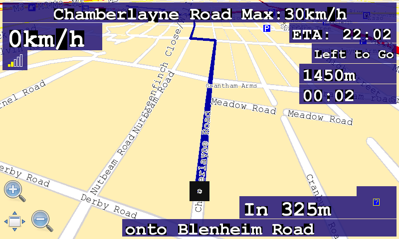
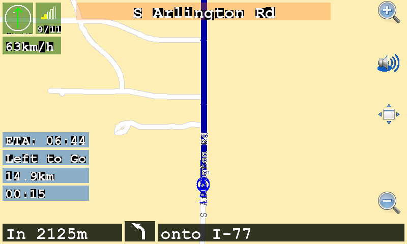
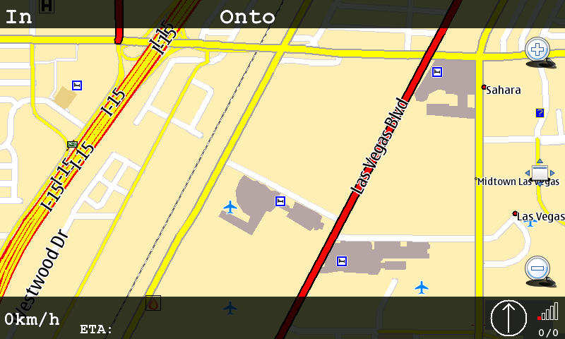
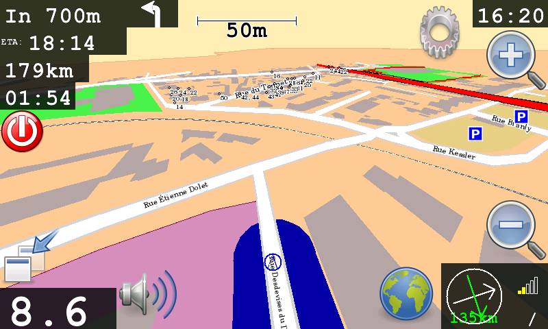

Maemo
=====

.. raw:: mediawiki

   {{note|Currently we don't provide an official Maemo build!}}

`320px|thumb|Navit on Maemo <image:GuiInternalWithMapOnMaemo.png>`__

| The following instructions are a basic translation of this german
  tutorial `1 <http://ccc.zerties.org/index.php/Navit_auf_n900>`__.
| This requires an up to date Maemo device, by following the
  instructions over here: `N900 - The perfect
  setup <http://wiki.maemo.org/N900_The_Perfect_Setup>`__.

Install
-------

The most up to date maemo package is provided in an external repository.
Thus, you need to add it via the application manager:

::

   Name: navit bokomoko
   URL: http://bokomoko.de/~rd/maemo
   Distribution: unstable/
   Components:

After refreshing the application catalogues, you can install it using
the application manager (pay attention, that it now should be a SVN
version and not just the offical old 0.0.2)

Dont forget about the additional packages, to use all features:

::

   librsvg2-2
   librsvg2-common
   espeak

.. _map_download:

Map download
------------

You need to get `OpenStreetMap <OpenStreetMap>`__ packages for map
support. Place them for example in a navit folder at your SD card.

Configuration
-------------

Copy /etc/navit/navit.xml to /home/user/.navit/navit.xml and adapt this
file below the home directory.

This basically follows the `Configuration <Configuration>`__
instructions. But there are a few platform specific changes nessesary:

-  
-  
-  

old
---

.. _general_instructions:

General instructions
~~~~~~~~~~~~~~~~~~~~

#. Install Navit. There are various sources:

   #. Navit on
      `Maemo.org <http://maemo.org/downloads/product/OS2008/navit/>`__
      with
      `point-and-click-installer <http://maemo.org/downloads/product/raw/OS2008/navit/?get_installfile>`__
      (this will add a repository on the tablet this keeping you updated
      with the newest versions).
   #. The deb packages also can be downloaded via the `download
      section <http://download.navit-project.org/navit/n800/svn/>`__ of
      navit-project.org
   #. Navit requests the file libcrypto.so.0.9.7, but an up to date N810
      uses the updated version 0.9.8. To use Navit, you need to make a
      symlink like this:
      ln /usr/lib/libcrypto.so.0.9.8 /usr/lib/libcrypto.so.0.9.7

#. Get maps:

   #. For European users, `Marco Polo Grosser
      Reiseplaner <Marco_Polo_Grosser_Reiseplaner>`__ could be a choice,
      as the project will gain a little income from your purchase.
   #. `openstreetmap <http://openstreetmap.org>`__ is a community
      driven, wiki like world map. There are several sources where you
      can download `Navit maps based on openstreetmap
      data <OpenStreetMap>`__.
   #. It is possible to use Garmin maps

#. Configure Navit by editing its XML configuration file, e.g. in xTerm:

   #. Search for the file navit.xml as superuser root
   #. Create a folder called ``.navit`` in your user directory
   #. Copy navit.xml there and edit it
   #. Replace the path to the map file to fit your device and
      configuration:

.. code:: xml

    <mapset enabled="yes">
       <map type="binfile" enabled="yes" data="/media/mmc2/map/planet.bin"/>
    </mapset>

.. _example_navit.xml:

Example Navit.xml
~~~~~~~~~~~~~~~~~

If you would like to use a navit.xml and navitOSD.xml file that is
pre-configured for the Nokia Tablets you can download the two files
below. Place both of these files in your "/home/user/.navit" directory.
Note that this navit.xml file is setup to read any of your map files
located in "/media/mmc1/Maps/". If your map files are located somewhere
else then you will have to modify the navit.xml file to point to the
location of your maps.

`navit.xml <http://www.barkmunchers.com/navit/navit.xml>`__ Config file
that includes larger font sizes.

`navit.xml <https://docs.google.com/open?id=0B8-rxrBBCBKuYmM3YTJlNzAtMDRmNi00MDdiLTllMmYtZmZjMDkwMTUwYzk1>`__
Modified version of above config file with much larger font sizes,
easier to see car-dark (night) mode, defaults to 3D mode with autozoom.

`navitOSD.xml <http://www.barkmunchers.com/navit/navitOSD.xml>`__ OSD
Config file that will provide you with the OSD interface like example
three on this page.

Note that you may have to right click on the links above and select
"save as". Web browsers tend to display xml files but you need to
download it, not display it.

To copy these files to the ".navit" directory you will need to first
place these two files onto one of your memory cards. For the example
below it is assumed that the files were placed on the root directory of
your internal memory card (/media/mmc1/). Then you must open a terminal
and type the following:

.. code:: bash

    cd /home/user
    mkdir .navit
    cd .navit
    cp /media/mmc1/navit.xml /home/user/.navit/navit.xml
    cp /media/mmc1/navitOSD.xml /home/user/.navit/navitOSD.xml

Again, this navit.xml file assums that your map file is located in
"/media/mmc1/map/". When you open Navit for the first time you will
likely be presented with a blank screen. To get Navit to center on your
position you can either wait until you get a GPS fix or you can tap on
the screen, press "Actions" and then "Town". Type in the name of a town
that should be contained within your map data. When your town name
appears in the list, click on it. This will bring up a sub menu from
which you should be able to select "View on Map".

For information on the internal gui using the above example files refer
to `Internal GUI <Internal_GUI>`__

.. _keep_display_lit:

Keep Display Lit
~~~~~~~~~~~~~~~~

At this time Navit does not offer a method for keeping the display lit
while moving. The best way to work around this is to change the display
settings on the tablet itself so it stays lit while charging. Then
purchase a small car adapter to keep the tablet charged while in the car
and the display will stay lit while driving. It is also recommended to
get a car adapter because using the GPS receiver will generally drain
the batteries faster.

Note that some car adapters might be able to provide enough power to run
the tablet but not necessarily enough to charge the battery. The tablet
will think it's being charged and the display will stay lit but it will
either take a long time to charge the battery or the battery might not
charge at all. When purchasing a charger ensure that it is rated to
deliver the same power as the wall adapter to avoid this situation.

.. _compiling_navit_from_source:

Compiling Navit from source
~~~~~~~~~~~~~~~~~~~~~~~~~~~

Some of us are not content with using pre-compiled packages. Here then
are links to building Navit from source using Scratchbox and
OpenEmbedded/bitbake:

#. `OpenEmbedded development <OpenEmbedded_development>`__
#. `Scratchbox development <Scratchbox_development>`__

.. _configuration_options:

Configuration options
~~~~~~~~~~~~~~~~~~~~~

-  Navit offers several GUIs. If you are not pleased with the GTK GUI,
   maybe you want to use the "internal" GUI. You can switch it on via
   the navit.xml configuration file.

The n810 for driving is best used with the internal GUI. it is not
entirely obvious how to configure the OSD options required to show
information. The way to configure navit changed in Navit svn1979 The
below is an example of laying out the information on an n810

.. code:: xml

    <osd enabled="yes" type="text" label="${vehicle.position_speed}" x="5" y="46" font_size="800"
       w="200" h="55" align="4" background_color="#1b0877cc"/>
    <osd enabled="yes" type="text" label="ETA: ${navigation.item.destination_time[arrival]}" x="-220"
       y="46" font_size="500" w="215" h="40" align="4" background_color="#1b0877cc"/> 
    <osd enabled="yes" type="text" label="Left to Go" x="-175" y="87" font_size="400" w="170" h="40"
       align="4" background_color="#1b0877cc"/>
    <osd enabled="yes" type="text" label="${navigation.item.destination_length[named]}" x="-200" y="128"
       font_size="550" w="195" h="40" align="4" background_color="#1b0877cc"/>
    <osd enabled="yes" type="text" label="${navigation.item.destination_time[remaining]}" x="-200"
       y="169" font_size="550" w="195" h="40" align="4" background_color="#1b0877cc"/>
    <osd enabled="yes" type="text" label="In ${navigation.item[1].length[named]} " x="-320" y="-86"
       font_size="650" w="235" h="45" align="4" background_color="#1b0877cc"/> 
    <osd enabled="yes" type="navigation_next_turn" x="-85" y="-106" font_size="500" w="80" h="65"
       background_color="#1b0877cc"/>  
    <osd enabled="yes" type="text" label="onto ${navigation.item[1].street_name}" x="-555" y="-40"
       font_size="550" w="550" h="35" align="4" background_color="#1b0877cc"/>
    <osd enabled="yes" type="text" label="${navigation.item.street_name} 
       Max:${tracking.item.route_speed}" x="5" y="5" align="0" background_color="#1b0877cc" font_size="550"
       w="790" h="40"/>    
    <osd enabled="yes" type="gps_status" x="5" y="101" w="50" h="40" background_color="#1b0877cc"/>
    <osd enabled="yes"  type="button" x="5" y="-120" command="zoom_in()" src="gui_zoom_in.png"/>
    <osd enabled="yes"  type="button" x="60" y="-60" command="zoom_out()" src="gui_zoom_out.png"/> 
    <osd enabled="yes"  type="button" x="5" y="-60" command="gui.fullscreen()" src="gui_fullscreen.png"/>
    <osd enabled="no" type="speed_warner" x="-60" y="180" w="60" h="60"/> 
    <osd enabled="no" type="button" x="0" y="0" command="gui_internal_menu" src="menu.xpm"/>

gives: |Screenshot-2009-02-06-21-59-28.png|

Note the above linewraps are added to make it display nicely, but you'll
want each osd items as a single line in the navit.xml file The important
settings are w (width) and h (height) which allow you to set the boxes
big enough to then use a large font. I'm using 550 point to be able to
comfortably read the information whilst I'm driving. Also this layout
only looks right full screen.

The new style has type="text" which are effectively free text fields
that understand \\n for newline and a number of variables which get
switched for information values. eg
${navigation.item.destination_time[arrival]} shows the time at which you
are expected to arrive at destination. All the text is added for my own
preference as a first pass. Please add additional layout variations that
you'd like to share.

To make updating this item easier, and maybe sharing different OSD
setups easier you can replace the OSD entries in navit.xml with:

.. code:: xml

    <xi:include href="/home/user/.navit/navitOSD.xml"/>

Then you can create a new file navitOSD.xml in which you place all the
OSD items. This means you can create and share layouts by providing just
the navitOSD.xml file and people can drop them into place without having
to hand edit their navit.xml files. The same trick will work for any
subset part of the navit.xml file

I'll try to update this when I figure out new settings, and keep it
showing a reasonable setup for the n810

---Daniel Would

Here's another option with each item in its' own text box. The layout
also works without overlaping when in windowed mode.

.. code:: xml

    <osd enabled="yes" type="compass" x="5" y="5" font_size="250" w="60" h="62" background_color="#48852faf"/>
    <osd enabled="yes" type="gps_status" x="70" y="5" w="50" h="40" background_color="#48852faf"/>
    <osd enabled="yes" type="text" label="${vehicle.position_sats_signal}/${vehicle.position_qual}" x="70"
       y="45" font_size="300" w="50" h="22" align="0" background_color="#48852faf"/>
    <osd enabled="yes" type="text" label="${vehicle.position_speed}" x="5" y="72" font_size="400" w="115"
       h="35" align="4" background_color="#48852faf"/>
    <osd enabled="yes" type="text" label="ETA: ${navigation.item.destination_time[arrival]}" x="5" y="-220"
       font_size="400" w="170" h="30" align="4" background_color="#1a6ad780"/>
    <osd enabled="yes" type="text" label="Left to Go" x="5" y="-185" font_size="400" w="170" h="30" align="4"
    background_color="#1a6ad780"/>
    <osd enabled="yes" type="text" label="${navigation.item.destination_length[named]}" x="5" y="-150" 
       font_size="400" w="170" h="30" align="4" background_color="#1a6ad780"/>
    <osd enabled="yes" type="text" label="${navigation.item.destination_time[remaining]}" x="5" y="-115" 
       font_size="400" w="170" h="30" align="4" background_color="#1a6ad780"/>
    <osd enabled="yes" type="text" label="In ${navigation.item[1].length[named]} " x="5" y="-40" 
       font_size="500" w="235" h="35" align="4" background_color="#000000c8"/>
    <osd enabled="yes" type="navigation_next_turn" x="245" y="-45" font_size="500" w="60" h="40"
       background_color="#000000c8"/>
    <osd enabled="yes" type="text" label="onto ${navigation.item[1].street_name}" x="310" y="-40"
       font_size="500" w="485" h="35" align="4" background_color="#000000c8"/>
    <osd enabled="yes" type="text" label="${navigation.item.street_name}" x="150" y="5"  font_size="500"
       w="500" h="35" align="0" background_color="#ff71004b"/> 
    <osd enabled="yes" type="button" x="-60" y="0" command="zoom_in()" src="gui_zoom_in.png"/>
    <osd enabled="yes" type="toggle_announcer" x="-65" y="95" w="60" h="60" background_color="#1a6ad700"/>
    <osd enabled="yes" type="button" x="-60" y="200" command="gui.fullscreen()" src="gui_fullscreen.png"/>
    <osd enabled="yes" type="button" x="-60" y="-105" command="zoom_out()" src="gui_zoom_out.png"/> 

gives:|osd2.png|

This gives a nice display with (to me) similar information grouped by
color. However, the text can be difficult to read, so I have changed all
the background colors to 000000c8. Very readable and still slightly
transparent.

The speaker icon is to toggle the announcer on/off (color is 00000000,
transparent), but isn't working at this time.

I am also using some changes suggested by Daniel Would which change the
navigation to same size as the street, and place the blue line on top of
the street.

---lemmyslender

Here is a third option. This is designed for full screen mode but will
work okay in windowed mode with some minor overlap of the compass. Note
that the text sizes for all map labels was increased by 4 points to make
the street names easier to read on the tablet. To accomplish this please
reference the following link `Configuration <Configuration>`__. The link
also shows how you can change the font types used for labels for easier
reading.

.. code:: xml

    <osd enabled="yes" type="compass" x="-110" y="-60" font_size="250" w="60" h="60" background_color="#000000c8"/>
    <osd enabled="yes" type="gps_status" x="-50" y="-60" w="50" h="40" background_color="#000000c8"/>
    <osd enabled="yes" type="text" label="${vehicle.position_sats_signal}/${vehicle.position_qual}" x="-50" y="-20" 
       font_size="250" w="50" h="20" align="0" background_color="#000000c8"/>
    <osd enabled="yes" type="text" label="${vehicle.position_speed}" x="0" y="-60" font_size="400" w="110" h="60" 
       align="4" background_color="#000000c8"/>
    <osd enabled="yes" type="text" label="ETA: ${navigation.item.destination_time[arrival]}" x="110" y="-30" 
       font_size="300" w="170" h="30" align="4" background_color="#000000c8"/>
    <osd enabled="yes" type="text" label="${navigation.item.destination_length[named]}" x="280" y="-30" 
       font_size="300" w="170" h="30" align="4" background_color="#000000c8"/>
    <osd enabled="yes" type="text" label="${navigation.item.destination_time[remaining]}" x="450" y="-30" 
       font_size="300" w="240" h="30" align="4" background_color="#000000c8"/>
    <osd enabled="yes" type="text" label="In ${navigation.item[1].length[named]} " x="0" y="0" font_size="500" 
       w="245" h="40" align="4" background_color="#000000c8"/>
    <osd enabled="yes" type="navigation_next_turn" x="245" y="0" font_size="500" w="60" h="40" background_color="#000000c8" 
       icon_src="$NAVIT_SHAREDIR/xpm/%s_wh_48_48.png" />
    <osd enabled="yes" type="text" label="Onto ${navigation.item[1].street_name}" x="305" y="0" font_size="500" 
       w="495" h="40" align="4" background_color="#000000c8"/>
    <osd enabled="yes" type="text" label="${navigation.item.street_name}" x="110" y="-60"  font_size="500" 
       w="580" h="30" align="0" background_color="#000000c8"/>
    <osd enabled="yes" type="button" x="-60" y="50" command="zoom_in()" src="gui_zoom_in.png"/>
    <osd enabled="yes" type="toggle_announcer" x="-65" y="130" w="60" h="60" background_color="#1a6ad700"/>
    <osd enabled="yes" type="button" x="-60" y="220" command="gui.fullscreen()" src="gui_fullscreen.png"/>
    <osd enabled="yes" type="button" x="-60" y="-120" command="zoom_out()" src="gui_zoom_out.png"/>

gives:|N810-OSD-Home.png|

---SLAM-ER

.. _n900_instructions:

N900 instructions
~~~~~~~~~~~~~~~~~

Download
`this <http://talk.maemo.org/attachment.php?attachmentid=31222&d=1362222041>`__,
unzip it to ~.navit/ and everything should work (you only need to
download some maps and either edit maps.xml or name them as I named
them). Note that to test speaking, you need GPS lock first. You may want
to made adjustments to the setup, look around this wiki and have a look
at this `maemo forum
thread <http://talk.maemo.org/showthread.php?p=1253609>`__.

gives:|N900-OSD.png|

`Sup <User:Sup>`__ (`talk <User_talk:Sup>`__) 16:41, 9 January 2013
(CET)

.. _icon_source_setting_for_osd:

Icon source setting for OSD
~~~~~~~~~~~~~~~~~~~~~~~~~~~

The N8x0 platform (and possibly others) is not very supportive of .svg
image files. Navit on the other hand relies heavily on svg. The result
is often missing images from your display. In the examples above you may
need to replace the .svg with .png. The solution for Next Turn is to use
the following config addition:

.. code:: xml

    <osd enabled="yes" type="navigation_next_turn" x="325" y="-135" w="150" h="100" align="15" 
    background_color="#a60c0f00" icon_src="$NAVIT_SHAREDIR/xpm/%s_wh_48_48.png" />

Note the icon_src parameter specifies the template for the image file
names. This should work for all OSD items.

.. _using_tracks:

Using Tracks
~~~~~~~~~~~~

-  It is possible to make Navit recording and displaying a track. First
   let Navit record the track in the vehicle section, then add the
   resulting file to the mapset section:

.. code:: xml

   <log type="textfile" data="/home/user/.navit/tracks/ActiveLog.txt" flush_size="1000" overwrite="30" />
   ...
   <map type="textfile" enabled="yes" data="/home/user/.navit/tracks/ActiveLog.txt"/>

.. _using_navit:

Using Navit
~~~~~~~~~~~

If everything went fine, Navit can be started from the menu and you
should see the map on the display. In the upper panel of the tablet, you
should see a satellite icon with a green tail, indicating that your
device has a GPS fix. If so, Navit should show your current position on
the map.

.. _starting_gpsd_manually:

Starting GPSd manually
~~~~~~~~~~~~~~~~~~~~~~

Navit does not necessarily start the GPS subsystem (driver and gpsd) on
the Tablet. Therefore you need to do this by starting another
application (Map, Gpxview) which is capable of starting it. This "helper
application" needs to run as long as you want to use Navit.

As of SVN 1843 (Dec 19, 2008) Navit for N800 will autostart gpsd if your
GPS BT receiver is on. For N810 this will work with the internal GPS
receiver as well.

.. _starting_gpsd_automatically:

Starting GPSd automatically
~~~~~~~~~~~~~~~~~~~~~~~~~~~

Some additional details (Nov 28, 2008): I spent an evening getting Navit
working on my N800, here are what else you need to do on Diablo with a
Bluetooth GPS

#. Install bluez-utils-test, have to get this from a Chinook repository
   for now
#. Follow the instructions here
   `2 <http://maemo.org/community/oldwiki/bluetoothgps/>`__

As of SVN 1843 (Dec 19, 2008) Navit for N8x0 will autostart gpsd for
you, at least on the device itself. If you are running Navit under
Scratchbox then you will need to get gps data from somewhere. On the
ARMEL target, there does not seem to be a way to connect to ``gpsd``
running elsewhere. If running under the X86 target, running ``gpsd``
under your native OS will allow gps data to get to Navit.

Notes
~~~~~

-  The navit project has a project page on the maemo garage site,
   https://garage.maemo.org/projects/navit/. But we are considering
   discontinuing this as it duplicates most or all of what this wiki is
   about.
-  The first binary version of navit for the Internet Tablets was
   created on another site, http://www.tecdencia.net/navit/.
-  We (dwould, gerritv) are now one of the admins for
   http://maemo.org/downloads/product/OS2008/navit/. In the 2 hours
   since this was activated for Click To Install from the daily SVN,
   there were already 7 downloads!

osd enabled="yes" type="text" label="In
${navigation.item[1].length[named]} " x="-320" y="-86"

``   font_size="650" w="235" h="45" align="4" background_color="#1b0877cc"/>``

osd enabled="yes" type="text"
label="${navigation.item.destination_time[remaining]}" x="-200"

``   y="169" font_size="550" w="195" h="40" align="4" background_color="#1b0877cc"/>``

