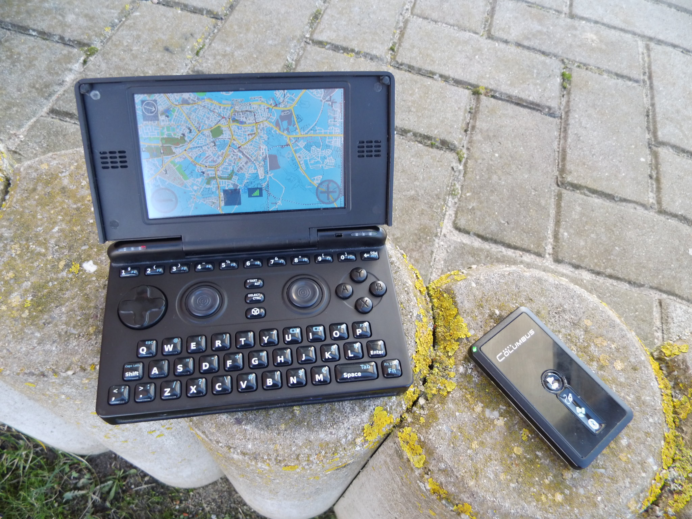

OpenPandora
===========

   OpenPandora with external GPS

(Super)Zaxxon
-------------

-  get `the .PND <http://repo.openpandora.org/?page=detail&app=navit>`__
   and place it on your SD card e.g. /mnt/mmc2/pandora/menu/
-  get `a default
   navit.xml <http://navit.svn.sourceforge.net/viewvc/navit/trunk/navit/navit/navit_shipped.xml?view=log>`__
   and place it at /mnt/mmc2/pandora/appdata/navit/navit.xml
-  download `Maps <Maps>`__ and put the .bin file at
   /mnt/mmc2/pandora/appdata/navit/maps/test.bin
-  get espeak:

.. code:: bash

   sudo opkg install http://www.angstrom-distribution.org/feeds/unstable/ipk/glibc/armv7a/base/libportaudio2_v19+svnr1387-r0.6_armv7a.ipk
   sudo opkg install http://www.angstrom-distribution.org/feeds/unstable/ipk/glibc/armv7a/base/espeak_1.37-r0.5_armv7a.ipk

and test it:

.. code:: bash

   espeak 'This is just a short test.'

.. _connect_gps:

Connect GPS
~~~~~~~~~~~

+----------------------------------+----------------------------------+
| | **Bluetooth:**                 | | **USB:**                       |
| |  Power up your GPS device,     | | Connect you USB GPS and open a |
|   enable bluetooth at the        |   terminal and execute:          |
|   Pandora Manager and open a     |                                  |
|   terminal and execute:          | .. code:: bash                   |
|                                  |                                  |
| .. code:: bash                   |    dmesg                         |
|                                  |                                  |
|    hcitool scan                  | | This should contain a line     |
|                                  |   announcing a new USB device    |
| Mark and copy your BTaddr and    |   and that it is attached to a   |
| paste it in the following lines  |   virtual serial port as         |
|                                  |   /dev/ttyUSB0 or /dev/ttyACM0   |
| .. code:: bash                   | | Now test your virtual          |
|                                  |   connection in a new terminal:  |
|    s                             |                                  |
| udo hcitool cc AA:BB:CC:DD:EE:FF | .. code:: bash                   |
|    sudo rfcomm c                 |                                  |
| onnect rfcomm0 AA:BB:CC:DD:EE:FF |    cat /dev/ttyUSB0              |
|                                  |                                  |
| | This should work fine and the  | This should show up scrolling    |
|   GPS should show an established | lines with GP\* prefix           |
|   BT link.                       |                                  |
| | Now test your virtual          |                                  |
|   connection:                    |                                  |
|                                  |                                  |
| .. code:: bash                   |                                  |
|                                  |                                  |
|    cat /dev/rfcomm0              |                                  |
|                                  |                                  |
| This should show up scrolling    |                                  |
| lines with GP\* prefix           |                                  |
+----------------------------------+----------------------------------+

.. _adapt_configuration:

Adapt configuration
~~~~~~~~~~~~~~~~~~~

-  Open the navit.xml file
-  search for <config ...> and add within language="de_DE" with your
   appropriated language Code (e.g. en_GB)

.. code:: xml

   <config xmlns:xi="http://www.w3.org/2001/XInclude" language="de_DE">

-  search for "binfile" and replace

.. code:: xml

   <mapset enabled="yes">
       <map type="binfile" enabled="yes" data="$NAVIT_SHAREDIR/maps/*.bin"/>
   </mapset>

-  search for "gpsd" and replace:

   -  rfcomm0 for attached Bluetooth GPS
   -  ttyS0 for attached USB GPS

.. code:: xml

   <vehicle name="Local GPS" profilename="car" enabled="yes" active="1" source="file://dev/rfcomm0">

-  search for "speech" and adapt

.. code:: xml

   <speech type="cmdline" data="espeak -v german '%s'" cps="15" />

Todo
----

-  OSD for cassual users (#1 routing, #2 map browsing, ...)
-  Make use of pandora buttons
-  Skin like minimenu

.. _see_also:

See also
--------

-  `OpenPandora development <OpenPandora_development>`__
-  `Discussion on
   board.openpandora.org <http://boards.openpandora.org/index.php/topic/11559-navit/>`__
-  `GPS on the pandorawiki.org <http://pandorawiki.org/GPS>`__
