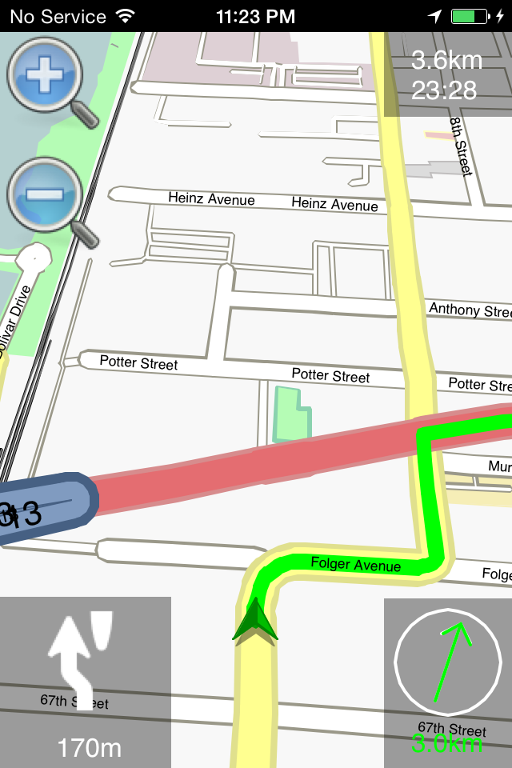
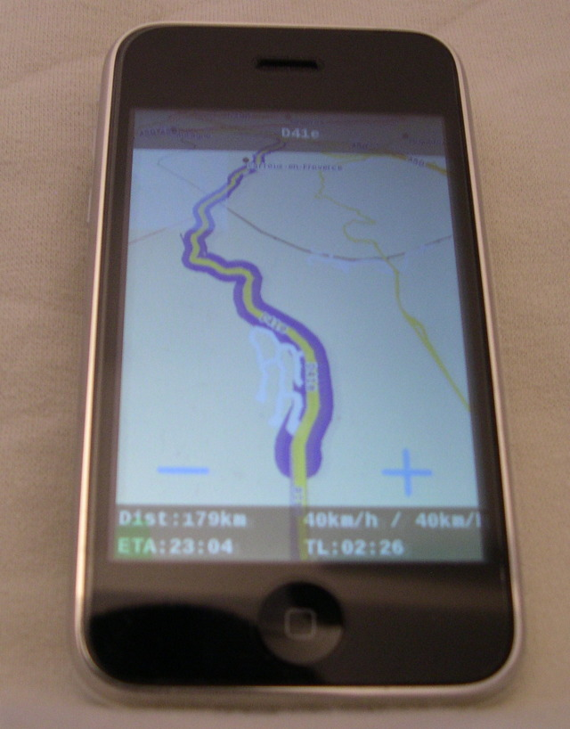
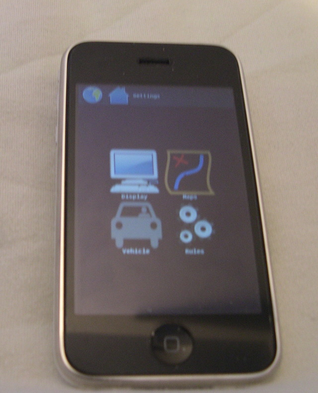

IOS
===

.. _on_a_jailbroken_device:

On a jailbroken device
======================



   Iphone4-20160622.png

-  Download a .deb from download.navit-project.org/navit/iphone/svn/
-  copy the .deb via sftp to /var/root/Media/Cydia/AutoInstall/
-  reboot to install the .deb
-  copy a map to /var/mobile/Media/Maps
-  find your navit.xml file. Mine was in
   /private/var/stash/_.c3HQr7/Applications/Navit.app/share/navit/navit.xml
-  edit this file to fix the map path, which should be

Results on git revision f1045d4 (Jun 14, 2016) : What works:

-  vehicle position
-  map loading
-  routing works, tested using OSM maps

What does not work:

-  entering the search menu makes Navit crash. Probably a locale setting
-  entering fullscreen mode makes Navit crash

.. _home_made_packages_on_osx:

Home made packages on OSX
=========================

Prepare your build environment :

-  you will need the xocde command line : xcode-select --install
-  brew install cmake
-  brew install gettext
-  brew link --force gettext

You will also need a converter for the svg's

cmake -G Xcode ../navit-trunk
-DCMAKE_TOOLCHAIN_FILE=Toolchain/xcode-iphone.cmake -DUSE_PLUGINS=0
-DBUILD_MAPTOOL=0 -DSAMPLE_MAP=0 -DXSLTS=iphone

xcodebuild -configuration RelWithDebInfo (or import it into the xcode
gui to proceed and have more configuration options)

Use the path to your sources for ../navit-trunk in the cmake command

revealing the following problems :

-  https://cmake.org/cmake/help/v3.1/policy/CMP0008.html (concerns
   libz.tbd)
-  on recent sdk's wordexp.h is found but unusable, make it use the
   version from support

building and running it on sdk>=8 leads to ERROR: org.navitproject.navit
is depending on legacy on-demand authorization, which is not supported
for new apps

some workarounds were inserted in
https://github.com/navit-gps/navit/tree/iOS_9.3_hacks

Configure with cmake and then import it in the xcode gui. Add -lz to
other linker flags for the navit target as a workaround for the \*.tbd
issue Now you can select the iPhone4s or 5 simulator as target device
and build it, you can also sideload it to a 4s or 5 connected physical
device and no jailbreaking required. Installing maps is supposed to be
possible with iTunes.

If you try to build it for an arm64 device, all the implicit
declarations become errors. They are all related to the code in
support/glib, but when each of them is fixed the build also works for
arm64. Testing on 4s and 5 iPhoneSimulator iOS 9.3 revealed search,
routing and navigation to be working. This can probably be built for and
used down to iOS 8.0 because no sdk tests were added to the workarounds
for lower SDK's. No signing certificate is needed to sideload it onto a
physically connected device. Supposedly maps can be installed with
iTunes.

.. _old_content_kept_below_for_reference_until_we_fix_the_build:

Old content kept below for reference until we fix the build
===========================================================

.. _screenshots_and_videos:

Screenshots and Videos
----------------------

|Iphone_screen1.jpg| |Iphone_screen2.jpg|

Status
------

.. _what_works:

What works
~~~~~~~~~~

-  Routing
-  GPS updates
-  OSM maps
-  Speech
-  Track logs
-  Landscape/Portrait mode

.. _what_does_not:

What does not
~~~~~~~~~~~~~

-  speech (play failure since 3.0)

.. _what_was_not_tested:

What was not tested
~~~~~~~~~~~~~~~~~~~

-  Garmin maps (Last binary includes Garmin driver but not tested ...)
-  Others maps

.. _concerning_opentoolchain:

Concerning Opentoolchain
------------------------

.. _cydia_packages:

Cydia packages
~~~~~~~~~~~~~~

**Temporarily**, Packages are available through this below repository:

*``main``\ ````\ ``(r2307)``*\ ``: ``\ ```http://download.navit-project.org/navit/iphone/cydia/`` <http://download.navit-project.org/navit/iphone/cydia/>`__\ `` ``

From Cydia go to Manage > Sources > Edit > Add and add one of the above
URL there. Then Search->"navit", install it .

By default, navit is expecting OSM maps:

| ``/var/mobile/Media/Maps/eu.bin``
| ``or``
| ``/var/mobile/Media/Maps/planet.bin``

For example, you can either use:

-  iphone terminal and wget:

| ``iphone$ cd /var/mobile/Media``
| ``iphone$ mkdir Maps``
| ``iphone$ cd Maps``
| ``iphone$ wget ``\ ```http://maps.navit-project.org/planet.bin`` <http://maps.navit-project.org/planet.bin>`__

Or

-  openssh

| ``PC$ wget ``\ ```http://maps.navit-project.org/planet.bin`` <http://maps.navit-project.org/planet.bin>`__
| ``PC$ scp planet.bin root@xxx.xxx.xxx.xxx:/var/mobile/Media/Maps/planet.bin``

xxx.xxx.xxx.xxx is the ip of your iphone.

enjoy having your free GPS on your iPhone.

.. _home_made_packages:

Home made packages
~~~~~~~~~~~~~~~~~~

I assume that your cross-compiler is ready and that you are able to
generate telesphoreo packages.

-  Cross-compiler:
   `1 <http://code.google.com/p/iphonedevonlinux/wiki/Installation>`__
-  Telesphoreo: `2 <http://www.telesphoreo.org/>`__

| ``svn co ``\ ```http://svn.telesphoreo.org/trunk`` <http://svn.telesphoreo.org/trunk>`__\ ``  ``
| ``export PATH=$PATH:$WHEREIS_YOUR_TOOLCHAIN/toolchain/pre/bin``
| ``export PKG_BASE=~/WHEREIS_TELESPHOREO/trunk``
| ``export PKG_ARCH=iphoneos-arm``
| ``export PKG_CONFIG_LIBDIR=~/``

Libraries
^^^^^^^^^

First you will need to compile below libraries:

-  FreeType
-  FontConfig
-  SDL
-  SDL_image
-  Png
-  ImageMagick
-  Jpeg6b (optional)
-  Tiff (optional)

Png, tiff, Imagemagick are already available on telesphoreo which is the
APT-based distribution of Unix software for modern smartphones started
by Jay Freeman (saurik). So you can download it from Cydia. For others,
you will find all necessary telesphoreo patches on below ticket:
`3 <http://www.telesphoreo.org/ticket/159>`__

`` patch -p0 < sdl_ft_fc_jpg_new_packages_telesphoreo.diff``

Then we can deal with Navit code.

Navit
^^^^^

Please find below telesphoreo patch for navit:

| ``r2391-2:``\ ```http://szndvc.dyndns.org/navit/telesphoreo_r2391_2.diff`` <http://szndvc.dyndns.org/navit/telesphoreo_r2391_2.diff>`__\ `` (full patch + deps)``
| ``r2391+garmin:``\ ```http://szndvc.dyndns.org/navit/telesphoreo_r2391_garmin.diff`` <http://szndvc.dyndns.org/navit/telesphoreo_r2391_garmin.diff>`__\ `` (full patch + deps)``
| ``r2391:``\ ```http://szndvc.dyndns.org/navit/telesphoreo_r2391.diff`` <http://szndvc.dyndns.org/navit/telesphoreo_r2391.diff>`__\ `` (full patch + deps)``
| ``r2307:``\ ```http://www.telesphoreo.org/ticket/167`` <http://www.telesphoreo.org/ticket/167>`__

Navit patch:

| ``r2391-2:``\ ```http://szndvc.dyndns.org/navit/navit_r2391_2.diff`` <http://szndvc.dyndns.org/navit/navit_r2391_2.diff>`__
| ``r2391+garmin:``\ ```http://szndvc.dyndns.org/navit/navit_r2391_garmin.diff`` <http://szndvc.dyndns.org/navit/navit_r2391_garmin.diff>`__
| ``r2391:``\ ```http://szndvc.dyndns.org/navit/navit_r2391.diff`` <http://szndvc.dyndns.org/navit/navit_r2391.diff>`__
| ``r2307:``\ ```http://szndvc.dyndns.org/navit/navit_r2307.diff`` <http://szndvc.dyndns.org/navit/navit_r2307.diff>`__

Metadata:

```http://szndvc.dyndns.org/navit/navit.app.tar.gz`` <http://szndvc.dyndns.org/navit/navit.app.tar.gz>`__

**This is a draft !!**

I know, there are some obvious workarounds and hacks! and my OBJC is
rusty :)

Includes:

-  [Iphone] New vehicle type: Iphone GPS coordinate reading
-  [SDL] options in config file for BPP and NOFRAME (2391)
-  [OSM] search in unknown city (without is_in tag)
-  [OSD] Announcer toggle fix
-  [DBG] Added HAVE_NO_DEBUG (Iphone does not like hash calculation :))
-  [NAV] Added tell_street_name in configuration file (2391)
-  [CONFIG] Navit XML configuration file for Iphone
-  [FILE] !!Dirty!! Hacking file_wordexp_new(). Indeed wordexp seems to
   not work on my env :(. All "*" for file path are not allowed yet.
   Direct path only.
-  [BUILD] !!Dirty!! with disable-plugins mode, darwin gcc seems to not
   link plugins from \*.la => Force link against .o and add all libs to
   navit_LDADD
-  [EXTRA] Iphone application metadata (icons ...)

Once your telesphoreo source code is patched with additional libs and
Navit. Just enter below command

``./package.sh navit ``

It will build navit and all other dependencies (above libs).

Upload your deb files (scp,ssh,...) to your device and install them
thanks to dpkg ...

| ``dpkg -i fontconfig_2.6.0-1_iphoneos-arm.deb``
| ``dpkg -i freetype_2.3.9-5_iphoneos-arm.deb``
| ``dpkg -i sdl-image_1.2.0-r4521-4_iphoneos-arm.deb``
| ``dpkg -i sdl_1.3.0-r4521-1_iphoneos-arm.deb``
| ``dpkg -i jpeg_6b-14-x_iphoneos-arm.deb``
| ``dpkg -i navit_0.1.0-r2307-x_iphoneos-arm.deb``

**Then Have fun :)**

Config
------

OSM map files are expected as below:

| ``/var/mobile/Media/Maps/eu.bin``
| ``/var/mobile/Media/Maps/planet.bin``

A new navit.xml can be copied into */var/mobile/.navit/*

Video
~~~~~

Frame and bpp options have been added

Speech
~~~~~~

Get **festival** library + **Erica utilities** on Cydia. Then change
your speech configuration in "/var/mobile/.navit/navit.xml" to

`` ``\ 

.. _test_feedback:

Test feedback
-------------

-  OSM: Routing is very slow (long distance is a nightmare for user :()
   (Almost fixed with CACHE_SIZE define)



